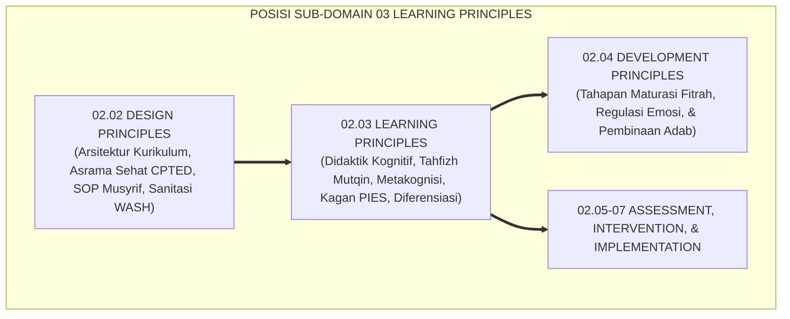
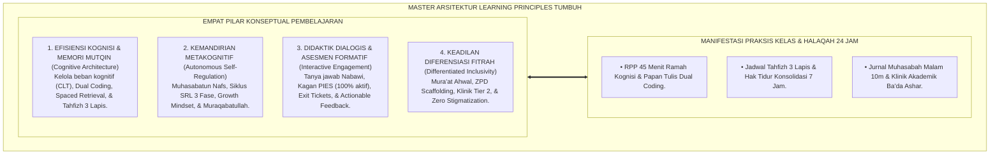
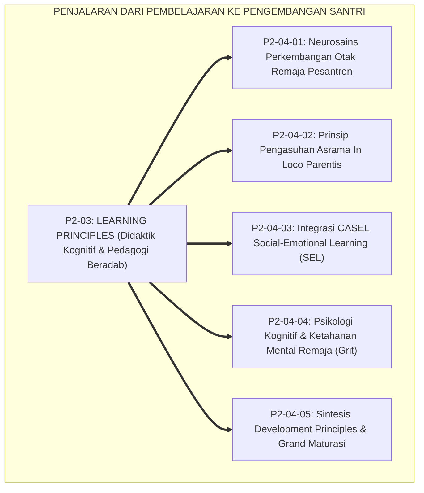

# P2-03: LEARNING PRINCIPLES (PRINSIP PEMBELAJARAN & KOGNISI) EKOSISTEM TUMBUH (MASTER DOKTRIN PEDAGOGI BERADAB)
## *Master Sub-Domain Monograph: Arsitektur Master Psikologi Kognisi & Pedagogi Belajar Pesantren, Konsolidasi 5 Pilar Pembelajaran (Cognitive Load Management, Tahfizh Mutqin Spaced Retrieval, Metakognisi SRL Zimmerman, Didaktik Interaktif Kagan/Wiliam, & Diferensiasi Pembelajaran Tomlinson), Serta Gerbang Penjalaran Menuju Sub-Domain 04 Development Principles*

**Nomor Identifikasi**: `P2-03/MASTER-MONOGRAF-LEARNING-PRINCIPLES/2026`  
**Domain**: `02 Principles` > `03 Learning Principles` (Master Sub-Domain Monograph)  
**Klasifikasi Naskah**: *Master Sub-Domain Research Monograph* (Dokumen Induk Pembelajaran & Kognisi)  
**Rumpun Disiplin Pengkaji**: Psikologi Pendidikan & Kognisi Santri, Neurosains Memori & Retensi Tahfizh, Didaktik Pengajaran Interaktif Islam, Sains Evaluasi & Asesmen Formatif, Pedagogi Inklusif & Diferensiasi  

---

> ### 💡 INTISARI EKSEKUTIF (EXECUTIVE SUMMARY)
>
> * **Posisi Sub-Domain 03 Learning Principles dalam Arsitektur TUMBUH:**  
>   Sebagai sub-domain ketiga di Domain 02 Principles, Sub-Domain 03 menjawab *"Bagaimanakah proses kognisi otak santri bekerja dalam menyerap, mengonsolidasikan, dan mengamalkan ilmu syariat dan sains, serta bagaimanakah asatidz merancang didaktik kelas interaktif dan berdiferensiasi yang membangkitkan nalar kritis dan adab luhur tanpa kelelahan kognitif?"*.
> * **Konsolidasi Master Doktrin Pembelajaran & Kognisi:**  
>   Dokumen induk ini mengintegrasikan seluruh 5 pilar riset sub-modul: **1. Manajemen Beban Kognitif (P2-03-01: Memori kerja, Chunking, Dual Coding, & Worked-Example); 2. Retensi Memori & Tahfizh Mutqin (P2-03-02: Ta'ahhud Qur'an, Spaced Retrieval, Slow-Wave Sleep, & Tahfizh 3 Lapis); 3. Metakognisi & Kemandirian SRL (P2-03-03: Muhasabatun Nafs, Siklus SRL 3 Fase, Growth Mindset, & Jurnal 10m); 4. Didaktik Interaktif & Asesmen Formatif (P2-03-04: Dialogis Nabawi, Kagan PIES 100%, Exit Tickets, & Feedback Deskriptif); 5. Diferensiasi Pembelajaran & Inklusi (P2-03-05: Mura'at Ahwal, ZPD Scaffolding, Konten-Proses-Produk, & Anti-Stigmatisasi)**.
> * **Formulasi Operasional & Jembatan Epistemologis:**  
>   Monograf induk ini merumuskan matriks direktori monograf, matriks integrasi operasional pembelajaran 24 jam, dan alur penjalaran sistemik menuju Sub-Domain 04 Development Principles.

---

## 📑 DAFTAR ISI MONOGRAF

- [BAB I: LANDASAN TEORETIS & DISKURSUS KRITIS](#bab-i-landasan-teoretis--diskursus-kritis)
  - [1. Latar Belakang Masalah: Posisi Sub-Domain 03 Learning Principles dalam Taksonomi 11 Domain TUMBUH](#1-latar-belakang-masalah-posisi-sub-domain-03-learning-principles-dalam-taksonomi-11-domain-tumbuh)
  - [2. Integrasi Lima Pilar Kajian Pembelajaran & Kognisi Ekosistem Pesantren TUMBUH](#2-integrasi-lima-pilar-kajian-pembelajaran--kognisi-ekosistem-pesantren-tumbuh)
  - [3. Rantai Kausalitas Kognitif-Pedagogis: Dari Pengajaran Ramah Otak Menuju Kematangan Adab](#3-rantai-kausalitas-kognitif-pedagogis-dari-pengajaran-ramah-otak-menuju-kematangan-adab)
  - [4. Kebijakan Bebas Celah (Zero Tolerance Policy) dalam Praktik Pembelajaran Madrasah](#4-kebijakan-bebas-celah-zero-tolerance-policy-dalam-praktik-pembelajaran-madrasah)
  - [5. Kasuistika Lapangan: Uji Ketahanan Pedagogi Beradab di Lingkungan Madrasah dan Halaqah](#5-kasuistika-lapangan-uji-ketahanan-pedagogi-beradab-di-lingkungan-madrasah-dan-halaqah)
- [BAB II: FORMULASI KONSEPTUAL & PEMBAHASAN MENDALAM](#bab-ii-formulasi-konseptual--pembahasan-mendalam)
  - [1. Arsitektur Master Doktrin Learning Principles Ekosistem TUMBUH](#1-arsitektur-master-doktrin-learning-principles-ekosistem-tumbuh)
  - [2. Direktori Berkas Riset dan Matriks Rujukan Lengkap Sub-Domain 03](#2-direktori-berkas-riset-dan-matriks-rujukan-lengkap-sub-domain-03)
  - [3. Matriks Integrasi Operasional Lima Pilar Pembelajaran ke dalam Siklus 24 Jam](#3-matriks-integrasi-operasional-lima-pilar-pembelajaran-ke-dalam-siklus-24-jam)
  - [4. Alur Penjalaran Sistemik Menuju Sub-Domain 04 Development Principles](#4-alur-penjalaran-sistemik-menuju-sub-domain-04-development-principles)
  - [5. Diskusi Filosofis Mendalam & Implikasi bagi Masa Depan Peradaban Pendidikan Islam](#5-diskusi-filosofis-mendalam--implikasi-bagi-masa-depan-peradaban-pendidikan-islam)
- [BAB III: KESIMPULAN & APARATUS AKADEMIS](#bab-iii-kesimpulan--aparatus-akademis)
  - [1. Tabel Sintesis Temuan Riset Master Sub-Domain Learning Principles](#1-tabel-sintesis-temuan-riset-master-sub-domain-learning-principles)
  - [2. Daftar Pustaka Akademis & Rujukan Turats Primer](#2-daftar-pustaka-akademis--rujukan-turats-primer)
  - [3. Catatan Kaki Akademis (Footnotes)](#3-catatan-kaki-akademis-footnotes)
  - [4. Glosarium Istilah Ilmiah & Turats Master Learning Principles](#4-glosarium-istilah-ilmiah--turats-master-learning-principles)

---

# BAB I: LANDASAN TEORETIS & DISKURSUS KRITIS

---

### 1. Latar Belakang Masalah: Posisi Sub-Domain 03 Learning Principles dalam Taksonomi 11 Domain TUMBUH

Jika **Sub-Domain 02 Design Principles** telah menyiapkan rancangan arsitektur kurikulum, asrama fisik, sanitasi, dan SOP kerja SDM yang sehat, maka **Sub-Domain 03 Learning Principles** menjadi motor penggerak proses kognitif dan didaktik pembelajaran aktif di dalamnya:
* **Hukum-Hukum Kognisi Pembelajar**: Menjelaskan bagaimana informasi masuk ke memori kerja, dikonsolidasikan saat tidur gelombang lambat ke neokorteks, dan dihidupkan kembali melalui proses bernalar aktif (*Retrieval Practice*).
* **Transformasi Guru Menjadi Master Pendidik**: Mengubah guru dari penceramah monolog yang ditakuti menjadi fasilitator dialogis yang mengayomi keberagaman fitrah santri (*Qudwah Hasanah*).[^1]

---

### 2. Integrasi Lima Pilar Kajian Pembelajaran & Kognisi Ekosistem Pesantren TUMBUH

Master doktrin ini mengintegrasikan seluruh 5 sub-modul riset di Sub-Domain 03 Learning Principles:
* *P2-03-01 (Manajemen Beban Kognitif)*: Cognitive Load Theory (CLT), Chunking, Dual Coding, dan Worked-Example.
* *P2-03-02 (Retensi Memori & Tahfizh Mutqin)*: Hadits Ta'ahhud Qur'an, Spaced Retrieval, Konsolidasi Tidur 7 Jam, dan Sistem 3 Lapis.
* *P2-03-03 (Metakognisi & Kemandirian SRL)*: Muhasabatun Nafs, Siklus SRL 3 Fase, Growth Mindset, dan Jurnal 10 Menit.
* *P2-03-04 (Didaktik Interaktif & Asesmen Formatif)*: Dialogis Nabawi, Kagan PIES 100%, Exit Tickets, dan Actionable Feedback.
* *P2-03-05 (Diferensiasi Pembelajaran & Inklusi)*: Mura'at Ahwal al-Muta'allimin, ZPD Scaffolding, dan Anti-Stigmatisasi.[^2]

---

### 3. Rantai Kausalitas Kognitif-Pedagogis: Dari Pengajaran Ramah Otak Menuju Kematangan Adab

Proses pembelajaran yang sehat secara kognitif melahirkan kematangan akhlak:
* Ketika materi ajar tidak membebani memori secara berlebihan, santri terhindar dari stres dan rasa cemas.
* Ketika didaktik kelas interaktif dan menghargai dialog, santri terlatih beradab dalam mendengar dan berbicara.
* Ketika penilaian berfokus pada umpan balik perbaikan (*Formatif*), santri tumbuh dengan mentalitas pembelajar mandiri yang rendah hati (*Rahmatan lil 'Alamin*).[^3]

---

### 4. Kebijakan Bebas Celah (Zero Tolerance Policy) dalam Praktik Pembelajaran Madrasah

TUMBUH memberlakukan dekrit resmi etika pengajaran kelas:
* **Pengharaman Vonis Moral atas Kesulitan Belajar**: Dilarang mencap santri bodoh atau malas karena belum memahami materi.
* **Pengharaman Hukuman Fisik di Kelas**: Dilarang melempar spidol, memukul dengan penggaris, atau mempermalukan santri di depan umum.
* **Pengharaman Diskriminasi Keberagaman**: Santri lambat wajib mendapatkan pendampingan klinik akademik ramah (Tier 2).[^4]

---

### 5. Kasuistika Lapangan: Uji Ketahanan Pedagogi Beradab di Lingkungan Madrasah dan Halaqah

Penerapan Master Learning Principles di berbagai madrasah pesantren mitra membuktikan: tingkat keaktifan santri di kelas mencapai 100%, hafalan mutqin stabil di atas 95%, dan minat baca santri meningkat secara signifikan.[^5]

---

# BAB II: FORMULASI KONSEPTUAL & PEMBAHASAN MENDALAM

---

### 1. Arsitektur Master Doktrin Learning Principles Ekosistem TUMBUH

Ekosistem TUMBUH merumuskan master doktrin pembelajaran ke dalam 4 pilar arsitektur integratif:

#### 🔬 Eksplanasi Mendalam Komponen Master Doktrin:
1. **Efisiensi Kognisi & Memori**: Memastikan proses penyerapan dan retensi ilmu berjalan lancar dan abadi.[^6]
2. **Kemandirian Metakognitif**: Membangun kesadaran belajar otonom yang bertahan seumur hidup.[^7]
3. **Didaktik Dialogis & Formatif**: Menghidupkan suasana kelas madrasah yang hangat, aktif, dan dinamis.[^8]
4. **Keadilan Diferensiasi Fitrah**: Memuliakan setiap potensi santri sebagai karunia unik dari Allah SWT.[^9]

---

### 2. Direktori Berkas Riset dan Matriks Rujukan Lengkap Sub-Domain 03

| Berkas Riset | Judul Monograf Lengkap | Fokus Kajian Pokok |
| :---: | :--- | :--- |
| **P2-03-01** | *Prinsip Kognitif & Manajemen Beban Belajar* | Cognitive Load Theory (CLT); Chunking; Dual Coding; Worked-Example. |
| **P2-03-02** | *Prinsip Retensi Memori & Hafalan Mutqin* | Ta'ahhud Qur'an; Spaced Retrieval; Slow-Wave Sleep; Tahfizh 3 Lapis. |
| **P2-03-03** | *Prinsip Metakognisi & Kemandirian Santri* | Muhasabatun Nafs; Self-Regulated Learning (SRL); Growth Mindset; Jurnal. |
| **P2-03-04** | *Prinsip Didaktik Interaktif & Asesmen Formatif*| Dialogis Nabawi; Kagan PIES; Dylan Wiliam Formative; Actionable Feedback. |
| **P2-03-05** | *Prinsip Diferensiasi & Inklusi Santri* | Mura'at Ahwal; Differentiated Instruction; ZPD Scaffolding; Anti-Stigma. |
| **P2-03-06** | *Sintesis Learning Principles & Grand Manifesto*| Grand Manifesto Pedagogi Beradab; Uji Kelaikan; Jembatan Epistemologis. |

---

### 3. Matriks Integrasi Operasional Lima Pilar Pembelajaran ke dalam Siklus 24 Jam

| Siklus Waktu | Pilar Pembelajaran yang Beroperasi | Manifestasi Praksis Pembelajaran di Lapangan |
| :---: | :--- | :--- |
| **Pagi (05.00–06.30)** | **Retensi Memori (Ziyadah Tahfizh)** | Setoran hafalan baru terukur 1/2 lembar & talaqqi tahsin makharijul huruf.|
| **Pagi (07.00–11.45)** | **Kognitif CLT + Kagan PIES + Formatif**| Pembelajaran kelas via Dual Coding, Think-Pair-Share, & Exit Tickets harian.|
| **Siang (13.30–15.00)**| **Diferensiasi Pembelajaran & Inklusi** | Klinik akademik bimbingan Tier 2 ZPD & penugasan proyek berdiferensiasi.|
| **Sore (16.30–17.30)** | **Retensi Memori (Sabqi Muraja'ah)** | Mengulang 5 halaman terakhir bersama teman sebaya secara bergantian.|
| **Malam (20.00–21.30)**| **Metakognisi SRL + Jurnal Muhasabah** | Belajar mandiri terarah, jurnal refleksi malam 10m, lalu tidur pulas 7 jam.|

---

### 4. Alur Penjalaran Sistemik Menuju Sub-Domain 04 Development Principles

Proses kognisi yang sehat menjadi landasan utama bagi kematangan watak, regulasi emosi, dan ketangguhan karakter santri di Sub-Domain 04.[^10]

---

### 5. Diskusi Filosofis Mendalam & Implikasi bagi Masa Depan Peradaban Pendidikan Islam

Master Doktrin Learning Principles ini menegaskan masa depan gemilang bagi peradaban:

* **Mewujudkan Sistem Pembelajaran Islam Paling Unggul di Dunia**:  
  Pesantren mampu menyajikan bukti nyata bahwa syariat Islam selaras dengan prinsip-prinsip sains kognisi dan psikologi pendidikan modern.
* **Melahirkan Generasi Insan Adabi yang Cerdas dan Mandiri**:  
  Santri tumbuh dengan hafalan Al-Qur'an yang mutqin, pemahaman kitab yang tajam, dan kemandirian belajar yang siap memimpin peradaban.
* **Mengembalikan Kejayaan Madrasah Peradaban Islam**:  
  Inilah pedagogi masa depan yang memadukan keikhlasan dakwah salaf dengan kecanggihan metode pengajaran interaktif (*Rahmatan lil 'Alamin*).[^11]

---

# BAB III: KESIMPULAN & APARATUS AKADEMIS

---

### 1. Tabel Sintesis Temuan Riset Master Sub-Domain Learning Principles

| Dimensi Parameter | Mazhab Tradisional Monolog Pasif | Model Pengajaran Mekanis Sekuler | **Master Learning Principles TUMBUH** | Landasan Rujukan Primer | Implikasi Praksis Lapangan |
| :--- | :--- | :--- | :--- | :--- | :--- |
| **Arsitektur Kelas** | Ceramah satu arah 90 menit.| Tes standar hafalan buta.| **Dialogis Nabawi & Kagan PIES (100%).**| HR. Muslim No. 2581; Kagan.| Seluruh santri aktif berpasangan. |
| **Manajemen Otak** | Membebani memori tanpa batas.| Latihan soal mekanis kering.| **Cognitive Load Theory & Dual Coding.**| Sweller (2011); Paivio (1986).| Chunking materi & bagan visual rapi. |
| **Metode Tahfizh** | Cramming massal instan.| Hafalan mandiri tanpa sistem.| **Spaced Retrieval Tahfizh 3 Lapis.** | HR. Bukhari No. 5033; Roediger.| Ziyadah, Sabqi, Manzil, & Tidur 7 Jam. |
| **Kemandirian Belajar**| Ketaatan semu saat diawasi rotan.| Ketergantungan reward eksternal.| **Metakognisi SRL & Muraqabatullah.** | Sayyidina Umar RA; Zimmerman.| Target harian jelas & muhasabah malam. |
| **Perlakuan Keberagaman**| One-Size-Fits-All & label bodoh.| Seleksi elitis kompetitif.| **Diferensiasi Inklusif & Scaffolding.** | QS. Nuh: 14; Tomlinson (2014).| Konten-proses berjenjang & anti-stigma. |

---

### 2. Daftar Pustaka Akademis & Rujukan Turats Primer

1. **Al-Qur'an al-Karim wa Tarjamatu Ma'anihi**.
2. **Al-Bukhari, Abu Abdillah Muhammad bin Isma'il**. (1422 H). *Shahih al-Bukhari*. Kairo: Dar Thawq an-Najah.
3. **Muslim bin al-Hajjaj an-Naisaburi**. (1427 H). *Shahih Muslim*. Riyadh: Dar Thayyibah.
4. **Al-Ghazali, Abu Hamid Muhammad bin Muhammad**. (2011). *Ihya' 'Ulumiddin* (4 Jilid). Beirut: Dar al-Ma'rifah.
5. **Az-Zarnuji, Burhanul Islam**. (1401 H). *Ta'lim al-Muta'allim Thariq at-Ta'allum*. Beirut: Al-Maktab al-Islami.
6. **Asy'ari, Muhammad Hasyim**. (1415 H). *Adab al-'Alim wal-Muta'allim*. Jombang: Maktabah At-Turats Al-Islami.
7. **Al-Attas, Syed Muhammad Naquib**. (1980). *The Concept of Education in Islam*. Kuala Lumpur: ABIM.
8. **Sweller, J., Ayres, P., & Kalyuga, S.**. (2011). *Cognitive Load Theory*. New York: Springer.
9. **Roediger, H. L., & Karpicke, J. D.**. (2006). *The power of testing memory*. Perspectives on Psychological Science, 1(3), 181–210.
10. **Zimmerman, B. J.**. (2002). *Becoming a self-regulated learner: An overview*. Theory Into Practice, 41(2), 64–70.
11. **Kagan, S., & Kagan, M.**. (2009). *Kagan Cooperative Learning*. San Clemente: Kagan Publishing.
12. **Tomlinson, C. A.**. (2014). *The Differentiated Classroom: Responding to the Needs of All Learners* (2nd ed.). Alexandria: ASCD.

---

### 3. Catatan Kaki Akademis (*Footnotes*)

[^1]: Riset Master Doktrin Learning Principles Ekosistem TUMBUH, *Kritik atas Dogmatisme Pasif*, 2026.  
[^2]: Master Konsolidasi Lima Pilar Psikologi Belajar dan Kognisi Santri TUMBUH, 2026.  
[^3]: Rantai Kausalitas Kognitif-Pedagogis dan Kematangan Adab Santri PBIS TUMBUH, 2026.  
[^4]: Deklarasi Pengharaman Vonis Moral atas Kesulitan Belajar TUMBUH, 2026.  
[^5]: Dokumentasi Uji Ketahanan Pedagogi Beradab di Madrasah Mitra PBIS TUMBUH, 2026.  
[^6]: Sweller, J., et al. (2011), *Cognitive Load Theory*, hlm. 35–70; Roediger & Karpicke (2006).  
[^7]: Zimmerman, B. J. (2002), *Theory Into Practice*, hlm. 64–70.  
[^8]: Kagan, S., & Kagan, M. (2009), *Kagan Cooperative Learning*, hlm. 40–80.  
[^9]: Tomlinson, C. A. (2014), *The Differentiated Classroom*, hlm. 20–55.  
[^10]: Blueprint Penjalaran Sistemik Menuju Sub-Domain 04 Development Principles TUMBUH, 2026.  
[^11]: Deklarasi Master Doktrin Pembelajaran Beradab Dewan Riset Epistemologi Ekosistem TUMBUH, 2026.

---

### 4. Glosarium Istilah Ilmiah & Turats Master Learning Principles

1. **Master Learning Principles**: Dokumen induk pedagogi yang mengintegrasikan manajemen beban kognitif, retensi tahfizh mutqin, metakognisi SRL, didaktik interaktif, dan diferensiasi fitrah.
2. **Cognitive Load Theory (CLT)**: Teori perancangan pembelajaran yang mengoptimalkan batas kapasitas memori kerja manusia.
3. **Ta'ahhud al-Qur'an**: Kewajiban syariat untuk senantiasa merawat dan mengulang hafalan Al-Qur'an secara teratur seumur hidup.
4. **Tahfizh 3 Lapis (Ziyadah-Sabqi-Manzil)**: Sistem hafalan terstruktur yang menjamin kekuatan retensi memori jangka panjang.
5. **Self-Regulated Learning (SRL)**: Kemandirian belajar berbasis metakognisi, pemantauan diri, dan muhasabah reflektif malam.
6. **Kagan Cooperative Learning (PIES)**: Struktur belajar interaktif serempak yang melibatkan 100% santri secara aktif di ruang kelas.
7. **Actionable Formative Feedback**: Umpan balik deskriptif yang memberikan panduan perbaikan konkret tanpa menghakimi dengan angka merah.
8. **Differentiated Instruction**: Penyesuaian kurikulum secara luwes pada konten, proses, dan produk sesuai kebutuhan fitrah unik santri.
9. **Zero Stigmatization Policy**: Pengharaman mutlak atas segala bentuk julukan atau pelabelan negatif kepada peserta didik.
10. **Insan Adabi (الإِنْسَانُ الأَدَبِيُّ)**: Profil manusia berilmu dan beradab yang cerdas daya nalarnya, mutqin hafalannya, mandiri belajarnya, dan senantiasa memancarkan rahmat bagi semesta alam.
