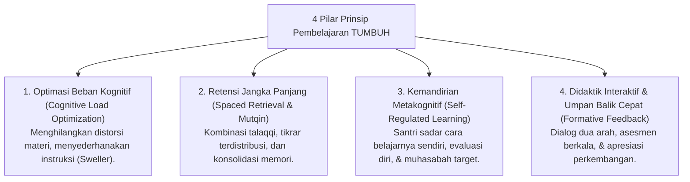

# P2-03-Prinsip-Psikologi-Belajar-TUMBUH (Learning Principles Induk)

## Tujuan
Menetapkan prinsip-prinsip psikologi belajar (*Learning Principles*) di dunia pesantren, memadukan adab *Thalabul 'Ilmi* dari khazanah Turats dengan konsensus sains kognitif modern (*Cognitive Science*) untuk mewujudkan pembelajaran yang mendalam, bermakna, mutqin, dan memberdayakan santri.

---

## 1. 4 Pilar Prinsip Pembelajaran TUMBUH

---

## 2. Rincian 4 Pilar Prinsip Belajar

### 1. Optimasi Beban Kognitif (*Managing Cognitive Load*)
* Memori kerja (*working memory*) manusia memiliki kapasitas terbatas (7 ± 2 unit informasi).
* Pengajaran di kelas dan halaqah tahfizh wajib membedakan antara **Beban Hakiki Materi (*Intrinsic Load*)** dan **Beban Pengganggu (*Extraneous Load*)**.
* Asatidz dilarang memberikan ceramah monoton 90 menit tanpa jeda interaksi atau visualisasi konsep.

### 2. Retensi Jangka Panjang & Metode Mutqin (*Spaced Retrieval Practice*)
* Menghafal Al-Qur'an dan matan kitab dengan cara sistem kebut semalam (*cramming*) hanya menghasilkan ingatan jangka pendek yang cepat hilang.
* TUMBUH menerapkan pengulangan terdistribusi (*Spaced Repetition / Tikrar Manhaji*) dan tes mandiri (*Active Retrieval*) yang terbukti secara neurobiologis memperkuat jalur sinapsis di hipokampus.

### 3. Kemandirian Metakognitif (*Self-Regulated Learning*)
* Santri tidak dididik menjadi pembelajar pasif yang hanya menunggu disuapi ilmu.
* Santri dilatih memiliki kesadaran metakognitif: merencanakan target harian (*Forethought*), memonitor fokus belajarnya (*Performance Control*), dan mengevaluasi kekurangannya secara jujur (*Self-Reflection*).

### 4. Didaktik Interaktif & Umpan Balik Formatif (*Interactive Didactics & Formative Feedback*)
* Mengadopsi metode Rasulullah ﷺ: mengajukan pertanyaan pemantik, perumpamaan konkret (*tamsil*), dan memberikan koreksi langsung yang membesarkan hati santri (*Hattie: Effect Size d = 0.70*).

---

## 3. Status Dokumen
* **Status**: 🌟 **A+ (Dokumen Induk Learning Principles)**
* **Level**: Project 2 - `02 Principles / 03 Learning Principles`
* **Langkah Berikutnya**: **`P2-03-01-Prinsip-Kognitif-dan-Manajemen-Beban-Belajar.md`**.
