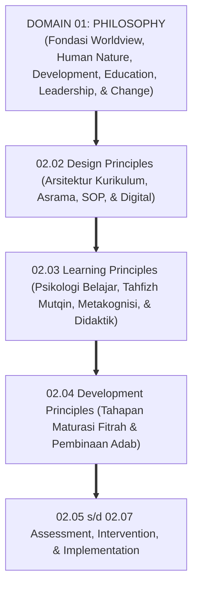
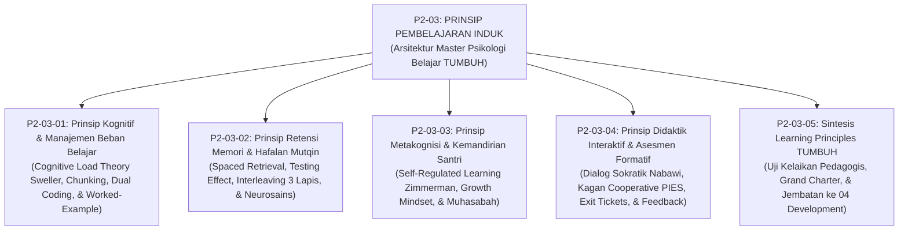
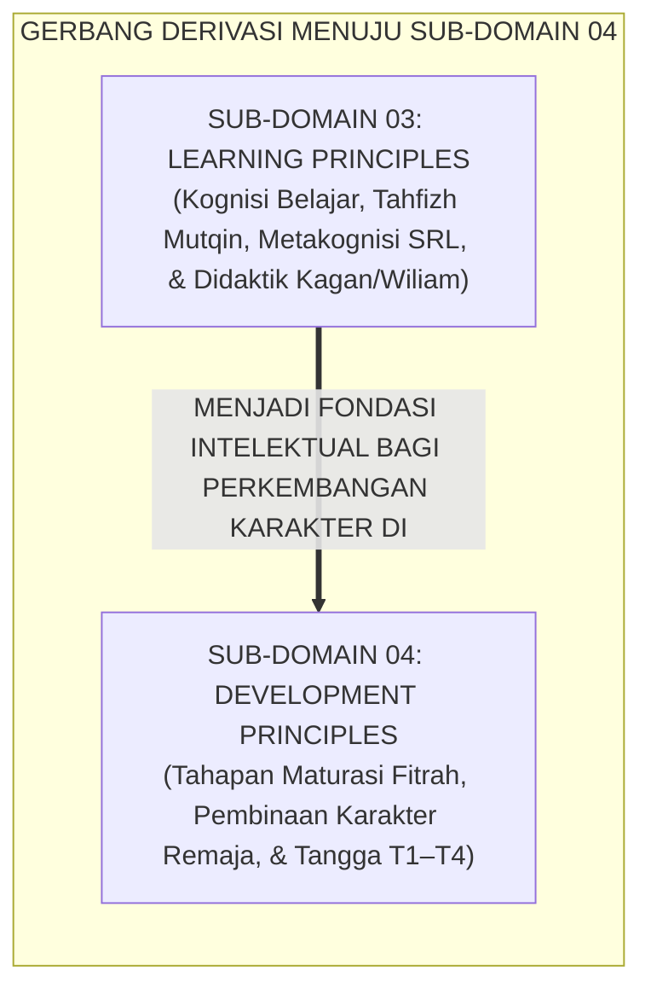

# P2-03: LEARNING PRINCIPLES (PRINSIP PEMBELAJARAN & KOGNISI) EKOSISTEM TUMBUH
## *Monograf Induk Sub-Domain 03: Arsitektur Master Psikologi Kognisi & Pedagogi Belajar Pesantren, Rekapitulasi 4 Pilar Pembelajaran (Cognitive Load Management, Tahfizh Mutqin Spaced Retrieval, Metakognisi SRL Zimmerman, & Didaktik Interaktif Kagan/Wiliam), serta Gerbang Derivasi Menuju Sub-Domain 04 Development Principles*

**Nomor Identifikasi**: `P2-03/MONOGRAF-INDUK-LEARNING-PRINCIPLES/2026`  
**Domain**: `02 Principles` > `03 Learning Principles`  
**Klasifikasi Naskah**: *Master Sub-Domain Monograph* (Monograf Induk Sub-Domain Prinsip Pembelajaran & Kognisi)  
**Rumpun Disiplin Pengkaji**: Psikologi Pendidikan & Kognisi Santri, Neurosains Memori & Retensi Tahfizh, Didaktik Pengajaran Interaktif Islam, Sains Evaluasi & Asesmen Formatif  

---

> ### 💡 INTISARI PRAKTIS (3 MENIT PAHAM UNTUK ASATIDZ & MUSYRIF)
>
> * **Posisi Sub-Domain 03 Learning Principles:**  
>   Menjawab pertanyaan mendasar ketiga dalam ekosistem pesantren: *"Bagaimanakah proses kognisi otak santri bekerja dalam menyerap, mengonsolidasikan, dan mengamalkan ilmu syariat dan sains, serta bagaimanakah asatidz merancang didaktik kelas interaktif yang membangkitkan nalar kritis dan adab luhur tanpa kelelahan kognitif?"*
> * **Empat Pilar Pembelajaran Ekosistem TUMBUH yang Terintegrasi:**  
>   1. **P2-03-01 (Manajemen Beban Kognitif):** Menghormati keterbatasan memori kerja santri lewat *Chunking*, *Dual Coding*, dan *Worked-Example Effect*.  
>   2. **P2-03-02 (Retensi Memori & Tahfizh Mutqin):** Mengunci hafalan permanen seumur hidup melalui metode *Spaced Retrieval*, *Testing Effect*, dan sistem 3 lapis (Ziyadah, Sabqi, Manzil).  
>   3. **P2-03-03 (Metakognisi & Kemandirian SRL):** Membina pembelajar mandiri otonom (*Self-Regulated Learner*), *Growth Mindset*, dan jurnal muhasabah harian 10 menit.  
>   4. **P2-03-04 (Didaktik Interaktif & Asesmen Formatif):** Mengaktifkan 100% santri secara serempak melalui struktur *Kagan Cooperative Learning*, *Exit Tickets*, dan umpan balik panduan tanpa vonis angka.
> * **Pijakan Kuat Bagi Perkembangan Karakter (04 Development Principles):**  
>   Proses belajar yang bermakna dan memanusiakan ini menjadi motor penggerak bagi **Prinsip-Prinsip Perkembangan Karakter Santri (*04 Development Principles*)**.

---

## 📑 DAFTAR ISI MONOGRAF INDUK

- [BAGIAN I: ARSITEKTUR ONTOLOGIS & POHON HUBUNGAN SUB-DOMAIN 03](#bagian-i-arsitektur-ontologis--pohon-hubungan-sub-domain-03)
  - [1. Posisi Dokumen dalam Taksonomi 11 Domain TUMBUH](#1-posisi-dokumen-dalam-taksonomi-11-domain-tumbuh)
  - [2. Pohon Hubungan Antar-Monograf Sub-Domain 03 Learning Principles](#2-pohon-hubungan-antar-monograf-sub-domain-03-learning-principles)
  - [3. Rangkuman 4 Pilar Psikologi Belajar & Kognisi Santri](#3-rangkuman-4-pilar-psikologi-belajar--kognisi-santri)
  - [4. Penegasan Triad Pertumbuhan Simbiotik dalam Pembelajaran](#4-penegasan-triad-pertumbuhan-simbiotik-dalam-pembelajaran)
- [BAGIAN II: KODIFIKASI MATRIKS RESMI & DIREKTORI MONOGRAF TERPADU](#bagian-ii-kodifikasi-matriks-resmi--direktori-monograf-terpadu)
  - [1. Matriks Rujukan Lengkap 5 Berkas Monograf Sub-Domain 03](#1-matriks-rujukan-lengkap-5-berkas-monograf-sub-domain-03)
  - [2. Gerbang Derivasi Menuju Sub-Domain 04 Development Principles](#2-gerbang-derivasi-menuju-sub-domain-04-development-principles)
- [BAGIAN III: APARATUS AKADEMIS & APENDIKS](#bagian-iii-aparatus-akademis--apendiks)
  - [1. Daftar Pustaka Otoritatif Turats & Sains Global](#1-daftar-pustaka-otoritatif-turats--sains-global)
  - [2. Catatan Kaki Akademis (Footnotes)](#2-catatan-kaki-akademis-footnotes)
  - [3. Glosarium Istilah Kunci Psikologi Belajar Induk](#3-glosarium-istilah-kunci-psikologi-belajar-induk)

---

# BAGIAN I: ARSITEKTUR ONTOLOGIS & POHON HUBUNGAN SUB-DOMAIN 03

---

### 1. Posisi Dokumen dalam Taksonomi 11 Domain TUMBUH

Jika **Sub-Domain 02 Design Principles** menyediakan wadah arsitektur kurikulum dan infrastruktur sistem, maka **Sub-Domain 03 Learning Principles** menetapkan **Bagaimana Proses Kognisi Belajar dan Interaksi Didaktik Antara Asatidz dan Santri Berjalan Secara Hidup di Dalam Kelas**:

---

### 2. Pohon Hubungan Antar-Monograf Sub-Domain 03 Learning Principles

Sub-Domain `03 Learning Principles` memuat 1 Monograf Induk dan 5 Monograf Riset Khusus yang saling menopang secara utuh:

---

### 3. Rangkuman 4 Pilar Psikologi Belajar & Kognisi Santri

1. **Pilar 1: Manajemen Beban Kognitif (P2-03-01)**:  
   Menyadari keterbatasan memori kerja santri (4–7 elemen informasi). Mengelola *Intrinsic Load* lewat segmentasi bertahap (*Chunking*), memadukan narasi lisan dan bagan visual (*Dual Coding Theory Allan Paivio*), menghapus total beban pengganggu (*Zero Extraneous Load*), dan mencontohkan langkah penalaran eksplisit (*Worked-Example Effect*).
2. **Pilar 2: Retensi Memori Jangka Panjang & Tahfizh Mutqin (P2-03-02)**:  
   Menghayati sunnah *Ta'ahhud al-Qur'an* (HR. Bukhari No. 5033) untuk mencegah kurva lupa Ebbinghaus. Menerapkan metode *Spaced Retrieval Practice* dan *Testing Effect* (menutup mushaf menguji ingatan mandiri), mengintegrasikan sistem 3 lapis (*Ziyadah, Sabqi, Manzil*), serta menjamin hak tidur lelap 7–8 jam untuk konsolidasi memori di neokorteks.
3. **Pilar 3: Metakognisi & Kemandirian Belajar SRL (P2-03-03)**:  
   Mentransformasi santri menjadi pembelajar mandiri otonom (*Autonomous Learner*) melalui siklus 3 fase *Self-Regulated Learning (SRL)* Barry Zimmerman (Perencanaan $\rightarrow$ Fokus Pelaksanaan $\rightarrow$ Refleksi Muhasabah). Menanamkan *Growth Mindset* Islami (akal berkembang lewat latihan ikhtiar) dan membudayakan Jurnal Muhasabah Belajar 10 menit setiap malam.
4. **Pilar 4: Didaktik Interaktif Kagan & Asesmen Formatif (P2-03-04)**:  
   Menghapus kelas ceramah monolog satu arah. Menerapkan seni mengajar dialogis Rasulullah SAW (*Amtsal* dan tanya-jawab pemantik nalar), struktur *Kagan Cooperative Learning* (prinsip *PIES* interaksi serempak), 5 strategi kunci Asesmen Formatif Dylan Wiliam (*Exit Tickets* & *Mini-Whiteboards*), serta umpan balik deskriptif panduan tanpa vonis angka merah.[^1]

---

### 4. Penegasan Triad Pertumbuhan Simbiotik dalam Pembelajaran

* **Santri Tumbuh**: Merasakan nikmatnya memahami ilmu (*Ladzdzatul 'Ilmi*), memiliki hafalan Al-Qur'an mutqin yang membahagiakan, tidak tertekan beban berlebih, dan mandiri mengatur waktu belajarnya.
* **Guru Tumbuh**: Mengajar dengan penuh percaya diri dan gembira, melihat seluruh santri aktif antusias di kelas, dan terbebas dari keputusasaan atau kemarahan saat mengajar.
* **Madrasah Tumbuh**: Memiliki sistem pembelajaran yang hidup dan bermutu tinggi, budaya kelas yang hangat dan beradab, serta mencetak lulusan ulama dan ilmuwan yang berintegritas.

---

# BAGIAN II: KODIFIKASI MATRIKS RESMI & DIREKTORI MONOGRAF TERPADU

---

### 1. Matriks Rujukan Lengkap 5 Berkas Monograf Sub-Domain 03

| Kode Berkas | Judul Naskah Monograf | Dewan Keilmuan Pengkaji | Tautan Berkas Markdown |
| :---: | :--- | :--- | :--- |
| **P2-03-01** | **Prinsip Kognitif dan Manajemen Beban Belajar** | `pakar-psikologi-belajar` `pakar-neurosains-perkembangan` `pakar-pedagogi-master-guru` | [**`Buka Naskah P2-03-01`**](./P2-03-01-Prinsip-Kognitif-dan-Manajemen-Beban-Belajar.md) |
| **P2-03-02** | **Prinsip Retensi Memori dan Hafalan Mutqin** | `pakar-psikologi-belajar` `pakar-epistemologi-turats` `pakar-neurosains-perkembangan` | [**`Buka Naskah P2-03-02`**](./P2-03-02-Prinsip-Retensi-Memori-dan-Hafalan-Mutqin.md) |
| **P2-03-03** | **Prinsip Metakognisi dan Kemandirian Santri** | `pakar-social-emotional-learning` `pakar-psikologi-belajar` `pakar-filosofi-tumbuh` | [**`Buka Naskah P2-03-03`**](./P2-03-03-Prinsip-Metakognisi-dan-Kemandirian-Santri.md) |
| **P2-03-04** | **Prinsip Didaktik Interaktif dan Asesmen Formatif** | `pakar-pedagogi-master-guru` `pakar-psikometri-dan-validasi-instrumen` `pakar-pbis` | [**`Buka Naskah P2-03-04`**](./P2-03-04-Prinsip-Didaktik-Interaktif-dan-Asesmen-Formatif.md) |
| **P2-03-05** | **Sintesis Learning Principles TUMBUH** | `pakar-filosofi-tumbuh` `pakar-kritikus-dan-auditor-kualitas` `pakar-pedagogi-master-guru` | [**`Buka Naskah P2-03-05`**](./P2-03-05-Sintesis-Learning-Principles-TUMBUH.md) |

---

### 2. Gerbang Derivasi Menuju Sub-Domain 04 Development Principles

---

# BAGIAN III: APARATUS AKADEMIS & APENDIKS

---

### 1. Daftar Pustaka Otoritatif Turats & Sains Global

1. **Al-Qur'an al-Karim wa Tarjamatu Ma'anih**.
2. **Al-Bukhari, Muhammad bin Isma'il**. (1422 H). *Shahih al-Bukhari*. Beirut: Dar Thawq an-Najah.
3. **Muslim bin al-Hajjaj an-Naisaburi**. (1374 H). *Shahih Muslim*. Kairo: Isa al-Babi al-Halabi.
4. **Al-Ghazali, Abu Hamid Muhammad bin Muhammad**. (2011). *Ihya 'Ulumiddin*. Beirut: Dar al-Ma'rifah.
5. **Az-Zarnuji, Burhanuddin**. (2008). *Ta'lim al-Muta'allim Thariq at-Ta'allum*. Beirut: Dar Ibn Hazm.
6. **Sweller, J., Ayres, P., & Kalyuga, S.**. (2011). *Cognitive Load Theory*. New York: Springer.
7. **Roediger, H. L., & Karpicke, J. D.**. (2006). *Test-enhanced learning*. Psychological Science.
8. **Zimmerman, B. J.**. (2002). *Becoming a self-regulated learner*. Theory Into Practice.
9. **Dweck, C. S.**. (2006). *Mindset: The New Psychology of Success*. Random House.
10. **Kagan, S., & Kagan, M.**. (2009). *Kagan Cooperative Learning*. Kagan Publishing.
11. **Wiliam, D.**. (2011). *Embedded Formative Assessment*. Solution Tree Press.

---

### 2. Catatan Kaki Akademis (*Footnotes*)

[^1]: Sweller (1988), *Cognitive Load Theory*; Roediger & Karpicke (2006), *Testing Effect*; Zimmerman (2002), *Self-Regulated Learning*; Wiliam (2011), *Embedded Formative Assessment*.

---

### 3. Glosarium Istilah Kunci Psikologi Belajar Induk

1. **Cognitive Load Management**: Pengendalian beban memori kerja santri agar kapasitas nalar teralokasikan secara efisien untuk pembentukan skema pemahaman.
2. **Spaced Retrieval**: Pengulangan ingatan hafalan secara berkala dengan interval jeda bertahap guna mengunci memori permanen seumur hidup.
3. **Self-Regulated Learning (SRL)**: Kemandirian santri dalam merencanakan, melaksanakan, memantau, dan merefleksikan proses belajarnya sendiri secara otonom.
4. **Growth Mindset**: Keyakinan bahwa akal dan kecerdasan berkembang melalui ikhtiar, latihan, strategi yang tepat, dan doa tawakal.
5. **PIES Framework**: Empat prinsip pembelajaran kooperatif Kagan (*Positive Interdependence, Individual Accountability, Equal Participation, Simultaneous Interaction*).
6. **Formative Assessment**: Asesmen berkelanjutan untuk memantau bukti pemahaman santri dan mengadaptasi strategi pengajaran guru secara *real-time*.
7. **Actionable Feedback**: Umpan balik pedagogis berbentuk komentar panduan yang memberikan langkah konkret perbaikan tanpa vonis angka.
8. **Triad Pertumbuhan Simbiotik**: Prinsip mutlak di mana keberhasilan pembelajaran menumbuhkan Santri, memuliakan Guru, dan memperkokoh Lembaga secara serempak.
