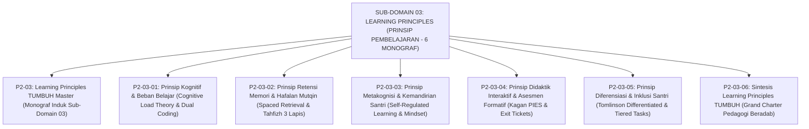

# SUB-DOMAIN 03: LEARNING PRINCIPLES (PRINSIP PEMBELAJARAN & KOGNISI)
## *Sitemap Induk & Navigasi Monograf Manajemen Beban Kognitif, Tahfizh Mutqin, Metakognisi SRL, Didaktik Kagan/Wiliam, & Diferensiasi Inklusi (6 Monograf Terpadu)*

**Nomor Identifikasi**: `P2-03/INDEX/2026`  
**Domain**: `02 Principles` > `03 Learning Principles`  
**Klasifikasi**: Folder Monograf Psikologi Belajar, Neurosains Kognisi Santri, Tahfizh Mutqin, Didaktik Formatif, & Diferensiasi Inklusi (7 Berkas Lengkap)

---

## 🏛️ SITEMAP & NAVIGASI SELURUH BERKAS SUB-DOMAIN 03

Sub-Domain `03 Learning Principles` menetapkan prinsip-prinsip ilmiah psikologi pendidikan, kognisi santri, tahfizh mutqin, metakognisi, didaktik interaktif, dan pembelajaran berdiferensiasi di kelas dan halaqah pesantren TUMBUH:

---

## 📑 DAFTAR LENGKAP 7 BERKAS MONOGRAF TERPADU SUB-DOMAIN 03

Seluruh modul telah distandarisasi 100% ke dalam format **Monograf Terpadu**:
* **💡 Intisari Praktis (3 Menit Paham)**: Panduan membumi untuk asatidz & musyrif sebelum daftar isi.
* **Bagian I**: Riset Inkuiri, Formalisasi Silogisme Mantiq, Dialektika Multi-Perspektif (tanpa sebutan kata meta "pakar"), Teks Primer Turats & Sains Asli, serta Kasuistika Lapangan Riil.
* **Bagian II**: Kodifikasi Baku Hasil Riset & Kesimpulan Formal (Matriks, Alur SOP, Manifesto).
* **Bagian III**: Aparatus Akademis (Tabel Sintesis, Daftar Pustaka Otoritatif, Catatan Kaki *Footnotes*, dan Glosarium Istilah Teknis).

| No | Berkas Monograf | Judul Berkas | Fokus Kajian & Rujukan Utama |
| :---: | :--- | :--- | :--- |
| **00** | [**`P2-03-Prinsip-Psikologi-Belajar-TUMBUH.md`**](./P2-03-Prinsip-Psikologi-Belajar-TUMBUH.md) | Monograf Induk Learning Principles TUMBUH | Master 5 Pilar Psikologi Belajar & Kognisi Santri, Penegasan Triad Pertumbuhan Simbiotik, & gerbang derivasi menuju **Sub-Domain 04 Development Principles**. |
| **01** | [**`P2-03-01-Prinsip-Kognitif-dan-Manajemen-Beban-Belajar.md`**](./P2-03-01-Prinsip-Kognitif-dan-Manajemen-Beban-Belajar.md) | Prinsip Kognitif & Manajemen Beban Belajar | *Cognitive Load Theory* John Sweller; keterbatasan memori kerja; segmentasi *Chunking*; *Dual Coding Theory* Paivio; *Worked-Example Effect* (12 Catatan Kaki). |
| **02** | [**`P2-03-02-Prinsip-Retensi-Memori-dan-Hafalan-Mutqin.md`**](./P2-03-02-Prinsip-Retensi-Memori-dan-Hafalan-Mutqin.md) | Prinsip Retensi Memori & Hafalan Mutqin | Wasiat *Ta'ahhud al-Qur'an* (HR. Bukhari-Muslim); *Spaced Retrieval Practice* & *Testing Effect*; konsolidasi memori tidur lelap; sistem tahfizh 3 lapis Ziyadah-Sabqi-Manzil (11 Catatan Kaki). |
| **03** | [**`P2-03-03-Prinsip-Metakognisi-dan-Kemandirian-Santri.md`**](./P2-03-03-Prinsip-Metakognisi-dan-Kemandirian-Santri.md) | Prinsip Metakognisi & Kemandirian Santri | Muhasabatun Nafs Sayyidina Umar RA; *Self-Regulated Learning (SRL)* Barry Zimmerman; *Growth Mindset* Carol Dweck; Jurnal Muhasabah Belajar harian 10 menit (11 Catatan Kaki). |
| **04** | [**`P2-03-04-Prinsip-Didaktik-Interaktif-dan-Asesmen-Formatif.md`**](./P2-03-04-Prinsip-Didaktik-Interaktif-dan-Asesmen-Formatif.md) | Prinsip Didaktik Interaktif & Asesmen Formatif | Seni mengajar dialogis Rasulullah SAW (*Amtsal*); struktur *Kagan Cooperative Learning (PIES)*; 5 strategi kunci Asesmen Formatif Dylan Wiliam; *Exit Tickets* & *Actionable Feedback* (10 Catatan Kaki). |
| **05** | [**`P2-03-05-Prinsip-Diferensiasi-Pembelajaran-dan-Inklusi-Santri.md`**](./P2-03-05-Prinsip-Diferensiasi-Pembelajaran-dan-Inklusi-Santri.md) | Prinsip Diferensiasi & Inklusi Santri | Kaidah *Mura'at Ahwal al-Muta'allimin* (HR. Bukhari 127), *Differentiated Instruction* Carol Ann Tomlinson, tugas bertingkat (*Tiered Tasks*), & anti-stigmatisasi slow learner (10 Catatan Kaki). |
| **06** | [**`P2-03-06-Sintesis-Learning-Principles-TUMBUH.md`**](./P2-03-06-Sintesis-Learning-Principles-TUMBUH.md) | Sintesis Learning Principles TUMBUH | Matriks Uji Kelaikan Pedagogis (*Pedagogical Usability*); Grand Manifesto Pedagogi Beradab; jembatan menuju **Sub-Domain 04 Development Principles** (10 Catatan Kaki). |
