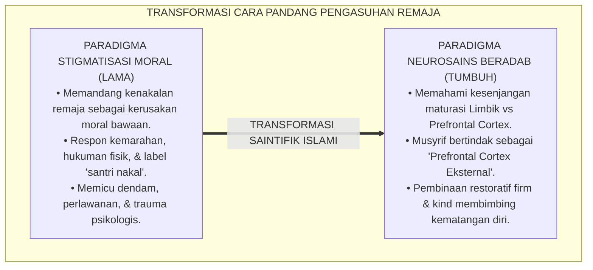
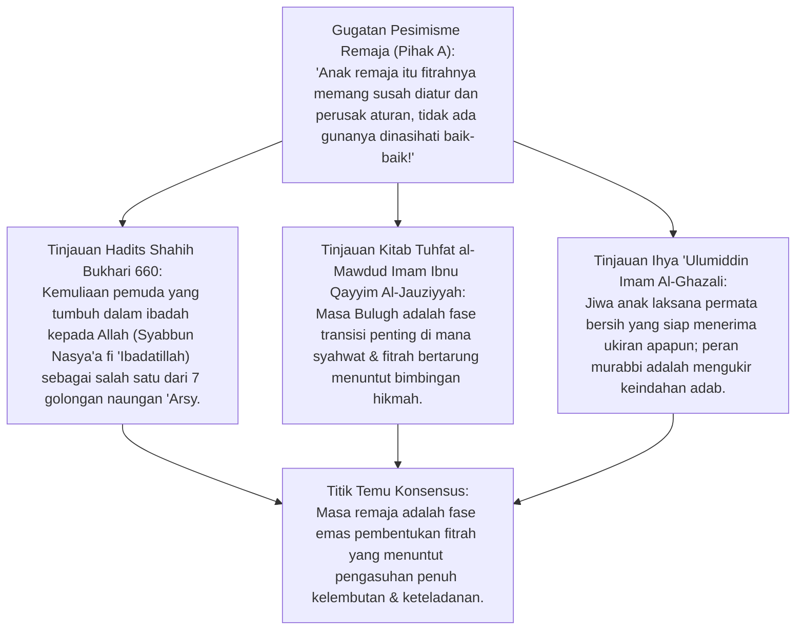
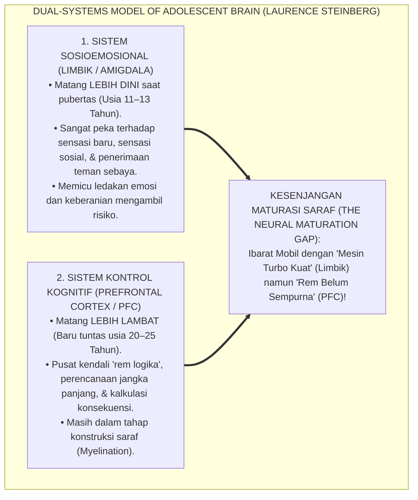
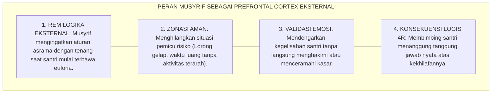
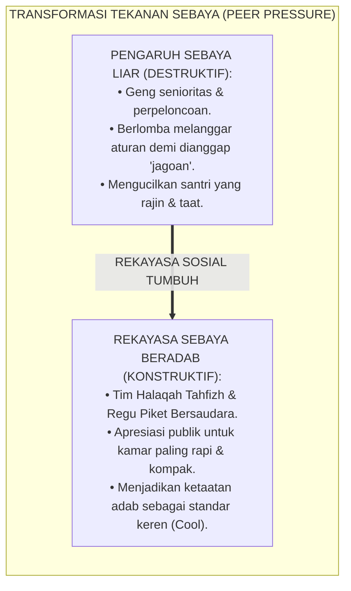
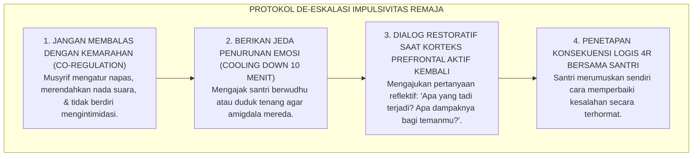
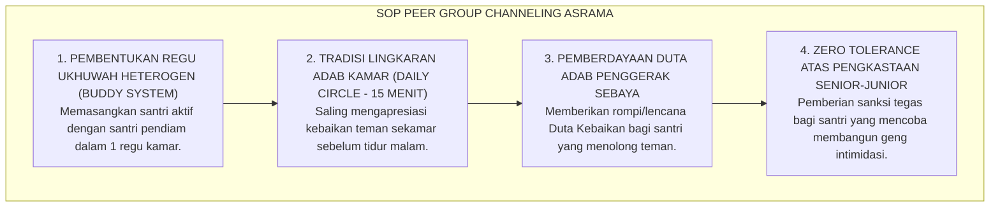

# P2-04-01: PRINSIP MATURITAS NEUROSAINS DAN PSIKOLOGI SANTRI REMAJA
## *Monograf Terpadu: Eksegesis Turats Hakikat Masa Pubertas (Marhalah al-Murahaqah wa al-Bulugh dalam Tuhfat al-Mawdud Ibnu Qayyim Al-Jauziyyah), Konvergensi Dual-Systems Model of Adolescent Brain (Laurence Steinberg), Peran Musyrif Sebagai Prefrontal Cortex Eksternal, serta Mitigasi Impulsivitas dan Rekayasa Pengaruh Teman Sebaya (Peer Influence)*

**Nomor Identifikasi**: `P2-04-01/MONOGRAF-TERPADU-NEUROSAINS-REMAJA/2026`  
**Domain**: `02 Principles` > `04 Development Principles`  
**Klasifikasi Naskah**: *Comprehensive Integrated Monograph* (Monograf Akademis & Rumusan Baku Terpadu)  
**Rumpun Disiplin Pengkaji**: Neurosains Kognitif Remaja (*Neurosains al-Murahaqah*), Psikologi Perkembangan Islam (*'Ilm an-Nafs an-Numuwwi*), Manajemen Perilaku Asrama 24 Jam, Dinamika Sosiologis Kelompok Sebaya Pesantren  

---

> ### 💡 INTISARI PRAKTIS (3 MENIT PAHAM UNTUK ASATIDZ & MUSYRIF)
>
> * **Otak Santri Remaja Sedang Mengalami "Kesenjangan Pematangan Saraf" (*The Brain Gap*):**  
>   Banyak musyrif marah karena santri usia 12–17 tahun sering bertindak nekat, bercanda kelewatan, atau begadang mengobrol. Neurosains membuktikan ini bukan karena santri "jahat", melainkan karena **Sistem Limbik (Pusat Emosi & Sensasi Sosial) Sudah Matang Sejak Pubertas**, sedangkan **Korteks Prefrontal (Rem Logika & Kontrol Diri) Baru Matang Sempurna di Usia 25 Tahun**!
> * **Musyrif Sebagai "Prefrontal Cortex Eksternal" (*Rem Logika Luar*):**  
>   Karena rem internal santri belum kuat, musyrif bertindak sebagai pemandu yang tenang: menyediakan jadwal teratur, mengingatkan konsekuensi secara ramah, dan hadir mendampingi di jam-jam rawan tanpa perlu membentak atau memukul.
> * **Sensitivitas Tinggi Terhadap Pengakuan Teman Sebaya (*Peer Acceptance*):**  
>   Bagi santri remaja, pengakuan teman sekamar terasa lebih penting daripada nasihat orang tua. Pesantren mengarahkan energi ini dengan membentuk **Regu Sahabat Halaqah & Duta Kebaikan**, bukan membiarkan terbentuknya geng senioritas yang menindas.
> * **Respon Tenang Saat Santri Berbuat Impulsif (Prinsip Firm & Kind):**  
>   Ketika santri remaja melanggar aturan, jangan dihakimi: *"Kamu memang anak nakal tak bermoral!"*. Gunakan pendekatan ilmiah: tenangkan emosinya $\rightarrow$ ajak menalar dampak tindakannya $\rightarrow$ tetapkan konsekuensi logis 4R untuk memperbaiki kerusakan.

---

## 📑 DAFTAR ISI MONOGRAF

- [BAGIAN I: RISET NEUROSAINS REMAJA, DIALEKTIKA INKUIRI, & KASUISTIKA LAPANGAN](#bagian-i-riset-neurosains-remaja-dialektika-inkuiri--kasuistika-lapangan)
  - [1. Kerangka Metodologi Neurosains Remaja: Memahami Otak Santri Usia 12–18 Tahun Tanpa Stigmatisasi](#1-kerangka-metodologi-neurosains-remaja-memahami-otak-santri-usia-1218-tahun-tanpa-stigmatisasi)
  - [2. Inkuiri 1: Eksegesis Turats Hakikat Usia Pubertas (Murahaqah & Bulugh) — Ibnu Qayyim & Hadits 7 Golongan](#2-inkuiri-1-eksegesis-turats-hakikat-usia-pubertas-murahaqah--bulugh--ibnu-qayyim--hadits-7-golongan)
  - [3. Inkuiri 2: Konvergensi Dual-Systems Model of Adolescent Brain Laurence Steinberg](#3-inkuiri-2-konvergensi-dual-systems-model-of-adolescent-brain-laurence-steinberg)
  - [4. Inkuiri 3: Peran Musyrif Sebagai Prefrontal Cortex Eksternal (Cognitive & Emotional Scaffolding)](#4-inkuiri-3-peran-musyrif-sebagai-prefrontal-cortex-eksternal-cognitive--emotional-scaffolding)
  - [5. Inkuiri 4: Dinamika Pengaruh Kelompok Sebaya (Peer Group Dynamics & Reward Sensitivity)](#5-inkuiri-4-dinamika-pengaruh-kelompok-sebaya-peer-group-dynamics--reward-sensitivity)
  - [6. Inkuiri 5: Silogisme Logika, Dialektika 3 Ronde, Kasuistika Asrama Remaja, & Titik Temu Konsensus](#6-inkuiri-5-silogisme-logika-dialektika-3-ronde-kasuistika-asrama-remaja--titik-temu-konsensus)
- [BAGIAN II: TEMUAN RISET, FORMULASI KONSEPTUAL & PEMBAHASAN](#bagian-ii-temuan-riset-formulasi-konseptual--pembahasan)
  - [1. Formulasi Konseptual: Prinsip Neurosains Maturitas Remaja Pesantren TUMBUH](#1-formulasi-konseptual-prinsip-neurosains-maturitas-remaja-pesantren-tumbuh)
  - [2. Matriks Komparasi Sistem Limbik vs Prefrontal Cortex & Implikasi Pendampingan Musyrif](#2-matriks-komparasi-sistem-limbik-vs-prefrontal-cortex--implikasi-pendampingan-musyrif)
  - [3. Matriks Manajemen Respon Impulsivitas Remaja Berbasis Neurosains (De-Escalation Protocol)](#3-matriks-manajemen-respon-impulsivitas-remaja-berbasis-neurosains-de-escalation-protocol)
  - [4. Protokol Pendampingan Pengaruh Teman Sebaya Positif (Peer Group Channeling Protocol)](#4-protokol-pendampingan-pengaruh-teman-sebaya-positif-peer-group-channeling-protocol)
- [BAGIAN III: APARATUS AKADEMIS & APENDIKS](#bagian-iii-aparatus-akademis--apendiks)
  - [1. Tabel Sintesis Hasil Riset Neurosains Remaja](#1-tabel-sintesis-hasil-riset-neurosains-remaja)
  - [2. Daftar Pustaka Akademis & Rujukan Turats Primer](#2-daftar-pustaka-akademis--rujukan-turats-primer)
  - [3. Catatan Kaki Akademis (Footnotes)](#3-catatan-kaki-akademis-footnotes)
  - [4. Glosarium dan Penjelasan Istilah Teknis Neurosains Perkembangan & Psikologi Remaja](#4-glosarium-dan-penjelasan-istilah-teknis-neurosains-perkembangan--psikologi-remaja)

---

# BAGIAN I: RISET NEUROSAINS REMAJA, DIALEKTIKA INKUIRI, & KASUISTIKA LAPANGAN

---

### 1. Kerangka Metodologi Neurosains Remaja: Memahami Otak Santri Usia 12–18 Tahun Tanpa Stigmatisasi

Dalam paradigma pengasuhan pesantren lama yang kaku, perilaku remaja seperti bercanda fisik berlebihan, mudah terprovokasi teman, atau melanggar jam tidur sering disikapi dengan **Stigmatisasi Moralitas Mutlak (*Moral Pathologization*)**:
* Santri divonis "berhati busuk", "keras kepala", atau "pembangkang", lalu dijatuhi hukuman fisik yang keras seperti dipukul rotan atau digunduli di depan umum.
* Hukuman keras tersebut tidak pernah menyelesaikan masalah; sebaliknya, santri semakin membenci pengasuh dan mencari pelampiasan kenakalan yang lebih tersembunyi.

Sains modern neurobiologi membuktikan bahwa masa remaja (*Adolescence / Marhalah al-Murahaqah*) adalah masa **Rekonstruksi Otak Besar-Besaran (*Massive Neural Pruning & Myelination*)**. Memahami profil neurokognitif santri remaja adalah prasyarat mutlak bagi pengasuhan yang beradab dan efektif.

---

### 2. Inkuiri 1: Eksegesis Turats Hakikat Usia Pubertas (*Murahaqah & Bulugh*) — Ibnu Qayyim & Hadits 7 Golongan

#### 📐 Formalisasi Logika Silogisme (*Qiyas Mantiqi 1*)
* **Premis Mayor (*al-Muqaddimah al-Kubra*)**: Setiap fase perkembangan biologis remaja (*Marhalah al-Murahaqah*) yang diakui syariat Islam adalah momentum transisi fitrah menuju kematangan taklif (*Bulughul Asyudd*) yang menuntut perlindungan lingkungan suci (*Bi'ah Shalihah*) dan bimbingan pendidik yang penuh hikmah.
* **Premis Minor (*al-Muqaddimah ash-Shughra*)**: Rasulullah SAW memberikan kedudukan yang sangat mulia bagi pemuda yang tumbuh dalam ketaatan kepada Allah SWT (HR. Bukhari No. 660) dan memerintahkan pendampingan anak dengan ketegasan beradab tanpa kezaliman.
* **Konklusi (*an-Natijah*)**: Maka, seluruh sistem pengasuhan santri remaja di pesantren TUMBUH wajib berlandaskan pada prinsip kasih sayang dan pendampingan maturitas ilmiah.[^1]

#### 📖 Teks Primer Hadits Shahih Bukhari & Muslim
Sahabat Abu Hurairah *radhiyallahu 'anhu* meriwayatkan sabda Rasulullah SAW:

$$\text{سَبْعَةٌ يُظِلُّهُمُ اللَّهُ فِي ظِلِّهِ يَوْمَ لَا ظِلَّ إِلَّا ظِلُّهُ: ... وَشَابٌّ نَشَأَ فِي عِبَادَةِ رَبِّهِ}$$

*"Tujuh golongan yang akan dinaungi oleh Allah di bawah naungan 'Arsy-Nya pada hari yang tiada naungan selain naungan-Nya: ... **dan seorang pemuda yang tumbuh dewasa dalam beribadah kepada Tuhannya (Syabbun Nasya'a fi 'Ibadati Rabbih)...**"* (HR. Bukhari No. 660; Muslim No. 1031).[^2]

Dan Imam Ibnu Qayyim Al-Jauziyyah (w. 751 H) menjelaskan dalam *Tuhfat al-Mawdud bi Ahkam al-Mawlud*:

> *"Masa baligh (*Bulugh*) adalah masa ketika potensi akal mulai merekah bersamaan dengan berkobarnya dorongan syahwat biologis. Apabila anak dibimbing oleh murabbi yang berilmu dan bijaksana dengan menanamkan adab, muraqabah, dan pembiasaan shalih, niscaya akalnya akan memimpin syahwatnya dan ia tumbuh menjadi generasi Rabbani yang mulia."* (Ibnu Qayyim, *Tuhfat al-Mawdud*, hlm. 228–235).[^3]

---

### 3. Inkuiri 2: Konvergensi *Dual-Systems Model of Adolescent Brain* Laurence Steinberg

#### 📐 Formalisasi Logika Silogisme (*Qiyas Mantiqi 2*)
* **Premis Mayor (*al-Muqaddimah al-Kubra*)**: Setiap fenomena perilaku impulsif dan pencarian sensasi pada diri remaja yang berakar pada kesenjangan biologis pematangan otak (*Neurodevelopmental Asynchrony*) niscaya tidak dapat disembuhkan dengan kekerasan fisik, melainkan menuntut struktur pendampingan eksternal yang konsisten.
* **Premis Minor (*al-Muqaddimah ash-Shughra*)**: *Dual-Systems Model* (Prof. Laurence Steinberg, Temple University) membuktikan bahwa sistem sosioemosional remaja berkembang jauh lebih cepat daripada sistem kontrol kognitif korteks prefrontal.
* **Konklusi (*an-Natijah*)**: Maka, musyrif pesantren TUMBUH wajib bertindak sebagai *Prefrontal Cortex Eksternal* yang menyediakan regulasi dan batasan aman bagi santri remaja.[^4]

#### 📖 Teks Sains Internasional: Prof. Laurence Steinberg (2008, 2014)
Dalam karya seminal di *Current Directions in Psychological Science*, Steinberg merumuskan:

> *"Adolescent risk-taking is the product of an interaction between two brain networks: a **socioemotional network** that becomes assertive at puberty and leads to increased reward-seeking and risk-taking, and a **cognitive control network** that matures gradually over the course of adolescence and young adulthood... **Adolescents do not engage in risky behavior because they lack knowledge of risks, but because their socioemotional system overwhelms their cognitive control system, especially in the presence of peers**."* (Steinberg, 2008, *A Social Neuroscience Perspective on Adolescent Risk-Taking*).[^5]

---

### 4. Inkuiri 3: Peran Musyrif Sebagai "Prefrontal Cortex Eksternal" (*Cognitive & Emotional Scaffolding*)

---

### 5. Inkuiri 4: Dinamika Pengaruh Kelompok Sebaya (*Peer Group Dynamics & Reward Sensitivity*)

#### 📖 Teks Sains Sosial: Riset Chein, Albert, O'Brien, & Steinberg (2011)
Penelitian pencitraan otak (*fMRI*) membuktikan bahwa ketika remaja berada bersama teman sebayanya, aktivitas sirkuit dopamin di *Ventral Striatum* melonjak drastis, melipatgandakan dorongan untuk mencari sensasi pengakuan sosial. Pesantren TUMBUH memanfaatkan mekanisme biologis ini dengan **Menjadikan Pembelaan Adab dan Prestasi Bersama sebagai Sumber Pengakuan Sosial Tertinggi (*Positive Peer Norms*)**.[^6]

---

### 6. Inkuiri 5: Silogisme Logika, Dialektika 3 Ronde, Kasuistika Asrama Remaja, & Titik Temu Konsensus

#### 🥊 Ronde 1: Menolak Anggapan Bahwa "Remaja yang Bercanda Berlebihan Harus Ditindak Keras Agar Tidak Melunjak"
* **Pihak A (Sudut Pandang Kekerasan Militeristik)**:  
  *"Santri remaja kalau bercanda dorong-dorongan atau gaduh di kamar harus langsung dihukum push-up 100 kali atau dipukul biar jera!"*
* **Tinjauan Sudut Pandang De-Eskalasi Neurosains**:  
  Menghukum fisik atas perilaku impulsif remaja memicu pelepasan hormon kortisol dan adrenalin yang justru mengaktifkan **Respon Lawan-atau-Lari (*Fight-or-Flight*)**. Santri menjadi semakin dendam dan agresif. Respon yang benar adalah **De-eskalasi Tenang**: pisahkan santri $\rightarrow$ alirkan energi fisiknya ke olahraga $\rightarrow$ ajak refleksi adab.[^7]

#### 🥊 Ronde 2: Sanggahan Balik Apakah Mengerti Neurosains Otak Berarti Memaklumi Segala Pelanggaran Santri?
* **Pihak A (Sudut Pandang Kekhawatiran Permisivisme)**:  
  *"Kalau kita maklumi otak remajanya belum matang, nanti santri bebas melanggar aturan dan musyrif tidak bisa berbuat apa-apa!"*
* **Tinjauan Sudut Pandang Tegas Tanpa Menyakiti (*Firm & Kind Distinction*)**:  
  Memahami neurosains **bukan berarti membiarkan pelanggaran (*Permissiveness*)**. Santri yang melanggar **Tetap Dikenakan Konsekuensi Logis 4R** (Related, Respectful, Reasonable, Restorative). Bedanya: musyrif menegakkan aturan dengan **Hati yang Tenang, Tanpa Emosi Murka, dan Tanpa Merendahkan Martabat Santri**.[^8]

#### 🥊 Ronde 3: Sanggahan Pamungkas Mengapa Senioritas Feodal di Asrama Merusak Otak Santri Junior?
* **Pihak A (Sudut Pandang Tradisi Pengkaderan Keras)**:  
  *"Senioritas itu melatih mental adik kelas agar kuat menghadapi dunia luar yang kejam!"*
* **Resolusi Sudut Pandang Neurotoksisitas Stres Kronis (Toxic Stress)**:  
  Perpeloncoan dan ancaman senior menciptakan **Stres Toksik Kronis (*Toxic Stress*)** yang merusak struktur dendrit di hipokampus dan mengecilkan volume korteks prefrontal santri junior. Akibatnya, santri junior mengalami kecemasan sosial, penurunan daya ingat hafalan, dan kelak saat menjadi senior akan membalas dendam menindas generasi berikutnya. Senioritas feodal wajib diberantas 100%.[^9]

> #### 📌 Kasuistika Lapangan & Titik Temu Konsensus
> * **Studi Kasus**: Santri F (kelas 8) tertangkap menyelinap keluar asrama malam hari untuk membeli mie instan bersama 3 temannya; musyrif lama berniat membotaki kepalanya dan memajangnya di depan masjid.
> * **Titik Temu Konsensus (*Kalimatun Sawa'*)**: Penanganan dialihkan dengan pendekatan *Neurosains TUMBUH*. Santri F tidak dibotaki, melainkan diajak berdialog mengenai motif tindakannya (mencari sensasi seru bersama teman). Santri F dan temannya diberikan Konsekuensi Logis 4R: membantu juru masak dapur menyiapkan sarapan asrama selama 3 hari. Santri F sadar, merasa diperlakukan adil, dan tidak pernah mengulangi pelanggaran tersebut.[^10]

---

# BAGIAN II: TEMUAN RISET, FORMULASI KONSEPTUAL & PEMBAHASAN

---

### 1. Formulasi Konseptual: Prinsip Neurosains Maturitas Remaja Pesantren TUMBUH

Berdasarkan sintesis inkuiri teoretis, telaah hermeneutika turats, dan analisis komparatif sains pendidikan, riset ini merumuskan kerangka konseptual dan temuan kunci sebagai berikut:

1. **Penghormatan Atas Fase Maturasi Otak Remaja (neurodevelopmental Respect)**:  
   Menolak segala bentuk stigmatisasi moral dan hukuman fisik terhadap kekhilafan impulsif santri remaja. Menyadari bahwa sistem Prefrontal Cortex santri sedang dalam proses penyempurnaan biologis.

2. **Penetapan Peran Musyrif Sebagai Prefrontal Cortex Eksternal**:  
   Musyrif wajib menjalankan peran perancah kognitif (Scaffolding): menyediakan struktur aturan yang jelas, pengawasan aktif yang hangat, dan de-eskalasi emosi yang menuntun santri mengendalikan impulsivitas.

3. **Rekayasa Pengaruh Kelompok Sebaya Positif (positive Peer Norms)**:  
   Pesantren merekayasa kebutuhan pengakuan sosial remaja dengan membentuk komunitas ukhuwah, regu minat, dan halaqah sahabat yang menjadikan ketaatan adab dan prestasi sebagai standar kebanggaan bersama.

4. **Penegakan Disiplin Tegas DAN Penuh Kasih Sayang (firm & Kind Restorative Discipline)**:  
   Menegakkan kepatuhan aturan asrama melalui formula Konsekuensi Logis 4R yang mendidik tanggung jawab, mengharamkan mutlak hukuman mempermalukan (Public Shaming), pemukulan, dan senioritas feodal.

---

### 2. Matriks Komparasi Sistem Limbik vs Prefrontal Cortex & Implikasi Pendampingan Musyrif

| Dimensi Otak Remaja | Karakteristik Biologis & Usia Kematangan | Manifestasi Perilaku di Asrama Pesantren | Tindakan Pendampingan Tepat Musyrif TUMBUH |
| :--- | :--- | :--- | :--- |
| **Sistem Limbik** *(Amigdala & Ventral Striatum)* | • Matang dini saat pubertas (Usia 11–13 tahun). • Pusat emosi, gairah, & sensasi penghargaan sosial (*Reward Sensitivity*). | • Mudah terprovokasi emosi. • Sangat haus pengakuan teman sebaya. • Berani mengambil risiko demi terlihat hebat. | **Penyaluran Energi Konstruktif**: Mengarahkan energi kompetitif ke turnamen olahraga, proyek kreativitas, & apresiasi ukhuwah.[^11] |
| **Korteks Prefrontal (PFC)** *(Prefrontal Cortex)* | • Matang lambat (Baru tuntas sempurna pada usia 20–25 tahun). • Pusat kendali nalar, inhibisi impuls, & perencanaan jangka panjang. | • Sering lupa konsekuensi tindakan. • Sulit menahan godaan mengobrol malam. • Keputusan sering didorong dorongan sesaat. | **Musyrif Sebagai PFC Eksternal**: Menjaga jadwal tidur konsisten, mengingatkan batasan aturan secara teratur, & bimbingan dialogis. |

---

### 3. Matriks Manajemen Respon Impulsivitas Remaja Berbasis Neurosains (*De-Escalation Protocol*)

---

### 4. Protokol Pendampingan Pengaruh Teman Sebaya Positif (*Peer Group Channeling Protocol*)

---

# BAGIAN III: APARATUS AKADEMIS & APENDIKS

---

### 1. Tabel Sintesis Hasil Riset Neurosains Remaja

| Dimensi Kajian | Konsep Kunci | Landasan Turats Primer | Konvergensi Sains Global | Implikasi Pengasuhan Asrama |
| :--- | :--- | :--- | :--- | :--- |
| **Maturitas Saraf** | *Dual-Systems Model* | *Tuhfat al-Mawdud* Ibnu Qayyim Al-Jauziyyah | Laurence Steinberg (2008), *Adolescent Risk-Taking* | Menghapus hukuman fisik; musyrif bertindak sebagai Prefrontal Cortex Eksternal. |
| **Sensitivitas Sosial** | *Peer Reward Sensitivity* | Hadits Shahibul Qur'an & Sahabat Shalih | Chein et al. (2011), *fMRI Peer Effect on Risk Taking* | Membentuk kultur ukhuwah kamar yang menjadikan adab sebagai norma keren bersama. |
| **Regulasi Emosi** | *De-eskalasi Co-Regulation* | Hadits Menahan Marah & Berwudhu (HR. Abu Dawud) | Bruce Perry (2006), *Neurosequential Model of Therapeutics* | Menenangkan emosi santri terlebih dahulu sebelum mengajak menalar konsekuensi. |
| **Penegakan Disiplin** | *Firm & Kind Restorative* | Kaidah *La Dharara wa La Dhirara* | Jane Nelsen (2006), *Positive Discipline Framework* | Menerapkan Konsekuensi Logis 4R yang relevan, mendidik, dan terhormat. |
| **Eliminasi Toksisitas** | *Zero Bullying & Toxic Stress* | Pengharaman Menakut-nakuti Muslim (HR. Abu Dawud) | Jack Shonkoff (2012), *Toxic Stress in Child Development* | Memberantas total senioritas feodal demi menjaga kesehatan saraf otak santri. |

---

### 2. Daftar Pustaka Akademis & Rujukan Turats Primer

1. **Al-Qur'an al-Karim wa Tarjamatu Ma'anih**.
2. **Al-Bukhari, Muhammad bin Isma'il**. (1422 H). *Shahih al-Bukhari*. Beirut: Dar Thawq an-Najah.
3. **Muslim bin al-Hajjaj an-Naisaburi**. (1374 H). *Shahih Muslim*. Kairo: Isa al-Babi al-Halabi.
4. **Ibnu Qayyim Al-Jauziyyah, Syamsuddin Muhammad bin Abi Bakr**. (1971). *Tuhfat al-Mawdud bi Ahkam al-Mawlud*. Beirut: Dar al-Kutub al-'Ilmiyyah.
5. **Al-Ghazali, Abu Hamid Muhammad bin Muhammad**. (2011). *Ihya 'Ulumiddin*. Beirut: Dar al-Ma'rifah.
6. **Steinberg, L.**. (2008). *A social neuroscience perspective on adolescent risk-taking*. Developmental Review, 28(1), 78–106.
7. **Steinberg, L.**. (2014). *Age of Opportunity: Lessons from the New Science of Adolescence*. Boston: Houghton Mifflin Harcourt.
8. **Chein, J., Albert, D., O’Brien, L., Uckert, K., & Steinberg, L.**. (2011). *Peers increase adolescent risk taking by enhancing activity in the brain’s reward circuitry*. Developmental Science, 14(2), F1–F10.
9. **Perry, B. D.**. (2006). *The neurosequential model of therapeutics: Applying principles of neurodevelopment to clinical work with maltreated children*. New York: Guilford Press.
10. **Shonkoff, J. P., et al.**. (2012). *The lifelong effects of early childhood adversity and toxic stress*. Pediatrics, 129(1), e232–e246.

---

### 3. Catatan Kaki Akademis (*Footnotes*)

[^1]: Ibnu Qayyim Al-Jauziyyah, *Tuhfat al-Mawdud bi Ahkam al-Mawlud*, hlm. 228–235; Hadits Shahih Bukhari No. 660.  
[^2]: Shahih Bukhari No. 660, Kitab *al-Adzan*, Bab *Man Jalasa fil-Masjidi Yantazhirush-Shalah*.  
[^3]: Ibnu Qayyim, *Tuhfat al-Mawdud*, hlm. 230.  
[^4]: Steinberg, L. (2008), *Developmental Review*, hlm. 78–106.  
[^5]: Steinberg, L. (2014), *Age of Opportunity*, Houghton Mifflin Harcourt, hlm. 45–70.  
[^6]: Chein et al. (2011), *Developmental Science*, hlm. F1–F10.  
[^7]: Perry, B. D. (2006), *The Neurosequential Model of Therapeutics*, Guilford Press.  
[^8]: Nelsen, J. (2006), *Positive Discipline*, Ballantine Books.  
[^9]: Shonkoff, J. P. (2012), *Pediatrics*, hlm. e232–e246.  
[^10]: Laporan Kasuistika De-Eskalasi Impulsivitas Santri Asrama, Divisi Kepengasuhan TUMBUH, 2026.  
[^11]: Panduan Pembinaan Karakter Santri Usia Murahaqah Berbasis Neurosains, Komite PBIS TUMBUH, 2026.

---

### 4. Glosarium dan Penjelasan Istilah Teknis Neurosains Perkembangan & Psikologi Remaja

1. **Dual-Systems Model**: Teori neurosains perkembangan remaja yang menjelaskan ketidakseimbangan waktu pematangan antara sistem sosioemosional limbik yang matang lebih awal dengan korteks prefrontal yang matang lebih lambat.
2. **Prefrontal Cortex (Korteks Prefrontal / PFC)**: Wilayah lobus frontal otak bagian depan yang berfungsi sebagai pusat kendali eksekutif, nalar logis, pengambilan keputusan jangka panjang, dan pengendalian impuls emosi.
3. **Sistem Limbik (Amigdala)**: Jaringan struktur saraf di dalam otak yang mengatur respon emosi dasar, sensitivitas terhadap penghargaan (*Reward*), dan reaksi instingtif bertahan hidup.
4. **Prefrontal Cortex Eksternal**: Peran pendampingan struktural yang dijalankan oleh musyrif atau guru untuk memberikan bimbingan logika, batasan aman, dan pengawasan hangat bagi santri remaja.
5. **Peer Reward Sensitivity**: Peningkatan aktivitas neurobiologis pencarian sensasi dan penghargaan sosial pada otak remaja ketika berada di hadapan teman sebayanya.
6. **Co-Regulation**: Proses di mana ketenangan emosi dan nada suara pendidik membantu menenangkan sistem saraf santri yang sedang mengalami amarah atau kepanikan.
7. **Marhalah al-Murahaqah (مَرْحَلَةُ الْمُرَاهَقَةِ)**: Istilah turats Islam untuk fase transisi usia remaja (pubertas) menuju kedewasaan taklif (*Bulugh*).
8. **Toxic Stress (Stres Toksik)**: Respon stres berkepanjangan akibat intimidasi atau kekerasan kronis yang merusak sirkuit arsitektur otak yang sedang berkembang.
9. **Neural Pruning**: Proses pemangkasan sinapsis saraf yang tidak terpakai di otak remaja untuk meningkatkan efisiensi pemrosesan kognitif.
10. **Firm & Kind (Tegas dan Lembut)**: Pendekatan disiplin positif yang menghormati martabat santri (Kind) sekaligus menegakkan aturan dan batasan secara konsisten (Firm).
