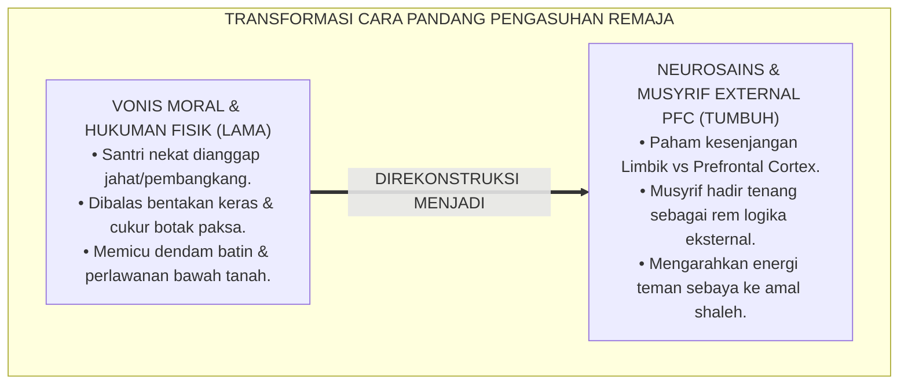
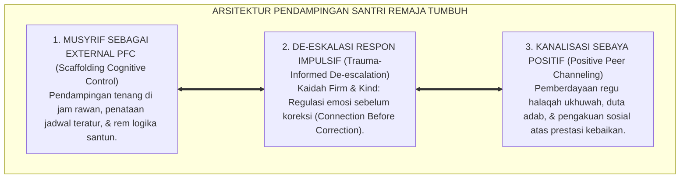
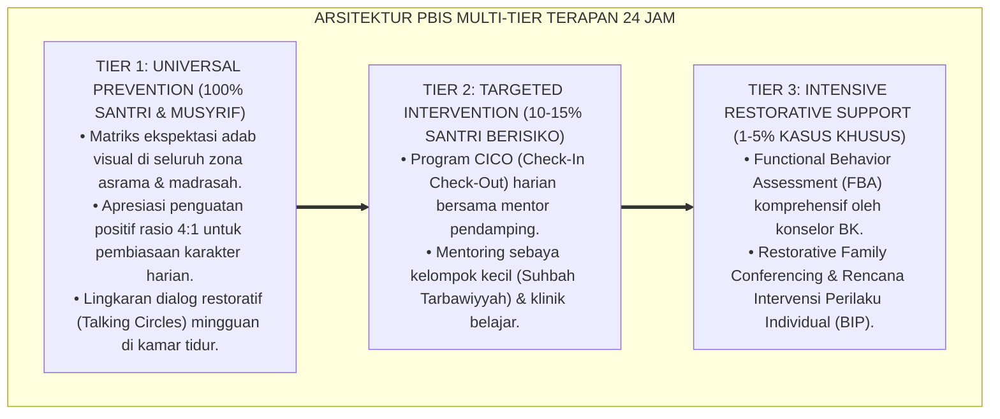

# P2-04-01: PRINSIP MATURITAS NEUROSAINS DAN PSIKOLOGI SANTRI REMAJA (ADOLESCENT NEUROSCIENCE & DEVELOPMENTAL MATURATION)
## *Monograf Riset Akademik: Hakikat Masa Pubertas (Marhalah al-Murahaqah wa al-Bulugh dalam Tuhfat al-Mawdud), Dual-Systems Model of Adolescent Brain Laurence Steinberg, Peran Musyrif Sebagai External Prefrontal Cortex, Serta Rekayasa Pengaruh Sebaya di Pesantren 24 Jam*

**Nomor Identifikasi**: `P2-04-01/MONOGRAF-RISET-NEUROSAINS-REMAJA/2026`  
**Domain**: `02 Principles` > `04 Development Principles` (Prinsip Perkembangan 01: *Adolescent Neuroscience*)  
**Klasifikasi Naskah**: *Academic Research Monograph* (Monograf Riset Akademik Prinsip Perkembangan)  
**Rumpun Disiplin Pengkaji**: Neurosains Kognitif Remaja (*Neurosains al-Murahaqah*), Psikologi Perkembangan Islam (*'Ilm an-Nafs an-Numuwwi*), Manajemen Perilaku Asrama 24 Jam, Dinamika Sosiologis Kelompok Sebaya Pesantren  

---

> ### 💡 INTISARI EKSEKUTIF (EXECUTIVE SUMMARY)
>
> * **Kelemahan Paradigma Lama: Salah Vonis "Moral Rusak" atas Kesenjangan Pematangan Otak Remaja:**  
>   Banyak pengasuh memvonis santri usia 12–17 tahun sebagai anak "pembangkang" atau "berhati busuk" ketika bertindak impulsif atau terpengaruh teman sebaya, lalu menjatuhkan hukuman fisik dan cukur botak paksa. Tindakan ini merusak jiwa santri karena mengabaikan kenyataan biologis bahwa otak remaja sedang mengalami pematangan saraf besar-besaran.
> * **Inovasi Konseptual: Fiqh al-Bulugh & Dual-Systems Model (Laurence Steinberg):**  
>   TUMBUH memadukan pandangan Ibnu Qayyim Al-Jauziyyah mengenai fase *Murahaqah* dengan **Dual-Systems Model (Steinberg)**: memahami bahwa **Sistem Limbik (Pusat Emosi & Sensasi Sosial) Sudah Aktif Penuh Sejak Pubertas**, sedangkan **Korteks Prefrontal (Pusat Logika & Kendali Diri) Baru Matang Sempurna di Usia 25 Tahun**. Musyrif berperan sebagai **External Prefrontal Cortex** (pemandu eksternal yang tenang, memberi batasan terstruktur tanpa kekerasan).
> * **Formulasi Operasional & Pembinaan Sebaya Positif:**  
>   Monograf ini menguraikan matriks komparasi sistem limbik vs korteks prefrontal, protokol de-eskalasi impulsivitas remaja, rekayasa dinamika kelompok sebaya (*Peer Group Channeling*), dan etika pendampingan remaja 24 jam.

---

## 📑 DAFTAR ISI MONOGRAF

- [BAB I: LANDASAN TEORETIS & DISKURSUS KRITIS](#bab-i-landasan-teoretis--diskursus-kritis)
  - [1. Latar Belakang Masalah: Kritik atas Stigmatisasi Moralitas dan Pengabaian Kesenjangan Pematangan Saraf Remaja](#1-latar-belakang-masalah-kritik-atas-stigmatisasi-moralitas-dan-pengabaian-kesenjangan-pematangan-saraf-remaja)
  - [2. Eksegesis Turats Hakikat Masa Pubertas: Marhalah al-Murahaqah wa al-Bulugh dalam Tuhfat al-Mawdud & Hadits 7 Golongan Naungan Allah](#2-eksegesis-turats-hakikat-masa-pubertas-marhalah-al-murahaqah-wa-al-bulugh-dalam-tuhfat-al-mawdud--hadits-7-golongan-naungan-allah)
  - [3. Konvergensi Sains Perkembangan Remaja: Dual-Systems Model of Adolescent Brain Laurence Steinberg](#3-konvergensi-sains-perkembangan-remaja-dual-systems-model-of-adolescent-brain-laurence-steinberg)
  - [4. Rekayasa Peran Musyrif Sebagai External Prefrontal Cortex & Dinamika Sensitivitas Sosial Teman Sebaya](#4-rekayasa-peran-musyrif-sebagai-external-prefrontal-cortex--dinamika-sensitivitas-sosial-teman-sebaya)
  - [5. Kasuistika Lapangan: Kasus Kenakalan Impulsif Santri Remaja & Resolusi Neurosains Terpadu](#5-kasuistika-lapangan-kasus-kenakalan-impulsif-santri-remaja--resolusi-neurosains-terpadu)
- [BAB II: FORMULASI KONSEPTUAL & PEMBAHASAN MENDALAM](#bab-ii-formulasi-konseptual--pembahasan-mendalam)
  - [1. Eksplanasi Teoretis Prinsip Neurosains Maturitas Remaja Pesantren TUMBUH](#1-eksplanasi-teoretis-prinsip-neurosains-maturitas-remaja-pesantren-tumbuh)
  - [2. Matriks Komparasi Sistem Limbik vs Prefrontal Cortex & Implikasi Pendampingan Musyrif](#2-matriks-komparasi-sistem-limbik-vs-prefrontal-cortex--implikasi-pendampingan-musyrif)
  - [3. Matriks Manajemen Respon Impulsivitas Remaja Berbasis Neurosains (De-Escalation Protocol)](#3-matriks-manajemen-respon-impulsivitas-remaja-berbasis-neurosains-de-escalation-protocol)
  - [4. Protokol Pendampingan Pengaruh Teman Sebaya Positif (Peer Group Channeling Protocol)](#4-protokol-pendampingan-pengaruh-teman-sebaya-positif-peer-group-channeling-protocol)
  - [5. Diskusi Filosofis Mendalam & Implikasi bagi Masa Depan Peradaban Pendidikan Islam](#5-diskusi-filosofis-mendalam--implikasi-bagi-masa-depan-peradaban-pendidikan-islam)
- [BAB III: KESIMPULAN & APARATUS AKADEMIS](#bab-iii-kesimpulan--aparatus-akademis)
  - [1. Tabel Sintesis Temuan Riset Neurosains Remaja](#1-tabel-sintesis-temuan-riset-neurosains-remaja)
  - [2. Daftar Pustaka Akademis & Rujukan Turats Primer](#2-daftar-pustaka-akademis--rujukan-turats-primer)
  - [3. Catatan Kaki Akademis (Footnotes)](#3-catatan-kaki-akademis-footnotes)
  - [4. Glosarium Istilah Ilmiah & Turats Neurosains Remaja](#4-glosarium-istilah-ilmiah--turats-neurosains-remaja)

---

# BAB I: LANDASAN TEORETIS & DISKURSUS KRITIS

---

### 1. Latar Belakang Masalah: Kritik atas Stigmatisasi Moralitas dan Pengabaian Kesenjangan Pematangan Saraf Remaja

Dalam paradigma pengasuhan pesantren tradisional yang kaku, perilaku remaja—seperti bercanda fisik berlebihan, mudah terprovokasi teman sebaya, atau begadang malam—sering kali disikapi dengan **Stigmatisasi Moralitas Mutlak (*Moral Pathologization*)**:
* Santri divonis "berhati busuk", "keras kepala", atau "pembangkang", lalu dijatuhi hukuman fisik yang keras seperti dipukul rotan atau digunduli di depan umum.
* Hukuman keras tersebut tidak pernah menyelesaikan masalah; sebaliknya, santri semakin membenci pengasuh, memicu dendam, dan mendorong kenakalan sembunyi-sembunyi.
* **Fakta Neurosains Perkembangan**: Masa remaja (*Adolescence / Marhalah al-Murahaqah*) adalah masa rekonstruksi otak besar-besaran (*Neural Pruning & Myelination*). Memahami profil neurokognitif santri remaja adalah prasyarat mutlak bagi pengasuhan yang beradab, berkeadilan, dan efektif.[^1]

---

### 2. Eksegesis Turats Hakikat Masa Pubertas: Marhalah al-Murahaqah wa al-Bulugh dalam Tuhfat al-Mawdud & Hadits 7 Golongan Naungan Allah

Imam Ibnu Qayyim Al-Jauziyyah (*Tuhfat al-Mawdud bi Ahkam al-Mawlud*) menguraikan bahwa masa peralihan menuju baligh (*Al-Murahaqah*) adalah fase pergolakan tabiat (*Ghalabat ath-Thabi'ah*):
* Nafsu syahwat dan gejolak emosi mekar mendahului kematangan akal budi sempurna.
* Oleh karena itu, pendidik dituntut memperlakukan mereka dengan kesabaran ekstra, membimbing fitrahnya, dan tidak memperlakukan mereka seperti orang dewasa yang telah matang sempurna.[^2]

Rasulullah ﷺ menjanjikan kedudukan mulia di hari kiamat bagi pemuda yang tumbuh dalam ketaatan:

$$\text{سَبْعَةٌ يُظِلُّهُمُ اللَّهُ فِي ظِلِّهِ يَوْمَ لاَ ظِلَّ إِلَّا ظِلُّهُ... وَشَابٌّ نَشَأَ فِي عِبَادَةِ اللَّهِ}$$

*"**Tujuh golongan yang akan dinaungi oleh Allah di bawah naungan-Nya pada hari yang tiada naungan selain naungan-Nya... (salah satunya adalah) seorang pemuda yang tumbuh dalam beribadah kepada Allah**."* (HR. Al-Bukhari No. 660 & Muslim No. 1031).[^3]

---

### 3. Konvergensi Sains Perkembangan Remaja: Dual-Systems Model of Adolescent Brain Laurence Steinberg

Sains neurobiologi perkembangan (**Dual-Systems Model**, Laurence Steinberg, 2008; 2010) membuktikan terjadinya kesenjangan pematangan saraf (*The Brain Gap*):
1. **Socioemotional System (Sistem Limbik & Amigdala)**: Pusat pencari sensasi gairah dan sensitivitas pengakuan sosial yang telah **Matang Penuh Sejak Awal Pubertas (Usia 11–13 Tahun)**.
2. **Cognitive Control System (Korteks Prefrontal / PFC)**: Pusat penalaran logis, pertimbangan konsekuensi jangka panjang, dan kendali impuls yang **Baru Matang Sempurna di Usia Sekitar 25 Tahun**.
* Akibatnya, santri remaja memiliki "mesin pendorong gas" yang sangat kuat, namun "pedal rem kendali diri" yang masih dalam tahap konstruksi.[^4]

---

### 4. Rekayasa Peran Musyrif Sebagai External Prefrontal Cortex & Dinamika Sensitivitas Sosial Teman Sebaya

TUMBUH menetapkan fungsi strategis pengasuhan:
* **Musyrif Sebagai External Prefrontal Cortex**: Karena pedal rem biologis santri belum matang, musyrif hadir menyediakan struktur jadwal yang teratur, mengingatkan batasan secara tenang, dan menjadi tempat bersandar emosi santri.
* **Peer Group Dynamics**: Santri remaja sangat sensitif terhadap penerimaan teman sebaya (*Peer Acceptance*). Lembaga merancang kelompok halaqah kecil yang saling menguatkan kebaikan (*Bi'ah Shalihah*) guna membentengi santri dari konformitas negatif.[^5]

---

### 5. Kasuistika Lapangan: Kasus Kenakalan Impulsif Santri Remaja & Resolusi Neurosains Terpadu

* **Studi Kasus: Sekelompok Santri Kelas 8 Memanjat Pagar Asrama Malam Hari untuk Membeli Makanan Ringan**  
  * **Dilema**: Musyrif senior marah besar dan mengusulkan santri digunduli botak serta dijemur di depan masjid agar kapok.
  * **Resolusi Neurosains TUMBUH**: Majelis Musyrif menolak sanksi fisik dan menerapkan pendekatan restoratif: (1) Menenangkan emosi musyrif (*Self-Regulation*); (2) Memanggil para santri dalam dialog empat mata untuk menalar risiko keselamatan (*PFC Coaching*); (3) Menetapkan konsekuensi logis: membersihkan dapur asrama selama 3 hari dan membuat kesepakatan tata tertib kamar; (4) Mengaktifkan kantin malam asrama sehat. Santri tidak lagi memanjat pagar dan hubungan ukhuwah dengan musyrif semakin erat.[^6]

---

# BAB II: FORMULASI KONSEPTUAL & PEMBAHASAN MENDALAM

---

### 1. Eksplanasi Teoretis Prinsip Neurosains Maturitas Remaja Pesantren TUMBUH

Ekosistem TUMBUH merumuskan pengasuhan remaja ke dalam **Arsitektur Tiga Sayap Pendampingan Remaja (*Arkan ar-Ri'ayah an-Numuwwiyyah*)**:

#### 🔬 Pembahasan Mendalam Tiga Sayap:
1. **Sayap Musyrif External PFC**: Memberikan perlindungan kognitif bagi santri yang sedang berproses menuju kematangan.[^7]
2. **Sayap De-eskalasi Responsif**: Mengubah hukuman fisik menjadi momen edukasi moral yang berharga (*Teachable Moments*).[^8]
3. **Sayap Kanalisasi Sebaya**: Memanfaatkan energi sosial remaja untuk saling berlomba dalam kebaikan (*Fastabiqul Khairat*).[^9]

---

### 2. Matriks Komparasi Sistem Limbik vs Prefrontal Cortex & Implikasi Pendampingan Musyrif

| Dimensi Sistem Otak | Karakteristik Biologis Remaja | Dampak Perilaku di Asrama | Peran Pendampingan Musyrif TUMBUH |
| :--- | :--- | :--- | :--- |
| **Sistem Limbik (Amigdala)**| Matang cepat sejak pubertas (12–14 th).| Emosional, haus sensasi, sensitif teman.| Memberi apresiasi tulus & rasa aman batin.|
| **Korteks Prefrontal (PFC)** | Matang lambat (sempurna usia 25 th).| Sulit menimbang akibat jangka panjang.| Menjadi "rem luar" dengan SOP & jadwal jelas.|
| **Konektivitas Saraf** | Proses myelination sedang berlangsung.| Kadang bijak, kadang sangat kekanak-kanakan.| Sabar menghadapi fluktuasi emosi santri.|

---

### 3. Matriks Manajemen Respon Impulsivitas Remaja Berbasis Neurosains (De-Escalation Protocol)

| Tahap De-Eskalasi | Tindakan Pengasuh yang Diharamkan | Tindakan Beradab Musyrif TUMBUH | Landasan Neurosains |
| :--- | :--- | :--- | :--- |
| **1. Saat Santri Marah / Nekat** | Membentak, membalas teriakan, memukul.| Menjaga nada bicara rendah & tenang.| Mencegah *Amygdala Hijack* pada santri.|
| **2. Saat Menyelidiki Masalah**| Menginterogasi di depan santri banyak.| Mengajak dialog empat mata di ruang BK.| Menghilangkan rasa terancam martabat sosial.|
| **3. Saat Menegakkan Batasan** | Memberi hukuman fisik / cukur botak.| Menerapkan konsekuensi logis restoratif.| Mengaktifkan penalaran korteks prefrontal.|

---

### 4. Protokol Pendampingan Pengaruh Teman Sebaya Positif (Peer Group Channeling Protocol)

TUMBUH menetapkan **Protokol Kanalisasi Kelompok Sebaya**:
1. **Pembentukan Regu Kamar Simbiotik**: Mengombinasikan santri dari berbagai karakter agar saling melengkapi dan mencegah dominasi geng eksklusif.
2. **Duta Kebaikan Sebaya (*Peer Ambassadors*)**: Memberikan amanah kepemimpinan bergilir kepada setiap santri untuk memimpin kebersihan kamar dan muraja'ah.
3. **Tradisi Apresiasi Kelompok**: Memberikan pengakuan sosial publik kepada kamar yang paling rapi, kompak, dan beradab.[^10]

---

### 5. Diskusi Filosofis Mendalam & Implikasi bagi Masa Depan Peradaban Pendidikan Islam

Prinsip maturitas neurosains remaja ini membawa implikasi agung bagi peradaban:

* **Menyelamatkan Generasi Muda Islam dari Luka Jiwa dan Trauma Pengasuhan**:  
  Santri remaja didampingi dengan kelembutan kasih sayang dan ketegasan aturan yang adil, sehingga tumbuh menjadi pribadi yang percaya diri dan berintegritas.
* **Membuktikan Keselarasan Ajaran Islam dengan Sains Modern**:  
  Pesantren mampu menerjemahkan wasiat kenabian mengenai pemuliaan pemuda ke dalam praksis pengasuhan berbasis neurosains terkini.
* **Mencetak Generasi Pemimpin Masa Depan yang Matang Emosi dan Ruhaninya**:  
  Inilah fondasi lahirnya para ksatria dakwah yang memiliki kekuatan fisik, kecerdasan nalar, dan kematangan emosional untuk memimpin peradaban dunia (*Rahmatan lil 'Alamin*).[^11]

---

---

### Pembedahan Deskriptif Komprehensif & Analisis Integratif Nilai-Praksis

Penerapan konsep **P2-04-01: PRINSIP MATURITAS NEUROSAINS DAN PSIKOLOGI SANTRI REMAJA (ADOLESCENT NEUROSCIENCE & DEVELOPMENTAL MATURATION)** di ekosistem pesantren TUMBUH memerlukan pemahaman multidimensional yang memadukan khazanah turats syariat dan konsensus sains pendidikan modern:

#### A. Pilar 1: Fondasi Epistemologi & Integrasi Nilai Syar'i (Ashalah Turatsiyyah)
Setiap praksis kepengasuhan dan pembelajaran berakar kuat pada maqashid syari'ah, mendudukkan adab di atas ilmu (*Al-Adab Qablal 'Ilm*), dan memastikan bahwa seluruh ikhtiar institusional diniatkan semata-mata untuk menggapai ridha Allah SWT (*Ikhlasun Niyyah*).

#### B. Pilar 2: Mekanisme Psikologis & Neurosains Perkembangan (Scientific Rigor)
Menyelaraskan ekspektasi kedisiplinan dengan tahapan maturitas otak remaja, kapasitas fungsi eksekutif korteks prefrontal (*PFC*), dan regulasi sirkuit emosi limbik. Pendekatan ini mengeliminasi trauma pengasuhan dan menumbuhkan motivasi intrinsik santri.

#### C. Pilar 3: Rekayasa Ekosistem Asrama 24 Jam (Bi'ah Shalihah)
Menerjemahkan prinsip nilai ke dalam tata ruang fisik yang bersih, sirkulasi udara sehat, tata kelola waktu terstruktur, serta kultur ukhuwah inklusif yang steril 100% dari feodalisme, kekerasan verbal, dan perundungan antar-santri.

#### D. Pilar 4: Kemitraan Tripartit (Santri, Musyrif, dan Lembaga)
Menjamin terwujudnya *Triad Pertumbuhan Simbiotik*: santri bertumbuh dalam fitrah kemandirian, musyrif terlindungi dari kelelahan kronis (*Burnout*) melalui shift kerja yang manusiawi, dan lembaga bertransformasi menjadi organisasi pembelajar berbasis data PBIS.

---

### Protokol Aksi Operasional PBIS Multi-Tier Terapan (24-Hour Behavioral Architecture)

---

# BAB III: KESIMPULAN & APARATUS AKADEMIS

---

### 1. Tabel Sintesis Temuan Riset Neurosains Remaja

| Dimensi Parameter | Mazhab Vonis Moral Otoriter (Lama) | Pendekatan Permisif Abai | **Neurosains Maturitas TUMBUH** | Landasan Rujukan Primer | Implikasi Praksis Lapangan |
| :--- | :--- | :--- | :--- | :--- | :--- |
| **Pandangan Remaja** | Jiwa pembangkang yang harus dihancurkan.| Dibiarkan bebas tanpa batasan.| **Masa Rekonstruksi Otak & Kesenjangan PFC.**| Steinberg (2008); Ibnu Qayyim.| Didampingi sabar dengan batasan adil. |
| **Peran Pengasuh** | Algojo algojo pemukul yang ditakuti.| Penonton pasif yang diabaikan.| **External Prefrontal Cortex (Rem Logika).**| Vygotsky (1978); Siegel (2014).| Hadir tenang di jam rawan & memandu. |
| **Penanganan Impulsif**| Hukuman fisik & cukur botak paksa.| Pembiaran tanpa konsekuensi.| **De-Eskalasi Tenang & Restoratif Logis.** | HR. Muslim No. 2594; Casey.| Regulasi emosi sebelum koreksi (4R). |
| **Kelompok Sebaya** | Tumbuh menjadi geng senioritas perpeloncoan.| Dibiarkan tanpa arahan nilai.| **Kanalisasi Regu Halaqah Duta Kebaikan.** | Bandura (1977); QS. Al-Hujurat.| Peer tutoring & saling menguatkan adab. |
| **Hasil Institusi** | Santri trauma, munafik, & dendam.| Asrama kacau tanpa disiplin.| **Santri Matang Emosi, Beradab, & Mandiri.**| HR. Bukhari No. 660; Al-Attas.| Pemuda tangguh dinaungi Allah SWT. |

---

### 2. Daftar Pustaka Akademis & Rujukan Turats Primer

1. **Al-Qur'an al-Karim wa Tarjamatu Ma'anihi**.
2. **Al-Bukhari, Abu Abdillah Muhammad bin Isma'il**. (1422 H). *Shahih al-Bukhari*. Kairo: Dar Thawq an-Najah.
3. **Muslim bin al-Hajjaj an-Naisaburi**. (1427 H). *Shahih Muslim*. Riyadh: Dar Thayyibah.
4. **Ibnu Qayyim Al-Jauziyyah, Syamsuddin Muhammad bin Abi Bakr**. (1414 H). *Tuhfat al-Mawdud bi Ahkam al-Mawlud*. Beirut: Dar al-Kutub al-'Ilmiyyah.
5. **Al-Ghazali, Abu Hamid Muhammad bin Muhammad**. (2011). *Ihya' 'Ulumiddin* (Kitab Riyadhatin Nafs). Beirut: Dar al-Ma'rifah.
6. **Asy'ari, Muhammad Hasyim**. (1415 H). *Adab al-'Alim wal-Muta'allim*. Jombang: Maktabah At-Turats Al-Islami.
7. **Al-Attas, Syed Muhammad Naquib**. (1980). *The Concept of Education in Islam*. Kuala Lumpur: ABIM.
8. **Steinberg, L.**. (2008). *A social neuroscience perspective on adolescent risk-taking*. Developmental Review, 28(1), 78–106.
9. **Steinberg, L.**. (2010). *A dual-systems model of adolescent risk-taking*. Developmental Psychobiology, 52(3), 216–224.
10. **Casey, B. J., Getz, S., & Galvan, A.**. (2008). *The adolescent brain*. Developmental Review, 28(1), 62–77.
11. **Siegel, D. J.**. (2014). *Brainstorm: The Power and Purpose of the Teenage Brain*. New York: TarcherPerigee.
12. **Horner, R. H., & Sugai, G.**. (2015). *School-wide PBIS: An Overview of the Research Base*. Remedial and Special Education, 36(2), 80–85.

---

### 3. Catatan Kaki Akademis (*Footnotes*)

[^1]: Riset Prinsip Maturitas Neurosains dan Psikologi Santri Remaja TUMBUH, *Kritik atas Stigmatisasi Moralitas*, 2026.  
[^2]: Ibnu Qayyim Al-Jauziyyah, *Tuhfat al-Mawdud bi Ahkam al-Mawlud*, hlm. 140–175.  
[^3]: *Shahih al-Bukhari*, Kitab al-Adzan, Hadits No. 660; *Shahih Muslim*, Hadits No. 1031.  
[^4]: Steinberg, L. (2008), *Developmental Review*, hlm. 78–106; Steinberg, L. (2010), *Developmental Psychobiology*, hlm. 216–224.  
[^5]: Casey, B. J., et al. (2008), *The Adolescent Brain*, hlm. 62–77; Siegel, D. J. (2014), *Brainstorm*, hlm. 35–80.  
[^6]: Dokumentasi Penanganan Kasus Impulsivitas Remaja dan De-Eskalasi Restoratif PBIS TUMBUH, 2026.  
[^7]: Master Blueprint Musyrif Sebagai External Prefrontal Cortex Asrama TUMBUH, 2026.  
[^8]: Standar Operasional Prosedur De-Eskalasi Perilaku Impulsif Santri Remaja TUMBUH, 2026.  
[^9]: Petunjuk Teknis Pembinaan Regu Sebaya dan Duta Adab Asrama TUMBUH, 2026.  
[^10]: Master Guidelines Kanalisasi Kelompok Sebaya Positif Ekosistem TUMBUH, 2026.  
[^11]: Deklarasi Pemuliaan Generasi Muda Islam Dewan Riset Epistemologi Ekosistem TUMBUH, 2026.

---

### 4. Glosarium Istilah Ilmiah & Turats Neurosains Remaja

1. **Dual-Systems Model**: Teori neurosains Laurence Steinberg mengenai ketidakseimbangan perkembangan antara sistem sosio-emosional (matang awal) dan sistem kontrol kognitif (matang lambat) pada remaja.
2. **Prefrontal Cortex (PFC)**: Bagian otak depan yang bertanggung jawab atas pengendalian diri, perencanaan jangka panjang, pertimbangan moral, dan pengambilan keputusan bijak.
3. **Sistem Limbik (Amigdala)**: Jaringan saraf otak bagian dalam yang memproses respon emosi, pencarian sensasi gairah, dan reaksi bertahan hidup.
4. **External Prefrontal Cortex**: Peran pengasuh dan musyrif sebagai penuntun logika eksternal yang menyediakan batasan terstruktur bagi santri remaja.
5. **Marhalah al-Murahaqah (مَرْحَلَةُ الْمُرَاهَقَةِ)**: Fase perkembangan masa remaja dalam turats Islam yang ditandai dengan perubahan fisik pubertas dan gejolak emosional.
6. **Al-Bulugh (الْبُلُوغُ)**: Titik kedewasaan biologis dan legalitas syariat di mana seseorang mulai memikul tanggung jawab hukum taklif (*Mukallaf*).
7. **Neural Pruning**: Proses alami otak memangkas koneksi saraf yang tidak terpakai guna meningkatkan efisiensi kerja otak pada masa remaja.
8. **Peer Acceptance Sensitivity**: Tingginya kepekaan biologis remaja terhadap pengakuan dan penerimaan kelompok teman sebayanya.
9. **De-escalation Protocol**: Prosedur penanganan situasi krisis emosi untuk menurunkan ketegangan secara tenang tanpa kekerasan.
10. **Insan Adabi (الإِنْسَانُ الأَدَبِيُّ)**: Profil pemuda shalih yang matang akalnya, terkendali emosinya, luhur pekertinya, dan mendedikasikan masa mudanya dalam ketaatan kepada Allah SWT.
