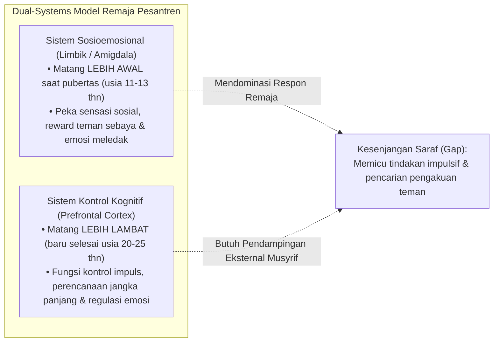

# P2-04-01-Prinsip-Maturitas-Neurosains-Remaja

## Tujuan
Menerapkan temuan konsensus neurosains perkembangan remaja (**Dual-Systems Model - Laurence Steinberg, 2008**) dalam pengelolaan disiplin dan pengasuhan asrama, membedah dinamika pematangan otak santri usia 12–18 tahun agar pembina mampu merespon kekhilafan remaja secara ilmiah dan proporsional.

---

## 1. Model Dua Sistem (*Dual-Systems Model of Adolescent Brain*)

---

## 2. Implikasi Ilmiah bagi Musyrif & Pendidik

1. **Musyrif Sebagai "Prefrontal Cortex Eksternal" (*Scaffolding Role*)**:
   - Karena "rem logika internal" santri remaja masih dalam proses konstruksi biologis, maka aturan asrama yang terstruktur, pengawasan aktif musyrif, dan jadwal harian yang konsisten berfungsi sebagai "rem eksternal" yang memandu santri tetap aman.
2. **Menghindari Jebakan Menghakimi Moralitas (*De-pathologizing Adolescent Errors*)**:
   - Pelanggaran seperti begadang mengobrol, berebut makanan, atau bercanda berlebihan bukanlah tanda kerusakan moral bawaan, melainkan wujud ketidakmatangan regulasi diri yang menuntut latihan eksplisit.
3. **Pengaruh Teman Sebaya (*Peer Pressure Channeling*)**:
   - Karena sistem limbik remaja sangat haus akan penerimaan kelompok sebaya (*peer acceptance*), pesantren merekayasa kultur geng negatif menjadi **Klub Minat-Bakat, Tim Halaqah, dan Regu Piket Kamar yang Saling Mendukung**.

---

## 3. Status Dokumen
* **Status**: 🌟 **A+ (Tervalidasi & Siap Diimplementasikan)**
* **Level**: Project 2 - `02 Principles / 04 Development Principles`
* **Langkah Berikutnya**: **`P2-04-02-Prinsip-Keterikatan-Aman-dan-In-Loco-Parentis.md`**.
