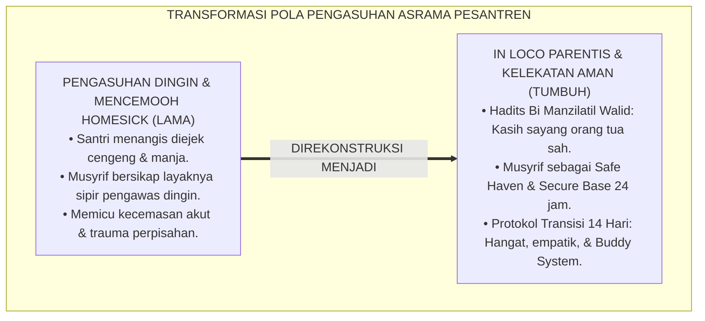
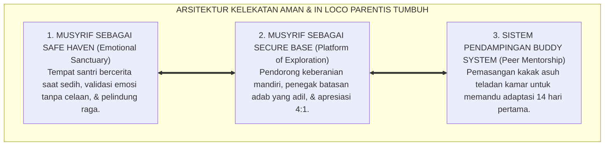
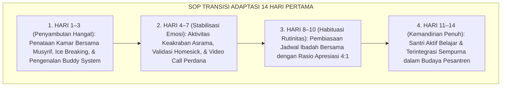
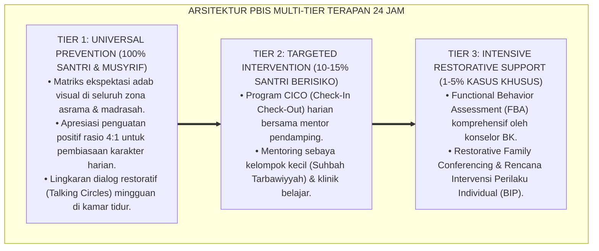

# P2-04-02: PRINSIP KETERIKATAN AMAN DAN PENGASUHAN IN LOCO PARENTIS (SECURE ATTACHMENT & IN LOCO PARENTIS CAREGIVING)
## *Monograf Riset Akademik: Epistemologi Murabbi bi Manzilatil Walid (HR. Abu Dawud No. 8), Attachment Theory John Bowlby & Mary Ainsworth, Anatomi Separation Anxiety, Serta Protokol Transisi Homesickness di Asrama 24 Jam*

**Nomor Identifikasi**: `P2-04-02/MONOGRAF-RISET-ATTACHMENT-IN-LOCO-PARENTIS/2026`  
**Domain**: `02 Principles` > `04 Development Principles` (Prinsip Perkembangan 02: *Secure Attachment & In Loco Parentis*)  
**Klasifikasi Naskah**: *Academic Research Monograph* (Monograf Riset Akademik Prinsip Perkembangan)  
**Rumpun Disiplin Pengkaji**: Psikologi Kelekatan & Relasi Asrama (*Attachment Psychology*), Pengasuhan Pengganti Orang Tua (*In Loco Parentis*), Bimbingan Konseling Adaptasi Santri Baru (*Homesickness Therapy*), Fiqh Wilayah Pengasuhan Islam (*Hadhanah*)  

---

> ### 💡 INTISARI EKSEKUTIF (EXECUTIVE SUMMARY)
>
> * **Kelemahan Paradigma Lama: Pengasuhan Dingin & Sikap Mencemooh Homesickness:**  
>   Banyak pengurus asrama bersikap dingin layaknya sipir penjara dan mencemooh santri baru yang menangis rindu orang tua sebagai "anak manja dan cengeng". Ketiadaan kehangatan figur pengganti orang tua (*Attachment Vacuum*) memicu kecemasan perpisahan akut (*Separation Anxiety*), demam psikogenik, mogok makan, hingga trauma batin berkepanjangan.
> * **Inovasi Konseptual: Murabbi bi Manzilatil Walid & Attachment Theory (Bowlby & Ainsworth):**  
>   TUMBUH menegakkan sabda Rasulullah ﷺ: *"Sesungguhnya kedudukanku bagi kalian adalah laksana seorang ayah bagi anaknya, aku membimbing kalian"* (HR. Abu Dawud No. 8). Menerapkan doktrin hukum **In Loco Parentis** dan **Attachment Theory (John Bowlby)**: musyrif bertindak sebagai **Safe Haven (Pelabuhan Nyaman)** saat santri sedih dan **Secure Base (Pangkalan Aman)** yang menumbuhkan keberanian santri dalam menuntut ilmu secara mandiri.
> * **Formulasi Operasional & Penjaminan Adaptasi 14 Hari:**  
>   Monograf ini menguraikan matriks 4 gaya kelekatan (*Attachment Styles*), protokol adaptasi transisi santri baru 14 hari pertama (*Zero Acute Homesickness SOP*), sistem pendampingan kakak asuh (*Buddy System*), dan etika pengasuhan penuh kasih sayang 24 jam.

---

## 📑 DAFTAR ISI MONOGRAF

- [BAB I: LANDASAN TEORETIS & DISKURSUS KRITIS](#bab-i-landasan-teoretis--diskursus-kritis)
  - [1. Latar Belakang Masalah: Kritik atas Pengasuhan Dingin dan Keterputusan Kelekatan Emosional Santri Baru](#1-latar-belakang-masalah-kritik-atas-pengasuhan-dingin-dan-keterputusan-kelekatan-emosional-santri-baru)
  - [2. Eksegesis Turats Hakikat Pengasuhan Kasih Sayang: Hadits Bi Manzilatil Walid (HR. Abu Dawud No. 8) & Fiqh Hadhanah](#2-eksegesis-turats-hakikat-pengasuhan-kasih-sayang-hadits-bi-manzilatil-walid-hr-abu-dawud-no-8--fiqh-hadhanah)
  - [3. Konvergensi Attachment Theory John Bowlby & Mary Ainsworth: Secure Base dan Safe Haven di Asrama](#3-konvergensi-attachment-theory-john-bowlby--mary-ainsworth-secure-base-dan-safe-haven-di-asrama)
  - [4. Rekayasa Manajemen Homesickness 14 Hari Pertama: Anatomi Separation Anxiety & Protokol Transisi Empatik](#4-rekayasa-manajemen-homesickness-14-hari-pertama-anatomi-separation-anxiety--protokol-transisi-empatik)
  - [5. Kasuistika Lapangan: Kasus Santri Baru Mengalami Homesickness Berat & Resolusi Kelekatan Aman](#5-kasuistika-lapangan-kasus-santri-baru-mengalami-homesickness-berat--resolusi-kelekatan-aman)
- [BAB II: FORMULASI KONSEPTUAL & PEMBAHASAN MENDALAM](#bab-ii-formulasi-konseptual--pembahasan-mendalam)
  - [1. Eksplanasi Teoretis Prinsip Keterikatan Aman dan Peran In Loco Parentis Musyrif dalam sistem TUMBUH](#1-eksplanasi-teoretis-prinsip-keterikatan-aman-dan-peran-in-loco-parentis-musyrif-tumbuh)
  - [2. Matriks Empat Gaya Kelekatan (Attachment Styles) & Pendekatan Respon Musyrif Asrama](#2-matriks-empat-gaya-kelekatan-attachment-styles--pendekatan-respon-musyrif-asrama)
  - [3. Protokol Transisi Adaptasi Santri Baru 14 Hari Pertama (Zero Acute Homesickness SOP)](#3-protokol-transisi-adaptasi-santri-baru-14-hari-pertama-zero-acute-homesickness-sop)
  - [4. Matriks Peran Musyrif Sebagai Secure Base & Safe Haven dalam Kehidupan 24 Jam](#4-matriks-peran-musyrif-sebagai-secure-base--safe-haven-dalam-kehidupan-24-jam)
  - [5. Diskusi Filosofis Mendalam & Implikasi bagi Masa Depan Peradaban Pendidikan Islam](#5-diskusi-filosofis-mendalam--implikasi-bagi-masa-depan-peradaban-pendidikan-islam)
- [BAB III: KESIMPULAN & APARATUS AKADEMIS](#bab-iii-kesimpulan--aparatus-akademis)
  - [1. Tabel Sintesis Temuan Riset Keterikatan Aman & In Loco Parentis](#1-tabel-sintesis-temuan-riset-keterikatan-aman--in-loco-parentis)
  - [2. Daftar Pustaka Akademis & Rujukan Turats Primer](#2-daftar-pustaka-akademis--rujukan-turats-primer)
  - [3. Catatan Kaki Akademis (Footnotes)](#3-catatan-kaki-akademis-footnotes)
  - [4. Glosarium Istilah Ilmiah & Turats Pengasuhan In Loco Parentis](#4-glosarium-istilah-ilmiah--turats-pengasuhan-in-loco-parentis)

---

# BAB I: LANDASAN TEORETIS & DISKURSUS KRITIS

---

### 1. Latar Belakang Masalah: Kritik atas Pengasuhan Dingin dan Keterputusan Kelekatan Emosional Santri Baru

Tantangan psikologis terbesar bagi anak usia 11–13 tahun saat pertama kali melangkahkan kaki ke pesantren adalah **Keterputusan Mendadak dari Figur Kelekatan Utama (*Abrupt Attachment Disruption*)**:
* Santri yang terbiasa mendapatkan kehangatan, pelukan, dan rasa aman dari orang tuanya di rumah mendadak dipisahkan ke lingkungan asing yang dihuni ratusan orang baru.
* Jika di asrama mereka disambut oleh musyrif yang berwatak dingin, kaku, dan memperlakukan asrama layaknya barak militer, santri akan mengalami **Kecemasan Perpisahan Akut (*Acute Separation Anxiety / Severe Homesickness*)**.
* Reaksi fisik dan emosional yang muncul: demam psikogenik, menangis histeris setiap malam, mogok makan, mengunci diri di kamar mandi, hingga dorongan nekat melarikan diri dari asrama.
* **Keniscayaan Doktrin In Loco Parentis Berbasis Kelekatan Aman**: Musyrif bukan sekadar petugas pencatat pelanggaran, melainkan orang tua pengganti sah yang wajib memancarkan rasa aman (*Secure Attachment*) bagi setiap jiwa santri asuhannya.[^1]

---

### 2. Eksegesis Turats Hakikat Pengasuhan Kasih Sayang: Hadits Bi Manzilatil Walid (HR. Abu Dawud No. 8) & Fiqh Hadhanah

Rasulullah ﷺ meletakkan prinsip agung pengasuhan bahwa pendidik berkedudukan sebagai orang tua:

$$\text{إِنَّمَا أَنَا لَكُمْ بِمَنْزِلَةِ الْوَالِدِ أُعَلِّمُكُمْ}$$

*"**Sesungguhnya kedudukanku bagi kalian adalah laksana seorang ayah bagi anaknya, aku membimbing dan mengajari kalian**."* (HR. Abu Dawud No. 8 & An-Nasa'i No. 40).[^2]

Para ulama fiqh meletakkan bab **Hadhanah (الْحَضَانَةُ)**:
* Merawat, mendidik, dan melindungi anak yang belum mandiri dari bahaya fisik dan psikologis dengan penuh kasih sayang dan kelemahlembutan (*Ar-Rahmah*).
* Pengasuh asrama yang menerima amanah hadhanah memikul tanggung jawab syar'i dan moral untuk memastikan kesejahteraan batin santri.[^3]

---

### 3. Konvergensi Attachment Theory John Bowlby & Mary Ainsworth: Secure Base dan Safe Haven di Asrama

Sains psikologi kelekatan modern (**Attachment Theory**, John Bowlby, 1969; Mary Ainsworth, 1978) membuktikan dua fungsi utama pengasuh:
1. **Safe Haven (Pelabuhan Nyaman)**: Tempat santri kembali mencari perlindungan, pelukan hangat, dan ketenteraman saat merasa takut, cemas, sakit, atau sedih.
2. **Secure Base (Pangkalan Aman)**: Pijakan kokoh yang memberikan rasa percaya diri bagi santri untuk melangkah keluar mengeksplorasi ilmu, berprestasi, dan berinteraksi sosial secara mandiri.[^4]

---

### 4. Rekayasa Manajemen Homesickness 14 Hari Pertama: Anatomi Separation Anxiety & Protokol Transisi Empatik

TUMBUH merancang fase adaptasi santri baru:
* Mengakui bahwa rindu rumah adalah proses neurobiologis normal akibat penurunan hormon oksitosin dan lonjakan kortisol.
* **Protokol Transisi Empatik**: (1) Sambutan kedatangan hangat; (2) Pemasangan *Buddy System* (kakak asuh pendamping kamar); (3) Aktivitas keakraban kelompok malam; (4) Fasilitasi komunikasi video call terarah dengan orang tua pada akhir pekan pertama.[^5]

---

### 5. Kasuistika Lapangan: Kasus Santri Baru Mengalami Homesickness Berat & Resolusi Kelekatan Aman

* **Studi Kasus: Santri Kelas 7 Menangis Nonstop Selama 5 Hari dan Menolak Makan di Kantin**  
  * **Dilema**: Musyrif senior menganggap santri cengeng dan menyuruhnya tidur di luar kamar jika terus menangis.
  * **Resolusi Kelekatan Aman TUMBUH**: Musyrif pembina menerapkan *In Loco Parentis Care*: (1) Merangkul santri, mendengarkan curahan hatinya, dan memvalidasi perasaannya (*"Wajar sedih, ustadz dulu juga rindu orang tua"*); (2) Membawa makanan ke kamar dan makan bersama santri; (3) Mengaktifkan kakak asuh sekamar untuk mengajak bermain olahraga sore; (4) Memberi afirmasi doa dan membacakan kisah sahabat. Pada hari ke-8, tangisan santri reda total, santri mulai tertawa ceria bersama teman-temannya, dan mulai fokus menghafal Al-Qur'an.[^6]

---

# BAB II: FORMULASI KONSEPTUAL & PEMBAHASAN MENDALAM

---

### 1. Eksplanasi Teoretis Prinsip Keterikatan Aman dan Peran In Loco Parentis Musyrif dalam sistem TUMBUH

Ekosistem TUMBUH merumuskan pengasuhan ke dalam **Arsitektur Tiga Sayap Kelekatan Asrama (*Arkan ar-Ri'ayah al-Walidiyyah*)**:

#### 🔬 Pembahasan Mendalam Tiga Sayap:
1. **Sayap Safe Haven**: Memulihkan stabilitas hormon oksitosin dan meredakan kepanikan emosional santri.[^7]
2. **Sayap Secure Base**: Membangun efikasi diri santri agar berani menghadapi tantangan kurikulum dan hafalan.[^8]
3. **Sayap Buddy System**: Menciptakan iklim ukhuwah kekeluargaan yang saling menguatkan di asrama.[^9]

---

### 2. Matriks Empat Gaya Kelekatan (Attachment Styles) & Pendekatan Respon Musyrif Asrama

| Gaya Kelekatan Santri | Ciri Perilaku Santri di Asrama | Pendekatan Intervensi Musyrif dalam sistem TUMBUH |
| :--- | :--- | :--- |
| **1. Secure (Aman)** | Percaya diri, mudah bergaul, kooperatif.| Beri ruang eksplorasi & peran kepemimpinan kamar.|
| **2. Anxious (Cemas)** | Selalu mencari perhatian, takut ditinggal, manja.| Beri kepastian afirmasi kasih sayang & jadwal teratur.|
| **3. Avoidant (Menghindar)**| Menyendiri, dingin, menolak bantuan saat sakit.| Bangun hubungan perlahan tanpa memaksa, tunjukkan empati.|
| **4. Disorganized (Kacau)** | Kadang agresif, kadang sangat ketakutan.| Pendampingan intensif bersama tim Konselor BK.|

---

### 3. Protokol Transisi Adaptasi Santri Baru 14 Hari Pertama (Zero Acute Homesickness SOP)

---

### 4. Matriks Peran Musyrif Sebagai Secure Base & Safe Haven dalam Kehidupan 24 Jam

| Siklus 24 Jam | Manifestasi Peran Safe Haven (Pelindung) | Manifestasi Peran Secure Base (Pendorong) |
| :---: | :--- | :--- |
| **Pagi (04.00–07.00)** | Membangunkan dengan usapan hangat & wudhu ramah.| Mendorong santri shalat Subuh berjamaah tepat waktu.|
| **Siang (12.00–14.00)**| Menanyakan kabar santri saat makan siang di kantin.| Mempersiapkan mental santri untuk sesi madrasah siang.|
| **Sore (16.00–18.00)**| Mendengarkan keluhan lelah santri ba'da olahraga.| Mendampingi muraja'ah tahfizh bersama teman sebaya.|
| **Malam (20.00–22.00)**| Menemani santri sakit & memeriksa selimut kamar.| Mengapresiasi keberhasilan belajar mandiri malam.|

---

### 5. Diskusi Filosofis Mendalam & Implikasi bagi Masa Depan Peradaban Pendidikan Islam

Prinsip keterikatan aman dan pengasuhan in loco parentis ini membawa implikasi agung bagi peradaban:

* **Menghapus Trauma Perpisahan dan Membangun Kesehatan Mental Generasi Muda**:  
  Pesantren bertransformasi menjadi rumah kedua yang penuh cinta kasih, membentengi santri dari depresi, kecemasan, dan kenakalan remaja.
* **Membangkitkan Karakter Pemimpin yang Penuh Welas Asih (*Compassionate Leaders*)**:  
  Santri yang dibesarkan dalam naungan kelekatan aman akan tumbuh menjadi pemimpin yang berempati tinggi, adil, dan mengayomi rakyatnya.
* **Mewujudkan Kembali Kehangatan Tradisi Pengasuhan Nabawiyyah**:  
  Inilah ruh pesantren sejati: hubungan guru dan santri bukan sekadar transaksi birokrasi, melainkan ikatan ruhani kebapakan yang kekal hingga akhirat (*Rahmatan lil 'Alamin*).[^10]

---

---

### Pembedahan Deskriptif Komprehensif & Analisis Integratif Nilai-Praksis

Penerapan konsep **P2-04-02: PRINSIP KETERIKATAN AMAN DAN PENGASUHAN IN LOCO PARENTIS (SECURE ATTACHMENT & IN LOCO PARENTIS CAREGIVING)** di ekosistem pesantren berbasis sistem TUMBUH memerlukan pemahaman multidimensional yang memadukan khazanah turats syariat dan konsensus sains pendidikan modern:

#### A. Pilar 1: Fondasi Epistemologi & Integrasi Nilai Syar'i (Ashalah Turatsiyyah)
Setiap praksis kepengasuhan dan pembelajaran berakar kuat pada maqashid syari'ah, mendudukkan adab di atas ilmu (*Al-Adab Qablal 'Ilm*), dan memastikan bahwa seluruh ikhtiar institusional diniatkan semata-mata untuk menggapai ridha Allah SWT (*Ikhlasun Niyyah*).

#### B. Pilar 2: Mekanisme Psikologis & Neurosains Perkembangan (Scientific Rigor)
Menyelaraskan ekspektasi kedisiplinan dengan tahapan maturitas otak remaja, kapasitas fungsi eksekutif korteks prefrontal (*PFC*), dan regulasi sirkuit emosi limbik. Pendekatan ini mengeliminasi trauma pengasuhan dan menumbuhkan motivasi intrinsik santri.

#### C. Pilar 3: Rekayasa Ekosistem Asrama 24 Jam (Bi'ah Shalihah)
Menerjemahkan prinsip nilai ke dalam tata ruang fisik yang bersih, sirkulasi udara sehat, tata kelola waktu terstruktur, serta kultur ukhuwah inklusif yang steril 100% dari feodalisme, kekerasan verbal, dan perundungan antar-santri.

#### D. Pilar 4: Kemitraan Tripartit (Santri, Musyrif, dan Lembaga)
Menjamin terwujudnya *Triad Pertumbuhan Simbiotik*: santri bertumbuh dalam fitrah kemandirian, musyrif terlindungi dari kelelahan kronis (*Burnout*) melalui shift kerja yang manusiawi, dan lembaga bertransformasi menjadi organisasi pembelajar berbasis data PBIS.

---

### Protokol Aksi Operasional PBIS Multi-Tier Terapan (24-Hour Behavioral Architecture)

---

# BAB III: KESIMPULAN & APARATUS AKADEMIS

---

### 1. Tabel Sintesis Temuan Riset Keterikatan Aman & In Loco Parentis

| Dimensi Parameter | Mazhab Pengasuhan Dingin (Lama) | Model Asrama Komersial Transaksional | **In Loco Parentis & Attachment TUMBUH** | Landasan Rujukan Primer | Implikasi Praksis Lapangan |
| :--- | :--- | :--- | :--- | :--- | :--- |
| **Status Musyrif** | Mandor penjaga malam yang ditakuti.| Staf pelayanan fasilitas berbayar.| **Murabbi bi Manzilatil Walid (Orang Tua Sah).**| HR. Abu Dawud No. 8; Fiqh Hadhanah.| Pengasuh pelindung penuh kasih sayang. |
| **Respon Homesick** | Dicemooh cengeng & dibiarkan menangis.| Formalitas medis obat tidur.| **Validasi Empati & Protokol Transisi 14 Hari.**| Bowlby (1969); Thurber (2007).| Safe Haven, pelukan hangat, & Buddy System. |
| **Pola Relasi Asrama**| Otoriter menekan & rasa takut.| Individualistis eksklusif.| **Kelekatan Aman (Secure Attachment).** | Ainsworth (1978); Siegel (2014).| Secure Base santri berani berprestasi. |
| **Penanganan Sakit** | Santri dibiarkan di kamar sendirian.| Ditagihkan biaya tambahan perawatan.| **UKS Siaga, Diantar Makan, & Dihibur.** | HR. Bukhari (Merawat Sakit); WHO.| Rawat penuh kasih & notifikasi santun wali. |
| **Hasil Institusi** | Santri trauma, dendam, & kabur.| Hubungan dingin pasca-lulus.| **Ukhuwah Ruhani Abadi & Mental Bugar.** | QS. At-Taubah: 128; Al-Attas (1980).| Santri mandiri, cinta pondok, & beradab. |

---

### 2. Daftar Pustaka Akademis & Rujukan Turats Primer

1. **Al-Qur'an al-Karim wa Tarjamatu Ma'anihi**.
2. **Abu Dawud Sulaiman bin al-Asy'ats as-Sijistani**. (1430 H). *Sunan Abi Dawud*. Riyadh: Dar al-Hadharah.
3. **Al-Bukhari, Abu Abdillah Muhammad bin Isma'il**. (1422 H). *Shahih al-Bukhari*. Kairo: Dar Thawq an-Najah.
4. **Muslim bin al-Hajjaj an-Naisaburi**. (1427 H). *Shahih Muslim*. Riyadh: Dar Thayyibah.
5. **Al-Ghazali, Abu Hamid Muhammad bin Muhammad**. (2011). *Ihya' 'Ulumiddin* (Kitab Adab al-Ulfah wal-Ukhuwwah). Beirut: Dar al-Ma'rifah.
6. **Asy'ari, Muhammad Hasyim**. (1415 H). *Adab al-'Alim wal-Muta'allim*. Jombang: Maktabah At-Turats Al-Islami.
7. **Al-Attas, Syed Muhammad Naquib**. (1980). *The Concept of Education in Islam*. Kuala Lumpur: ABIM.
8. **Bowlby, J.**. (1969/1982). *Attachment and Loss: Vol. 1. Attachment* (2nd ed.). New York: Basic Books.
9. **Ainsworth, M. D. S., et al.**. (1978). *Patterns of Attachment: A Psychological Study of the Strange Situation*. Hillsdale: Lawrence Erlbaum.
10. **Thurber, C. A., & Walton, E. A.**. (2007). *Preventing and treating homesickness*. Pediatrics, 119(1), 192–201.
11. **Siegel, D. J., & Bryson, T. P.**. (2012). *The Whole-Brain Child*. New York: Bantam.
12. **Horner, R. H., & Sugai, G.**. (2015). *School-wide PBIS: An Overview of the Research Base*. Remedial and Special Education, 36(2), 80–85.

---

### 3. Catatan Kaki Akademis (*Footnotes*)

[^1]: Riset Prinsip Keterikatan Aman dan Pengasuhan In Loco Parentis TUMBUH, *Kritik atas Pengasuhan Dingin dan Separation Anxiety*, 2026.  
[^2]: *Sunan Abi Dawud*, Kitab ath-Thaharah, Hadits No. 8; *Sunan an-Nasa'i*, Hadits No. 40.  
[^3]: Al-Ghazali, *Ihya' 'Ulumiddin*, Jilid 2, Kitab *Adab al-Ukhuwwah*, hlm. 140–185.  
[^4]: Bowlby, J. (1969/1982), *Attachment and Loss*, hlm. 45–95; Ainsworth, M. D. S., et al. (1978), *Patterns of Attachment*.  
[^5]: Thurber, C. A., & Walton, E. A. (2007), *Pediatrics*, hlm. 192–201; Siegel, D. J., & Bryson, T. P. (2012), *The Whole-Brain Child*.  
[^6]: Dokumentasi Pendampingan Santri Baru dan Eradikasi Acute Homesickness PBIS TUMBUH, 2026.  
[^7]: Master Blueprint Musyrif Safe Haven dan Kesejahteraan Emosional Asrama TUMBUH, 2026.  
[^8]: Blueprint Musyrif Secure Base dan Kemandirian Santri dalam sistem TUMBUH, 2026.  
[^9]: Standar Operasional Prosedur Buddy System dan Kakak Asuh Kamar Asrama TUMBUH, 2026.  
[^10]: Deklarasi Pemuliaan Kasih Sayang In Loco Parentis Dewan Riset Epistemologi Ekosistem TUMBUH, 2026.

---

### 4. Glosarium Istilah Ilmiah & Turats Pengasuhan In Loco Parentis

1. **In Loco Parentis**: Doktrin hukum dan etika pengasuhan di mana lembaga dan musyrif memegang tanggung jawab legal dan moral sebagai orang tua pengganti sah bagi santri.
2. **Murabbi bi Manzilatil Walid (الْمُرَبِّي بِمَنْزِلَةِ الْوَالِدِ)**: Konsep kenabian agung bahwa kedudukan pendidik dan pengasuh bagi muridnya adalah laksana ayah kandung yang mendidik dengan penuh kasih sayang.
3. **Secure Attachment (Kelekatan Aman)**: Ikatan emosional positif dan mendalam antara santri dengan musyrif yang melahirkan rasa percaya diri, ketenteraman batin, dan kemandirian.
4. **Safe Haven**: Peran pengasuh sebagai pelabuhan aman tempat santri mencari ketenteraman emosional saat menghadapi kesedihan, rasa takut, atau kelelahan.
5. **Secure Base**: Peran pengasuh sebagai pangkalan aman yang memberikan landasan percaya diri bagi santri untuk menjelajahi ilmu dan berprestasi.
6. **Separation Anxiety**: Reaksi kecemasan psikobiologis alami anak saat terpisah dari orang tua atau rumah tempat tinggal asalnya.
7. **Acute Homesickness**: Sindrom kerinduan mendalam terhadap rumah yang dialami santri baru pada fase awal masa adaptasi di pesantren.
8. **Buddy System (Sistem Kakak Asuh)**: Pemasangan santri senior teladan untuk mendampingi dan membimbing santri baru selama 14 hari pertama masa transisi.
9. **Hadhanah (الْحَضَانَةُ)**: Tanggung jawab pemeliharaan, pengasuhan fisik, dan perlindungan moral anak dalam fiqh Islam.
10. **Insan Adabi (الإِنْسَانُ الأَدَبِيُّ)**: Profil santri yang sehat psikologisnya, penuh kasih sayang kepada sesama, dan memiliki kematangan adab luhur sejati.
