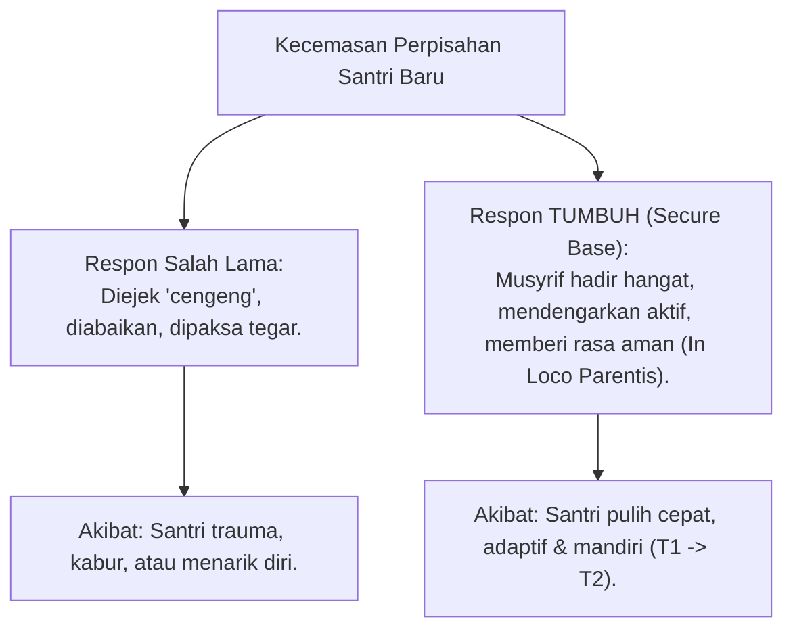

# P2-04-02-Prinsip-Keterikatan-Aman-dan-In-Loco-Parentis

## Tujuan
Menetapkan prinsip kelekatan aman (**Attachment Theory - John Bowlby, 1982**) dan fungsi pengasuhan pengganti orang tua (*In Loco Parentis*) bagi para musyrif dan wali asrama untuk memulihkan kecemasan perpisahan (*Homesickness*) serta membangun fondasi keamanan emosional santri.

---

## 1. Homesickness Sebagai Reaksi Kelekatan Alami

Ketika santri baru (usia 12–15 tahun) masuk ke asrama dan berpisah dari orang tuanya, sistem sarafnya mengalami ancaman pemutusan figur lekat (*Attachment Severance*). 

Gejala homesickness (menangis, murung, sulit makan, sakit psikosomatis) adalah **reaksi biologis normal**, bukan kelemahan iman atau sifat cengeng.

---

## 2. 4 Pilar Pengasuhan In Loco Parentis Musyrif

1. **Kehadiran Fisik & Emosional yang Mudah Diakses (*Availability & Responsiveness*)**:
   - Musyrif hadir di asrama saat santri bangun tidur, pulang KBM, dan menjelang tidur malam untuk menyapa dan memvalidasi perasaan santri.
2. **Penerimaan Positif Tanpa Syarat (*Unconditional Positive Regard - Carl Rogers*)**:
   - Menghargai dan menyayangi santri sebagai amanah titipan Allah tanpa membeda-bedakan status sosial, asal daerah, atau kecerdasan awal.
3. **Penyediaan Sandaran Aman (*Safe Haven & Secure Base*)**:
   - Kamar musyrif menjadi tempat yang aman bagi santri untuk berkeluh kesah tanpa takut dihakimi atau disebarkan rahasianya.
4. **Koordinasi Empatis dengan Orang Tua Kandung**:
   - Musyrif secara berkala memberikan laporan perkembangan positif santri kepada orang tua, menjembatani komunikasi yang menenteramkan kedua belah pihak.

---

## 3. Status Dokumen
* **Status**: 🌟 **A+ (Tervalidasi & Siap Diimplementasikan)**
* **Level**: Project 2 - `02 Principles / 04 Development Principles`
* **Langkah Berikutnya**: **`P2-04-03-Prinsip-Progresi-Tangga-TUMBUH-T1-T4.md`**.
