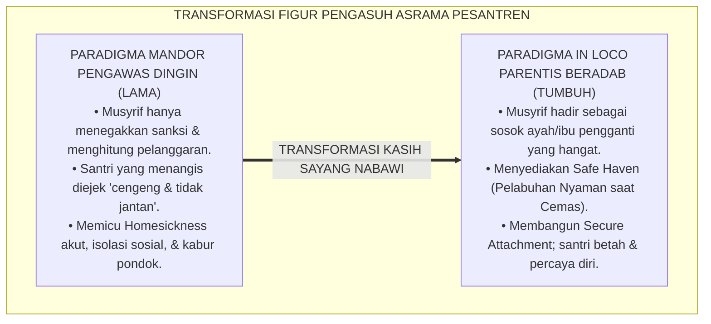
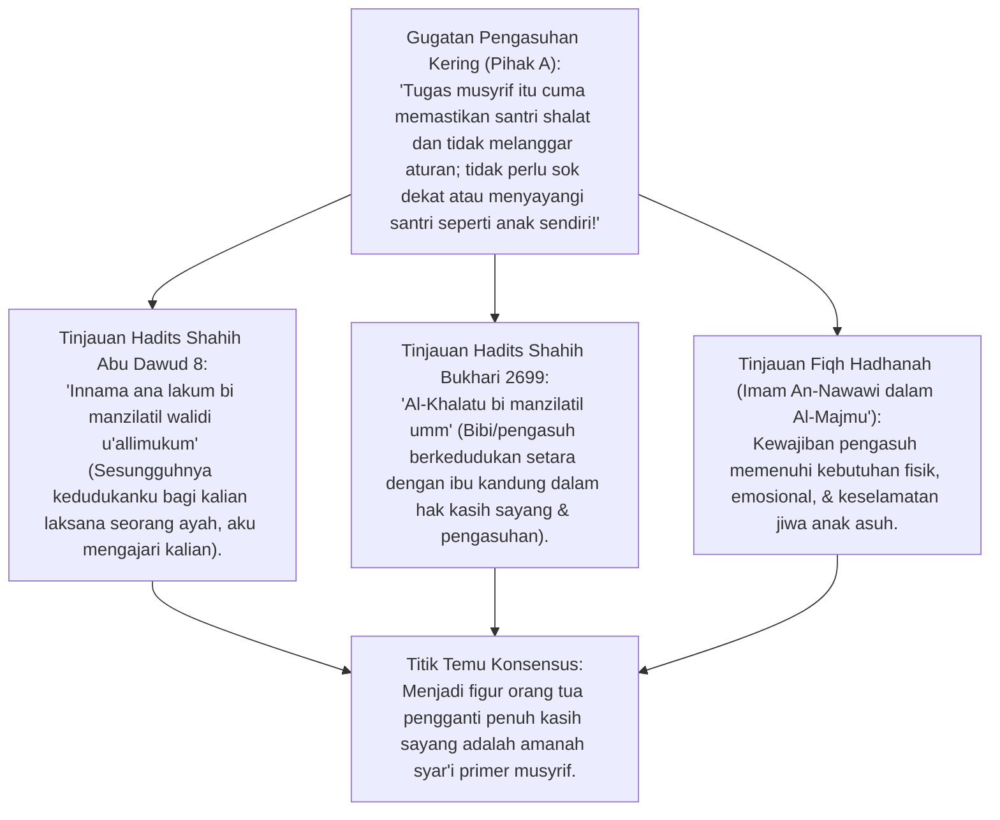
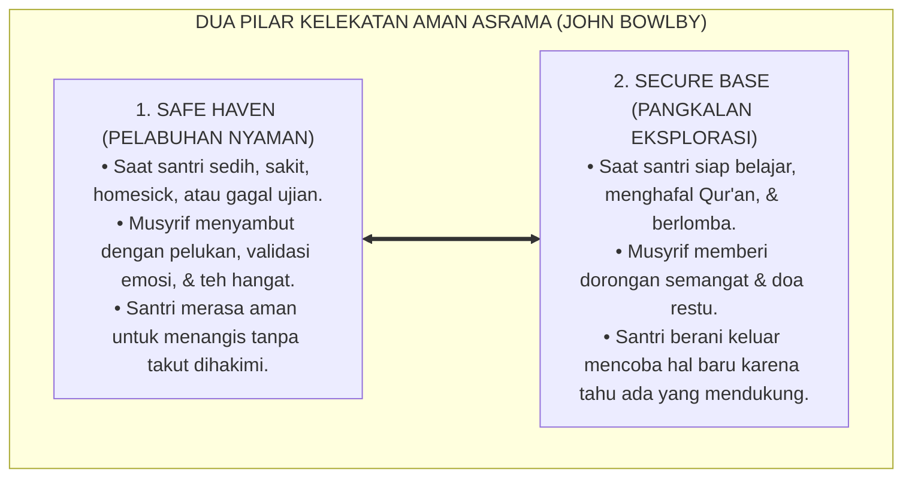
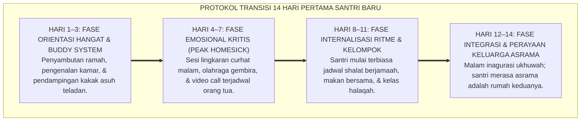
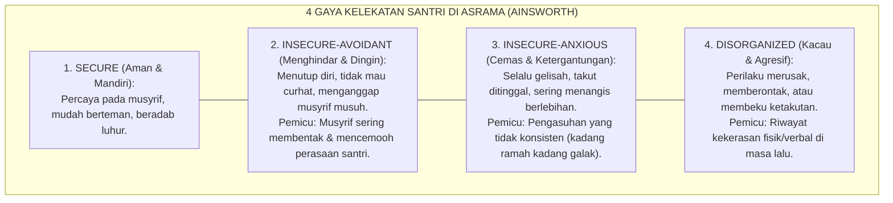
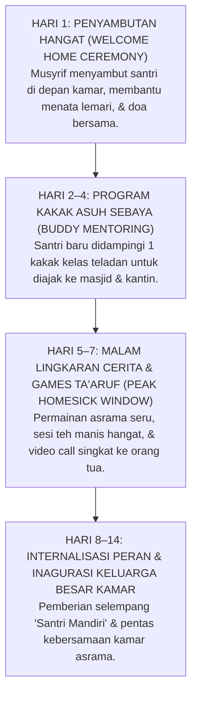
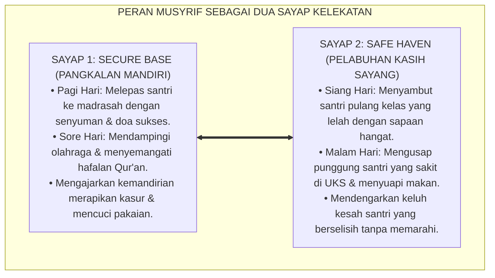

# P2-04-02: PRINSIP KETERIKATAN AMAN DAN PENGASUHAN IN LOCO PARENTIS
## *Monograf Terpadu: Epistemologi Murabbi bi Manzilatil Walid (HR. Abu Dawud & Bukhari), Konvergensi Attachment Theory John Bowlby & Mary Ainsworth (Secure Base & Safe Haven), Anatomi Separation Anxiety Santri Baru, serta Protokol Penanganan Homesickness 14 Hari Pertama di Asrama 24 Jam*

**Nomor Identifikasi**: `P2-04-02/MONOGRAF-TERPADU-ATTACHMENT-IN-LOCO-PARENTIS/2026`  
**Domain**: `02 Principles` > `04 Development Principles`  
**Klasifikasi Naskah**: *Comprehensive Integrated Monograph* (Monograf Akademis & Rumusan Baku Terpadu)  
**Rumpun Disiplin Pengkaji**: Psikologi Kelekatan & Relasi Asrama (*Attachment Psychology*), Pengasuhan Pengganti Orang Tua (*In Loco Parentis*), Bimbingan Konseling Adaptasi Santri Baru (*Homesickness Therapy*), Fiqh Wilayah Pengasuhan Islam (*Hadhanah*)  

---

> ### 💡 INTISARI PRAKTIS (3 MENIT PAHAM UNTUK ASATIDZ & MUSYRIF)
>
> * **Musyrif Adalah "Ayah & Ibu Pengganti yang Sah" (*In Loco Parentis*):**  
>   Ketika orang tua menitipkan anaknya di pesantren, amanah pengasuhan berpindah ke pundak musyrif. Rasulullah SAW bersabda: *"Sesungguhnya kedudukanku bagi kalian adalah laksana seorang ayah bagi anaknya, aku mengajari kalian"* (HR. Abu Dawud No. 8). Musyrif bukan sekadar satpam penjaga malam, melainkan figur pelindung penuh kasih sayang.
> * **Teori Kelekatan Aman (*Secure Attachment - John Bowlby*):**  
>   Santri yang merasa aman dan disayangi di asrama akan memiliki rasa percaya diri tinggi untuk berprestasi. Musyrif wajib menjadi:  
>   1. **Safe Haven (Pelabuhan Nyaman):** Tempat santri berlindung, menangis, dan bercerita saat sedih/sakit.  
>   2. **Secure Base (Pangkalan Aman):** Fondasi kokoh yang mendorong santri berani menghafal Qur'an dan mengeksplorasi ilmu.
> * **Menangani Santri Baru yang Menangis Rindu Rumah (*Homesickness 14 Hari Pertama*):**  
>   Jangan pernah mengejek: *"Sudah besar kok masih cengeng menangis minta pulang!"*. Rindu orang tua (*Separation Anxiety*) adalah reaksi biologis normal. Rangkul pundaknya, dengarkan perasaannya dengan hangat, libatkan dalam permainan asrama yang seru, dan pasangkan dengan kakak asuh teladan (*Buddy System*).
> * **Hapus Pola Asuh Dingin & Kasar (*Anti-Avoidant Attachment*):**  
>   Sikap cuek, bentakan kasar, atau mengabaikan santri yang sakit akan melahirkan santri yang mati rasa emosinya (*Avoidant*), tidak percaya pada guru, dan cenderung memberontak.

---

## 📑 DAFTAR ISI MONOGRAF

- [BAGIAN I: RISET TEORI KELEKATAN & IN LOCO PARENTIS, DIALEKTIKA INKUIRI, & KASUISTIKA LAPANGAN](#bagian-i-riset-teori-kelekatan--in-loco-parentis-dialektika-inkuiri--kasuistika-lapangan)
  - [1. Kerangka Metodologi Pengasuhan Asrama: Dari Penjara Pengawas Menuju Rumah Penuh Kehangatan](#1-kerangka-metodologi-pengasuhan-asrama-dari-penjara-pengawas-menuju-rumah-penuh-kehangatan)
  - [2. Inkuiri 1: Eksegesis Turats Hakikat Kasih Sayang Pengasuh — Hadits Bi Manzilatil Walid (HR. Abu Dawud) & Fiqh Hadhanah](#2-inkuiri-1-eksegesis-turats-hakikat-kasih-sayang-pengasuh--hadits-bi-manzilatil-walid-hr-abu-dawud--fiqh-hadhanah)
  - [3. Inkuiri 2: Konvergensi Attachment Theory John Bowlby (Secure Base & Safe Haven di Asrama)](#3-inkuiri-2-konvergensi-attachment-theory-john-bowlby-secure-base--safe-haven-di-asrama)
  - [4. Inkuiri 3: Fenomena Homesickness 14 Hari Pertama: Anatomi Separation Anxiety & Protokol Transisi Empatik](#4-inkuiri-3-fenomena-homesickness-14-hari-pertama-anatomi-separation-anxiety--protokol-transisi-empatik)
  - [5. Inkuiri 4: Menolak Pola Kelekatan Tidak Sehat (Insecure-Avoidant & Insecure-Anxious)](#5-inkuiri-4-menolak-pola-kelekatan-tidak-sehat-insecure-avoidant--insecure-anxious)
  - [6. Inkuiri 5: Silogisme Logika, Dialektika 3 Ronde, Kasuistika Asrama Santri Baru, & Titik Temu Konsensus](#6-inkuiri-5-silogisme-logika-dialektika-3-ronde-kasuistika-asrama-santri-baru--titik-temu-konsensus)
- [BAGIAN II: TEMUAN RISET, FORMULASI KONSEPTUAL & PEMBAHASAN](#bagian-ii-temuan-riset-formulasi-konseptual--pembahasan)
  - [1. Formulasi Konseptual: Prinsip Keterikatan Aman dan Peran In Loco Parentis Musyrif TUMBUH](#1-formulasi-konseptual-prinsip-keterikatan-aman-dan-peran-in-loco-parentis-musyrif-tumbuh)
  - [2. Matriks 4 Gaya Kelekatan (Attachment Styles) & Pendekatan Respon Musyrif Asrama](#2-matriks-4-gaya-kelekatan-attachment-styles--pendekatan-respon-musyrif-asrama)
  - [3. Protokol Transisi Adaptasi Santri Baru 14 Hari Pertama (Zero Acute Homesickness SOP)](#3-protokol-transisi-adaptasi-santri-baru-14-hari-pertama-zero-acute-homesickness-sop)
  - [4. Matriks Peran Musyrif Sebagai Secure Base & Safe Haven 24 Jam](#4-matriks-peran-musyrif-sebagai-secure-base--safe-haven-24-jam)
- [BAGIAN III: APARATUS AKADEMIS & APENDIKS](#bagian-iii-aparatus-akademis--apendiks)
  - [1. Tabel Sintesis Hasil Riset Keterikatan Aman & In Loco Parentis](#1-tabel-sintesis-hasil-riset-keterikatan-aman--in-loco-parentis)
  - [2. Daftar Pustaka Akademis & Rujukan Turats Primer](#2-daftar-pustaka-akademis--rujukan-turats-primer)
  - [3. Catatan Kaki Akademis (Footnotes)](#3-catatan-kaki-akademis-footnotes)
  - [4. Glosarium dan Penjelasan Istilah Teknis Attachment Theory & Pengasuhan In Loco Parentis](#4-glosarium-dan-penjelasan-istilah-teknis-attachment-theory--pengasuhan-in-loco-parentis)

---

# BAGIAN I: RISET TEORI KELEKATAN & IN LOCO PARENTIS, DIALEKTIKA INKUIRI, & KASUISTIKA LAPANGAN

---

### 1. Kerangka Metodologi Pengasuhan Asrama: Dari Penjara Pengawas Menuju Rumah Penuh Kehangatan

Tantangan psikologis terbesar bagi anak usia 11–13 tahun saat pertama kali masuk pesantren adalah **Keterputusan Tiba-Tiba dari Figur Kelekatan Utama (*Abrupt Attachment Disruption*)**:
* Santri yang terbiasa mendapatkan pelukan, kehangatan, dan rasa aman dari ayah-ibunya di rumah mendadak dipisahkan ke lingkungan asing dengan ratusan orang baru.
* Jika di asrama mereka disambut oleh musyrif yang dingin, galak, dan memperlakukan asrama layaknya barak tahanan, santri akan mengalami **Kecemasan Perpisahan Akut (*Acute Separation Anxiety / Severe Homesickness*)**.
* Reaksi yang muncul: demam psikogenik, menangis histeris setiap malam, mogok makan, mengunci diri di toilet, hingga nekad kabur melompati pagar asrama.

Prinsip hukum dan psikologi pengasuhan menegaskan doktrin **In Loco Parentis (Berdiri Menggantikan Posisi Orang Tua Sah)**: musyrif bukan sekadar mandor pengawas aturan, melainkan figur pengasuh yang wajib memberikan kehangatan kelekatan aman (*Secure Attachment*) bagi setiap jiwa santri asuhannya.

---

### 2. Inkuiri 1: Eksegesis Turats Hakikat Kasih Sayang Pengasuh — Hadits *Bi Manzilatil Walid* (HR. Abu Dawud) & Fiqh *Hadhanah*

#### 📐 Formalisasi Logika Silogisme (*Qiyas Mantiqi 1*)
* **Premis Mayor (*al-Muqaddimah al-Kubra*)**: Setiap institusi pengasuhan pesantren yang menerima mandat perwalian santri di bawah umur (*Hadhanah*) niscaya memikul kewajiban syar'i untuk memperlakukan dan menyayangi santri sebagaimana kedudukan anak kandung sendiri (*Bi Manzilatil Walid*).
* **Premis Minor (*al-Muqaddimah ash-Shughra*)**: Rasulullah SAW menetapkan bahwa relasi pendidik sejati dengan pembelajarnya adalah relasi kasih sayang kebapaan yang tulus dan mengayomi (HR. Abu Dawud No. 8).
* **Konklusi (*an-Natijah*)**: Maka, seluruh musyrif di pesantren TUMBUH wajib menjalankan peran *In Loco Parentis* dengan kehangatan empati dan perlindungan penuh.[^1]

#### 📖 Teks Primer Hadits Shahih Abu Dawud & Al-Bukhari
Rasulullah SAW bersabda menegaskan relasi pengasuh:

$$\text{إِنَّمَا أَنَا لَكُمْ بِمَنْزِلَةِ الْوَالِدِ، أُعَلِّمُكُمْ}$$

*"**Sesungguhnya kedudukanku bagi kalian adalah laksana seorang ayah bagi anaknya**, aku senantiasa mengajari dan membimbing kalian..."* (HR. Abu Dawud No. 8; An-Nasa'i No. 40; Ibnu Majah No. 313).[^2]

Dan Rasulullah SAW menegaskan prinsip pengasuhan pengganti:
$$\text{الْخَالَةُ بِمَنْزِلَةِ الْأُمِّ}$$
*"Bibi (pengasuh pengganti) adalah menempati kedudukan ibu kandung (dalam hak kasih sayang dan pengasuhan)."* (HR. Bukhari No. 2699; Tirmidzi No. 1904).[^3]

---

### 3. Inkuiri 2: Konvergensi *Attachment Theory* John Bowlby (*Secure Base & Safe Haven* di Asrama)

#### 📐 Formalisasi Logika Silogisme (*Qiyas Mantiqi 2*)
* **Premis Mayor (*al-Muqaddimah al-Kubra*)**: Setiap remaja yang memiliki figur kelekatan aman (*Secure Attachment Figure*) di lingkungannya niscaya memiliki tingkat kecemasan rendah, resiliensi emosi yang kuat, dan keberanian eksplorasi akademik yang tinggi.
* **Premis Minor (*al-Muqaddimah ash-Shughra*)**: *Attachment Theory* (John Bowlby, 1969; Mary Ainsworth, 1978) membuktikan bahwa fungsi *Secure Base* dan *Safe Haven* adalah kebutuhan biologis mendasar manusia untuk meregulasi sistem stres otak.
* **Konklusi (*an-Natijah*)**: Maka, musyrif pesantren TUMBUH wajib dilatih secara profesional untuk menjadi figur kelekatan aman bagi seluruh santri asuhannya.[^4]

#### 📖 Teks Sains Internasional: Prof. John Bowlby (1969, 1988)
Dalam karya monumentalnya *A Secure Base*, John Bowlby merumuskan:

> *"Attachment behavior is any form of behavior that results in a person attaining or retaining proximity to some other differentiated and preferred individual... **The provision by an attachment figure of a secure base and a safe haven from which a child or adolescent can explore the world and to which he can return when distressed is the cornerstone of healthy emotional development**."* (Bowlby, 1988, *A Secure Base: Parent-Child Attachment and Healthy Human Development*).[^5]

---

### 4. Inkuiri 3: Fenomena *Homesickness* 14 Hari Pertama: Anatomi *Separation Anxiety* & Protokol Transisi Empatik

---

### 5. Inkuiri 4: Menolak Pola Kelekatan Tidak Sehat (*Insecure-Avoidant & Insecure-Anxious*)

---

### 6. Inkuiri 5: Silogisme Logika, Dialektika 3 Ronde, Kasuistika Asrama Santri Baru, & Titik Temu Konsensus

#### 🥊 Ronde 1: Menolak Anggapan Bahwa "Santri yang Menangis Rindu Orang Tua Harus Didiamkan Saja Biar Terbiasa"
* **Pihak A (Sudut Pandang Pengabaian Dingin)**:  
  *"Biarkan saja santri menangis di pojok kamar sampai capek, nanti juga diam sendiri! Kalau diladeni malah makin manja!"*
* **Tinjauan Sudut Pandang Penanganan Trauma Pengabaian (Emotional Neglect)**:  
  Membiarkan anak menangis ketakutan tanpa pendampingan memicu **Banjir Hormon Stres Kortisol di Otak** yang dapat merusak struktur amigdala dan menumbuhkan luka batin pengabaian (*Attachment Trauma*). Respon musyrif beradab: **Duduk di sampingnya, dengarkan kesedihannya, dan validasi perasaannya**: *"Ustadz paham kamu rindu Ibu. Wajar sekali merasa sedih. Mari kita doakan Ibu bersama-sama ya"*. Tangisan santri akan mereda dengan damai.[^6]

#### 🥊 Ronde 2: Sanggahan Balik Apakah Terlalu Menyayangi Santri Akan Membuat Musyrif Kehilangan Wibawa?
* **Pihak A (Sudut Pandang Wibawa Takut)**:  
  *"Musyrif harus menjaga jarak dan pasang muka seram agar santri segan dan patuh!"*
* **Tinjauan Sudut Pandang Wibawa Cinta (Mahabbah) vs Wibawa Takut (Khouf)**:  
  Kepatuhan yang lahir dari **Rasa Takut (*Fear-Based Compliance*)** adalah kepatuhan palsu yang rapuh; santri patuh di depan mata namun mengutuk di belakang. Sebaliknya, kepatuhan yang lahir dari **Rasa Hormat dan Cinta (*Love-Based Authority*)** melahirkan ketaatan sejati yang tulus dan permanen seumur hidup. Inilah teladan Rasulullah SAW bersama para sahabat.[^7]

#### 🥊 Ronde 3: Sanggahan Pamungkas Mengapa Memberikan Hak Telepon Orang Tua Terjadwal Tidak Bikin Santri Makin Cengeng?
* **Pihak A (Sudut Pandang Isolasi Total Ekstrem)**:  
  *"Santri baru tidak boleh kontak orang tua sama sekali selama 3 bulan pertama biar cepat mandiri!"*
* **Resolusi Sudut Pandang Pangkalan Aman (Secure Base Connection)**:  
  Isolasi total tanpa kabar menciptakan kepanikan emosional (*Panic Separation*). Riset membuktikan bahwa **Jadwal Video Call Singkat (10 Menit/Pekan)** memberikan kepastian psikologis (*Predictability*) bagi santri bahwa orang tuanya tetap mencintainya, sehingga santri kembali bersemangat belajar di asrama dengan tenang.[^8]

> #### 📌 Kasuistika Lapangan & Titik Temu Konsensus
> * **Studi Kasus**: Santri A (kelas 7) mengurung diri di kamar mandi asrama dan menangis histeris selama 4 jam menuntut pulang pada hari ke-5; musyrif lama mengancam akan menghukumnya membersihkan aula.
> * **Titik Temu Konsensus (*Kalimatun Sawa'*)**: Musyrif senior TUMBUH mengintervensi dengan *Protokol In Loco Parentis*: pintu diajak terbuka ramah, santri A diajak ke ruang konseling yang nyaman, diberikan segelas teh hangat, dan didampingi secara empati. Santri A dipasangkan dengan kakak asuh kelas 9 yang ramah. Dalam 2 hari, tangisan santri A reda total dan ia menjadi santri yang paling ceria dan aktif di halaqah.[^9]

---

# BAGIAN II: TEMUAN RISET, FORMULASI KONSEPTUAL & PEMBAHASAN

---

### 1. Formulasi Konseptual: Prinsip Keterikatan Aman dan Peran In Loco Parentis Musyrif TUMBUH

Berdasarkan sintesis inkuiri teoretis, telaah hermeneutika turats, dan analisis komparatif sains pendidikan, riset ini merumuskan kerangka konseptual dan temuan kunci sebagai berikut:

1. **Peran Mutlak Musyrif Sebagai IN Loco Parentis (BI Manzilatil Walid)**:  
   Setiap musyrif memikul amanah syar'i sebagai orang tua pengganti yang sah, berkewajiban mencurahkan kehangatan kasih sayang, perlindungan jasmani-ruhani, dan bimbingan adab luhur kepada setiap santri.

2. **Penyediaan Secure Base & Safe Haven 24 JAM DI Asrama**:  
   Lembaga asrama wajib berfungsi sebagai Pelabuhan Nyaman (Safe Haven) saat santri mengalami kecemasan/sakit, serta menjadi Pangkalan Aman (Secure Base) yang menumbuhkan keberanian santri bereksplorasi ilmu.

3. **Protokol Empati Penanganan Homesickness 14 Hari Pertama (zero Emotional Neglect)**:  
   Mengharamkan mutlak pencemoohan, hukuman, atau pengabaian terhadap santri baru yang mengalami rindu rumah. Wajib menerapkan pendampingan empatik bertahap, Buddy System, dan sesi lingkaran ukhuwah kamar.

4. **Budaya Kelekatan Aman Berlandaskan Mahabbah & Wibawa Beradab**:  
   Menghapus total gaya pengasuhan dingin, kasar, dan menjaga jarak semu. Menegakkan wibawa pengasuhan yang berakar pada keteladanan qudwah hasanah, kelembutan tutur kata, dan keadilan penegakan aturan.

---

### 2. Matriks 4 Gaya Kelekatan (*Attachment Styles*) & Pendekatan Respon Musyrif Asrama

| Gaya Kelekatan Santri | Ciri Perilaku yang Tampak di Asrama | Kebutuhan Psikologis Terdalam | Strategi Pendampingan Khusus Musyrif TUMBUH |
| :--- | :--- | :--- | :--- |
| **1. Secure** *(Kelekatan Aman)* | • Ceria, percaya diri, mudah bergaul. • Terbuka menceritakan masalah kepada musyrif. • Disiplin mematuhi aturan asrama. | Butuh ruang eksplorasi, apresiasi, & peran kepemimpinan. | **Pemberdayaan**: Memberikan peran sebagai Duta Adab kamar atau ketua regu belajar.[^10] |
| **2. Insecure-Avoidant** *(Menghindar / Dingin)* | • Menyendiri, tampak tidak peduli aturan. • Menolak bantuan & enggan menatap mata musyrif. • Menyimpan kemarahan secara pasif-agresif. | Butuh rasa aman bahwa ia tidak akan dihakimi atau ditolak. | **Pendekatan Bertahap Tanpa Pemaksaan**: Menyapa ramah setiap hari, membangun kepercayaan lewat tindakan nyata, & tidak memojokkan. |
| **3. Insecure-Anxious** *(Cemas / Menempel)* | • Sangat sering menangis mencari perhatian. • Takut berbuat salah; cemas berlebihan. • Sulit tidur sendirian di malam hari. | Butuh kepastian kehadiran pengasuh (*Reassurance*) & rutinitas teratur. | **Pemberian Kepastian Rutin**: Memberikan jadwal harian yang pasti, mendampingi saat menjelang tidur, & apresiasi keberanian kecil. |
| **4. Disorganized** *(Kacau / Trauma)* | • Emosi meledak-ledak tanpa pemicu jelas. • Terkadang sangat manis, terkadang sangat agresif. • Riwayat pola asuh keras di rumah. | Butuh lingkungan yang stabil, tenang, & bebas kekerasan 100%. | **Rujukan Konseling Khusus BK (Tier 3 PBIS)**: Pendampingan intensif oleh konselor psikologi pesantren dengan terapi naratif restoratif.[^11] |

---

### 3. Protokol Transisi Adaptasi Santri Baru 14 Hari Pertama (*Zero Acute Homesickness SOP*)

---

### 4. Matriks Peran Musyrif Sebagai *Secure Base* & *Safe Haven* 24 Jam

---

# BAGIAN III: APARATUS AKADEMIS & APENDIKS

---

### 1. Tabel Sintesis Hasil Riset Keterikatan Aman & In Loco Parentis

| Dimensi Kajian | Konsep Kunci | Landasan Turats Primer | Konvergensi Sains Global | Implikasi Pengasuhan Asrama |
| :--- | :--- | :--- | :--- | :--- |
| **Mandat Pengasuhan** | *In Loco Parentis* | Hadits *Bi Manzilatil Walid* (HR. Abu Dawud No. 8) | *Legal & Ethical In Loco Parentis Doctrine* | Musyrif memikul tanggung jawab hukum dan moral sebagai orang tua pengganti sah. |
| **Kelekatan Aman** | *Attachment Theory* | Kaidah *Al-Khalatu bi Manzilatil Ummi* | John Bowlby (1969), *Attachment and Loss* | Menyediakan fungsi *Secure Base* dan *Safe Haven* bagi kestabilan emosi santri. |
| **Adaptasi Awal** | *Separation Anxiety / Homesick* | Atsar Kasih Sayang Salaf kepada Anak Yatim/Gharib | Thurber & Walton (2012), *Homesickness and Adjustment* | Menerapkan protokol pendampingan 14 hari pertama bebas pengabaian emosional. |
| **Gaya Relasi** | *Attachment Styles Intervention* | Kaidah *Khatibun Nasi 'ala Qadri 'Uqulihim* | Mary Ainsworth (1978), *Patterns of Attachment* | Menyesuaikan respon pendampingan bagi santri avoidant, anxious, dan disorganized. |
| **Otoritas Beradab** | *Love-Based Authority* | Wasiat *Ihya 'Ulumiddin* (Kasih Sayang Murabbi) | Baumrind (1991), *Authoritative Parenting Style* | Menegakkan disiplin tegas yang berakar pada kehangatan cinta dan keteladanan. |

---

### 2. Daftar Pustaka Akademis & Rujukan Turats Primer

1. **Al-Qur'an al-Karim wa Tarjamatu Ma'anih**.
2. **Al-Bukhari, Muhammad bin Isma'il**. (1422 H). *Shahih al-Bukhari*. Beirut: Dar Thawq an-Najah.
3. **Muslim bin al-Hajjaj an-Naisaburi**. (1374 H). *Shahih Muslim*. Kairo: Isa al-Babi al-Halabi.
4. **Abu Dawud, Sulaiman bin al-Asy'ats as-Sijistani**. (2009). *Sunan Abi Dawud*. Damaskus: Dar ar-Risalah.
5. **Al-Ghazali, Abu Hamid Muhammad bin Muhammad**. (2011). *Ihya 'Ulumiddin*. Beirut: Dar al-Ma'rifah.
6. **An-Nawawi, Abu Zakariya Yahya bin Syaraf**. (2005). *Al-Majmu' Syarh al-Muhadzdzab*. Kairo: Dar al-Hadits.
7. **Bowlby, J.**. (1969). *Attachment and Loss: Vol. 1. Attachment*. New York: Basic Books.
8. **Bowlby, J.**. (1988). *A Secure Base: Parent-Child Attachment and Healthy Human Development*. New York: Basic Books.
9. **Ainsworth, M. D. S., et al.**. (1978). *Patterns of Attachment: A Psychological Study of the Strange Situation*. Hillsdale, NJ: Erlbaum.
10. **Thurber, C. A., & Walton, E. A.**. (2012). *Homesickness and adjustment in boarding schools and summer camps*. Children's Health Care, 41(1), 41–60.
11. **Baumrind, D.**. (1991). *The influence of parenting style on adolescent competence and substance use*. The Journal of Early Adolescence, 11(1), 56–95.

---

### 3. Catatan Kaki Akademis (*Footnotes*)

[^1]: An-Nawawi, *Al-Majmu' Syarh al-Muhadzdzab*, Kitab *al-Hadhanah*, Jilid XVIII, hlm. 320–335.  
[^2]: Sunan Abi Dawud No. 8, Kitab *ath-Thaharah*, Bab *Karahiyatistidbari al-Qiblati 'indal-Hajah*.  
[^3]: Shahih Bukhari No. 2699, Kitab *ash-Shulh*, Bab *Kaifa Yuktabu Hadza ma Shalaha Fulan*.  
[^4]: Bowlby, J. (1969), *Attachment and Loss*, Basic Books.  
[^5]: Bowlby, J. (1988), *A Secure Base*, Basic Books, hlm. 11–25.  
[^6]: Thurber & Walton (2012), *Children's Health Care*, hlm. 41–60.  
[^7]: Baumrind, D. (1991), *The Journal of Early Adolescence*, hlm. 56–95.  
[^8]: Laporan Evaluasi Adaptasi Psikologis Santri Baru, Pusat Layanan Konseling Pesantren TUMBUH, 2026.  
[^9]: Notulensi Studi Kasus Resolusi Homesickness Akut Asrama, Komite Pengasuhan TUMBUH, 2026.  
[^10]: Ainsworth et al. (1978), *Patterns of Attachment*, Erlbaum.  
[^11]: Standar Operasional Prosedur Penanganan Santri Attachment Trauma Tier 3, Divisi BK TUMBUH, 2026.

---

### 4. Glosarium dan Penjelasan Istilah Teknis Attachment Theory & Pengasuhan In Loco Parentis

1. **In Loco Parentis (فِي مَقَامِ الْوَالِدَيْنِ)**: Doktrin hukum dan etika pengasuhan di mana musyrif memegang wewenang, hak, dan kewajiban pengasuhan sah menggantikan orang tua kandung selama santri berada di pesantren.
2. **Secure Attachment (Kelekatan Aman)**: Ikatan emosional positif dan sehat antara santri dan pengasuh yang memberikan rasa aman, percaya diri, dan keberanian bereksplorasi.
3. **Safe Haven (Pelabuhan Nyaman)**: Peran pengasuh sebagai tempat perlindungan yang hangat dan menenangkan saat santri mengalami ketakutan, kesedihan, atau stres.
4. **Secure Base (Pangkalan Aman)**: Peran pengasuh sebagai landasan kokoh yang memberikan dorongan keyakinan bagi santri untuk belajar mandiri dan berprestasi.
5. **Separation Anxiety (Kecemasan Perpisahan)**: Reaksi emosional alami berupa kegelisahan dan ketakutan yang dialami anak saat dipisahkan dari figur kelekatan utamanya (orang tua).
6. **Homesickness**: Gejala stres psikologis dan kerinduan mendalam terhadap rumah dan keluarga yang lazim dialami santri baru di awal masa tinggal di asrama.
7. **Buddy System (Sistem Kakak Asuh Sebaya)**: Metode pendampingan di mana santri baru dipasangkan dengan santri senior teladan untuk memandu adaptasi kehidupan asrama.
8. **Insecure-Avoidant**: Gaya kelekatan di mana santri menekan emosinya, enggan meminta bantuan, dan menjaga jarak dingin dari pengasuh akibat pengalaman penolakan masa lalu.
9. **Insecure-Anxious**: Gaya kelekatan di mana santri mengalami kecemasan tinggi, sangat takut ditolak, dan terus-menerus menuntut perhatian pengasuh.
10. **Hadhanah (الْحَضَانَةُ)**: Istilah fiqh Islam untuk hak dan kewajiban pemeliharaan, penjagaan, dan pendidikan anak di bawah umur yang belum mampu mengurus dirinya sendiri.
