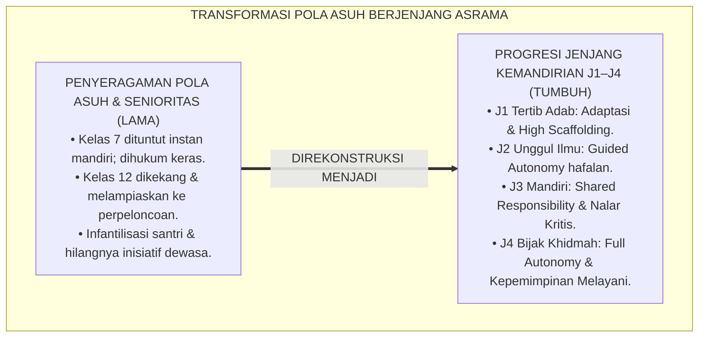
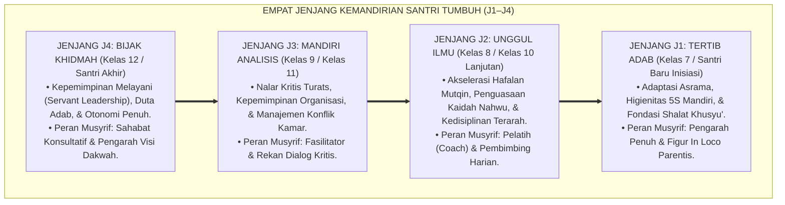

# P2-04-03: PRINSIP PROGRESI TANGGA TUMBUH J1–J4 (PROGRESSIVE DEVELOPMENTAL SCAFFOLDING)
## *Monograf Riset Akademik: Epistemologi Marahil al-'Umr Turats Islam (Ibnu Qayyim Al-Jauziyyah & Fiqh al-Bulugh), Konvergensi Psikososial Erik Erikson & ZPD Lev Vygotsky, Serta Diferensiasi Pembinaan Berjenjang (J1 Tertib, J2 Unggul, J3 Mandiri, J4 Bijak Khidmah)*

**Nomor Identifikasi**: `P2-04-03/MONOGRAF-RISET-PROGRESI-TANGGA-J1-J4/2026`  
**Domain**: `02 Principles` > `04 Development Principles` (Prinsip Perkembangan 03: *Progressive Developmental Scaffolding*)  
**Klasifikasi Naskah**: *Academic Research Monograph* (Monograf Riset Akademik Prinsip Perkembangan)  
**Rumpun Disiplin Pengkaji**: Psikologi Perkembangan Islam (*'Ilm an-Nafs an-Numuwwi*), Taksonomi Karakter Berbasis Fitrah, Metodologi Diferensiasi Pengasuhan Berjenjang, Desain Standar Capaian Pembinaan Pesantren  

---

> ### 💡 INTISARI EKSEKUTIF (EXECUTIVE SUMMARY)
>
> * **Kelemahan Paradigma Lama: Penyeragaman Pola Asuh Lintas Usia (One-Size-Fits-All):**  
>   Banyak pesantren memperlakukan santri baru kelas 7 dengan ekspektasi kemandirian yang sama dengan santri kelas 12. Santri kelas 7 yang belum mandiri dihukum keras, sementara santri kelas 12 dikekang layaknya anak kecil tanpa ruang kepemimpinan nyata, memicu infantilisasi santri dan hilangnya inisiatif dewasa.
> * **Inovasi Konseptual: Marahil al-'Umr Turats & Arsitektur 4 Jenjang Kemandirian TUMBUH (J1–J4):**  
>   TUMBUH menyintesiskan konsep tahapan usia (*Marahil al-'Umr*) Ibnu Qayyim Al-Jauziyyah dengan **Teori Psikososial Erik Erikson** dan **Scaffolding ZPD Lev Vygotsky**: merumuskan progresi 4 jenjang kemandirian (**J1 Tertib Adab: adaptasi & scaffolding intensif; J2 Unggul Ilmu: akselerasi hafalan & bimbingan terarah; J3 Mandiri Analisis: nalar kritis & tanggung jawab bersama; J4 Bijak Khidmah: kepemimpinan melayani & otonomi penuh**).
> * **Formulasi Operasional & Penjaminan Kematangan Berjenjang:**  
>   Monograf ini menguraikan matriks komparasi 4 jenjang kemandirian, diferensiasi wewenang dan tanggung jawab lintas jenjang, protokol asesmen kenaikan jenjang (*Advancement Protocol*), dan etika pendampingan berjenjang 24 jam.

---

## 📑 DAFTAR ISI MONOGRAF

- [BAB I: LANDASAN TEORETIS & DISKURSUS KRITIS](#bab-i-landasan-teoretis--diskursus-kritis)
  - [1. Latar Belakang Masalah: Kritik atas Penyeragaman Pola Asuh Lintas Usia dan Bahaya Infantilisasi Santri](#1-latar-belakang-masalah-kritik-atas-penyeragaman-pola-asuh-lintas-usia-dan-bahaya-infantilisasi-santri)
  - [2. Eksegesis Turats Tahapan Perkembangan Usia: Marahil al-'Umr Ibnu Qayyim (Mumayyiz, Murahiq, & Bulughul Asyudd)](#2-eksegesis-turats-tahapan-perkembangan-usia-marahil-al-umr-ibnu-qayyim-mumayyiz-murahiq--bulughul-asyudd)
  - [3. Konvergensi Teori Psikososial Erik Erikson & Zone of Proximal Development (ZPD Lev Vygotsky)](#3-konvergensi-teori-psikososial-erik-erikson--zone-of-proximal-development-zpd-lev-vygotsky)
  - [4. Rekayasa Transformasi Peran Musyrif: Dari Pengarah Penuh (J1) Menuju Sahabat Konsultatif (J4)](#4-rekayasa-transformasi-peran-musyrif-dari-pengarah-penuh-j1-menuju-sahabat-konsultatif-j4)
  - [5. Kasuistika Lapangan: Kasus Eksploitasi Senioritas & Resolusi Progresi Kemandirian Beradab](#5-kasuistika-lapangan-kasus-eksploitasi-senioritas--resolusi-progresi-kemandirian-beradab)
- [BAB II: FORMULASI KONSEPTUAL & PEMBAHASAN MENDALAM](#bab-ii-formulasi-konseptual--pembahasan-mendalam)
  - [1. Eksplanasi Teoretis Prinsip Progresi Jenjang Kemandirian TUMBUH (J1–J4) Pesantren](#1-eksplanasi-teoretis-prinsip-progresi-jenjang-kemandirian-tumbuh-j1j4-pesantren)
  - [2. Matriks Komparasi Empat Jenjang Kemandirian TUMBUH (J1–J4): Profil, Target Capaian, & Pola Pendampingan](#2-matriks-komparasi-empat-jenjang-kemandirian-tumbuh-j1j4-profil-target-capaian--pola-pendampingan)
  - [3. Matriks Diferensiasi Wewenang & Tanggung Jawab Santri Lintas Jenjang Kelas](#3-matriks-diferensiasi-wewenang--tanggung-jawab-santri-lintas-jenjang-kelas)
  - [4. Protokol Asesmen Kenaikan Jenjang Kemandirian (Tangga Advancement Protocol)](#4-protokol-asesmen-kenaikan-jenjang-kemandirian-tangga-advancement-protocol)
  - [5. Diskusi Filosofis Mendalam & Implikasi bagi Masa Depan Peradaban Pendidikan Islam](#5-diskusi-filosofis-mendalam--implikasi-bagi-masa-depan-peradaban-pendidikan-islam)
- [BAB III: KESIMPULAN & APARATUS AKADEMIS](#bab-iii-kesimpulan--aparatus-akademis)
  - [1. Tabel Sintesis Temuan Riset Progresi Jenjang Kemandirian TUMBUH](#1-tabel-sintesis-temuan-riset-progresi-jenjang-kemandirian-tumbuh)
  - [2. Daftar Pustaka Akademis & Rujukan Turats Primer](#2-daftar-pustaka-akademis--rujukan-turats-primer)
  - [3. Catatan Kaki Akademis (Footnotes)](#3-catatan-kaki-akademis-footnotes)
  - [4. Glosarium Istilah Ilmiah & Turats Jenjang Kemandirian TUMBUH](#4-glosarium-istilah-ilmiah--turats-jenjang-kemandirian-tumbuh)

---

# BAB I: LANDASAN TEORETIS & DISKURSUS KRITIS

---

### 1. Latar Belakang Masalah: Kritik atas Penyeragaman Pola Asuh Lintas Usia dan Bahaya Infantilisasi Santri

Kelemahan mendasar tata kelola pengasuhan pesantren tradisional adalah **Kesesatan Penyeragaman Pola Asuh (*The Fallacy of Homogeneous Caregiving*)**:
* Santri baru usia 12 tahun (kelas 7) diperlakukan dengan ekspektasi kemandirian yang sama dengan santri usia 18 tahun (kelas 12). Ketika santri kelas 7 belum rapi melipat pakaian atau terlambat bangun, mereka langsung dihukum fisik keras.
* Sebaliknya, santri kelas 12 yang telah menginjak usia baligh matang tetap diperlakukan seperti anak kecil (*Infantilization*): seluruh keputusan hidupnya dikekang tanpa pernah diberikan ruang kepemimpinan nyata.
* **Akibat Negatif**: Santri senior menyalurkan naluri kepemimpinannya secara liar melalui penindasan senioritas (*Seniority Hazing*), sementara santri junior mengalami trauma batin.
* **Keniscayaan Progresi Jenjang Kemandirian TUMBUH**: Diperlukan arsitektur pembinaan bertahap yang selaras dengan kematangan biologis, kognitif, dan moral santri dari kelas 7 hingga kelas 12.[^1]

---

### 2. Eksegesis Turats Tahapan Perkembangan Usia: Marahil al-'Umr Ibnu Qayyim (Mumayyiz, Murahiq, & Bulughul Asyudd)

Imam Ibnu Qayyim Al-Jauziyyah (*Tuhfat al-Mawdud*) dan para fuqaha membagi tahapan maturasi manusia:
1. **Marhalah at-Tamyiz (Usia 7–10 Tahun)**: Fase transisi awal di mana anak mulai mampu membedakan baik dan buruk, fokus pada penanaman adab ibadah (*Amruhum bish-Shalah*).
2. **Marhalah al-Murahaqah (Usia 11–14 Tahun)**: Fase pubertas awal yang membutuhkan pendampingan fisik hangat dan batasan terstruktur (*Ziyadatul 'Inayah*).
3. **Marhalah al-Bulugh wa Rusyd (Usia 15–18 Tahun)**: Fase kematangan akal dan tanggung jawab taklif, di mana santri dilatih memikul amanah kepemimpinan dan pelayanan umat (*Bulughul Asyudd*).[^2]

---

### 3. Konvergensi Teori Psikososial Erik Erikson & Zone of Proximal Development (ZPD Lev Vygotsky)

Sains psikologi perkembangan kontemporer membuktikan:
* **Tahapan Psikososial Erik Erikson (1968)**: Remaja awal (12–14 th) bergulat dalam krisis *Industry vs. Inferiority* (membangun kompetensi), sedangkan remaja akhir (15–18 th) bergulat dalam krisis *Identity vs. Role Confusion* (menemukan jati diri dan peran sosial).
* **Scaffolding ZPD Lev Vygotsky (1978)**: Bantuan pengasuhan diberikan secara intensif di awal dan dikurangi secara bertahap seiring meningkatnya kematangan otonomi santri (*Gradual Release of Responsibility*).[^3]

---

### 4. Rekayasa Transformasi Peran Musyrif: Dari Pengarah Penuh (J1) Menuju Sahabat Konsultatif (J4)

TUMBUH merancang evolusi peran musyrif:
* **Jenjang J1 (Direct Director)**: Musyrif mendampingi langsung setiap rutinitas kamar dan ibadah (*High Support*).
* **Jenjang J2 (Active Coach)**: Musyrif mengarahkan dan mengevaluasi target hafalan secara teratur.
* **Jenjang J3 (Facilitator)**: Musyrif memfasilitasi musyawarah kamar dan proyek mandiri santri.
* **Jenjang J4 (Consultative Mentor)**: Musyrif menjadi mitra diskusi dan sahabat konsultasi yang memberdayakan kepemimpinan santri (*Full Empowerment*).[^4]

---

### 5. Kasuistika Lapangan: Kasus Eksploitasi Senioritas & Resolusi Progresi Kemandirian Beradab

* **Studi Kasus: Tradisi Santri Kelas 12 Menyuruh Santri Kelas 7 Mencuci Pakaian dan Membelikan Makanan**  
  * **Dilema**: Santri senior menganggap tradisi tersebut sebagai "latihan kepatuhan junior"; santri kelas 7 ketakutan dan tidak bisa belajar.
  * **Resolusi Progresi TUMBUH**: Majelis Pengasuhan menghapus perpeloncoan dan merestrukturisasi peran santri akhir: (1) Santri kelas 12 dideklarasikan sebagai *Duta Khidmah J4* yang bertugas membimbing adik kelas (*Peer Tutoring*); (2) Setiap santri mencuci pakaiannya sendiri (*Mandiri 5S*); (3) Duta Khidmah diberi wewenang memimpin program keagamaan asrama. Suasana asrama berubah harmonis, senior dihormati karena keteladanan akhlak, dan junior merasa dilindungi dengan penuh kasih sayang.[^5]

---

# BAB II: FORMULASI KONSEPTUAL & PEMBAHASAN MENDALAM

---

### 1. Eksplanasi Teoretis Prinsip Progresi Jenjang Kemandirian TUMBUH (J1–J4) Pesantren

Ekosistem TUMBUH mengkodifikasikan pembinaan ke dalam **Arsitektur Empat Jenjang Kemandirian TUMBUH (J1–J4) (*Maratib at-Tarbiyah al-Mutadarrijah*)**:

#### 🔬 Pembahasan Mendalam Empat Jenjang:
1. **Jenjang J1 (Tertib Adab)**: Menanamkan jangkar adab, kebersihan diri, dan kestabilan emosi adaptasi asrama.[^6]
2. **Jenjang J2 (Unggul Ilmu)**: Membangun etos kesungguhan belajar (*Mujahadah*) dan percepatan hafalan Al-Qur'an.[^7]
3. **Jenjang J3 (Mandiri Analisis)**: Mengasah ketajaman nalar intelektual dan kematangan tanggung jawab sosial.[^8]
4. **Jenjang J4 (Bijak Khidmah)**: Mengkristalkan adab menjadi pengabdian nyata (*Khidmah*) bagi kemaslahatan umat.[^9]

---

### 2. Matriks Komparasi Empat Jenjang Kemandirian TUMBUH (J1–J4): Profil, Target Capaian, & Pola Pendampingan

| Jenjang Kemandirian | Sasaran Jenjang Kelas | Fokus Profil Karakter Utama | Pola Pendampingan Musyrif |
| :--- | :--- | :--- | :--- |
| **J1: Tertib Adab** | Kelas 7 / Santri Baru Inisiasi.| Adaptasi asrama, mandiri 5S, shalat tepat waktu.| Pendampingan intensif harian (*High Scaffolding*).|
| **J2: Unggul Ilmu** | Kelas 8 / Kelas 10 Lanjutan.| Akselerasi tahfizh mutqin, kaidah ilmu alat nahwu.| Bimbingan terarah & evaluasi berkala (*Coaching*).|
| **J3: Mandiri Analisis**| Kelas 9 / Kelas 11.| Nalar kritis, manajemen waktu, ukhuwah kamar.| Fasilitasi musyawarah (*Shared Responsibility*).|
| **J4: Bijak Khidmah** | Kelas 12 / Santri Akhir Penggerak.| Kepemimpinan melayani, mentor junior, dakwah.| Mitra konsultatif & delegasi wewenang penuh.|

---

### 3. Matriks Diferensiasi Wewenang & Tanggung Jawab Santri Lintas Jenjang Kelas

| Dimensi Aktivitas Asrama | Jenjang J1 (Tertib Adab) | Jenjang J2 (Unggul Ilmu) | Jenjang J3 (Mandiri) | Jenjang J4 (Bijak Khidmah) |
| :--- | :--- | :--- | :--- | :--- |
| **Pengelolaan Kamar** | Dipandu jadwal musyrif.| Melaksanakan piket rutin.| Memimpin musyawarah kamar.| Membina asrama lintas kamar.|
| **Aktivitas Ibadah** | Dibangunkan langsung musyrif.| Bangun mandiri dengan alarm.| Mengajak teman sekamar.| Menjadi imam rawatib & muadzin.|
| **Bimbingan Belajar** | Menerima tutorial dari kakak.| Belajar mandiri terarah.| Diskusi kelompok sebaya.| Menjadi Tutor Sebaya (*Peer Mentor*).|

---

### 4. Protokol Asesmen Kenaikan Jenjang Kemandirian (Tangga Advancement Protocol)

TUMBUH menetapkan **Protokol Standarisasi Kenaikan Jenjang**:
1. **Asesmen Portofolio Autentik**: Mengumpulkan bukti nyata catatan logbook PBIS, jurnal muhasabah, dan setoran hafalan mutqin.
2. **Uji Unjuk Kerja Adab (*Practical Adab Defense*)**: Santri mempresentasikan refleksi pertumbuhan dirinya di hadapan dewan asatidz dan musyrif.
3. **Pemberian Syahadah Kenaikan Jenjang**: Santri yang lulus diberikan pin kehormatan jenjang dan amanah tanggung jawab baru yang lebih tinggi.[^10]

---

### 5. Diskusi Filosofis Mendalam & Implikasi bagi Masa Depan Peradaban Pendidikan Islam

Prinsip progresi jenjang kemandirian ini membawa implikasi agung bagi peradaban:

* **Mencetak Pemimpin Masa Depan yang Berjiwa Khidmah (Servant Leaders)**:  
  Santri senior tidak tumbuh menjadi tiran feodal, melainkan menjadi pemimpin yang rendah hati dan mencintai pelayanan bagi sesama.
* **Menjamin Pertumbuhan Karakter yang Matang dan Alami**:  
  Santri melewati setiap tahapan kedewasaan secara sehat tanpa loncatan beban yang melumpuhkan atau pengekangan yang mengerdilkan potensi fitrah.
* **Mewujudkan Pesantren Sebagai Laboratorium Pengkaderan Umat Terbaik**:  
  Inilah sistem pembinaan berjenjang yang siap mencetak generasi *Insan Adabi* yang mandiri, berilmu luas, dan berkontribusi nyata bagi kejayaan peradaban Islam (*Rahmatan lil 'Alamin*).[^11]

---

# BAB III: KESIMPULAN & APARATUS AKADEMIS

---

### 1. Tabel Sintesis Temuan Riset Progresi Jenjang Kemandirian TUMBUH

| Dimensi Parameter | Mazhab Penyeragaman Feodal (Lama) | Model Pendidikan Sekuler Bebas | **Progresi Jenjang J1–J4 TUMBUH** | Landasan Rujukan Primer | Implikasi Praksis Lapangan |
| :--- | :--- | :--- | :--- | :--- | :--- |
| **Pola Asuh Santri** | Penyeragaman kaku & senioritas menindas.| Kebebasan tanpa arahan nilai.| **Diferensiasi 4 Jenjang Maturasi Fitrah.**| Ibnu Qayyim; Erikson (1968).| J1 Tertib, J2 Unggul, J3 Mandiri, J4 Bijak. |
| **Peran Santri Senior**| Menghukum & menindas santri junior.| Acuh tak acuh individualis.| **Duta Khidmah & Mentor Teladan Sebaya.**| HR. Muslim (Khadimul Qawm); Vygotsky.| Membimbing junior penuh kasih sayang. |
| **Peran Pengasuh** | Pengawas kaku yang mencurigai.| Pengamat pasif berjarak.| **Evolusi: Dari Pengarah ke Sahabat Mitra.**| Kaidah *Tadarruj*; Bandura.| Scaffolding bertahap sesuai usia biologis. |
| **Kriteria Kenaikan** | Otomatis naik kelas tanpa standar adab.| Berdasarkan nilai ujian kognitif semata.| **Portofolio Adab Autentik & Uji Unjuk Kerja.**| Dylan Wiliam; Al-Ghazali.| Kenaikan jenjang berbasis karakter nyata. |
| **Hasil Institusi** | Lingkaran setan perpeloncoan asrama.| Lulusan individualis tanpa adab.| **Ekosistem Ukhuwah & Pengkaderan Unggul.**| QS. Al-Hujurat: 10; Al-Attas (1980).| Pesantren damai, bermartabat, & berkah. |

---

### 2. Daftar Pustaka Akademis & Rujukan Turats Primer

1. **Al-Qur'an al-Karim wa Tarjamatu Ma'anihi**.
2. **Al-Bukhari, Abu Abdillah Muhammad bin Isma'il**. (1422 H). *Shahih al-Bukhari*. Kairo: Dar Thawq an-Najah.
3. **Muslim bin al-Hajjaj an-Naisaburi**. (1427 H). *Shahih Muslim*. Riyadh: Dar Thayyibah.
4. **Ibnu Qayyim Al-Jauziyyah, Syamsuddin Muhammad bin Abi Bakr**. (1414 H). *Tuhfat al-Mawdud bi Ahkam al-Mawlud*. Beirut: Dar al-Kutub al-'Ilmiyyah.
5. **Al-Ghazali, Abu Hamid Muhammad bin Muhammad**. (2011). *Ihya' 'Ulumiddin* (Kitab Riyadhatin Nafs). Beirut: Dar al-Ma'rifah.
6. **Asy'ari, Muhammad Hasyim**. (1415 H). *Adab al-'Alim wal-Muta'allim*. Jombang: Maktabah At-Turats Al-Islami.
7. **Al-Attas, Syed Muhammad Naquib**. (1980). *The Concept of Education in Islam*. Kuala Lumpur: ABIM.
8. **Erikson, E. H.**. (1968). *Identity: Youth and Crisis*. New York: W. W. Norton & Company.
9. **Vygotsky, L. S.**. (1978). *Mind in Society: The Development of Higher Psychological Processes*. Cambridge: Harvard University Press.
10. **Greenleaf, R. K.**. (2002). *Servant Leadership: A Journey into the Nature of Legitimate Power and Greatness*. New York: Paulist Press.
11. **Bandura, A.**. (1977). *Social Learning Theory*. Englewood Cliffs: Prentice-Hall.
12. **Horner, R. H., & Sugai, G.**. (2015). *School-wide PBIS: An Overview of the Research Base*. Remedial and Special Education, 36(2), 80–85.

---

### 3. Catatan Kaki Akademis (*Footnotes*)

[^1]: Riset Prinsip Progresi Jenjang Kemandirian TUMBUH J1–J4, *Kritik atas Penyeragaman Pola Asuh dan Infantilisasi*, 2026.  
[^2]: Ibnu Qayyim Al-Jauziyyah, *Tuhfat al-Mawdud bi Ahkam al-Mawlud*, hlm. 160–190.  
[^3]: Erikson, E. H. (1968), *Identity: Youth and Crisis*, hlm. 91–140; Vygotsky, L. S. (1978), *Mind in Society*, hlm. 79–91.  
[^4]: Master Blueprint Evolusi Peran Musyrif Berjenjang TUMBUH, 2026.  
[^5]: Dokumentasi Transformasi Peran Santri Akhir dan Eradikasi Perpeloncoan Senioritas PBIS TUMBUH, 2026.  
[^6]: Petunjuk Teknis Capaian Pembinaan Jenjang J1 Tertib Adab TUMBUH, 2026.  
[^7]: Petunjuk Teknis Capaian Pembinaan Jenjang J2 Unggul Ilmu TUMBUH, 2026.  
[^8]: Petunjuk Teknis Capaian Pembinaan Jenjang J3 Mandiri Analisis TUMBUH, 2026.  
[^9]: Petunjuk Teknis Capaian Pembinaan Jenjang J4 Bijak Khidmah TUMBUH, 2026.  
[^10]: Standar Operasional Prosedur Asesmen Kenaikan Jenjang Kemandirian Santri TUMBUH, 2026.  
[^11]: Deklarasi Pemuliaan Pembinaan Berjenjang Generasi Islam Dewan Riset Epistemologi Ekosistem TUMBUH, 2026.

---

### 4. Glosarium Istilah Ilmiah & Turats Jenjang Kemandirian TUMBUH

1. **Jenjang Kemandirian TUMBUH (J1–J4)**: Kerangka kerja pembinaan karakter berjenjang yang memetakan tahapan maturasi santri dari J1 Tertib Adab hingga J4 Bijak Khidmah.
2. **Marahil al-'Umr (مَرَاحِلُ الْعُمُرِ)**: Pembagian tahapan perkembangan usia manusia dalam turats Islam yang menjadi dasar diferensiasi hak dan kewajiban pembinaan.
3. **Jenjang J1 (Tertib Adab)**: Tahap inisiasi santri baru yang berfokus pada adaptasi asrama, kemandirian kebersihan 5S, dan pembiasaan adab harian dengan pendampingan intensif.
4. **Jenjang J2 (Unggul Ilmu)**: Tahap akselerasi hafalan Al-Qur'an dan penguasaan kaidah ilmu syariat dengan bimbingan terarah (*Coaching*).
5. **Jenjang J3 (Mandiri Analisis)**: Tahap pengembangan daya nalar kritis, kemandirian manajemen waktu, dan kepemimpinan organisasi dengan tanggung jawab bersama.
6. **Jenjang J4 (Bijak Khidmah)**: Tahap kepemimpinan melayani (*Servant Leadership*) di mana santri akhir mengabdi sebagai mentor teladan bagi adik kelas dengan otonomi penuh.
7. **Servant Leadership (Kepemimpinan Melayani)**: Falsafah kepemimpinan Islam di mana pemimpin sejati adalah pelayan bagi kaumnya (*Sayyidul Qawmi Khadimuhum*).
8. **Gradual Release of Responsibility**: Proses peralihan tanggung jawab bertahap dari pengasuh kepada santri seiring meningkatnya kematangan usia.
9. **Seniority Hazing**: Praktik perpeloncoan dan eksploitasi fisik oleh senior kepada junior yang diharamkan mutlak dalam ekosistem TUMBUH.
10. **Insan Adabi (الإِنْسَانُ الأَدَبِيُّ)**: Profil santri yang mandiri, berilmu luas, berakhlak mulia, dan mendedikasikan ilmunya untuk berkhidmah bagi kemaslahatan umat.
