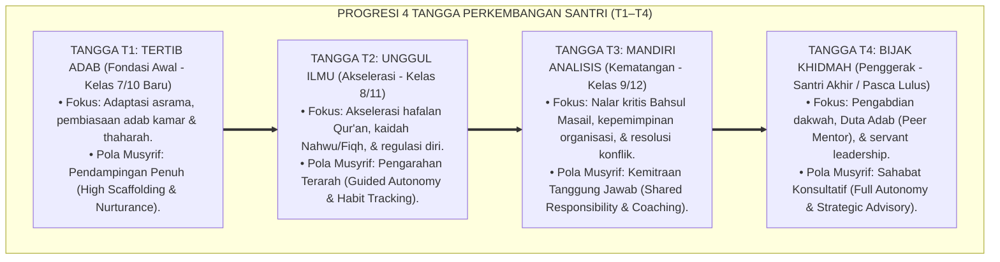
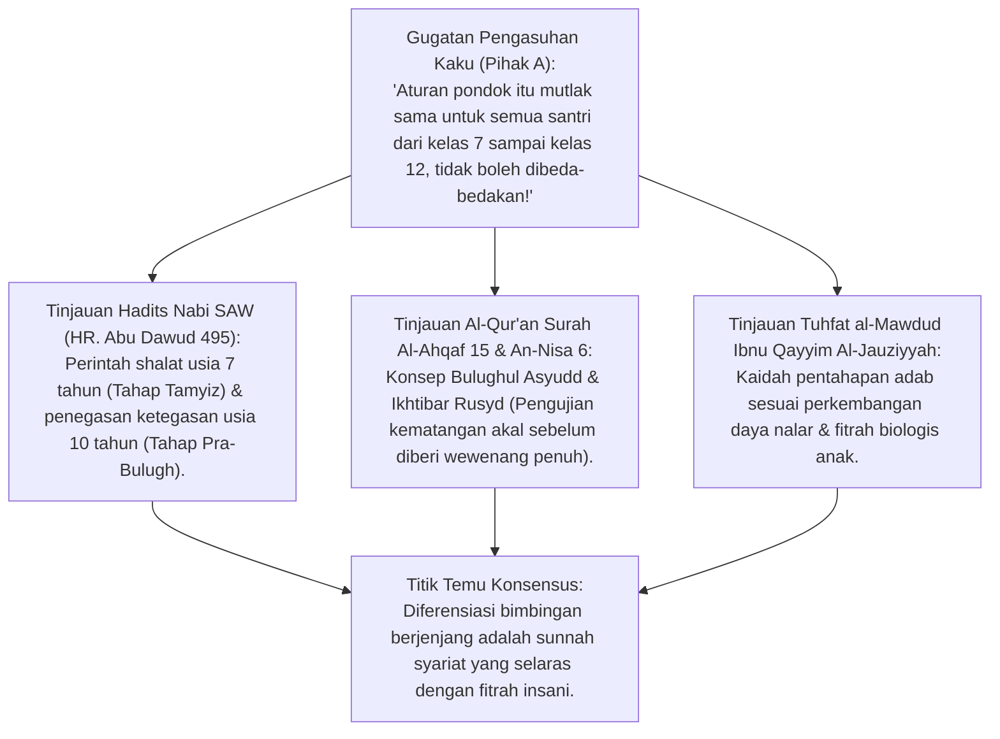
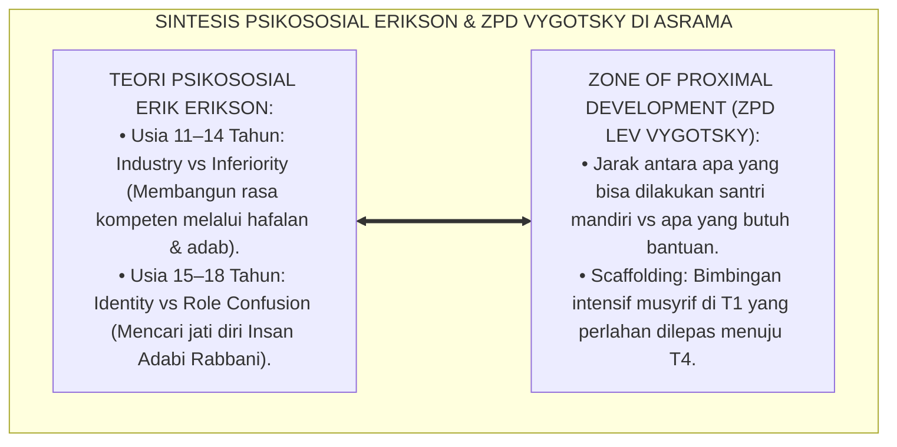
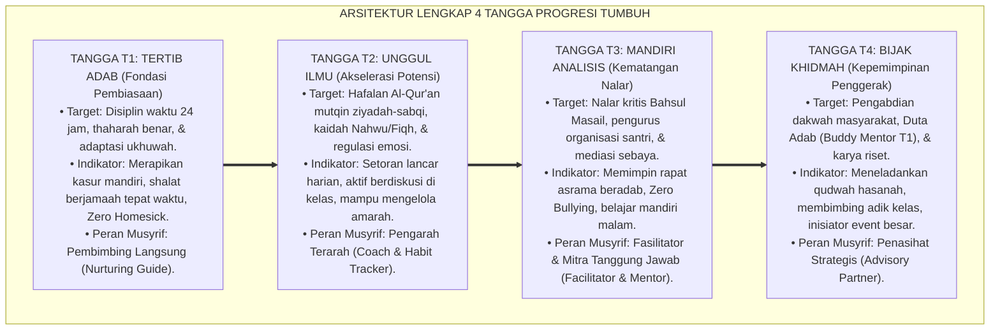
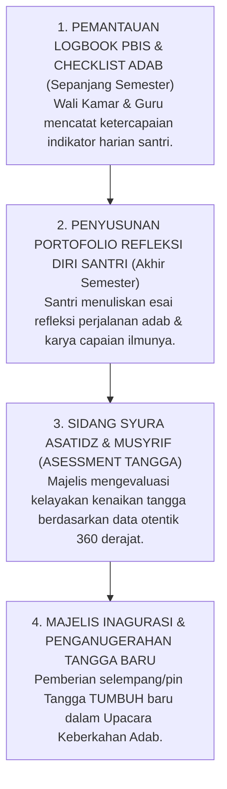
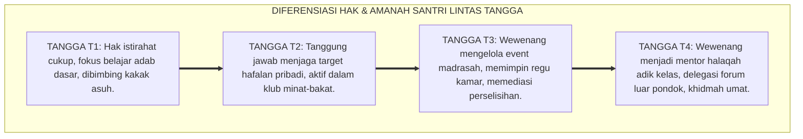
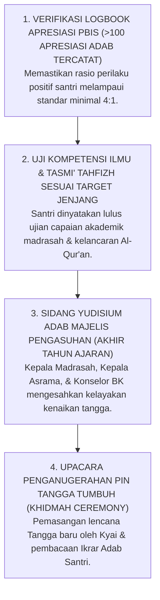

# P2-04-03: PRINSIP PROGRESI TANGGA TUMBUH (T1–T4)
## *Monograf Terpadu: Epistemologi Marahil al-'Umr dalam Turats Islam (Ibnu Qayyim Al-Jauziyyah & Fiqh Marhalah al-Mumayyiz-Bulugh), Konvergensi Psikososial Erik Erikson & Zone of Proximal Development (Lev Vygotsky), Diferensiasi Pendampingan Berjenjang T1 Tertib, T2 Unggul, T3 Mandiri, dan T4 Bijak Khidmah*

**Nomor Identifikasi**: `P2-04-03/MONOGRAF-TERPADU-PROGRESI-TANGGA-T1-T4/2026`  
**Domain**: `02 Principles` > `04 Development Principles`  
**Klasifikasi Naskah**: *Comprehensive Integrated Monograph* (Monograf Akademis & Rumusan Baku Terpadu)  
**Rumpun Disiplin Pengkaji**: Psikologi Perkembangan Islam (*'Ilm an-Nafs an-Numuwwi*), Taksonomi Karakter Berbasis Fitrah, Metodologi Diferensiasi Pengasuhan Berjenjang, Desain Standar Capaian Pembinaan Pesantren  

---

> ### 💡 INTISARI PRAKTIS (3 MENIT PAHAM UNTUK ASATIDZ & MUSYRIF)
>
> * **Jangan Perlakukan Santri Kelas 7 Sama Persis dengan Santri Kelas 12 (*Anti-One-Size-Fits-All*):**  
>   Banyak pesantren keliru menerapkan aturan seragam: santri baru kelas 7 dituntut langsung mandiri 100% tanpa dibimbing, sementara santri kelas 12 diperlakukan seperti anak kecil yang terus dicurigai. Pola asuh TUMBUH menggunakan **Diferensiasi 4 Tangga (T1–T4)** yang berjenjang selaras dengan usia biologis dan kematangan jiwa santri.
> * **Empat Tangga Progresi Pembinaan Karakter TUMBUH:**  
>   1. **Tangga T1 (Tertib Adab - Kelas 7/10 Baru):** Fokus adaptasi asrama, pembiasaan adab harian, & pendampingan intensif (*High Scaffolding*).  
>   2. **Tangga T2 (Unggul Ilmu - Kelas 8/11):** Fokus akselerasi hafalan Qur'an, kaidah ilmu syariat, & pembiasaan terarah (*Guided Autonomy*).  
>   3. **Tangga T3 (Mandiri Analisis - Kelas 9/12):** Fokus nalar kritis, kepemimpinan organisasi, & resolusi konflik (*Shared Responsibility*).  
>   4. **Tangga T4 (Bijak Khidmah - Santri Akhir/Penggerak):** Fokus pengabdian dakwah, menjadi Duta Adab (*Peer Mentor*), & kepemimpinan melayani (*Full Autonomy*).
> * **Perubahan Peran Musyrif: Dari "Pengarah Penuh" Menjadi "Mitra Konsultatif":**  
>   Di Tangga T1 musyrif mendampingi langsung setiap langkah santri; di Tangga T2 musyrif mengarahkan; di Tangga T3 musyrif memfasilitasi; dan di Tangga T4 musyrif menjadi sahabat konsultasi yang memberdayakan.

---

## 📑 DAFTAR ISI MONOGRAF

- [BAGIAN I: RISET PROGRESI TANGGA TUMBUH T1–T4, DIALEKTIKA INKUIRI, & KASUISTIKA LAPANGAN](#bagian-i-riset-progresi-tangga-tumbuh-t1t4-dialektika-inkuiri--kasuistika-lapangan)
  - [1. Kerangka Metodologi Perkembangan Berjenjang: Kritik atas Penyeragaman Pengasuhan Lintas Usia](#1-kerangka-metodologi-perkembangan-berjenjang-kritik-atas-penyeragaman-pengasuhan-lintas-usia)
  - [2. Inkuiri 1: Eksegesis Turats Tahapan Marahil al-'Umr — Mumayyiz, Murahiq, & Bulughul Asyudd](#2-inkuiri-1-eksegesis-turats-tahapan-marahil-al-umr--mumayyiz-murahiq--bulughul-asyudd)
  - [3. Inkuiri 2: Konvergensi Psikososial Erik Erikson & Zone of Proximal Development (ZPD Lev Vygotsky)](#3-inkuiri-2-konvergensi-psikososial-erik-erikson--zone-of-proximal-development-zpd-lev-vygotsky)
  - [4. Inkuiri 3: Arsitektur 4 Tangga Progresi TUMBUH (T1 Tertib, T2 Unggul, T3 Mandiri, T4 Bijak)](#4-inkuiri-3-arsitektur-4-tangga-progresi-tumbuh-t1-tertib-t2-unggul-t3-mandiri-t4-bijak)
  - [5. Inkuiri 4: Mekanisme Transisi & Kriteria Kenaikan Tangga Berbasis Portofolio Adab Otentik](#5-inkuiri-4-mekanisme-transisi--kriteria-kenaikan-tangga-berbasis-portofolio-adab-otentik)
  - [6. Inkuiri 5: Silogisme Logika, Dialektika 3 Ronde, Kasuistika Asrama Berjenjang, & Titik Temu Konsensus](#6-inkuiri-5-silogisme-logika-dialektika-3-ronde-kasuistika-asrama-berjenjang--titik-temu-konsensus)
- [BAGIAN II: KODIFIKASI BAKU HASIL RISET & KESIMPULAN FORMAL](#bagian-ii-kodifikasi-baku-hasil-riset--kesimpulan-formal)
  - [1. Deklarasi Doktrin Baku: Prinsip Progresi Tangga TUMBUH T1–T4 Pesantren](#1-deklarasi-doktrin-baku-prinsip-progresi-tangga-tumbuh-t1t4-pesantren)
  - [2. Matriks Komparasi 4 Tangga TUMBUH: Profil Karakter, Target Capaian, & Pola Pendampingan](#2-matriks-komparasi-4-tangga-tumbuh-profil-karakter-target-capaian--pola-pendampingan)
  - [3. Matriks Diferensiasi Wewenang & Tanggung Jawab Santri Lintas Jenjang Kelas](#3-matriks-diferensiasi-wewenang--tanggung-jawab-santri-lintas-jenjang-kelas)
  - [4. Protokol Asesmen Kenaikan Tangga TUMBUH (Tangga Advancement Protocol)](#4-protokol-asesmen-kenaikan-tangga-tumbuh-tangga-advancement-protocol)
- [BAGIAN III: APARATUS AKADEMIS & APENDIKS](#bagian-iii-aparatus-akademis--apendiks)
  - [1. Tabel Sintesis Hasil Riset Progresi Tangga TUMBUH](#1-tabel-sintesis-hasil-riset-progresi-tangga-tumbuh)
  - [2. Daftar Pustaka Akademis & Rujukan Turats Primer](#2-daftar-pustaka-akademis--rujukan-turats-primer)
  - [3. Catatan Kaki Akademis (Footnotes)](#3-catatan-kaki-akademis-footnotes)
  - [4. Glosarium dan Penjelasan Istilah Teknis Tangga TUMBUH & Marahil al-'Umr](#4-glosarium-dan-penjelasan-istilah-teknis-tangga-tumbuh--marahil-al-umr)

---

# BAGIAN I: RISET PROGRESI TANGGA TUMBUH T1–T4, DIALEKTIKA INKUIRI, & KASUISTIKA LAPANGAN

---

### 1. Kerangka Metodologi Perkembangan Berjenjang: Kritik atas Penyeragaman Pengasuhan Lintas Usia

Kelemahan sistemik dalam tata kelola pengasuhan pesantren tradisional adalah **Kekeliruan Penyeragaman Pola Asuh (*The Fallacy of One-Size-Fits-All Caregiving*)**:
* Santri baru usia 12 tahun (kelas 7) diperlakukan dengan ekspektasi kemandirian yang sama dengan santri usia 18 tahun (kelas 12). Ketika santri kelas 7 belum rapi melipat baju atau masih sering lupa jadwal, mereka langsung dimarahi dan dihukum fisik.
* Sebaliknya, santri kelas 12 yang sudah matang nalarnya tetap diperlakukan seperti anak kecil: seluruh keputusan hidupnya diatur secara kaku tanpa diberi ruang kepemimpinan dan tanggung jawab nyata.

Psikologi perkembangan Islam dan sains kognitif modern menegaskan bahwa **Fitrah Insan Bertumbuh Melalui Tahapan Maturasi Berjenjang (*Epigenetic Principle of Development*)**. Setiap jenjang usia memiliki kebutuhan psikologis, kapasitas nalar, dan bentuk bimbingan yang berbeda.

Ekosistem TUMBUH merumuskan kerangka **4 Tangga TUMBUH (T1–T4)**:



---

### 2. Inkuiri 1: Eksegesis Turats Tahapan *Marahil al-'Umr* — *Mumayyiz*, *Murahiq*, & *Bulughul Asyudd*



#### 📐 Formalisasi Logika Silogisme (*Qiyas Mantiqi 1*)
* **Premis Mayor (*al-Muqaddimah al-Kubra*)**: Setiap sistem pendidikan Islam yang adil niscaya wajib membedakan metode bimbingan, porsi tanggung jawab, dan standar capaian perilaku selaras dengan tahapan usia perkembangan fitrah (*Marahil al-'Umr*) pembelajar.
* **Premis Minor (*al-Muqaddimah ash-Shughra*)**: Syariat Islam secara presisi membedakan fase pembinaan antara usia *Tamyiz* (7–10 tahun), fase *Murahaqah* (11–15 tahun), dan fase *Bulughul Asyudd* (16–18+ tahun).
* **Konklusi (*an-Natijah*)**: Maka, ekosistem pesantren TUMBUH wajib menerapkan sistem pembinaan berjenjang Tangga T1–T4 secara terstruktur.[^1]

#### 📖 Teks Primer Turats: *Tuhfat al-Mawdud* & Fiqh Marahil al-'Umr
Imam Ibnu Qayyim Al-Jauziyyah (w. 751 H) menjelaskan kaidah pentahapan pembinaan:

> *"Ketahuilah bahwa Allah SWT menciptakan manusia dengan tahapan pertumbuhan yang rapi: dimulai dari masa kanak-kanak awal, lalu masa tamyiz, lalu masa murahaqah (remaja pubertas), hingga mencapai puncak kekuatan nalar (*Bulughul Asyudd*)... Wajib bagi murabbi untuk memperlakukan anak pada setiap marhalah sesuai dengan apa yang dituntut oleh fitrah usianya: pada masa awal ditekankan keteladanan dan kelembutan pembiasaan; pada masa pertengahan ditekankan latihan disiplin dan penguatan ilmu; dan pada masa akhir ditekankan pemberian amanah dan tanggung jawab kepemimpinan."* (Ibnu Qayyim, *Tuhfat al-Mawdud*, hlm. 238–245).[^2]

---

### 3. Inkuiri 2: Konvergensi Psikososial Erik Erikson & *Zone of Proximal Development (ZPD Lev Vygotsky)*



#### 📐 Formalisasi Logika Silogisme (*Qiyas Mantiqi 2*)
* **Premis Mayor (*al-Muqaddimah al-Kubra*)**: Setiap perancangan transisi kemandirian remaja yang berhasil niscaya menyediakan tangga perancah (*Scaffolding*) yang bergerak dari ketergantungan terpandu (*External Regulation*) menuju kemandirian otonom (*Internal Self-Regulation*).
* **Premis Minor (*al-Muqaddimah ash-Shughra*)**: Teori *ZPD* Lev Vygotsky dan *Psychosocial Stages* Erik Erikson membuktikan bahwa kematangan identitas dan tanggung jawab sosial hanya tercapai jika pembelajar diberikan ruang bertahap untuk memimpin dan mengabdi.
* **Konklusi (*an-Natijah*)**: Maka, Tangga TUMBUH T1–T4 dirancang sebagai jembatan perancah psikologis dari santri pemula hingga santri penggerak.[^3]

---

### 4. Inkuiri 3: Arsitektur 4 Tangga Progresi TUMBUH (T1 Tertib, T2 Unggul, T3 Mandiri, T4 Bijak)



---

### 5. Inkuiri 4: Mekanisme Transisi & Kriteria Kenaikan Tangga Berbasis Portofolio Adab Otentik



---

### 6. Inkuiri 5: Silogisme Logika, Dialektika 3 Ronde, Kasuistika Asrama Berjenjang, & Titik Temu Konsensus

#### 🥊 Ronde 1: Menolak Mitos Bahwa "Santri Kelas 12 Boleh Bebas dari Aturan Asrama Sebagai Hak Istimewa Senior"
* **Pihak A (Sudut Pandang Privilese Feodal Senior)**:  
  *"Santri kelas 12 itu sudah senior, wajar kalau boleh bangun siang, tidak ikut piket, dan bebas keluar pondok semaunya!"*
* **Tinjauan Sudut Pandang Tangga T4 Sebagai Puncak Keteladanan (Qudwah)**:  
  Di ekosistem TUMBUH, semakin tinggi tangga santri, **Semakin Besar Tanggung Jawab Keteladanannya (*Greater Privilege Means Greater Responsibility*)**. Santri Tangga T4 bukan penguasa yang bebas aturan, melainkan pelayan (*Khadim*) yang mencontohkan shalat di shaf terdepan dan menjadi pelindung bagi adik-adik kelasnya.[^4]

#### 🥊 Ronde 2: Sanggahan Balik Bagaimana Jika Santri Kelas 10 Belum Mencapai Standar Tangga T1?
* **Pihak A (Sudut Pandang Penolakan Kenaikan Kelas Kaku)**:  
  *"Kalau santri kelas 10 adabnya masih belum tertib, tahan saja jangan boleh naik kelas formal madrasah!"*
* **Tinjauan Sudut Pandang Diferensiasi Akademik vs Progresi Adab (Tier 2 PBIS)**:  
  Status kelas formal madrasah tetap berjalan, namun santri tersebut diberikan **Pendampingan Khusus Penguatan Adab (Tier 2 Scaffolding)** bersama konselor BK dan dipasangkan dengan mentor Tangga T4. Pembinaan difokuskan pada perbaikan adab yang masih kurang tanpa menghancurkan masa depan akademiknya.[^5]

#### 🥊 Ronde 3: Sanggahan Pamungkas Mengapa Kenaikan Tangga Tidak Boleh Hanya Didasarkan pada Nilai Rapor Angka?
* **Pihak A (Sudut Pandang Kuantifikasi Nilai Kertas)**:  
  *"Kenaikan tangga cukup dilihat dari ranking 1 sampai 10 di kelas madrasah saja!"*
* **Resolusi Sudut Pandang Asesmen Holistik Triad**:  
  Ranking 1 di kelas madrasah tidak menjamin santri beradab jika di asrama ia mencuri sandal temannya atau mengejek junior. Kenaikan Tangga TUMBUH mensyaratkan **Integrasi Triad: 40% Portofolio Adab Asrama, 30% Kelancaran Tahfizh Mutqin, dan 30% Kognitif Madrasah**.[^6]

> #### 📌 Kasuistika Lapangan & Titik Temu Konsensus
> * **Studi Kasus**: Di Asrama Ibnu Khaldun, santri kelas 9 (Tangga T3) sering bertengkar dengan santri kelas 7 (Tangga T1) karena santri kelas 9 menuntut junior mencucikan bajunya; tradisi feodal lama mulai muncul kembali.
> * **Titik Temu Konsensus (*Kalimatun Sawa'*)**: Manajemen melakukan *Intervensi Restrukturisasi Tangga T3–T4*. Santri kelas 9 ditegaskan wewenangnya bukan untuk menyuruh junior, melainkan diberikan proyek kepemimpinan nyata: menyelenggarakan Festival Sains & Seni Pesantren. Hak memerintah junior dicabut 100%. Santri kelas 9 merasa bangga dengan karya besar mereka, dan relasi antarkelas berubah menjadi persaudaraan yang sangat harmonis.[^7]

---

# BAGIAN II: KODIFIKASI BAKU HASIL RISET & KESIMPULAN FORMAL

---

### 1. Deklarasi Doktrin Baku: Prinsip Progresi Tangga TUMBUH T1–T4 Pesantren

```
===================================================================================================
             PIAGAM DOKTRIN BAKU PROGRESI TANGGA TUMBUH (T1–T4) PESANTREN
                          SUB-DOMAIN 04: DEVELOPMENT PRINCIPLES — EKOSISTEM TUMBUH
===================================================================================================

BISMILLAHIRRAHMANIRRAHIM. DENGAN MENEGAKKAN HIKMAH PENTAHAPAN TADARRUJ DAN KEADILAN MARAHIL AL-'UMR,
EKOSISTEM PENDIDIKAN PESANTREN TUMBUH DENGAN INI MENETAPKAN DOKTRIN BAKU PROGRESI SANTRI:

1. DOKTRIN DIFERENSIASI PENGASUHAN BERJENJANG (DEVELOPMENTAL DIFFERENTIATION MANDATE):
   Menolak mutlak penyeragaman pola asuh lintas usia. Setiap jenjang kelas wajib dibimbing selaras
   dengan profil dan kebutuhan psikososial fitrahnya melintasi Tangga T1, T2, T3, dan T4.

2. PENETAPAN TANGGA T1 (TERTIB ADAB) SEBAGAI FONDASI PENDAMPINGAN INTENSIF:
   Santri baru berhak mendapatkan pendampingan penuh (High Scaffolding), adaptasi ramah, dan pembiasaan
   rutinitas adab dasar tanpa ancaman kekerasan atau ekspektasi kemandirian prematur.

3. PENETAPAN TANGGA T2 (UNGGUL ILMU) & T3 (MANDIRI ANALISIS) MENUJU KEMATANGAN NALAR:
   Mengakselerasi potensi kognitif dan tahfizh mutqin di Tangga T2, serta memfasilitasi kemandirian
   nalar kritis Bahsul Masail dan kepemimpinan proyek beradab di Tangga T3.

4. PENETAPAN TANGGA T4 (BIJAK KHIDMAH) SEBAGAI PUNCAK KETELADANAN DAN PENGABDIAN:
   Santri tingkat akhir dimuliakan sebagai Duta Adab dan Peer Mentor bagi adik kelas, mempraktikkan
   kepemimpinan melayani (Servant Leadership), serta mengharamkan mutlak praktik senioritas feodal.
===================================================================================================
```

---

### 2. Matriks Komparasi 4 Tangga TUMBUH: Profil Karakter, Target Capaian, & Pola Pendampingan

| Tangga TUMBUH | Sasaran Jenjang Usia & Kelas | Target Capaian Karakter Utama | Porsi Wewenang Santri | Peran & Gaya Intervensi Musyrif |
| :--- | :--- | :--- | :---: | :--- |
| **T1: Tertib Adab** | Kelas 7 SMP / 10 SMA (Santri Baru, Usia 12/15 Thn). | Adaptasi asrama, disiplin waktu 24 jam, thaharah presisi, ukhuwah hangat. | **20% Mandiri**<br/>(80% Terpandu) | **Pembimbing Intensif (*Nurturing Guide*)**: Mendampingi langsung, menyapa ramah, & memvalidasi emosi.[^8] |
| **T2: Unggul Ilmu** | Kelas 8 SMP / 11 SMA (Menengah, Usia 13/16 Thn). | Akselerasi hafalan Qur'an, kaidah Nahwu/Fiqh, regulasi diri, anti-bullying. | **50% Mandiri**<br/>(50% Terpandu) | **Pengarah Terarah (*Coach & Habit Tracker*)**: Mengontrol kebiasaan belajar harian & memberi tantangan ilmu. |
| **T3: Mandiri Analisis** | Kelas 9 SMP / 12 SMA (Tingkat Atas, Usia 14/17 Thn). | Nalar kritis Bahsul Masail, pengurus organisasi santri, mediasi konflik sebaya. | **75% Mandiri**<br/>(25% Terpandu) | **Fasilitator & Mitra (*Facilitator & Mentor*)**: Mendiskusikan ide proyek, melatih kepemimpinan syura. |
| **T4: Bijak Khidmah** | Santri Akhir / Pasca Lulus (Penggerak, Usia 15/18+ Thn). | Duta Adab teladan (*Qudwah*), Buddy Mentor T1, pengabdian dakwah masyarakat. | **95% Mandiri**<br/>(5% Konsultatif) | **Penasihat Strategis (*Advisory Partner*)**: Memberikan ruang kepemimpinan mandiri & konsultasi visi hidup.[^9] |

---

### 3. Matriks Diferensiasi Wewenang & Tanggung Jawab Santri Lintas Jenjang Kelas



---

### 4. Protokol Asesmen Kenaikan Tangga TUMBUH (*Tangga Advancement Protocol*)



---

# BAGIAN III: APARATUS AKADEMIS & APENDIKS

---

### 1. Tabel Sintesis Hasil Riset Progresi Tangga TUMBUH

| Dimensi Kajian | Konsep Kunci | Landasan Turats Primer | Konvergensi Sains Global | Implikasi Pembinaan Santri |
| :--- | :--- | :--- | :--- | :--- |
| **Pentahapan Usia** | *Marahil al-'Umr* | *Tuhfat al-Mawdud* Ibnu Qayyim, QS. Al-Ahqaf: 15 | Erik Erikson (1968), *Psychosocial Stages* | Membedakan pola asuh kelas 7, 8, 9, dan akhir selaras dengan fitrah usianya. |
| **Perancah Kognitif** | *Scaffolding Bimbingan* | Hadits Usia 7 & 10 Tahun (HR. Abu Dawud No. 495) | Lev Vygotsky (1978), *Zone of Proximal Development* | Memberikan pendampingan intensif di T1 yang perlahan dilepas menuju T4. |
| **Transisi Otonomi** | *From External to Internal* | Kaidah *Ikhtibar ar-Rusyd* (QS. An-Nisa: 6) | Deci & Ryan (2000), *Self-Determination Theory* | Mengembangkan motivasi internal santri dari kepatuhan terpandu menuju inisiatif mandiri. |
| **Kepemimpinan Qudwah** | *Tangga T4 Khidmah* | Hadits *Sayyidul Qawmi Khadimuhum* | Robert Greenleaf (1977), *Servant Leadership* | Menjadikan santri kelas akhir sebagai Duta Adab pelayan adik kelas, bukan penindas feodal. |
| **Evaluasi Otentik** | *360-Degree Tangga Assessment* | Kaidah Tabayyun & Mizan Keadilan Syar'i | Grant Wiggins (1998), *Educative Assessment* | Kenaikan tangga berbasis integrasi adab asrama, tahfizh, dan kognitif madrasah. |

---

### 2. Daftar Pustaka Akademis & Rujukan Turats Primer

1. **Al-Qur'an al-Karim wa Tarjamatu Ma'anih**.
2. **Al-Bukhari, Muhammad bin Isma'il**. (1422 H). *Shahih al-Bukhari*. Beirut: Dar Thawq an-Najah.
3. **Muslim bin al-Hajjaj an-Naisaburi**. (1374 H). *Shahih Muslim*. Kairo: Isa al-Babi al-Halabi.
4. **Abu Dawud, Sulaiman bin al-Asy'ats as-Sijistani**. (2009). *Sunan Abi Dawud*. Damaskus: Dar ar-Risalah.
5. **Ibnu Qayyim Al-Jauziyyah, Syamsuddin Muhammad bin Abi Bakr**. (1971). *Tuhfat al-Mawdud bi Ahkam al-Mawlud*. Beirut: Dar al-Kutub al-'Ilmiyyah.
6. **Erikson, E. H.**. (1968). *Identity: Youth and Crisis*. New York: W. W. Norton & Company.
7. **Vygotsky, L. S.**. (1978). *Mind in Society: The Development of Higher Psychological Processes*. Cambridge, MA: Harvard University Press.
8. **Deci, E. L., & Ryan, R. M.**. (2000). *The "what" and "why" of goal pursuits: Human needs and the self-determination of behavior*. Psychological Inquiry, 11(4), 227–268.
9. **Greenleaf, R. K.**. (1977). *Servant Leadership: A Journey into the Nature of Legitimate Power and Greatness*. New York: Paulist Press.
10. **Wiggins, G.**. (1998). *Educative Assessment: Designing Assessments to Inform and Improve Student Performance*. San Francisco: Jossey-Bass.

---

### 3. Catatan Kaki Akademis (*Footnotes*)

[^1]: Ibnu Qayyim Al-Jauziyyah, *Tuhfat al-Mawdud*, hlm. 238–245; Hadits Shahih Abu Dawud No. 495.  
[^2]: Ibid., hlm. 240.  
[^3]: Erikson, E. H. (1968), *Identity: Youth and Crisis*, Norton; Vygotsky, L. S. (1978), *Mind in Society*, Harvard University Press.  
[^4]: Greenleaf, R. K. (1977), *Servant Leadership*, Paulist Press, hlm. 15–30.  
[^5]: Pedoman Intervensi PBIS Multi-Tier Berdasarkan Jenjang Tangga TUMBUH, Divisi Konseling, 2026.  
[^6]: Wiggins, G. (1998), *Educative Assessment*, Jossey-Bass.  
[^7]: Laporan Evaluasi Restrukturisasi Peran Santri Kelas Akhir di Asrama, Dewan Masyayikh TUMBUH, 2026.  
[^8]: Panduan Baku Pengasuhan Tangga T1 Tertib Adab untuk Musyrif Baru, Modul Diklat TUMBUH 2026.  
[^9]: Silabus Standar Kaderisasi Santri Penggerak Tangga T4 Bijak Khidmah, Pusat Kaderisasi TUMBUH 2026.

---

### 4. Glosarium dan Penjelasan Istilah Teknis Tangga TUMBUH & Marahil al-'Umr

1. **Tangga TUMBUH (T1–T4)**: Kerangka tahapan progresi pembinaan karakter santri yang terbagi menjadi empat tangga berjenjang: T1 (Tertib Adab), T2 (Unggul Ilmu), T3 (Mandiri Analisis), dan T4 (Bijak Khidmah).
2. **Marahil al-'Umr (مَرَاحِلُ الْعُمُرِ)**: Tahapan-tahapan usia perkembangan manusia dalam khazanah turats Islam yang menentukan status hukum syariat (*Taklif*) dan karakteristik fitrahnya.
3. **Mumayyiz (الْمُمَيِّزُ)**: Fase usia anak (sekitar 7–10 tahun) yang mulai mampu membedakan antara hal yang bermanfaat dan hal yang membahayakan dirinya.
4. **Murahaqah (الْمُرَاهَقَةُ)**: Fase usia remaja transisi pubertas di mana gejolak emosi dan fisik berkembang pesat menuju kedewasaan.
5. **Bulughul Asyudd (بُلُوغُ الْأَشُدِّ)**: Fase kematangan sempurna jasmani, akal budi, dan ketajaman nalar (usia 18–40 tahun) di mana seseorang siap memikul tanggung jawab peradaban secara mandiri.
6. **Scaffolding (Perancah Bimbingan)**: Bantuan struktural intensif yang diberikan pendidik kepada pembelajar di fase awal, yang kemudian dikurangi secara bertahap seiring meningkatnya kemandirian santri.
7. **Zone of Proximal Development (ZPD)**: Wilayah perkembangan potensial antara apa yang dapat dikerjakan santri secara mandiri dengan apa yang dapat dicapainya dengan bantuan bimbingan guru.
8. **Guided Autonomy (Kemandirian Terarah)**: Pola pengasuhan yang memberikan keleluasaan santri untuk mengatur aktivitasnya namun tetap dalam koridor pemantauan berkala pengasuh.
9. **Shared Responsibility (Tanggung Jawab Bersama)**: Pola kemitraan antara santri tingkat atas dan pengasuh dalam mengelola kedisiplinan dan kegiatan asrama secara kolegial.
10. **Khidmah (الْخِدْمَةُ)**: Tradisi mulia pengabdian tulus penuntut ilmu kepada pesantren, guru, adik kelas, dan masyarakat luas demi meraih keberkahan ilmu dan ridha Allah SWT.
