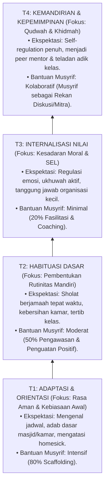

# P2-04-03-Prinsip-Progresi-Tangga-TUMBUH-T1-T4

## Tujuan
Menetapkan prinsip diferensiasi bimbingan dan standar ekspektasi bertahap melintasi **Tangga Progresi TUMBUH (T1, T2, T3, T4)**, memastikan setiap santri dinilai dan dibina sesuai tingkat kematangan adab dan kapasitas regulasi dirinya.

---

## 1. Arsitektur Tangga Perkembangan Santri

---

## 2. 3 Kaidah Baku Progresi Tangga TUMBUH

1. **Kaidah Larangan Standarisasi Mutlak (*Anti-Uniformity*)**:
   - Santri baru di jenjang T1 tidak boleh dihukum karena belum memiliki kemandirian seperti santri T3. Penilaian perkembangan wajib menggunakan rubrik yang sesuai jenjang tangganya.
2. **Kaidah Transisi Berbasis Bukti (*Evidence-Based Gateways*)**:
   - Kenaikan tangga santri (misal: dari T1 ke T2, atau T2 ke T3) didasarkan pada rekam data pencapaian portofolio adab harian PBIS dan observasi musyrif, bukan sekadar pergantian tahun ajaran otomatis.
3. **Kaidah Dukungan Khusus Santri Tertinggal (*Tiered Catch-Up Support*)**:
   - Santri yang mengalami kemandekan di jenjang T1 atau T2 mendapatkan dukungan kelompok kecil (*Tier 2 PBIS*) tanpa diberi label negatif.

---

## 3. Status Dokumen
* **Status**: 🌟 **A+ (Tervalidasi & Siap Diimplementasikan)**
* **Level**: Project 2 - `02 Principles / 04 Development Principles`
* **Langkah Berikutnya**: **`P2-04-04-Prinsip-Integrasi-CASEL-SEL-dan-Karakter-Islami.md`**.
