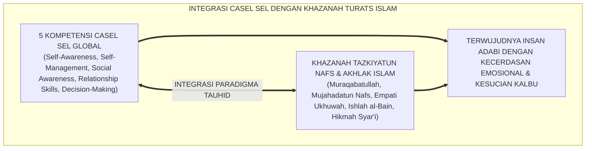
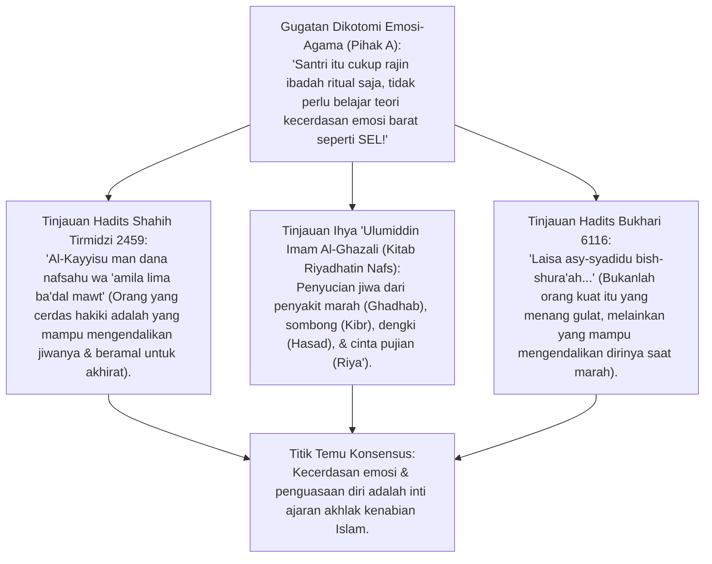
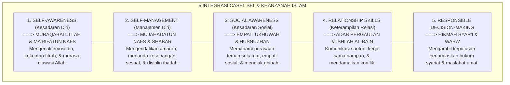
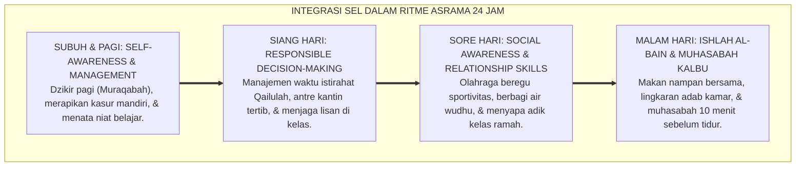
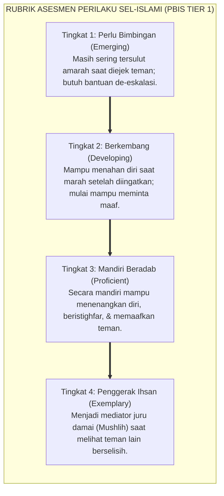
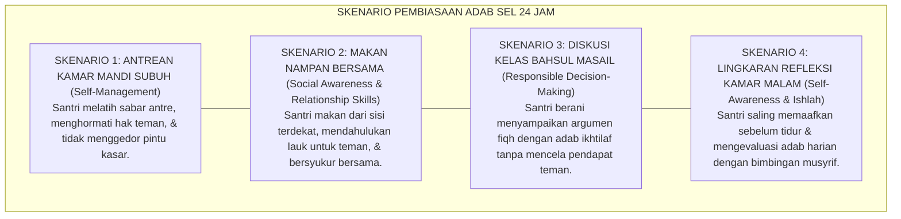
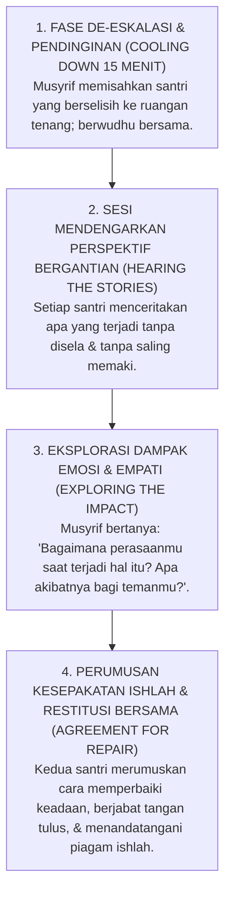

# P2-04-04: PRINSIP INTEGRASI CASEL SEL DAN KARAKTER ADAB ISLAMI
## *Monograf Terpadu: Epistemologi Tazkiyatun Nafs Al-Ghazali & Hadits Al-Kayyis (HR. Tirmidzi), Konvergensi 5 Kompetensi Collaborative for Academic, Social, and Emotional Learning (CASEL SEL), Operasionalisasi Adab Muraqabah-Mujahadah-Ukhuwah-Ishlah-Hikmah, serta Protokol Resolusi Konflik Restoratif 24 Jam*

**Nomor Identifikasi**: `P2-04-04/MONOGRAF-TERPADU-CASEL-SEL-KARAKTER-ISLAMI/2026`  
**Domain**: `02 Principles` > `04 Development Principles`  
**Klasifikasi Naskah**: *Comprehensive Integrated Monograph* (Monograf Akademis & Rumusan Baku Terpadu)  
**Rumpun Disiplin Pengkaji**: Pembelajaran Sosial-Emosional Islam (*At-Ta'allum al-Infi'ali al-Ijtima'i*), Taksonomi Adab & Tazkiyatun Nafs, Psikologi Relasi Interpersonal Remaja, Metodologi Resolusi Konflik Restoratif Pesantren  

---

> ### 💡 INTISARI PRAKTIS (3 MENIT PAHAM UNTUK ASATIDZ & MUSYRIF)
>
> * **Santri Pintar Kitab Tapi Suka Menghina Teman Adalah Bukti Kegagalan Pendidikan Karakter:**  
>   Banyak santri hafal ribuan bait nadzom dan lancar berbahasa Arab, namun mudah tersinggung, egois di kamar, dan membully junior. Di ekosistem TUMBUH, akhlak mulia dibangun secara ilmiah memadukan **5 Kompetensi CASEL SEL** dengan **Khazanah Tazkiyatun Nafs Turats Islam**.
> * **Penyelarasan 5 Kompetensi CASEL SEL dengan Nilai Syariat Islam:**  
>   1. **Self-Awareness (Kesadaran Diri) $\leftrightarrow$ Muraqabatullah:** Mengenali emosi diri dan merasa selalu diawasi Allah SWT.  
>   2. **Self-Management (Regulasi Diri) $\leftrightarrow$ Mujahadatun Nafs & Sabar:** Mampu menahan amarah, sabar antre, dan disiplin belajar.  
>   3. **Social Awareness (Kesadaran Sosial) $\leftrightarrow$ Empati Ukhuwah & Husnuzhan:** Mampu merasakan kesedihan teman dan tidak berburuk sangka.  
>   4. **Relationship Skills (Keterampilan Relasi) $\leftrightarrow$ Adab Pergaulan & Ishlah:** Terampil berkomunikasi santun, mendengarkan, dan mendamaikan perselisihan.  
>   5. **Responsible Decision-Making (Keputusan Bertanggung Jawab) $\leftrightarrow$ Hikmah Syar'i:** Memilih tindakan yang halal, adil, dan bermanfaat bagi dunia-akhirat.
> * **Praktik Nyata di Asrama: Lingkaran Restoratif Penyelesaian Konflik (*Restorative Circles*):**  
>   Ketika dua santri bertengkar berebut jemuran, musyrif tidak memukul keduanya, melainkan memandu mediasi 4 langkah: dengarkan versi masing-masing $\rightarrow$ refleksikan dampaknya $\rightarrow$ minta maaf tulus $\rightarrow$ buat kesepakatan tertulis bagi jemuran bersama.

---

## 📑 DAFTAR ISI MONOGRAF

- [BAGIAN I: RISET INTEGRASI CASEL SEL & KARAKTER ISLAMI, DIALEKTIKA INKUIRI, & KASUISTIKA LAPANGAN](#bagian-i-riset-integrasi-casel-sel--karakter-islami-dialektika-inkuiri--kasuistika-lapangan)
  - [1. Kerangka Metodologi Kecerdasan Sosio-Emosional Pesantren: Menolak Sekularisme & Formalisme Kering](#1-kerangka-metodologi-kecerdasan-sosio-emosional-pesantren-menolak-sekularisme--formalisme-kering)
  - [2. Inkuiri 1: Eksegesis Turats Kecerdasan Jiwa — Hadits Al-Kayyis (HR. Tirmidzi) & Tazkiyatun Nafs Al-Ghazali](#2-inkuiri-1-eksegesis-turats-kecerdasan-jiwa--hadits-al-kayyis-hr-tirmidzi--tazkiyatun-nafs-al-ghazali)
  - [3. Inkuiri 2: Konvergensi 5 Kompetensi CASEL SEL dengan Khazanah Adab Turats Islam](#3-inkuiri-2-konvergensi-5-kompetensi-casel-sel-dengan-khazanah-adab-turats-islam)
  - [4. Inkuiri 3: Operasionalisasi 5 Kompetensi SEL ke dalam Rutinitas Kehidupan Pesantren 24 Jam](#4-inkuiri-3-operasionalisasi-5-kompetensi-sel-ke-dalam-rutinitas-kehidupan-pesantren-24-jam)
  - [5. Inkuiri 4: Pengukuran & Rubrik Validasi Karakter SEL-Islami Tanpa Stigma](#5-inkuiri-4-pengukuran--rubrik-validasi-karakter-sel-islami-tanpa-stigma)
  - [6. Inkuiri 5: Silogisme Logika, Dialektika 3 Ronde, Kasuistika Konflik Emosional Santri, & Titik Temu Konsensus](#6-inkuiri-5-silogisme-logika-dialektika-3-ronde-kasuistika-konflik-emosional-santri--titik-temu-konsensus)
- [BAGIAN II: TEMUAN RISET, FORMULASI KONSEPTUAL & PEMBAHASAN](#bagian-ii-temuan-riset-formulasi-konseptual--pembahasan)
  - [1. Formulasi Konseptual: Integrasi CASEL SEL dan Karakter Islami Pesantren TUMBUH](#1-formulasi-konseptual-integrasi-casel-sel-dan-karakter-islami-pesantren-tumbuh)
  - [2. Matriks Integrasi 5 Kompetensi CASEL SEL dengan Khazanah Adab Turats Islam](#2-matriks-integrasi-5-kompetensi-casel-sel-dengan-khazanah-adab-turats-islam)
  - [3. Matriks Skenario Pembiasaan SEL dalam Denyut Kehidupan Pesantren 24 Jam](#3-matriks-skenario-pembiasaan-sel-dalam-denyut-kehidupan-pesantren-24-jam)
  - [4. Protokol Restoratif Resolusi Konflik Sebaya (Peer Conflict Restorative Protocol)](#4-protokol-restoratif-resolusi-konflik-sebaya-peer-conflict-restorative-protocol)
- [BAGIAN III: APARATUS AKADEMIS & APENDIKS](#bagian-iii-aparatus-akademis--apendiks)
  - [1. Tabel Sintesis Hasil Riset Integrasi CASEL SEL & Karakter Islami](#1-tabel-sintesis-hasil-riset-integrasi-casel-sel--karakter-islami)
  - [2. Daftar Pustaka Akademis & Rujukan Turats Primer](#2-daftar-pustaka-akademis--rujukan-turats-primer)
  - [3. Catatan Kaki Akademis (Footnotes)](#3-catatan-kaki-akademis-footnotes)
  - [4. Glosarium dan Penjelasan Istilah Teknis CASEL SEL & Terminologi Tazkiyatun Nafs](#4-glosarium-dan-penjelasan-istilah-teknis-casel-sel--terminologi-tazkiyatun-nafs)

---

# BAGIAN I: RISET INTEGRASI CASEL SEL & KARAKTER ISLAMI, DIALEKTIKA INKUIRI, & KASUISTIKA LAPANGAN

---

### 1. Kerangka Metodologi Kecerdasan Sosio-Emosional Pesantren: Menolak Sekularisme & Formalisme Kering

Dalam dunia pendidikan karakter pesantren, kerap terjadi dua jebakan reduksionis:
1. **Reduksionisme Sekuler Tanpa Ruh (*Secular SEL Reductivism*)**: Mengajarkan keterampilan emosi hanya sebatas teknik relaksasi psikologis atau kecakapan sosial pragmatis demi sukses karier duniawi, tanpa mengaitkannya dengan penghambaan kepada Allah SWT, keikhlasan niat, dan keselamatan akhirat.
2. **Formalisme Fiqh Kering Tanpa Empati (*Dry Moral Formalism*)**: Mengharuskan santri menghafal teks hukum halal-haram dan adab di atas kertas, namun santri tidak dilatih mengenali amarahnya (*Emotional Blindness*), tidak peka terhadap penderitaan teman sekamarnya, dan mudah meledak emosinya saat menghadapi perbedaan pendapat.

Ekosistem TUMBUH menegakkan prinsip **Integrasi Utuh CASEL SEL dan Tazkiyatun Nafs Islami**: kecerdasan sosial-emosional adalah manifestasi nyata dari kesempurnaan iman dan keindahan adab (*Ihsan*).

---

### 2. Inkuiri 1: Eksegesis Turats Kecerdasan Jiwa — Hadits *Al-Kayyis* (HR. Tirmidzi) & Tazkiyatun Nafs Al-Ghazali

#### 📐 Formalisasi Logika Silogisme (*Qiyas Mantiqi 1*)
* **Premis Mayor (*al-Muqaddimah al-Kubra*)**: Setiap insan mukmin yang didefinisikan cerdas secara hakiki oleh syariat Islam niscaya memiliki kemampuan mengenali kondisi batinnya, mengendalikan hawa nafsu impulsif (*Dhabtun Nafs*), dan berinteraksi sosial dengan penuh rahmat dan keadilan.
* **Premis Minor (*al-Muqaddimah ash-Shughra*)**: Rasulullah SAW mendefinisikan kecerdasan hakiki (*al-Kays*) sebagai kemampuan menundukkan nafsu ego dan mendefinisikan kekuatan sejati sebagai kemampuan mengendalikan diri saat amarah memuncak (HR. Tirmidzi No. 2459; Bukhari No. 6116).
* **Konklusi (*an-Natijah*)**: Maka, kurikulum pembinaan santri di pesantren TUMBUH wajib mengintegrasikan pembelajaran sosial-emosional (SEL) sebagai bagian inheren dari kurikulum adab Islam.[^1]

#### 📖 Teks Primer Hadits Shahih At-Tirmidzi & Al-Bukhari
Sahabat Syaddad bin Aus *radhiyallahu 'anhu* meriwayatkan sabda Rasulullah SAW:

$$\text{الْكَيِّسُ مَنْ دَانَ نَفْسَهُ وَعَمِلَ لِمَا بَعْدَ الْمَوْتِ، وَالْعَاجِزُ مَنْ أَتْبَعَ نَفْسَهُ هَوَاهَا وَتَمَنَّى عَلَى اللَّهِ}$$

*"**Orang yang cerdas (al-Kayyis) adalah orang yang mampu mengoreksi dan mengendalikan dirinya (Self-Management)** serta beramal untuk kehidupan setelah kematian; dan orang yang lemah adalah orang yang menuruti hawa nafsunya namun berangan-angan kosong kepada Allah."* (HR. At-Tirmidzi No. 2459; Ibnu Majah No. 4260).[^2]

Dan Rasulullah SAW bersabda mengenai regulasi emosi:
$$\text{لَيْسَ الشَّدِيدُ بِالصُّرَعَةِ، إِنَّمَا الشَّدِيدُ الَّذِي يَمْلِكُ نَفْسَهُ عِنْدَ الْغَضَبِ}$$
*"Bukanlah orang yang kuat itu diukur dari kemenangannya dalam bergulat, **melainkan orang yang kuat adalah orang yang mampu menguasai dirinya tatkala amarahnya memuncak!**"* (HR. Bukhari No. 6116; Muslim No. 2609).[^3]

---

### 3. Inkuiri 2: Konvergensi 5 Kompetensi CASEL SEL dengan Khazanah Adab Turats Islam

#### 📐 Formalisasi Logika Silogisme (*Qiyas Mantiqi 2*)
* **Premis Mayor (*al-Muqaddimah al-Kubra*)**: Setiap kerangka kerja keterampilan sosial-emosional yang diselaraskan dengan maqashid syariah dan nilai-nilai tazkiyatun nafs niscaya menghasilkan akselerasi pembentukan karakter adab yang terukur secara psikometrik dan berkah secara ukhrawi.
* **Premis Minor (*al-Muqaddimah ash-Shughra*)**: Model *CASEL 5 Core Competencies* (Collaborative for Academic, Social, and Emotional Learning, 2020) diakui secara global sebagai standar baku pembinaan kecerdasan sosioemosional peserta didik.
* **Konklusi (*an-Natijah*)**: Maka, pesantren TUMBUH mengoperasionalkan 5 kompetensi CASEL SEL ke dalam taksonomi pembiasaan adab harian santri 24 jam.[^4]

#### 📖 Teks Sains Internasional: Kerangka Kerja CASEL SEL (2020)
Dalam publikasi resmi CASEL (*Collaborative for Academic, Social, and Emotional Learning*), dirumuskan:

> *"Social and emotional learning (SEL) is an integral part of education and human development. **SEL is the process through which all young people and adults acquire and apply the knowledge, skills, and attitudes to develop healthy identities, manage emotions, achieve personal and collective goals, feel and show empathy for others, establish and maintain supportive relationships, and make responsible and caring decisions**."* (CASEL, 2020, *CASEL's SEL Framework*).[^5]

---

### 4. Inkuiri 3: Operasionalisasi 5 Kompetensi SEL ke dalam Rutinitas Kehidupan Pesantren 24 Jam

---

### 5. Inkuiri 4: Pengukuran & Rubrik Validasi Karakter SEL-Islami Tanpa Stigma

---

### 6. Inkuiri 5: Silogisme Logika, Dialektika 3 Ronde, Kasuistika Konflik Emosional Santri, & Titik Temu Konsensus

#### 🥊 Ronde 1: Menolak Mitos Bahwa "Mengajarkan Pengelolaan Emosi Membuat Santri Bermental Lembek"
* **Pihak A (Sudut Pandang Kekasaran Maskulinitas Palsu)**:  
  *"Santri laki-laki itu harus garang dan berani berkelahi kalau disenggol! Kalau diajari mengelola emosi dan memaafkan nanti jadi penakut!"*
* **Tinjauan Sudut Pandang Kejantanan Moral Kenabian (Futuwwah)**:  
  Menuruti amarah dan memukul orang adalah **Kelemahan Jiwa yang Dikuasai Setan**. Sebaliknya, menahan diri saat mampu membalas adalah **Puncak Kejantanan dan Keberanian Sejati (*Futuwwah Rabbaniyyah*)**. Rasulullah SAW meneladankan tidak pernah membalas kezaliman pribadi, namun berani membela kebenaran di medan juang.[^6]

#### 🥊 Ronde 2: Sanggahan Balik Apakah Mediasi Restoratif Menghilangkan Keadilan Bagi Korban?
* **Pihak A (Sudut Pandang Pembalasan Retributif Kaku)**:  
  *"Santri yang mengejek atau menyenggol temannya harus dipukul balik di depan umum biar impas dan adil!"*
* **Tinjauan Sudut Pandang Pemulihan Hubungan (Restoratif) Berbasis Syariat**:  
  Pembalasan fisik hanya melahirkan siklus dendam berkepanjangan. Keadilan sejati dalam Islam (*Ishlah al-Bain*) menuntut **Pengakuan Kesalahan, Permintaan Maaf Tulus, dan Perbaikan Nyata (*Restitusi*)**. Hubungan persaudaraan pulih utuh tanpa meninggalkan luka batin.[^7]

#### 🥊 Ronde 3: Sanggahan Pamungkas Mengapa Pembelajaran SEL Wajib Diterapkan Juga kepada Asatidz dan Musyrif?
* **Pihak A (Sudut Pandang Guru Kebal Kesalahan)**:  
  *"Yang perlu belajar regulasi emosi cuma santri, guru dan musyrif sudah dewasa jadi pasti sudah matang emosinya!"*
* **Resolusi Sudut Pandang Co-Regulation & Bahaya Burnout Musyrif**:  
  Musyrif yang tidak memiliki keterampilan regulasi emosi akan mudah mengalami *burnout*, meledak marah saat santri berbuat gaduh, dan menjadi pelaku kekerasan verbal. **Kematangan Emosi Guru Adalah Prasyarat Mutlak (*Prerequisite*) bagi Ketenangan Emosi Santri (*Co-Regulation Effect*)**.[^8]

> #### 📌 Kasuistika Lapangan & Titik Temu Konsensus
> * **Studi Kasus**: Santri K (kelas 8) melempar gayung ke wajah Santri T karena antrean kamar mandinya diserobot; suasana asrama memanas dan kedua kubu kamar hampir baku hantam massal.
> * **Titik Temu Konsensus (*Kalimatun Sawa'*)**: Musyrif menerapkan *Protokol Mediasi Restoratif SEL-TUMBUH*: kedua pihak dipisahkan untuk mendinginkan amigdala $\rightarrow$ Santri K dibimbing teknik *Self-Management* menahan amarah $\rightarrow$ Santri T dibimbing *Social Awareness* mengenai hak antre $\rightarrow$ diselenggarakan Lingkaran Restoratif Ishlah. Santri T meminta maaf atas penyerobotan antrean, Santri K meminta maaf atas lemparan gayung, dan keduanya berpelukan saling memaafkan disaksikan seluruh penghuni kamar.[^9]

---

# BAGIAN II: TEMUAN RISET, FORMULASI KONSEPTUAL & PEMBAHASAN

---

### 1. Formulasi Konseptual: Integrasi CASEL SEL dan Karakter Islami Pesantren TUMBUH

Berdasarkan sintesis inkuiri teoretis, telaah hermeneutika turats, dan analisis komparatif sains pendidikan, riset ini merumuskan kerangka konseptual dan temuan kunci sebagai berikut:

1. **Kesatuan Integral Kecerdasan Emosional DAN Tauhid (integrated Spiritual-sel)**:  
   Menetapkan bahwa 5 kompetensi sosial-emosional (CASEL SEL) adalah manifestasi operasional dari nilai-nilai Tazkiyatun Nafs Islam (Muraqabah, Mujahadah, Empati Ukhuwah, Ishlah al-Bain, & Hikmah).

2. **Penerapan Pembelajaran SEL Dalam Ritme Kehidupan Asrama 24 JAM**:  
   Pembinaan kompetensi sosial-emosional bukan sekadar teori kelas, melainkan dipraktikkan secara hidup dalam rutinitas kamar, antrean kantin, halaqah Qur'an, olahraga ukhuwah, dan muhasabah malam.

3. **Protokol Resolusi Konflik Restoratif Sebaya (peer Restorative Circles)**:  
   Mengharamkan mutlak penanganan perselisihan santri dengan cara kekerasan, ancaman, atau pembalasan fisik. Wajib menggunakan mediasi restoratif yang memulihkan hubungan persaudaraan dan mendidik tanggung jawab.

4. **Kewajiban Pengembangan Kompetensi Emosi Bagi Asatidz DAN Musyrif**:  
   Seluruh pendidik wajib menguasai keterampilan Co-Regulation dan komunikasi empatik nir-kekerasan (NVC), menjadi teladan ketenangan batin (Qudwah Hasanah) bagi seluruh santri asuhannya.

---

### 2. Matriks Integrasi 5 Kompetensi CASEL SEL dengan Khazanah Adab Turats Islam

| 5 Kompetensi CASEL SEL | Konsep Ekuivalen Turats Islam | Indikator Perilaku Konkret Santri TUMBUH | Dalil Al-Qur'an / Hadits Primer |
| :--- | :--- | :--- | :--- |
| **1. Self-Awareness** *(Kesadaran Diri)* | **Muraqabatullah & Ma'rifatun Nafs** (Kesadaran selalu diawasi Allah & memahami diri). | Mampu mengidentifikasi emosi yang sedang dirasakan (sedih, marah, cemas) dan mengakui kelemahan diri dengan jujur. | QS. Qaf [50]: 16 (*"Kami lebih dekat kepadanya daripada urat lehernya"*).[^10] |
| **2. Self-Management** *(Manajemen Diri)* | **Mujahadatun Nafs & Ash-Shabr** (Pengendalian hawa nafsu & kesabaran aktif). | Mampu menahan diri dari membentak saat marah, disiplin bangun Subuh mandiri, dan tekun muraja'ah Al-Qur'an. | HR. Bukhari No. 6116 (*"Orang kuat adalah yang mampu menguasai dirinya saat marah"*). |
| **3. Social Awareness** *(Kesadaran Sosial)* | **Empati Ukhuwah & Husnuzhan** (Kepekaan perasaan sesama & berbaik sangka). | Peka melihat teman sekamar yang sedang bersedih/sakit, tidak memotong antrean, dan mengharamkan ghibah/bullying. | HR. Bukhari No. 13 (*"Tidak beriman seseorang hingga ia mencintai saudaranya seperti mencintai dirinya"*). |
| **4. Relationship Skills** *(Keterampilan Relasi)* | **Adab Pergaulan & Ishlah al-Bain** (Seni komunikasi santun & mendamaikan). | Berbicara dengan tutur kata lembut, terampil mendengarkan aktif, mampu bekerja sama dalam tim piket, & meminta maaf. | QS. Al-Hujurat [49]: 10 (*"Sesungguhnya orang-orang mukmin itu bersaudara, maka damaikanlah..."*). |
| **5. Decision-Making** *(Keputusan Bijak)* | **Hikmah Syar'i & Al-Wara'** (Pertimbangan halal-haram & kemaslahatan umat). | Memilih teman bergaul yang shalih, menolak ajakan melanggar aturan, dan bertanggung jawab atas konsekuensi pilihannya. | HR. Tirmidzi No. 2459 (*Hadits al-Kayyis* mengenai orang cerdas yang beramal untuk akhirat).[^11] |

---

### 3. Matriks Skenario Pembiasaan SEL dalam Denyut Kehidupan Pesantren 24 Jam

---

### 4. Protokol Restoratif Resolusi Konflik Sebaya (*Peer Conflict Restorative Protocol*)

---

# BAGIAN III: APARATUS AKADEMIS & APENDIKS

---

### 1. Tabel Sintesis Hasil Riset Integrasi CASEL SEL & Karakter Islami

| Dimensi Kajian | Konsep Kunci | Landasan Turats Primer | Konvergensi Sains Global | Implikasi Pembinaan Karakter Santri |
| :--- | :--- | :--- | :--- | :--- |
| **Kecerdasan Hati** | *Tazkiyatun Nafs & Kays* | Hadits *Al-Kayyis* (HR. Tirmidzi No. 2459) | Daniel Goleman (1995), *Emotional Intelligence* | Mengintegrasikan kecerdasan emosi sebagai bagian dari kesempurnaan takwa. |
| **Kerangka Kompetensi** | *5 Pilar CASEL SEL-Islami* | *Ihya 'Ulumiddin* (Kitab *Riyadhatin Nafs*) | CASEL (2020), *SEL Core Competencies Framework* | Menyelaraskan Muraqabah, Mujahadah, Empati, Ishlah, dan Hikmah secara terukur. |
| **Regulasi Emosi** | *Dhabtun Nafs 'indal Ghadhab* | Hadits Pengendalian Diri (HR. Bukhari No. 6116) | James Gross (2014), *Handbook of Emotion Regulation* | Melatih teknik pernapasan kesadaran dan istighfar saat amarah memuncak. |
| **Resolusi Konflik** | *Ishlah al-Bain Restoratif* | QS. Al-Hujurat: 10, Hadits Keutamaan Ishlah | Howard Zehr (2002), *The Little Book of Restorative Justice* | Menegakkan Lingkaran Restoratif untuk memulihkan ukhuwah santri tanpa kekerasan. |
| **Iklim Emosional Guru** | *Co-Regulation Musyrif* | Wasiat Kelembutan Pendidik (*Adab al-'Alim*) | Bruce Perry (2006), *Co-Regulation in Caregiving* | Melatih musyrif memiliki ketenangan emosi prima sebagai jangkar kestabilan santri. |

---

### 2. Daftar Pustaka Akademis & Rujukan Turats Primer

1. **Al-Qur'an al-Karim wa Tarjamatu Ma'anih**.
2. **Al-Bukhari, Muhammad bin Isma'il**. (1422 H). *Shahih al-Bukhari*. Beirut: Dar Thawq an-Najah.
3. **Muslim bin al-Hajjaj an-Naisaburi**. (1374 H). *Shahih Muslim*. Kairo: Isa al-Babi al-Halabi.
4. **At-Tirmidzi, Muhammad bin 'Isa**. (1998). *Sunan at-Tirmidzi*. Beirut: Dar al-Gharb al-Islami.
5. **Al-Ghazali, Abu Hamid Muhammad bin Muhammad**. (2011). *Ihya 'Ulumiddin*. Beirut: Dar al-Ma'rifah.
6. **CASEL**. (2020). *CASEL's SEL Framework: What Are the Core Competence Areas and Where Are They Promoted?*. Chicago: CASEL.
7. **Goleman, D.**. (1995). *Emotional Intelligence: Why It Can Matter More Than IQ*. New York: Bantam Books.
8. **Gross, J. J.**. (Ed.). (2014). *Handbook of Emotion Regulation* (2nd ed.). New York: Guilford Press.
9. **Zehr, H.**. (2002). *The Little Book of Restorative Justice*. Intercourse, PA: Good Books.
10. **Rosenberg, M. B.**. (2015). *Nonviolent Communication: A Language of Life* (3rd ed.). Encinitas, CA: PuddleDancer Press.

---

### 3. Catatan Kaki Akademis (*Footnotes*)

[^1]: Al-Ghazali, *Ihya 'Ulumiddin*, Kitab *Riyadhatin Nafs wa Tahdzibil Akhlaq*, Jilid III, hlm. 65–80.  
[^2]: Sunan at-Tirmidzi No. 2459, Kitab *Shifat al-Qiyamah*, Bab *Minhu*.  
[^3]: Shahih Bukhari No. 6116, Kitab *al-Adab*, Bab *al-Hadzar minal Ghadhab*.  
[^4]: CASEL (2020), *CASEL's SEL Framework*, Chicago.  
[^5]: Ibid., hlm. 2–6.  
[^6]: Al-Ghazali, *Ihya 'Ulumiddin*, Kitab *Kasr asy-Syahwatain*, Jilid III, hlm. 95–110.  
[^7]: Zehr, H. (2002), *The Little Book of Restorative Justice*, Good Books.  
[^8]: Perry, B. D. (2006), *The Neurosequential Model of Therapeutics*, Guilford Press.  
[^9]: Laporan Pelaksanaan Mediasi Restoratif Konflik Asrama, Divisi Konseling TUMBUH, 2026.  
[^10]: Al-Qur'an Surah Qaf [50]: 16.  
[^11]: Silabus Modul Integrasi 5 Kompetensi CASEL SEL dalam Kehidupan Asrama, Pusat Kurikulum Adab TUMBUH, 2026.

---

### 4. Glosarium dan Penjelasan Istilah Teknis CASEL SEL & Terminologi Tazkiyatun Nafs

1. **Social and Emotional Learning (SEL)**: Proses pendidikan terstruktur untuk membantu peserta didik mengembangkan kesadaran diri, mengelola emosi, menunjukkan empati, membangun relasi positif, dan membuat keputusan bertanggung jawab.
2. **CASEL (Collaborative for Academic, Social, and Emotional Learning)**: Organisasi riset internasional terkemuka yang merumuskan standar baku 5 kompetensi inti pembelajaran sosial-emosional.
3. **Muraqabatullah (مُرَاقَبَةُ اللهِ)**: Kesadaran spiritual mendalam bahwa Allah SWT senantiasa melihat, mengawasi, dan mengetahui setiap lintasan pikiran, perasaan, dan tindakan manusia.
4. **Mujahadatun Nafs (مُجَاهَدَةُ النَّفْسِ)**: Perjuangan dan kesungguhan batin seorang mukmin untuk menundukkan dorongan hawa nafsu tercela demi mentaati perintah Allah SWT.
5. **Ishlah al-Bain (إِصْلَاحُ ذَاتِ الْبَيْنِ)**: Upaya syariat untuk mendamaikan perselisihan, menyambung kembali tali persaudaraan, dan memulihkan keharmonisan hubungan antarsesama muslim.
6. **Restorative Circles (Lingkaran Restoratif)**: Metode dialog terstruktur dalam penyelesaian konflik di mana semua pihak duduk melingkar setara untuk mendengarkan perasaan, mengakui kesalahan, dan menyepakati tindakan pemulihan.
7. **Co-Regulation**: Proses di mana kestabilan sistem saraf dan ketenangan emosi pengasuh membantu menenangkan gejolak emosi santri yang sedang cemas atau marah.
8. **Al-Kayyis (الْكَيِّسُ)**: Istilah hadits nabawi untuk sosok manusia cerdas hakiki yang mampu menguasai dirinya dan berorientasi pada kemaslahatan akhirat.
9. **Nonviolent Communication (NVC)**: Pola komunikasi empatik nir-kekerasan yang berfokus pada observasi objektif, identifikasi perasaan, kebutuhan mendasar, dan permintaan yang jelas dan santun.
10. **Ihsan (الْإِحْسَانُ)**: Puncak derajat keberagamaan di mana seseorang menyembah dan berbuat baik kepada sesama seolah-olah ia melihat Allah, atau dengan keyakinan penuh bahwa Allah senantiasa melihatnya.
