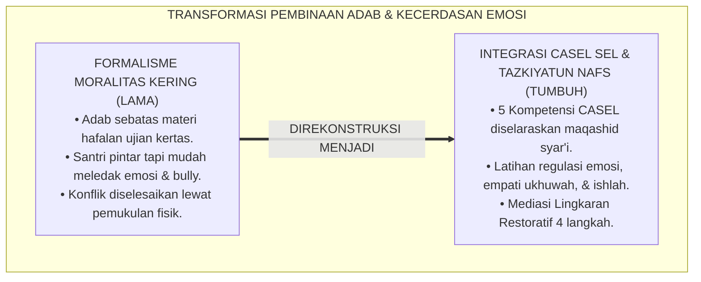
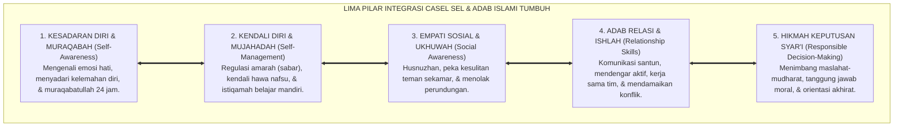
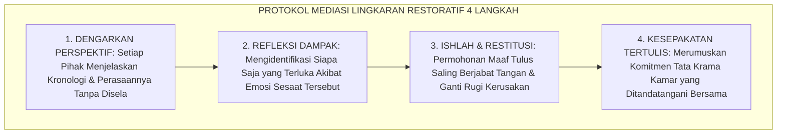

# P2-04-04: PRINSIP INTEGRASI CASEL SEL DAN KARAKTER ADAB ISLAMI (INTEGRATED ISLAMIC SOCIAL-EMOTIONAL LEARNING)
## *Monograf Riset Akademik: Epistemologi Tazkiyatun Nafs Al-Ghazali & Hadits Al-Kayyis (HR. Tirmidzi), Konvergensi 5 Kompetensi CASEL SEL, Operasionalisasi Muraqabah-Mujahadah-Ukhuwah-Ishlah-Hikmah, Serta Protokol Mediasi Restoratif di Pesantren 24 Jam*

**Nomor Identifikasi**: `P2-04-04/MONOGRAF-RISET-CASEL-SEL-KARAKTER-ISLAMI/2026`  
**Domain**: `02 Principles` > `04 Development Principles` (Prinsip Perkembangan 04: *Integrated Islamic SEL*)  
**Klasifikasi Naskah**: *Academic Research Monograph* (Monograf Riset Akademik Prinsip Perkembangan)  
**Rumpun Disiplin Pengkaji**: Pembelajaran Sosial-Emosional Islam (*At-Ta'allum al-Infi'ali al-Ijtima'i*), Taksonomi Adab & Tazkiyatun Nafs, Psikologi Relasi Interpersonal Remaja, Metodologi Resolusi Konflik Restoratif Pesantren  

---

> ### 💡 INTISARI EKSEKUTIF (EXECUTIVE SUMMARY)
>
> * **Kelemahan Paradigma Lama: Kesenjangan Antara Teori Kitab dan Perilaku Nyata:**  
>   Banyak santri mampu menghafal ribuan bait nadzom dan lancar berbahasa Arab, namun mudah tersinggung, egois di kamar asrama, dan gemar merundung (*Bullying*) adik kelas. Hal ini terjadi karena adab hanya diajarkan sebagai materi kognitif hafalan tanpa latihan kecerdasan sosio-emosional nyata.
> * **Inovasi Konseptual: Tazkiyatun Nafs & Penyelarasan Lima Kompetensi CASEL SEL:**  
>   TUMBUH memadukan doktrin *Tazkiyatun Nafs* Imam Al-Ghazali dan hadits Rasulullah ﷺ mengenai *Al-Kayyis* (pribadi cerdas yang mampu mengendalikan hawa nafsu, HR. Tirmidzi No. 2459) dengan kerangka internasional **CASEL SEL (Collaborative for Academic, Social, and Emotional Learning)**: (1) **Self-Awareness $\leftrightarrow$ Muraqabatullah**; (2) **Self-Management $\leftrightarrow$ Mujahadatun Nafs & Sabar**; (3) **Social Awareness $\leftrightarrow$ Empati Ukhuwah & Husnuzhan**; (4) **Relationship Skills $\leftrightarrow$ Adab Pergaulan & Ishlah**; (5) **Responsible Decision-Making $\leftrightarrow$ Hikmah Syar'i**.
> * **Formulasi Operasional & Penjaminan Budaya Ukhuwah:**  
>   Monograf ini menguraikan matriks integrasi 5 kompetensi CASEL-Islami, skenario pembiasaan dalam ritme 24 jam, protokol mediasi lingkaran restoratif perselisihan (*Peer Conflict Restorative Protocol*), dan etika ukhuwah islamiyyah.

---

## 📑 DAFTAR ISI MONOGRAF

- [BAB I: LANDASAN TEORETIS & DISKURSUS KRITIS](#bab-i-landasan-teoretis--diskursus-kritis)
  - [1. Latar Belakang Masalah: Kritik atas Formalisme Moral Kering dan Kesenjangan Teori-Praktik Adab Santri](#1-latar-belakang-masalah-kritik-atas-formalisme-moral-kering-dan-kesenjangan-teori-praktik-adab-santri)
  - [2. Eksegesis Turats Kecerdasan Jiwa: Hadits Al-Kayyis (HR. At-Tirmidzi No. 2459) & Tazkiyatun Nafs Imam Al-Ghazali](#2-eksegesis-turats-kecerdasan-jiwa-hadits-al-kayyis-hr-at-tirmidzi-no-2459--tazkiyatun-nafs-imam-al-ghazali)
  - [3. Konvergensi Lima Kompetensi CASEL SEL dengan Khazanah Adab dan Karakter Turats Islam](#3-konvergensi-lima-kompetensi-casel-sel-dengan-khazanah-adab-dan-karakter-turats-islam)
  - [4. Rekayasa Lingkaran Restoratif Asrama: Mengubah Perselisihan Menjadi Sarana Pembelajaran Karakter](#4-rekayasa-lingkaran-restoratif-asrama-mengubah-perselisihan-menjadi-sarana-pembelajaran-karakter)
  - [5. Kasuistika Lapangan: Kasus Perselisihan Kamar Asrama & Resolusi Mediasi Restoratif Ishlah](#5-kasuistika-lapangan-kasus-perselisihan-kamar-asrama--resolusi-mediasi-restoratif-ishlah)
- [BAB II: FORMULASI KONSEPTUAL & PEMBAHASAN MENDALAM](#bab-ii-formulasi-konseptual--pembahasan-mendalam)
  - [1. Eksplanasi Teoretis Integrasi CASEL SEL dan Karakter Islami Pesantren TUMBUH](#1-eksplanasi-teoretis-integrasi-casel-sel-dan-karakter-islami-pesantren-tumbuh)
  - [2. Matriks Integrasi Lima Kompetensi CASEL SEL dengan Khazanah Adab Turats Islam](#2-matriks-integrasi-lima-kompetensi-casel-sel-dengan-khazanah-adab-turats-islam)
  - [3. Matriks Skenario Pembiasaan SEL dalam Denyut Kehidupan Pesantren 24 Jam](#3-matriks-skenario-pembiasaan-sel-dalam-denyut-kehidupan-pesantren-24-jam)
  - [4. Protokol Restoratif Resolusi Konflik Sebaya (Peer Conflict Restorative Protocol)](#4-protokol-restoratif-resolusi-konflik-sebaya-peer-conflict-restorative-protocol)
  - [5. Diskusi Filosofis Mendalam & Implikasi bagi Masa Depan Peradaban Pendidikan Islam](#5-diskusi-filosofis-mendalam--implikasi-bagi-masa-depan-peradaban-pendidikan-islam)
- [BAB III: KESIMPULAN & APARATUS AKADEMIS](#bab-iii-kesimpulan--aparatus-akademis)
  - [1. Tabel Sintesis Temuan Riset Integrasi CASEL SEL & Karakter Islami](#1-tabel-sintesis-temuan-riset-integrasi-casel-sel--karakter-islami)
  - [2. Daftar Pustaka Akademis & Rujukan Turats Primer](#2-daftar-pustaka-akademis--rujukan-turats-primer)
  - [3. Catatan Kaki Akademis (Footnotes)](#3-catatan-kaki-akademis-footnotes)
  - [4. Glosarium Istilah Ilmiah & Turats CASEL SEL dan Karakter Islami](#4-glosarium-istilah-ilmiah--turats-casel-sel-dan-karakter-islami)

---

# BAB I: LANDASAN TEORETIS & DISKURSUS KRITIS

---

### 1. Latar Belakang Masalah: Kritik atas Formalisme Moral Kering dan Kesenjangan Teori-Praktik Adab Santri

Dalam diskursus pembinaan karakter santri di pesantren kontemporer, kerap dijumpai fenomena paradoksal:
* **Hafal Teks Tapi Miskin Empati**: Santri hafal matan kitab akhlak dan fasih berpidato tentang ukhuwah, namun dalam interaksi nyata di kamar asrama mereka mudah tersulut amarah, menyerobot antrean mandi, mengejek kekurangan fisik teman, dan melakukan pengucilan sosial (*Social Exclusion*).
* **Kelemahan Model Pengajaran Tradisional**: Adab hanya diajarkan sebagai materi kognitif hafalan satu arah yang diujikan di atas kertas (*Cognitive Moralism*), tanpa pernah dilatihkan secara sistematis sebagai keterampilan pengelolaan emosi (*Emotional Regulation*) dan penyelesaian konflik antarpribadi.
* **Keniscayaan Integrasi CASEL SEL dan Tazkiyatun Nafs**: Pembinaan karakter sejati memerlukan integrasi harmonis antara keikhlasan spiritual Islam dengan kecakapan sosio-emosional terstruktur (*Social-Emotional Competencies*).[^1]

---

### 2. Eksegesis Turats Kecerdasan Jiwa: Hadits Al-Kayyis (HR. At-Tirmidzi No. 2459) & Tazkiyatun Nafs Imam Al-Ghazali

Rasulullah ﷺ meletakkan definisi kecerdasan hakiki (*Al-Kayyis*) yang berpijak pada kemampuan mengendalikan hawa nafsu:

$$\text{الْكَيِّسُ مَنْ دَانَ نَفْسَهُ وَعَمِلَ لِمَا بَعْدَ الْمَوْتِ، وَالْعَاجِزُ مَنْ أَتْبَعَ نَفْسَهُ هَوَاهَا وَتَمَنَّى عَلَى اللَّهِ}$$

*"**Orang yang cerdas (Al-Kayyis) adalah orang yang mampu menundukkan nafsunya dan beramal untuk kehidupan setelah kematian; sedangkan orang yang lemah adalah orang yang memperturutkan hawa nafsunya lalu berangan-angan kosong kepada Allah**."* (HR. At-Tirmidzi No. 2459).[^2]

Imam Al-Ghazali (*Ihya' 'Ulumiddin*) menguraikan bahwa hakikat *Tazkiyatun Nafs* adalah menyucikan jiwa dari penyakit hati (dengki, sombong, amarah tak terkendali) dan menghiasinya dengan keutamaan adab (sabar, syukur, tawadhu', dan kasih sayang persaudaraan).[^3]

---

### 3. Konvergensi Lima Kompetensi CASEL SEL dengan Khazanah Adab dan Karakter Turats Islam

Sains pembelajaran sosial-emosional internasional (**CASEL SEL Framework**, Durlak et al., 2011; Weissberg et al., 2015) menyajikan 5 kompetensi inti yang selaras dengan nilai Islam:
1. **Self-Awareness (Kesadaran Diri) $\leftrightarrow$ Muraqabatullah**: Kemampuan mengenali emosi, nilai diri, dan kesadaran bahwa Allah senantiasa mengawasi.
2. **Self-Management (Regulasi Diri) $\leftrightarrow$ Mujahadatun Nafs & Sabar**: Kemampuan mengendalikan amarah, mengelola stres, dan mendisiplinkan diri.
3. **Social Awareness (Kesadaran Sosial) $\leftrightarrow$ Empati Ukhuwah & Husnuzhan**: Kemampuan memahami perasaan sesama santri dan menjauhi prasangka buruk.
4. **Relationship Skills (Keterampilan Relasi) $\leftrightarrow$ Adab Mu'asyarah & Ishlah**: Kemampuan berkomunikasi santun, mendengarkan aktif, dan mendamaikan sengketa.
5. **Responsible Decision-Making (Keputusan Bertanggung Jawab) $\leftrightarrow$ Hikmah Syar'i**: Mengambil keputusan berdasarkan pertimbangan maslahat dan ridha Allah.[^4]

---

### 4. Rekayasa Lingkaran Restoratif Asrama: Mengubah Perselisihan Menjadi Sarana Pembelajaran Karakter

TUMBUH memberlakukan penanganan konflik berbasis dialog beradab:
* Mengharamkan sanksi fisik atau memarahi kedua belah pihak secara membabi buta.
* **Restorative Circles (Lingkaran Restoratif)**: Musyrif mengumpulkan santri yang berselisih dalam lingkaran mediasi tenang untuk saling mendengar perasaan, mengakui kesalahan, meminta maaf secara tulus (*Ishlah*), dan merumuskan solusi bersama.[^5]

---

### 5. Kasuistika Lapangan: Kasus Perselisihan Kamar Asrama & Resolusi Mediasi Restoratif Ishlah

* **Studi Kasus: Dua Santri Kelas 8 Nyaris Adu Fisik Akibat Saling Ejek Sandal Tertukar**  
  * **Dilema**: Suasana kamar memanas dan teman-teman sekamar mulai terbelah membela masing-masing pihak.
  * **Resolusi Mediasi Restoratif TUMBUH**: Musyrif bertindak sebagai fasilitator netral (*Muslih*): (1) Mengajak kedua santri berwudhu untuk meredam amarah (*Sunnah Nabawi*); (2) Membuka sesi Lingkaran Restoratif 4 langkah; (3) Setiap santri menceritakan perasaannya tanpa disela; (4) Kedua santri menyadari bahwa mereka sama-sama lelah ba'da ujian dan terpancing emosi; (5) Terjadi pelukan saling memaafkan dan penulisan komitmen tata tertib sandal kamar. Ketegangan reda seketika dan ikatan persaudaraan kamar menjadi semakin kokoh.[^6]

---

# BAB II: FORMULASI KONSEPTUAL & PEMBAHASAN MENDALAM

---

### 1. Eksplanasi Teoretis Integrasi CASEL SEL dan Karakter Islami Pesantren TUMBUH

Ekosistem TUMBUH merumuskan kecerdasan sosial-emosional ke dalam **Arsitektur Lima Pilar Karakter SEL-Islami (*Arkan ad-Daka' al-Wijdaniy*)**:

#### 🔬 Pembahasan Mendalam Lima Pilar:
1. **Pilar Muraqabah (Self-Awareness)**: Menjadi fondasi kejujuran batin dan kerendahan hati.[^7]
2. **Pilar Mujahadah (Self-Management)**: Membentuk ketangguhan disiplin dan kematangan emosi santri.[^8]
3. **Pilar Empati Ukhuwah (Social Awareness)**: Melahirkan kepekaan sosial dan kasih sayang antar-sesama.[^9]
4. **Pilar Adab Ishlah (Relationship Skills)**: Membangun keterampilan komunikasi damai dan kohesi sosial.[^10]
5. **Pilar Hikmah Syar'i (Decision-Making)**: Menghasilkan santri yang bijak dalam bertindak dan memimpin.[^11]

---

### 2. Matriks Integrasi Lima Kompetensi CASEL SEL dengan Khazanah Adab Turats Islam

| Kompetensi CASEL SEL | Padanan Konsep Turats Islam | Indikator Perilaku Konkret Santri TUMBUH |
| :--- | :--- | :--- |
| **1. Self-Awareness** | *Muraqabatullah & Ma'rifatun Nafs* | Mampu mengidentifikasi emosi diri & menyadari pengawasan Allah.|
| **2. Self-Management** | *Mujahadatun Nafs, As-Shabr, & Al-Hilm*| Mengambil nafas/berwudhu saat marah & disiplin menjaga jadwal.|
| **3. Social Awareness**| *Ukhuwah Islamiyyah, Empati, & Husnuzhan*| Membantu teman yang sakit & tidak berprasangka buruk.|
| **4. Relationship Skills**| *Adab al-Mu'asyarah & Ishlah al-Bain* | Berbicara santun tanpa membentak & terampil mendamaikan kawan.|
| **5. Decision-Making** | *Al-Hikmah & I'malul Fikri Syar'i* | Memilih tindakan yang membawa berkah & menjauhi syubhat.|

---

### 3. Matriks Skenario Pembiasaan SEL dalam Denyut Kehidupan Pesantren 24 Jam

| Siklus Waktu 24 Jam | Skenario Aktivitas Pembiasaan SEL-Islami |
| :---: | :--- |
| **Subuh (05.00–06.00)** | *Self-Awareness*: Dzikir pagi & muhasabah niat menuntut ilmu karena Allah.|
| **Pagi (07.00–12.00)** | *Relationship Skills*: Kerja sama kelompok kooperatif (*Kagan PIES*) di kelas.|
| **Siang (12.30–13.30)** | *Self-Management*: Sabar antre makan siang & menjaga kebersihan meja bersama.|
| **Sore (16.00–17.30)** | *Social Awareness*: Olahraga ukhuwah & saling menolong merapikan jemuran.|
| **Malam (20.00–21.30)**| *Responsible Decision*: Evaluasi jurnal muhasabah malam 10 menit sebelum tidur.|

---

### 4. Protokol Restoratif Resolusi Konflik Sebaya (Peer Conflict Restorative Protocol)

---

### 5. Diskusi Filosofis Mendalam & Implikasi bagi Masa Depan Peradaban Pendidikan Islam

Integrasi CASEL SEL dan karakter Islami ini membawa implikasi agung bagi peradaban:

* **Mencetak Generasi Santri yang Seimbang Akal dan Hatinya (*Integrated Personality*)**:  
  Santri tampil dengan kecerdasan intelektual yang tajam sekaligus kelembutan hati yang memikat dan menenangkan sesama.
* **Membangun Ekosistem Pesantren yang Bebas dari Kekerasan dan Perundungan**:  
  Pesantren menjadi oase kedamaian di mana setiap santri merasa aman, dihormati hak-haknya, dan dimuliakan martabatnya.
* **Menyajikan Solusi Global bagi Krisis Moralitas Remaja Dunia**:  
  Model integrasi SEL berbasis syariat Islam ini membuktikan bahwa pendidikan karakter berbasis fitrah adalah jawaban paling komprehensif bagi pembentukan kepribadian luhur (*Rahmatan lil 'Alamin*).[^12]

---

# BAB III: KESIMPULAN & APARATUS AKADEMIS

---

### 1. Tabel Sintesis Temuan Riset Integrasi CASEL SEL & Karakter Islami

| Dimensi Parameter | Mazhab Formalisme Kering (Lama) | Pendekatan SEL Sekuler Tanpa Ruh | **Integrasi CASEL SEL & Adab TUMBUH** | Landasan Rujukan Primer | Implikasi Praksis Lapangan |
| :--- | :--- | :--- | :--- | :--- | :--- |
| **Fondasi Nilai** | Hafalan teks adab di atas kertas.| Keterampilan sosial pragmatis duniawi.| **Tazkiyatun Nafs, Muraqabah, & Ihsan.** | HR. Tirmidzi No. 2459; Al-Ghazali.| Adab berakar dari rasa diawasi Allah. |
| **Keterampilan Emosi**| Diabaikan; santri dilarang merasa emosi.| Pengelolaan stres sekuler teknik nafas.| **Mujahadatun Nafs, As-Shabr, & Berwudhu.**| HR. Abu Dawud (Padamkan Marah).| Santri mampu menahan amarah & bijak. |
| **Penyelesaian Konflik**| Kekerasan fisik & saling lapor ke musyrif.| Mediasi formalitas birokratis.| **Lingkaran Mediasi Restoratif Ishlah.** | QS. Al-Hujurat: 9–10; Zehr (2002).| Saling memaafkan tulus & ukhuwah pulih. |
| **Budaya Pergaulan**| Rawan perundungan & senioritas.| Relasi transaksional individualis.| **Empati Ukhuwah & Budaya Ta'awun.** | HR. Bukhari (Mencintai Saudara).| Menyayangi adik & menghormati kakak. |
| **Hasil Institusi** | Santri bermuka dua & rawan dendam.| Kepribadian materialistis kering.| **Insan Adabi Berakhlak Mulia Sejati.** | QS. Al-Qalam: 4; Al-Attas (1980).| Pemimpin santun, bijak, & penuh rahmah. |

---

### 2. Daftar Pustaka Akademis & Rujukan Turats Primer

1. **Al-Qur'an al-Karim wa Tarjamatu Ma'anihi**.
2. **At-Tirmidzi, Muhammad bin 'Isa**. (1420 H). *Sunan at-Tirmidzi*. Beirut: Dar al-Gharb al-Islami.
3. **Al-Bukhari, Abu Abdillah Muhammad bin Isma'il**. (1422 H). *Shahih al-Bukhari*. Kairo: Dar Thawq an-Najah.
4. **Muslim bin al-Hajjaj an-Naisaburi**. (1427 H). *Shahih Muslim*. Riyadh: Dar Thayyibah.
5. **Al-Ghazali, Abu Hamid Muhammad bin Muhammad**. (2011). *Ihya' 'Ulumiddin* (Kitab 'Aja'ib al-Qalb & Kitab Riyadhatin Nafs). Beirut: Dar al-Ma'rifah.
6. **Asy'ari, Muhammad Hasyim**. (1415 H). *Adab al-'Alim wal-Muta'allim*. Jombang: Maktabah At-Turats Al-Islami.
7. **Al-Attas, Syed Muhammad Naquib**. (1980). *The Concept of Education in Islam*. Kuala Lumpur: ABIM.
8. **Durlak, J. A., Weissberg, R. P., et al.**. (2011). *The impact of enhancing students’ social and emotional learning: A meta-analysis of school-based universal interventions*. Child Development, 82(1), 405–432.
9. **Weissberg, R. P., Durlak, J. A., et al.**. (2015). *Social and emotional learning: Past, present, and future*. Handbook of Social and Emotional Learning: Research and Practice, 3–19.
10. **Zehr, H.**. (2002). *The Little Book of Restorative Justice*. Intercourse: Good Books.
11. **Goleman, D.**. (1995). *Emotional Intelligence: Why It Can Matter More Than IQ*. New York: Bantam Books.
12. **Horner, R. H., & Sugai, G.**. (2015). *School-wide PBIS: An Overview of the Research Base*. Remedial and Special Education, 36(2), 80–85.

---

### 3. Catatan Kaki Akademis (*Footnotes*)

[^1]: Riset Prinsip Integrasi CASEL SEL dan Karakter Adab Islami TUMBUH, *Kritik atas Formalisme Moral Kering*, 2026.  
[^2]: *Sunan at-Tirmidzi*, Kitab Shifat al-Qiyamah, Hadits No. 2459.  
[^3]: Al-Ghazali, *Ihya' 'Ulumiddin*, Jilid 3, Kitab *'Aja'ib al-Qalb*, hlm. 15–50.  
[^4]: Durlak, J. A., et al. (2011), *Child Development*, hlm. 405–432; Weissberg, R. P., et al. (2015), *Handbook of SEL*, hlm. 3–19.  
[^5]: Zehr, H. (2002), *The Little Book of Restorative Justice*, hlm. 12–38.  
[^6]: Dokumentasi Mediasi Lingkaran Restoratif dan Resolusi Konflik Asrama PBIS TUMBUH, 2026.  
[^7]: Master Blueprint Self-Awareness dan Muraqabatullah Santri TUMBUH, 2026.  
[^8]: Master Blueprint Self-Management dan Regulasi Emosi Remaja TUMBUH, 2026.  
[^9]: Master Blueprint Social Awareness dan Budaya Ukhuwah Asrama TUMBUH, 2026.  
[^10]: Master Blueprint Relationship Skills dan Adab Mu'asyarah TUMBUH, 2026.  
[^11]: Master Blueprint Responsible Decision-Making dan Hikmah Syar'i TUMBUH, 2026.  
[^12]: Deklarasi Pemuliaan Pembelajaran Sosial-Emosional Islami Dewan Riset Epistemologi Ekosistem TUMBUH, 2026.

---

### 4. Glosarium Istilah Ilmiah & Turats CASEL SEL dan Karakter Islami

1. **CASEL SEL Framework**: Kerangka kerja pembelajaran sosial-emosional internasional yang mencakup lima kompetensi: Self-Awareness, Self-Management, Social Awareness, Relationship Skills, dan Responsible Decision-Making.
2. **Tazkiyatun Nafs (تَزْكِيَةُ النَّفْسِ)**: Proses penyucian jiwa dan kalbu dari kotoran akhlak tercela (*Mazhmumah*) menuju keluhuran akhlak terpuji (*Mahmudah*).
3. **Al-Kayyis (الْكَيِّسُ)**: Karakteristik insan cerdas dalam sabda Nabi ﷺ yang memiliki kesadaran metakognitif untuk mengendalikan hawa nafsu dan beramal demi kehidupan akhirat.
4. **Muraqabatullah (مُرَاقَبَةُ اللَّهِ)**: Kesadaran batin mendalam bahwa Allah senantiasa mengawasi segala pikiran, emosi, dan tindakan manusia di manapun berada.
5. **Mujahadatun Nafs (مُجَاهَدَةُ النَّفْسِ)**: Perjuangan sungguh-sungguh mengendalikan dorongan nafsu amarah dan syahwat demi menegakkan ketaatan syariat.
6. **Ishlah al-Bain (إِصْلاَحُ ذَاتِ الْبَيْنِ)**: Upaya mendamaikan perselisihan antarsaudara muslim dengan penuh keadilan, kasih sayang, dan keikhlasan.
7. **Restorative Circles (Lingkaran Restoratif)**: Metode musyawarah mediasi konflik di mana pihak yang berselisih duduk setara untuk saling mendengar, memperbaiki dampak kerusakan, dan memulihkan ukhuwah.
8. **Emotional Regulation**: Kemampuan individu untuk mengenali, mengontrol, dan menyesuaikan ekspresi emosinya secara sehat dan konstruktif.
9. **Empati Ukhuwah**: Kemampuan merasakan apa yang dirasakan oleh saudara seiman dan memperlakukannya sebagaimana diri sendiri ingin diperlakukan.
10. **Insan Adabi (الإِنْسَانُ الأَدَبِيُّ)**: Profil santri yang cerdas emosinya, luhur pekertinya, menjadi pembawa damai di lingkungannya, dan senantiasa diridhai Allah SWT.
