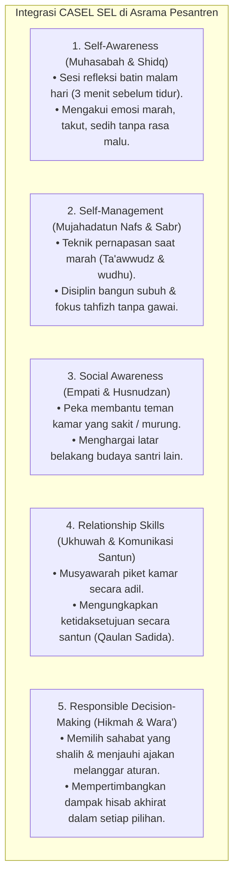

# P2-04-04-Prinsip-Integrasi-CASEL-SEL-dan-Karakter-Islami

## Tujuan
Menetapkan prinsip operasional integrasi 5 Kompetensi Inti **Social-Emotional Learning (CASEL)** ke dalam kurikulum adab dan pembiasaan hidup 24 jam santri, menjadikan keterampilan sosial-emosional sebagai instrumen teknis penopang akhlak Islam di dunia nyata pesantren.

---

## 1. Matriks Operasional 5 Kompetensi CASEL & Praktik Asrama

---

## 2. 3 Aturan Baku Pengajaran SEL di Pesantren TUMBUH

1. **Diajarkan Secara Terstruktur (*Explicit SEL Instruction*)**:
   - Keterampilan regulasi emosi dilatihkan dalam halaqah pekanan dengan studi kasus nyata dilema kehidupan santri di asrama.
2. **Dibiasakan dalam Rutinitas Harian (*Embedded Practice*)**:
   - Membiasakan salam, saling menyapa, dan meminta maaf tulus saat terjadi gesekan antarsantri.
3. **Didukung Teladan Musyrif (*Adult Modeling*)**:
   - Musyrif dan asatidz menunjukkan ketenangan (*Hilm*) dan tidak reaktif membentak santri saat menghadapi situasi tegang.

---

## 3. Status Dokumen
* **Status**: 🌟 **A+ (Tervalidasi & Siap Diimplementasikan)**
* **Level**: Project 2 - `02 Principles / 04 Development Principles`
* **Langkah Berikutnya**: **`P2-04-05-Sintesis-Development-Principles-TUMBUH.md`**.
