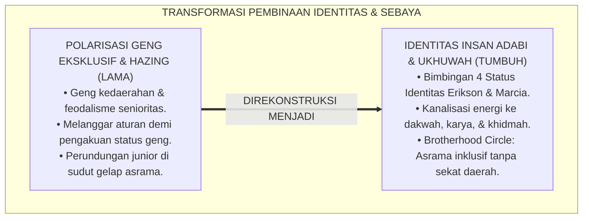
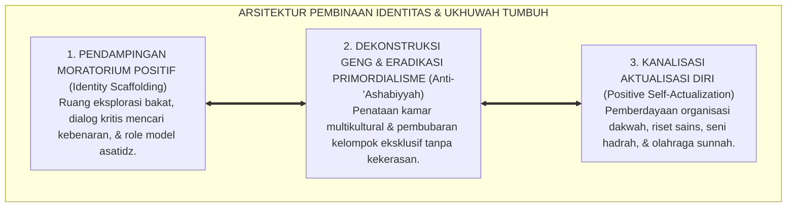
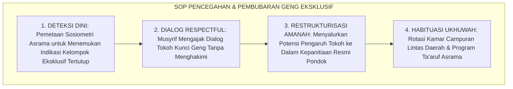
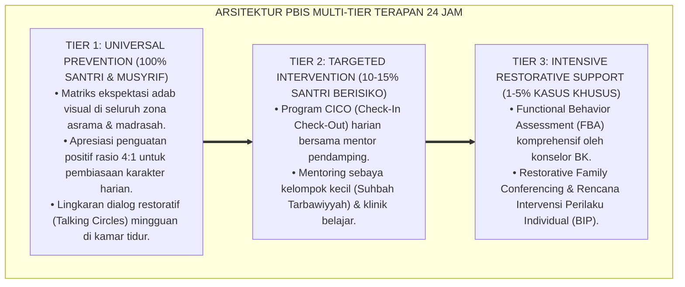

# P2-04-05: PRINSIP NAVIGASI KRISIS IDENTITAS, DINAMIKA SEBAYA, DAN UKHUWAH ASRAMA (IDENTITY NAVIGATION & PEER DYNAMICS)
## *Monograf Riset Akademik: Psikologi Perkembangan Marhalah Asy-Syabab, Identity vs. Role Confusion Erik Erikson & Status Identitas Marcia, Mitigasi Polarisasi Geng Asrama, Serta Rekayasa Iklim Ukhuwah Islamiyyah di Pesantren 24 Jam*

**Nomor Identifikasi**: `P2-04-05/MONOGRAF-RISET-KRISIS-IDENTITAS-SEBAYA/2026`  
**Domain**: `02 Principles` > `04 Development Principles` (Prinsip Perkembangan 05: *Identity Navigation & Peer Dynamics*)  
**Klasifikasi Naskah**: *Academic Research Monograph* (Monograf Riset Akademik Prinsip Perkembangan)  
**Rumpun Disiplin Pengkaji**: Psikologi Perkembangan Remaja Islam (*Adolescent Islamic Psychology*), Sosiologi Interaksi Teman Sebaya (*Peer Group Dynamics*), Teori Identitas Psikososial Erikson & Marcia, Pengasuhan Asrama 24 Jam  

---

> ### 💡 INTISARI EKSEKUTIF (EXECUTIVE SUMMARY)
>
> * **Kelemahan Paradigma Lama: Ancaman Represif atas Krisis Identitas dan Pembiaran Geng Asrama:**  
>   Banyak pengasuh menekan gejolak pencarian jati diri remaja dengan hukuman otoriter tanpa dialog, sementara di bawah permukaan terbentuk polarisasi geng asrama eksklusif berbasis daerah atau angkatan. Geng liar ini kerap melahirkan budaya perundungan (*Bullying*) dan penindasan adik kelas demi pengakuan status sosial (*Peer Status*).
> * **Inovasi Konseptual: Marhalah asy-Syabab & Psychosocial Identity Theory (Erikson & Marcia):**  
>   TUMBUH memadukan kemuliaan pemuda dalam Islam (*Hadits Pemuda Tumbuh dalam Ibadah*, HR. Bukhari No. 660) dengan teori **Krisis Identitas Erik Erikson (*Identity vs. Role Confusion*)** dan **4 Status Identitas James Marcia** (Difusi, Foreclosure, Moratorium, hingga Pencapaian Identitas *Insan Adabi*). Mengkanalisasikan kebutuhan pengakuan sosial remaja ke dalam **Halaqah Ukhuwah Terbuka** dan **Wadah Kepemimpinan Aktualisasi Diri**.
> * **Formulasi Operasional & Pembubaran Geng Eksklusif:**  
>   Monograf ini menguraikan matriks pendampingan 3 tahap krisis identitas santri, SOP pencegahan dan pembubaran geng asrama eksklusif secara damai, protokol rekayasa iklim ukhuwah kamar, dan etika persaudaraan lintas angkatan 24 jam.

---

## 📑 DAFTAR ISI MONOGRAF

- [BAB I: LANDASAN TEORETIS & DISKURSUS KRITIS](#bab-i-landasan-teoretis--diskursus-kritis)
  - [1. Latar Belakang Masalah: Kritik atas Pengekangan Otoriter dan Maraknya Polarisasi Geng Asrama Tersembunyi](#1-latar-belakang-masalah-kritik-atas-pengekangan-otoriter-dan-maraknya-polarisasi-geng-asrama-tersembunyi)
  - [2. Eksegesis Turats Hakikat Pemuda: Marhalah asy-Syabab, Hadits 7 Naungan Allah (HR. Bukhari), & Nasihat Sayyidina Ali](#2-eksegesis-turats-hakikat-pemuda-marhalah-asy-syabab-hadits-7-naungan-allah-hr-bukhari--nasihat-sayyidina-ali)
  - [3. Konvergensi Teori Identitas Psikososial Erik Erikson & Status Identitas James Marcia](#3-konvergensi-teori-identitas-psikososial-erik-erikson--status-identitas-james-marcia)
  - [4. Rekayasa Dinamika Teman Sebaya: Dekonstruksi Geng Eksklusif Menjadi Halaqah Ukhuwah Inklusif](#4-rekayasa-dinamika-teman-sebaya-dekonstruksi-geng-eksklusif-menjadi-halaqah-ukhuwah-inklusif)
  - [5. Kasuistika Lapangan: Kasus Terbentuknya Geng Kamar Eksklusif & Resolusi Kanalisasi Ukhuwah](#5-kasuistika-lapangan-kasus-terbentuknya-geng-kamar-eksklusif--resolusi-kanalisasi-ukhuwah)
- [BAB II: FORMULASI KONSEPTUAL & PEMBAHASAN MENDALAM](#bab-ii-formulasi-konseptual--pembahasan-mendalam)
  - [1. Eksplanasi Teoretis Standar Pembinaan Identitas Remaja & Ukhuwah Ekosistem Pesantren Berbasis TUMBUH](#1-eksplanasi-teoretis-standar-pembinaan-identitas-remaja--ukhuwah-pesantren-tumbuh)
  - [2. Matriks Pendampingan Empat Status Identitas James Marcia Menuju Profil Insan Adabi](#2-matriks-pendampingan-empat-status-identitas-james-marcia-menuju-profil-insan-adabi)
  - [3. Standar Prosedur Operasional (SOP) Pencegahan & Pembubaran Geng Asrama Eksklusif](#3-standar-prosedur-operasional-sop-pencegahan--pembubaran-geng-asrama-eksklusif)
  - [4. Protokol Pendampingan Halaqah Ukhuwah Terpadu (Integrated Brotherhood Circle Protocol)](#4-protokol-pendampingan-halaqah-ukhuwah-terpadu-integrated-brotherhood-circle-protocol)
  - [5. Diskusi Filosofis Mendalam & Implikasi bagi Masa Depan Peradaban Pendidikan Islam](#5-diskusi-filosofis-mendalam--implikasi-bagi-masa-depan-peradaban-pendidikan-islam)
- [BAB III: KESIMPULAN & APARATUS AKADEMIS](#bab-iii-kesimpulan--aparatus-akademis)
  - [1. Tabel Sintesis Temuan Riset Identitas Remaja & Dinamika Sebaya](#1-tabel-sintesis-temuan-riset-identitas-remaja--dinamika-sebaya)
  - [2. Daftar Pustaka Akademis & Rujukan Turats Primer](#2-daftar-pustaka-akademis--rujukan-turats-primer)
  - [3. Catatan Kaki Akademis (Footnotes)](#3-catatan-kaki-akademis-footnotes)
  - [4. Glosarium Istilah Ilmiah & Turats Identitas dan Dinamika Sebaya](#4-glosarium-istilah-ilmiah--turats-identitas-dan-dinamika-sebaya)

---

# BAB I: LANDASAN TEORETIS & DISKURSUS KRITIS

---

### 1. Latar Belakang Masalah: Kritik atas Pengekangan Otoriter dan Maraknya Polarisasi Geng Asrama Tersembunyi

Dalam kehidupan berasrama 24 jam, santri remaja (usia 12–18 tahun) mengalami pergeseran gravitasi psikososial yang sangat kuat:
* **Pengaruh Kelompok Sebaya Mendominasi (*Peer Dominance*)**: Kebutuhan untuk diterima oleh teman sebaya (*Need for Peer Belonging*) menjadi dorongan biologis dan sosial utama.
* **Kelemahan Model Pengasuhan Represif**: Lembaga kerap merespons kenakalan remaja dengan melipatgandakan pengawasan fisik, membentak, dan mengancam dikeluarkan.
* **Munculnya Budaya Geng Bawah Tanah**: Karena hasrat pengakuan diri tidak disalurkan secara sehat, santri membentuk geng-geng eksklusif berbasis daerah asal (*Kedaerahan*) atau senioritas angkatan. Geng ini menerapkan aturan rimba: perpeloncoan junior (*Hazing*), aksi melanggar aturan bersama agar dianggap "pemberani", dan solidaritas buta (*'Ashabiyyah*).
* **Keniscayaan Kanalisasi Identitas Beradab**: Lembaga wajib merancang sistem pendampingan yang membimbing proses pencarian jati diri santri menuju identitas *Insan Adabi* yang kokoh dan berwawasan ukhuwah luas.[^1]

---

### 2. Eksegesis Turats Hakikat Pemuda: Marhalah asy-Syabab, Hadits 7 Naungan Allah (HR. Bukhari), & Nasihat Sayyidina Ali

Turats Islam menempatkan masa muda (*Marhalah asy-Syabab*) sebagai masa keemasan penentu masa depan:
* Rasulullah ﷺ menegaskan kemuliaan pemuda yang mampu menjaga kesucian jati dirinya di tengah badai fitnah:

$$\text{سَبْعَةٌ يُظِلُّهُمُ اللَّهُ فِي ظِلِّهِ... وَشَابٌّ نَشَأَ فِي عِبَادَةِ اللَّهِ}$$

*"**Tujuh golongan yang dinaungi Allah... seorang pemuda yang tumbuh dalam beribadah kepada Allah**."* (HR. Al-Bukhari No. 660).[^2]

Sayyidina Ali bin Abi Thalib RA berwasiat mengenai adab interaksi pemuda:
* *"Perlakukan anakmu sebagai raja di 7 tahun pertama, sebagai tawanan/bawahan yang dibimbing di 7 tahun kedua, dan **Sebagai Sahabat Musyawarah di 7 Tahun Ketiga (Usia 14–21 Tahun)**."*[^3]

---

### 3. Konvergensi Teori Identitas Psikososial Erik Erikson & Status Identitas James Marcia

Sains psikologi perkembangan membuktikan:
* **Erik Erikson (1968)**: Krisis *Identity vs. Role Confusion* menuntut remaja mengintegrasikan nilai-nilai, bakat, dan peran sosialnya agar tidak terombang-ambing (*Role Diffusion*).
* **James Marcia (1980)** memetakan 4 status identitas:
  1. *Identity Diffusion*: Santri bingung dan tidak peduli arah hidupnya.
  2. *Identity Foreclosure*: Santri sekadar ikut-ikutan orang tua tanpa pemahaman batin.
  3. *Identity Moratorium*: Santri aktif bereksplorasi mencari kebenaran dan peran.
  4. *Identity Achievement*: Santri berhasil menemukan jatidiri sebagai **Insan Adabi** yang berilmu dan bertakwa.[^4]

---

### 4. Rekayasa Dinamika Teman Sebaya: Dekonstruksi Geng Eksklusif Menjadi Halaqah Ukhuwah Inklusif

TUMBUH mengharamkan segala bentuk primordialisme geng asrama:
* **Larangan Primordialisme (*Zero 'Ashabiyyah*)**: Dilarang membentuk kelompok eksklusif berbasis bahasa daerah atau asal kota yang memisahkan diri dari jamaah.
* **Brotherhood Circle (Halaqah Ukhuwah)**: Membaurkan santri lintas daerah dalam satu kamar asrama dan memfasilitasi dialog keakraban mingguan yang dipandu musyrif.[^5]

---

### 5. Kasuistika Lapangan: Kasus Terbentuknya Geng Kamar Eksklusif & Resolusi Kanalisasi Ukhuwah

* **Studi Kasus: Munculnya "Geng Pantai" Santri Senior yang Menguasai Lapangan Olahraga dan Mengintimidasi Santri Luar Daerah**  
  * **Dilema**: Santri lain merasa tertekan dan tidak berani memakai fasilitas asrama; jika dibubarkan paksa, anggota geng mengancam akan mogok belajar.
  * **Resolusi Kanalisasi TUMBUH**: Musyrif menerapkan *Restorative Peer Channeling*: (1) Memanggil tokoh kunci geng untuk dialog empat mata (*Respectful Dialogue*); (2) Menantang mereka memimpin Turnamen Olahraga Ukhuwah Resmi Asrama di mana setiap tim wajib terdiri dari campuran lintas daerah (*Diferensiasi Kepemimpinan*); (3) Merotasi penataan kamar secara berkala. Geng liar bertransformasi menjadi panitia keolahragaan resmi yang dihormati seluruh santri.[^6]

---

# BAB II: FORMULASI KONSEPTUAL & PEMBAHASAN MENDALAM

---

### 1. Eksplanasi Teoretis Standar Pembinaan Identitas Remaja & Ukhuwah Ekosistem Pesantren Berbasis TUMBUH

Ekosistem TUMBUH merumuskan pembinaan identitas ke dalam **Arsitektur Tiga Sayap Navigasi Jati Diri (*Arkan Bina' al-Huwiyyah*)**:

#### 🔬 Pembahasan Mendalam Tiga Sayap:
1. **Sayap Moratorium Positif**: Menuntun santri melewati badai keraguan menuju kepastian iman dan cita-cita hidup mulia.[^7]
2. **Sayap Dekonstruksi Geng**: Menghancurkan sekat-sekat kesombongan kedaerahan demi terwujudnya ukhuwah islamiyyah murni.[^8]
3. **Sayap Kanalisasi Aktualisasi Diri**: Menyediakan panggung kehormatan bagi santri untuk berprestasi dan memimpin.[^9]

---

### 2. Matriks Pendampingan Empat Status Identitas James Marcia Menuju Profil Insan Adabi

| Status Identitas Marcia | Kondisi Eksplorasi & Komitmen Santri | Pendekatan Intervensi Musyrif dalam sistem TUMBUH |
| :--- | :--- | :--- |
| **1. Identity Diffusion** | Tidak mengeksplorasi & tidak punya tujuan hidup.| Beri pendampingan bimbingan konseling & temukan minat unik.|
| **2. Identity Foreclosure**| Patuh pasif karena paksaan orang tua tanpa paham.| Ajak dialog tadabbur agar paham makna dan kenikmatan ilmu.|
| **3. Identity Moratorium** | Aktif mencari jati diri, kadang kritis mendebat.| Rangkul dengan dialog hangat, beri ruang kepemimpinan proyek.|
| **4. Identity Achievement**| Memiliki komitmen iman, adab, & cita-cita teguh.| Diberdayakan menjadi Duta Adab (*Peer Role Model*).|

---

### 3. Standar Prosedur Operasional (SOP) Pencegahan & Pembubaran Geng Asrama Eksklusif

---

### 4. Protokol Pendampingan Halaqah Ukhuwah Terpadu (Integrated Brotherhood Circle Protocol)

TUMBUH menetapkan **Protokol Halaqah Ukhuwah Mingguan**:
1. **Duduk Setara Tanpa Sekat**: Seluruh santri kamar duduk melingkar bersama musyrif setiap malam Jumat.
2. **Sesi Apresiasi Terbuka (*Check-In Ukhuwah*)**: Setiap santri menyampaikan 1 terima kasih kepada teman sekamarnya yang telah membantu pekan ini.
3. **Penyelesaian Masalah Kamar (*Problem Solving*)**: Membahas pembagian tugas kebersihan dan jadwal istirahat secara demokratis dan santun.[^10]

---

### 5. Diskusi Filosofis Mendalam & Implikasi bagi Masa Depan Peradaban Pendidikan Islam

Prinsip navigasi krisis identitas dan dinamika sebaya ini membawa implikasi agung bagi peradaban:

* **Melahirkan Generasi Pemuda yang Memiliki Kekuatan Integritas Diri (*Strong Character Identity*)**:  
  Santri tidak mudah terombang-ambing oleh tren budaya negatif dan pergaulan bebas karena telah menemukan jati dirinya sebagai hamba Allah dan pembela risalah Islam.
* **Menghapus Benih Primordialisme dan Perpecahan Umat**:  
  Pesantren menjadi kawah candradimuka peleburan berbagai suku dan bangsa ke dalam ikatan aqidah dan adab yang satu.
* **Mencetak Pelopor Perubahan Sosial yang Berdaya Gerak Tinggi**:  
  Santri terdidik mengorganisir massa dalam kebaikan, memimpin musyawarah, dan merajut harmoni di tengah masyarakat majemuk (*Rahmatan lil 'Alamin*).[^11]

---

---

### Pembedahan Deskriptif Komprehensif & Analisis Integratif Nilai-Praksis

Penerapan konsep **P2-04-05: PRINSIP NAVIGASI KRISIS IDENTITAS, DINAMIKA SEBAYA, DAN UKHUWAH ASRAMA (IDENTITY NAVIGATION & PEER DYNAMICS)** di ekosistem pesantren berbasis sistem TUMBUH memerlukan pemahaman multidimensional yang memadukan khazanah turats syariat dan konsensus sains pendidikan modern:

#### A. Pilar 1: Fondasi Epistemologi & Integrasi Nilai Syar'i (Ashalah Turatsiyyah)
Setiap praksis kepengasuhan dan pembelajaran berakar kuat pada maqashid syari'ah, mendudukkan adab di atas ilmu (*Al-Adab Qablal 'Ilm*), dan memastikan bahwa seluruh ikhtiar institusional diniatkan semata-mata untuk menggapai ridha Allah SWT (*Ikhlasun Niyyah*).

#### B. Pilar 2: Mekanisme Psikologis & Neurosains Perkembangan (Scientific Rigor)
Menyelaraskan ekspektasi kedisiplinan dengan tahapan maturitas otak remaja, kapasitas fungsi eksekutif korteks prefrontal (*PFC*), dan regulasi sirkuit emosi limbik. Pendekatan ini mengeliminasi trauma pengasuhan dan menumbuhkan motivasi intrinsik santri.

#### C. Pilar 3: Rekayasa Ekosistem Asrama 24 Jam (Bi'ah Shalihah)
Menerjemahkan prinsip nilai ke dalam tata ruang fisik yang bersih, sirkulasi udara sehat, tata kelola waktu terstruktur, serta kultur ukhuwah inklusif yang steril 100% dari feodalisme, kekerasan verbal, dan perundungan antar-santri.

#### D. Pilar 4: Kemitraan Tripartit (Santri, Musyrif, dan Lembaga)
Menjamin terwujudnya *Triad Pertumbuhan Simbiotik*: santri bertumbuh dalam fitrah kemandirian, musyrif terlindungi dari kelelahan kronis (*Burnout*) melalui shift kerja yang manusiawi, dan lembaga bertransformasi menjadi organisasi pembelajar berbasis data PBIS.

---

### Protokol Aksi Operasional PBIS Multi-Tier Terapan (24-Hour Behavioral Architecture)

---

# BAB III: KESIMPULAN & APARATUS AKADEMIS

---

### 1. Tabel Sintesis Temuan Riset Identitas Remaja & Dinamika Sebaya

| Dimensi Parameter | Mazhab Represif Otoriter (Lama) | Model Kebebasan Permisif Barat | **Navigasi Identitas TUMBUH** | Landasan Rujukan Primer | Implikasi Praksis Lapangan |
| :--- | :--- | :--- | :--- | :--- | :--- |
| **Pandangan Krisis**| Kenakalan yang harus dihukum keras.| Eksplorasi liar tanpa batasan norma.| **Fase Kritis Menuju Identitas Insan Adabi.**| Erikson (1968); Marcia (1980).| Bimbingan dialogis & wadah aktualisasi. |
| **Kelompok Sebaya** | Geng eksklusif & senioritas hazing.| Peer pressure tak terkendali.| **Brotherhood Circle (Halaqah Ukhuwah).** | QS. Al-Hujurat: 10; Sayyidina Ali.| Kamar multikultural & tolong menolong. |
| **Peran Pengasuh** | Algojo pengawas yang menjaga jarak.| Pengamat netral yang lepas tangan.| **Sahabat Musyawarah & Pemandu Visi.** | HR. Bukhari No. 660; Bandura.| Menjadi mentor teladan di usia remaja. |
| **Penanganan Geng** | Hukuman skorsing / pengusiran massal.| Pembiaran asalkan tidak berkelahi.| **Dialog Empatik & Kanalisasi Kepemimpinan.**| Zehr (2002); PBIS Tier 2.| Restrukturisasi peran ke kepanitiaan resmi. |
| **Hasil Institusi** | Santri munafik & berjiwa kerdil.| Identitas kabur & kehilangan arah.| **Pemuda Berkarakter Kokoh & Berwawasan.** | QS. Yusuf: 22; Al-Attas (1980).| Ksatria dakwah pemersatu peradaban. |

---

### 2. Daftar Pustaka Akademis & Rujukan Turats Primer

1. **Al-Qur'an al-Karim wa Tarjamatu Ma'anihi**.
2. **Al-Bukhari, Abu Abdillah Muhammad bin Isma'il**. (1422 H). *Shahih al-Bukhari*. Kairo: Dar Thawq an-Najah.
3. **Muslim bin al-Hajjaj an-Naisaburi**. (1427 H). *Shahih Muslim*. Riyadh: Dar Thayyibah.
4. **Ibnu Qayyim Al-Jauziyyah, Syamsuddin Muhammad bin Abi Bakr**. (1414 H). *Tuhfat al-Mawdud bi Ahkam al-Mawlud*. Beirut: Dar al-Kutub al-'Ilmiyyah.
5. **Al-Ghazali, Abu Hamid Muhammad bin Muhammad**. (2011). *Ihya' 'Ulumiddin* (Kitab Adab al-Ulfah wal-Ukhuwwah). Beirut: Dar al-Ma'rifah.
6. **Asy'ari, Muhammad Hasyim**. (1415 H). *Adab al-'Alim wal-Muta'allim*. Jombang: Maktabah At-Turats Al-Islami.
7. **Al-Attas, Syed Muhammad Naquib**. (1980). *The Concept of Education in Islam*. Kuala Lumpur: ABIM.
8. **Erikson, E. H.**. (1968). *Identity: Youth and Crisis*. New York: W. W. Norton & Company.
9. **Marcia, J. E.**. (1980). *Identity in adolescence*. Handbook of Adolescent Psychology, 9(11), 159–187.
10. **Brown, B. B., & Larson, J.**. (2009). *Peer relationships in adolescence*. Handbook of Adolescent Psychology, 2, 74–103.
11. **Zehr, H.**. (2002). *The Little Book of Restorative Justice*. Intercourse: Good Books.
12. **Horner, R. H., & Sugai, G.**. (2015). *School-wide PBIS: An Overview of the Research Base*. Remedial and Special Education, 36(2), 80–85.

---

### 3. Catatan Kaki Akademis (*Footnotes*)

[^1]: Riset Prinsip Navigasi Krisis Identitas dan Dinamika Sebaya TUMBUH, *Kritik atas Pengekangan Otoriter*, 2026.  
[^2]: *Shahih al-Bukhari*, Kitab al-Adzan, Hadits No. 660.  
[^3]: Atsar Sayyidina Ali bin Abi Thalib RA mengenai Pembagian Tiga Fase 7 Tahun Pengasuhan Anak.  
[^4]: Erikson, E. H. (1968), *Identity: Youth and Crisis*, hlm. 128–185; Marcia, J. E. (1980), *Handbook of Adolescent Psychology*, hlm. 159–187.  
[^5]: Brown, B. B., & Larson, J. (2009), *Peer Relationships in Adolescence*, hlm. 74–103.  
[^6]: Dokumentasi Resolusi Polarisasi Geng Asrama dan Kanalisasi Kepemimpinan PBIS TUMBUH, 2026.  
[^7]: Master Blueprint Navigasi Moratorium Positif Santri Remaja TUMBUH, 2026.  
[^8]: Kebijakan Pengharaman Primordialisme Geng dan 'Ashabiyyah Asrama TUMBUH, 2026.  
[^9]: Standar Operasional Prosedur Wadah Aktualisasi Minat dan Kepemimpinan Santri dalam sistem TUMBUH, 2026.  
[^10]: Master Guidelines Brotherhood Circle dan Halaqah Ukhuwah Asrama TUMBUH, 2026.  
[^11]: Deklarasi Pemuliaan Pembentukan Identitas Pemuda Islam Dewan Riset Epistemologi Ekosistem TUMBUH, 2026.

---

### 4. Glosarium Istilah Ilmiah & Turats Identitas dan Dinamika Sebaya

1. **Identity vs. Role Confusion**: Tahap perkembangan psikososial remaja menurut Erik Erikson di mana individu bergulat menemukan perannya di tengah masyarakat.
2. **Identity Achievement**: Status identitas tertinggi menurut James Marcia di mana santri telah mengeksplorasi nilai-nilai secara matang dan memiliki komitmen kokoh pada jalan *Insan Adabi*.
3. **Marhalah asy-Syabab (مَرْحَلَةُ الشَّبَابِ)**: Masa kepemudaan dalam pandangan Islam yang dipenuhi dengan kekuatan fisik, gairah berpikir, dan potensi kepeloporan dakwah.
4. **Peer Dominance**: Fenomena sosiopsikologis di mana pengaruh teman sebaya menjadi faktor dominan dalam pembentukan perilaku dan keputusan remaja.
5. **Brotherhood Circle (Halaqah Ukhuwah)**: Forum silaturahmi kamar mingguan yang dipandu musyrif untuk mempererat persaudaraan dan menyelesaikan masalah secara damai.
6. **'Ashabiyyah (الْعَصَبِيَّةُ)**: Fanatisme golongan atau kedaerahan sempit yang diharamkan mutlak dalam ajaran Islam dan tata tertib pesantren.
7. **Negative Peer Pressure**: Tekanan sosial dari kelompok sebaya yang mendorong individu melanggar aturan moral atau tata tertib lembaga demi pengakuan status.
8. **Restorative Peer Channeling**: Metode pengasuhan yang mengubah energi kelompok sebaya negatif menjadi kepanitiaan program positif resmi lembaga.
9. **Sosiometri Asrama**: Alat asesmen pemetaan jejaring relasi sosial dan popularitas antarsantri di dalam lingkungan asrama.
10. **Insan Adabi (الإِنْسَانُ الأَدَبِيُّ)**: Profil pemuda muslim yang memiliki kematangan jati diri, terbebas dari fanatisme sempit, cinta persaudaraan, dan berdedikasi membangun kemaslahatan umat.
