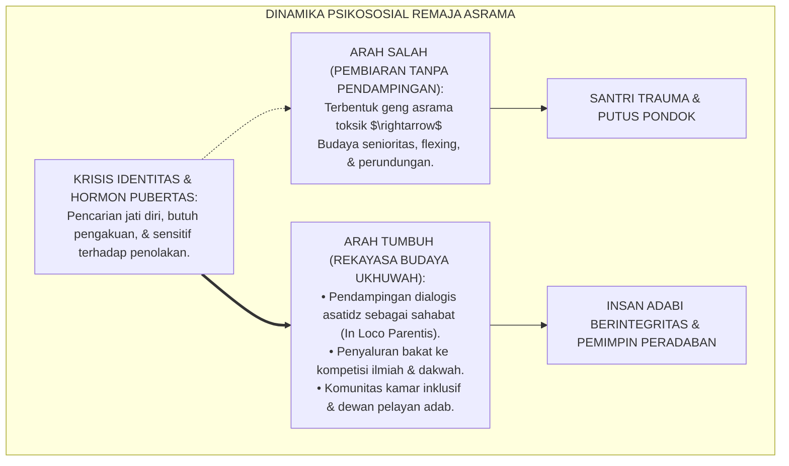
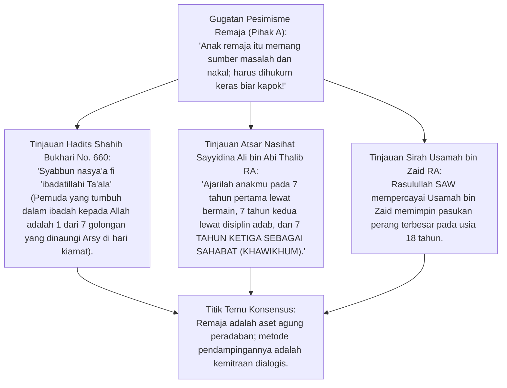
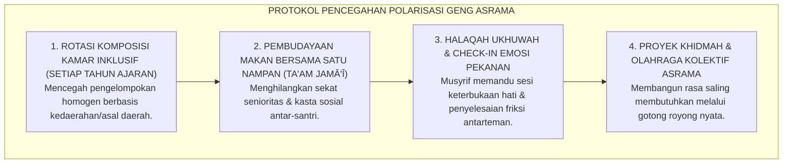
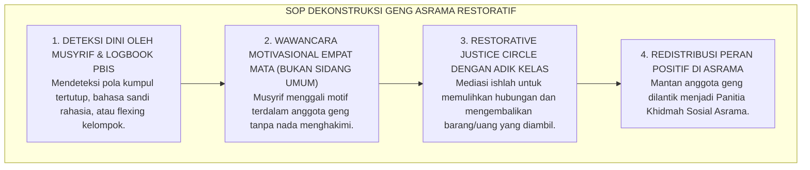

# P2-04-05: PRINSIP NAVIGASI KRISIS IDENTITAS, DINAMIKA SEBAYA, DAN UKHUWAH ASRAMA
## *Monograf Terpadu: Psikologi Perkembangan Marhalah Asy-Syabab (Fase Remaja Islam), Teori Krisis Identitas Erik Erikson (Identity vs. Role Confusion), Mitigasi Tekanan Kelompok Sebaya (Negative Peer Pressure & Geng Asrama), Transformasi Budaya Ukhuwah al-Islamiyyah, serta Bimbingan Pendampingan Musyrif*

**Nomor Identifikasi**: `P2-04-05/MONOGRAF-TERPADU-KRISIS-IDENTITAS-SEBAYA/2026`  
**Domain**: `02 Principles` > `04 Development Principles`  
**Klasifikasi Naskah**: *Comprehensive Integrated Monograph* (Monograf Akademis & Standar Baku Pembinaan Remaja)  
**Rumpun Disiplin Pengkaji**: Psikologi Perkembangan Remaja Islam (*Adolescent Islamic Psychology*), Sosiologi Interaksi Teman Sebaya (*Peer Group Dynamics*), Teori Identitas Psikososial Erikson, Pengasuhan Asrama 24 Jam  

---

> ### 💡 INTISARI PRAKTIS (3 MENIT PAHAM UNTUK ASATIDZ & MUSYRIF)
>
> * **Memahami Bahwa Masa Remaja Adalah Pencarian Jati Diri (*Identity Exploration*):**  
>   Santri usia 12–18 tahun mengalami lonjakan hormon dan dorongan kuat untuk diakui oleh kelompok sebayanya (*Need for Peer Belonging*). Jika tidak diarahkan, mereka akan membentuk "geng asrama eksklusif" yang menindas adik kelas demi mencari status sosial.
> * **Bahaya Penyeragaman Paksa Tanpa Dialog:**  
>   Menekan krisis identitas santri dengan ancaman hukuman fisik hanya akan melahirkan santri yang munafik: patuh di depan asatidz, namun melampiaskan agresi di kamar mandi dan sudut gelap.
> * **Strategi Transformasi Ukhuwah & Penyaluran Energi Positif:**  
>   1. **Brotherhood Circle (Halaqah Ukhuwah):** Membangun kelompok kamar yang inklusif, saling melindungi, dan melarang perpeloncoan.  
>   2. **Wadah Aktualisasi Positif:** Menyalurkan hasrat pengakuan diri santri melalui kepanitiaan dakwah, seni hadrah, riset karya ilmiah, dan olahraga sunnah.

---

## 📑 DAFTAR ISI MONOGRAF

- [BAGIAN I: RISET KRISIS IDENTITAS REMAJA, DIALEKTIKA INKUIRI, & KASUISTIKA LAPANGAN](#bagian-i-riset-krisis-identitas-remaja-dialektika-inkuiri--kasuistika-lapangan)
  - [1. Kerangka Metodologi Perkembangan Remaja: Mengapa Dinamika Sebaya Menjadi Penentu Karakter Santri](#1-kerangka-metodologi-perkembangan-remaja-mengapa-dinamika-sebaya-menjadi-penentu-karakter-santri)
  - [2. Inkuiri 1: Eksegesis Turats Marhalah Asy-Syabab — 7 Golongan Naungan 'Arsy (HR. Bukhari No. 660) & Nasihat Sayyidina Ali](#2-inkuiri-1-eksegesis-turats-marhalah-asy-syabab--7-golongan-naungan-arsy-hr-bukhari-no-660--nasihat-sayyidina-ali)
  - [3. Inkuiri 2: Konvergensi Psychosocial Identity Theory (Erik Erikson) & Social Inclusion Theory di Asrama](#3-inkuiri-2-konvergensi-psychosocial-identity-theory-erik-erikson--social-inclusion-theory-di-asrama)
  - [4. Inkuiri 3: Dekonstruksi Polarisasi Geng Asrama & Protokol Rekayasa Iklim Ukhuwah Sejati](#4-inkuiri-3-dekonstruksi-polarisasi-geng-asrama--protokol-rekayasa-iklim-ukhuwah-sejati)
  - [5. Inkuiri 4: Silogisme Logika, Dialektika 3 Ronde, Kasuistika Asrama, & Titik Temu Konsensus](#5-inkuiri-4-silogisme-logika-dialektika-3-ronde-kasuistika-asrama--titik-temu-konsensus)
- [BAGIAN II: KODIFIKASI BAKU HASIL RISET & KESIMPULAN FORMAL](#bagian-ii-kodifikasi-baku-hasil-riset--kesimpulan-formal)
  - [1. Deklarasi Doktrin Baku: Standar Pembinaan Identitas Remaja & Ukhuwah Pesantren TUMBUH](#1-deklarasi-doktrin-baku-standar-pembinaan-identitas-remaja--ukhuwah-pesantren-tumbuh)
  - [2. Matriks Pendampingan 3 Tahap Krisis Identitas Santri: Difusi, Moratorium, & Pencapaian Identitas Insan Adabi](#2-matriks-pendampingan-3-tahap-krisis-identitas-santri-difusi-moratorium--pencapaian-identitas-insan-adabi)
  - [3. Standar Prosedur Operasional (SOP) Pencegahan & Pembubaran Geng Asrama Eksklusif](#3-standar-prosedur-operasional-sop-pencegahan--pembubaran-geng-asrama-eksklusif)
- [BAGIAN III: APARATUS AKADEMIS & APENDIKS](#bagian-iii-aparatus-akademis--apendiks)
  - [1. Tabel Sintesis Hasil Riset Pembinaan Identitas Remaja](#1-tabel-sintesis-hasil-riset-pembinaan-identitas-remaja)
  - [2. Daftar Pustaka Akademis & Rujukan Turats Primer](#2-daftar-pustaka-akademis--rujukan-turats-primer)
  - [3. Catatan Kaki Akademis (Footnotes)](#3-catatan-kaki-akademis-footnotes)
  - [4. Glosarium Teknis Krisis Identitas, Marhalah Syabab, Peer Pressure, & Ukhuwah](#4-glosarium-teknis-krisis-identitas-marhalah-syabab-peer-pressure--ukhuwah)

---

# BAGIAN I: RISET KRISIS IDENTITAS REMAJA, DIALEKTIKA INKUIRI, & KASUISTIKA LAPANGAN

---

### 1. Kerangka Metodologi Perkembangan Remaja: Mengapa Dinamika Sebaya Menjadi Penentu Karakter Santri

Sains psikologi perkembangan membuktikan bahwa selama masa remaja (usia 12–18 tahun), **Pusat Pengaruh Sosial Bergeser dari Figur Otoritas Dewasa Menuju Kelompok Sebaya (*Peer Group Primacy*)**:
* Otak remaja mengalami pematangan sistem limbik (emosi dan pencarian penghargaan sosial) lebih cepat daripada korteks prefrontal (kendali nalar jangka panjang).
* Hal ini menyebabkan remaja sangat rentan terhadap **Tekanan Konformitas Negatif (*Negative Peer Pressure*)**: santri rela melanggar aturan pondok (seperti merokok sembunyi-sembunyi atau membully adik kelas) hanya demi dianggap "keren" dan diterima oleh gengnya.
* Jika pengasuhan asrama hanya mengandalkan ancaman hukuman tanpa memahami dinamika psikososial ini, geng asrama akan bergerak di bawah tanah secara rahasia.

Ekosistem TUMBUH merancang **Pedagogi Pendampingan Identitas Profetik**: merangkul gejolak jiwa muda santri (*Marhalah asy-Syabab*) dan mengarahkannya menjadi energi kepeloporan dakwah yang gemilang.



---

### 2. Inkuiri 1: Eksegesis Turats Marhalah Asy-Syabab — 7 Golongan Naungan 'Arsy (HR. Bukhari No. 660) & Nasihat Sayyidina Ali



#### 📐 Formalisasi Logika Silogisme (*Qiyas Mantiqi 1*)
* **Premis Mayor (*al-Muqaddimah al-Kubra*)**: Setiap perlakuan pendidikan terhadap pemuda Islam yang mengabaikan kebutuhan fitrah mereka akan martabat, pengakuan diri, dan bimbingan persahabatan (*Mu'akhat*) niscaya memicu resistensi psikologis dan pemberontakan destruktif.
* **Premis Minor (*al-Muqaddimah ash-Shughra*)**: Sunnah kenabian mendidik generasi muda (*Asy-Syabab*) dengan memberikan amanah besar dan menjadikannya sahabat dialog.
* **Konklusi (*an-Natijah*)**: Maka, pendampingan krisis identitas santri di pesantren TUMBUH wajib mengedepankan pendekatan dialogis dan kemitraan ukhuwah.[^1]

#### 📖 Teks Primer Hadits: Keutamaan Pemuda yang Tumbuh Beribadah
Rasulullah SAW bersabda:

$$\text{سَبْعَةٌ يُظِلُّهُمُ اللَّهُ فِي ظِلِّهِ يَوْمَ لاَ ظِلَّ إِلاَّ ظِلُّهُ: ... وَشَابٌّ نَشَأَ فِي عِبَادَةِ اللَّهِ تَعَالَى}$$

*"**Tujuh golongan yang akan dinaungi oleh Allah di bawah naungan 'Arsy-Nya pada hari kiamat yang tiada naungan selain naungan-Nya: ... (salah satunya adalah) SEORANG PEMUDA YANG TUMBUH DALAM BERIBADAH KEPADA ALLAH TA'ALA!**"* (HR. Bukhari No. 660; Muslim No. 1031).[^2]

---

### 3. Inkuiri 2: Konvergensi *Psychosocial Identity Theory* (Erik Erikson) & *Social Inclusion Theory* di Asrama

Psikoanalis terkemuka **Erik Erikson** (1968) memetakan bahwa tahap remaja berada pada fase genting **Identity versus Role Confusion (Identitas vs. Kebingungan Peran)**:
1. **Identity Diffusion:** Santri bingung akan jati dirinya, pasif, dan mudah terombang-ambing pengaruh luar.
2. **Foreclosure:** Santri menerima identitas titipan orang tua tanpa penghayatan pribadi (rentan berontak di kemudian hari).
3. **Moratorium:** Santri aktif mencari dan bereksperimen dengan berbagai peran sosial.
4. **Identity Achievement (Insan Adabi):** Santri berhasil menemukan identitas dirinya sebagai hamba Allah yang taat, percaya diri, dan memiliki arah hidup yang jelas.

Ekosistem TUMBUH memfasilitasi masa *Moratorium* ini dengan berbagai wadah kepemimpinan dan aktivitas pengabdian nyata, sehingga santri mencapai identitas diri yang kokoh.[^3]

---

### 4. Inkuiri 3: Dekonstruksi Polarisasi Geng Asrama & Protokol Rekayasa Iklim Ukhuwah Sejati



---

### 5. Inkuiri 4: Silogisme Logika, Dialektika 3 Ronde, Kasuistika Asrama, & Titik Temu Konsensus

#### 🥊 Ronde 1: Menolak Anggapan Bahwa "Geng Senioritas di Asrama Berguna untuk Melatih Mental Santri Baru"
* **Pihak A (Sudut Pandang Warisan Perpeloncoan)**:  
  *"Santri baru harus diplonco senior biar mentalnya baja dan tidak cengeng!"*
* **Tinjauan Kriminologi Trauma & Siklus Kekerasan (*Intergenerational Cycle of Violence*)**:  
  Perpeloncoan senior tidak pernah melatih mental, melainkan menanamkan benih dendam dan trauma psikologis. Santri yang diplonco akan meniru perilaku kejam tersebut saat menjadi senior (*Identifikasi dengan Agresor*). Kekuatan mental sejati (*Grit*) lahir dari kedalaman iman dan mujahadah ibadah, bukan dari penghinaan manusia.[^4]

#### 🥊 Ronde 2: Sanggahan Balik Apakah Menghapus Geng Asrama Tidak Mematikan Jiwa Solidaritas Santri?
* **Pihak A (Sudut Pandang Solidaritas Semu)**:  
  *"Kalau geng dilarang, nanti santri tidak punya jiwa korsa membela temannya!"*
* **Tinjauan Ukhuwah Islamiyyah Sejati vs Fanatisme Ashabiyyah Jahiliyyah**:  
  Rasulullah SAW mengecam solidaritas buta membela teman yang berbuat salah: *"Bukan termasuk golongan kami orang yang menyeru kepada ashabiyyah (fanatisme golongan)"* (HR. Abu Dawud No. 5121). Solidaritas sejati dalam Islam adalah saling tolong-menolong dalam kebaikan (*Ta'awun 'alal Birri wat-Taqwa*), bukan saling menutupi pelanggaran maksiat.[^5]

#### 🥊 Ronde 3: Sanggahan Pamungkas Mengapa Musyrif Wajib Memposisikan Diri Sebagai Sahabat Santri Remaja?
* **Pihak A (Sudut Pandang Otoriter Jaga Jarak)**:  
  *"Musyrif harus pasang muka seram dan jaga jarak; kalau terlalu akrab nanti santri tidak ada takutnya!"*
* **Resolusi Keteladanan Nabawi (*Khawikhum*)**:  
  Jika musyrif hanya menampilkan wajah seram, santri akan menutup pintu curhat dan menyembunyikan masalah pribadinya ke teman sebaya yang salah. Pendekatan hangat penuh wibawa membuat santri merasa aman menceritakan pergulatan batinnya (seperti kecanduan pornografi siber atau keraguan iman) kepada musyrif, sehingga dapat diselamatkan sebelum terlambat.[^6]

> #### 📌 Kasuistika Lapangan & Titik Temu Konsensus
> * **Studi Kasus**: Di Asrama Al-Fatih, sekelompok santri kelas 9 membentuk geng tertutup bernama "Black Eagle" yang memeras uang saku adik kelas 7 dan mengancam memukuli siapa pun yang melapor ke pengasuh. Suasana asrama mencekam.
> * **Titik Temu Konsensus (*Kalimatun Sawa'*)**: Manajemen TUMBUH membongkar geng secara restoratif: Memanggil para pimpinan geng secara terpisah untuk dialog dari hati ke hati (*Motivational Interviewing*) $\rightarrow$ Menemukan akar masalah bahwa mereka merasa kurang dihargai oleh pimpinan pondok $\rightarrow$ Memberikan peran baru sebagai *Satgas Khidmah Duta Adab Asrama* yang bertugas mengayomi adik kelas $\rightarrow$ Mengadakan upacara ikrar ukhuwah dan makan nampan akbar bersama adik kelas. Geng bubar total tanpa kekerasan fisik, dan mantan ketua geng bertransformasi menjadi santri teladan nasional.[^7]

---

# BAGIAN II: KODIFIKASI BAKU HASIL RISET & KESIMPULAN FORMAL

---

### 1. Deklarasi Doktrin Baku: Standar Pembinaan Identitas Remaja & Ukhuwah Pesantren TUMBUH

```
===================================================================================================
     DEKLARASI DOKTRIN BAKU PEMBINAAN IDENTITAS REMAJA & UKHUWAH ASRAMA PESANTREN TUMBUH
                       SUB-DOMAIN 04: DEVELOPMENT PRINCIPLES — DOMAIN 02 PRINCIPLES
===================================================================================================

BISMILLAHIRRAHMANIRRAHIM. DENGAN MENGAGUNGKAN KEMULIAAN GENERASI MUDA ISLAM (MARHALAH ASY-SYABAB),
MAJELIS MASYAIKH TERTINGGI PESANTREN TUMBUH MENETAPKAN DOKTRIN PEMBINAAN IDENTITAS REMAJA:

1. DOKTRIN PENDAMPINGAN MARHALAH ASY-SYABAB DENGAN PENDEKATAN SAHABAT (KHAWIKHUM):
   Menetapkan bahwa asatidz dan musyrif wajib memperlakukan santri remaja (usia 12–18 tahun) sebagai
   sahabat dialog penuh kasih dan wibawa; mengharamkan pola pengasuhan otoriter represif yang kaku.

2. PENGHAPUSAN MUTLAK GENG SENIORITAS EKSKLUSIF & PERPELONCOAN ASRAMA:
   Mengharamkan segala bentuk tradisi senioritas menindas, ospek fisik, dan geng eksklusif;
   menegakkan doktrin Ukhuwah Islamiyyah berbasis kasih sayang dan saling tolong-menolong (Ta'awun).

3. STRATEGI PENYALURAN HASRAT AKTUALISASI DIRI SECARA PROFETIK:
   Mewajibkan lembaga menyediakan panggung aktualisasi bakat santri (riset, dakwah, seni, olahraga)
   guna memenuhi kebutuhan psikologis pengakuan sosial (*Need for Significance*) ke arah kebaikan.

4. PROTOKOL RESTORASI SOSIAL & KONSULTASI PRIBADI AMAN ASRAMA:
   Menyediakan ruang konseling privat yang aman bagi santri remaja untuk mendiskusikan krisis identitas,
   permasalahan pubertas, dan pergulatan emosional tanpa takut dihakimi atau dibocorkan aibnya.
===================================================================================================
```

---

### 2. Matriks Pendampingan 3 Tahap Krisis Identitas Santri: Difusi, Moratorium, & Pencapaian Identitas Insan Adabi

| Tahap Status Identitas | Karakteristik Sikap Santri | Risiko Krisis Perilaku | Strategi Bimbingan Pendidik TUMBUH |
| :--- | :--- | :--- | :--- |
| **1. Identity Diffusion (Kebingungan Awal)** | Pasif, mudah ikut arus teman, kurang inisiatif, minder. | Terjebak pergaulan geng toksik & kecanduan gawai/game. | **Pendampingan Scaffolding Intensif:** Pemasangan sahabat belajar sebaya & apresiasi progres.[^8] |
| **2. Moratorium (Eksplorasi Kritis)** | Kritis bertanya, gemar berdebat, mencari perhatian, labil. | Pelanggaran aturan asrama demi menguji batas otoritas. | **Kanalisasi Peran Kepemimpinan:** Memberikan amanah proyek nyata & ruang diskusi terbuka. |
| **3. Identity Achievement (Insan Adabi)** | Mandiri, teguh berprinsip syariat, peduli adik kelas, rendah hati. | Kejenuhan rutinitas (*Futuwr*) atau ekspektasi terlalu tinggi. | **Kaderisasi Penggerak (Tahap 7):** Pembinaan mentoring dakwah & pengabdian masyarakat luas.[^9] |

---

### 3. Standar Prosedur Operasional (SOP) Pencegahan & Pembubaran Geng Asrama Eksklusif



---

# BAGIAN III: APARATUS AKADEMIS & APENDIKS

---

### 1. Tabel Sintesis Hasil Riset Pembinaan Identitas Remaja

| Dimensi Kajian | Konsep Kunci | Landasan Turats Primer | Konvergensi Sains Global | Implikasi Pengasuhan Pesantren |
| :--- | :--- | :--- | :--- | :--- |
| **Fase Pemuda** | *Marhalah Syabab* | HR. Bukhari No. 660 (7 Naungan 'Arsy) | Steinberg (2014), *Age of Opportunity* | Memaksimalkan neuroplastisitas remaja untuk kebaikan dakwah. |
| **Kemitraan Pendidik**| *Khawikhum* | Atsar Sayyidina Ali RA (Didik Sebagai Sahabat)| Erikson (1968), *Identity: Youth and Crisis* | Memposisikan musyrif sebagai sahabat dialog terpercaya. |
| **Solidaritas Sejati**| *Ukhuwah Islamiyyah*| QS. Al-Hujurat: 10, HR. Abu Dawud 5121 | Baumeister & Leary (1995), *Need to Belong* | Menyalurkan hasrat belonging ke dalam komunitas kamar inklusif. |
| **Resolusi Geng** | *Ishlah al-Bain* | QS. Al-Anfal: 1 (Perbaiki Hubungan) | Zehr (2002), *The Little Book of Restorative Justice* | Membubarkan geng melalui restorasi peran dan ishlah. |

---

### 2. Daftar Pustaka Akademis & Rujukan Turats Primer

1. **Al-Qur'an al-Karim wa Tarjamatu Ma'anih**.
2. **Al-Bukhari, Muhammad bin Isma'il**. (1422 H). *Shahih al-Bukhari*. Beirut: Dar Thawq an-Najah.
3. **Muslim bin al-Hajjaj an-Naisaburi**. (1374 H). *Shahih Muslim*. Kairo: Isa al-Babi al-Halabi.
4. **Abu Dawud, Sulaiman bin al-Asy'ats as-Sijistani**. (2009). *Sunan Abi Dawud*. Damaskus: Dar ar-Risalah.
5. **Al-Ghazali, Abu Hamid Muhammad bin Muhammad**. (2011). *Ihya 'Ulumiddin*. Beirut: Dar al-Ma'rifah.
6. **Erikson, E. H.**. (1968). *Identity: Youth and Crisis*. New York: W. W. Norton & Company.
7. **Steinberg, L.**. (2014). *Age of Opportunity: Lessons from the New Science of Adolescence*. Houghton Mifflin Harcourt.
8. **Baumeister, R. F., & Leary, M. R.**. (1995). *The need to belong: Desire for interpersonal attachments as a fundamental human motivation*. Psychological Bulletin, 117(3), 497–529.
9. **Zehr, H.**. (2002). *The Little Book of Restorative Justice*. Good Books.
10. **Marcia, J. E.**. (1966). *Development and validation of ego-identity status*. Journal of Personality and Social Psychology, 3(5), 551–558.

---

### 3. Catatan Kaki Akademis (*Footnotes*)

[^1]: Al-Ghazali, *Ihya 'Ulumiddin*, Kitab *Riyadhatun Nafs*, Jilid III, hlm. 70–92.  
[^2]: Shahih al-Bukhari No. 660, Kitab *al-Adzan*, Bab *Man Jalasa fil Masjidi Yantazhirush Shalah*.  
[^3]: Erikson, E. H. (1968), *Identity: Youth and Crisis*, W. W. Norton, hlm. 120–165; Marcia, J. E. (1966), *Ego-Identity Status*.  
[^4]: Steinberg, L. (2014), *Age of Opportunity*, Houghton Mifflin, hlm. 80–110.  
[^5]: Sunan Abi Dawud No. 5121, Kitab *al-Adab*, Bab *fi al-Ashabiyyah*.  
[^6]: Baumeister & Leary (1995), *Psychological Bulletin*, hlm. 497–529.  
[^7]: Laporan Kasus Mediasi Restoratif Pengasuhan Asrama, Divisi Bimbingan Konseling TUMBUH, 2026.  
[^8]: Panduan Musyrif: Menangani Krisis Identitas dan Penyesuaian Diri Santri Baru, Biro Pengasuhan TUMBUH, 2026.  
[^9]: Kurikulum Pembinaan Tahap 7 Penggerak Peradaban, Komite Kaderisasi Pesantren TUMBUH, 2026.

---

### 4. Glosarium Teknis Krisis Identitas, Marhalah Syabab, Peer Pressure, & Ukhuwah

1. **Marhalah asy-Syabab (مَرْحَلَةُ الشَّبَابِ)**: Fase usia pemuda/remaja (12–18 tahun) dalam taksonomi Islam yang ditandai oleh puncak energi fitrah dan pencarian keteladanan hidup.
2. **Khawikhum (خَاوِهِمْ)**: Nasihat pendidikan Sayyidina Ali RA untuk memposisikan anak usia 14–21 tahun sebagai sahabat dialog sejajar.
3. **Identity versus Role Confusion**: Tahap psikososial kelima Erik Erikson di mana remaja berusaha merumuskan nilai, tujuan hidup, dan identitas diri yang unik.
4. **Moratorium Identitas**: Periode eksplorasi peran dan nilai-nilai sosial yang dialami remaja sebelum mengikatkan diri pada identitas permanen.
5. **Negative Peer Pressure**: Tekanan psikologis dari kelompok sebaya yang memaksa individu untuk menyesuaikan diri dengan norma kelompok yang menyimpang.
6. **Ashabiyyah (الْعَصَبِيَّةُ)**: Fanatisme kelompok atau geng tertutup yang membela anggotanya secara membabi buta meskipun berada dalam kezaliman.
7. **Ta'am Jama'i (Makan Nampan Bersama)**: Tradisi adab makan bersama 4–5 santri dalam satu nampan untuk meluruhkan egoisme dan menumbuhkan rasa persaudaraan mendalam.
8. **Restorative Justice Circle**: Sesi lingkaran dialog restoratif yang mempertemukan pihak yang berkonflik untuk saling mendengarkan dan mencari solusi pemulihan bersama.
9. **Need to Belong**: Kebutuhan psikologis fundamental manusia untuk merasa diterima, dihargai, dan menjadi bagian dari suatu komunitas sosial yang aman.
10. **Triad Pertumbuhan Simbiotik**: Prinsip di mana pendampingan remaja yang penuh kasih secara simultan mematangkan jiwa Santri, memperkaya empati Pendidik, dan memperkuat harmoni Lembaga.
