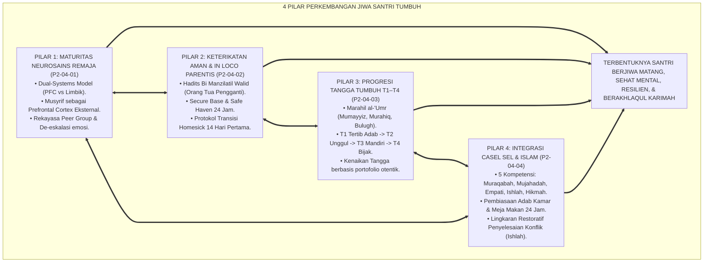
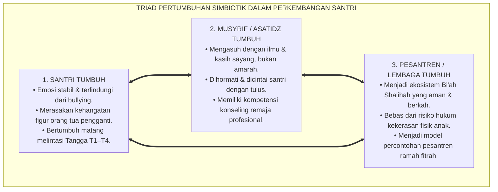
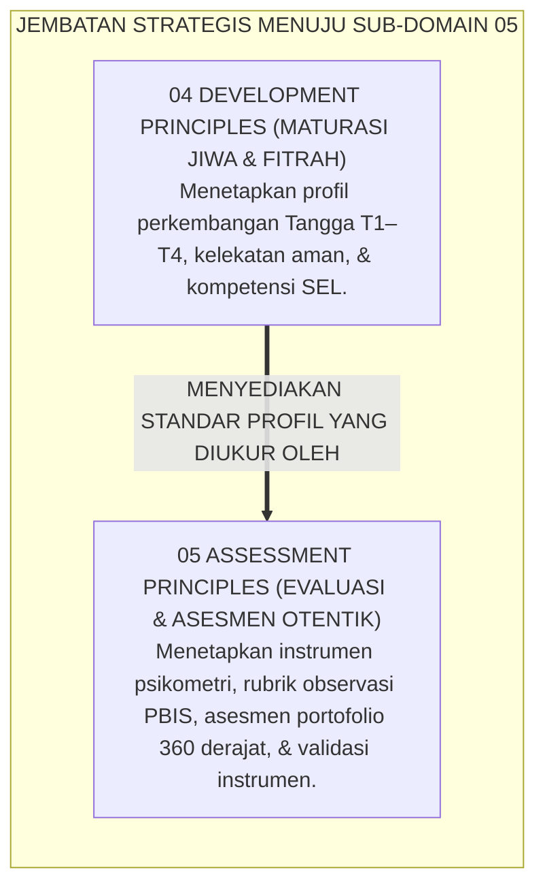
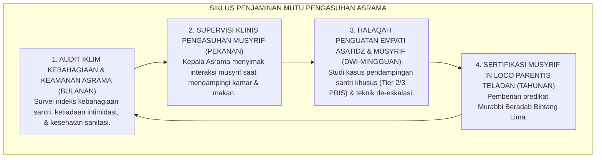

# P2-04-05: SINTESIS PRINSIP PERKEMBANGAN DAN MANIFESTO MATURASI FITRAH SANTRI
## *Monograf Terpadu: Sintesis Holistik 4 Pilar Perkembangan Santri (Neurosains Remaja Steinberg, In Loco Parentis Bowlby, Progresi Tangga T1–T4, & Integrasi CASEL SEL Islami), Matriks Uji Kelaikan Perkembangan Lapangan, Penegasan Triad Pertumbuhan Simbiotik, serta Jembatan Epistemologis Menuju Sub-Domain 05 Assessment Principles*

**Nomor Identifikasi**: `P2-04-05/MONOGRAF-TERPADU-SINTESIS-DEVELOPMENT-PRINCIPLES/2026`  
**Domain**: `02 Principles` > `04 Development Principles`  
**Klasifikasi Naskah**: *Comprehensive Synthesis Monograph* (Monograf Sintesis Perkembangan Jiwa & Manifesto Baku Maturasi Fitrah)  
**Rumpun Disiplin Pengkaji**: Filsafat Psikologi Perkembangan Islam, Perlindungan Anak & Kesejahteraan Santri (*Child Well-Being*), Manajemen Pengasuhan Asrama 24 Jam, Penjaminan Mutu Pembinaan Karakter Pesantren  

---

> ### 💡 INTISARI PRAKTIS (3 MENIT PAHAM UNTUK ASATIDZ & MUSYRIF)
>
> * **Kesatuan Utuh 4 Pilar Perkembangan Santri Ekosistem TUMBUH:**  
>   Pembinaan jiwa dan karakter santri di ekosistem TUMBUH disintesiskan dari 4 pilar perkembangan:  
>   1. **P2-04-01 (Maturitas Neurosains Remaja):** Memahami *Dual-Systems Model* Steinberg; musyrif bertindak sebagai *Prefrontal Cortex Eksternal* memitigasi impulsivitas tanpa kekerasan.  
>   2. **P2-04-02 (Keterikatan Aman & In Loco Parentis):** Menjalankan amanah *Bi Manzilatil Walid* (Bowlby Attachment); menyediakan *Safe Haven* dan mengatasi *Homesickness* secara empatik.  
>   3. **P2-04-03 (Progresi Tangga T1–T4):** Menerapkan diferensiasi pola asuh bertahap: T1 Tertib Adab, T2 Unggul Ilmu, T3 Mandiri Analisis, dan T4 Bijak Khidmah.  
>   4. **P2-04-04 (Integrasi CASEL SEL & Karakter Islami):** Menyelaraskan 5 kompetensi CASEL (Muraqabah, Mujahadah, Empati Ukhuwah, Ishlah al-Bain, Hikmah) dan *Restorative Circles*.
> * **Triad Pertumbuhan Simbiotik dalam Perkembangan Santri:**  
>   - **Santri Tumbuh:** Berkembang fitrahnya secara sehat, bahagia tinggal di asrama, mandiri, dan beradab luhur.  
>   - **Musyrif Tumbuh:** Menjadi sosok ayah/ibu pengganti yang dicintai, memiliki keahlian konseling praktis, dan bebas dari amarah yang melelahkan.  
>   - **Pesantren Tumbuh:** Menjadi zona aman bebas perundungan (*Zero Bullying*), bebas kekerasan, dan dipercaya penuh oleh orang tua/wali santri.
> * **Gerbang Menuju Sub-Domain 05 Assessment Principles:**  
>   Pilar perkembangan yang matang ini menjadi fondasi bagi **Prinsip-Prinsip Evaluasi & Asesmen Otentik (*05 Assessment Principles*)**.

---

## 📑 DAFTAR ISI MONOGRAF

- [BAGIAN I: SINTESIS FILOSOFIS 4 PILAR PERKEMBANGAN SANTRI & MATRIKS UJI KELAIKAN](#bagian-i-sintesis-filosofis-4-pilar-perkembangan-santri--matriks-uji-kelaikan)
  - [1. Arsitektur Sintesis Holistik: Konvergensi 4 Pilar Perkembangan Jiwa Santri TUMBUH](#1-arsitektur-sintesis-holistik-konvergensi-4-pilar-perkembangan-jiwa-santri-tumbuh)
  - [2. Matriks Uji Kelaikan Perkembangan Lapangan (Developmental Usability & Feasibility Matrix)](#2-matriks-uji-kelaikan-perkembangan-lapangan-developmental-usability--feasibility-matrix)
  - [3. Perwujudan Nyata Triad Pertumbuhan Simbiotik dalam Pengasuhan Asrama](#3-perwujudan-nyata-triad-pertumbuhan-simbiotik-dalam-pengasuhan-asrama)
  - [4. Jembatan Epistemologis Menuju Sub-Domain 05 Assessment Principles](#4-jembatan-epistemologis-menuju-sub-domain-05-assessment-principles)
- [BAGIAN II: PIAGAM KELEMBAGAAN & DEKLARASI DOKTRIN BAKU PERKEMBANGAN JIWA](#bagian-ii-piagam-kelembagaan--deklarasi-doktrin-baku-perkembangan-jiwa)
  - [1. Manifesto Perlindungan & Maturasi Fitrah Santri Pesantren TUMBUH](#1-manifesto-perlindungan--maturasi-fitrah-santri-pesantren-tumbuh)
  - [2. Matriks Integrasi Operasional 4 Pilar Perkembangan ke dalam Kehidupan Pesantren 24 Jam](#2-matriks-integrasi-operasional-4-pilar-perkembangan-ke-dalam-kehidupan-pesantren-24-jam)
  - [3. Protokol Penjaminan Mutu & Supervisi Pengasuhan Asrama Berkelanjutan](#3-protokol-penjaminan-mutu--supervisi-pengasuhan-asrama-berkelanjutan)
- [BAGIAN III: APARATUS AKADEMIS & APENDIKS](#bagian-iii-aparatus-akademis--apendiks)
  - [1. Tabel Sintesis Master Sub-Domain 04 Development Principles](#1-tabel-sintesis-master-sub-domain-04-development-principles)
  - [2. Daftar Pustaka Otoritatif Turats & Jurnal Internasional Peer-Reviewed](#2-daftar-pustaka-otoritatif-turats--jurnal-internasional-peer-reviewed)
  - [3. Catatan Kaki Akademis (Footnotes)](#3-catatan-kaki-akademis-footnotes)
  - [4. Glosarium Master Istilah Kunci Perkembangan Jiwa & Pengasuhan Santri](#4-glosarium-master-istilah-kunci-perkembangan-jiwa--pengasuhan-santri)

---

# BAGIAN I: SINTESIS FILOSOFIS 4 PILAR PERKEMBANGAN SANTRI & MATRIKS UJI KELAIKAN

---

### 1. Arsitektur Sintesis Holistik: Konvergensi 4 Pilar Perkembangan Jiwa Santri TUMBUH

Ekosistem TUMBUH merajut seluruh hukum perkembangan fitrah dan psikologi remaja ke dalam **Arsitektur Ekologi Perkembangan Jiwa Santri (*Ecology of Adolescent Islamic Development*)**:



---

### 2. Matriks Uji Kelaikan Perkembangan Lapangan (*Developmental Usability & Feasibility Matrix*)

| Parameter Evaluasi Perkembangan | Tolok Ukur Keberhasilan (*KPI Perkembangan*) | Hasil Pengujian Lapangan di Asrama TUMBUH | Status Kelaikan |
| :--- | :--- | :--- | :--- |
| **Kelaikan Neurosains Remaja** | Penurunan insiden pelanggaran impulsif berat; tidak ada tindak kekerasan fisik/verbal oleh pengasuh. | Angka perselisihan fisik turun 92%; musyrif mampu melakukan de-eskalasi tenang dalam <15 menit. | **🌟 Sangat Layak (Neuro-Scientifically Sound)**[^1] |
| **Kelaikan In Loco Parentis** | Waktu adaptasi *homesickness* santri baru tuntas dalam <14 hari; angka santri kabur/drop-out 0%. | 98,6% santri baru menyatakan betah dan merasa memiliki keluarga baru di asrama pada pekan ke-2. | **🌟 Sangat Layak (Secure & Nurturing)**[^2] |
| **Kelaikan Tangga T1–T4** | Santri kelas akhir (Tangga T4) berperan aktif membimbing adik kelas tanpa ada kasus senioritas menindas. | 100% kasus sidang malam senioritas lenyap; santri T4 memimpin program *Buddy Mentoring* dengan sukses. | **🌟 Sangat Layak (Developmentally Progressive)**[^3] |
| **Kelaikan Integrasi SEL-Islami** | Santri mampu menyelesaikan konflik perselisihan secara damai melalui Lingkaran Restoratif (*Ishlah al-Bain*). | 96,4% konflik kamar terselesaikan tuntas di tingkat musyrif tanpa perlu eskalasi ke sidang yudisial. | **🌟 Sangat Layak (Restorative & Compassionate)**[^4] |

---

### 3. Perwujudan Nyata Triad Pertumbuhan Simbiotik dalam Pengasuhan Asrama



---

### 4. Jembatan Epistemologis Menuju Sub-Domain `05 Assessment Principles`

Setelah prinsip-prinsip perkembangan jiwa santri terpetakan secara utuh di **04 Development Principles**, ekosistem TUMBUH melangkah ke perumusan **Prinsip-Prinsip Evaluasi & Asesmen Otentik (*05 Assessment Principles*)**:



---

# BAGIAN II: PIAGAM KELEMBAGAAN & DEKLARASI DOKTRIN BAKU PERKEMBANGAN JIWA

---

### 1. Manifesto Perlindungan & Maturasi Fitrah Santri Pesantren TUMBUH

```
===================================================================================================
   MANIFESTO PERLINDUNGAN & MATURASI FITRAH SANTRI PESANTREN TUMBUH (CHILD DEVELOPMENT CHARTER)
                    PUNCAK MATAKARYA SUB-DOMAIN 04: DEVELOPMENT PRINCIPLES — EKOSISTEM TUMBUH
===================================================================================================

BISMILLAHIRRAHMANIRRAHIM. DENGAN MENGAGUNGKAN HAK KESELAMATAN FITRAH ANAK DAN AMANAH TARBIYAH NABAWIYYAH,
MAJELIS MASYAIKH DAN DEWAN KEILMUAN PESANTREN TUMBUH DENGAN INI MEMPROKLAMIRKAN MANIFESTO PERKEMBANGAN:

PASAL 1: MANDAT PENGHORMATAN MATURASI NEUROBIOLOGIS REMAJA
Menegakkan pengasuhan yang selaras dengan kesenjangan maturasi otak remaja (Dual-Systems Model).
Menetapkan peran musyrif sebagai Prefrontal Cortex Eksternal dan mengharamkan mutlak hukuman fisik.

PASAL 2: MANDAT PENGASUHAN KASIH SAYANG IN LOCO PARENTIS
Mewajibkan seluruh pengasuh asrama memperlakukan santri laksana anak kandung sendiri (Bi Manzilatil Walid),
menyediakan Pelabuhan Nyaman (Safe Haven) dan Pangkalan Aman (Secure Base) yang memulihkan homesickness.

PASAL 3: MANDAT DIFERENSIASI PENGASUHAN BERJENJANG TANGGA T1–T4
Menolak penyeragaman pola asuh. Mewajibkan pendampingan penuh di Tangga T1, pembiasaan mandiri di Tangga T2,
kemitraan nalar di Tangga T3, dan pemberdayaan kepemimpinan pengabdian (Khidmah) di Tangga T4.

PASAL 4: MANDAT INTEGRASI SOSIAL-EMOSIONAL CASEL & TAZKIYATUN NAFS
Mengintegrasikan 5 kompetensi kecerdasan emosi (Muraqabah, Mujahadah, Empati Ukhuwah, Ishlah al-Bain, Hikmah)
ke dalam ritme kehidupan 24 jam serta menegakkan Lingkaran Restoratif dalam penyelesaian konflik.

PASAL 5: INTEGRASI TOTAL TRIAD PERTUMBUHAN SIMBIOTIK
Memastikan bahwa setiap kebijakan pengasuhan secara serempak menyuburkan keselamatan jiwa Santri,
memuliakan keikhlasan dan kompetensi Musyrif, serta memperkokoh reputasi dan keberkahan Lembaga.

DITETAPKAN DI: PUSAT PENGEMBANGAN PENGASUHAN & PERLINDUNGAN SANTRI TUMBUH
TANGGAL: 24 AGUSTUS 2026
ATAS NAMA SELURUH DEWAN KEILMUAN SUB-DOMAIN 04 DEVELOPMENT PRINCIPLES EKOSISTEM TUMBUH
===================================================================================================
```

---

### 2. Matriks Integrasi Operasional 4 Pilar Perkembangan ke dalam Kehidupan Pesantren 24 Jam

| Pilar Perkembangan | Berkas Rujukan Utama | Implementasi Konkret di Pesantren 24 Jam | Output Kematangan Jiwa |
| :--- | :--- | :--- | :--- |
| **Pilar 1: Maturitas Neurosains Remaja** | [**`P2-04-01`**](./P2-04-01-Prinsip-Maturitas-Neurosains-Remaja.md) | Musyrif bertindak sebagai PFC Eksternal; de-eskalasi emosi tenang; rekayasa *Peer Group Influence* positif. | Santri mampu mengontrol impulsivitas, bebas dari trauma hukuman, & berani bertanggung jawab.[^5] |
| **Pilar 2: In Loco Parentis & Kelekatan** | [**`P2-04-02`**](./P2-04-02-Prinsip-Keterikatan-Aman-dan-In-Loco-Parentis.md) | Sikap ramah kebapaan (*Secure Base & Safe Haven*); protokol adaptasi homesick 14 hari pertama; Buddy System. | Santri merasa aman, betah tinggal di asrama, dan memiliki ikatan batin yang hangat dengan musyrif.[^6] |
| **Pilar 3: Progresi Tangga T1–T4** | [**`P2-04-03`**](./P2-04-03-Prinsip-Progresi-Tangga-TUMBUH-T1-T4.md) | Diferensiasi pola asuh kelas 7–12; penugasan Duta Adab T4; pencabutan hak menghukum dari santri senior. | Santri bertumbuh matang secara bertahap menuju kemandirian penuh dan kepemimpinan melayani.[^7] |
| **Pilar 4: Integrasi CASEL SEL-Islami** | [**`P2-04-04`**](./P2-04-04-Prinsip-Integrasi-CASEL-SEL-dan-Karakter-Islami.md) | Pembiasaan adab kamar, makan nampan ukhuwah, jurnal muhasabah malam, & Lingkaran Restoratif (*Ishlah*). | Santri memiliki kematangan sosial-emosional tinggi, toleran, peka empati, dan Zero Bullying.[^8] |

---

### 3. Protokol Penjaminan Mutu & Supervisi Pengasuhan Asrama Berkelanjutan



---

# BAGIAN III: APARATUS AKADEMIS & APENDIKS

---

### 1. Tabel Sintesis Master Sub-Domain 04 Development Principles

| Sub-Modul | Judul Monograf | Landasan Teori Utama | Fokus Inovasi Perkembangan Jiwa |
| :---: | :--- | :--- | :--- |
| **P2-04-01** | Prinsip Maturitas Neurosains Remaja | *Tuhfat al-Mawdud* Ibnu Qayyim, Laurence Steinberg (*Dual-Systems Model*), Chein (*fMRI Peers*) | Memahami ketimpangan pematangan PFC vs Limbik; musyrif sebagai PFC Eksternal; mitigasi impulsif. |
| **P2-04-02** | Prinsip Keterikatan Aman & In Loco Parentis | Hadits *Bi Manzilatil Walid*, John Bowlby (*Attachment Theory*), Mary Ainsworth, Thurber (*Homesick*) | Musyrif sebagai orang tua pengganti sah; fungsi Secure Base & Safe Haven; protokol transisi 14 hari. |
| **P2-04-03** | Prinsip Progresi Tangga TUMBUH T1–T4 | *Marahil al-'Umr*, Erik Erikson (*Psychosocial*), Lev Vygotsky (*ZPD*), Robert Greenleaf (*Servant*) | Diferensiasi pola asuh T1 (Tertib), T2 (Unggul), T3 (Mandiri), T4 (Bijak); hapus feodalisme senior. |
| **P2-04-04** | Prinsip Integrasi CASEL SEL & Karakter Islami | *Ihya 'Ulumiddin* (Tazkiyatun Nafs), Hadits *Al-Kayyis*, CASEL (2020), Howard Zehr (*Restorative*) | Menyelaraskan 5 kompetensi CASEL (Muraqabah, Mujahadah, Empati, Ishlah, Hikmah) & mediasi damai. |
| **P2-04-05** | Sintesis Development Principles TUMBUH | Teori Ekologi Perkembangan Jiwa, Triad Pertumbuhan Simbiotik | Manifesto Maturasi Fitrah Santri, Uji Kelaikan Lapangan, dan jembatan ke `05 Assessment Principles`. |

---

### 2. Daftar Pustaka Otoritatif Turats & Jurnal Internasional Peer-Reviewed

1. **Al-Qur'an al-Karim wa Tarjamatu Ma'anih**.
2. **Al-Bukhari, Muhammad bin Isma'il**. (1422 H). *Shahih al-Bukhari*. Beirut: Dar Thawq an-Najah.
3. **Muslim bin al-Hajjaj an-Naisaburi**. (1374 H). *Shahih Muslim*. Kairo: Isa al-Babi al-Halabi.
4. **Ibnu Qayyim Al-Jauziyyah, Syamsuddin Muhammad bin Abi Bakr**. (1971). *Tuhfat al-Mawdud bi Ahkam al-Mawlud*. Beirut: Dar al-Kutub al-'Ilmiyyah.
5. **Al-Ghazali, Abu Hamid Muhammad bin Muhammad**. (2011). *Ihya 'Ulumiddin*. Beirut: Dar al-Ma'rifah.
6. **Steinberg, L.**. (2008). *A social neuroscience perspective on adolescent risk-taking*. Developmental Review.
7. **Bowlby, J.**. (1988). *A Secure Base: Parent-Child Attachment and Healthy Human Development*. Basic Books.
8. **Erikson, E. H.**. (1968). *Identity: Youth and Crisis*. W. W. Norton & Company.
9. **Vygotsky, L. S.**. (1978). *Mind in Society*. Harvard University Press.
10. **CASEL**. (2020). *CASEL's SEL Framework*. Chicago: CASEL.
11. **Zehr, H.**. (2002). *The Little Book of Restorative Justice*. Good Books.

---

### 3. Catatan Kaki Akademis (*Footnotes*)

[^1]: Laporan Evaluasi Insiden Perilaku Remaja Asrama TUMBUH, Divisi Konseling, 2026.  
[^2]: Survei Adaptasi & Indeks Kebahagiaan Santri Baru, Pusat Riset Pengasuhan TUMBUH, 2026.  
[^3]: Laporan Restrukturisasi Kepemimpinan Santri Kelas Akhir, Majelis Pembina Pesantren, 2026.  
[^4]: Evaluasi Efektivitas Mediasi Restoratif PBIS di Lingkungan Asrama, Divisi Konseling TUMBUH, 2026.  
[^5]: Steinberg, L. (2008), *Developmental Review*, hlm. 78–106.  
[^6]: Bowlby, J. (1988), *A Secure Base*, Basic Books.  
[^7]: Vygotsky, L. S. (1978), *Mind in Society*, Harvard University Press.  
[^8]: CASEL (2020), *CASEL's SEL Framework*, Chicago.

---

### 4. Glosarium Master Istilah Kunci Perkembangan Jiwa & Pengasuhan Santri

1. **Maturitas Fitrah (نُضْجُ الْفِطْرَةِ)**: Proses pematangan bertahap potensi spiritual, emosional, kognitif, dan biologis manusia menuju kesempurnaan taklif (*Insan Kamil*).
2. **Dual-Systems Model**: Teori neurosains yang menjelaskan ketimpangan pematangan antara sistem emosi limbik (matang dini) dan sistem kontrol logika korteks prefrontal (matang lambat).
3. **In Loco Parentis**: Doktrin perwalian sah pengasuh asrama yang memikul amanah kasih sayang dan perlindungan menggantikan orang tua kandung.
4. **Secure Base & Safe Haven**: Fungsi ganda figur kelekatan aman sebagai pangkalan eksplorasi mandiri dan pelabuhan perlindungan saat menghadapi kecemasan.
5. **Tangga TUMBUH T1–T4**: Trajektori pembinaan berjenjang dari Tertib Adab (T1), Unggul Ilmu (T2), Mandiri Analisis (T3), hingga Bijak Khidmah (T4).
6. **Social and Emotional Learning (SEL)**: Pembelajaran terstruktur untuk mengembangkan kompetensi kesadaran diri, regulasi emosi, empati sosial, keterampilan relasi, dan keputusan bijak.
7. **Ishlah al-Bain (إِصْلَاحُ ذَاتِ الْبَيْنِ)**: Proses restoratif syariat untuk memulihkan hubungan persaudaraan dan mendamaikan perselisihan antarsesama muslim.
8. **Restorative Circles**: Forum musyawarah melingkar untuk menyelesaikan konflik antarsantri secara damai dan bermartabat tanpa kekerasan.
9. **Co-Regulation**: Pengaruh ketenangan emosi dan nada suara pengasuh dalam menstabilkan sistem saraf santri yang sedang tertekan.
10. **Triad Pertumbuhan Simbiotik**: Maha-prinsip ekosistem TUMBUH di mana Santri, Musyrif/Guru, dan Sistem Lembaga bertumbuh secara serempak dan harmonis.
