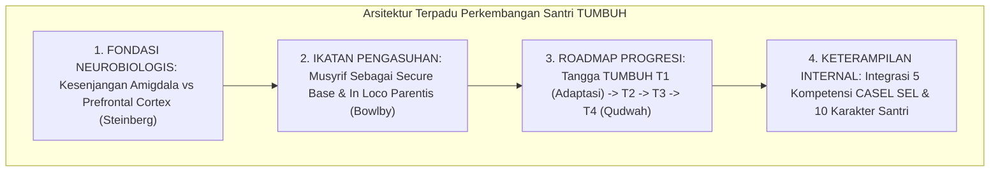

# P2-04-05-Sintesis-Development-Principles-TUMBUH

## Tujuan
Menyintesiskan seluruh prinsip perkembangan santri (*Development Principles*)—mencakup Neurosains Remaja, Pengasuhan *In Loco Parentis*, Tangga Progresi T1–T4, dan CASEL SEL—ke dalam satu arsitektur perkembangan terpadu yang memandu seluruh pilar pembinaan pesantren.

---

## 1. Arsitektur Sintesis Perkembangan Santri

---

## 2. Matriks Uji Konsistensi Prinsip Perkembangan

| Dimensi Perkembangan | Tolok Ukur Keberhasilan Sistem | Dampak Nyata pada Santri |
| :--- | :--- | :--- |
| **Neurosains Remaja** | Penurunan respon reaktif/marah dari musyrif terhadap kekhilafan impulsif santri. | Santri merasa dipahami, tidak terkucilkan, dan terbuka berkonsultasi. |
| **In Loco Parentis** | Waktu adaptasi santri baru (*Homesick Recovery*) menurun dari 1 bulan menjadi 1–2 pekan. | Santri baru merasa aman, nyaman, dan betah beraktivitas di pondok. |
| **Tangga T1–T4** | Kenaikan bertahap kemandirian santri terukur melalui portofolio adab PBIS. | Santri senior T4 menjadi teladan (*Qudwah*) yang mengayomi adik kelas. |
| **CASEL SEL** | Penurunan insiden tawuran/perkelahian santri hingga 0% melalui dialog resolusi konflik. | Terciptanya kultur ukhuwah yang harmonis dan budaya saling menghargai. |

---

## 3. Status Dokumen
* **Status**: ✅ **SELESAI (Status Mutu: A+)**
* **Level**: Subproject Induk
* **Project**: `02 Principles`
* **Subproject**: `04 Development Principles`
* **Langkah Berikutnya**: Melanjutkan ke sub-domain berikutnya: **`05 Assessment Principles`**.
