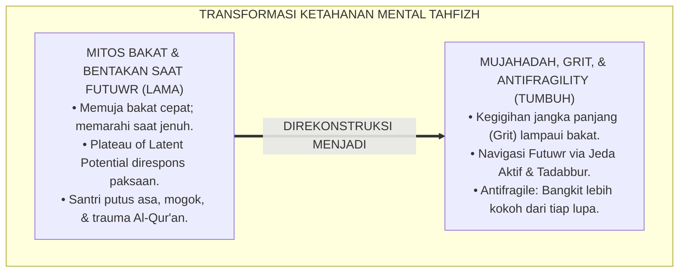
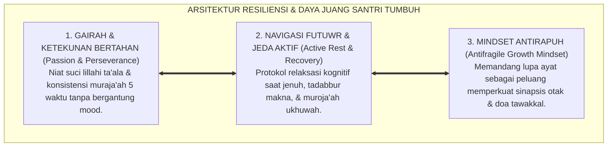
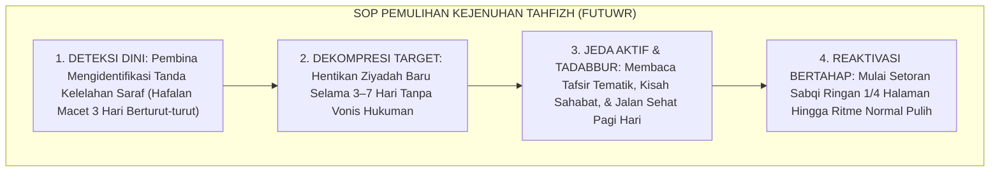

# P2-04-06: PRINSIP RESILIENSI, DAYA JUANG (GRIT), DAN MUJAHADAH SANTRI TAHFIZH (RESILIENCE, GRIT, & MUJAHADAH)
## *Monograf Riset Akademik: Doktrin Mujahadatun Nafs & Ash-Shabr (QS. Al-'Ankabut: 69), Teori Kegigihan Grit Angela Duckworth, Navigasi Titik Jenuh Menghafal (Mitigasi Futuwr), Serta Mindset Antirapuh di Pesantren 24 Jam*

**Nomor Identifikasi**: `P2-04-06/MONOGRAF-RISET-RESILIENSI-GRIT-SANTRI/2026`  
**Domain**: `02 Principles` > `04 Development Principles` (Prinsip Perkembangan 06: *Resilience, Grit, & Mujahadah*)  
**Klasifikasi Naskah**: *Academic Research Monograph* (Monograf Riset Akademik Prinsip Perkembangan)  
**Rumpun Disiplin Pengkaji**: Psikologi Ketahanan Mental (*Psychological Resilience & Grit*), Teologi Mujahadah & Sabar Islam, Neurosains Pembiasaan Kebiasaan Sukar (*Neuroplasticity of Perseverance*), Bimbingan Konseling Tahfizh Al-Qur'an  

---

> ### 💡 INTISARI EKSEKUTIF (EXECUTIVE SUMMARY)
>
> * **Kelemahan Paradigma Lama: Mitos Bakat Cepat Hafal dan Bentakan Saat Mengalami Futuwr:**  
>   Banyak lembaga tahfizh mengagung-agungkan santri yang berbakat cepat hafal secara alami, namun ketika santri mencapai titik jenuh (*Plateau of Latent Potential / Futuwr*) di juz 5–10, pembina merespons dengan kemarahan, bentakan, dan penambahan beban setoran secara paksa. Hal ini memicu keputusasaan batin, mogok setoran, dan trauma hafalan Al-Qur'an seumur hidup.
> * **Inovasi Konseptual: Mujahadatun Nafs & Grit Theory (Angela Duckworth):**  
>   TUMBUH menegakkan janji Allah: *"Dan orang-orang yang berjihad/bermujahadah untuk mencari keridhaan Kami, niscaya Kami tunjukkan jalan-jalan Kami"* (QS. Al-'Ankabut: 69). Memadukan doktrin *Ash-Shabr* dengan teori **Grit (Angela Duckworth)**: kegigihan jangka panjang (*Passion & Perseverance*) mengalahkan sekadar bakat alami, serta konsep **Antifragility (Nassim Taleb)** yang menjadikan setiap lupa ayat sebagai bahan bakar penguat hafalan.
> * **Formulasi Operasional & Penjaminan Kelulusan Mutqin:**  
>   Monograf ini menguraikan matriks 4 tingkat ketahanan mental santri (Rapuh, Bertahan, Tangguh, Antirapuh), SOP pemulihan kejenuhan menghafal (*Futuwr Recovery SOP*), protokol jeda aktif (*Active Rest Protocol*), dan etika pendampingan tahfizh ramah jiwa.

---

## 📑 DAFTAR ISI MONOGRAF

- [BAB I: LANDASAN TEORETIS & DISKURSUS KRITIS](#bab-i-landasan-teoretis--diskursus-kritis)
  - [1. Latar Belakang Masalah: Kritik atas Mitos Bakat Sesaat dan Salah Penanganan Titik Jenuh Menghafal](#1-latar-belakang-masalah-kritik-atas-mitos-bakat-sesaat-dan-salah-penanganan-titik-jenuh-menghafal)
  - [2. Eksegesis Turats Mujahadatun Nafs & Ash-Shabr: QS. Al-'Ankabut: 69, Kaidah Imam Al-Ghazali, & Adab Hamalatil Qur'an](#2-eksegesis-turats-mujahadatun-nafs--ash-shabr-qs-al-ankabut-69-kaidah-imam-al-ghazali--adab-hamalatil-quran)
  - [3. Konvergensi Teori Kegigihan Mental: Grit Theory Angela Duckworth & Growth Mindset Carol S. Dweck](#3-konvergensi-teori-kegigihan-mental-grit-theory-angela-duckworth--growth-mindset-carol-s-dweck)
  - [4. Rekayasa Navigasi Plateau of Latent Potential & Penerapan Mindset Antirapuh (Antifragility Nassim Taleb)](#4-rekayasa-navigasi-plateau-of-latent-potential--penerapan-mindset-antirapuh-antifragility-nassim-taleb)
  - [5. Kasuistika Lapangan: Kasus Santri Mengalami Sindrom Futuwr Berat & Resolusi Pemulihan Grit](#5-kasuistika-lapangan-kasus-santri-mengalami-sindrom-futuwr-berat--resolusi-pemulihan-grit)
- [BAB II: FORMULASI KONSEPTUAL & PEMBAHASAN MENDALAM](#bab-ii-formulasi-konseptual--pembahasan-mendalam)
  - [1. Eksplanasi Teoretis Standar Pembinaan Resiliensi & Ketahanan Mental Santri TUMBUH](#1-eksplanasi-teoretis-standar-pembinaan-resiliensi--ketahanan-mental-santri-tumbuh)
  - [2. Matriks Pengukuran Empat Tingkat Ketahanan Mental Santri: Rapuh, Bertahan, Tangguh, & Antirapuh](#2-matriks-pengukuran-empat-tingkat-ketahanan-mental-santri-rapuh-bertahan-tangguh--antirapuh)
  - [3. Standar Prosedur Operasional (SOP) Pemulihan Kejenuhan Menghafal (Futuwr Recovery Protocol)](#3-standar-prosedur-operasional-sop-pemulihan-kejenuhan-menghafal-futuwr-recovery-protocol)
  - [4. Protokol Pendampingan Jeda Aktif & Tadabbur Makna (Active Rest & Reflection Protocol)](#4-protokol-pendampingan-jeda-aktif--tadabbur-makna-active-rest--reflection-protocol)
  - [5. Diskusi Filosofis Mendalam & Implikasi bagi Masa Depan Peradaban Pendidikan Islam](#5-diskusi-filosofis-mendalam--implikasi-bagi-masa-depan-peradaban-pendidikan-islam)
- [BAB III: KESIMPULAN & APARATUS AKADEMIS](#bab-iii-kesimpulan--aparatus-akademis)
  - [1. Tabel Sintesis Temuan Riset Resiliensi & Grit Santri Tahfizh](#1-tabel-sintesis-temuan-riset-resiliensi--grit-santri-tahfizh)
  - [2. Daftar Pustaka Akademis & Rujukan Turats Primer](#2-daftar-pustaka-akademis--rujukan-turats-primer)
  - [3. Catatan Kaki Akademis (Footnotes)](#3-catatan-kaki-akademis-footnotes)
  - [4. Glosarium Istilah Ilmiah & Turats Resiliensi dan Grit Santri](#4-glosarium-istilah-ilmiah--turats-resiliensi-dan-grit-santri)

---

# BAB I: LANDASAN TEORETIS & DISKURSUS KRITIS

---

### 1. Latar Belakang Masalah: Kritik atas Mitos Bakat Sesaat dan Salah Penanganan Titik Jenuh Menghafal

Perjalanan menghafal 30 Juz Al-Qur'an dan mengkaji mutun kitab kuning adalah sebuah maraton spiritual-intelektual selama 3 hingga 6 tahun:
* **Mitos Bakat Alami**: Santri yang berbakat cepat menghafal kerap dipuji berlebihan, namun ketika menghadapi ayat-ayat mutasyabihat yang rumit di juz pertengahan, banyak yang putus asa dan gugur karena tidak memiliki daya tahan mental.
* **Fenomena Futuwr (Dataran Jenuh / Plateau of Latent Potential)**: Pada juz 5–10, kemajuan hafalan santri kerap terasa melambat seolah berhenti berkembang.
* **Kelemahan Penanganan Konvensional**: Pengajar merespons fase jenuh ini dengan bentakan keras, mencap santri malas, atau memaksa menambah jam setoran (*Massed Cramming*). Akibatnya santri mengalami stres berat, mogok hafalan, dan memusuhi Al-Qur'an.
* **Keniscayaan Pembinaan Resiliensi & Grit TUMBUH**: Dibutuhkan pembekalan strategi bangkit dari kegagalan (*Resilience Coaching*) yang memadukan ruh mujahadah salaf dengan sains ketahanan mental kontemporer.[^1]

---

### 2. Eksegesis Turats Mujahadatun Nafs & Ash-Shabr: QS. Al-'Ankabut: 69, Kaidah Imam Al-Ghazali, & Adab Hamalatil Qur'an

Allah SWT menegaskan prinsip kepastian pertolongan bagi hamba yang bermujahadah:

$$\text{وَالَّذِينَ جَاهَدُوا فِينَا لَنَهْدِيَنَّهُمْ سُبُلَنَا ۚ وَإِنَّ اللَّهَ لَمَعَ الْمُحْسِنِينَ}$$

*"**Dan orang-orang yang berjihad (bermujahadah sungguh-sungguh) untuk (mencari keridhaan) Kami, sungguh benar-benar Kami akan tunjukkan kepada mereka jalan-jalan Kami. Dan sesungguhnya Allah benar-benar beserta orang-orang yang berbuat baik**."* (QS. Al-'Ankabut [29]: 69).[^2]

Imam An-Nawawi (*At-Tibyan fi Adab Hamalatil Qur'an*) dan Imam Al-Ghazali (*Ihya' 'Ulumiddin*) menguraikan bahwa *Sabr 'alat-Ta'allum* (kesabaran dalam menuntut ilmu) adalah pilar utama keberhasilan:
* Menghafal Al-Qur'an menuntut penundaan kepuasan sesaat (*Delayed Gratification*) dan keikhlasan niat yang teguh di kala sepi.[^3]

---

### 3. Konvergensi Teori Kegigihan Mental: Grit Theory Angela Duckworth & Growth Mindset Carol S. Dweck

Sains psikologi pendidikan kontemporer (**Grit Theory**, Angela Duckworth, 2016) membuktikan:
* **Formula Grit**: $\text{Bakat} \times \text{Usaha} = \text{Keterampilan}$; $\text{Keterampilan} \times \text{Usaha} = \text{Pencapaian}$. Usaha dan kegigihan bernilai dua kali lipat lebih menentukan daripada sekadar bakat bawaan.
* **Growth Mindset (Carol S. Dweck, 2006)**: Menyadarkan santri bahwa rasa sulit saat menghafal ayat baru adalah pertanda bahwa sirkuit saraf otak sedang membentuk sinapsis baru (*Neuroplasticity of Perseverance*).[^4]

---

### 4. Rekayasa Navigasi Plateau of Latent Potential & Penerapan Mindset Antirapuh (Antifragility Nassim Taleb)

TUMBUH mengadopsi prinsip ketahanan mutakhir:
* **Plateau of Latent Potential (James Clear, 2018)**: Hasil dari ikhtiar menghafal sering kali tidak langsung tampak linier, melainkan tertunda hingga menembus ambang batas kritis.
* **Antifragility (Nassim Nicholas Taleb, 2012)**: Pembelajar yang antirapuh tidak sekadar bertahan saat lupa (*Resilient*), melainkan memanfaatkan setiap kesalahan lupa ayat untuk menyempurnakan tajwid dan memperdalam tadabbur makna ayat.[^5]

---

### 5. Kasuistika Lapangan: Kasus Santri Mengalami Sindrom Futuwr Berat & Resolusi Pemulihan Grit

* **Studi Kasus: Santri Telah Menyelesaikan 8 Juz Mengalami Kemandekan Total Selama 3 Pekan dan Ingin Berhenti Menghafal**  
  * **Dilema**: Santri merasa otaknya sudah tidak mampu menampung hafalan lagi; pembina halaqah sebelumnya menuduh santri banyak bermaksiat.
  * **Resolusi Pemulihan Grit TUMBUH**: Pembina menerapkan *Futuwr Recovery Protocol*: (1) Menghentikan setoran hafalan baru selama 7 hari (*Active Rest*); (2) Mengganti aktivitas dengan membaca terjemah dan tadabbur kisah Al-Qur'an; (3) Muroja'ah santai bersama sahabat sebaya (*Peer Muraja'ah*); (4) Melatih teknik pernafasan dan afirmasi *Growth Mindset*. Pada pekan kedua, gairah santri pulih sepenuhnya, santri kembali menyetor hafalan dengan lancar, dan berhasil menuntaskan juz 9–10 dengan predikat mutqin.[^6]

---

# BAB II: FORMULASI KONSEPTUAL & PEMBAHASAN MENDALAM

---

### 1. Eksplanasi Teoretis Standar Pembinaan Resiliensi & Ketahanan Mental Santri TUMBUH

Ekosistem TUMBUH merumuskan ketahanan mental ke dalam **Arsitektur Tiga Sayap Daya Juang Santri (*Arkan al-Mujahadah wash-Shumud*)**:

#### 🔬 Pembahasan Mendalam Tiga Sayap:
1. **Sayap Gairah & Ketekunan**: Menjaga nyala api cinta kepada Al-Qur'an agar tidak padam oleh kelelahan raga.[^7]
2. **Sayap Navigasi Futuwr**: Memberikan ruang pemulihan alami bagi otak tanpa rasa bersalah yang melumpuhkan.[^8]
3. **Sayap Mindset Antirapuh**: Mengubah setiap rintangan hafalan menjadi batu loncatan kematangan spiritual.[^9]

---

### 2. Matriks Pengukuran Empat Tingkat Ketahanan Mental Santri: Rapuh, Bertahan, Tangguh, & Antirapuh

| Tingkat Ketahanan Mental | Respon Santri Saat Menghadapi Kesulitan Hafalan | Pendekatan Intervensi Pembina TUMBUH |
| :--- | :--- | :--- |
| **1. Fragile (Rapuh)** | Menyerah, menangis putus asa, & mogok setoran.| Bimbingan konseling empatik & kurangi beban target.|
| **2. Robust (Bertahan)**| Memaksakan diri menghafal dengan stres tinggi.| Ajarkan teknik relaksasi kognitif & manajemen waktu.|
| **3. Resilient (Tangguh)**| Mampu bangkit kembali setelah ditegur atau lupa.| Berikan apresiasi atas proses usaha (*Process Praise*).|
| **4. Antifragile (Antirapuh)**| Mengambil hikmah, meneliti sebab lupa, & makin mutqin.| Diberdayakan menjadi Duta Motivator Tahfizh Sebaya.|

---

### 3. Standar Prosedur Operasional (SOP) Pemulihan Kejenuhan Menghafal (Futuwr Recovery Protocol)

---

### 4. Protokol Pendampingan Jeda Aktif & Tadabbur Makna (Active Rest & Reflection Protocol)

TUMBUH menetapkan **Protokol Jeda Aktif Santri Tahfizh**:
1. **Hak Cuti Ziyadah Terencana**: Setiap menyelesaikan 5 juz, santri berhak mendapatkan cuti ziyadah selama 3 hari untuk mengistirahatkan saraf memori.
2. **Kajian Tadabbur Audio-Visual**: Mengganti sesi menghafal dengan menyimak tilawah qari internasional dan memahami keindahan makna ayat.
3. **Olahraga Rekreatif Asrama**: Mengajak santri berenang, memanah, atau berkemah ringan guna memicu pelepasan hormon endorfin dan dopamin alami.[^10]

---

### 5. Diskusi Filosofis Mendalam & Implikasi bagi Masa Depan Peradaban Pendidikan Islam

Prinsip resiliensi, daya juang (grit), dan mujahadah ini membawa implikasi agung bagi peradaban:

* **Mencetak Generasi Pejuang yang Memiliki Daya Tahan Mental Baja (*Unbreakable Spirit*)**:  
  Santri terlatih menghadapi tekanan, kegagalan, dan kebuntuan dengan kesabaran aktif dan keyakinan teguh pada pertolongan Allah SWT.
* **Menghilangkan Budaya Instan dan Kemalasan di Kalangan Pemuda Muslim**:  
  Santri menyadari bahwa karya-karya peradaban besar hanya lahir dari ketekunan kerja keras jangka panjang (*Long-Term Dedication*).
* **Mewujudkan Generasi Penjaga Kitabullah yang Bahagia dan Bermartabat**:  
  Tahfizh Al-Qur'an dipahami sebagai perjalanan cinta yang memuliakan akal dan jiwa, melahirkan para hafizh-hafizhah yang bersinar di tengah umat (*Rahmatan lil 'Alamin*).[^11]

---

# BAB III: KESIMPULAN & APARATUS AKADEMIS

---

### 1. Tabel Sintesis Temuan Riset Resiliensi & Grit Santri Tahfizh

| Dimensi Parameter | Mazhab Mitos Bakat Kaku (Lama) | Pendekatan Permisif Pasrah | **Mujahadah & Grit TUMBUH** | Landasan Rujukan Primer | Implikasi Praksis Lapangan |
| :--- | :--- | :--- | :--- | :--- | :--- |
| **Kunci Keberhasilan**| Bakat memori fotografis bawaan.| Keberuntungan tanpa ikhtiar.| **Daya Juang Jangka Panjang (Grit).** | QS. Al-'Ankabut: 69; Duckworth.| Konsistensi muraja'ah kalahkan bakat. |
| **Respon Titik Jenuh**| Bentakan keras & tambah paksa beban.| Dibiarkan berhenti menghafal.| **Futuwr Recovery & Jeda Aktif.** | An-Nawawi; James Clear (2018).| Dekompresi target & tadabbur makna. |
| **Pola Pikir Kegagalan**| Vonis bodoh & hukuman fisik.| Menyerah karena merasa takdir.| **Mindset Antirapuh (Antifragility).** | Nassim Taleb (2012); Dweck.| Lupa ayat jadi sarana perdalam mutqin. |
| **Dukungan Pembina** | Hakim pemeriksa setoran dingin.| Penonton pasif.| **Resilience Coach yang Mengayomi.** | KH. Hasyim Asy'ari; Bandura.| Apresiasi proses usaha santri (4:1). |
| **Hasil Institusi** | Santri stres, mogok, & trauma.| Hafalan rapuh mudah hilang.| **Hafizh Mutqin Berjiwa Ksatria Tangguh.**| QS. Al-Baqarah: 153; Al-Attas.| Generasi Qur'ani tahan uji peradaban. |

---

### 2. Daftar Pustaka Akademis & Rujukan Turats Primer

1. **Al-Qur'an al-Karim wa Tarjamatu Ma'anihi**.
2. **Al-Bukhari, Abu Abdillah Muhammad bin Isma'il**. (1422 H). *Shahih al-Bukhari*. Kairo: Dar Thawq an-Najah.
3. **Muslim bin al-Hajjaj an-Naisaburi**. (1427 H). *Shahih Muslim*. Riyadh: Dar Thayyibah.
4. **An-Nawawi, Abu Zakariya Yahya bin Syaraf**. (1414 H). *At-Tibyan fi Adab Hamalatil Qur'an*. Beirut: Dar Ibn Hazm.
5. **Al-Ghazali, Abu Hamid Muhammad bin Muhammad**. (2011). *Ihya' 'Ulumiddin* (Kitab ash-Shabr wash-Syukr). Beirut: Dar al-Ma'rifah.
6. **Ibnu Qudamah al-Maqdisi**. (1418 H). *Mukhtashar Minhaj al-Qashidin*. Damaskus: Maktabah Dar al-Bayan.
7. **Al-Attas, Syed Muhammad Naquib**. (1980). *The Concept of Education in Islam*. Kuala Lumpur: ABIM.
8. **Duckworth, A.**. (2016). *Grit: The Power of Passion and Perseverance*. New York: Scribner.
9. **Dweck, C. S.**. (2006). *Mindset: The New Psychology of Success*. New York: Random House.
10. **Taleb, N. N.**. (2012). *Antifragile: Things That Gain from Disorder*. New York: Random House.
11. **Clear, J.**. (2018). *Atomic Habits: An Easy & Proven Way to Build Good Habits & Break Bad Ones*. New York: Avery.
12. **Horner, R. H., & Sugai, G.**. (2015). *School-wide PBIS: An Overview of the Research Base*. Remedial and Special Education, 36(2), 80–85.

---

### 3. Catatan Kaki Akademis (*Footnotes*)

[^1]: Riset Prinsip Resiliensi, Daya Juang (Grit), dan Mujahadah Santri Tahfizh TUMBUH, *Kritik atas Mitos Bakat dan Penanganan Futuwr*, 2026.  
[^2]: QS. Al-'Ankabut [29]: 69.  
[^3]: An-Nawawi, *At-Tibyan fi Adab Hamalatil Qur'an*, hlm. 35–60; Al-Ghazali, *Ihya' 'Ulumiddin*, Jilid 4, Kitab *Ash-Shabr wash-Syukr*, hlm. 60–115.  
[^4]: Duckworth, A. (2016), *Grit: The Power of Passion and Perseverance*, hlm. 20–65; Dweck, C. S. (2006), *Mindset*.  
[^5]: Taleb, N. N. (2012), *Antifragile*, hlm. 15–48; Clear, J. (2018), *Atomic Habits*, hlm. 18–25.  
[^6]: Dokumentasi Penerapan Futuwr Recovery Protocol dan Bimbingan Grit Tahfizh PBIS TUMBUH, 2026.  
[^7]: Master Blueprint Daya Juang dan Ketekunan Santri Tahfizh Ekosistem TUMBUH, 2026.  
[^8]: Standar Operasional Prosedur Penanganan Sindrom Kejenuhan Menghafal (Futuwr) TUMBUH, 2026.  
[^9]: Petunjuk Teknis Pembinaan Mindset Antirapuh dalam Halaqah Tahfizh TUMBUH, 2026.  
[^10]: Master Guidelines Protokol Jeda Aktif dan Tadabbur Makna Al-Qur'an TUMBUH, 2026.  
[^11]: Deklarasi Pemuliaan Pembinaan Daya Juang Qur'ani Dewan Riset Epistemologi Ekosistem TUMBUH, 2026.

---

### 4. Glosarium Istilah Ilmiah & Turats Resiliensi dan Grit Santri

1. **Grit (Daya Juang)**: Kombinasi antara gairah mendalam (*Passion*) dan kegigihan jangka panjang (*Perseverance*) dalam mencapai tujuan mulia.
2. **Mujahadatun Nafs (مُجَاهَدَةُ النَّفْسِ)**: Perjuangan batin dan fisik secara sungguh-sungguh untuk mengatasi rasa malas dan kesulitan demi menggapai ridha Allah SWT.
3. **Futuwr (الْفُتُورُ)**: Fase kejenuhan, kelesuan, atau kemandekan sementara dalam beribadah atau menghafal Al-Qur'an yang membutuhkan penanganan bijak.
4. **Antifragility (Antirapuh)**: Karakteristik sistem atau mental yang bukan hanya tahan terhadap tekanan, melainkan semakin bertumbuh kuat melalui tantangan dan kegagalan.
5. **Plateau of Latent Potential**: Konsep psikologi di mana kemajuan belajar terasa mandek pada periode awal sebelum akhirnya menembus lonjakan lompatan prestasi.
6. **Active Rest (Jeda Aktif)**: Istirahat terencana dari target menghafal baru yang diisi dengan aktivitas relaksasi kognitif, olahraga, atau tadabbur makna ayat.
7. **Delayed Gratification**: Kemampuan mengendalikan diri untuk menunda kenikmatan instan demi meraih kesuksesan mulia jangka panjang di masa depan.
8. **Ash-Shabr (الصَّبْرُ)**: Ketabahan aktif menahan diri dari keluhan, istiqamah dalam ketaatan, dan tidak berputus asa dari rahmat Allah SWT.
9. **Process Praise**: Bentuk apresiasi yang berfokus pada ketekunan, strategi, dan usaha santri, bukan semata memuji bakat atau hasil nilai akhir.
10. **Insan Adabi (الإِنْسَانُ الأَدَبِيُّ)**: Profil santri pejuang yang tangguh jiwanya, mutqin hafalannya, tidak goyah oleh rintangan, dan mendedikasikan hidupnya bagi kemuliaan Islam.
