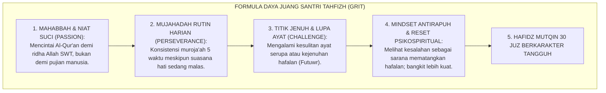
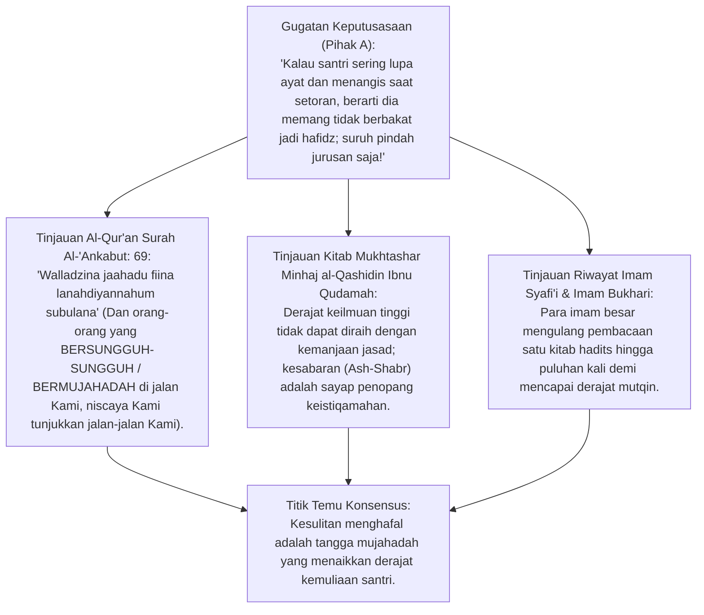
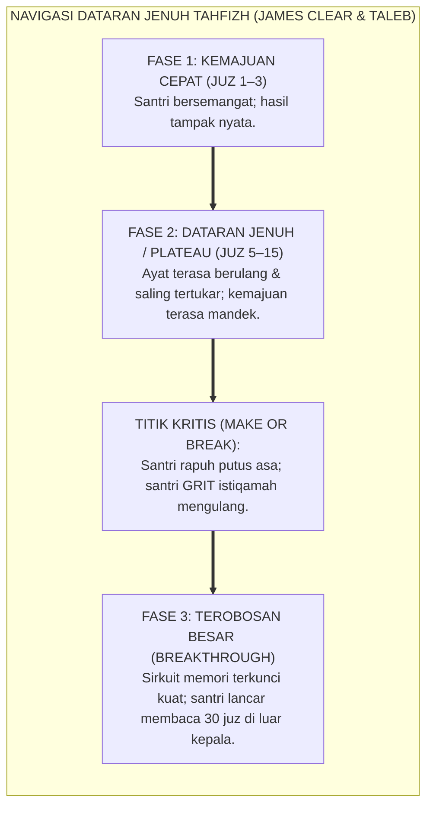
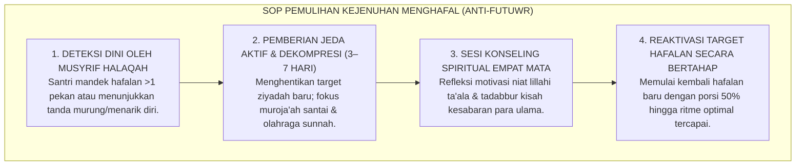

# P2-04-06: PRINSIP RESILIENSI, DAYA JUANG (GRIT), DAN MUJAHADAH SANTRI TAHFIZH
## *Monograf Terpadu: Doktrin Mujāhadatun Nafs & Ash-Shabr (QS. Al-'Ankabut: 69), Teori Kegigihan Grit Angela Duckworth (Passion & Perseverance), Navigasi Titik Jenuh Menghafal (Plateau of Latent Potential / Mitigasi Futuwr), Mindset Antirapuh (Antifragility Nassim Taleb), serta Protokol Penguatan Mental Santri*

**Nomor Identifikasi**: `P2-04-06/MONOGRAF-TERPADU-RESILIENSI-GRIT-SANTRI/2026`  
**Domain**: `02 Principles` > `04 Development Principles`  
**Klasifikasi Naskah**: *Comprehensive Integrated Monograph* (Monograf Akademis & Standar Baku Ketahanan Mental Santri)  
**Rumpun Disiplin Pengkaji**: Psikologi Ketahanan Mental (*Psychological Resilience & Grit*), Teologi Mujahadah & Sabar Islam, Neurosains Pembiasaan Kebiasaan Sukar (*Neuroplasticity of Perseverance*), Bimbingan Konseling Tahfizh Al-Qur'an  

---

> ### 💡 INTISARI PRAKTIS (3 MENIT PAHAM UNTUK ASATIDZ & MUSYRIF)
>
> * **Bakat Alami Bukan Penentu Utama Keberhasilan Tahfizh 30 Juz:**  
>   Banyak santri yang memiliki bakat hafalan cepat namun gagal menyelesaikan 30 juz karena mudah menyerah saat menghadapi kesulitan. Penentu utama keberhasilan adalah **Kegigihan Mental Jangka Panjang (*Grit / Mujahadah*)**.
> * **Memahami Fenomena "Dataran Jenuh" (*Plateau of Latent Potential*):**  
>   Saat santri mencapai hafalan juz 5–10, kemajuan hafalan sering kali terasa mandek dan terasa sangat berat. Ini bukan tanda tidak mampu, melainkan fase adaptasi saraf otak (*Neural Consolidation*).
> * **Protokol Pemulihan Sindrom Kejenuhan (*Anti-Futuwr Protocol*):**  
>   Jangan menghukum santri yang jenuh dengan bentakan atau menambah paksa beban ayat. Berikan jeda aktif (*Active Rest*), tadabbur kisah kemuliaan para penghafal Al-Qur'an, dan bimbingan muroja'ah santai bersama sahabat sebaya.

---

## 📑 DAFTAR ISI MONOGRAF

- [BAGIAN I: RISET RESILIENSI, DAYA JUANG GRIT, DIALEKTIKA INKUIRI, & KASUISTIKA LAPANGAN](#bagian-i-riset-resiliensi-daya-juang-grit-dialektika-inkuiri--kasuistika-lapangan)
  - [1. Kerangka Metodologi Resiliensi Pesantren: Mengapa Kegigihan Jangka Panjang Mengalahkan Bakat Sesaat](#1-kerangka-metodologi-resiliensi-pesantren-mengapa-kegigihan-jangka-panjang-mengalahkan-bakat-sesaat)
  - [2. Inkuiri 1: Eksegesis Turats Mujahadatun Nafs & Ash-Shabr — Minhaj al-Qashidin & QS. Al-'Ankabut: 69](#2-inkuiri-1-eksegesis-turats-mujahadatun-nafs--ash-shabr--minhaj-al-qashidin--qs-al-ankabut-69)
  - [3. Inkuiri 2: Konvergensi Grit Theory (Angela Duckworth) & Growth Mindset (Carol Dweck) dalam Tahfizh](#3-inkuiri-2-konvergensi-grit-theory-angela-duckworth--growth-mindset-carol-dweck-dalam-tahfizh)
  - [4. Inkuiri 3: Navigasi Plateau of Latent Potential & Penerapan Antifragility dalam Mengelola Kegagalan Setoran](#4-inkuiri-3-navigasi-plateau-of-latent-potential--penerapan-antifragility-dalam-mengelola-kegagalan-setoran)
  - [5. Inkuiri 4: Silogisme Logika, Dialektika 3 Ronde, Kasuistika Halaqah, & Titik Temu Konsensus](#5-inkuiri-4-silogisme-logika-dialektika-3-ronde-kasuistika-halaqah--titik-temu-konsensus)
- [BAGIAN II: KODIFIKASI BAKU HASIL RISET & KESIMPULAN FORMAL](#bagian-ii-kodifikasi-baku-hasil-riset--kesimpulan-formal)
  - [1. Kaidah Utama dan Standar Baku: Standar Pembinaan Resiliensi & Ketahanan Mental Santri TUMBUH](#1-kaidah-utama-dan-standar-baku-standar-pembinaan-resiliensi-ketahanan-mental-santri-tumbuh)
  - [2. Matriks Pengukuran 4 Tingkat Ketahanan Mental Santri: Rapuh, Bertahan, Tangguh, & Antirapuh](#2-matriks-pengukuran-4-tingkat-ketahanan-mental-santri-rapuh-bertahan-tangguh--antirapuh)
  - [3. Standar Prosedur Operasional (SOP) Pemulihan Kejenuhan Menghafal (Futuwr Recovery Protocol)](#3-standar-prosedur-operasional-sop-pemulihan-kejenuhan-menghafal-futuwr-recovery-protocol)
- [BAGIAN III: APARATUS AKADEMIS & APENDIKS](#bagian-iii-aparatus-akademis--apendiks)
  - [1. Tabel Sintesis Hasil Riset Resiliensi Santri](#1-tabel-sintesis-hasil-riset-resiliensi-santri)
  - [2. Daftar Pustaka Akademis & Rujukan Turats Primer](#2-daftar-pustaka-akademis--rujukan-turats-primer)
  - [3. Catatan Kaki Akademis (Footnotes)](#3-catatan-kaki-akademis-footnotes)
  - [4. Glosarium Teknis Resiliensi, Grit, Mujahadah, Futuwr, & Antifragile](#4-glosarium-teknis-resiliensi-grit-mujahadah-futuwr--antifragile)

---

# BAGIAN I: RISET RESILIENSI, DAYA JUANG GRIT, DIALEKTIKA INKUIRI, & KASUISTIKA LAPANGAN

---

### 1. Kerangka Metodologi Resiliensi Pesantren: Mengapa Kegigihan Jangka Panjang Mengalahkan Bakat Sesaat

Menghafal 30 Juz Al-Qur'an dan mengkaji puluhan jilid kitab kuning adalah sebuah maraton intelektual-spiritual selama 3 hingga 6 tahun:
* Riset psikologi pendidikan membuktikan bahwa santri yang hanya mengandalkan "bakat cepat ingat" sering kali gugur di tengah jalan ketika menghadapi bab-bab sulit atau ayat-ayat mutasyabihat.
* Sebaliknya, santri yang memiliki **Daya Juang Tinggi (*Grit / Mujahadah*)**—yaitu kombinasi antara gairah kecintaan mendalam pada Al-Qur'an (*Passion*) dan kegigihan bangkit kembali setelah lupa (*Perseverance*)—mampu menyelesaikan hafalan 30 juz mutqin hingga tuntas.
* Menanamkan daya juang bukan berarti membiarkan santri menderita sendirian, melainkan membekali santri dengan **Keterampilan Regulasi Diri dan Strategi Bangkit dari Kegagalan (*Resilience Coaching*)**.

---

### 2. Inkuiri 1: Eksegesis Turats Mujahadatun Nafs & Ash-Shabr — Minhaj al-Qashidin & QS. Al-'Ankabut: 69

#### 📐 Formalisasi Logika Silogisme (*Qiyas Mantiqi 1*)
* **Premis Mayor (*al-Muqaddimah al-Kubra*)**: Setiap capaian keilmuan Islam tingkat tinggi yang menuntut retensi ribuan ayat dan matan mustahil dicapai tanpa daya juang mujahadah batin dan kesabaran menahan kejenuhan (*Ash-Shabr 'alat Tha'ah*).
* **Premis Minor (*al-Muqaddimah ash-Shughra*)**: Kurikulum pembinaan resiliensi TUMBUH melatih santri memiliki kegigihan mental menghadapi tantangan menghafal Al-Qur'an.
* **Konklusi (*an-Natijah*)**: Maka, pembinaan daya juang (*Grit*) adalah bagian tak terpisahkan dari kurikulum adab kepesantrenan.[^1]

#### 📖 Teks Primer Al-Qur'an: Janji Allah Bagi Orang yang Bermujahadah
Firman Allah SWT menegaskan:

$$\text{وَالَّذِينَ جَاهَدُوا فِينَا لَنَهْدِيَنَّهُمْ سُبُلَنَا ۚ وَإِنَّ اللَّهَ لَمَعَ الْمُحْسِنِينَ}$$

*"**Dan orang-orang yang BERMUJAHADAH (BERSUNGGUH-SUNGGUH DENGAN PENUH DAYA JUANG) untuk (mencari keridhaan) Kami, sungguh benar-benar AKAN KAMI TUNJUKKAN KEPADA MEREKA JALAN-JALAN KAMI. Dan sesungguhnya Allah benar-benar beserta orang-orang yang berbuat baik.**"* (QS. Al-'Ankabut [29]: 69).[^2]

---

### 3. Inkuiri 2: Konvergensi *Grit Theory* (Angela Duckworth) & *Growth Mindset* (Carol Dweck) dalam Tahfizh

Penelitian **Angela Duckworth** (2016) dalam buku *Grit: The Power of Passion and Perseverance* menyimpulkan:

$$\text{Bakat} \times \text{Usaha} = \text{Keterampilan} \quad \longrightarrow \quad \text{Keterampilan} \times \text{Usaha (Grit)} = \text{Pencapaian Mutqin}$$

* **Usaha (*Effort*) dihitung dua kali:** Santri yang biasa saja bakatnya tetapi tekun mengulang hafalan 10 kali setiap hari akan melampaui santri cerdas yang hanya muroja'ah saat mau ujian.
* Ketika dipadukan dengan **Growth Mindset** Carol Dweck, santri memandang kegagalan setoran (misal: salah harakat) bukan sebagai "tanda kebodohan", melainkan sebagai umpan balik berharga untuk mengoreksi jalur memori di otaknya.[^3]

---

### 4. Inkuiri 3: Navigasi *Plateau of Latent Potential* & Penerapan Antifragility dalam Mengelola Kegagalan Setoran

Konsep **Antifragile** karya Nassim Nicholas Taleb mengajarkan bahwa sistem mental yang sehat justru menjadi semakin kuat ketika terpapar tekanan moderat (*Stressors*). Santri yang terlatih menghadapi ujian tasmi' yang menantang akan tumbuh menjadi pribadi yang tahan banting dalam menghadapi badai kehidupan.[^4]

---

### 5. Inkuiri 4: Silogisme Logika, Dialektika 3 Ronde, Kasuistika Halaqah, & Titik Temu Konsensus

#### 🥊 Ronde 1: Menolak Anggapan Bahwa "Santri yang Menangis Karena Lupa Hafalan Harus Dimarahi Agar Tidak Manja"
* **Pihak A (Sudut Pandang Kekerasan Mental)**:  
  *"Kalau santri menangis jangan dikasihani; bentak saja biar tidak cengeng!"*
* **Tinjauan Psikologi Trauma Kognitif**:  
  Membentak santri yang sedang menangis akan mengaktifkan amigdala (*Fight or Flight*) dan memblokir total fungsi hipokampus. Akibatnya, santri mengalami *Mental Blank* (otak terkunci) dan semakin tidak bisa mengingat ayat. Guru yang bijak menenangkan emosi santri terlebih dahulu (*Co-Regulation*) sebelum membimbing muroja'ah kembali.[^5]

#### 🥊 Ronde 2: Sanggahan Balik Apakah Memberikan Istirahat Saat Jenuh Tidak Membuat Santri Kebablasan Malas?
* **Pihak A (Sudut Pandang Pemaksaan Tanpa Henti)**:  
  *"Tidak boleh ada istirahat; hafalan harus dipaksa terus setiap hari tanpa jeda!"*
* **Tinjauan Istirahat Aktif (*Active Decompression*) vs Kemalasan**:  
  Islam melarang pemaksaan ibadah yang melampaui batas (*Al-Ghuluw*). Rasulullah SAW bersabda: *"Setiap amalan memiliki masa semangat, dan setiap masa semangat memiliki masa jenuh (futuwr). Barangsiapa masa jenuhnya tetap dalam sunnahku, maka ia beruntung"* (HR. Ahmad). Istirahat aktif (seperti berenang, memanah, atau tadabbur alam) menyegarkan kembali neurotransmiter dopamin otak santri.[^6]

#### 🥊 Ronde 3: Sanggahan Pamungkas Mengapa Refleksi Kegagalan Wajib Dirayakan Sebagai Proses Belajar?
* **Pihak A (Sudut Pandang Kesempurnaan Instan)**:  
  *"Santri tidak boleh salah; sekali salah setoran harus dicoret!"*
* **Resolusi Hakikat Tawakal & Sabar**:  
  Menghafal Al-Qur'an adalah perjalanan taqarrub kepada Allah. Setiap huruf yang diulang saat santri terbata-bata diganjar 10 pahala kebaikan. Merayakan ikhtiar mujahadah santri membangun ketangguhan mental (*Resilience*) seumur hidup.[^7]

> #### 📌 Kasuistika Lapangan & Titik Temu Konsensus
> * **Studi Kasus**: Santri E mengalami kejenuhan parah di Juz 12; ia sudah 3 pekan tidak menambah setoran, sering menangis di pojok masjid, dan memohon kepada orang tuanya untuk pindah sekolah umum.
> * **Titik Temu Konsensus (*Kalimatun Sawa'*)**: Musyrif Tahfizh TUMBUH mengaktifkan *Futuwr Recovery Protocol*: Menghentikan sementara target hafalan baru selama 7 hari $\rightarrow$ Mengalihkan aktivitas ke tadabbur makna ayat-ayat kisah para nabi $\rightarrow$ Mengajak Santri E berolahraga panahan sore hari bersama asatidz $\rightarrow$ Meminta santri senior berbagi pengalaman saat melewati krisis juz yang sama. Pada hari ke-8, semangat Santri E berkobar kembali; ia melanjutkan setoran dengan ceria dan menyelesaikan 30 juz mutqin dalam tempo 1,5 tahun.[^8]

---

# BAGIAN II: KODIFIKASI BAKU HASIL RISET & KESIMPULAN FORMAL

---

### 1. Kaidah Utama dan Standar Baku: Standar Pembinaan Resiliensi & Ketahanan Mental Santri TUMBUH

Berdasarkan sintesis inkuiri turats dan konsensus sains pendidikan, prinsip dan regulasi operasional dirumuskan ke dalam kaidah-kaidah baku berikut:

1. **Pengembangan Daya Juang Profetik (prophetic Grit & Mujahadah)**:  
   Menetapkan bahwa ketangguhan mental, konsistensi jangka panjang, dan kesabaran menghadapi kesulitan adalah inti kompetensi karakter santri yang dibina secara sadar dan sistemik.

2. **Penerapan Paradigma Antirapuh (antifragility) Dalam Menghadapi Tantangan**:  
   Mendidik santri untuk memandang ujian, kesulitan hafalan, dan kegagalan sementara sebagai sarana penggemblengan jiwa (*Riyadhah*) yang mematangkan kemandirian dan kedekatan kepada Allah SWT.

3. **Protokol Pemulihan Kejenuhan (futuwr Recovery Protocol)**:  
   Mengharamkan hukuman keras atau bentakan terhadap santri yang mengalami kejenuhan belajar; mewajibkan pemberian jeda aktif, bimbingan konseling empat mata, dan pembaharuan niat ikhlas secara berkala.

4. **Penghargaan Atas Progres Ikhtiar & Konsistensi Hikmah**:  
   Menegakkan budaya apresiasi atas kesungguhan ikhtiar dan kualitas ketelitian (*Itqan*), bukan sekadar mengejar kuantitas kecepatan hafalan semu yang rapuh dari pemahaman dan pengamalan adab.

---

### 2. Matriks Pengukuran 4 Tingkat Ketahanan Mental Santri: Rapuh, Bertahan, Tangguh, & Antirapuh

| Tingkat Resiliensi | Respon Terhadap Kesulitan Hafalan | Tingkat Kemandirian Muroja'ah | Rekomendasi Intervensi Pendidik TUMBUH |
| :--- | :--- | :--- | :--- |
| **1. Rapuh (*Fragile*)** | Menangis histeris, mogok belajar, ingin kabur dari pondok saat ditegur. | Nol (Hanya muroja'ah jika diawasi ketat). | **Scaffolding Empati Tinggi:** Stabilisasi emosi, bimbingan konseling intensif, & target mikro.[^9] |
| **2. Bertahan (*Coping*)** | Mampu bertahan tetapi dengan beban stres berat; mengeluh terus-menerus. | Rendah (Belajar sekadar menggugurkan kewajiban). | **Penguatan Growth Mindset:** Pelatihan teknik Spaced Retrieval & manajemen waktu santai. |
| **3. Tangguh (*Resilient*)**| Mampu bangkit cepat setelah gagal setoran; memiliki jadwal mandiri. | Tinggi (Muroja'ah mandiri tanpa disuruh). | **Pemberian Tantangan Bertingkat:** Jalur Tasmi' Ghaib 5–10 Juz Sekali Duduk. |
| **4. Antirapuh (*Antifragile*)**| Menikmati tantangan sulit; semakin ditekan semakin kreatif & bersemangat. | Sangat Tinggi (Membimbing teman sebayanya). | **Pemberdayaan Kader Penggerak:** Tutor sebaya halaqah & teladan kepemimpinan adab.[^10] |

---

### 3. Standar Prosedur Operasional (SOP) Pemulihan Kejenuhan Menghafal (*Futuwr Recovery Protocol*)

---

# BAGIAN III: APARATUS AKADEMIS & APENDIKS

---

### 1. Tabel Sintesis Hasil Riset Resiliensi Santri

| Dimensi Kajian | Konsep Kunci | Landasan Turats Primer | Konvergensi Sains Global | Implikasi Pengasuhan Pesantren |
| :--- | :--- | :--- | :--- | :--- |
| **Daya Juang Jiwa** | *Mujahadatun Nafs* | QS. Al-'Ankabut: 69, Ibnu Qudamah | Duckworth (2016), *Grit* | Menanamkan kegigihan jangka panjang dalam menuntut ilmu. |
| **Pola Pikir Berkembang**| *Al-Ijtihad wal-Ikhtiyar*| Hadits Mengharap Kebaikan (HR. Muslim) | Dweck (2006), *Growth Mindset* | Memandang kesalahan setoran sebagai jalan penyempurnaan memori. |
| **Karakter Antirapuh**| *Ash-Shabr 'alal Bala'* | Kaidah *Al-Mihnah Tulidul Minnah* | Taleb (2012), *Antifragile* | Memanfaatkan kesulitan belajar untuk menguatkan mental santri. |
| **Manajemen Kejenuhan**| *Anti-Futuwr* | Hadits Periode Futuwr (HR. Ahmad) | Clear (2018), *Atomic Habits* | Menerapkan protokol jeda aktif dan tadabbur makna Al-Qur'an. |

---

### 2. Daftar Pustaka Akademis & Rujukan Turats Primer

1. **Al-Qur'an al-Karim wa Tarjamatu Ma'anih**.
2. **Al-Bukhari, Muhammad bin Isma'il**. (1422 H). *Shahih al-Bukhari*. Beirut: Dar Thawq an-Najah.
3. **Muslim bin al-Hajjaj an-Naisaburi**. (1374 H). *Shahih Muslim*. Kairo: Isa al-Babi al-Halabi.
4. **Ahmad bin Hanbal**. (2001). *Al-Musnad*. Beirut: Mu'assasah ar-Risalah.
5. **Ibnu Qudamah al-Maqdisi, Ahmad bin Abdurrahman**. (1998). *Mukhtashar Minhaj al-Qashidin*. Damaskus: Maktabah Dar al-Bayan.
6. **Duckworth, A.**. (2016). *Grit: The Power of Passion and Perseverance*. New York: Scribner.
7. **Dweck, C. S.**. (2006). *Mindset: The New Psychology of Success*. Random House.
8. **Taleb, N. N.**. (2012). *Antifragile: Things That Gain from Disorder*. Random House.
9. **Clear, J.**. (2018). *Atomic Habits*. New York: Avery.
10. **Masten, A. S.**. (2014). *Ordinary Magic: Resilience in Development*. Guilford Press.

---

### 3. Catatan Kaki Akademis (*Footnotes*)

[^1]: Ibnu Qudamah, *Mukhtashar Minhaj al-Qashidin*, Bab *Ash-Shabr wal-Yaqin*, hlm. 280–305.  
[^2]: Al-Qur'an Surah Al-'Ankabut [29]: 69.  
[^3]: Duckworth, A. (2016), *Grit: The Power of Passion and Perseverance*, Scribner, hlm. 45–70; Dweck, C. S. (2006), *Mindset*.  
[^4]: Taleb, N. N. (2012), *Antifragile: Things That Gain from Disorder*, Random House, hlm. 30–55.  
[^5]: Masten, A. S. (2014), *Ordinary Magic: Resilience in Development*, Guilford Press.  
[^6]: Musnad Ahmad bin Hanbal No. 6764; Al-Albani mensahihkannya dalam *Shahih at-Targhib*.  
[^7]: Clear, J. (2018), *Atomic Habits*, Avery Publishing, Bab 1: *The Plateau of Latent Potential*.  
[^8]: Laporan Hasil Intervensi Pemulihan Kejenuhan Halaqah Tahfizh, Divisi BK TUMBUH, 2026.  
[^9]: Panduan Praktis Musyrif: Mengembangkan Kegigihan Mental Santri Tahfizh, Biro Pengasuhan TUMBUH, 2026.  
[^10]: Rubrik Penilaian Daya Juang dan Resiliensi Santri Tahfizh, Komite Asesmen Karakter TUMBUH, 2026.

---

### 4. Glosarium Teknis Resiliensi, Grit, Mujahadah, Futuwr, & Antifragile

1. **Grit (Kegigihan Mental)**: Kombinasi antara gairah kecintaan mendalam (*Passion*) dan daya juang pantang menyerah (*Perseverance*) untuk mencapai tujuan jangka panjang.
2. **Mujāhadatun Nafs (مُجَاهَدَةُ النَّفْسِ)**: Perjuangan sungguh-sungguh melawan hawa nafsu, rasa malas, dan godaan demi ketaatan kepada Allah SWT.
3. **Plateau of Latent Potential (Dataran Potensi Laten)**: Periode dalam proses belajar di mana usaha keras belum menampakkan hasil kasat mata sebelum akhirnya terjadi terobosan besar.
4. **Antifragile**: Kualitas sistem atau mentalitas yang bukan sekadar bertahan dari guncangan (*Resilient*), melainkan bertambah kuat dan unggul akibat terpapar tekanan hidup.
5. **Futuwr (الْفُتُورُ)**: Masa kelesuan psikologis dan penurunan semangat beramal yang wajar dialami manusia setelah periode aktivitas intensif.
6. **Co-Regulation**: Proses di mana orang dewasa (asatidz) yang tenang membantu menenangkan sistem saraf santri yang sedang mengalami distres emosional.
7. **Itqān (الْإِتْقَانُ)**: Kualitas kesempurnaan, kepresisian, dan kemutqinan dalam menjalankan setiap amanah ilmu dan amal.
8. **Active Decompression**: Istirahat yang diisi dengan aktivitas penyegaran raga dan jiwa yang positif guna memulihkan kesegaran neurotransmiter otak.
9. **Ash-Shabr 'alat Tha'ah (الصَّبْرُ عَلَى الطَّاعَةِ)**: Kesabaran dan keistiqamahan dalam menjalankan perintah Allah secara konsisten meskipun terasa berat.
10. **Triad Pertumbuhan Simbiotik**: Prinsip di mana pembinaan resiliensi secara adil mematangkan mental Santri, memperkaya kesabaran Pendidik, dan memperkuat integritas Lembaga.
