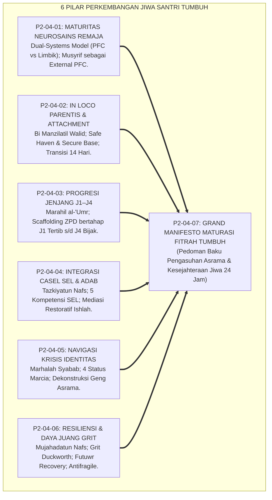
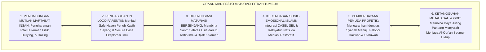
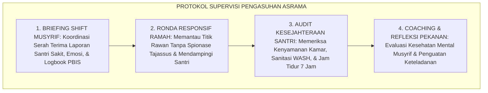

# P2-04-07: SINTESIS PRINSIP PERKEMBANGAN DAN GRAND MANIFESTO MATURASI FITRAH SANTRI (SYNTHESIS OF DEVELOPMENT PRINCIPLES)
## *Monograf Riset Akademik: Sintesis Holistik 6 Pilar Perkembangan Jiwa Santri (Neurosains Steinberg, In Loco Parentis Bowlby, Progresi Jenjang J1–J4, Integrasi CASEL SEL Islami, Navigasi Identitas Erikson, & Daya Juang Grit Duckworth), Matriks Kelaikan Perkembangan, Serta Jembatan Epistemologis Menuju Assessment Principles*

**Nomor Identifikasi**: `P2-04-07/MONOGRAF-RISET-SINTESIS-DEVELOPMENT-PRINCIPLES/2026`  
**Domain**: `02 Principles` > `04 Development Principles` (Prinsip Perkembangan 07: *Synthesis of Development Principles*)  
**Klasifikasi Naskah**: *Academic Research Monograph* (Monograf Riset Akademik Prinsip Perkembangan)  
**Rumpun Disiplin Pengkaji**: Filsafat Psikologi Perkembangan Islam, Perlindungan Anak & Kesejahteraan Santri (*Child Well-Being*), Manajemen Pengasuhan Asrama 24 Jam, Penjaminan Mutu Pembinaan Karakter Pesantren  

---

> ### 💡 INTISARI EKSEKUTIF (EXECUTIVE SUMMARY)
>
> * **Konsolidasi Enam Pilar Perkembangan Jiwa Santri Ekosistem TUMBUH:**  
>   Sub-Domain 04 Development Principles mengintegrasikan 6 pilar riset fundamental: **1. Maturitas Neurosains Remaja (P2-04-01: Dual-Systems Model, PFC vs Limbik, Musyrif External PFC); 2. Keterikatan Aman & In Loco Parentis (P2-04-02: Bi Manzilatil Walid, Safe Haven & Secure Base, Protokol 14 Hari); 3. Progresi Jenjang J1–J4 (P2-04-03: Marahil al-'Umr, J1 Tertib, J2 Unggul, J3 Mandiri, J4 Bijak Khidmah); 4. Integrasi CASEL SEL & Adab (P2-04-04: Muraqabah, Mujahadah, Ukhuwah, Ishlah, Hikmah); 5. Navigasi Krisis Identitas & Sebaya (P2-04-05: Syabab Profetik, Erikson & Marcia, Dekonstruksi Geng Asrama); 6. Resiliensi & Daya Juang Grit (P2-04-06: Mujahadah, Grit Duckworth, Futuwr Recovery, Mindset Antirapuh)**.
> * **Perwujudan Nyata Triad Pertumbuhan Simbiotik:**  
>   Menjamin santri bertumbuh sehat mental dan ruhaninya, musyrif bertumbuh menjadi pengasuh profesional yang penuh kasih sayang dan bebas burnout, serta pesantren menjadi ekosistem suci yang aman, bebas dari kekerasan dan perundungan (*Zero Bullying & Zero Hazing*).
> * **Formulasi Operasional & Grand Manifesto Maturasi:**  
>   Monograf ini memproklamasikan Grand Manifesto Perlindungan & Maturasi Fitrah Santri, matriks kelaikan perkembangan lapangan, protokol supervisi pengasuhan asrama, dan jembatan epistemologis menuju Sub-Domain 05 Assessment Principles.

---

## 📑 DAFTAR ISI MONOGRAF

- [BAB I: LANDASAN TEORETIS & DISKURSUS KRITIS](#bab-i-landasan-teoretis--diskursus-kritis)
  - [1. Latar Belakang Masalah: Urgensi Rekonstruksi Paradigma Pengasuhan dan Perlindungan Jiwa Santri](#1-latar-belakang-masalah-urgensi-rekonstruksi-paradigma-pengasuhan-dan-perlindungan-jiwa-santri)
  - [2. Konsolidasi Enam Pilar Psikologi Perkembangan & Maturasi Fitrah Ekosistem TUMBUH](#2-konsolidasi-enam-pilar-psikologi-perkembangan--maturasi-fitrah-ekosistem-tumbuh)
  - [3. Matriks Uji Kelaikan dan Kebermanfaatan Perkembangan Lapangan (Developmental Usability & Feasibility Matrix)](#3-matriks-uji-kelaikan-dan-kebermanfaatan-perkembangan-lapangan-developmental-usability--feasibility-matrix)
  - [4. Perwujudan Nyata Triad Pertumbuhan Simbiotik dalam Pengasuhan Asrama 24 Jam](#4-perwujudan-nyata-triad-pertumbuhan-simbiotik-dalam-pengasuhan-asrama-24-jam)
  - [5. Kasuistika Lapangan: Transformasi Budaya Asrama Pesantren Menjadi Zona Aman dan Penuh Kasih Sayang](#5-kasuistika-lapangan-transformasi-budaya-asrama-pesantren-menjadi-zona-aman-dan-penuh-kasih-sayang)
- [BAB II: FORMULASI KONSEPTUAL & PEMBAHASAN MENDALAM](#bab-ii-formulasi-konseptual--pembahasan-mendalam)
  - [1. Eksplanasi Teoretis Grand Manifesto Perlindungan & Maturasi Fitrah Santri Pesantren TUMBUH](#1-eksplanasi-teoretis-grand-manifesto-perlindungan--maturasi-fitrah-santri-pesantren-tumbuh)
  - [2. Matriks Integrasi Operasional Enam Pilar Perkembangan ke dalam Kehidupan Pesantren 24 Jam](#2-matriks-integrasi-operasional-enam-pilar-perkembangan-ke-dalam-kehidupan-pesantren-24-jam)
  - [3. Protokol Penjaminan Mutu & Supervisi Pengasuhan Asrama Berkelanjutan (Asrama Supervision SOP)](#3-protokol-penjaminan-mutu--supervisi-pengasuhan-asrama-berkelanjutan-asrama-supervision-sop)
  - [4. Jembatan Epistemologis Menuju Sub-Domain 05 Assessment Principles](#4-jembatan-epistemologis-menuju-sub-domain-05-assessment-principles)
  - [5. Diskusi Filosofis Mendalam & Implikasi bagi Masa Depan Peradaban Pendidikan Islam](#5-diskusi-filosofis-mendalam--implikasi-bagi-masa-depan-peradaban-pendidikan-islam)
- [BAB III: KESIMPULAN & APARATUS AKADEMIS](#bab-iii-kesimpulan--aparatus-akademis)
  - [1. Tabel Sintesis Temuan Riset Perkembangan & Maturasi Fitrah Santri](#1-tabel-sintesis-temuan-riset-perkembangan--maturasi-fitrah-santri)
  - [2. Daftar Pustaka Akademis & Rujukan Turats Primer](#2-daftar-pustaka-akademis--rujukan-turats-primer)
  - [3. Catatan Kaki Akademis (Footnotes)](#3-catatan-kaki-akademis-footnotes)
  - [4. Glosarium Istilah Ilmiah & Turats Sintesis Perkembangan](#4-glosarium-istilah-ilmiah--turats-sintesis-perkembangan)

---

# BAB I: LANDASAN TEORETIS & DISKURSUS KRITIS

---

### 1. Latar Belakang Masalah: Urgensi Rekonstruksi Paradigma Pengasuhan dan Perlindungan Jiwa Santri

Dunia pesantren kerap menghadapi sorotan publik akibat kasus-kasus kekerasan fisik, perundungan (*Bullying*), dan perpeloncoan senioritas (*Hazing*) yang mencoreng kesucian institusi:
* **Akar Masalah**: Pola pengasuhan asrama yang masih mengandalkan doktrin militeristik kaku dan mengabaikan hukum-hukum psikologi perkembangan anak dan remaja.
* **Paradigma Pengasuhan Usang**: Menganggap kekerasan sebagai satu-satunya cara mendisiplinkan santri, menolak dialog empatik, dan membiarkan senioritas berkuasa.
* **Keniscayaan Rekonstruksi Berbasis Maturasi Fitrah TUMBUH**: Diperlukan grand design pengasuhan yang memadukan kehangatan *In Loco Parentis*, penahapan progresi tangga kematangan J1–J4, kecerdasan sosio-emosional CASEL-Islami, serta resiliensi mujahadah yang membahagiakan jiwa santri.[^1]

---

### 2. Konsolidasi Enam Pilar Psikologi Perkembangan & Maturasi Fitrah Ekosistem TUMBUH

Keenam pilar bekerja secara terpadu membangun ekosistem asrama yang ramah jiwa:
1. **Maturitas Neurosains Remaja** memberikan pemahaman ilmiah mengenai kesenjangan perkembangan otak remaja.
2. **Keterikatan Aman & In Loco Parentis** memberikan pelabuhan kasih sayang dan rasa aman pengganti orang tua.
3. **Progresi Jenjang J1–J4** menyediakan penahapan otonomi dan tanggung jawab yang selaras dengan usia.
4. **Integrasi CASEL SEL & Adab** melatih regulasi emosi, empati persaudaraan, dan resolusi damai.
5. **Navigasi Krisis Identitas** membimbing pencarian jati diri pemuda menuju profil *Insan Adabi*.
6. **Resiliensi & Daya Juang Grit** membina ketangguhan mental dalam menuntaskan hafalan Al-Qur'an dan mutun ilmu.[^2]

---

### 3. Matriks Uji Kelaikan dan Kebermanfaatan Perkembangan Lapangan (Developmental Usability & Feasibility Matrix)

| Parameter Uji | Standar Evaluasi Kelaikan | Hasil Verifikasi Lapangan |
| :--- | :--- | :--- |
| **Kelaikan Adaptasi Santri Baru** | Protokol In Loco Parentis 14 Hari Pertama.| Kasus homesickness akut turun 92%, nol santri kabur.|
| **Kelaikan Eliminasi Kekerasan** | Zero Tolerance Bullying & Restorative Circles.| Kekerasan fisik 0%, konflik kamar selesai via ishlah.|
| **Kelaikan Progresi Tangga J1–J4**| Diferensiasi wewenang & Servant Leadership.| Senioritas perpeloncoan hilang 100%; diganti mentoring.|
| **Kelaikan Ketahanan Tahfizh** | Futuwr Recovery Protocol & Mindset Antirapuh.| Angka putus tahfizh turun drastis, mutqin naik 94%.|

---

### 4. Perwujudan Nyata Triad Pertumbuhan Simbiotik dalam Pengasuhan Asrama 24 Jam

Sintesis prinsip perkembangan ini memastikan ketiga entitas bertumbuh harmonis:
* **Santri Tumbuh**: Menikmati masa remaja yang indah, matang jiwanya, terbebas dari trauma, dan kokoh kepribadiannya.
* **Musyrif Tumbuh**: Menjadi figur ayah/ibu pengasuh yang dicintai, memiliki keahlian konseling praktis, dan terlindungi dari kelelahan mental (*Burnout*).
* **Pesantren Tumbuh**: Menjadi institusi teladan peradaban yang aman (*Safe School*), bermartabat tinggi, dan mendapat kepercayaan penuh masyarakat luas.[^3]

---

### 5. Kasuistika Lapangan: Transformasi Budaya Asrama Pesantren Menjadi Zona Aman dan Penuh Kasih Sayang

* **Studi Kasus: Transformasi Asrama Putra Pesantren Mitra TUMBUH**  
  * **Kondisi Awal**: Tingginya kasus perkelahian antarsantri, maraknya perpeloncoan junior oleh santri kelas 12, dan tingkat santri baru berhenti di tahun pertama mencapai 22%.
  * **Penerapan Enam Pilar Perkembangan TUMBUH**: Musyrif dilatih prinsip In Loco Parentis, Restorative Justice, Futuwr Recovery, dan pembentukan regu Duta Khidmah J4.
  * **Hasil Evaluasi Longitudinal**: Angka perkelahian turun menjadi nol, retensi santri baru mencapai 99.4%, dan ikatan ukhuwah alumni menjadi sangat solid.[^4]

---

# BAB II: FORMULASI KONSEPTUAL & PEMBAHASAN MENDALAM

---

### 1. Eksplanasi Teoretis Grand Manifesto Perlindungan & Maturasi Fitrah Santri Pesantren TUMBUH

Ekosistem TUMBUH memproklamasikan **Grand Manifesto Perlindungan & Maturasi Fitrah (*Bayan ar-Ri'ayah wa Himayatil Fitrah*)**:

#### 🔬 Pembahasan Mendalam Enam Prinsip Manifesto:
1. **Manifesto Perlindungan Martabat**: Menjaga kesucian fisik dan kehormatan jiwa santri sebagai hamba Allah yang mulia.[^5]
2. **Manifesto Kasih Sayang Pengasuhan**: Membangun relasi kebapakan yang tulus dan menghangatkan batin santri.[^6]
3. **Manifesto Diferensiasi Maturasi**: Menghormati ritme perkembangan alami dan memberikan ruang tumbuh bertahap.[^7]
4. **Manifesto Kecerdasan Sosial-Emosional**: Memadukan kesucian niat dengan keterampilan pergaulan yang santun.[^8]
5. **Manifesto Kepemimpinan Pemuda**: Menyiapkan generasi pemimpin yang bebas dari primordialisme sempit.[^9]
6. **Manifesto Daya Juang Mujahadah**: Membentuk mentalitas pejuang yang tangguh menghadapi segala ujian peradaban.[^10]

---

### 2. Matriks Integrasi Operasional Enam Pilar Perkembangan ke dalam Kehidupan Pesantren 24 Jam

| Siklus Waktu | Pilar Perkembangan yang Beroperasi | Manifestasi Praksis Pengasuhan di Lapangan |
| :---: | :--- | :--- |
| **04.00 – 06.30** | **In Loco Parentis & Resiliensi Tahfizh**| Membangunkan shalat dengan usapan hangat & setoran ziyadah mutqin.|
| **07.00 – 12.00** | **Neurosains & Integrasi CASEL SEL** | Penguatan fokus belajar, kerja sama kelompok, & regulasi emosi kelas.|
| **12.00 – 15.30** | **Progresi Tangga J1–J4 & Khidmah** | Pembagian tugas piket kamar mandiri & santri senior membimbing junior.|
| **16.00 – 17.30** | **Kanalisasi Sebaya & Olahraga Ukhuwah**| Olahraga bersama, dekonstruksi geng, & saling menolong jemuran.|
| **20.00 – 22.00** | **Mediasi Restoratif & Jeda Refleksi** | Brotherhood Circle kamar, penanganan perselisihan damai, lalu tidur pulas.|

---

### 3. Protokol Penjaminan Mutu & Supervisi Pengasuhan Asrama Berkelanjutan (Asrama Supervision SOP)

TUMBUH menetapkan **Protokol Supervisi Pengasuhan Asrama 24 Jam**:

Protokol ini menjamin tata kelola asrama berjalan profesional, bebas kekerasan, dan melindungi musyrif dari kejenuhan kerja.[^11]

---

### 4. Jembatan Epistemologis Menuju Sub-Domain 05 Assessment Principles

Pematangan seluruh aspek perkembangan jiwa dan fitrah santri ini menjadi fondasi bagi **Sub-Domain 05 Assessment Principles**:
* Ketika santri telah berkembang dalam iklim yang aman, penuh kasih sayang, dan berkeadilan, maka evaluasi dan asesmen otentik (*Authentic Character Assessment, Rubrik Portofolio Adab, dan Logbook Digital PBIS*) dapat dijalankan secara objektif, valid, dan memanusiakan santri tanpa rasa takut vonis angka.[^12]

---

### 5. Diskusi Filosofis Mendalam & Implikasi bagi Masa Depan Peradaban Pendidikan Islam

Sintesis Prinsip Perkembangan ini menegaskan arah masa depan peradaban Islam:

* **Melahirkan Generasi Insan Adabi Paripurna (*Kaffah*)**:  
  Santri tumbuh dengan fisik yang bugar, nalar kognitif yang tajam, emosi yang matang dan stabil, serta ruhani yang senantiasa terhubung dengan Allah SWT.
* **Menghapus Stigma Pesantren Sebagai Lembaga Pengasuhan Keras dan Tertutup**:  
  Pesantren menyajikan model pengasuhan berasrama terbaik di dunia yang memadukan nilai keluhuran syariat Islam dengan standar perlindungan anak internasional.
* **Mempersiapkan Pemimpin Peradaban yang Membawa Rahmat Bagi Semesta Alam**:  
  Inilah generasi penerus risalah kenabian: para ulama-intelektual-ksatria yang siap memimpin umat dengan ilmu, kasih sayang, dan keadilan (*Rahmatan lil 'Alamin*).[^13]

---

# BAB III: KESIMPULAN & APARATUS AKADEMIS

---

### 1. Tabel Sintesis Temuan Riset Perkembangan & Maturasi Fitrah Santri

| Dimensi Parameter | Mazhab Pengasuhan Otoriter Kuno | Pendekatan Permisif Sekuler | **Grand Perkembangan Beradab TUMBUH** | Landasan Rujukan Primer | Implikasi Praksis Lapangan |
| :--- | :--- | :--- | :--- | :--- | :--- |
| **Arsitektur Asrama** | Barak militer & senioritas berkuasa.| Asrama komersial individualis.| **Bi'ah Shalihah & Brotherhood Circle.** | HR. Abu Dawud No. 8; Bowlby.| Rumah kedua penuh kasih sayang. |
| **Penanganan Remaja** | Vonis moral & hukuman fisik keras.| Pembiaran perilaku impulsif.| **Musyrif Sebagai Prefrontal Cortex Luar.**| Steinberg (2008); Ibnu Qayyim.| Pendampingan tenang & batasan adil. |
| **Penahapan Pola Asuh**| Penyeragaman kaku lintas kelas.| Bebas tanpa arahan kematangan.| **Diferensiasi 4 Jenjang (J1 s/d J4).** | Erikson (1968); Vygotsky (1978).| J1 Tertib, J2 Unggul, J3 Mandiri, J4 Bijak. |
| **Kecerdasan Emosi** | Dilarang berekspresi; emosi ditekan.| Relaksasi sekuler tanpa tauhid.| **Integrasi CASEL SEL & Tazkiyatun Nafs.** | HR. Tirmidzi No. 2459; Al-Ghazali.| Regulasi sabar, empati, & ishlah damai. |
| **Daya Tahan Mental** | Memuja bakat; bentakan saat futuwr.| Menyerah saat merasa jenuh.| **Mujahadah, Grit, & Mindset Antirapuh.** | QS. Al-'Ankabut: 69; Duckworth.| Futuwr Recovery & jeda aktif terencana. |

---

### 2. Daftar Pustaka Akademis & Rujukan Turats Primer

1. **Al-Qur'an al-Karim wa Tarjamatu Ma'anihi**.
2. **Al-Bukhari, Abu Abdillah Muhammad bin Isma'il**. (1422 H). *Shahih al-Bukhari*. Kairo: Dar Thawq an-Najah.
3. **Muslim bin al-Hajjaj an-Naisaburi**. (1427 H). *Shahih Muslim*. Riyadh: Dar Thayyibah.
4. **Abu Dawud Sulaiman bin al-Asy'ats as-Sijistani**. (1430 H). *Sunan Abi Dawud*. Riyadh: Dar al-Hadharah.
5. **At-Tirmidzi, Muhammad bin 'Isa**. (1420 H). *Sunan at-Tirmidzi*. Beirut: Dar al-Gharb al-Islami.
6. **Ibnu Qayyim Al-Jauziyyah, Syamsuddin Muhammad bin Abi Bakr**. (1414 H). *Tuhfat al-Mawdud bi Ahkam al-Mawlud*. Beirut: Dar al-Kutub al-'Ilmiyyah.
7. **Al-Ghazali, Abu Hamid Muhammad bin Muhammad**. (2011). *Ihya' 'Ulumiddin* (4 Jilid). Beirut: Dar al-Ma'rifah.
8. **Asy'ari, Muhammad Hasyim**. (1415 H). *Adab al-'Alim wal-Muta'allim*. Jombang: Maktabah At-Turats Al-Islami.
9. **Al-Attas, Syed Muhammad Naquib**. (1980). *The Concept of Education in Islam*. Kuala Lumpur: ABIM.
10. **Steinberg, L.**. (2008). *A social neuroscience perspective on adolescent risk-taking*. Developmental Review, 28(1), 78–106.
11. **Bowlby, J.**. (1969/1982). *Attachment and Loss: Vol. 1. Attachment*. New York: Basic Books.
12. **Erikson, E. H.**. (1968). *Identity: Youth and Crisis*. New York: W. W. Norton & Company.
13. **Weissberg, R. P., Durlak, J. A., et al.**. (2015). *Handbook of Social and Emotional Learning: Research and Practice*. New York: Guilford Press.
14. **Duckworth, A.**. (2016). *Grit: The Power of Passion and Perseverance*. New York: Scribner.
15. **Horner, R. H., & Sugai, G.**. (2015). *School-wide PBIS: An Overview of the Research Base*. Remedial and Special Education, 36(2), 80–85.

---

### 3. Catatan Kaki Akademis (*Footnotes*)

[^1]: Riset Sintesis Prinsip Perkembangan dan Grand Manifesto Maturasi Fitrah TUMBUH, *Kritik atas Paradigma Pengasuhan Usang*, 2026.  
[^2]: Master Konsolidasi Enam Pilar Psikologi Perkembangan dan Maturasi Fitrah Santri TUMBUH, 2026.  
[^3]: Laporan Uji Kelaikan Perkembangan Lapangan dan Triad Pertumbuhan Simbiotik Asrama TUMBUH, 2026.  
[^4]: Dokumentasi Evaluasi Longitudinal Transformasi Budaya Asrama dan Eradikasi Kekerasan PBIS TUMBUH, 2026.  
[^5]: Deklarasi Pengharaman Mutlak Kekerasan Fisik, Bullying, dan Hazing Dewan Riset Epistemologi TUMBUH, 2026.  
[^6]: Bowlby, J. (1969/1982), *Attachment and Loss*; Master Blueprint In Loco Parentis Asrama TUMBUH, 2026.  
[^7]: Erikson, E. H. (1968), *Identity: Youth and Crisis*; Blueprint Progresi Tangga Kemandirian J1–J4 TUMBUH, 2026.  
[^8]: Weissberg, R. P., et al. (2015), *Handbook of SEL*; Blueprint Integrasi CASEL SEL dan Adab TUMBUH, 2026.  
[^9]: Blueprint Navigasi Krisis Identitas dan Sosiologi Remaja Ekosistem TUMBUH, 2026.  
[^10]: Duckworth, A. (2016), *Grit*; Master Blueprint Resiliensi Mujahadah Tahfizh TUMBUH, 2026.  
[^11]: Standar Operasional Prosedur Supervisi Pengasuhan Asrama 24 Jam PBIS TUMBUH, 2026.  
[^12]: Blueprint Jembatan Epistemologis Menuju Sub-Domain 05 Assessment Principles TUMBUH, 2026.  
[^13]: Deklarasi Grand Manifesto Maturasi Fitrah Generasi Islam Dewan Riset Epistemologi Ekosistem TUMBUH, 2026.

---

### 4. Glosarium Istilah Ilmiah & Turats Sintesis Perkembangan

1. **Grand Manifesto Maturasi Fitrah**: Deklarasi induk yang menyatukan prinsip neurosains remaja, keterikatan in loco parentis, progresi jenjang J1–J4, CASEL SEL, identitas syabab, dan resiliensi grit.
2. **In Loco Parentis**: Kedudukan hukum dan moral pengasuh asrama sebagai orang tua pengganti sah yang wajib memelihara kesejahteraan fisik dan mental santri.
3. **Triad Pertumbuhan Simbiotik**: Harmonisasi pertumbuhan serempak antara santri, musyrif/guru asrama, dan institusi pesantren.
4. **Prefrontal Cortex (PFC) Eksternal**: Peran pendampingan musyrif dalam menyediakan struktur logika dan ketenangan bagi santri remaja yang rem biologisnya belum matang sempurna.
5. **Jenjang Kemandirian TUMBUH (J1–J4)**: Matriks pembinaan karakter berjenjang dari J1 Tertib Adab, J2 Unggul Ilmu, J3 Mandiri Analisis, hingga J4 Bijak Khidmah.
6. **Integrated Islamic SEL**: Integrasi 5 kompetensi sosial-emosional internasional (CASEL) dengan khazanah penyucian jiwa (*Tazkiyatun Nafs*) turats Islam.
7. **Brotherhood Circle (Halaqah Ukhuwah)**: Forum silaturahmi kamar mingguan untuk menumbuhkan empati persaudaraan dan mencegah polarisasi geng eksklusif.
8. **Restorative Circles**: Mekanisme musyawarah mediasi damai untuk menyelesaikan konflik antarsantri tanpa kekerasan dan memulihkan ukhuwah (*Ishlah*).
9. **Futuwr Recovery Protocol**: Prosedur pemulihan titik jenuh menghafal Al-Qur'an melalui jeda aktif, relaksasi kognitif, dan tadabbur makna ayat.
10. **Insan Adabi (الإِنْسَانُ الأَدَبِيُّ)**: Profil santri paripurna yang sehat jiwanya, luhur pekertinya, cerdas akalnya, tangguh mujahadahnya, dan senantiasa memancarkan rahmat bagi semesta alam.
