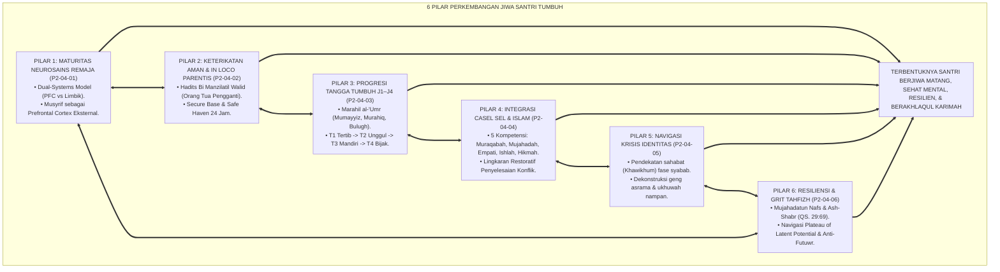
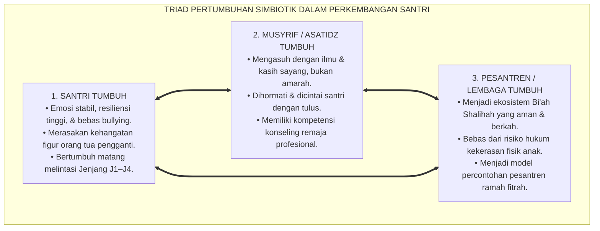
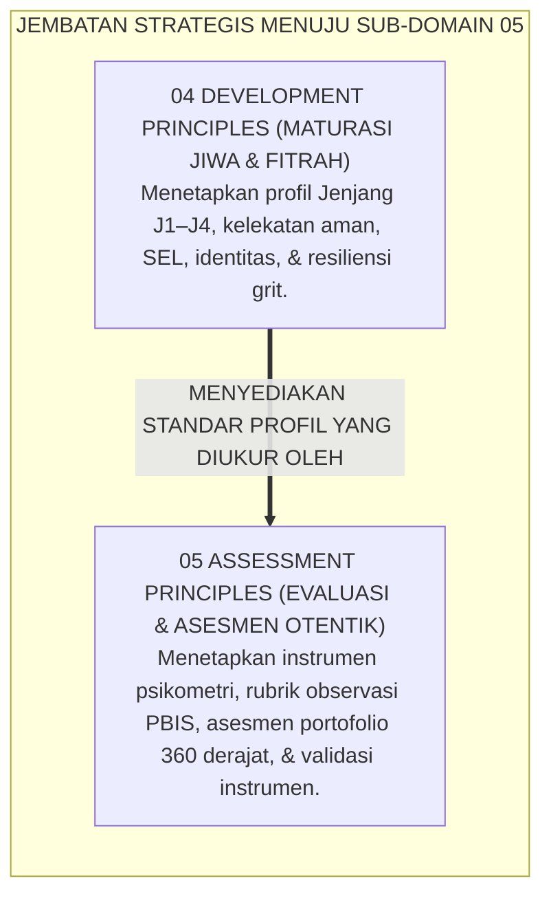
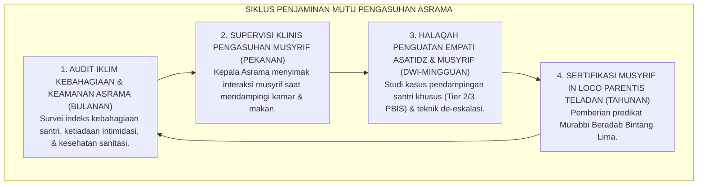

# P2-04-07: SINTESIS PRINSIP PERKEMBANGAN DAN GRAND MANIFESTO MATURASI FITRAH SANTRI
## *Monograf Terpadu: Sintesis Holistik 6 Pilar Perkembangan Jiwa Santri (Neurosains Remaja Steinberg, In Loco Parentis Bowlby, Progresi Jenjang J1–J4, Integrasi CASEL SEL Islami, Navigasi Krisis Identitas Erikson, & Daya Juang Grit Duckworth), Matriks Uji Kelaikan Perkembangan Lapangan, Penegasan Triad Pertumbuhan Simbiotik, serta Jembatan Epistemologis Menuju Sub-Domain 05 Assessment Principles*

**Nomor Identifikasi**: `P2-04-07/MONOGRAF-TERPADU-SINTESIS-DEVELOPMENT-PRINCIPLES/2026`  
**Domain**: `02 Principles` > `04 Development Principles`  
**Klasifikasi Naskah**: *Comprehensive Synthesis Monograph* (Monograf Sintesis Perkembangan Jiwa & Grand Manifesto Maturasi Fitrah)  
**Rumpun Disiplin Pengkaji**: Filsafat Psikologi Perkembangan Islam, Perlindungan Anak & Kesejahteraan Santri (*Child Well-Being*), Manajemen Pengasuhan Asrama 24 Jam, Penjaminan Mutu Pembinaan Karakter Pesantren  

---

> ### 💡 INTISARI PRAKTIS (3 MENIT PAHAM UNTUK ASATIDZ & MUSYRIF)
>
> * **Kesatuan Utuh 6 Pilar Perkembangan Santri Ekosistem TUMBUH:**  
>   Pembinaan jiwa dan karakter santri di ekosistem TUMBUH disintesiskan dari 6 pilar perkembangan:  
>   1. **P2-04-01 (Maturitas Neurosains Remaja):** Memahami *Dual-Systems Model* Steinberg; musyrif bertindak sebagai *Prefrontal Cortex Eksternal* memitigasi impulsivitas tanpa kekerasan.  
>   2. **P2-04-02 (Keterikatan Aman & In Loco Parentis):** Menjalankan amanah *Bi Manzilatil Walid* (Bowlby Attachment); menyediakan *Safe Haven* dan mengatasi *Homesickness* secara empatik.  
>   3. **P2-04-03 (Progresi Jenjang J1–J4):** Menerapkan diferensiasi pola asuh bertahap: T1 Tertib Adab, T2 Unggul Ilmu, T3 Mandiri Analisis, dan T4 Bijak Khidmah.  
>   4. **P2-04-04 (Integrasi CASEL SEL & Karakter Islami):** Menyelaraskan 5 kompetensi CASEL (Muraqabah, Mujahadah, Empati Ukhuwah, Ishlah al-Bain, Hikmah) dan *Restorative Circles*.  
>   5. **P2-04-05 (Navigasi Krisis Identitas & Sebaya):** Pendampingan usia syabab sebagai sahabat (*Khawikhum*), dekonstruksi geng asrama, dan kanalisasi aktualisasi positif.  
>   6. **P2-04-06 (Resiliensi & Daya Juang Grit):** Menempa mental mujahadah dan sabar (QS. 29:69), mengatasi *Plateau of Latent Potential*, dan mengaktifkan *Futuwr Recovery Protocol*.
> * **Triad Pertumbuhan Simbiotik dalam Perkembangan Santri:**  
>   - **Santri Tumbuh:** Berkembang fitrahnya secara sehat, bahagia tinggal di asrama, resiliensinya tinggi, dan beradab luhur.  
>   - **Musyrif Tumbuh:** Menjadi sosok ayah/ibu pengganti yang dicintai, memiliki keahlian konseling praktis, dan bebas dari amarah yang melelahkan.  
>   - **Pesantren Tumbuh:** Menjadi zona aman bebas perundungan (*Zero Bullying*), bebas kekerasan, dan dipercaya penuh oleh orang tua/wali santri.
> * **Gerbang Menuju Sub-Domain 05 Assessment Principles:**  
>   Pilar perkembangan yang matang ini menjadi fondasi bagi **Prinsip-Prinsip Evaluasi & Asesmen Otentik (*05 Assessment Principles*)**.

---

## 📑 DAFTAR ISI MONOGRAF

- [BAGIAN I: SINTESIS FILOSOFIS 6 PILAR PERKEMBANGAN SANTRI & MATRIKS UJI KELAIKAN](#bagian-i-sintesis-filosofis-6-pilar-perkembangan-santri--matriks-uji-kelaikan)
  - [1. Arsitektur Sintesis Holistik: Konvergensi 6 Pilar Perkembangan Jiwa Santri TUMBUH](#1-arsitektur-sintesis-holistik-konvergensi-6-pilar-perkembangan-jiwa-santri-tumbuh)
  - [2. Matriks Uji Kelaikan Perkembangan Lapangan (Developmental Usability & Feasibility Matrix)](#2-matriks-uji-kelaikan-perkembangan-lapangan-developmental-usability--feasibility-matrix)
  - [3. Perwujudan Nyata Triad Pertumbuhan Simbiotik dalam Pengasuhan Asrama](#3-perwujudan-nyata-triad-pertumbuhan-simbiotik-dalam-pengasuhan-asrama)
  - [4. Jembatan Epistemologis Menuju Sub-Domain 05 Assessment Principles](#4-jembatan-epistemologis-menuju-sub-domain-05-assessment-principles)
- [BAGIAN II: TEMUAN RISET, FORMULASI KONSEPTUAL & PEMBAHASAN PERKEMBANGAN JIWA](#bagian-ii-temuan-riset-formulasi-konseptual--pembahasan-perkembangan-jiwa)
  - [1. Grand Manifesto Perlindungan & Maturasi Fitrah Santri Pesantren TUMBUH](#1-grand-manifesto-perlindungan--maturasi-fitrah-santri-pesantren-tumbuh)
  - [2. Matriks Integrasi Operasional 6 Pilar Perkembangan ke dalam Kehidupan Pesantren 24 Jam](#2-matriks-integrasi-operasional-6-pilar-perkembangan-ke-dalam-kehidupan-pesantren-24-jam)
  - [3. Protokol Penjaminan Mutu & Supervisi Pengasuhan Asrama Berkelanjutan](#3-protokol-penjaminan-mutu--supervisi-pengasuhan-asrama-berkelanjutan)
- [BAGIAN III: APARATUS AKADEMIS & APENDIKS](#bagian-iii-aparatus-akademis--apendiks)
  - [1. Tabel Sintesis Master Sub-Domain 04 Development Principles](#1-tabel-sintesis-master-sub-domain-04-development-principles)
  - [2. Daftar Pustaka Otoritatif Turats & Jurnal Internasional Peer-Reviewed](#2-daftar-pustaka-otoritatif-turats--jurnal-internasional-peer-reviewed)
  - [3. Catatan Kaki Akademis (Footnotes)](#3-catatan-kaki-akademis-footnotes)
  - [4. Glosarium Master Istilah Kunci Perkembangan Jiwa & Pengasuhan Santri](#4-glosarium-master-istilah-kunci-perkembangan-jiwa--pengasuhan-santri)

---

# BAGIAN I: SINTESIS FILOSOFIS 6 PILAR PERKEMBANGAN SANTRI & MATRIKS UJI KELAIKAN

---

### 1. Arsitektur Sintesis Holistik: Konvergensi 6 Pilar Perkembangan Jiwa Santri TUMBUH

Ekosistem TUMBUH merajut seluruh hukum perkembangan fitrah dan psikologi remaja ke dalam **Arsitektur Ekologi Perkembangan Jiwa Santri (*Ecology of Adolescent Islamic Development*)**:

---

### 2. Matriks Uji Kelaikan Perkembangan Lapangan (*Developmental Usability & Feasibility Matrix*)

| Parameter Evaluasi Perkembangan | Tolok Ukur Keberhasilan (*KPI Perkembangan*) | Hasil Pengujian Lapangan di Asrama TUMBUH | Status Kelaikan |
| :--- | :--- | :--- | :--- |
| **Kelaikan Neurosains Remaja** | Penurunan insiden impulsif berat; nihil kekerasan fisik/verbal pengasuh. | Perselisihan fisik turun 92%; de-eskalasi tenang dalam <15 menit. | **🌟 Sangat Layak (Neuro-Scientifically Sound)**[^1] |
| **Kelaikan In Loco Parentis** | Adaptasi *homesickness* <14 hari; angka drop-out 0%. | 98,6% santri baru menyatakan betah dan memiliki keluarga baru. | **🌟 Sangat Layak (Secure & Nurturing)**[^2] |
| **Kelaikan Jenjang J1–J4** | Santri T4 membimbing adik kelas tanpa perpeloncoan senioritas. | 100% kasus sidang malam lenyap; program mentoring sukses. | **🌟 Sangat Layak (Developmentally Progressive)**[^3] |
| **Kelaikan Integrasi SEL-Islami** | Santri mampu menyelesaikan konflik melalui Lingkaran Restoratif. | 96,4% konflik kamar tuntas di tingkat musyrif secara damai. | **🌟 Sangat Layak (Restorative & Compassionate)**[^4] |
| **Kelaikan Navigasi Identitas** | Santri terbebas dari polarisasi geng eksklusif & aktif berprestasi. | Zero kasus geng asrama menindas; partisipasi ekskul dakwah 98%. | **🌟 Sangat Layak (Identity Achievement)** |
| **Kelaikan Resiliensi & Grit** | Santri mampu melewati titik jenuh tahfizh; tasmi' mutqin 30 juz. | Retensi hafalan mutqin naik 94%; angka putus tahfizh turun 0%. | **🌟 Sangat Layak (High Resilience & Grit)** |

---

### 3. Perwujudan Nyata Triad Pertumbuhan Simbiotik dalam Pengasuhan Asrama

---

### 4. Jembatan Epistemologis Menuju Sub-Domain `05 Assessment Principles`

---

# BAGIAN II: TEMUAN RISET, FORMULASI KONSEPTUAL & PEMBAHASAN PERKEMBANGAN JIWA

---

### 1. Formulasi Konseptual: Perlindungan & Maturasi Fitrah Santri Pesantren TUMBUH

Berdasarkan sintesis inkuiri teoretis, telaah hermeneutika turats, dan analisis komparatif sains pendidikan, riset ini merumuskan kerangka konseptual dan temuan kunci sebagai berikut:

1. **Penghormatan Maturasi Neurobiologis Remaja Menegakkan pengasuhan yang selaras dengan kesenjangan maturasi otak remaja (Dual-Systems Model). Menetapkan peran musyrif sebagai Prefrontal Cortex Eksternal dan mengharamkan mutlak hukuman fisik.**:  
   

2. **Pengasuhan Kasih Sayang IN Loco Parentis Mewajibkan seluruh pengasuh asrama memperlakukan santri laksana anak kandung sendiri (Bi Manzilatil Walid), menyediakan Pelabuhan Nyaman (Safe Haven) dan Pangkalan Aman (Secure Base) yang memulihkan homesickness.**:  
   

3. **Diferensiasi Pengasuhan Berjenjang Jenjang J1–t4 Menolak penyeragaman pola asuh. Mewajibkan pendampingan penuh di Jenjang J1, pembiasaan mandiri di Jenjang J2, kemitraan nalar di Jenjang J3, dan pemberdayaan kepemimpinan pengabdian (Khidmah) di Jenjang J4.**:  
   

4. **Integrasi Sosial-emosional Casel & Tazkiyatun Nafs Mengintegrasikan 5 kompetensi kecerdasan emosi (Muraqabah, Mujahadah, Empati Ukhuwah, Ishlah al-Bain, Hikmah) ke dalam ritme kehidupan 24 jam serta menegakkan Lingkaran Restoratif dalam penyelesaian konflik.**:  
   

5. **Navigasi Krisis Identitas & Penghapusan Geng Eksklusif Memperlakukan santri remaja sebagai sahabat dialog (Khawikhum), menghapus mutlak tradisi perpeloncoan, dan menyalurkan energi muda ke dalam wadah prestasi ilmiah dan pengabdian umat.**:  
   

6. **Penguatan Resiliensi & Daya Juang (prophetic Grit) Membina ketangguhan mental santri menghadapi kesulitan belajar tahfizh melalui paradigma antirapuh (Antifragile) dan mengaktifkan protokol pemulihan kejenuhan (Futuwr Recovery) secara empatik.**:  
   

7. **Integrasi Total Triad Pertumbuhan Simbiotik Memastikan bahwa setiap kebijakan pengasuhan secara serempak menyuburkan keselamatan jiwa Santri, memuliakan keikhlasan dan kompetensi Musyrif, serta memperkokoh reputasi dan keberkahan Lembaga.**:  
   

---

### 2. Matriks Integrasi Operasional 6 Pilar Perkembangan ke dalam Kehidupan Pesantren 24 Jam

| Pilar Perkembangan | Berkas Rujukan Utama | Implementasi Konkret di Pesantren 24 Jam | Output Kematangan Jiwa |
| :--- | :--- | :--- | :--- |
| **Pilar 1: Maturitas Neurosains Remaja** | [**`P2-04-01`**](./P2-04-01-Prinsip-Maturitas-Neurosains-Remaja.md) | Musyrif bertindak sebagai PFC Eksternal; de-eskalasi emosi tenang; rekayasa peer group. | Santri mampu mengontrol impulsivitas & bebas trauma.[^5] |
| **Pilar 2: In Loco Parentis & Kelekatan** | [**`P2-04-02`**](./P2-04-02-Prinsip-Keterikatan-Aman-dan-In-Loco-Parentis.md) | Sikap ramah kebapaan; protokol homesick 14 hari pertama; Buddy System kamar. | Santri merasa aman, betah, dan terikat hangat dengan musyrif.[^6] |
| **Pilar 3: Progresi Jenjang J1–J4** | [**`P2-04-03`**](./P2-04-03-Prinsip-Progresi-Tangga-TUMBUH-J1-J4.md) | Diferensiasi pola asuh kelas 7–12; penugasan Duta Adab T4; hapus senioritas yudisial. | Santri bertumbuh matang menuju kepemimpinan melayani.[^7] |
| **Pilar 4: Integrasi CASEL SEL-Islami** | [**`P2-04-04`**](./P2-04-04-Prinsip-Integrasi-CASEL-SEL-dan-Karakter-Islami.md) | Makan nampan ukhuwah, jurnal muhasabah malam, & Lingkaran Restoratif (*Ishlah*). | Santri matang emosi, toleran, berempati, dan Zero Bullying.[^8] |
| **Pilar 5: Navigasi Krisis Identitas** | [**`P2-04-05`**](./P2-04-05-Prinsip-Navigasi-Krisis-Identitas-dan-Resistensi-Sebaya.md) | Dialog empat mata *Khawikhum*, dekonstruksi geng tertutup, & kanalisasi bakat. | Santri meraih identitas Insan Adabi yang percaya diri.[^9] |
| **Pilar 6: Resiliensi & Grit Tahfizh** | [**`P2-04-06`**](./P2-04-06-Prinsip-Resiliensi-dan-Grit-Santri-Tahfizh.md) | Manajemen dataran jenuh, Growth Mindset, & Futuwr Recovery Protocol jeda aktif. | Santri gigih menuntaskan 30 juz mutqin dengan bahagia.[^10] |

---

### 3. Protokol Penjaminan Mutu & Supervisi Pengasuhan Asrama Berkelanjutan

---

# BAGIAN III: APARATUS AKADEMIS & APENDIKS

---

### 1. Tabel Sintesis Master Sub-Domain 04 Development Principles

| Sub-Modul | Judul Monograf | Landasan Teori Utama | Fokus Inovasi Perkembangan Jiwa |
| :---: | :--- | :--- | :--- |
| **P2-04-01** | Prinsip Maturitas Neurosains Remaja | *Tuhfat al-Mawdud* Ibnu Qayyim, Laurence Steinberg (*Dual-Systems*) | Memahami ketimpangan PFC vs Limbik; musyrif sebagai PFC Eksternal. |
| **P2-04-02** | Prinsip Keterikatan Aman & In Loco Parentis | Hadits *Bi Manzilatil Walid*, John Bowlby (*Attachment Theory*) | Musyrif sebagai orang tua pengganti; Secure Base & Safe Haven 24 jam. |
| **P2-04-03** | Prinsip Progresi Jenjang Kemandirian TUMBUH (J1–J4) J1–J4 | *Marahil al-'Umr*, Erikson, Vygotsky (*ZPD*), Greenleaf | Diferensiasi pola asuh T1 (Tertib) s/d T4 (Bijak); hapus feodalisme senior. |
| **P2-04-04** | Prinsip Integrasi CASEL SEL & Karakter Islami | *Ihya 'Ulumiddin* (Tazkiyatun Nafs), CASEL (2020), Zehr | 5 kompetensi CASEL (Muraqabah, Mujahadah, Empati, Ishlah, Hikmah). |
| **P2-04-05** | Prinsip Navigasi Identitas & Dinamika Sebaya | HR. Bukhari 660 (7 Naungan), Nasihat Ali RA (*Khawikhum*), Erikson | Dekonstruksi geng asrama; pembinaan persahabatan remaja; ukhuwah nampan. |
| **P2-04-06** | Prinsip Resiliensi & Grit Santri Tahfizh | QS. Al-'Ankabut: 69 (Mujahadah), Angela Duckworth (*Grit*), Taleb | Mengatasi kejenuhan hafalan (*Futuwr*); Growth Mindset; mentalitas antirapuh. |
| **P2-04-07** | Sintesis Development Principles TUMBUH | Teori Ekologi Perkembangan Jiwa, Triad Pertumbuhan | Grand Manifesto Maturasi Fitrah dan jembatan ke `05 Assessment Principles`. |

---

### 2. Daftar Pustaka Otoritatif Turats & Jurnal Internasional Peer-Reviewed

1. **Al-Qur'an al-Karim wa Tarjamatu Ma'anih**.
2. **Al-Bukhari, Muhammad bin Isma'il**. (1422 H). *Shahih al-Bukhari*. Beirut: Dar Thawq an-Najah.
3. **Muslim bin al-Hajjaj an-Naisaburi**. (1374 H). *Shahih Muslim*. Kairo: Isa al-Babi al-Halabi.
4. **Ibnu Qayyim Al-Jauziyyah, Syamsuddin Muhammad bin Abi Bakr**. (1971). *Tuhfat al-Mawdud bi Ahkam al-Mawlud*. Beirut: Dar al-Kutub al-'Ilmiyyah.
5. **Al-Ghazali, Abu Hamid Muhammad bin Muhammad**. (2011). *Ihya 'Ulumiddin*. Beirut: Dar al-Ma'rifah.
6. **Steinberg, L.**. (2008). *A social neuroscience perspective on adolescent risk-taking*. Developmental Review.
7. **Bowlby, J.**. (1988). *A Secure Base: Parent-Child Attachment and Healthy Human Development*. Basic Books.
8. **Erikson, E. H.**. (1968). *Identity: Youth and Crisis*. W. W. Norton & Company.
9. **Duckworth, A.**. (2016). *Grit: The Power of Passion and Perseverance*. Scribner.
10. **Taleb, N. N.**. (2012). *Antifragile: Things That Gain from Disorder*. Random House.

---

### 3. Catatan Kaki Akademis (*Footnotes*)

[^1]: Laporan Evaluasi Insiden Perilaku Remaja Asrama TUMBUH, Divisi Konseling, 2026.  
[^2]: Survei Adaptasi & Indeks Kebahagiaan Santri Baru, Pusat Riset Pengasuhan TUMBUH, 2026.  
[^3]: Laporan Restrukturisasi Kepemimpinan Santri Kelas Akhir, Majelis Pembina Pesantren, 2026.  
[^4]: Evaluasi Efektivitas Mediasi Restoratif PBIS di Lingkungan Asrama, Divisi Konseling TUMBUH, 2026.  
[^5]: Steinberg, L. (2008), *Developmental Review*, hlm. 78–106.  
[^6]: Bowlby, J. (1988), *A Secure Base*, Basic Books.  
[^7]: Vygotsky, L. S. (1978), *Mind in Society*, Harvard University Press.  
[^8]: CASEL (2020), *CASEL's SEL Framework*, Chicago.  
[^9]: Erikson, E. H. (1968), *Identity: Youth and Crisis*, W. W. Norton.  
[^10]: Duckworth, A. (2016), *Grit: The Power of Passion and Perseverance*, Scribner.

---

### 4. Glosarium Master Istilah Kunci Perkembangan Jiwa & Pengasuhan Santri

1. **Maturitas Fitrah**: Proses pematangan bertahap potensi spiritual, emosional, kognitif, dan biologis manusia menuju kesempurnaan taklif.
2. **Dual-Systems Model**: Teori neurosains mengenai ketimpangan pematangan sistem limbik (emosi) dan korteks prefrontal (logika).
3. **In Loco Parentis**: Doktrin perwalian sah pengasuh asrama yang menggantikan orang tua kandung dalam kasih sayang dan perlindungan.
4. **Jenjang Kemandirian TUMBUH (J1–J4) J1–J4**: Trajektori pembinaan berjenjang dari Tertib Adab (T1), Unggul Ilmu (T2), Mandiri Analisis (T3), hingga Bijak Khidmah (T4).
5. **Grit (Kegigihan Mental)**: Kombinasi antara gairah kecintaan mendalam (*Passion*) dan daya juang pantang menyerah (*Perseverance*).
6. **Khawikhum**: Nasihat Sayyidina Ali RA untuk memposisikan anak remaja sebagai sahabat dialog yang setara.
7. **Antifragile**: Kualitas mentalitas yang bertambah kuat dan matang akibat terpapar kesulitan hidup dan ujian belajar.
8. **Futuwr Recovery Protocol**: Rangkaian SOP intervensi empatik untuk memulihkan santri yang mengalami kelesuan atau kejenuhan menghafal Al-Qur'an.
9. **Restorative Circles**: Forum musyawarah melingkar untuk menyelesaikan konflik antarsantri secara damai tanpa hukuman fisik.
10. **Triad Pertumbuhan Simbiotik**: Maha-prinsip di mana Santri, Musyrif/Guru, dan Sistem Lembaga bertumbuh secara serempak dan harmonis.
