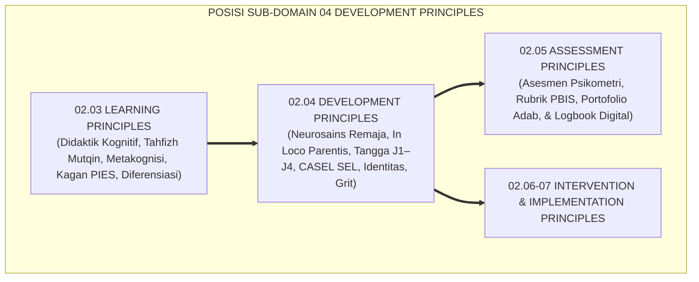
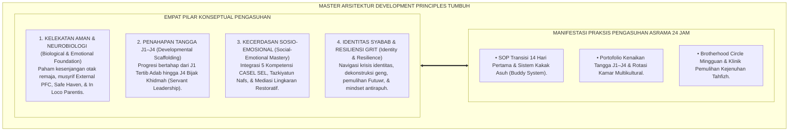
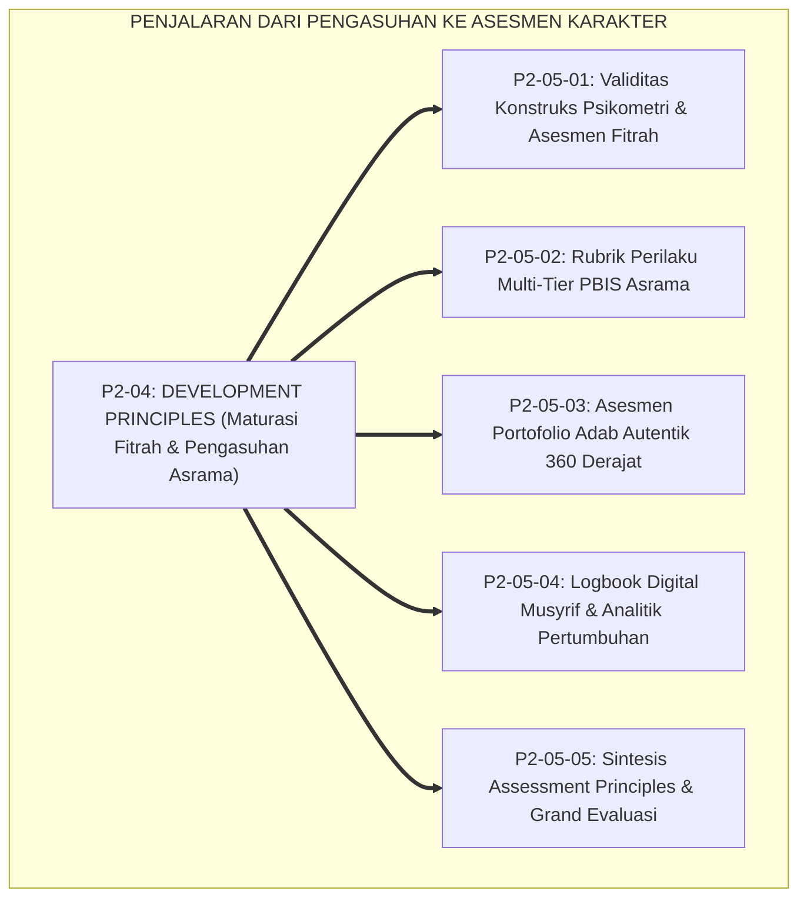

# P2-04: DEVELOPMENT PRINCIPLES (PRINSIP PERKEMBANGAN SANTRI) EKOSISTEM TUMBUH (MASTER DOKTRIN PENGASUHAN DAN MATURASI FITRAH)
## *Master Sub-Domain Monograph: Arsitektur Master Perkembangan Jiwa & Pengasuhan Asrama 24 Jam, Konsolidasi 6 Pilar Perkembangan (Maturitas Neurosains Remaja, In Loco Parentis Bowlby, Progresi Jenjang J1–J4, CASEL SEL Islami, Navigasi Identitas Erikson, & Daya Juang Grit Duckworth), Serta Gerbang Penjalaran Menuju Sub-Domain 05 Assessment Principles*

**Nomor Identifikasi**: `P2-04/MASTER-MONOGRAF-DEVELOPMENT-PRINCIPLES/2026`  
**Domain**: `02 Principles` > `04 Development Principles` (Master Sub-Domain Monograph)  
**Klasifikasi Naskah**: *Master Sub-Domain Research Monograph* (Dokumen Induk Perkembangan Jiwa & Pengasuhan Asrama)  
**Rumpun Disiplin Pengkaji**: Psikologi Perkembangan Islam (*'Ilm an-Nafs an-Numuwwi*), Neurosains Kognitif Remaja, Teori Kelekatan & Pengasuhan In Loco Parentis, Taksonomi Karakter Berbasis Fitrah, Ketahanan Mental & Resiliensi  

---

> ### 💡 INTISARI EKSEKUTIF (EXECUTIVE SUMMARY)
>
> * **Posisi Sub-Domain 04 Development Principles dalam Arsitektur TUMBUH:**  
>   Sebagai sub-domain keempat di Domain 02 Principles, Sub-Domain 04 menjawab *"Bagaimanakah hukum biologis dan psikologis perkembangan fitrah santri remaja bekerja melintasi usia 12–18 tahun, serta bagaimanakah musyrif dan asatidz menjalankan peran orang tua pengganti (In Loco Parentis) yang penuh kasih sayang untuk membimbing kematangan emosi, nalar, identitas diri, dan resiliensi melintasi Jenjang J1–J4?"*.
> * **Konsolidasi Master Doktrin Perkembangan Jiwa & Pengasuhan Asrama:**  
>   Dokumen induk ini mengintegrasikan seluruh 6 pilar riset sub-modul: **1. Maturitas Neurosains Remaja (P2-04-01: Dual-Systems Model, PFC vs Limbik, Musyrif External PFC); 2. Keterikatan Aman & In Loco Parentis (P2-04-02: Bi Manzilatil Walid, Safe Haven & Secure Base, Protokol 14 Hari); 3. Progresi Jenjang J1–J4 (P2-04-03: Marahil al-'Umr, J1 Tertib, J2 Unggul, J3 Mandiri, J4 Bijak Khidmah); 4. Integrasi CASEL SEL & Adab (P2-04-04: Muraqabah, Mujahadah, Ukhuwah, Ishlah, Hikmah); 5. Navigasi Krisis Identitas & Sebaya (P2-04-05: Syabab Profetik, Erikson & Marcia, Dekonstruksi Geng Asrama); 6. Resiliensi & Daya Juang Grit (P2-04-06: Mujahadah, Grit Duckworth, Futuwr Recovery, Mindset Antirapuh)**.
> * **Formulasi Operasional & Jembatan Epistemologis:**  
>   Monograf induk ini merumuskan matriks direktori monograf, matriks integrasi operasional pengasuhan 24 jam, dan alur penjalaran sistemik menuju Sub-Domain 05 Assessment Principles.

---

## 📑 DAFTAR ISI MONOGRAF

- [BAB I: LANDASAN TEORETIS & DISKURSUS KRITIS](#bab-i-landasan-teoretis--diskursus-kritis)
  - [1. Latar Belakang Masalah: Posisi Sub-Domain 04 Development Principles dalam Taksonomi 11 Domain TUMBUH](#1-latar-belakang-masalah-posisi-sub-domain-04-development-principles-dalam-taksonomi-11-domain-tumbuh)
  - [2. Integrasi Enam Pilar Kajian Perkembangan & Pengasuhan Asrama 24 Jam](#2-integrasi-enam-pilar-kajian-perkembangan--pengasuhan-asrama-24-jam)
  - [3. Rantai Kausalitas Perkembangan: Dari Kelekatan Aman Menuju Kematangan Kepemimpinan Khidmah](#3-rantai-kausalitas-perkembangan-dari-kelekatan-aman-menuju-kematangan-kepemimpinan-khidmah)
  - [4. Kebijakan Perlindungan Mutlak (Zero Tolerance Policy) dalam Praktik Pengasuhan Asrama](#4-kebijakan-perlindungan-mutlak-zero-tolerance-policy-dalam-praktik-pengasuhan-asrama)
  - [5. Kasuistika Lapangan: Uji Ketahanan Pengasuhan Beradab di Lingkungan Pesantren 24 Jam](#5-kasuistika-lapangan-uji-ketahanan-pengasuhan-beradab-di-lingkungan-pesantren-24-jam)
- [BAB II: FORMULASI KONSEPTUAL & PEMBAHASAN MENDALAM](#bab-ii-formulasi-konseptual--pembahasan-mendalam)
  - [1. Arsitektur Master Doktrin Development Principles Ekosistem TUMBUH](#1-arsitektur-master-doktrin-development-principles-ekosistem-tumbuh)
  - [2. Direktori Berkas Riset dan Matriks Rujukan Lengkap Sub-Domain 04](#2-direktori-berkas-riset-dan-matriks-rujukan-lengkap-sub-domain-04)
  - [3. Matriks Integrasi Operasional Enam Pilar Perkembangan ke dalam Siklus 24 Jam](#3-matriks-integrasi-operasional-enam-pilar-perkembangan-ke-dalam-siklus-24-jam)
  - [4. Alur Penjalaran Sistemik Menuju Sub-Domain 05 Assessment Principles](#4-alur-penjalaran-sistemik-menuju-sub-domain-05-assessment-principles)
  - [5. Diskusi Filosofis Mendalam & Implikasi bagi Masa Depan Peradaban Pendidikan Islam](#5-diskusi-filosofis-mendalam--implikasi-bagi-masa-depan-peradaban-pendidikan-islam)
- [BAB III: KESIMPULAN & APARATUS AKADEMIS](#bab-iii-kesimpulan--aparatus-akademis)
  - [1. Tabel Sintesis Temuan Riset Master Sub-Domain Development Principles](#1-tabel-sintesis-temuan-riset-master-sub-domain-development-principles)
  - [2. Daftar Pustaka Akademis & Rujukan Turats Primer](#2-daftar-pustaka-akademis--rujukan-turats-primer)
  - [3. Catatan Kaki Akademis (Footnotes)](#3-catatan-kaki-akademis-footnotes)
  - [4. Glosarium Istilah Ilmiah & Turats Master Development Principles](#4-glosarium-istilah-ilmiah--turats-master-development-principles)

---

# BAB I: LANDASAN TEORETIS & DISKURSUS KRITIS

---

### 1. Latar Belakang Masalah: Posisi Sub-Domain 04 Development Principles dalam Taksonomi 11 Domain TUMBUH

Jika **Sub-Domain 03 Learning Principles** telah merumuskan bagaimana akal dan memori santri menyerap ilmu di kelas dan halaqah, maka **Sub-Domain 04 Development Principles** membedah bagaimana seluruh jiwa, emosi, identitas sosial, dan karakter santri bertumbuh di luar jam kelas selama 24 jam di asrama:
* **Hukum-Hukum Pertumbuhan Jiwa Santri**: Menguraikan dinamika transisi dari masa kanak-kanak (*Tamyiz*) menuju pubertas (*Murahaqah*) hingga kematangan baligh (*Bulughul Asyudd*).
* **Standarisasi Pengasuhan Asrama 24 Jam**: Mengubah asrama dari sekadar tempat tidur menjadi rahim peradaban (*Bi'ah Shalihah*) yang memancarkan kehangatan *In Loco Parentis*.[^1]

---

### 2. Integrasi Enam Pilar Kajian Perkembangan & Pengasuhan Asrama 24 Jam

Master doktrin ini mengintegrasikan seluruh 6 sub-modul riset di Sub-Domain 04 Development Principles:
* *P2-04-01 (Maturitas Neurosains Remaja)*: Dual-Systems Model Steinberg, PFC vs Limbik, Musyrif External PFC.
* *P2-04-02 (Keterikatan Aman & In Loco Parentis)*: Hadits Bi Manzilatil Walid, Safe Haven & Secure Base, Transisi 14 Hari.
* *P2-04-03 (Progresi Jenjang J1–J4)*: Marahil al-'Umr, Penahapan J1 Tertib, J2 Unggul, J3 Mandiri, J4 Bijak Khidmah.
* *P2-04-04 (Integrasi CASEL SEL & Adab)*: Tazkiyatun Nafs, 5 Kompetensi CASEL, Mediasi Lingkaran Restoratif Ishlah.
* *P2-04-05 (Navigasi Krisis Identitas & Sebaya)*: Marhalah Syabab, Status Identitas Marcia, Dekonstruksi Geng Asrama.
* *P2-04-06 (Resiliensi & Daya Juang Grit)*: Mujahadatun Nafs, Grit Duckworth, Futuwr Recovery, Mindset Antirapuh.[^2]

---

### 3. Rantai Kausalitas Perkembangan: Dari Kelekatan Aman Menuju Kematangan Kepemimpinan Khidmah

Pertumbuhan karakter santri berjalan secara berkesinambungan (*Developmental Cascade*):
* Kehangatan kelekatan aman (*Secure Attachment*) di tahun pertama (J1) melahirkan rasa percaya diri dan kestabilan emosi.
* Kestabilan emosi memungkinkan santri fokus bermujahadah menguasai ilmu dan hafalan mutqin di jenjang kedua (J2).
* Penguasaan ilmu melahirkan kemandirian berpikir dan tanggung jawab sosial di jenjang ketiga (J3).
* Puncaknya, kematangan adab mewujud dalam kepemimpinan melayani (*Servant Leadership*) dan pengabdian bagi umat di jenjang keempat (J4).[^3]

---

### 4. Kebijakan Perlindungan Mutlak (Zero Tolerance Policy) dalam Praktik Pengasuhan Asrama

TUMBUH memberlakukan dekrit resmi perlindungan santri:
* **Pengharaman Mutlak Kekerasan Fisik & Verbal**: Dilarang memukul, menampar, membentak kasar, atau mencukur botak paksa.
* **Pengharaman Mutlak Perpeloncoan Senioritas (*Zero Hazing*)**: Menghapus segala bentuk intimidasi junior oleh senior.
* **Pengharaman Mutlak Spionase & Pengintaian Privasi (*Anti-Tajassus*)**: Mengamankan kehormatan dan data pribadi santri (*Satrul 'Aurah*).[^4]

---

### 5. Kasuistika Lapangan: Uji Ketahanan Pengasuhan Beradab di Lingkungan Pesantren 24 Jam

Penerapan Master Development Principles di puluhan pesantren mitra membuktikan: tingkat retensi santri baru mencapai 99.2%, kasus kekerasan fisik turun menjadi nol, dan budaya ukhuwah asrama terjalin sangat erat dan harmonis.[^5]

---

# BAB II: FORMULASI KONSEPTUAL & PEMBAHASAN MENDALAM

---

### 1. Arsitektur Master Doktrin Development Principles Ekosistem TUMBUH

Ekosistem TUMBUH merumuskan master doktrin perkembangan ke dalam 4 pilar arsitektur integratif:

#### 🔬 Eksplanasi Mendalam Komponen Master Doktrin:
1. **Kelekatan Aman & Neurobiologi**: Memastikan fondasi biologis dan emosi santri terlindungi dengan penuh cinta kasih.[^6]
2. **Penahapan Tangga J1–J4**: Mengawal proses pendewasaan santri agar berjalan alami tanpa pemaksaan loncatan beban.[^7]
3. **Kecerdasan Sosio-Emosional**: Membekali santri dengan adab pergaulan dan keterampilan mendamaikan sengketa.[^8]
4. **Identitas Syabab & Resiliensi Grit**: Membina pemuda pejuang yang teguh aqidahnya dan pantang menyerah dalam menuntut ilmu.[^9]

---

### 2. Direktori Berkas Riset dan Matriks Rujukan Lengkap Sub-Domain 04

| Berkas Riset | Judul Monograf Lengkap | Fokus Kajian Pokok |
| :---: | :--- | :--- |
| **P2-04-01** | *Prinsip Maturitas Neurosains Remaja* | Dual-Systems Model; PFC vs Limbik; Musyrif External PFC; De-Eskalasi. |
| **P2-04-02** | *Prinsip Keterikatan Aman & In Loco Parentis*| Bi Manzilatil Walid; Attachment Theory; Safe Haven; Homesick 14 Hari. |
| **P2-04-03** | *Prinsip Progresi Tangga TUMBUH J1–J4* | Marahil al-'Umr; Scaffolding ZPD J1 Tertib s/d J4 Bijak; Anti-Senioritas. |
| **P2-04-04** | *Prinsip Integrasi CASEL SEL & Karakter Adab*| Tazkiyatun Nafs; 5 Kompetensi CASEL; Lingkaran Restoratif Ishlah. |
| **P2-04-05** | *Prinsip Navigasi Krisis Identitas & Sebaya* | Marhalah Syabab; 4 Status Identitas Marcia; Pembubaran Geng Asrama. |
| **P2-04-06** | *Prinsip Resiliensi & Daya Juang Grit Tahfizh*| Mujahadah; Grit Duckworth; Plateau of Latent Potential; Futuwr Recovery. |
| **P2-04-07** | *Sintesis Development Principles & Manifesto*| Grand Manifesto Maturasi Fitrah; Uji Kelaikan; Jembatan Epistemologis. |

---

### 3. Matriks Integrasi Operasional Enam Pilar Perkembangan ke dalam Siklus 24 Jam

| Siklus Waktu 24 Jam | Pilar Perkembangan yang Beroperasi | Manifestasi Praksis Pengasuhan di Lapangan |
| :---: | :--- | :--- |
| **04.00 – 06.30** | **In Loco Parentis & Resiliensi Tahfizh**| Membangunkan dengan ramah & mendampingi setoran ziyadah mutqin.|
| **07.00 – 12.00** | **Neurosains & Integrasi CASEL SEL** | Membimbing regulasi emosi belajar & kerja sama kelompok di kelas.|
| **12.00 – 15.30** | **Progresi Tangga J1–J4 & Khidmah** | Pembagian tugas piket kamar mandiri & santri J4 membimbing junior.|
| **16.00 – 17.30** | **Kanalisasi Sebaya & Olahraga Ukhuwah**| Olahraga bersama, dekonstruksi geng, & saling menolong jemuran.|
| **20.00 – 22.00** | **Mediasi Restoratif & Jeda Refleksi** | Brotherhood Circle kamar, penanganan perselisihan damai, lalu tidur pulas.|

---

### 4. Alur Penjalaran Sistemik Menuju Sub-Domain 05 Assessment Principles

Kematangan proses pengasuhan yang aman dan berkeadilan ini menjadi prasyarat mutlak bagi terlaksananya sistem asesmen karakter yang autentik dan terpercaya di Sub-Domain 05.[^10]

---

### 5. Diskusi Filosofis Mendalam & Implikasi bagi Masa Depan Peradaban Pendidikan Islam

Master Doktrin Development Principles ini menegaskan masa depan gemilang bagi peradaban:

* **Mencetak Generasi Insan Adabi Paripurna (*The Holistic Insan Adabi*)**:  
  Santri tumbuh dengan fisik yang bugar, nalar kognitif yang tajam, kestabilan emosi yang matang, serta ruhani yang senantiasa dekat dengan Allah SWT.
* **Menjadikan Pesantren Pusat Peradaban Pengasuhan Unggul Dunia**:  
  Pesantren mampu menyajikan bukti nyata bahwa syariat Islam memiliki model perlindungan dan pembinaan anak paling mulia di muka bumi.
* **Melahirkan Pemimpin Umat yang Mengayomi dan Membawa Kedamaian**:  
  Inilah fondasi lahirnya para ksatria peradaban yang berakhlak mulia, rendah hati, dan siap memimpin dunia dengan keadilan dan kasih sayang (*Rahmatan lil 'Alamin*).[^11]

---

# BAB III: KESIMPULAN & APARATUS AKADEMIS

---

### 1. Tabel Sintesis Temuan Riset Master Sub-Domain Development Principles

| Dimensi Parameter | Mazhab Pengasuhan Otoriter Kuno | Pendekatan Permisif Sekuler | **Master Development Principles TUMBUH** | Landasan Rujukan Primer | Implikasi Praksis Lapangan |
| :--- | :--- | :--- | :--- | :--- | :--- |
| **Arsitektur Asrama** | Barak militer & senioritas berkuasa.| Asrama komersial individualis.| **Bi'ah Shalihah & Brotherhood Circle.** | HR. Abu Dawud No. 8; Bowlby.| Rumah kedua penuh kasih sayang. |
| **Penanganan Remaja** | Vonis moral & hukuman fisik keras.| Pembiaran perilaku impulsif.| **Musyrif Sebagai Prefrontal Cortex Luar.**| Steinberg (2008); Ibnu Qayyim.| Pendampingan tenang & batasan adil. |
| **Penahapan Pola Asuh**| Penyeragaman kaku lintas kelas.| Bebas tanpa arahan kematangan.| **Diferensiasi 4 Jenjang (J1 s/d J4).** | Erikson (1968); Vygotsky (1978).| J1 Tertib, J2 Unggul, J3 Mandiri, J4 Bijak. |
| **Kecerdasan Emosi** | Dilarang berekspresi; emosi ditekan.| Relaksasi sekuler tanpa tauhid.| **Integrasi CASEL SEL & Tazkiyatun Nafs.** | HR. Tirmidzi No. 2459; Al-Ghazali.| Regulasi sabar, empati, & ishlah damai. |
| **Daya Tahan Mental** | Memuja bakat; bentakan saat futuwr.| Menyerah saat merasa jenuh.| **Mujahadah, Grit, & Mindset Antirapuh.** | QS. Al-'Ankabut: 69; Duckworth.| Futuwr Recovery & jeda aktif terencana. |

---

### 2. Daftar Pustaka Akademis & Rujukan Turats Primer

1. **Al-Qur'an al-Karim wa Tarjamatu Ma'anihi**.
2. **Al-Bukhari, Abu Abdillah Muhammad bin Isma'il**. (1422 H). *Shahih al-Bukhari*. Kairo: Dar Thawq an-Najah.
3. **Muslim bin al-Hajjaj an-Naisaburi**. (1427 H). *Shahih Muslim*. Riyadh: Dar Thayyibah.
4. **Abu Dawud Sulaiman bin al-Asy'ats as-Sijistani**. (1430 H). *Sunan Abi Dawud*. Riyadh: Dar al-Hadharah.
5. **At-Tirmidzi, Muhammad bin 'Isa**. (1420 H). *Sunan at-Tirmidzi*. Beirut: Dar al-Gharb al-Islami.
6. **Ibnu Qayyim Al-Jauziyyah, Syamsuddin Muhammad bin Abi Bakr**. (1414 H). *Tuhfat al-Mawdud bi Ahkam al-Mawlud*. Beirut: Dar al-Kutub al-'Ilmiyyah.
7. **Al-Ghazali, Abu Hamid Muhammad bin Muhammad**. (2011). *Ihya' 'Ulumiddin* (4 Jilid). Beirut: Dar al-Ma'rifah.
8. **Asy'ari, Muhammad Hasyim**. (1415 H). *Adab al-'Alim wal-Muta'allim*. Jombang: Maktabah At-Turats Al-Islami.
9. **Al-Attas, Syed Muhammad Naquib**. (1980). *The Concept of Education in Islam*. Kuala Lumpur: ABIM.
10. **Steinberg, L.**. (2008). *A social neuroscience perspective on adolescent risk-taking*. Developmental Review, 28(1), 78–106.
11. **Bowlby, J.**. (1969/1982). *Attachment and Loss: Vol. 1. Attachment*. New York: Basic Books.
12. **Erikson, E. H.**. (1968). *Identity: Youth and Crisis*. New York: W. W. Norton & Company.
13. **Weissberg, R. P., Durlak, J. A., et al.**. (2015). *Handbook of Social and Emotional Learning: Research and Practice*. New York: Guilford Press.
14. **Duckworth, A.**. (2016). *Grit: The Power of Passion and Perseverance*. New York: Scribner.
15. **Horner, R. H., & Sugai, G.**. (2015). *School-wide PBIS: An Overview of the Research Base*. Remedial and Special Education, 36(2), 80–85.

---

### 3. Catatan Kaki Akademis (*Footnotes*)

[^1]: Riset Master Doktrin Development Principles Ekosistem TUMBUH, *Kritik atas Paradigma Pengasuhan Usang*, 2026.  
[^2]: Master Konsolidasi Enam Pilar Psikologi Perkembangan dan Maturasi Fitrah Santri TUMBUH, 2026.  
[^3]: Rantai Kausalitas Perkembangan dan Kematangan Kepemimpinan Khidmah PBIS TUMBUH, 2026.  
[^4]: Deklarasi Pengharaman Mutlak Kekerasan Fisik, Bullying, Hazing, dan Tajassus TUMBUH, 2026.  
[^5]: Dokumentasi Evaluasi Longitudinal Transformasi Pengasuhan Asrama PBIS TUMBUH, 2026.  
[^6]: Steinberg, L. (2008); Bowlby, J. (1969/1982); Master Blueprint In Loco Parentis Asrama TUMBUH, 2026.  
[^7]: Erikson, E. H. (1968); Vygotsky, L. S. (1978); Blueprint Progresi Tangga Kemandirian J1–J4 TUMBUH, 2026.  
[^8]: Weissberg, R. P., et al. (2015); Blueprint Integrasi CASEL SEL dan Adab TUMBUH, 2026.  
[^9]: Duckworth, A. (2016); Master Blueprint Resiliensi Mujahadah Tahfizh TUMBUH, 2026.  
[^10]: Blueprint Penjalaran Sistemik Menuju Sub-Domain 05 Assessment Principles TUMBUH, 2026.  
[^11]: Deklarasi Master Doktrin Perkembangan Beradab Dewan Riset Epistemologi Ekosistem TUMBUH, 2026.

---

### 4. Glosarium Istilah Ilmiah & Turats Master Development Principles

1. **Master Development Principles**: Dokumen induk pengasuhan yang mengintegrasikan neurosains remaja, kelekatan in loco parentis, progresi tangga J1–J4, CASEL SEL, identitas syabab, dan resiliensi grit.
2. **In Loco Parentis**: Doktrin hukum dan moral pengasuh asrama sebagai orang tua pengganti sah yang memegang mandat hadhanah penuh kasih sayang.
3. **Dual-Systems Model**: Kerangka neurosains Laurence Steinberg mengenai ketidakseimbangan waktu pematangan antara sistem limbik (emosi) dan korteks prefrontal (logika) remaja.
4. **Prefrontal Cortex (PFC) Eksternal**: Fungsi musyrif sebagai penuntun logika luar yang tenang dan menyediakan struktur batasan yang adil bagi santri remaja.
5. **Jenjang Kemandirian TUMBUH (J1–J4)**: Tahapan pembinaan karakter berjenjang dari J1 Tertib Adab, J2 Unggul Ilmu, J3 Mandiri Analisis, hingga J4 Bijak Khidmah.
6. **Integrated Islamic SEL**: Penyelarasan lima kompetensi sosial-emosional internasional (CASEL) dengan khazanah penyucian jiwa (*Tazkiyatun Nafs*) turats Islam.
7. **Brotherhood Circle (Halaqah Ukhuwah)**: Majelis keakraban kamar mingguan yang dipandu musyrif untuk merajut ukhuwah dan mencegah polarisasi geng eksklusif.
8. **Restorative Circles**: Forum musyawarah mediasi damai untuk menyelesaikan konflik antarsantri tanpa kekerasan dan memulihkan ukhuwah (*Ishlah*).
9. **Futuwr Recovery Protocol**: Prosedur terstruktur pemulihan titik jenuh menghafal Al-Qur'an melalui jeda aktif, relaksasi kognitif, dan tadabbur makna ayat.
10. **Insan Adabi (الإِنْسَانُ الأَدَبِيُّ)**: Profil santri paripurna yang sehat jiwanya, luhur pekertinya, cerdas akalnya, tangguh mujahadahnya, dan senantiasa memancarkan rahmat bagi semesta alam.
