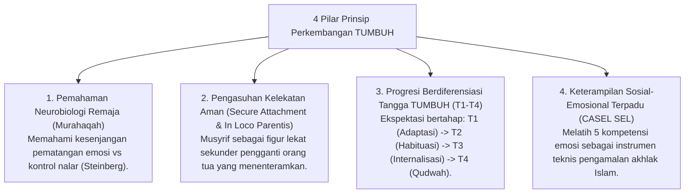

# P2-04-Prinsip-Perkembangan-Santri-TUMBUH (Development Principles Induk)

## Tujuan
Menetapkan prinsip-prinsip komprehensif mengenai perkembangan manusia (*Human Development Principles*) dalam ekosistem pesantren TUMBUH, memadukan tahapan *Tazkiyatun Nafs* klasik dengan psikologi perkembangan remaja (*Adolescent Psychology*) dan neurosains kognitif modern.

---

## 1. 4 Pilar Prinsip Perkembangan Santri

---

## 2. Rincian 4 Pilar Perkembangan

### 1. Pemahaman Neurobiologi Remaja (*Adolescent Brain Awareness*)
* Santri usia 12–18 tahun mengalami lonjakan sensitivitas emosional akibat pematangan awal amigdala (*Limbic System*), sementara rem logika (*Prefrontal Cortex*) belum matang sempurna.
* Perilaku impulsif santri ditanggapi dengan bimbingan regulasi diri (*Scaffolding*), bukan kemarahan atau vonis karakter.

### 2. Pengasuhan Kelekatan Aman (*Secure Base & In Loco Parentis*)
* Berpisah dari rumah memicu kecemasan adaptasi (*Homesickness*). Musyrif wajib hadir memberikan kehangatan (*Secure Base*) agar santri merasa aman secara emosional dan siap belajar.

### 3. Progresi Berdiferensiasi Tangga TUMBUH (T1–T4)
* Pembinaan tidak memukul rata (*No One-Size-Fits-All*). Santri baru T1 difasilitasi penyesuaian adaptif, sedangkan santri senior T4 diberdayakan memimpin dan mengayomi adik kelas.

### 4. Integrasi CASEL SEL & Karakter Islami
* Mengawinkan 5 Kompetensi CASEL (*Self-Awareness, Self-Management, Social Awareness, Relationship Skills, Responsible Decision-Making*) dengan 10 Karakter Santri TUMBUH (*Muhasabah, Mujahadatun Nafs, Ukhuwah, Adab, Hikmah*).

---

## 3. Status Dokumen
* **Status**: 🌟 **A+ (Dokumen Induk Development Principles)**
* **Level**: Project 2 - `02 Principles / 04 Development Principles`
* **Langkah Berikutnya**: **`P2-04-01-Prinsip-Maturitas-Neurosains-Remaja.md`**.
