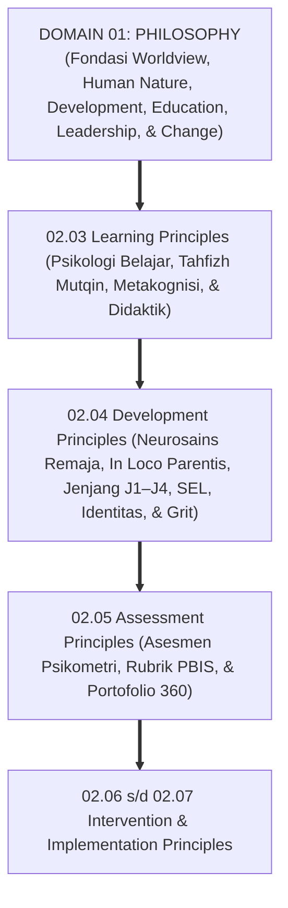
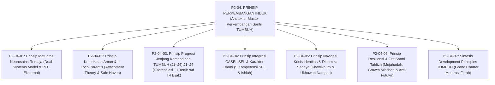
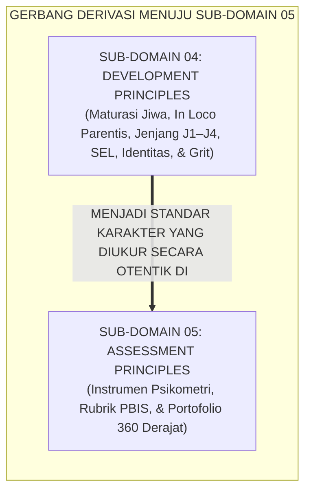

# P2-04: DEVELOPMENT PRINCIPLES (PRINSIP PERKEMBANGAN SANTRI) EKOSISTEM TUMBUH
## *Monograf Induk Sub-Domain 04: Arsitektur Master Perkembangan Jiwa & Pengasuhan Asrama 24 Jam, Rekapitulasi 6 Pilar Perkembangan (Maturitas Neurosains Remaja, In Loco Parentis Bowlby, Progresi Jenjang J1–J4, CASEL SEL Islami, Navigasi Krisis Identitas Erikson, & Daya Juang Grit Duckworth), serta Gerbang Derivasi Menuju Sub-Domain 05 Assessment Principles*

**Nomor Identifikasi**: `P2-04/MONOGRAF-INDUK-DEVELOPMENT-PRINCIPLES/2026`  
**Domain**: `02 Principles` > `04 Development Principles`  
**Klasifikasi Naskah**: *Master Sub-Domain Monograph* (Monograf Induk Sub-Domain Prinsip Perkembangan Jiwa & Pengasuhan)  
**Rumpun Disiplin Pengkaji**: Psikologi Perkembangan Islam (*'Ilm an-Nafs an-Numuwwi*), Neurosains Kognitif Remaja, Teori Kelekatan & Pengasuhan In Loco Parentis, Taksonomi Karakter Berbasis Fitrah, Ketahanan Mental & Resiliensi  

---

> ### 💡 INTISARI PRAKTIS (3 MENIT PAHAM UNTUK ASATIDZ & MUSYRIF)
>
> * **Posisi Sub-Domain 04 Development Principles:**  
>   Menjawab pertanyaan mendasar keempat dalam ekosistem pesantren: *"Bagaimanakah hukum biologis dan psikologis perkembangan fitrah santri remaja bekerja melintasi usia 12–18 tahun, serta bagaimanakah musyrif dan asatidz menjalankan peran orang tua pengganti (In Loco Parentis) yang penuh kasih sayang untuk membimbing kematangan emosi, nalar, identitas diri, dan resiliensi melintasi Jenjang J1–J4?"*
> * **Enam Pilar Perkembangan Ekosistem TUMBUH yang Terintegrasi:**  
>   1. **P2-04-01 (Maturitas Neurosains Remaja):** Memahami *Dual-Systems Model* Steinberg; musyrif sebagai *Prefrontal Cortex Eksternal* meredakan impulsivitas tanpa hukuman fisik.  
>   2. **P2-04-02 (Keterikatan Aman & In Loco Parentis):** Menegakkan amanah *Bi Manzilatil Walid*; menyediakan *Safe Haven & Secure Base* 24 jam serta transisi *homesick* 14 hari.  
>   3. **P2-04-03 (Progresi Jenjang J1–J4):** Menerapkan pembinaan berjenjang: T1 Tertib Adab, T2 Unggul Ilmu, T3 Mandiri Analisis, dan T4 Bijak Khidmah.  
>   4. **P2-04-04 (Integrasi CASEL SEL & Karakter Islami):** Mengoperasionalkan 5 kompetensi CASEL (Muraqabah, Mujahadah, Empati, Ishlah, Hikmah) dan *Restorative Circles*.  
>   5. **P2-04-05 (Navigasi Krisis Identitas & Sebaya):** Pendampingan usia syabab sebagai sahabat (*Khawikhum*), dekonstruksi geng asrama, dan ukhuwah nampan.  
>   6. **P2-04-06 (Resiliensi & Daya Juang Grit):** Menempa mental mujahadah dan sabar (QS. 29:69), navigasi *Plateau of Latent Potential*, dan pemulihan *Futuwr*.
> * **Fondasi Kuat Bagi Evaluasi Karakter (05 Assessment Principles):**  
>   Prinsip perkembangan yang terukur ini menjadi rujukan objektif bagi **Prinsip-Prinsip Evaluasi & Asesmen Otentik (*05 Assessment Principles*)**.

---

## 📑 DAFTAR ISI MONOGRAF INDUK

- [BAGIAN I: ARSITEKTUR ONTOLOGIS & POHON HUBUNGAN SUB-DOMAIN 04](#bagian-i-arsitektur-ontologis--pohon-hubungan-sub-domain-04)
  - [1. Posisi Dokumen dalam Taksonomi 11 Domain TUMBUH](#1-posisi-dokumen-dalam-taksonomi-11-domain-tumbuh)
  - [2. Pohon Hubungan Antar-Monograf Sub-Domain 04 Development Principles](#2-pohon-hubungan-antar-monograf-sub-domain-04-development-principles)
  - [3. Rangkuman 6 Pilar Perkembangan Jiwa & Pengasuhan Santri](#3-rangkuman-6-pilar-perkembangan-jiwa--pengasuhan-santri)
  - [4. Penegasan Triad Pertumbuhan Simbiotik dalam Pengasuhan](#4-penegasan-triad-pertumbuhan-simbiotik-dalam-pengasuhan)
- [BAGIAN II: KODIFIKASI MATRIKS RESMI & DIREKTORI MONOGRAF TERPADU](#bagian-ii-kodifikasi-matriks-resmi--direktori-monograf-terpadu)
  - [1. Matriks Rujukan Lengkap 7 Berkas Monograf Sub-Domain 04](#1-matriks-rujukan-lengkap-7-berkas-monograf-sub-domain-04)
  - [2. Gerbang Derivasi Menuju Sub-Domain 05 Assessment Principles](#2-gerbang-derivasi-menuju-sub-domain-05-assessment-principles)
- [BAGIAN III: APARATUS AKADEMIS & APENDIKS](#bagian-iii-aparatus-akademis--apendiks)
  - [1. Daftar Pustaka Otoritatif Turats & Sains Global](#1-daftar-pustaka-otoritatif-turats--sains-global)
  - [2. Catatan Kaki Akademis (Footnotes)](#2-catatan-kaki-akademis-footnotes)
  - [3. Glosarium Istilah Kunci Perkembangan Jiwa Induk](#3-glosarium-istilah-kunci-perkembangan-jiwa-induk)

---

# BAGIAN I: ARSITEKTUR ONTOLOGIS & POHON HUBUNGAN SUB-DOMAIN 04

---

### 1. Posisi Dokumen dalam Taksonomi 11 Domain TUMBUH

---

### 2. Pohon Hubungan Antar-Monograf Sub-Domain 04 Development Principles

Sub-Domain `04 Development Principles` memuat 1 Monograf Induk dan 7 Monograf Riset Khusus yang saling menopang secara kokoh:

---

### 3. Rangkuman 6 Pilar Perkembangan Jiwa & Pengasuhan Santri

1. **Pilar 1: Maturitas Neurosains Remaja (P2-04-01)**:  
   Menyelaraskan pengasuhan dengan *Dual-Systems Model* Prof. Laurence Steinberg. Memahami bahwa sistem limbik emosional matang lebih awal saat pubertas sementara korteks prefrontal (PFC) baru tuntas di usia 25 tahun. Musyrif bertindak sebagai *Prefrontal Cortex Eksternal* yang meredakan impulsivitas tanpa kekerasan.
2. **Pilar 2: Keterikatan Aman & In Loco Parentis (P2-04-02)**:  
   Menegakkan amanah hadits *Bi Manzilatil Walid* dan *Attachment Theory* John Bowlby. Musyrif berfungsi sebagai *Safe Haven* (Pelabuhan Nyaman) dan *Secure Base* (Pangkalan Aman). Menerapkan protokol adaptasi empati 14 hari pertama.
3. **Pilar 3: Progresi Jenjang Kemandirian TUMBUH (J1–J4) J1–J4 (P2-04-03)**:  
   Menerapkan hukum *Marahil al-'Umr* melalui diferensiasi 4 Tangga: T1 (Tertib Adab), T2 (Unggul Ilmu), T3 (Mandiri Analisis), dan T4 (Bijak Khidmah). Menghapus mutlak senioritas feodal di asrama.
4. **Pilar 4: Integrasi CASEL SEL & Karakter Islami (P2-04-04)**:  
   Mengoperasionalkan 5 kompetensi CASEL SEL ke dalam taksonomi akhlak Islam (Muraqabah, Mujahadah, Empati, Adab, Hikmah) serta Lingkaran Restoratif (*Ishlah al-Bain*).
5. **Pilar 5: Navigasi Krisis Identitas & Dinamika Sebaya (P2-04-05)**:  
   Mendampingi fase syabab dengan pendekatan kemitraan sahabat (*Khawikhum* Sayyidina Ali RA), mendekonstruksi geng asrama, dan menyalurkan hasrat pengakuan diri santri ke wadah kepemimpinan positif.
6. **Pilar 6: Resiliensi, Daya Juang Grit, & Mujahadah (P2-04-06)**:  
   Menempa mentalitas mujahadah dan sabar (QS. 29:69), menerapkan *Grit Theory* Angela Duckworth, menavigasi titik jenuh (*Plateau Effect*), dan mengaktifkan *Futuwr Recovery Protocol* secara empatik.[^1]

---

### 4. Penegasan Triad Pertumbuhan Simbiotik dalam Pengasuhan

* **Santri Tumbuh**: Merasakan asrama sebagai rumah kedua yang aman (*Baituna Jannatuna*), emosinya stabil, resiliensinya tinggi, terlindungi dari perundungan, dan bertumbuh matang melintasi Jenjang J1–J4.
* **Musyrif Tumbuh**: Menjadi figur pendidik yang dicintai dan disegani (*Love-Based Authority*), memiliki keahlian konseling praktis, dan terlindungi dari stres burnout.
* **Pesantren Tumbuh**: Menjadi institusi pendidikan Islam yang terpercaya, bebas dari risiko hukum kekerasan anak, dan menjadi rujukan nasional pesantren ramah fitrah.

---

# BAGIAN II: KODIFIKASI MATRIKS RESMI & DIREKTORI MONOGRAF TERPADU

---

### 1. Matriks Rujukan Lengkap 7 Berkas Monograf Sub-Domain 04

| Kode Berkas | Judul Naskah Monograf | Dewan Keilmuan Pengkaji | Tautan Berkas Markdown |
| :---: | :--- | :--- | :--- |
| **P2-04-01** | **Prinsip Maturitas Neurosains Remaja** | `pakar-neurosains-perkembangan` `pakar-psikologi-sosial-santri` `pakar-disiplin-positif` | [**`Buka Naskah P2-04-01`**](./P2-04-01-Prinsip-Maturitas-Neurosains-Remaja.md) |
| **P2-04-02** | **Prinsip Keterikatan Aman dan In Loco Parentis** | `pakar-pengasuhan-asrama` `pakar-bimbingan-konseling` `pakar-perlindungan-anak-dan-advokasi-santri` | [**`Buka Naskah P2-04-02`**](./P2-04-02-Prinsip-Keterikatan-Aman-dan-In-Loco-Parentis.md) |
| **P2-04-03** | **Prinsip Progresi Jenjang Kemandirian TUMBUH (J1–J4) J1–J4** | `pakar-desain-kurikulum-adab` `pakar-filosofi-tumbuh` `pakar-tata-kelola-qudwah` | [**`Buka Naskah P2-04-03`**](./P2-04-03-Prinsip-Progresi-Tangga-TUMBUH-J1-J4.md) |
| **P2-04-04** | **Prinsip Integrasi CASEL SEL dan Karakter Islami** | `pakar-social-emotional-learning` `pakar-kuratif-restoratif` `pakar-epistemologi-turats` | [**`Buka Naskah P2-04-04`**](./P2-04-04-Prinsip-Integrasi-CASEL-SEL-dan-Karakter-Islami.md) |
| **P2-04-05** | **Prinsip Navigasi Identitas & Dinamika Sebaya** | `pakar-psikologi-sosial-santri` `pakar-pengasuhan-asrama` `pakar-perlindungan-anak-dan-advokasi-santri` | [**`Buka Naskah P2-04-05`**](./P2-04-05-Prinsip-Navigasi-Krisis-Identitas-dan-Resistensi-Sebaya.md) |
| **P2-04-06** | **Prinsip Resiliensi & Grit Santri Tahfizh** | `pakar-psikologi-belajar` `pakar-bimbingan-konseling` `pakar-filosofi-tumbuh` | [**`Buka Naskah P2-04-06`**](./P2-04-06-Prinsip-Resiliensi-dan-Grit-Santri-Tahfizh.md) |
| **P2-04-07** | **Sintesis Development Principles TUMBUH** | `pakar-filosofi-tumbuh` `pakar-kritikus-dan-auditor-kualitas` `pakar-pengasuhan-asrama` | [**`Buka Naskah P2-04-07`**](./P2-04-07-Sintesis-Development-Principles-TUMBUH.md) |

---

### 2. Gerbang Derivasi Menuju Sub-Domain 05 Assessment Principles

---

# BAGIAN III: APARATUS AKADEMIS & APENDIKS

---

### 1. Daftar Pustaka Otoritatif Turats & Sains Global

1. **Al-Qur'an al-Karim wa Tarjamatu Ma'anih**.
2. **Al-Bukhari, Muhammad bin Isma'il**. (1422 H). *Shahih al-Bukhari*. Beirut: Dar Thawq an-Najah.
3. **Muslim bin al-Hajjaj an-Naisaburi**. (1374 H). *Shahih Muslim*. Kairo: Isa al-Babi al-Halabi.
4. **Abu Dawud, Sulaiman bin al-Asy'ats as-Sijistani**. (2009). *Sunan Abi Dawud*. Damaskus: Dar ar-Risalah.
5. **Ibnu Qayyim Al-Jauziyyah, Syamsuddin Muhammad bin Abi Bakr**. (1971). *Tuhfat al-Mawdud bi Ahkam al-Mawlud*. Beirut: Dar al-Kutub al-'Ilmiyyah.
6. **Al-Ghazali, Abu Hamid Muhammad bin Muhammad**. (2011). *Ihya 'Ulumiddin*. Beirut: Dar al-Ma'rifah.
7. **Steinberg, L.**. (2008). *A social neuroscience perspective on adolescent risk-taking*. Developmental Review.
8. **Bowlby, J.**. (1988). *A Secure Base: Parent-Child Attachment and Healthy Human Development*. Basic Books.
9. **Erikson, E. H.**. (1968). *Identity: Youth and Crisis*. W. W. Norton & Company.
10. **Duckworth, A.**. (2016). *Grit: The Power of Passion and Perseverance*. Scribner.
11. **CASEL**. (2020). *CASEL's SEL Framework*. Chicago: CASEL.

---

### 2. Catatan Kaki Akademis (*Footnotes*)

[^1]: Steinberg (2008), *Dual-Systems Model*; Bowlby (1988), *A Secure Base*; Erikson (1968), *Identity: Youth and Crisis*; Duckworth (2016), *Grit*; CASEL (2020), *SEL Framework*.

---

### 3. Glosarium Istilah Kunci Perkembangan Jiwa Induk

1. **Dual-Systems Model**: Teori neurosains yang membedakan laju pematangan sistem limbik emosional dengan sistem korteks prefrontal logika.
2. **In Loco Parentis**: Doktrin perwalian sah pengasuh asrama yang memikul amanah kasih sayang dan perlindungan setara orang tua kandung.
3. **Secure Base & Safe Haven**: Fungsi ganda figur kelekatan aman sebagai pangkalan kemandirian dan pelabuhan perlindungan emosional.
4. **Jenjang Kemandirian TUMBUH (J1–J4) J1–J4**: Trajektori pembinaan berjenjang melintasi Tertib Adab, Unggul Ilmu, Mandiri Analisis, dan Bijak Khidmah.
5. **Grit (Kegigihan Mental)**: Kombinasi antara gairah kecintaan mendalam (*Passion*) dan daya juang pantang menyerah (*Perseverance*).
6. **Khawikhum**: Nasihat Sayyidina Ali RA untuk memposisikan anak remaja sebagai sahabat dialog yang setara.
7. **Futuwr Recovery Protocol**: Rangkaian SOP intervensi empatik untuk memulihkan santri yang mengalami kelesuan atau kejenuhan menghafal.
8. **Triad Pertumbuhan Simbiotik**: Prinsip mutlak di mana keberhasilan pengasuhan menumbuhkan Santri, memuliakan Musyrif, dan memperkokoh Lembaga secara serempak.
