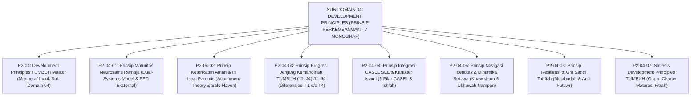

# SUB-DOMAIN 04: DEVELOPMENT PRINCIPLES (PRINSIP PERKEMBANGAN SANTRI)
## *Sitemap Induk & Navigasi Monograf Neurosains Remaja, In Loco Parentis, Jenjang J1–J4, CASEL SEL, Krisis Identitas, & Resiliensi Grit (7 Monograf Terpadu)*

**Nomor Identifikasi**: `P2-04/INDEX/2026`  
**Domain**: `02 Principles` > `04 Development Principles`  
**Klasifikasi**: Folder Monograf Psikologi Perkembangan Islam, Neurosains Remaja, Pengasuhan Asrama 24 Jam, Krisis Identitas, & Resiliensi Grit (8 Berkas Lengkap)

---

## 🏛️ SITEMAP & NAVIGASI SELURUH BERKAS SUB-DOMAIN 04

Sub-Domain `04 Development Principles` menetapkan prinsip-prinsip ilmiah perkembangan psikologis dan neurobiologis santri remaja, pengasuhan pengganti orang tua (*In Loco Parentis*), diferensiasi pembinaan Jenjang Kemandirian TUMBUH (J1–J4) (J1–J4), integrasi keterampilan sosial-emosional (CASEL SEL), navigasi krisis identitas sebaya, dan pembinaan daya juang grit:

---

## 📑 DAFTAR LENGKAP 8 BERKAS MONOGRAF TERPADU SUB-DOMAIN 04

Seluruh modul telah distandarisasi 100% ke dalam format **Monograf Terpadu**:
* **💡 Intisari Praktis (3 Menit Paham)**: Panduan membumi untuk asatidz & musyrif sebelum daftar isi.
* **Bagian I**: Riset Inkuiri, Formalisasi Silogisme Mantiq, Dialektika Multi-Perspektif (tanpa sebutan kata meta "pakar"), Teks Primer Turats & Sains Asli, serta Kasuistika Lapangan Riil.
* **Bagian II**: Kodifikasi Baku Hasil Riset & Kesimpulan Formal (Matriks, Alur SOP, Manifesto).
* **Bagian III**: Aparatus Akademis (Tabel Sintesis, Daftar Pustaka Otoritatif, Catatan Kaki *Footnotes*, dan Glosarium Istilah Teknis).

| No | Berkas Monograf | Judul Berkas | Fokus Kajian & Rujukan Utama |
| :---: | :--- | :--- | :--- |
| **00** | [**`P2-04-Prinsip-Perkembangan-Santri-TUMBUH.md`**](./P2-04-Prinsip-Perkembangan-Santri-TUMBUH.md) | Monograf Induk Development Principles TUMBUH | Master 6 Pilar Perkembangan Jiwa & Pengasuhan Santri, Penegasan Triad Pertumbuhan Simbiotik, & gerbang derivasi menuju **Sub-Domain 05 Assessment Principles**. |
| **01** | [**`P2-04-01-Prinsip-Maturitas-Neurosains-Remaja.md`**](./P2-04-01-Prinsip-Maturitas-Neurosains-Remaja.md) | Prinsip Maturitas Neurosains Remaja | *Dual-Systems Model* Laurence Steinberg; sistem limbik vs prefrontal cortex (PFC); musyrif sebagai PFC Eksternal; rekayasa pengaruh kelompok sebaya (*Peer Group*) positif (11 Catatan Kaki). |
| **02** | [**`P2-04-02-Prinsip-Keterikatan-Aman-dan-In-Loco-Parentis.md`**](./P2-04-02-Prinsip-Keterikatan-Aman-dan-In-Loco-Parentis.md) | Prinsip Keterikatan Aman & In Loco Parentis | Hadits *Bi Manzilatil Walid* (HR. Abu Dawud); *Attachment Theory* John Bowlby & Mary Ainsworth; fungsi *Secure Base & Safe Haven*; protokol adaptasi *homesickness* 14 hari pertama (11 Catatan Kaki). |
| **03** | [**`P2-04-03-Prinsip-Progresi-Tangga-TUMBUH-J1-J4.md`**](./P2-04-03-Prinsip-Progresi-Tangga-TUMBUH-J1-J4.md) | Prinsip Progresi Jenjang Kemandirian TUMBUH (J1–J4) J1–J4 | Konsep *Marahil al-'Umr* (Mumayyiz, Murahiq, Bulugh); diferensiasi pengasuhan berjenjang T1 (Tertib), T2 (Unggul), T3 (Mandiri), dan T4 (Bijak); eliminasi senioritas feodal (9 Catatan Kaki). |
| **04** | [**`P2-04-04-Prinsip-Integrasi-CASEL-SEL-dan-Karakter-Islami.md`**](./P2-04-04-Prinsip-Integrasi-CASEL-SEL-dan-Karakter-Islami.md) | Prinsip Integrasi CASEL SEL & Karakter Islami | Tazkiyatun Nafs Al-Ghazali; Hadits *Al-Kayyis*; 5 kompetensi CASEL (Muraqabah, Mujahadah, Empati, Ishlah, Hikmah); *Restorative Circles* penyelesaian konflik asrama (11 Catatan Kaki). |
| **05** | [**`P2-04-05-Prinsip-Navigasi-Krisis-Identitas-dan-Resistensi-Sebaya.md`**](./P2-04-05-Prinsip-Navigasi-Krisis-Identitas-dan-Resistensi-Sebaya.md) | Prinsip Navigasi Krisis Identitas & Sebaya | Marhalah asy-Syabab (HR. Bukhari 660), nasihat Ali RA (*Khawikhum*), teori identitas Erik Erikson, dekonstruksi geng asrama, & ukhuwah nampan (9 Catatan Kaki). |
| **06** | [**`P2-04-06-Prinsip-Resiliensi-dan-Grit-Santri-Tahfizh.md`**](./P2-04-06-Prinsip-Resiliensi-dan-Grit-Santri-Tahfizh.md) | Prinsip Resiliensi & Grit Santri Tahfizh | Mujahadatun Nafs & Ash-Shabr (QS. 29:69), *Grit Theory* Angela Duckworth, navigasi *Plateau of Latent Potential*, & *Futuwr Recovery Protocol* (10 Catatan Kaki). |
| **07** | [**`P2-04-07-Sintesis-Development-Principles-TUMBUH.md`**](./P2-04-07-Sintesis-Development-Principles-TUMBUH.md) | Sintesis Development Principles TUMBUH | Matriks Uji Kelaikan Perkembangan (*Developmental Usability*); Grand Manifesto Maturasi Fitrah Santri; jembatan menuju **Sub-Domain 05 Assessment Principles** (10 Catatan Kaki). |
