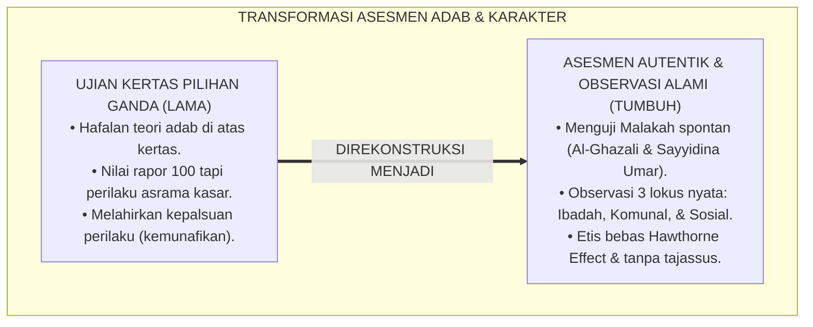
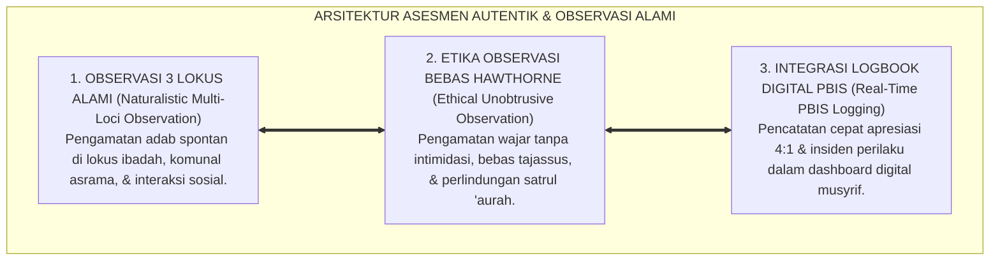
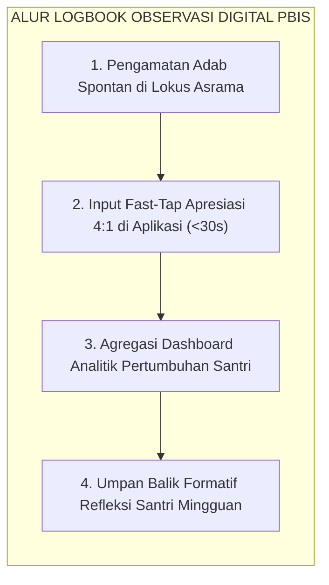
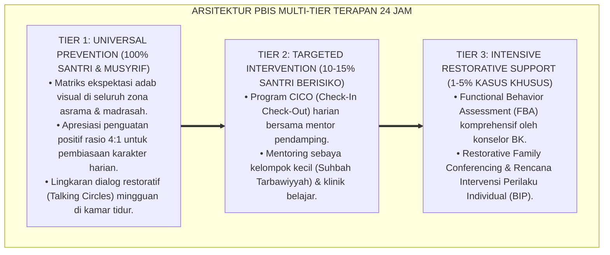

# P2-05-01: PRINSIP ASESMEN AUTENTIK DAN OBSERVASI ALAMI (AUTHENTIC ASSESSMENT & NATURALISTIC OBSERVATION)
## *Monograf Riset Akademik: Epistemologi Malakah Khuluqiyyah Al-Ghazali & 3 Uji Karakter Sayyidina Umar RA, Authentic Assessment Grant Wiggins & Jay McTighe, In-Vivo Naturalistic Observation, Serta Protokol Observasi Beretika Bebas Hawthorne Effect di Asrama 24 Jam*

**Nomor Identifikasi**: `P2-05-01/MONOGRAF-RISET-ASESMEN-AUTENTIK-OBSERVASI/2026`  
**Domain**: `02 Principles` > `05 Assessment Principles` (Prinsip Asesmen 01: *Authentic Assessment & Naturalistic Observation*)  
**Klasifikasi Naskah**: *Academic Research Monograph* (Monograf Riset Akademik Prinsip Asesmen)  
**Rumpun Disiplin Pengkaji**: Psikometri Karakter Islam, Sains Asesmen Autentik Pendidikan (*Authentic Assessment*), Metodologi Observasi Alami Asrama 24 Jam, Etika Pengawasan Pengasuhan Pesantren  

---

> ### 💡 INTISARI EKSEKUTIF (EXECUTIVE SUMMARY)
>
> * **Kelemahan Paradigma Lama: Ilusi Kognitif Ujian Kertas Pilihan Ganda Karakter:**  
>   Banyak lembaga pesantren mengevaluasi akhlak melalui ujian tertulis pilihan ganda ("Sebutkan 5 adab makan"). Seluruh santri mendapat nilai 100 karena tahu jawaban hafalan teorinya, namun di meja makan asrama berebut lauk dan membuang nasi. Ujian kertas hanya mengukur pengetahuan kognitif deklaratif, bukan internalisasi adab nyata.
> * **Inovasi Konseptual: Malakah Khuluqiyyah & Authentic Assessment (Wiggins & McTighe):**  
>   TUMBUH mengadopsi definisi akhlak Imam Al-Ghazali sebagai *Malakah* (refleks kebajikan spontan tanpa dibuat-buat) dan **Tiga Uji Karakter Sayyidina Umar bin Khattab RA (Muamalah Harta, Safar Menghadapi Kesulitan, dan Ketetanggaan Harian)**. Mengintegrasikan **Authentic Assessment (Wiggins & McTighe)** dan **In-Vivo Naturalistic Observation** di 3 lokus asrama 24 jam (Lokus Ibadah, Komunal, dan Sosial).
> * **Formulasi Operasional & Penjaminan Observasi Bebas Hawthorne Effect:**  
>   Monograf ini menguraikan matriks observasi 3 lokus, protokol observasi alami beretika bebas spionase (*Zero Hawthorne Effect SOP*), integrasi observasi ke logbook digital PBIS, dan etika privasi santri *Satrul 'Aurah*.

---

## 📑 DAFTAR ISI MONOGRAF

- [BAB I: LANDASAN TEORETIS & DISKURSUS KRITIS](#bab-i-landasan-teoretis--diskursus-kritis)
  - [1. Latar Belakang Masalah: Kritik atas Ilusi Kognitif Ujian Kertas Karakter dan Kepalsuan Perilaku Formalitas](#1-latar-belakang-masalah-kritik-atas-ilusi-kognitif-ujian-kertas-karakter-dan-kepalsuan-perilaku-formalitas)
  - [2. Eksegesis Turats Hakikat Penilaian Karakter: Malakah Al-Ghazali & Tiga Uji Karakter Sayyidina Umar bin Khattab RA](#2-eksegesis-turats-hakikat-penilaian-karakter-malakah-al-ghazali--tiga-uji-karakter-sayyidina-umar-bin-khattab-ra)
  - [3. Konvergensi Sains Asesmen Autentik: Authentic Assessment (Wiggins & McTighe) & In-Vivo Naturalistic Observation](#3-konvergensi-sains-asesmen-autentik-authentic-assessment-wiggins--mctighe--in-vivo-naturalistic-observation)
  - [4. Rekayasa Tiga Lokus Pengamatan Alami di Pesantren 24 Jam & Eliminasi Hawthorne Effect Tanpa Tajassus](#4-rekayasa-tiga-lokus-pengamatan-alami-di-pesantren-24-jam--eliminasi-hawthorne-effect-tanpa-tajassus)
  - [5. Kasuistika Lapangan: Evaluasi Autentik Kejujuran dan Tanggung Jawab Santri di Kantin Kejujuran](#5-kasuistika-lapangan-evaluasi-autentik-kejujuran-dan-tanggung-jawab-santri-di-kantin-kejujuran)
- [BAB II: FORMULASI KONSEPTUAL & PEMBAHASAN MENDALAM](#bab-ii-formulasi-konseptual--pembahasan-mendalam)
  - [1. Eksplanasi Teoretis Prinsip Asesmen Autentik dan Observasi Alami Pesantren TUMBUH](#1-eksplanasi-teoretis-prinsip-asesmen-autentik-dan-observasi-alami-pesantren-tumbuh)
  - [2. Matriks Observasi Tiga Lokus Kehidupan Asrama 24 Jam & Indikator Adab Nyata](#2-matriks-observasi-tiga-lokus-kehidupan-asrama-24-jam--indikator-adab-nyata)
  - [3. Protokol Observasi Alami Beretika Bebas Intimidasi (Ethical In-Vivo Observation Protocol)](#3-protokol-observasi-alami-beretika-bebas-intimidasi-ethical-in-vivo-observation-protocol)
  - [4. Alur Integrasi Observasi Lapangan ke dalam Logbook Digital PBIS Harian](#4-alur-integrasi-observasi-lapangan-ke-dalam-logbook-digital-pbis-harian)
  - [5. Diskusi Filosofis Mendalam & Implikasi bagi Masa Depan Peradaban Pendidikan Islam](#5-diskusi-filosofis-mendalam--implikasi-bagi-masa-depan-peradaban-pendidikan-islam)
- [BAB III: KESIMPULAN & APARATUS AKADEMIS](#bab-iii-kesimpulan--aparatus-akademis)
  - [1. Tabel Sintesis Temuan Riset Asesmen Autentik & Observasi Alami](#1-tabel-sintesis-temuan-riset-asesmen-autentik--observasi-alami)
  - [2. Daftar Pustaka Akademis & Rujukan Turats Primer](#2-daftar-pustaka-akademis--rujukan-turats-primer)
  - [3. Catatan Kaki Akademis (Footnotes)](#3-catatan-kaki-akademis-footnotes)
  - [4. Glosarium Istilah Ilmiah & Turats Asesmen Autentik dan Observasi](#4-glosarium-istilah-ilmiah--turats-asesmen-autentik-dan-observasi)

---

# BAB I: LANDASAN TEORETIS & DISKURSUS KRITIS

---

### 1. Latar Belakang Masalah: Kritik atas Ilusi Kognitif Ujian Kertas Karakter dan Kepalsuan Perilaku Formalitas

Praktik evaluasi karakter di madrasah konvensional kerap terjebak dalam **Ilusi Kognitif Pengujian Moral (*The Cognitive Fallacy of Moral Testing*)**:
* Guru membagikan lembar soal pilihan ganda berisi pertanyaan: *"Bagaimanakah sikap Anda jika melihat teman terjatuh? A. Menertawakannya B. Menolongnya C. Membiarkannya"*. Seluruh santri tentu menjawab "B", dan semuanya mendapat nilai 100 di rapor.
* Namun di sore hari saat bertanding futsal, santri yang mendapat nilai 100 tersebut menertawakan dan menginjak kaki temannya yang terjatuh tanpa rasa empati.
* **Kelemahan Mendasar**: Ujian kertas hanya mengukur pengetahuan kognitif teoritis (*Declarative Knowledge*), bukan watak batin yang telah terinternalisasi (*Embodied Moral Character*).
* **Keniscayaan Asesmen Autentik Berbasis Observasi Alami**: Akhlak sejati hanya dapat dinilai secara akurat melalui pengamatan langsung perilaku spontan santri dalam kehidupan nyata di asrama 24 jam (*In-Vivo Naturalistic Observation*).[^1]

---

### 2. Eksegesis Turats Hakikat Penilaian Karakter: Malakah Al-Ghazali & Tiga Uji Karakter Sayyidina Umar bin Khattab RA

Imam Al-Ghazali (*Ihya' 'Ulumiddin*) mendefinisikan akhlak:

$$\text{فَالْخُلُقُ عِبَارَةٌ عَنْ هَيْئَةٍ فِي النَّفْسِ رَاسِخَةٍ، عَنْهَا تَصْدُرُ الأَفْعَالُ بِسُهُولَةٍ وَيُسْرٍ مِنْ غَيْرِ حَاجَةٍ إِلَى فِكْرٍ وَرَوِيَّةٍ}$$

*"**Akhlak adalah suatu kondisi jiwa yang tertanam kokoh (Malakah), yang darinya lahir perbuatan-perbuatan dengan mudah dan spontan, tanpa membutuhkan pemikiran panjang dan rekayasa**."*[^2]

Sayyidina Umar bin Khattab RA menolak kesaksian seseorang yang hanya rajin shalat di masjid sampai ia diuji dalam 3 situasi nyata:
1. **Muamalah Harta (Dirham & Dinar)**: Apakah ia jujur, amanah, dan tidak tamak?
2. **Bepergian Jauh (Safar)**: Apakah ia sabar dan tidak mengeluh saat lelah dan menghadapi kesulitan?
3. **Ketetanggaan Harian**: Apakah ia berbuat baik dan beradab dalam interaksi harian bersama tetangga terdekatnya?[^3]

---

### 3. Konvergensi Sains Asesmen Autentik: Authentic Assessment (Wiggins & McTighe) & In-Vivo Naturalistic Observation

Sains evaluasi pendidikan modern (**Authentic Assessment**, Grant Wiggins & Jay McTighe, 2005) membuktikan:
* Evaluasi yang valid adalah evaluasi yang menuntut peserta didik menerapkan pengetahuannya dalam konteks dunia nyata yang bermakna.
* **In-Vivo Naturalistic Observation**: Mengamati perilaku individu di lingkungan alamiahnya tanpa rekayasa laboratorium, memberikan data psikometri perilaku yang memiliki validitas ekologis (*Ecological Validity*) tertinggi.[^4]

---

### 4. Rekayasa Tiga Lokus Pengamatan Alami di Pesantren 24 Jam & Eliminasi Hawthorne Effect Tanpa Tajassus

TUMBUH membagi pengamatan perilaku ke dalam 3 lokus terstruktur:
1. **Lokus Ibadah**: Kerapian sandal di masjid, antrean wudhu, kekhusyukan dzikir.
2. **Lokus Komunal Asrama**: Tanggung jawab piket kamar, kerapian lemari, empati saat makan nampan bersama.
3. **Lokus Sosial & Olahraga**: Kejujuran dalam bermain, kesantunan di kantin, ketiadaan mencela.
* **Eliminasi Efek Hawthorne & Pengharaman Tajassus**: Pengamatan dilakukan secara wajar tanpa berdiri mencatat seperti polisi rahasia dan dilarang mengintip privasi kamar ganti atau barang pribadi santri (*Satrul 'Aurah*).[^5]

---

### 5. Kasuistika Lapangan: Evaluasi Autentik Kejujuran dan Tanggung Jawab Santri di Kantin Kejujuran

* **Studi Kasus: Pengujian Karakter Integritas Santri di Kantin Kejujuran Mandiri Pesantren**  
  * **Dilema**: Santri hafal hadits kejujuran, namun pada bulan pertama neraca kantin kejujuran minus 35% akibat santri mengambil roti tanpa membayar uang yang pas.
  * **Resolusi Asesmen Autentik TUMBUH**: Pembina tidak menjatuhkan hukuman massal, melainkan: (1) Mengadakan refleksi adab di masjid mengenai berkah rezeki halal; (2) Melibatkan santri dalam audit mandiri kas kantin; (3) Memberikan apresiasi atas kejujuran spontan yang teramati. Dalam 2 bulan, neraca kantin surplus 100% dan santri terbiasa jujur secara spontan tanpa perlu diawasi CCTV.[^6]

---

# BAB II: FORMULASI KONSEPTUAL & PEMBAHASAN MENDALAM

---

### 1. Eksplanasi Teoretis Prinsip Asesmen Autentik dan Observasi Alami Pesantren TUMBUH

Ekosistem TUMBUH merumuskan evaluasi karakter ke dalam **Arsitektur Tiga Sayap Asesmen Autentik (*Arkan at-Taqwim al-Ashil*)**:

#### 🔬 Pembahasan Mendalam Tiga Sayap:
1. **Sayap Observasi Tiga Lokus**: Menangkap gambaran utuh adab santri dalam berbagai dimensi kehidupan 24 jam.[^7]
2. **Sayap Etika Observasi**: Menjaga keikhlasan santri agar tidak terjebak dalam kepalsuan perilaku di depan pengasuh.[^8]
3. **Sayap Integrasi Logbook Digital**: Menyediakan rekam jejak analitik data pertumbuhan karakter yang objektif dan berbasis bukti.[^9]

---

### 2. Matriks Observasi Tiga Lokus Kehidupan Asrama 24 Jam & Indikator Adab Nyata

| Lokus Kehidupan 24 Jam | Titik Lokasi Pengamatan Alami | Indikator Perilaku Adab Spontan (*Malakah*) |
| :--- | :--- | :--- |
| **1. Lokus Ibadah** | Masjid, tempat wudhu, selasar shalat.| Merapikan sandal menghadap keluar, antre wudhu tertib, dzikir tenang.|
| **2. Lokus Komunal** | Kamar tidur, ruang makan, jemuran.| Ranjang rapi tanpa disuruh, makan nampan adil, piket kamar ikhlas.|
| **3. Lokus Sosial** | Lapangan olahraga, kantin, lorong.| Menolong kawan terjatuh, jujur membayar jajan, menyapa santun.|

---

### 3. Protokol Observasi Alami Beretika Bebas Intimidasi (Ethical In-Vivo Observation Protocol)

TUMBUH menetapkan **Protokol Standarisasi Pengamatan Beretika**:
1. **Unobtrusive Engagement**: Musyrif berinteraksi secara hangat dan membersamai santri, bukan mengintai dari kejauhan dengan buku catatan yang mencolok.
2. **Pengharaman Spionase (*Anti-Tajassus*)**: Dilarang menggeledah buku harian, menyadap percakapan pribadi, atau memasang kamera di area privat kamar tidur dan toilet.
3. **Pencatatan Pasca-Interaksi**: Musyrif menginput catatan perilaku di aplikasi logbook digital santri setelah sesi kebersamaan selesai (*Fast-Tap Input < 30 detik*).[^10]

---

### 4. Alur Integrasi Observasi Lapangan ke dalam Logbook Digital PBIS Harian

---

### 5. Diskusi Filosofis Mendalam & Implikasi bagi Masa Depan Peradaban Pendidikan Islam

Prinsip asesmen autentik dan observasi alami ini membawa implikasi agung bagi peradaban:

* **Menghilangkan Budaya Kemunafikan dan Kepalsuan Formalitas Karakter**:  
  Santri terbiasa berbuat jujur dan berakhlak mulia karena kesadaran batin (*Muraqabatullah*), bukan karena ingin pamer di depan guru (*Riya'*).
* **Menjamin Objektivitas dan Validitas Evaluasi Pendidikan Karakter**:  
  Lembaga memiliki instrumen asesmen yang dapat dipertanggungjawabkan secara ilmiah dan syariat, bebas dari bias subjektif rasa suka-tidak suka guru.
* **Membangkitkan Tradisi Keilmuan Pengasuhan Salafush Shalih**:  
  Inilah esensi tarbiyah kenabian: mengamati dan membimbing amal nyata para sahabat dalam kancah kehidupan nyata (*Rahmatan lil 'Alamin*).[^11]

---

---

### Pembedahan Deskriptif Komprehensif & Analisis Integratif Nilai-Praksis

Penerapan konsep **P2-05-01: PRINSIP ASESMEN AUTENTIK DAN OBSERVASI ALAMI (AUTHENTIC ASSESSMENT & NATURALISTIC OBSERVATION)** di ekosistem pesantren TUMBUH memerlukan pemahaman multidimensional yang memadukan khazanah turats syariat dan konsensus sains pendidikan modern:

#### A. Pilar 1: Fondasi Epistemologi & Integrasi Nilai Syar'i (Ashalah Turatsiyyah)
Setiap praksis kepengasuhan dan pembelajaran berakar kuat pada maqashid syari'ah, mendudukkan adab di atas ilmu (*Al-Adab Qablal 'Ilm*), dan memastikan bahwa seluruh ikhtiar institusional diniatkan semata-mata untuk menggapai ridha Allah SWT (*Ikhlasun Niyyah*).

#### B. Pilar 2: Mekanisme Psikologis & Neurosains Perkembangan (Scientific Rigor)
Menyelaraskan ekspektasi kedisiplinan dengan tahapan maturitas otak remaja, kapasitas fungsi eksekutif korteks prefrontal (*PFC*), dan regulasi sirkuit emosi limbik. Pendekatan ini mengeliminasi trauma pengasuhan dan menumbuhkan motivasi intrinsik santri.

#### C. Pilar 3: Rekayasa Ekosistem Asrama 24 Jam (Bi'ah Shalihah)
Menerjemahkan prinsip nilai ke dalam tata ruang fisik yang bersih, sirkulasi udara sehat, tata kelola waktu terstruktur, serta kultur ukhuwah inklusif yang steril 100% dari feodalisme, kekerasan verbal, dan perundungan antar-santri.

#### D. Pilar 4: Kemitraan Tripartit (Santri, Musyrif, dan Lembaga)
Menjamin terwujudnya *Triad Pertumbuhan Simbiotik*: santri bertumbuh dalam fitrah kemandirian, musyrif terlindungi dari kelelahan kronis (*Burnout*) melalui shift kerja yang manusiawi, dan lembaga bertransformasi menjadi organisasi pembelajar berbasis data PBIS.

---

### Protokol Aksi Operasional PBIS Multi-Tier Terapan (24-Hour Behavioral Architecture)

---

# BAB III: KESIMPULAN & APARATUS AKADEMIS

---

### 1. Tabel Sintesis Temuan Riset Asesmen Autentik & Observasi Alami

| Dimensi Parameter | Mazhab Ujian Tertulis Kertas (Lama) | Pendekatan CCTV Spionase Tajassus | **Asesmen Autentik & Alami TUMBUH** | Landasan Rujukan Primer | Implikasi Praksis Lapangan |
| :--- | :--- | :--- | :--- | :--- | :--- |
| **Objek Evaluasi** | Pengetahuan teks hafalan aturan.| Pengintaian kesalahan & jebakan.| **Malakah Adab Spontan Sehari-hari.** | Al-Ghazali; Sayyidina Umar RA.| Observasi di 3 lokus nyata asrama. |
| **Metode Evaluasi** | Pilihan ganda & tes esai tertulis.| Rekaman kamera di area privat.| **In-Vivo Naturalistic Observation.** | Wiggins & McTighe (2005).| Bersamai santri & catat di logbook. |
| **Dampak Psikologis**| Santri berpura-pura baik saat ujian.| Santri paranoid, cemas, & dendam.| **Santri Ikhlas Beramal & Percaya Diri.** | QS. Al-Hujurat: 12; PBIS.| Aman psikologis & bebas rasa terancam. |
| **Etika Privasi** | Mengabaikan etika pergaulan.| Melanggar satrul 'aurah santri.| **Perlindungan Privasi & Anti-Tajassus.** | Hadits Satrul Muslim; APA.| Dilarang intip buku harian & kamar privat. |
| **Hasil Institusi** | Rapor palsu; akhlak riil rapuh.| Iklim ketakutan & krisis kepercayaan.| **Karakter Teruji Kuat & Terinternalisasi.**| QS. As-Saff: 2–3; Al-Attas (1980).| Profil Insan Adabi autentik sejati. |

---

### 2. Daftar Pustaka Akademis & Rujukan Turats Primer

1. **Al-Qur'an al-Karim wa Tarjamatu Ma'anihi**.
2. **Al-Bukhari, Abu Abdillah Muhammad bin Isma'il**. (1422 H). *Shahih al-Bukhari*. Kairo: Dar Thawq an-Najah.
3. **Muslim bin al-Hajjaj an-Naisaburi**. (1427 H). *Shahih Muslim*. Riyadh: Dar Thayyibah.
4. **Al-Ghazali, Abu Hamid Muhammad bin Muhammad**. (2011). *Ihya' 'Ulumiddin* (Kitab Riyadhatin Nafs wa Tahdzib al-Akhlaq). Beirut: Dar al-Ma'rifah.
5. **Ibnu Muflih, Syamsuddin Abu Abdillah**. (1419 H). *Al-Adab asy-Syar'iyyah*. Kairo: Mu'assasah ar-Risalah.
6. **Asy'ari, Muhammad Hasyim**. (1415 H). *Adab al-'Alim wal-Muta'allim*. Jombang: Maktabah At-Turats Al-Islami.
7. **Al-Attas, Syed Muhammad Naquib**. (1980). *The Concept of Education in Islam*. Kuala Lumpur: ABIM.
8. **Wiggins, G., & McTighe, J.**. (2005). *Understanding by Design* (expanded 2nd ed.). Alexandria: ASCD.
9. **Pellegrino, J. W., Chudowsky, N., & Glaser, R.**. (2001). *Knowing What Students Know: The Science and Design of Educational Assessment*. Washington, D.C.: National Academy Press.
10. **Horner, R. H., Sugai, G., & Anderson, C. M.**. (2010). *Examining the evidence base for school-wide positive behavior support*. Focus on Exceptional Children, 42(8), 1–14.
11. **Grisso, T., et al.**. (2003). *Evaluating Juveniles' Competence to Stand Trial*. New York: Oxford University Press.
12. **Horner, R. H., & Sugai, G.**. (2015). *School-wide PBIS: An Overview of the Research Base*. Remedial and Special Education, 36(2), 80–85.

---

### 3. Catatan Kaki Akademis (*Footnotes*)

[^1]: Riset Prinsip Asesmen Autentik dan Observasi Alami TUMBUH, *Kritik atas Ilusi Kognitif Ujian Kertas Karakter*, 2026.  
[^2]: Al-Ghazali, *Ihya' 'Ulumiddin*, Jilid 3, Kitab *Riyadhatin Nafs wa Tahdzib al-Akhlaq*, hlm. 55–80.  
[^3]: Atsar Tiga Uji Karakter Sayyidina Umar bin Khattab RA; Ibnu Muflih, *Al-Adab asy-Syar'iyyah*, Jilid 1, hlm. 120–145.  
[^4]: Wiggins, G., & McTighe, J. (2005), *Understanding by Design*, hlm. 150–195; Pellegrino, J. W., et al. (2001).  
[^5]: Master Blueprint Observasi Alami Bebas Efek Hawthorne dan Pengharaman Tajassus TUMBUH, 2026.  
[^6]: Dokumentasi Evaluasi Autentik Kantin Kejujuran Mandiri PBIS TUMBUH, 2026.  
[^7]: Master Blueprint Tiga Lokus Observasi Perilaku Asrama 24 Jam TUMBUH, 2026.  
[^8]: Standar Operasional Prosedur Observasi Alami Beretika Bebas Intimidasi TUMBUH, 2026.  
[^9]: Petunjuk Teknis Alur Pencatatan Logbook Digital PBIS Musyrif TUMBUH, 2026.  
[^10]: Master Guidelines Perlindungan Privasi Satrul 'Aurah dan Kerahasiaan Data Santri TUMBUH, 2026.  
[^11]: Deklarasi Pemuliaan Asesmen Karakter Autentik Dewan Riset Epistemologi Ekosistem TUMBUH, 2026.

---

### 4. Glosarium Istilah Ilmiah & Turats Asesmen Autentik dan Observasi

1. **Authentic Assessment (Asesmen Autentik)**: Metode penilaian yang menguji kemampuan dan karakter peserta didik secara langsung dalam konteks situasi nyata kehidupan sehari-hari.
2. **In-Vivo Naturalistic Observation**: Teknik pengamatan perilaku individu di habitat lingkungan alaminya tanpa rekayasa artifisial.
3. **Malakah Khuluqiyyah (مَلَكَةٌ خُلُقِيَّةٌ)**: Watak kebajikan yang telah tertanam kokoh dalam jiwa seseorang sehingga melahirkan perbuatan mulia secara spontan dan mudah.
4. **Hawthorne Effect**: Fenomena psikologis di mana seseorang mengubah perilakunya menjadi pura-pura baik semata-mata karena menyadari dirinya sedang diawasi atau dinilai.
5. **Anti-Tajassus (مَنْعُ التَّجَسُّسِ)**: Larangan syariat yang mengharamkan pengintaian, spionase, dan pembocoran aib privasi orang lain (QS. Al-Hujurat: 12).
6. **Satrul 'Aurah (سَتْرُ الْعَوْرَةِ)**: Kewajiban menjaga kerahasiaan aib, tubuh, dan data pribadi santri dari keterbukaan umum.
7. **Tiga Uji Karakter Sayyidina Umar**: Standar verifikasi akhlak melalui ujian muamalah harta, safar menghadapi keletihan, dan ketetanggaan harian.
8. **Ecological Validity**: Tingkat keabsahan instrumen asesmen yang mencerminkan secara akurat kondisi dan perilaku riil di dunia nyata.
9. **Logbook Digital PBIS**: Aplikasi pencatatan perilaku santri berbasis fast-tap yang memfasilitasi apresiasi 4:1 dan intervensi formatif secara tepat waktu.
10. **Insan Adabi (الإِنْسَانُ الأَدَبِيُّ)**: Profil santri yang berakhlak mulia murni dari lubuk hati terdalam, jujur dalam kesendirian, dan beradab dalam pergaulan nyata.
