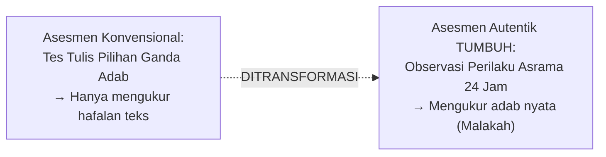

# P2-05-01-Prinsip-Asesmen-Autentik-dan-Observasi-Alami

## Tujuan
Menerapkan konsep **Authentic Assessment (Grant Wiggins & Jay McTighe)** dan **Observasi Alami (*In-Vivo Naturalistic Observation*)** dalam pengukuran karakter santri, memastikan adab yang dinilai adalah perilaku nyata dalam rutinitas 24 jam di pesantren, bukan kepatuhan semu saat ujian formal.

---

## 1. Kritik Terhadap Asesmen Karakter Konvensional

Ujian tertulis tentang adab (misal: *"Sebutkan 5 adab makan menurut Islam"*) hanya mengukur kemampuan kognitif menghafal teks (*Ta'lim*), tetapi **sama sekali tidak mengukur apakah santri tersebut benar-benar beradab saat makan di kantin bersama teman-temannya (*Ta'dib & Tarbiyah*)**.

---

## 2. 3 Lokus Utama Observasi Autentik di Pesantren

1. **Lokus Ibadah (Masjid & Tempat Wudhu)**:
   - Ketertiban antrean wudhu, ketenangan saat menunggu adzan, kekhusyukan sholat, dan kerapian meletakkan alas kaki.
2. **Lokus Komunal (Asrama, Kamar & Meja Makan)**:
   - Tanggung jawab piket kebersihan, inisiatif merapikan kasur, empati saat teman sekamar sakit, adab makan tanpa berebut.
3. **Lokus Sosial & Pembelajaran (Kelas, Lapangan & Lorong)**:
   - Kejujuran saat ujian, kesantunan tutur kata kepada asatidz, sportivitas saat berolahraga, dan penolakan terhadap tindakan intimidasi (*Bullying*).

---

## 3. Status Dokumen
* **Status**: 🌟 **A+ (Tervalidasi & Siap Diimplementasikan)**
* **Level**: Project 2 - `02 Principles / 05 Assessment Principles`
* **Langkah Berikutnya**: **`P2-05-02-Prinsip-Rubrik-Perilaku-Objektif-dan-Deskriptif.md`**.
