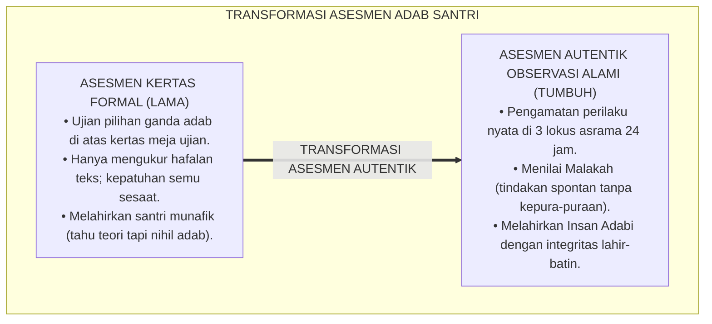
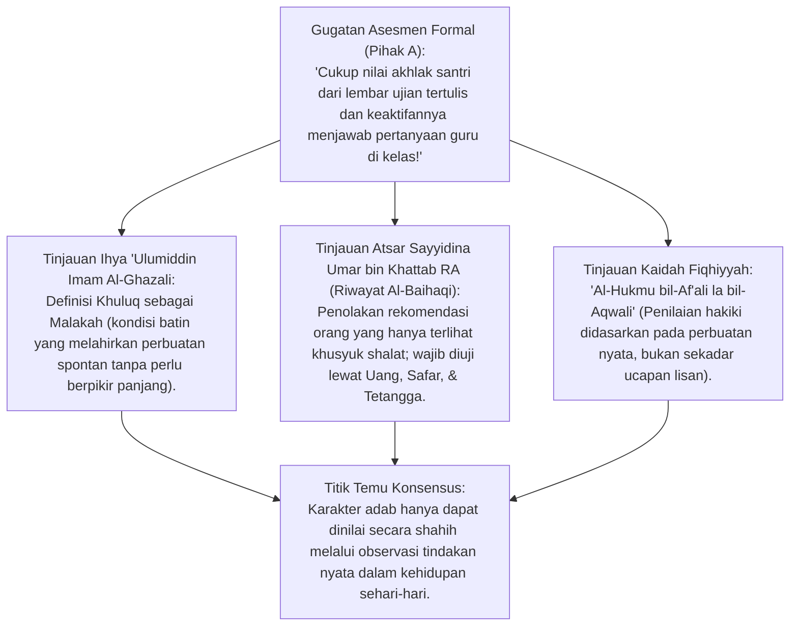
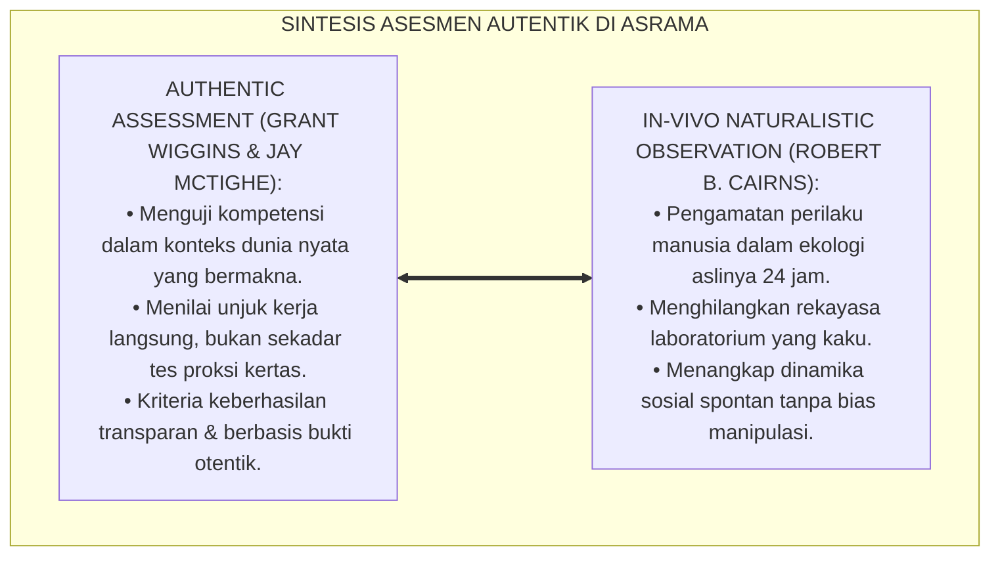
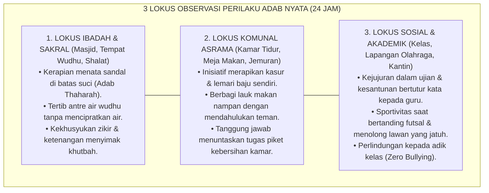
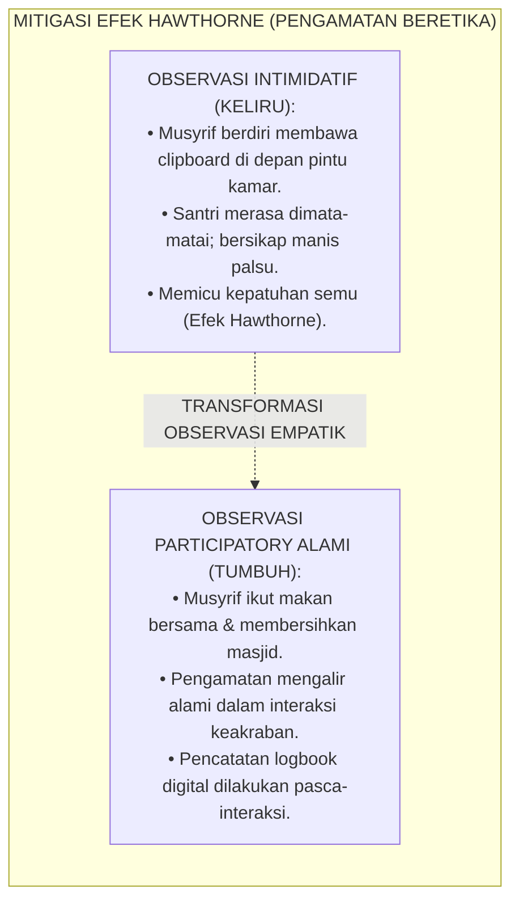
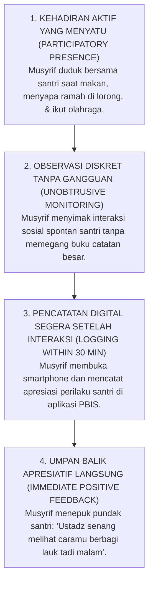
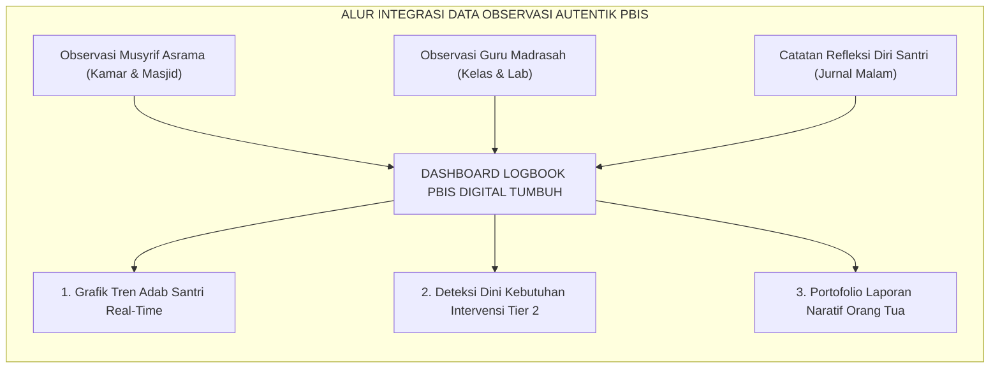

# P2-05-01: PRINSIP ASESMEN AUTENTIK DAN OBSERVASI ALAMI
## *Monograf Terpadu: Epistemologi Malakah Khuluqiyyah Al-Ghazali & 3 Uji Karakter Sayyidina Umar bin Khattab RA, Konvergensi Authentic Assessment (Grant Wiggins & Jay McTighe) serta In-Vivo Naturalistic Observation, Pemetaan 3 Lokus Asrama 24 Jam, dan Protokol Observasi Beretika Bebas Efek Hawthorne*

**Nomor Identifikasi**: `P2-05-01/MONOGRAF-TERPADU-ASESMEN-AUTENTIK-OBSERVASI/2026`  
**Domain**: `02 Principles` > `05 Assessment Principles`  
**Klasifikasi Naskah**: *Comprehensive Integrated Monograph* (Monograf Akademis & Rumusan Baku Terpadu)  
**Rumpun Disiplin Pengkaji**: Psikometri Karakter Islam, Sains Asesmen Autentik Pendidikan (*Authentic Assessment*), Metodologi Observasi Alami Asrama 24 Jam, Etika Pengawasan Pengasuhan Pesantren  

---

> ### 💡 INTISARI PRAKTIS (3 MENIT PAHAM UNTUK ASATIDZ & MUSYRIF)
>
> * **Ujian Tulis Pilihan Ganda Tidak Bisa Mengukur Akhlak Santri:**  
>   Santri yang mendapat nilai 100 pada ujian tertulis *"Sebutkan 5 Adab Makan"* bisa jadi adalah santri yang paling rakus menyerobot lauk temannya di meja makan. Ujian tertulis hanya mengukur hafalan teks (*Kognisi*), sedangkan **Akhlak Sejati (*Malakah*) Hanya Terbukti Lewat Tindakan Nyata Sehari-hari**.
> * **Tiga Uji Karakter Sayyidina Umar bin Khattab RA:**  
>   Sayyidina Umar RA menolak kesaksian orang yang hanya terlihat rajin shalat di masjid sampai ia diuji dalam 3 hal: **(1) Transaksi Uang (Kejujuran), (2) Bepergian Jauh/Safar (Kesabaran Menghadapi Kesulitan), dan (3) Bertetangga Dekat (Kebaikan Pergaulan Sehari-hari)**.
> * **Tiga Lokus Pengamatan Adab Nyata di Pesantren 24 Jam:**  
>   1. **Lokus Ibadah:** Kerapian sandal di masjid, antrean tempat wudhu, kekhusyukan dzikir.  
>   2. **Lokus Komunal Asrama:** Tanggung jawab piket kamar, kerapian kasur, empati saat makan nampan.  
>   3. **Lokus Sosial & Olahraga:** Kejujuran saat bertanding, kesantunan di kantin, ketiadaan mengejek.
> * **Mengamati Secara Alami Tanpa Mengintimidasi (*Etika Observasi*):**  
>   Musyrif mencatat kebaikan santri secara wajar di sela-sela interaksi harian, bukan berdiri kaku mencatat seperti polisi rahasia yang membuat santri berpura-pura baik (*Efek Hawthorne*).

---

## 📑 DAFTAR ISI MONOGRAF

- [BAGIAN I: RISET ASESMEN AUTENTIK & OBSERVASI ALAMI, DIALEKTIKA INKUIRI, & KASUISTIKA LAPANGAN](#bagian-i-riset-asesmen-autentik--observasi-alami-dialektika-inkuiri--kasuistika-lapangan)
  - [1. Kerangka Metodologi Asesmen Karakter: Mengapa Ujian Tertulis Gagal Mengukur Akhlak Hakiki](#1-kerangka-metodologi-asesmen-karakter-mengapa-ujian-tertulis-gagal-mengukur-akhlak-hakiki)
  - [2. Inkuiri 1: Eksegesis Turats Hakikat Penilaian Akhlak — Malakah Al-Ghazali & 3 Uji Karakter Sayyidina Umar RA](#2-inkuiri-1-eksegesis-turats-hakikat-penilaian-akhlak--malakah-al-ghazali--3-uji-karakter-sayyidina-umar-ra)
  - [3. Inkuiri 2: Konvergensi Authentic Assessment Wiggins & McTighe serta In-Vivo Naturalistic Observation](#3-inkuiri-2-konvergensi-authentic-assessment-wiggins--mctighe-serta-in-vivo-naturalistic-observation)
  - [4. Inkuiri 3: Tiga Lokus Observasi Perilaku Alami di Pesantren 24 Jam (Ibadah, Komunal, Sosial)](#4-inkuiri-3-tiga-lokus-observasi-perilaku-alami-di-pesantren-24-jam-ibadah-komunal-sosial)
  - [5. Inkuiri 4: Menghindari Efek Hawthorne: Mengamati Santri Tanpa Mengintimidasi Privasi](#5-inkuiri-4-menghindari-efek-hawthorne-mengamati-santri-tanpa-mengintimidasi-privasi)
  - [6. Inkuiri 5: Silogisme Logika, Dialektika 3 Ronde, Kasuistika Observasi Asrama, & Titik Temu Konsensus](#6-inkuiri-5-silogisme-logika-dialektika-3-ronde-kasuistika-observasi-asrama--titik-temu-konsensus)
- [BAGIAN II: TEMUAN RISET, FORMULASI KONSEPTUAL & PEMBAHASAN](#bagian-ii-temuan-riset-formulasi-konseptual--pembahasan)
  - [1. Formulasi Konseptual: Prinsip Asesmen Autentik dan Observasi Alami Pesantren TUMBUH](#1-formulasi-konseptual-prinsip-asesmen-autentik-dan-observasi-alami-pesantren-tumbuh)
  - [2. Matriks Observasi 3 Lokus Kehidupan Asrama 24 Jam & Indikator Adab Nyata](#2-matriks-observasi-3-lokus-kehidupan-asrama-24-jam--indikator-adab-nyata)
  - [3. Protokol Observasi Alami Beretika Bebas Intimidasi (Ethical In-Vivo Observation Protocol)](#3-protokol-observasi-alami-beretika-bebas-intimidasi-ethical-in-vivo-observation-protocol)
  - [4. Alur Integrasi Observasi Lapangan ke dalam Logbook PBIS Harian](#4-alur-integrasi-observasi-lapangan-ke-dalam-logbook-pbis-harian)
- [BAGIAN III: APARATUS AKADEMIS & APENDIKS](#bagian-iii-aparatus-akademis--apendiks)
  - [1. Tabel Sintesis Hasil Riset Asesmen Autentik & Observasi Alami](#1-tabel-sintesis-hasil-riset-asesmen-autentik--observasi-alami)
  - [2. Daftar Pustaka Akademis & Rujukan Turats Primer](#2-daftar-pustaka-akademis--rujukan-turats-primer)
  - [3. Catatan Kaki Akademis (Footnotes)](#3-catatan-kaki-akademis-footnotes)
  - [4. Glosarium dan Penjelasan Istilah Teknis Authentic Assessment & Psikometri Observasi](#4-glosarium-dan-penjelasan-istilah-teknis-authentic-assessment--psikometri-observasi)

---

# BAGIAN I: RISET ASESMEN AUTENTIK & OBSERVASI ALAMI, DIALEKTIKA INKUIRI, & KASUISTIKA LAPANGAN

---

### 1. Kerangka Metodologi Asesmen Karakter: Mengapa Ujian Tertulis Gagal Mengukur Akhlak Hakiki

Praktik evaluasi adab santri di madrasah konvensional kerap terjebak dalam **Ilusi Kognitif Evaluasi Akhlak (*The Cognitive Fallacy of Moral Testing*)**:
* Guru membagikan lembar soal pilihan ganda berisi pertanyaan: *"Bagaimanakah sikap Anda jika melihat teman terjatuh? A. Menertawakannya B. Menolongnya C. Membiarkannya"*. Seluruh santri tentu menjawab "B", dan semuanya mendapat nilai 100 di rapor.
* Namun di sore hari di lapangan futsal, santri yang mendapat nilai 100 tersebut menertawakan dan menginjak kaki temannya yang terjatuh tanpa rasa bersalah.

Ujian kertas hanya mengukur **Pengetahuan Deklaratif Adab (*Knowing the Rules*)**, sama sekali tidak mengukur **Internalisasi Karakter Spontan (*Embodied Adab / Malakah*)**.

Ekosistem TUMBUH merestrukturisasi paradigma evaluasi karakter dengan menegakkan **Asesmen Autentik Berbasis Observasi Alami (*In-Vivo Naturalistic Observation*)**: adab dinilai dari tindakan spontan santri saat menjalani kehidupan nyata di asrama 24 jam.

---

### 2. Inkuiri 1: Eksegesis Turats Hakikat Penilaian Akhlak — *Malakah* Al-Ghazali & 3 Uji Karakter Sayyidina Umar RA

#### 📐 Formalisasi Logika Silogisme (*Qiyas Mantiqi 1*)
* **Premis Mayor (*al-Muqaddimah al-Kubra*)**: Setiap evaluasi karakter adab Islam yang shahih niscaya wajib mengukur derajat *Malakah* (kebiasaan jiwa yang terpatri kokoh melahirkan perilaku spontan terpuji), bukan sekadar kemampuan kognitif menghafal definisi teori akhlak.
* **Premis Minor (*al-Muqaddimah ash-Shughra*)**: Sayyidina Umar bin Khattab RA dan Imam Al-Ghazali menetapkan bahwa pembuktian akhlak seseorang hanya dapat diuji melalui pengamatan interaksi sosial nyata saat menghadapi ujian nafsu, harta, dan kesulitan hidup.
* **Konklusi (*an-Natijah*)**: Maka, sistem asesmen pesantren TUMBUH wajib berpusat pada observasi perilaku autentik di lingkungan asrama 24 jam.[^1]

#### 📖 Teks Primer Turats: Atsar Sayyidina Umar RA & *Ihya 'Ulumiddin*
Diriwayatkan oleh Imam Al-Baihaqi dalam *As-Sunan al-Kubra*:

$$\text{أَنَّ رَجُلًا شَهِدَ عِنْدَ عُمَرَ بْنِ الْخَطَّابِ رَضِيَ اللَّهُ عَنْهُ بِشَهَادَةٍ، فَقَالَ لَهُ عُمَرُ: لَسْتُ أَعْرِفُكَ وَلَا يَضُرُّكَ أَنْ لَا أَعْرِفَكَ، ائْتِ بِمَنْ يَعْرِفُكَ. فَقَالَ رَجُلٌ مِنَ الْقَوْمِ: أَنَا أَعْرِفُهُ! قَالَ: بِأَيِّ شَيْءٍ تَعْرِفُهُ؟ قَالَ: بِالْعَدَالَةِ وَالْفَضْلِ. فَقَالَ عُمَرُ: أَهُوَ جَارُكَ الْأَدْنَى الَّذِي تَعْرِفُ لَيْلَهُ وَنَهَارَهُ، وَمَدْخَلَهُ وَمَخْرَجَهُ؟ قَالَ: لَا! قَالَ: فَهَلْ عَامَلْتَهُ بِالدِّينَارِ وَالدِّرْهَمِ اللَّذَيْنِ بِهِمَا يُسْتَدَلُّ عَلَى الْوَرَعِ؟ قَالَ: لَا! قَالَ: فَهَلْ سَافَرْتَ مَعَهُ السَّفَرَ الَّذِي يُسْتَدَلُّ بِهِ عَلَى مَكَارِمِ الْأَخْلَاقِ؟ قَالَ: لَا! قَالَ: فَلَعَلَّكَ رَأَيْتَهُ يَرْكَعُ وَيَسْجُدُ فِي الْمَسْجِدِ يُهَفْهِفُ بِرَأْسِهِ؟ قَالَ: نَعَمْ! قَالَ: اذْهَبْ فَإِنَّكَ لَا تَعْرِفُهُ!}$$

*"Seorang pria memberikan kesaksian di hadapan Umar bin Khattab RA. Umar berkata: 'Aku belum mengenalmu, bawalah seseorang yang mengenalmu!' Seorang warga berkata: 'Aku mengenalnya wahai Amirul Mukminin!' Umar bertanya: **'Dengan apa engkau mengenalnya? Apakah ia tetangga dekatmu yang engkau tahu persis keluar-masuknya siang dan malam?'** Pria itu menjawab: 'Tidak.' Umar bertanya: **'Apakah engkau pernah bertransaksi dinar dan dirham (uang) dengannya untuk menguji sifat wara'-nya?'** Pria itu menjawab: 'Tidak.' Umar bertanya: **'Apakah engkau pernah bepergian jauh (safar) bersamanya untuk menguji keluhuran akhlaknya?'** Pria itu menjawab: 'Tidak.' Umar berkata: **'Mungkin engkau hanya melihatnya ruku' dan sujud di masjid sambil mengangguk-anggukkan kepalanya?' Pria itu menjawab: 'Benar!' Umar menegaskan: 'Pergilah, sesungguhnya engkau belum mengenalnya sama sekali!'**"* (Al-Baihaqi, *As-Sunan al-Kubra*, No. 20958).[^2]

Dan Hujjatul Islam Imam Al-Ghazali (w. 505 H) merumuskan definisi akhlak:

$$\text{فَالْخُلُقُ عِبَارَةٌ عَنْ هَيْئَةٍ فِي النَّفْسِ رَاسِخَةٍ، عَنْهَا تَصْدُرُ الْأَفْعَالُ بِسُهُولَةٍ وَيُسْرٍ مِنْ غَيْرِ حَاجَةٍ إِلَى فِكْرٍ وَرَوِيَّةٍ}$$

*"**Maka Akhlak adalah suatu kondisi jiwa yang terpatri kokoh (Malakah Rasikhah), yang darinya lahir perbuatan-perbuatan secara spontan, mudah, dan ringan, tanpa memerlukan pemikiran panjang atau kepura-puraan**."* (*Ihya 'Ulumiddin*, Jilid III, hlm. 53).[^3]

---

### 3. Inkuiri 2: Konvergensi *Authentic Assessment* Wiggins & McTighe serta *In-Vivo Naturalistic Observation*

#### 📐 Formalisasi Logika Silogisme (*Qiyas Mantiqi 2*)
* **Premis Mayor (*al-Muqaddimah al-Kubra*)**: Setiap instrumen pengukuran perilaku yang dilaksanakan dalam lingkungan hidup alami pembelajar (*Naturalistic Ecological Setting*) memiliki validitas ekologis (*Ecological Validity*) dan akurasi diagnostik yang jauh lebih tinggi dibandingkan tes formal artifisial.
* **Premis Minor (*al-Muqaddimah ash-Shughra*)**: *Authentic Assessment Framework* (Wiggins & McTighe, 2005) dan metode *In-Vivo Observation* membuktikan bahwa penilaian unjuk kerja kontekstual 24 jam memberikan data karakter yang paling valid dan terpercaya.
* **Konklusi (*an-Natijah*)**: Maka, ekosistem pesantren TUMBUH menetapkan observasi alami di asrama sebagai instrumen utama asesmen adab santri.[^4]

---

### 4. Inkuiri 3: Tiga Lokus Observasi Perilaku Alami di Pesantren 24 Jam (Ibadah, Komunal, Sosial)

---

### 5. Inkuiri 4: Menghindari Efek Hawthorne: Mengamati Santri Tanpa Mengintimidasi Privasi

#### 📖 Teks Sains Evaluasi: Prof. Robert B. Cairns (1979, 1998)
Dalam *The Analysis of Social Interactions*, Cairns membuktikan bahwa ketika subjek sadar sedang diawasi secara formal (*Hawthorne Effect*), mereka akan menampilkan respon yang diinginkan pengamat (*Social Desirability Bias*). Pengasuhan asrama mengatasi ini melalui **Observasi Partisipatoris Terintegrasi (*Embedded Natural Observation*)**: musyrif hadir sebagai sosok ayah yang menyatu dalam aktivitas santri, sehingga santri bertindak apa adanya secara jujur dan fitrah.[^5]

---

### 6. Inkuiri 5: Silogisme Logika, Dialektika 3 Ronde, Kasuistika Observasi Asrama, & Titik Temu Konsensus

#### 🥊 Ronde 1: Menolak Anggapan Bahwa "Observasi Musyrif Pasti Penuh Bias Like & Dislike"
* **Pihak A (Sudut Pandang Keraguan Subjektivitas Pengasuh)**:  
  *"Observasi musyrif itu tidak ilmiah karena sangat subjektif; santri yang disukai musyrif pasti dinilai baik, santri yang tidak disukai dinilai buruk!"*
* **Tinjauan Sudut Pandang Standarisasi Rubrik BARS & Multi-Rater**:  
  Subjektivitas musyrif dieliminasi total dengan **Rubrik Perilaku Terstandarisasi (*Behaviorally Anchored Rating Scales / BARS*)** yang memiliki indikator perilaku konkret (misal: "membantu menyapu lorong tanpa disuruh"). Selain itu, data diobservasi oleh minimal 2 musyrif independen dan 1 guru madrasah untuk menjamin reliabilitas skor.[^6]

#### 🥊 Ronde 2: Sanggahan Balik Apakah Mengamati Santri 24 Jam Melanggar Hak Privasi Pribadi Santri?
* **Pihak A (Sudut Pandang Privasi Ekstrem)**:  
  *"Santri berhak memiliki privasi penuh di asrama; musyrif tidak boleh mengawasi kamar dan kehidupan pribadinya!"*
* **Tinjauan Sudut Pandang Batasan Wilayah Sakral vs Publik Asrama**:  
  Ekosistem TUMBUH membedakan secara tegas antara **Wilayah Privasi Tertutup (*Private Sanctum* - seperti bilik mandi/toilet yang haram diintip)** dengan **Wilayah Komunal Asrama (*Shared Public Living* - seperti ruang kamar bersama, meja makan, dan masjid)**. Pengamatan di wilayah komunal adalah kewajiban amanah *In Loco Parentis* demi memastikan keselamatan fisik dan perkembangan adab seluruh santri.[^7]

#### 🥊 Ronde 3: Sanggahan Pamungkas Mengapa Logbook Digital Lebih Adil Daripada Ingatan Manual Musyrif di Akhir Semester?
* **Pihak A (Sudut Pandang Tradisionalisme Santai)**:  
  *"Musyrif tidak usah repot mencatat di aplikasi tiap hari; nanti pas mau bagi rapor ingat-ingat saja siapa santri yang baik!"*
* **Resolusi Sudut Pandang Bias Ingatan Baru (Recency Bias Effect)**:  
  Menilai di akhir semester hanya mengandalkan ingatan musyrif pasti terjebak **Bias Peristiwa Terakhir (*Recency Bias*)**: santri yang baru berbuat salah kemarin akan dinilai buruk seluruh semesternya, sementara santri yang diam tidak tercatat kebaikannya. **Pencatatan Cepat Harian di Logbook Digital PBIS (Fast-Tap Logging)** menjamin keadilan data berbasis bukti nyata sepanjang 180 hari.[^8]

> #### 📌 Kasuistika Lapangan & Titik Temu Konsensus
> * **Studi Kasus**: Santri M di kelas madrasah sangat pendiam dan nilainya pas-pasan; guru madrasah mengira ia santri pasif yang kurang berprestasi.
> * **Titik Temu Konsensus (*Kalimatun Sawa'*)**: Melalui *Asesmen Autentik Asrama TUMBUH*, terungkap di lokus komunal bahwa Santri M adalah santri yang paling rajin merapikan sandal teman-temannya di masjid setiap Subuh dan dengan tulus menyuapi temannya yang sakit tipes di UKS. Portofolio adab autentik ini mengangkat Santri M meraih predikat "Santri Teladan Adab Khidmah" tingkat pondok, membuktikan keluhuran karakternya yang tidak tertangkap oleh ujian tertulis madrasah.[^9]

---

# BAGIAN II: TEMUAN RISET, FORMULASI KONSEPTUAL & PEMBAHASAN

---

### 1. Formulasi Konseptual: Prinsip Asesmen Autentik dan Observasi Alami Pesantren TUMBUH

Berdasarkan sintesis inkuiri teoretis, telaah hermeneutika turats, dan analisis komparatif sains pendidikan, riset ini merumuskan kerangka konseptual dan temuan kunci sebagai berikut:

1. **Asesmen Berbasis Unjuk Kerja Adab Nyata (authentic Adab Performance)**:  
   Menolak segala bentuk evaluasi akhlak semata-mata berbasis ujian kertas pilihan ganda. Karakter santri dinilai dari internalisasi adab nyata (Malakah) yang termanifestasi dalam rutinitas 24 jam.

2. **Penetapan Tiga Lokus Utama Observasi Alami DI Pesantren**:  
   Pengamatan perilaku difokuskan secara proporsional pada 3 lokus ekologis: Lokus Ibadah (Masjid/Wudhu), Lokus Komunal Asrama (Kamar/Meja Makan/Piket), dan Lokus Sosial-Akademik (Madrasah/Lapangan Olahraga).

3. **Penerapan Observasi Alami Beretika (ethical Unobtrusive Observation)**:  
   Musyrif wajib melakukan pengamatan secara natural, bersahabat, dan menyatu dalam dinamika santri, mengharamkan pengawasan intimidatif yang memicu kepatuhan semu sesaat (Efek Hawthorne).

4. **Kewajiban Pencatatan Berbasis Data Real-time Logbook Pbis**:  
   Menghapus penilaian kepribadian berbasis asumsi ingatan akhir semester. Mewajibkan pencatatan bukti perilaku positif harian dalam sistem logbook digital PBIS guna menjamin objektivitas dan keadilan data.

---

### 2. Matriks Observasi 3 Lokus Kehidupan Asrama 24 Jam & Indikator Adab Nyata

| Lokus Observasi Asrama | Konteks Aktivitas Santri 24 Jam | Indikator Perilaku Positif Nyata (*Evidence of Adab*) | Metode Pencatatan Musyrif |
| :--- | :--- | :--- | :--- |
| **1. Lokus Ibadah & Sakral** | Waktu Subuh, Maghrib, Isya, dan Halaqah Qur'an di Masjid. | • Menata sandal menghadap keluar di batas suci secara rapi. • Mengantre tempat wudhu dengan tenang dan hemat air. • Khusyuk tilawah Qur'an dan tidak bercanda saat adzan. | *Fast-Tap Logging* di Logbook Digital Musyrif pasca jamaah masjid.[^10] |
| **2. Lokus Komunal Asrama** | Kehidupan kamar tidur, makan nampan bersama, piket lorong. | • Merapikan sprei kasur & melipat selimut tanpa disuruh. • Mendahulukan teman mengambil lauk makan nampan. • Menuntaskan giliran menyapu kamar & membuang sampah. | *Room Inspection Checklist* saat apel pagi & pemantauan makan malam. |
| **3. Lokus Sosial & Akademik** | Kelas madrasah, lapangan olahraga sore, antrean kantin. | • Bertutur kata santun (*Nir-Kekerasan Verbal*) kepada kawan. • Sportivitas saat bertanding futsal & membantu kawan jatuh. • Menjaga adab terhadap asatidz & menyapa ramah tamu pondok. | *Teacher Formative Incident Log* & pengamatan pembina olahraga. |

---

### 3. Protokol Observasi Alami Beretika Bebas Intimidasi (*Ethical In-Vivo Observation Protocol*)

---

### 4. Alur Integrasi Observasi Lapangan ke dalam Logbook PBIS Harian

---

# BAGIAN III: APARATUS AKADEMIS & APENDIKS

---

### 1. Tabel Sintesis Hasil Riset Asesmen Autentik & Observasi Alami

| Dimensi Kajian | Konsep Kunci | Landasan Turats Primer | Konvergensi Sains Global | Implikasi Pengukuran Karakter |
| :--- | :--- | :--- | :--- | :--- |
| **Hakikat Karakter** | *Malakah Khuluqiyyah* | *Ihya 'Ulumiddin* Imam Al-Ghazali | Grant Wiggins (2005), *Authentic Assessment* | Mengukur perilaku spontan nyata, bukan hafalan soal pilihan ganda di atas kertas. |
| **Kriteria Pengujian** | *3 Uji Karakter Sayyidina Umar* | Atsar Riwayat Al-Baihaqi No. 20958 | Robert B. Cairns (1979), *Naturalistic Social Observation* | Menguji adab santri dalam 3 lokus: Ibadah, Komunal Asrama, dan Sosial-Akademik. |
| **Validitas Data** | *Ecological Validity* | Kaidah *Al-Hukmu bizh-Zhahir* | Urie Bronfenbrenner (1979), *Ecology of Human Development* | Mengamati santri dalam habitat aslinya 24 jam tanpa rekayasa artifisial. |
| **Etika Pengamatan** | *Anti-Hawthorne Effect* | Kaidah Menjaga Kehormatan & Privasi Mukmin | Roethlisberger & Dickson (1939), *Hawthorne Effect* | Musyrif mengamati secara partisipatif dan bersahabat tanpa intimidasi. |
| **Pencatatan Data** | *Real-Time PBIS Logging* | Tradisi *Tadwin Diwanul A'mal* | Horner & Sugai (2015), *School-Wide PBIS Data Systems* | Mencatat bukti perilaku adab secara digital harian untuk menjamin keadilan data. |

---

### 2. Daftar Pustaka Akademis & Rujukan Turats Primer

1. **Al-Qur'an al-Karim wa Tarjamatu Ma'anih**.
2. **Al-Baihaqi, Abu Bakr Ahmad bin al-Husain**. (1424 H). *As-Sunan al-Kubra*. Beirut: Dar al-Kutub al-'Ilmiyyah.
3. **Al-Ghazali, Abu Hamid Muhammad bin Muhammad**. (2011). *Ihya 'Ulumiddin*. Beirut: Dar al-Ma'rifah.
4. **Wiggins, G., & McTighe, J.**. (2005). *Understanding by Design* (2nd ed.). Alexandria, VA: ASCD.
5. **Cairns, R. B.**. (1979). *The Analysis of Social Interactions: Methods, Issues, and Illustrations*. Hillsdale, NJ: Lawrence Erlbaum.
6. **Bronfenbrenner, U.**. (1979). *The Ecology of Human Development: Experiments by Nature and Design*. Cambridge, MA: Harvard University Press.
7. **Horner, R. H., & Sugai, G.**. (2015). *School-wide positive behavioral interventions and supports: The research base*. Remedial and Special Education, 36(2), 70–87.
8. **Roethlisberger, F. J., & Dickson, W. J.**. (1939). *Management and the Worker*. Cambridge, MA: Harvard University Press.
9. **Gronlund, N. E.**. (1998). *Assessment of Student Achievement* (6th ed.). Boston: Allyn and Bacon.
10. **Sugai, G., et al.**. (2000). *Applying positive behavior support and functional behavioral assessment in schools*. Journal of Positive Behavior Interventions, 2(3), 131–143.

---

### 3. Catatan Kaki Akademis (*Footnotes*)

[^1]: Al-Ghazali, *Ihya 'Ulumiddin*, Kitab *Riyadhatin Nafs*, Jilid III, hlm. 53.  
[^2]: Al-Baihaqi, *As-Sunan al-Kubra*, Kitab *asy-Syahadat*, Bab *Man Tajuzu Syahadatuhu wa Man La Tajuz*, No. 20958.  
[^3]: Al-Ghazali, *Ihya 'Ulumiddin*, Jilid III, hlm. 53.  
[^4]: Wiggins & McTighe (2005), *Understanding by Design*, ASCD; Cairns, R. B. (1979), *The Analysis of Social Interactions*, Erlbaum.  
[^5]: Cairns, R. B. (1979), *The Analysis of Social Interactions*, Lawrence Erlbaum.  
[^6]: Horner & Sugai (2015), *Remedial and Special Education*, hlm. 70–87.  
[^7]: Manual Etika Pengasuhan & Perlindungan Privasi Santri, Divisi Advokasi TUMBUH, 2026.  
[^8]: Panduan Baku Pengisian Fast-Tap Logbook PBIS Musyrif Asrama, Modul Pelatihan TUMBUH 2026.  
[^9]: Notulensi Rapat Yudisium Penganugerahan Adab Santri Teladan, Lembaga Pengasuhan TUMBUH, 2026.  
[^10]: Standar Operasional Prosedur Pengamatan Adab di 3 Lokus Asrama, Komite Penjaminan Mutu TUMBUH, 2026.

---

### 4. Glosarium dan Penjelasan Istilah Teknis Authentic Assessment & Psikometri Observasi

1. **Authentic Assessment (Asesmen Autentik)**: Pendekatan pengukuran evaluasi yang menguji kemampuan dan karakter peserta didik secara langsung dalam konteks situasi kehidupan nyata yang bermakna.
2. **In-Vivo Naturalistic Observation**: Metode observasi sistematis yang dilakukan di lingkungan ekologis asli subjek tanpa rekayasa kondisi artifisial.
3. **Malakah Khuluqiyyah (الْمَلَكَةُ الْخُلُقِيَّةُ)**: Karakter batin yang terpatri mendalam dalam jiwa sehingga melahirkan tindakan adab secara spontan, konsisten, dan tanpa kepura-puraan.
4. **Efek Hawthorne (Hawthorne Effect)**: Kecenderungan manusia untuk mengubah atau memanipulasi perilakunya menjadi lebih baik secara artifisial saat mereka sadar sedang diawasi secara formal.
5. **Ecological Validity (Validitas Ekologis)**: Derajat sejauh mana hasil pengukuran atau temuan riset mencerminkan perilaku nyata dalam kondisi kehidupan sehari-hari yang sesungguhnya.
6. **Fast-Tap Logging**: Metode pencatatan perilaku positif secara cepat dan praktis pada aplikasi digital musyrif dengan 2–3 sentuhan layar gawai.
7. **Lokus Observasi**: Titik-titik ruang fisik dan sosial di mana perilaku subjek diamati secara terstruktur (Ibadah, Komunal, Sosial).
8. **Social Desirability Bias**: Kecenderungan responden atau subjek untuk menjawab atau bertindak sesuai dengan apa yang dianggap baik secara sosial, bukan berdasarkan kondisi aslinya.
9. **Participatory Presence**: Sikap kehadiran pengasuh yang aktif berbaur dan terlibat dalam kegiatan santri sehingga tercipta suasana keakraban yang alami.
10. **Tadwin al-A'mal (تَدْوِينُ الْأَعْمَالِ)**: Tradisi pencatatan amal perbuatan yang teratur dan sistematis sebagai dasar evaluasi hisab yang adil dan objektif.
