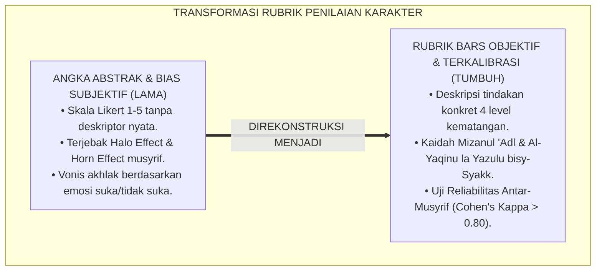
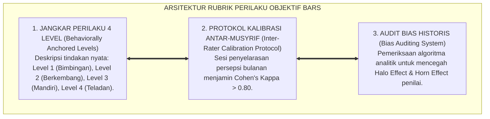
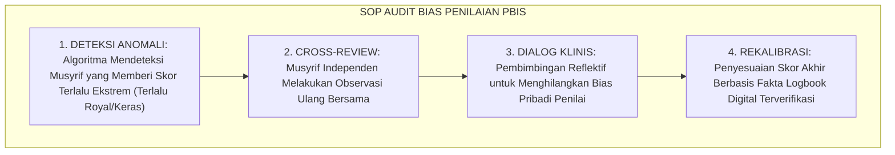
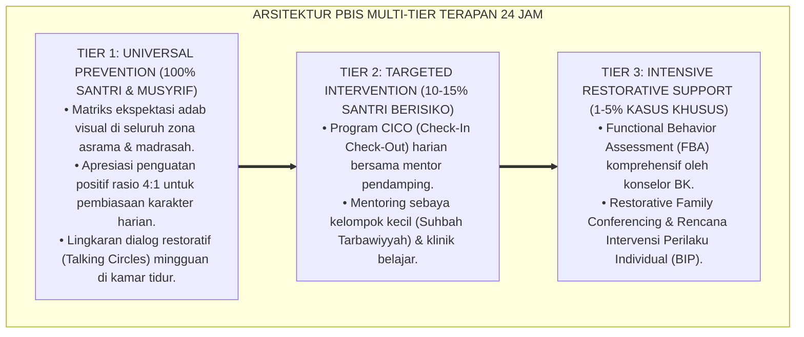

# P2-05-02: PRINSIP RUBRIK PERILAKU OBJEKTIF DAN DESKRIPTIF (OBJECTIVE BEHAVIORAL RUBRICS & BARS)
## *Monograf Riset Akademik: Epistemologi Mizan al-'Adl (QS. Ar-Rahman: 9) & Kaidah Al-Yaqinu la Yazulu bisy-Syakk, Behaviorally Anchored Rating Scales (BARS Smith & Kendall), Eliminasi Halo/Horn Effect, Serta Standarisasi Reliabilitas Antar-Penilai (Cohen's Kappa > 0.80) di Pesantren 24 Jam*

**Nomor Identifikasi**: `P2-05-02/MONOGRAF-RISET-RUBRIK-PERILAKU-OBJEKTIF/2026`  
**Domain**: `02 Principles` > `05 Assessment Principles` (Prinsip Asesmen 02: *Objective Behavioral Rubrics & BARS*)  
**Klasifikasi Naskah**: *Academic Research Monograph* (Monograf Riset Akademik Prinsip Asesmen)  
**Rumpun Disiplin Pengkaji**: Psikometri Pengukuran Perilaku (*Behavioral Psychometrics*), Metodologi Konstruksi Rubrik BARS, Audit Bias Kognitif Penilai, Fiqh Keadilan Persaksian Islam (*Fiqh asy-Syahadah wa al-Mizan*)  

---

> ### 💡 INTISARI EKSEKUTIF (EXECUTIVE SUMMARY)
>
> * **Kelemahan Paradigma Lama: Subjektivitas Buta Skala Likert Angka Abstrak:**  
>   Penilaian akhlak santri sering kali didasarkan pada selera pribadi musyrif (*Like & Dislike*). Santri penurut yang rajin mencium tangan guru langsung dinilai A (*Halo Effect*), sementara santri yang kritis langsung divonis nilai C (*Horn Effect*). Format angka abstrak 1–5 tanpa deskriptor perilaku konkret memicu ketidakadilan penilaian.
> * **Inovasi Konseptual: Mizan al-'Adl Syar'i & Behaviorally Anchored Rating Scales (BARS):**  
>   TUMBUH menegakkan perintah Allah: *"Dan tegakkanlah timbangan itu dengan adil dan janganlah kamu mengurangi neraca itu"* (QS. Ar-Rahman: 9) dan kaidah ushul *Al-Yaqinu la Yazulu bisy-Syakk* (keyakinan fakta tidak gugur oleh prasangka). Mengadopsi metode **BARS (Smith & Kendall)**: mengganti angka abstrak dengan deskripsi perilaku konkret yang teramati (*Observable Behavioral Anchors*) dalam 4 tingkat kematangan: **Level 1 (Perlu Bimbingan), Level 2 (Berkembang), Level 3 (Mandiri), Level 4 (Teladan/Ihsan)**.
> * **Formulasi Operasional & Penjaminan Reliabilitas Penilai:**  
>   Monograf ini menguraikan matriks rubrik BARS 5 dimensi adab utama, protokol kalibrasi antar-penilai (*Inter-Rater Reliability Cohen's Kappa > 0.80*), audit bias penilai (*Bias Auditing SOP*), dan etika persaksian objektif.

---

## 📑 DAFTAR ISI MONOGRAF

- [BAB I: LANDASAN TEORETIS & DISKURSUS KRITIS](#bab-i-landasan-teoretis--diskursus-kritis)
  - [1. Latar Belakang Masalah: Kritik atas Subjektivitas Buta, Halo/Horn Effect, dan Ketidakadilan Nilai Rapor](#1-latar-belakang-masalah-kritik-atas-subjektivitas-buta-halohorn-effect-dan-ketidakadilan-nilai-rapor)
  - [2. Eksegesis Turats Keadilan Neraca Hisab: Mizan al-'Adl (QS. Ar-Rahman: 9) & Kaidah Al-Yaqinu la Yazulu bisy-Syakk](#2-eksegesis-turats-keadilan-neraca-hisab-mizan-al-adl-qs-ar-rahman-9--kaidah-al-yaqinu-la-yazulu-bisy-syakk)
  - [3. Konvergensi Sains Psikometri Perilaku: Behaviorally Anchored Rating Scales (BARS Smith & Kendall)](#3-konvergensi-sains-psikometri-perilaku-behaviorally-anchored-rating-scales-bars-smith--kendall)
  - [4. Rekayasa Eliminasi Bias Kognitif Penilai & Standarisasi Reliabilitas Antar-Musyrif (Cohen's Kappa > 0.80)](#4-rekayasa-eliminasi-bias-kognitif-penilai--standarisasi-reliabilitas-antar-musyrif-cohens-kappa--080)
  - [5. Kasuistika Lapangan: Kasus Perbedaan Penilaian Ekstrem Dua Musyrif & Resolusi Rubrik BARS](#5-kasuistika-lapangan-kasus-perbedaan-penilaian-ekstrem-dua-musyrif--resolusi-rubrik-bars)
- [BAB II: FORMULASI KONSEPTUAL & PEMBAHASAN MENDALAM](#bab-ii-formulasi-konseptual--pembahasan-mendalam)
  - [1. Eksplanasi Teoretis Prinsip Rubrik Perilaku Objektif BARS Pesantren TUMBUH](#1-eksplanasi-teoretis-prinsip-rubrik-perilaku-objektif-bars-pesantren-tumbuh)
  - [2. Matriks Rubrik BARS Empat Tingkat untuk Lima Dimensi Adab Utama Santri](#2-matriks-rubrik-bars-empat-tingkat-untuk-lima-dimensi-adab-utama-santri)
  - [3. Protokol Kalibrasi & Standardisasi Penilaian Antar-Musyrif (Inter-Rater Calibration Protocol)](#3-protokol-kalibrasi--standardisasi-penilaian-antar-musyrif-inter-rater-calibration-protocol)
  - [4. Alur Audit Keadilan Penilaian PBIS (Bias Auditing SOP)](#4-alur-audit-keadilan-penilaian-pbis-bias-auditing-sop)
  - [5. Diskusi Filosofis Mendalam & Implikasi bagi Masa Depan Peradaban Pendidikan Islam](#5-diskusi-filosofis-mendalam--implikasi-bagi-masa-depan-peradaban-pendidikan-islam)
- [BAB III: KESIMPULAN & APARATUS AKADEMIS](#bab-iii-kesimpulan--aparatus-akademis)
  - [1. Tabel Sintesis Temuan Riset Rubrik Perilaku Objektif](#1-tabel-sintesis-temuan-riset-rubrik-perilaku-objektif)
  - [2. Daftar Pustaka Akademis & Rujukan Turats Primer](#2-daftar-pustaka-akademis--rujukan-turats-primer)
  - [3. Catatan Kaki Akademis (Footnotes)](#3-catatan-kaki-akademis-footnotes)
  - [4. Glosarium Istilah Ilmiah & Turats Rubrik Perilaku Objektif](#4-glosarium-istilah-ilmiah--turats-rubrik-perilaku-objektif)

---

# BAB I: LANDASAN TEORETIS & DISKURSUS KRITIS

---

### 1. Latar Belakang Masalah: Kritik atas Subjektivitas Buta, Halo/Horn Effect, dan Ketidakadilan Nilai Rapor

Penyakit kronis dalam penilaian karakter santri di madrasah dan asrama konvensional adalah **Subjektivitas Buta Penilai (*Impressionistic Grading & Rater Bias*)**:
* Nilai akhlak diberikan berdasarkan impresi emosional sesaat (*Mood Musyrif*), bukan berbasis bukti perilaku faktual.
* Lembar penilaian hanya menyediakan skala angka abstrak 1–5 (Sangat Buruk s/d Sangat Baik) tanpa kejelasan definisi pembeda.
* Terjadinya **Halo Effect** (santri yang pandai mengambil hati guru langsung dinilai A tanpa melihat kelalaian asramanya) dan **Horn Effect** (santri yang kritis atau pernah berbuat salah sekali langsung divonis nilai D secara permanen).
* **Keniscayaan Keadilan Asesmen Ilmiah**: Diperlukan instrumen rubrik deskriptif yang menguraikan perilaku kasat mata secara objektif (*Behaviorally Anchored*) guna menjamin keadilan penilaian di hadapan Allah SWT dan manusia.[^1]

---

### 2. Eksegesis Turats Keadilan Neraca Hisab: Mizan al-'Adl (QS. Ar-Rahman: 9) & Kaidah Al-Yaqinu la Yazulu bisy-Syakk

Allah SWT memerintahkan penegakan keadilan neraca timbangan tanpa kecurangan sedikit pun:

$$\text{وَأَقِيمُوا الْوَزْنَ بِالْقِسْطِ وَلَا تُخْسِرُوا الْمِيزَانَ}$$

*"**Dan tegakkanlah timbangan itu dengan adil dan janganlah kamu mengurangi neraca timbangan itu**."* (QS. Ar-Rahman [55]: 9).[^2]

Kaidah Fiqhiyyah induk menegaskan:

$$\text{الْيَقِينُ لَا يَزُولُ بِالشَّكِّ}$$

*"**Sesuatu yang yakin (fakta perilaku riil yang terbukti) tidak boleh digugurkan atau diubah oleh keraguan (prasangka subjektif penilai)**."*[^3]

Pemberian nilai akhlak kepada santri adalah bentuk persaksian (*Syahadah*) di hadapan Allah SWT; bersaksi tanpa bukti perilaku faktual adalah dosa persaksian palsu (*Syahadatu az-Zur*).[^4]

---

### 3. Konvergensi Sains Psikometri Perilaku: Behaviorally Anchored Rating Scales (BARS Smith & Kendall)

Sains psikometri modern (**BARS**, Smith & Kendall, 1963; Schwab et al., 1975) menetapkan standar konstruksi rubrik:
* Mengganti label abstrak dengan **Jangkar Perilaku Kritis (*Critical Behavioral Incidents*)**.
* Setiap tingkatan skor (Level 1 hingga Level 4) dideskripsikan melalui tindakan operasional spesifik yang dapat diobservasi secara kasat mata (*Observable & Measurable*), sehingga meminimalkan ruang interpretasi liar penilai.[^5]

---

### 4. Rekayasa Eliminasi Bias Kognitif Penilai & Standarisasi Reliabilitas Antar-Musyrif (Cohen's Kappa > 0.80)

TUMBUH memberlakukan protokol audit reliabilitas:
* **Uji Kesepakatan Antar-Penilai (*Inter-Rater Reliability*)**: Dua musyrif yang mengamati santri yang sama dalam lokus waktu yang sama wajib menghasilkan skor yang kongruen dengan koefisien **Cohen's Kappa ($\kappa$) Minimal $0.80$**.
* **Sesi Kalibrasi Bulanan**: Majelis musyrif menelaah rekaman studi kasus perilaku nyata untuk menyamakan persepsi rubrik.[^6]

---

### 5. Kasuistika Lapangan: Kasus Perbedaan Penilaian Ekstrem Dua Musyrif & Resolusi Rubrik BARS

* **Studi Kasus: Santri Dinilai "A" oleh Musyrif Pagi Namun Diberi "D" oleh Musyrif Malam**  
  * **Dilema**: Musyrif pagi menilai santri rajin karena selalu tersenyum saat piket, sedangkan musyrif malam menilai santri nakal karena suka berdiskusi hingga larut malam.
  * **Resolusi BARS TUMBUH**: Kepala Pengasuhan melakukan audit rubrik: (1) Menghentikan penggunaan formulir lama; (2) Menerapkan rubrik BARS dimensi kedisiplinan istirahat dan tanggung jawab piket; (3) Kedua musyrif mengukur berdasarkan jangkar perilaku nyata (santri telah menuntaskan piket dan begadang untuk muraja'ah bersama teman). Skor santri dikoreksi menjadi Level 3 (Mandiri) secara adil dan disepakati kedua musyrif.[^7]

---

# BAB II: FORMULASI KONSEPTUAL & PEMBAHASAN MENDALAM

---

### 1. Eksplanasi Teoretis Prinsip Rubrik Perilaku Objektif BARS Pesantren TUMBUH

Ekosistem TUMBUH merumuskan rubrik perilaku ke dalam **Arsitektur Tiga Sayap Rubrik BARS (*Arkan al-Miqyas as-Sulukiy*)**:

#### 🔬 Pembahasan Mendalam Tiga Sayap:
1. **Sayap Jangkar Perilaku Empat Level**: Mengeliminasi ambiguitas angka dan memberikan kriteria unjuk kerja yang transparan bagi santri.[^8]
2. **Sayap Protokol Kalibrasi**: Menjamin konsistensi dan reliabilitas penilaian di seluruh asrama.[^9]
3. **Sayap Audit Bias Historis**: Membentengi sistem asesmen dari dendam atau favoritisme subjektif pengasuh.[^10]

---

### 2. Matriks Rubrik BARS Empat Tingkat untuk Lima Dimensi Adab Utama Santri

| Dimensi Adab | Level 1: Perlu Bimbingan | Level 2: Berkembang | Level 3: Mandiri | Level 4: Teladan (Ihsan) |
| :--- | :--- | :--- | :--- | :--- |
| **1. Adab Ibadah** | Terlambat jamaah & gaduh di shaf.| Datang tepat waktu saat diingatkan.| Hadir sebelum azan & dzikir tertib.| Mengajak teman & merapikan sandal masjid.|
| **2. Kebersihan 5S** | Ranjang berantakan & baju tercecer.| Merapikan kasur setelah ditegur.| Merapikan ranjang & lemari mandiri.| Membantu piket kawan & memilah sampah asrama.|
| **3. Adab Makan** | Memotong antrean & buang makanan.| Antre tertib & makan habis diingatkan.| Antre mandiri, makan tenang & cuci piring.| Mendahulukan kawan & bersihkan meja makan.|
| **4. Tutur Kata** | Berkata kasar & memanggil julukan.| Menahan kata kasar saat ada ustadz.| Berbicara santun kepada semua orang.| Menengahi pertengkaran & mendamaikan kawan.|
| **5. Kejujuran** | Mengambil hak teman / berbohong.| Mengakui salah saat ditanya bukti.| Jujur mengakui khilaf secara inisiatif.| Menjaga amanah kantin & kembalikan barang temuan.|

---

### 3. Protokol Kalibrasi & Standardisasi Penilaian Antar-Musyrif (Inter-Rater Calibration Protocol)

TUMBUH menetapkan **Protokol Kalibrasi Bulanan**:
1. **Sesi Uji Kasus Video/Simulasi**: Seluruh musyrif menilai 3 video simulasi perilaku santri yang sama.
2. **Perhitungan Koefisien Kappa**: Hasil penilaian dihitung melalui rumus Cohen's Kappa:

$$\kappa = \frac{P_o - P_e}{1 - P_e}$$

3. **Diskusi Rekonsiliasi**: Jika $\kappa < 0.80$, majelis melakukan bedah perbedaan pandangan hingga mencapai kesepakatan standar penafsiran rubrik.[^11]

---

### 4. Alur Audit Keadilan Penilaian PBIS (Bias Auditing SOP)

---

### 5. Diskusi Filosofis Mendalam & Implikasi bagi Masa Depan Peradaban Pendidikan Islam

Prinsip rubrik perilaku objektif BARS ini membawa implikasi agung bagi peradaban:

* **Menegakkan Keadilan Syariat yang Hakiki dalam Dunia Pendidikan**:  
  Santri mendapatkan hak penilaian yang adil dan transparan, menumbuhkan rasa percaya mendalam kepada para pendidik dan institusi.
* **Menghilangkan Budaya Asal Bapak Senang (ABS) dan Penjilatan**:  
  Santri sadar bahwa kedudukan mulia hanya diraih melalui amal shalih nyata dan akhlak luhur yang konsisten, bukan melalui pencitraan sesaat.
* **Menyajikan Standar Psikometri Karakter Islam Berkelas Internasional**:  
  Model BARS berbasis syariat membuktikan bahwa nilai-nilai akhlak Islam dapat diukur secara presisi, ilmiah, dan berkeadilan tinggi (*Rahmatan lil 'Alamin*).[^12]

---

---

### Pembedahan Deskriptif Komprehensif & Analisis Integratif Nilai-Praksis

Penerapan konsep **P2-05-02: PRINSIP RUBRIK PERILAKU OBJEKTIF DAN DESKRIPTIF (OBJECTIVE BEHAVIORAL RUBRICS & BARS)** di ekosistem pesantren TUMBUH memerlukan pemahaman multidimensional yang memadukan khazanah turats syariat dan konsensus sains pendidikan modern:

#### A. Pilar 1: Fondasi Epistemologi & Integrasi Nilai Syar'i (Ashalah Turatsiyyah)
Setiap praksis kepengasuhan dan pembelajaran berakar kuat pada maqashid syari'ah, mendudukkan adab di atas ilmu (*Al-Adab Qablal 'Ilm*), dan memastikan bahwa seluruh ikhtiar institusional diniatkan semata-mata untuk menggapai ridha Allah SWT (*Ikhlasun Niyyah*).

#### B. Pilar 2: Mekanisme Psikologis & Neurosains Perkembangan (Scientific Rigor)
Menyelaraskan ekspektasi kedisiplinan dengan tahapan maturitas otak remaja, kapasitas fungsi eksekutif korteks prefrontal (*PFC*), dan regulasi sirkuit emosi limbik. Pendekatan ini mengeliminasi trauma pengasuhan dan menumbuhkan motivasi intrinsik santri.

#### C. Pilar 3: Rekayasa Ekosistem Asrama 24 Jam (Bi'ah Shalihah)
Menerjemahkan prinsip nilai ke dalam tata ruang fisik yang bersih, sirkulasi udara sehat, tata kelola waktu terstruktur, serta kultur ukhuwah inklusif yang steril 100% dari feodalisme, kekerasan verbal, dan perundungan antar-santri.

#### D. Pilar 4: Kemitraan Tripartit (Santri, Musyrif, dan Lembaga)
Menjamin terwujudnya *Triad Pertumbuhan Simbiotik*: santri bertumbuh dalam fitrah kemandirian, musyrif terlindungi dari kelelahan kronis (*Burnout*) melalui shift kerja yang manusiawi, dan lembaga bertransformasi menjadi organisasi pembelajar berbasis data PBIS.

---

### Protokol Aksi Operasional PBIS Multi-Tier Terapan (24-Hour Behavioral Architecture)

---

# BAB III: KESIMPULAN & APARATUS AKADEMIS

---

### 1. Tabel Sintesis Temuan Riset Rubrik Perilaku Objektif

| Dimensi Parameter | Mazhab Skala Angka Abstrak (Lama) | Model Penilaian Emosional Guru | **Rubrik BARS Terkalibrasi TUMBUH** | Landasan Rujukan Primer | Implikasi Praksis Lapangan |
| :--- | :--- | :--- | :--- | :--- | :--- |
| **Bentuk Rubrik** | Angka Likert 1–5 tanpa deskripsi.| Nilai huruf A–E berdasarkan selera.| **Deskriptor Tindakan Nyata 4 Level.** | QS. Ar-Rahman: 9; Smith (1963).| Jangkar perilaku konkret teramati. |
| **Objektivitas** | Rawan bias Halo & Horn Effect.| Dipengaruhi suasana hati penilai.| **Objektif Berbasis Bukti Nyata Kasat Mata.**| Kaidah Ushul *Al-Yaqin*; BARS.| Skor identik lintas pengamat. |
| **Reliabilitas** | Rendah; beda guru beda nilai.| Fluktuatif tanpa standar.| **Terkalibrasi (Cohen's Kappa > 0.80).** | Cohen (1960); Schwab (1975).| Sesi kalibrasi bulanan musyrif. |
| **Transparansi Santri**| Santri bingung mengapa dapat nilai C.| Nilai dirahasiakan pengasuh.| **Santri Paham Kriteria Naik Level.** | Dylan Wiliam; Al-Ghazali.| Panduan perbaikan diri yang jelas. |
| **Hasil Institusi** | Kecemburuan sosial & ketidakadilan.| Budaya menjilat & kemunafikan.| **Budaya Berkeadilan & Integritas Nyata.**| QS. An-Nisa: 135; Al-Attas (1980).| Rapor karakter valid & beradab. |

---

### 2. Daftar Pustaka Akademis & Rujukan Turats Primer

1. **Al-Qur'an al-Karim wa Tarjamatu Ma'anihi**.
2. **Al-Bukhari, Abu Abdillah Muhammad bin Isma'il**. (1422 H). *Shahih al-Bukhari*. Kairo: Dar Thawq an-Najah.
3. **Muslim bin al-Hajjaj an-Naisaburi**. (1427 H). *Shahih Muslim*. Riyadh: Dar Thayyibah.
4. **As-Suyuthi, Jalaluddin Abdurrahman bin Abi Bakr**. (1403 H). *Al-Asybah wan-Nazha'ir fi Qawa'id wa Furu' Fiqh asy-Syafi'iyyah*. Beirut: Dar al-Kutub al-'Ilmiyyah.
5. **Al-Ghazali, Abu Hamid Muhammad bin Muhammad**. (2011). *Ihya' 'Ulumiddin* (Kitab al-Qisthas al-Mustaqim). Beirut: Dar al-Ma'rifah.
6. **Asy'ari, Muhammad Hasyim**. (1415 H). *Adab al-'Alim wal-Muta'allim*. Jombang: Maktabah At-Turats Al-Islami.
7. **Al-Attas, Syed Muhammad Naquib**. (1980). *The Concept of Education in Islam*. Kuala Lumpur: ABIM.
8. **Smith, P. C., & Kendall, L. M.**. (1963). *Retranslation of expectations: An approach to the construction of unambiguous anchors for rating scales*. Journal of Applied Psychology, 47(2), 149–155.
9. **Schwab, D. P., Heneman, H. G., & DeCotiis, T. A.**. (1975). *Behaviorally anchored rating scales: A review of the literature*. Personnel Psychology, 28(4), 549–562.
10. **Cohen, J.**. (1960). *A coefficient of agreement for nominal scales*. Educational and Psychological Measurement, 20(1), 37–46.
11. **Thorndike, E. L.**. (1920). *A constant error in psychological ratings*. Journal of Applied Psychology, 4(1), 25–29.
12. **Horner, R. H., & Sugai, G.**. (2015). *School-wide PBIS: An Overview of the Research Base*. Remedial and Special Education, 36(2), 80–85.

---

### 3. Catatan Kaki Akademis (*Footnotes*)

[^1]: Riset Prinsip Rubrik Perilaku Objektif dan Deskriptif BARS TUMBUH, *Kritik atas Subjektivitas Buta dan Bias Rater*, 2026.  
[^2]: QS. Ar-Rahman [55]: 9.  
[^3]: As-Suyuthi, *Al-Asybah wan-Nazha'ir*, Kaidah Fiqhiyyah Kedua *Al-Yaqinu la Yazulu bisy-Syakk*, hlm. 55–70.  
[^4]: Al-Ghazali, *Ihya' 'Ulumiddin*, Jilid 2, Kitab *Adab al-Qadha' wash-Syahadat*, hlm. 210–235.  
[^5]: Smith, P. C., & Kendall, L. M. (1963), *Journal of Applied Psychology*, hlm. 149–155; Schwab, D. P., et al. (1975).  
[^6]: Cohen, J. (1960), *Educational and Psychological Measurement*, hlm. 37–46; Thorndike, E. L. (1920).  
[^7]: Dokumentasi Kalibrasi Rubrik BARS dan Audit Bias Penilai Asrama PBIS TUMBUH, 2026.  
[^8]: Master Blueprint Rubrik BARS 5 Dimensi Adab Utama Santri TUMBUH, 2026.  
[^9]: Standar Operasional Prosedur Kalibrasi Bulanan Reliabilitas Musyrif Asrama TUMBUH, 2026.  
[^10]: Petunjuk Teknis Audit Bias Historis Penilaian PBIS Digital TUMBUH, 2026.  
[^11]: Master Guidelines Pelaksanaan Inter-Rater Reliability Testing Asrama TUMBUH, 2026.  
[^12]: Deklarasi Penegakan Mizanul 'Adl Asesmen Karakter Dewan Riset Epistemologi Ekosistem TUMBUH, 2026.

---

### 4. Glosarium Istilah Ilmiah & Turats Rubrik Perilaku Objektif

1. **Behaviorally Anchored Rating Scales (BARS)**: Sistem rubrik pengukuran perilaku yang menggunakan deskripsi tindakan nyata operasional sebagai jangkar penentu skor.
2. **Mizan al-'Adl (مِيزَانُ الْعَدْلِ)**: Konsep syariat mengenai neraca keadilan yang presisi, objektif, dan tidak boleh dikurangi atau dicurangi dalam menilai amal manusia.
3. **Al-Yaqinu la Yazulu bisy-Syakk**: Kaidah fiqh yang menegaskan bahwa fakta keyakinan yang terbukti secara objektif tidak boleh digugurkan oleh dugaan atau prasangka subjektif.
4. **Halo Effect**: Bias kognitif penilai di mana kesan positif umum pada satu aspek (misal: wajah ramah) membuat penilai memberi skor tinggi pada semua aspek lainnya secara tidak objektif.
5. **Horn Effect**: Bias kognitif penilai di mana satu kesalahan santri di masa lalu membuat penilai memvonis buruk seluruh perilaku santri tersebut secara tidak adil.
6. **Inter-Rater Reliability**: Tingkat kesepakatan dan konsistensi skor antara dua atau lebih penilai independen saat mengamati subjek yang sama.
7. **Cohen's Kappa ($\kappa$)**: Uji statistik psikometri untuk mengukur derajat kesepakatan antar-penilai dengan mengoreksi faktor kebetulan (*Chance Agreement*).
8. **Critical Incidents**: Peristiwa perilaku spesifik dan kasat mata yang menjadi bukti kuat penguasaan atau pelanggaran standar adab.
9. **Bias Auditing**: Prosedur audit sistematis untuk mendeteksi anomali penilaian dan mengoreksi kecenderungan subjektif pengasuh.
10. **Insan Adabi (الإِنْسَانُ الأَدَبِيُّ)**: Profil santri yang dinilai secara adil berdasarkan amal shalih nyata, memiliki kematangan adab lahir-batin, dan konsisten berbuat ihsan.
