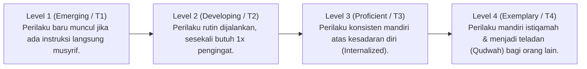

# P2-05-02-Prinsip-Rubrik-Perilaku-Objektif-dan-Deskriptif

## Tujuan
Menetapkan standar penyusunan **Rubrik Penilaian Perilaku Berbasis Bukti (*Behaviorally Anchored Rating Scales - BARS*)**, menghapus subjektivitas (*Like & Dislike*) pendidik, dan memberikan deskripsi capaian adab yang konkret dan dapat diobservasi.

---

## 1. Menghilangkan Bias Penilaian Subjektif

Pemberian nilai adab dalam bentuk huruf (A, B, C, D) tanpa kriteria operasional sering kali dipengaruhi oleh bias personal pendidik (santri pendiam otomatis dinilai A, santri aktif dinilai C). 

TUMBUH menggantikannya dengan **Rubrik 4 Tingkat Capaian Tangga TUMBUH**:

---

## 2. Contoh Matriks Rubrik Perilaku Adab Sholat Berjamaah

| Dimensi Adab | Level 1 (T1) | Level 2 (T2) | Level 3 (T3) | Level 4 (T4) |
| :--- | :--- | :--- | :--- | :--- |
| **Disiplin Waktu ke Masjid** | Tiba di masjid setelah iqamah berkumandang / butuh dipanggil musyrif. | Tiba di masjid saat adzan berkumandang dengan kesadaran sendiri. | Tiba di masjid 5–10 menit sebelum adzan, sholat sunnah qabliyah. | Tiba sebelum adzan di shaf terdepan dan mengumandangkan adzan / mengajak rekan sekamar. |
| **Ketenangan & Khusyuk** | Masih sering menoleh, bercanda saat dzikir. | Tenang selama sholat, namun tergesa-gesa keluar setelah salam. | Khusyuk sholat dan berdzikir tertib hingga doa selesai. | Khusyuk sholat, melengkapi sholat sunnah ba'diyah dan membaca Al-Qur'an secara mandiri. |

---

## 3. Status Dokumen
* **Status**: 🌟 **A+ (Tervalidasi & Siap Diimplementasikan)**
* **Level**: Project 2 - `02 Principles / 05 Assessment Principles`
* **Langkah Berikutnya**: **`P2-05-03-Prinsip-Triangulasi-Data-Multi-Sumber.md`**.
