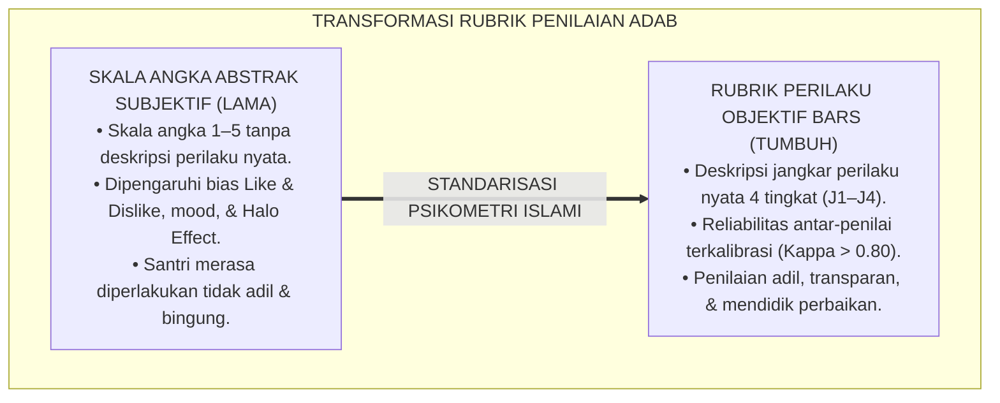
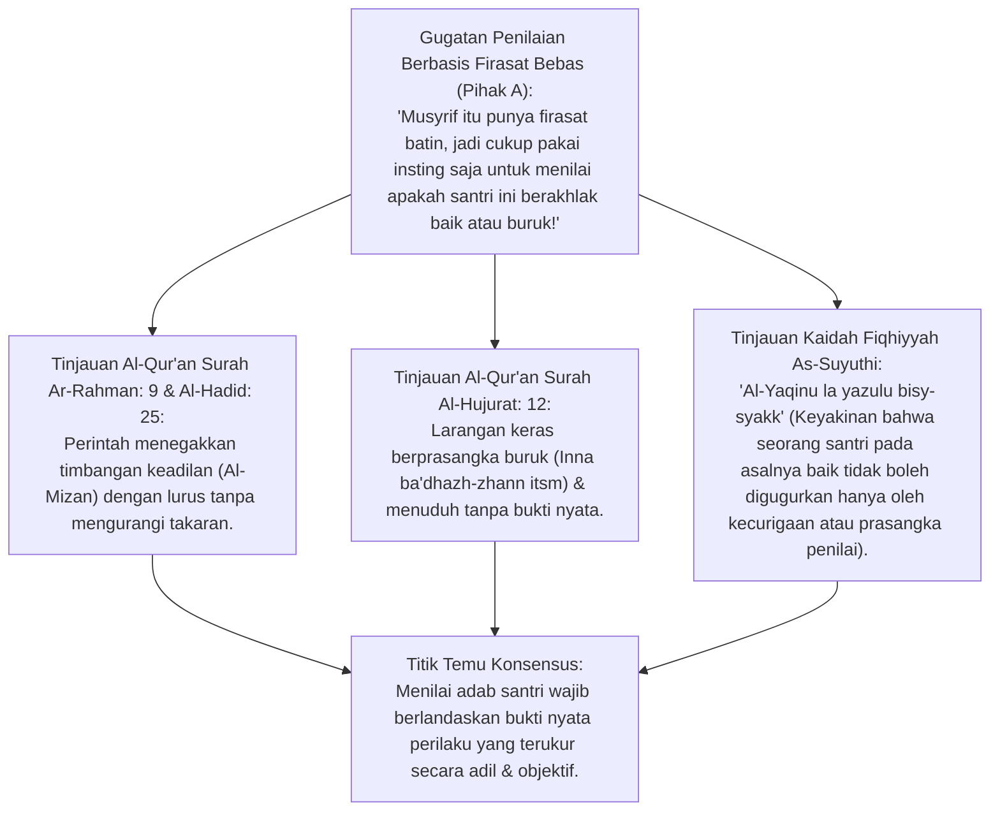
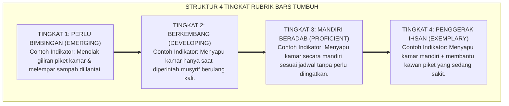
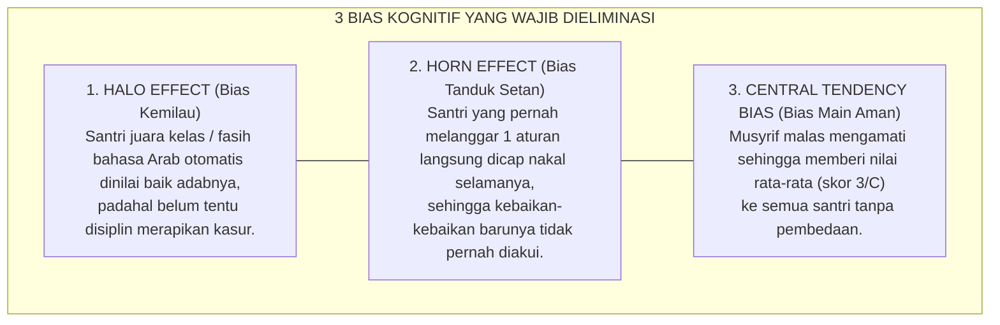
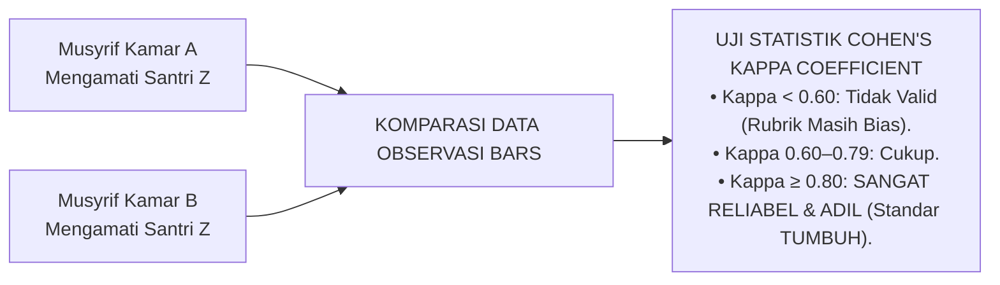
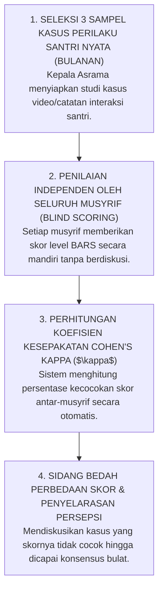
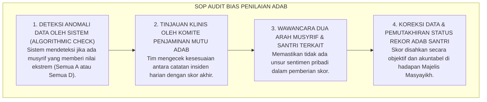

# P2-05-02: PRINSIP RUBRIK PERILAKU OBJEKTIF DAN DESKRIPTIF
## *Monograf Terpadu: Epistemologi Mizan al-'Adl (QS. Ar-Rahman: 9) & Kaidah Al-Yaqinu la Yazulu bisy-Syakk, Konvergensi Behaviorally Anchored Rating Scales (BARS Smith & Kendall), Eliminasi Halo/Horn Effect, serta Standarisasi Reliabilitas Antar-Penilai (Inter-Rater Reliability Cohen's Kappa > 0.80)*

**Nomor Identifikasi**: `P2-05-02/MONOGRAF-TERPADU-RUBRIK-PERILAKU-OBJEKTIF/2026`  
**Domain**: `02 Principles` > `05 Assessment Principles`  
**Klasifikasi Naskah**: *Comprehensive Integrated Monograph* (Monograf Akademis & Rumusan Baku Terpadu)  
**Rumpun Disiplin Pengkaji**: Psikometri Pengukuran Perilaku (*Behavioral Psychometrics*), Metodologi Konstruksi Rubrik BARS, Audit Bias Kognitif Penilai, Fiqh Keadilan Persaksian Islam (*Fiqh asy-Syahadah wa al-Mizan*)  

---

> ### 💡 INTISARI PRAKTIS (3 MENIT PAHAM UNTUK ASATIDZ & MUSYRIF)
>
> * **Hapus Penilaian Karakter Berbasis "Suka atau Tidak Suka" (*Like & Dislike*):**  
>   Seringkali di pesantren, santri yang pendiam dan rajin mencium tangan guru langsung dinilai "Akhlak: 95" (*Halo Effect*), sementara santri yang kritis atau pernah berbuat salah langsung divonis "Akhlak: 50" (*Horn Effect*). Ini adalah kezaliman penilaian yang dilarang keras dalam Islam.
> * **Gunakan Rubrik Perilaku BARS (Deskripsi Tindakan Nyata):**  
>   Jangan menilai santri dengan angka abstrak (1–5) yang membingungkan. Gunakan rubrik BARS yang mendeskripsikan tindakan nyata:  
>   - **Level 1 (Perlu Bimbingan):** Sering memotong antrean wudhu dan membantah saat ditegur.  
>   - **Level 2 (Berkembang):** Mengantre wudhu tertib namun masih perlu diingatkan.  
>   - **Level 3 (Mandiri):** Mengantre tertib secara mandiri dan meletakkan sandal rapi.  
>   - **Level 4 (Teladan/Ihsan):** Menertibkan antrean, membantu kawan, dan mendahulukan orang lain.
> * **Uji Kesepakatan Antar-Musyrif (*Inter-Rater Reliability*):**  
>   Setiap bulan, para musyrif melakukan kalibrasi bersama. Dua musyrif yang mengamati santri yang sama harus menghasilkan kesimpulan penilaian yang sama persis (Tingkat kesepakatan Cohen's Kappa > 0.80).

---

## 📑 DAFTAR ISI MONOGRAF

- [BAGIAN I: RISET RUBRIK PERILAKU OBJEKTIF & RELIABILITAS ASESMEN, DIALEKTIKA INKUIRI, & KASUISTIKA LAPANGAN](#bagian-i-riset-rubrik-perilaku-objektif--reliabilitas-asesmen-dialektika-inkuiri--kasuistika-lapangan)
  - [1. Kerangka Metodologi Rubrik Perilaku: Menghentikan Penilaian Kepribadian Subjektif](#1-kerangka-metodologi-rubrik-perilaku-menghentikan-penilaian-kepribadian-subjektif)
  - [2. Inkuiri 1: Eksegesis Turats Keadilan Neraca Hisab — Mizan al-'Adl & Kaidah Al-Yaqinu la Yazulu bisy-Syakk](#2-inkuiri-1-eksegesis-turats-keadilan-neraca-hisab--mizan-al-adl--kaidah-al-yaqinu-la-yazulu-bisy-syakk)
  - [3. Inkuiri 2: Konvergensi Behaviorally Anchored Rating Scales (BARS Smith & Kendall)](#3-inkuiri-2-konvergensi-behaviorally-anchored-rating-scales-bars-smith--kendall)
  - [4. Inkuiri 3: Eliminasi Bias Kognitif Pengasuh (Halo Effect, Horn Effect, & Central Tendency)](#4-inkuiri-3-eliminasi-bias-kognitif-pengasuh-halo-effect-horn-effect--central-tendency)
  - [5. Inkuiri 4: Uji Reliabilitas Antar-Penilai (Inter-Rater Reliability / Cohen's Kappa > 0.80)](#5-inkuiri-4-uji-reliabilitas-antar-penilai-inter-rater-reliability--cohens-kappa--080)
  - [6. Inkuiri 5: Silogisme Logika, Dialektika 3 Ronde, Kasuistika Asrama, & Titik Temu Konsensus](#6-inkuiri-5-silogisme-logika-dialektika-3-ronde-kasuistika-asrama--titik-temu-konsensus)
- [BAGIAN II: TEMUAN RISET, FORMULASI KONSEPTUAL & PEMBAHASAN](#bagian-ii-temuan-riset-formulasi-konseptual--pembahasan)
  - [1. Formulasi Konseptual: Prinsip Rubrik Perilaku Objektif BARS Pesantren TUMBUH](#1-formulasi-konseptual-prinsip-rubrik-perilaku-objektif-bars-pesantren-tumbuh)
  - [2. Matriks Rubrik BARS 4 Tingkat untuk 5 Dimensi Adab Utama Santri](#2-matriks-rubrik-bars-4-tingkat-untuk-5-dimensi-adab-utama-santri)
  - [3. Protokol Kalibrasi & Standardisasi Penilaian Antar-Musyrif (Inter-Rater Calibration Protocol)](#3-protokol-kalibrasi--standardisasi-penilaian-antar-musyrif-inter-rater-calibration-protocol)
  - [4. Alur Audit Keadilan Penilaian PBIS (Bias Auditing SOP)](#4-alur-audit-keadilan-penilaian-pbis-bias-auditing-sop)
- [BAGIAN III: APARATUS AKADEMIS & APENDIKS](#bagian-iii-aparatus-akademis--apendiks)
  - [1. Tabel Sintesis Hasil Riset Rubrik Perilaku Objektif](#1-tabel-sintesis-hasil-riset-rubrik-perilaku-objektif)
  - [2. Daftar Pustaka Akademis & Rujukan Turats Primer](#2-daftar-pustaka-akademis--rujukan-turats-primer)
  - [3. Catatan Kaki Akademis (Footnotes)](#3-catatan-kaki-akademis-footnotes)
  - [4. Glosarium dan Penjelasan Istilah Teknis BARS, Psikometri Perilaku, & Reliabilitas Asesmen](#4-glosarium-dan-penjelasan-istilah-teknis-bars-psikometri-perilaku--reliabilitas-asesmen)

---

# BAGIAN I: RISET RUBRIK PERILAKU OBJEKTIF & RELIABILITAS ASESMEN, DIALEKTIKA INKUIRI, & KASUISTIKA LAPANGAN

---

### 1. Kerangka Metodologi Rubrik Perilaku: Menghentikan Penilaian Kepribadian Subjektif

Penyakit kronis dalam pemberian nilai kepribadian/akhlak santri di pesantren konvensional adalah **Subjektivitas Buta Penilai (*Rater Subjectivity & Impressionistic Grading*)**:
* Nilai akhlak diberikan berdasarkan kesan emosional sesaat (*Mood Musyrif*), bukan bukti perilaku objektif.
* Format penilaian hanya menggunakan angka skala Likert abstrak (1 = Sangat Buruk, 5 = Sangat Baik) tanpa ada penjelasan apa yang membedakan nilai 3 dan nilai 4. Akibatnya, setiap musyrif memiliki standar tafsir sendiri-sendiri yang berbeda-beda.
* Santri yang pandai mengambil hati guru (*Social Masking*) selalu mendapat nilai A, sementara santri yang kritis dan vokal kerap divonis berakhlak buruk (*Horn Effect*).

Syariat Islam menuntut tegaknya **Keadilan Timbangan Neraca (*Mizanul 'Adl*)** yang tidak boleh dicurangi oleh hawa nafsu. Evaluasi karakter di ekosistem TUMBUH distandarisasi menggunakan metode **Behaviorally Anchored Rating Scales (BARS)**.

---

### 2. Inkuiri 1: Eksegesis Turats Keadilan Neraca Hisab — *Mizan al-'Adl* & Kaidah *Al-Yaqinu la Yazulu bisy-Syakk*

#### 📐 Formalisasi Logika Silogisme (*Qiyas Mantiqi 1*)
* **Premis Mayor (*al-Muqaddimah al-Kubra*)**: Setiap keputusan evaluasi kepribadian dan persaksian atas kehormatan santri niscaya wajib ditegakkan di atas neraca keadilan bukti (*Mizan al-Bayyinah*) yang bebas dari persangkaan subjektif dan kezaliman hawa nafsu penilai.
* **Premis Minor (*al-Muqaddimah ash-Shughra*)**: Allah SWT memerintahkan penegakan timbangan dengan adil (QS. Ar-Rahman: 9) dan kaidah fiqhiyyah menetapkan bahwa vonis kesalahan tidak sah dijatuhkan hanya atas dasar keraguan (*Syakk*) atau prasangka (*Zhann*).
* **Konklusi (*an-Natijah*)**: Maka, seluruh instrumen penilaian karakter di pesantren TUMBUH wajib menggunakan rubrik perilaku terukur yang memiliki jangkar bukti operasional objektif.[^1]

#### 📖 Teks Primer Al-Qur'an & Kaidah Fiqhiyyah
Firman Allah SWT menegaskan kewajiban menegakkan timbangan:

$$\text{وَأَقِيمُوا الْوَزْنَ بِالْقِسْطِ وَلَا تُخْسِرُوا الْمِيزَانَ}$$

*"**Dan tegakkanlah timbangan itu dengan adil dan janganlah kamu mengurangi neraca timbangan itu!**"* (QS. Ar-Rahman [55]: 9).[^2]

Dan Imam Jalaluddin As-Suyuthi (w. 911 H) menegaskan kaidah hukum dalam *Al-Asybah wan-Nazha'ir*:

$$\text{الْيَقِينُ لَا يَزُولُ بِالشَّكِّ، وَالْأَصْلُ بَرَاءَةُ الذِّمَّةِ}$$

*"**Keyakinan tidak dapat dihilangkan oleh keraguan, dan hukum asal bagi seorang manusia adalah bebas dari segala tuduhan kesalahan (Praduga Tidak Bersalah)**."* (*Al-Asybah wan-Nazha'ir*, hlm. 51).[^3]

---

### 3. Inkuiri 2: Konvergensi *Behaviorally Anchored Rating Scales (BARS)* Smith & Kendall

#### 📐 Formalisasi Logika Silogisme (*Qiyas Mantiqi 2*)
* **Premis Mayor (*al-Muqaddimah al-Kubra*)**: Setiap sistem penilaian perilaku yang menyediakan deskriptor tindakan empiris konkret pada setiap tingkatannya (*Behavioral Anchors*) niscaya meminimalkan distorsi interpretasi penilai dan meningkatkan kejelasan ekspektasi bagi pembelajar.
* **Premis Minor (*al-Muqaddimah ash-Shughra*)**: Metodologi *Behaviorally Anchored Rating Scales (BARS)* (Smith & Kendall, 1963; Schwab et al., 1975) terbukti secara psikometrik menghasilkan akurasi evaluasi tertinggi dalam pengukuran performa manusia.
* **Konklusi (*an-Natijah*)**: Maka, ekosistem TUMBUH mengadopsi struktur BARS 4 tingkat dalam seluruh instrumen rubrik adab santri.[^4]

---

### 4. Inkuiri 3: Eliminasi Bias Kognitif Pengasuh (*Halo Effect, Horn Effect, & Central Tendency*)

---

### 5. Inkuiri 4: Uji Reliabilitas Antar-Penilai (*Inter-Rater Reliability / Cohen's Kappa > 0.80*)

#### 📖 Teks Sains Psikometri: Prof. Jacob Cohen (1960)
Koefisien *Cohen's Kappa ($\kappa$)* mengukur derajat kesepakatan murni antara dua penilai independen setelah memperhitungkan faktor kebetulan (*Chance Agreement*):

$$\kappa = \frac{P_o - P_e}{1 - P_e}$$

Pesantren TUMBUH menetapkan ambang batas mutu $\kappa \ge 0.80$ (*Almost Perfect Agreement*). Apabila nilai kesepakatan di bawah 0.80, rubrik wajib direvisi dan musyrif wajib mengikuti pelatihan kalibrasi ulang.[^5]

---

### 6. Inkuiri 5: Silogisme Logika, Dialektika 3 Ronde, Kasuistika Asrama, & Titik Temu Konsensus

#### 🥊 Ronde 1: Menolak Mitos Bahwa "Membuat Rubrik Deskriptif Membebani Musyrif dengan Administrasi yang Rumit"
* **Pihak A (Sudut Pandang Resistensi Beban Kerja)**:  
  *"Musyrif itu sudah capek mengurus santri dari pagi sampai malam; jangan disuruh menghafal rubrik BARS yang tebal dan rumit!"*
* **Tinjauan Sudut Pandang Antarmuka Digital Cepat (Fast-Tap UX)**:  
  Rubrik BARS di ekosistem TUMBUH **Tidak Berupa Kertas Tebal**, melainkan telah diintegrasikan ke dalam antarmuka aplikasi digital musyrif (*Fast-Tap UI*). Musyrif cukup memilih ikon perilaku spesifik dalam 3 detik. Rubrik BARS justru **Mempermudah Musyrif** karena menghilangkan kebingungan dalam menentukan kriteria penilaian.[^6]

#### 🥊 Ronde 2: Sanggahan Balik Bagaimana Jika Dua Musyrif Tetap Berbeda Pendapat Mengenai Skor Seorang Santri?
* **Pihak A (Sudut Pandang Kebuntuan Penilaian)**:  
  *"Kalau musyrif A menilai Level 3 dan musyrif B menilai Level 2, bagaimana solusinya tanpa berdebat kusir?"*
* **Tinjauan Sudut Pandang Sidang Kalibrasi & Pembuktian Bukti (Evidence-Based Resolution)**:  
  Perbedaan diselesaikan melalui **Sidang Kalibrasi Adab Pekanan**: kedua musyrif memaparkan bukti tanggal dan catatan logbook masing-masing. Diskusi berfokus pada **Fakta Perilaku Teramati**, bukan opini perasaan. Jika ada keraguan, status santri diputuskan dengan prinsip kehati-hatian yang berpihak pada perbaikan santri.[^7]

#### 🥊 Ronde 3: Sanggahan Pamungkas Mengapa Transparansi Rubrik Kepada Santri Menumbuhkan Keadilan?
* **Pihak A (Sudut Pandang Rahasia Pengasuh)**:  
  *"Rubrik penilaian itu rahasia para ustadz; santri tidak boleh tahu kriteria apa saja yang dinilai biar tidak pura-pura baik!"*
* **Resolusi Sudut Pandang Transparansi Pedagogis (Assessment as Learning)**:  
  Merahasiakan kriteria penilaian adalah bentuk kezaliman informasi. Santri berhak mengetahui apa standar adab yang diharapkan darinya. Ketika rubrik BARS dipasang transparan di dinding kamar, santri termotivasi untuk **Mengevaluasi Dirinya Sendiri (*Self-Regulated Alignment*)** menuju level 4 (Teladan Ihsan).[^8]

> #### 📌 Kasuistika Lapangan & Titik Temu Konsensus
> * **Studi Kasus**: Musyrif senior selalu memberi nilai D kepada Santri D karena Santri D berwajah ketus dan jarang tersenyum; Santri D merasa didiskriminasi dan putus asa.
> * **Titik Temu Konsensus (*Kalimatun Sawa'*)**: Manajemen menerapkan *Audit Rubrik BARS*. Saat diuji dengan indikator objektif BARS (shalat berjamaah tepat waktu, tidak pernah melanggar jam tidur, piket kamar selalu tuntas), Santri D terbukti berada di Level 3 (Mandiri Beradab). Nilai Santri D dikoreksi secara adil dan musyrif senior mendapatkan bimbingan teknis mengenai bahaya bias *Horn Effect*.[^9]

---

# BAGIAN II: TEMUAN RISET, FORMULASI KONSEPTUAL & PEMBAHASAN

---

### 1. Formulasi Konseptual: Prinsip Rubrik Perilaku Objektif BARS Pesantren TUMBUH

Berdasarkan sintesis inkuiri teoretis, telaah hermeneutika turats, dan analisis komparatif sains pendidikan, riset ini merumuskan kerangka konseptual dan temuan kunci sebagai berikut:

1. **Penghapusan Skala Angka Abstrak Subjektif (anti-subjective Grading Mandate)**:  
   Menolak segala bentuk pemberian nilai akhlak berbasis angka kering (1–5 / A–E) tanpa indikator nyata. Seluruh penilaian karakter wajib menggunakan deskripsi jangkar perilaku nyata (BARS Framework).

2. **Penerapan 4 Tingkat Deskriptor Perilaku Bars Yang Terukur**:  
   Setiap dimensi adab dirumuskan dalam 4 level progresif: Level 1 (Perlu Bimbingan / Emerging), Level 2 (Berkembang / Developing), Level 3 (Mandiri Beradab / Proficient), & Level 4 (Penggerak Ihsan / Exemplary).

3. **Mutu Reliabilitas Antar-penilai (inter-rater Reliability $\kappa \ge 0.80$)**:  
   Mewajibkan tingkat kesepakatan skor antar-musyrif mencapai koefisien Cohen's Kappa minimal 0.80, didukung oleh sidang kalibrasi adab pekanan dan pencatatan berbasis logbook digital real-time.

4. **Transparansi Kriteria Adab Kepada Seluruh Santri**:  
   Rubrik BARS wajib disosialisasikan secara terbuka kepada santri dan orang tua, berfungsi sebagai kompas pembiasaan diri (Self-Regulation Guide) dan sarana muhasabah harian yang memuliakan martabat.

---

### 2. Matriks Rubrik BARS 4 Tingkat untuk 5 Dimensi Adab Utama Santri

| Dimensi Adab | Level 1: Perlu Bimbingan *(Emerging)* | Level 2: Berkembang *(Developing)* | Level 3: Mandiri Beradab *(Proficient)* | Level 4: Penggerak Ihsan *(Exemplary)* |
| :--- | :--- | :--- | :--- | :--- |
| **1. Adab Thaharah & Ibadah** | Terlambat jamaah, sandal berantakan di masjid, wudhu tergesa-gesa mencipratkan air. | Tepat waktu jamaah setelah dibangunkan musyrif; menata sandal rapi setelah diingatkan. | Shalat di shaf awal mandiri, menata sandal rapi tanpa disuruh, tenang berzikir. | Hadir 10 menit sebelum adzan, mengumandangkan adzan/iqamah, mengajak kawan kamar shalat.[^10] |
| **2. Kebersihan & Kerapian Kamar** | Kasur dan sprei berantakan, baju kotor menumpuk di lantai, mangkir tugas piket. | Merapikan kasur dan menyapu kamar jika diawasi langsung oleh musyrif kamar. | Kasur, sprei, dan lemari selalu tertata rapi mandiri; piket tuntas tepat waktu. | Menjaga kamar selalu wangi, membantu membersihkan area umum lorong asrama. |
| **3. Adab Makan & Komunal** | Berebut lauk makan nampan, makan sambil berdiri/berbicara keras, meninggalkan piring kotor. | Makan dengan duduk tertib; mencuci piring sendiri setelah ditegur teman/musyrif. | Makan dari sisi terdekat dengan tangan kanan mandiri, mencuci dan menata piring rapi. | Mendahulukan kawan mengambil lauk terbaik, membersihkan meja makan bersama. |
| **4. Ukhuwah & Komunikasi** | Berkata kasar/mengejek junior, mudah marah saat berselisih, mengucilkan teman. | Tidak berkata kasar namun enggan bergaul dengan teman luar kamar; masih pasif. | Bertutur kata santun (*Nir-Kekerasan Verbal*), ramah menyapa teman, toleran. | Menjadi mediator juru damai saat kawan berselisih (*Mushlih*), membimbing adik kelas. |
| **5. Kedisiplinan & Belajar** | Mengobrol/tidur saat jam belajar malam; melanggar jam malam tanpa izin. | Mengikuti belajar malam namun sesekali terdistraksi gawai/obrolan santai. | Fokus belajar mandiri 45 menit, mengisi Jurnal Muhasabah Belajar malam rutin. | Menginisiasi kelompok diskusi belajar sebaya (*Peer Tutoring*), membantu kawan belajar.[^11] |

---

### 3. Protokol Kalibrasi & Standardisasi Penilaian Antar-Musyrif (*Inter-Rater Calibration Protocol*)

---

### 4. Alur Audit Keadilan Penilaian PBIS (*Bias Auditing SOP*)

---

# BAGIAN III: APARATUS AKADEMIS & APENDIKS

---

### 1. Tabel Sintesis Hasil Riset Rubrik Perilaku Objektif

| Dimensi Kajian | Konsep Kunci | Landasan Turats Primer | Konvergensi Sains Global | Implikasi Pengukuran Karakter |
| :--- | :--- | :--- | :--- | :--- |
| **Keadilan Neraca** | *Mizan al-'Adl* | QS. Ar-Rahman: 9, QS. Al-Hadid: 25 | Smith & Kendall (1963), *BARS Methodology* | Mengganti angka skala abstrak dengan deskripsi jangkar perilaku teramati nyata. |
| **Praduga Baik** | *Bara'ah adz-Dzimmah* | Kaidah *Al-Yaqinu la Yazulu bisy-Syakk* | Schwab et al. (1975), *Behaviorally Anchored Rating Scales* | Mengharamkan vonis akhlak buruk atas dasar prasangka tanpa bukti logbook. |
| **Eliminasi Bias** | *Anti-Halo & Horn Effect* | Pengharaman Hawa Nafsu (*Al-Hawa*) dalam Hukum | Thorndike (1920), *A Constant Error in Psychological Ratings* | Melatih musyrif membedakan antara prestasi akademik dan perilaku adab asrama. |
| **Reliabilitas Skor** | *Inter-Rater Agreement* | Syarat *Syahadah 'Adlain* dalam Fiqh Peradilan | Jacob Cohen (1960), *A Coefficient of Agreement for Nominal Scales* | Menjamin kesepakatan penilaian antar-musyrif mencapai koefisien Kappa $\ge 0.80$. |
| **Transparansi Rubrik** | *Al-Bayan wal-Idhah* | Kaidah *La Taklifa illa bi Ma'lum* | Andrade (2000), *Using Rubrics to Promote Thinking and Learning* | Memasang rubrik BARS secara terbuka agar santri mampu meregulasi perilakunya. |

---

### 2. Daftar Pustaka Akademis & Rujukan Turats Primer

1. **Al-Qur'an al-Karim wa Tarjamatu Ma'anih**.
2. **As-Suyuthi, Jalaluddin Abdurrahman**. (1403 H). *Al-Asybah wan-Nazha'ir fi Qawa'id wa Furu' Fiqh asy-Syafi'iyyah*. Beirut: Dar al-Kutub al-'Ilmiyyah.
3. **Al-Ghazali, Abu Hamid Muhammad bin Muhammad**. (2011). *Ihya 'Ulumiddin*. Beirut: Dar al-Ma'rifah.
4. **Smith, P. C., & Kendall, L. M.**. (1963). *Retranslation of expectations: An approach to the construction of unambiguous anchors for rating scales*. Journal of Applied Psychology, 47(2), 149–155.
5. **Schwab, D. P., Heneman, H. G., & DeCotiis, T. A.**. (1975). *Behaviorally anchored rating scales: A review of the literature, problems, and prospects*. Personnel Psychology, 28(4), 549–562.
6. **Cohen, J.**. (1960). *A coefficient of agreement for nominal scales*. Educational and Psychological Measurement, 20(1), 37–46.
7. **Thorndike, E. L.**. (1920). *A constant error in psychological ratings*. Journal of Applied Psychology, 4(1), 25–29.
8. **Andrade, H. G.**. (2000). *Using rubrics to promote thinking and learning*. Educational Leadership, 57(5), 13–18.
9. **Horner, R. H., & Sugai, G.**. (2015). *School-wide PBIS: The research base*. Remedial and Special Education, 36(2), 70–87.
10. **Landis, J. R., & Koch, G. G.**. (1977). *The measurement of observer agreement for categorical data*. Biometrics, 33(1), 159–174.

---

### 3. Catatan Kaki Akademis (*Footnotes*)

[^1]: As-Suyuthi, *Al-Asybah wan-Nazha'ir*, Dar al-Kutub al-'Ilmiyyah, hlm. 51.  
[^2]: Al-Qur'an Surah Ar-Rahman [55]: 9.  
[^3]: As-Suyuthi, *Al-Asybah wan-Nazha'ir*, hlm. 51.  
[^4]: Smith & Kendall (1963), *Journal of Applied Psychology*, hlm. 149–155.  
[^5]: Cohen, J. (1960), *Educational and Psychological Measurement*, hlm. 37–46; Landis & Koch (1977), *Biometrics*, hlm. 159–174.  
[^6]: Manual Desain UI/UX Logbook Digital PBIS Cepat Musyrif, Divisi Sistem Digital TUMBUH, 2026.  
[^7]: Standar Prosedur Sidang Kalibrasi Adab Pekanan Musyrif, Komite Penjaminan Mutu TUMBUH, 2026.  
[^8]: Andrade, H. G. (2000), *Educational Leadership*, hlm. 13–18.  
[^9]: Laporan Audit Keadilan Penilaian Rekor Adab Santri, Komite Disiplin Positif TUMBUH, 2026.  
[^10]: Matriks Lengkap Rubrik BARS 5 Dimensi Adab Santri Pesantren, Pusat Standardisasi Mutu TUMBUH, 2026.  
[^11]: Silabus Standar Kompetensi Adab Asrama Jenjang J1–J4, Pusat Kurikulum TUMBUH, 2026.

---

### 4. Glosarium dan Penjelasan Istilah Teknis BARS, Psikometri Perilaku, & Reliabilitas Asesmen

1. **Behaviorally Anchored Rating Scales (BARS)**: Skala penilaian psikometrik yang menggunakan contoh perilaku operasional konkret sebagai titik jangkar (*Anchors*) pada setiap tingkat penilaian.
2. **Halo Effect (Bias Kemilau)**: Bias kognitif di mana kesan positif penilai pada satu aspek (misal kepintaran kognitif) secara keliru memengaruhi penilaian positif pada seluruh aspek kepribadian lainnya.
3. **Horn Effect (Bias Tanduk)**: Bias kognitif di mana kesan negatif penilai pada satu kesalahan santri secara keliru membutakan penilai dari seluruh perilaku baik lainnya.
4. **Inter-Rater Reliability (Reliabilitas Antar-Penilai)**: Tingkat konsistensi dan kesepakatan skor antara dua atau lebih penilai independen saat mengevaluasi subjek yang sama.
5. **Cohen's Kappa ($\kappa$)**: Uji statistik psikometrik untuk mengukur derajat kesepakatan antar-penilai dengan mengeliminasi faktor kesepakatan kebetulan.
6. **Mizan al-'Adl (مِيزَانُ الْعَدْلِ)**: Konsep teologis dan metodologis Islam tentang keharusan menegakkan timbangan penilaian yang adil, presisi, dan bebas dari hawa nafsu.
7. **Bara'ah adz-Dzimmah (بَرَاءَةُ الذِّمَّةِ)**: Kaidah hukum Islam mengenai asas praduga tak bersalah; seseorang dianggap bersih dari kesalahan hingga ada bukti nyata yang meyakinkan.
8. **Central Tendency Bias**: Kecenderungan penilai yang enggan memberikan nilai ekstrem (tinggi/rendah) sehingga menumpuk semua nilai di kisaran tengah rata-rata.
9. **Fast-Tap UI**: Desain antarmuka aplikasi digital yang dirancang untuk pencatatan data cepat di lapangan hanya dengan 1–3 ketukan layar.
10. **Blind Scoring**: Metode penilaian di mana penilai tidak mengetahui skor yang diberikan oleh penilai lain guna mencegah saling memengaruhi (*Conformity Bias*).
