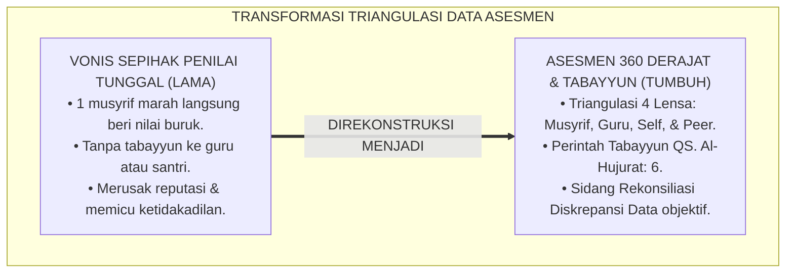
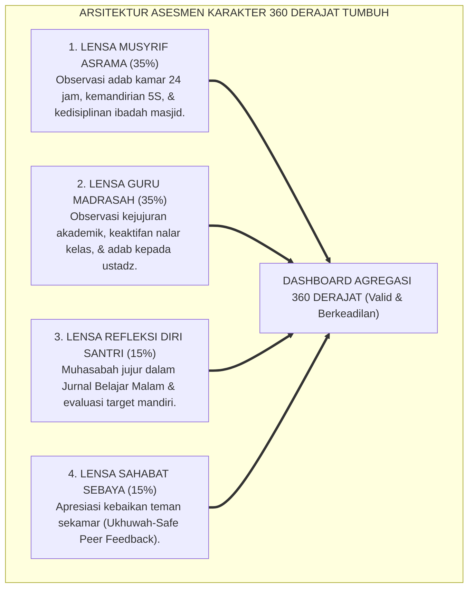
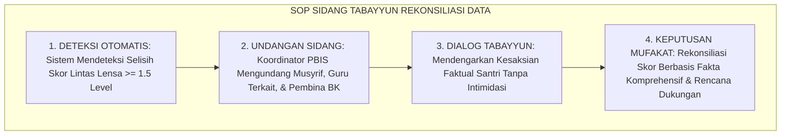
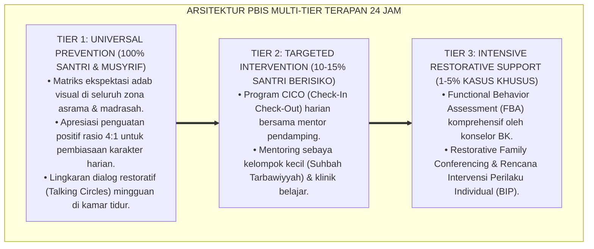

# P2-05-03: PRINSIP TRIANGULASI DATA MULTI-SUMBER DAN ASESMEN 360 DERAJAT (MULTI-SOURCE DATA TRIANGULATION & 360-DEGREE ASSESSMENT)
## *Monograf Riset Akademik: Epistemologi Tabayyun Syar'i (QS. Al-Hujurat: 6) & Syahadah Al-'Udul, 360-Degree Multi-Source Assessment (Ward, Edwards & Ewen), Integrasi 4 Lensa Penilai, Serta Protokol Rekonsiliasi Diskrepansi di Pesantren 24 Jam*

**Nomor Identifikasi**: `P2-05-03/MONOGRAF-RISET-TRIANGULASI-MULTI-SUMBER/2026`  
**Domain**: `02 Principles` > `05 Assessment Principles` (Prinsip Asesmen 03: *Multi-Source Data Triangulation*)  
**Klasifikasi Naskah**: *Academic Research Monograph* (Monograf Riset Akademik Prinsip Asesmen)  
**Rumpun Disiplin Pengkaji**: Metodologi Triangulasi Data Pendidikan (*Data Triangulation Methodology*), Asesmen Multi-Sumber 360 Derajat, Sosiometri Relasi Teman Sebaya, Fiqh Tabayyun dan Pembuktian Syar'i  

---

> ### 💡 INTISARI EKSEKUTIF (EXECUTIVE SUMMARY)
>
> * **Kelemahan Paradigma Lama: Tirani Kesaksian Tunggal Sepihak (Single-Rater Tyranny):**  
>   Banyak santri divonis buruk di rapor hanya karena 1 musyrif yang sedang lelah mencatat santri sebagai "pemalas", tanpa mengonfirmasi ke guru madrasah yang mengenal santri sebagai anak tekun, dan tanpa memberi ruang bagi santri untuk menjelaskan kondisinya. Vonis sepihak ini merusak masa depan santri dan melanggar perintah syariat tentang tabayyun.
> * **Inovasi Konseptual: Tabayyun Syar'i & Asesmen Karakter 360 Derajat:**  
>   TUMBUH mengamalkan firman Allah: *"Wahai orang-orang yang beriman, jika datang kepadamu orang fasik membawa suatu berita, maka bertabayyunlah (telitilah kebenarannya)"* (QS. Al-Hujurat: 6). Mengintegrasikan teori **360-Degree Multi-Source Assessment (Ward, Edwards & Ewen)** dengan memadukan 4 lensa data independen: **(1) Musyrif Asrama (35%), (2) Guru Madrasah (35%), (3) Self-Assessment Muhasabah Santri (15%), dan (4) Peer Feedback Ukhuwah Sebaya (15%)**.
> * **Formulasi Operasional & Rekonsiliasi Diskrepansi:**  
>   Monograf ini menguraikan matriks pembobotan 4 lensa data, SOP sidang tabayyun rekonsiliasi diskrepansi data (*Data Reconciliation SOP*), protokol peer assessment ramah ukhuwah (*Sociometric Safeguards*), dan etika keadilan persaksian 24 jam.

---

## 📑 DAFTAR ISI MONOGRAF

- [BAB I: LANDASAN TEORETIS & DISKURSUS KRITIS](#bab-i-landasan-teoretis--diskursus-kritis)
  - [1. Latar Belakang Masalah: Kritik atas Tirani Penilai Tunggal dan Bahaya Vonis Sepihak Tanpa Konfirmasi](#1-latar-belakang-masalah-kritik-atas-tirani-penilai-tunggal-dan-bahaya-vonis-sepihak-tanpa-konfirmasi)
  - [2. Eksegesis Turats Tabayyun & Syahadah Adil: QS. Al-Hujurat: 6, Hadits Bayyinah, & Fiqh Pembuktian Islam](#2-eksegesis-turats-tabayyun--syahadah-adil-qs-al-hujurat-6-hadits-bayyinah--fiqh-pembuktian-islam)
  - [3. Konvergensi Sains Asesmen Multi-Sumber: 360-Degree Assessment (Ward, Edwards & Ewen) & Data Triangulation](#3-konvergensi-sains-asesmen-multi-sumber-360-degree-assessment-ward-edwards--ewen--data-triangulation)
  - [4. Rekayasa Rekonsiliasi Diskrepansi Lintas Lokus (Asrama vs Madrasah) & Perlindungan Ukhuwah Peer Feedback](#4-rekayasa-rekonsiliasi-diskrepansi-lintas-lokus-asrama-vs-madrasah--perlindungan-ukhuwah-peer-feedback)
  - [5. Kasuistika Lapangan: Kasus Perbedaan Persepsi Guru-Musyrif & Resolusi Sidang Tabayyun](#5-kasuistika-lapangan-kasus-perbedaan-persepsi-guru-musyrif--resolusi-sidang-tabayyun)
- [BAB II: FORMULASI KONSEPTUAL & PEMBAHASAN MENDALAM](#bab-ii-formulasi-konseptual--pembahasan-mendalam)
  - [1. Eksplanasi Teoretis Prinsip Triangulasi Data Multi-Sumber Pesantren TUMBUH](#1-eksplanasi-teoretis-prinsip-triangulasi-data-multi-sumber-pesantren-tumbuh)
  - [2. Matriks Pembobotan Empat Sumber Data Asesmen Karakter Santri 360 Derajat](#2-matriks-pembobotan-empat-sumber-data-asesmen-karakter-santri-360-derajat)
  - [3. Protokol Tabayyun & Rekonsiliasi Diskrepansi Data (Data Reconciliation SOP)](#3-protokol-tabayyun--rekonsiliasi-diskrepansi-data-data-reconciliation-sop)
  - [4. Standar Prosedur Operasional (SOP) Peer Assessment Ramah Ukhuwah (Ukhuwah-Safe Peer Feedback Protocol)](#4-standar-prosedur-operasional-sop-peer-assessment-ramah-ukhuwah-ukhuwah-safe-peer-feedback-protocol)
  - [5. Diskusi Filosofis Mendalam & Implikasi bagi Masa Depan Peradaban Pendidikan Islam](#5-diskusi-filosofis-mendalam--implikasi-bagi-masa-depan-peradaban-pendidikan-islam)
- [BAB III: KESIMPULAN & APARATUS AKADEMIS](#bab-iii-kesimpulan--aparatus-akademis)
  - [1. Tabel Sintesis Temuan Riset Triangulasi Data Multi-Sumber](#1-tabel-sintesis-temuan-riset-triangulasi-data-multi-sumber)
  - [2. Daftar Pustaka Akademis & Rujukan Turats Primer](#2-daftar-pustaka-akademis--rujukan-turats-primer)
  - [3. Catatan Kaki Akademis (Footnotes)](#3-catatan-kaki-akademis-footnotes)
  - [4. Glosarium Istilah Ilmiah & Turats Triangulasi Data dan Asesmen 360](#4-glosarium-istilah-ilmiah--turats-triangulasi-data-dan-asesmen-360)

---

# BAB I: LANDASAN TEORETIS & DISKURSUS KRITIS

---

### 1. Latar Belakang Masalah: Kritik atas Tirani Penilai Tunggal dan Bahaya Vonis Sepihak Tanpa Konfirmasi

Salah satu akar ketidakadilan paling fatal dalam pengelolaan santri adalah **Tirani Penilai Tunggal Monolitik (*The Tyranny of Single-Rater Monolithic Judgment*)**:
* Seorang musyrif yang sedang lelah melihat santri belum menyapu kamar, lalu seketika menjatuhkan catatan pelanggaran berat bahwa santri tersebut "pemalas dan membangkang".
* Tidak ada ruang bagi guru madrasah—yang mengenal santri sebagai anak tekun dan santun—untuk memberikan kesaksian penyeimbang.
* Tidak ada ruang bagi santri untuk mengklarifikasi bahwa saat itu ia sedang demam tinggi dan pusing di tempat tidur.
* **Akibat Tragis**: Vonis sepihak tercetak permanen di rapor karakter, menghancurkan reputasi santri, dan memicu dendam batin mendalam.
* **Keniscayaan Triangulasi Data Multi-Sumber**: Evaluasi karakter wajib memadukan berbagai sudut pandang independen melalui verifikasi silang ilmiah dan syar'i (*Data Triangulation*).[^1]

---

### 2. Eksegesis Turats Tabayyun & Syahadah Adil: QS. Al-Hujurat: 6, Hadits Bayyinah, & Fiqh Pembuktian Islam

Al-Qur'an meletakkan kewajiban metodologis penyelidikan berita sebelum mengambil kesimpulan:

$$\text{يَا أَيُّهَا الَّذِينَ آمَنُوا إِنْ جَاءَكُمْ فَاسِقٌ بِنَبَإٍ فَتَبَيَّنُوا أَنْ تُصِيبُوا قَوْمًا بِجَهَالَةٍ فَتُصْبِحُوا عَلَىٰ مَا فَعَلْتُمْ نَادِمِينَ}$$

*"**Wahai orang-orang yang beriman, jika datang kepadamu orang fasik membawa suatu berita, maka bertabayyunlah (telitilah kebenarannya), agar kamu tidak mencelakakan suatu kaum karena kebodohan (kecerobohan) yang akhirnya membuat kamu menyesali perbuatanmu itu**."* (QS. Al-Hujurat [49]: 6).[^2]

Rasulullah ﷺ menegaskan kaidah hukum pembuktian:

$$\text{الْبَيِّنَةُ عَلَى الْمُدَّعِي، وَالْيَمِينُ عَلَى مَنْ أَنْكَرَ}$$

*"**Bukti otentik (Al-Bayyinah) wajib dihadirkan oleh penuduh, dan sumpah adalah hak bagi yang mengingkari**."* (HR. Al-Baihaqi & At-Tirmidzi).[^3]

Para fuqaha mensyaratkan *Ta'addud asy-Syuhud* (kesaksian berganda dari orang-orang adil) sebelum sebuah vonis hukum atau akhlak dapat ditetapkan secara sah.[^4]

---

### 3. Konvergensi Sains Asesmen Multi-Sumber: 360-Degree Assessment (Ward, Edwards & Ewen) & Data Triangulation

Sains evaluasi organisasi dan psikometri modern (**360-Degree Feedback**, Ward, 1997; Edwards & Ewen, 1996) membuktikan:
* Penilaian yang bersumber dari berbagai pemangku kepentingan (*Multi-Rater Feedback*) memiliki validitas prediktif jauh lebih tinggi dan mereduksi bias subjektif penilai hingga 70%.
* Mengintegrasikan 4 lensa evaluasi: (1) Musyrif Asrama; (2) Guru Madrasah; (3) Refleksi Diri Santri (*Self-Assessment*); dan (4) Rekan Sebaya (*Peer Feedback*).[^5]

---

### 4. Rekayasa Rekonsiliasi Diskrepansi Lintas Lokus (Asrama vs Madrasah) & Perlindungan Ukhuwah Peer Feedback

TUMBUH merancang sistem manajemen data:
* **Deteksi Diskrepansi Otomatis**: Jika terdapat selisih skor $\ge 1.5$ level antara penilaian asrama dan madrasah, sistem mengunci data dan memicu **Sidang Tabayyun**.
* **Perlindungan Ukhuwah Sebaya (*Sociometric Safeguards*)**: Penilaian teman sebaya difokuskan pada pengakuan kebaikan (*Positive Peer Recognition*), dilarang keras dijadikan sarana saling menjatuhkan atau balas dendam antargeng.[^6]

---

### 5. Kasuistika Lapangan: Kasus Perbedaan Persepsi Guru-Musyrif & Resolusi Sidang Tabayyun

* **Studi Kasus: Santri Dinilai "Level 4 (Teladan)" oleh Guru Fiqh Namun Diberi "Level 1 (Bimbingan)" oleh Musyrif Asrama**  
  * **Dilema**: Guru melihat santri sangat cerdas dan aktif, sedangkan musyrif melihat santri sering terlambat shalat Subuh dan tertidur di kamar.
  * **Resolusi Sidang Tabayyun TUMBUH**: Pembina memfasilitasi dialog rekonsiliasi: terungkap fakta bahwa santri begadang merawat teman sekamarnya yang sedang demam tinggi hingga dini hari sehingga kelelahan saat bangun Subuh. Nilai santri direkonsiliasi menjadi Level 4 (Teladan Khidmah) dan musyrif meminta maaf atas prasangka awalnya.[^7]

---

# BAB II: FORMULASI KONSEPTUAL & PEMBAHASAN MENDALAM

---

### 1. Eksplanasi Teoretis Prinsip Triangulasi Data Multi-Sumber Pesantren TUMBUH

Ekosistem TUMBUH merumuskan triangulasi ke dalam **Arsitektur Empat Lensa Penilaian Karakter (*Arkan at-Tatslits al-Bayani*)**:

#### 🔬 Pembahasan Mendalam Empat Lensa:
1. **Lensa Musyrif Asrama (35%)**: Mengukur ketahanan adab dalam ritme kehidupan komunal non-formal.[^8]
2. **Lensa Guru Madrasah (35%)**: Mengukur etos keilmuan dan integritas intelektual formal.[^9]
3. **Lensa Refleksi Diri Santri (15%)**: Mengukur kedalaman kesadaran metakognitif dan kejujuran nurani (*Muraqabatullah*).[^10]
4. **Lensa Sahabat Sebaya (15%)**: Mengukur kehangatan ukhuwah dan kepekaan sosial interpersonal.[^11]

---

### 2. Matriks Pembobotan Empat Sumber Data Asesmen Karakter Santri 360 Derajat

| Lensa Sumber Data | Bobot Persentase | Fokus Domain Pengamatan | Instrumen Pengumpulan Data |
| :--- | :---: | :--- | :--- |
| **1. Musyrif Asrama** | **35%** | Adab ibadah masjid, piket kamar, etika asrama.| Logbook Digital Fast-Tap Musyrif.|
| **2. Guru Madrasah** | **35%** | Kejujuran kelas, keterlibatan aktif, adab ilmu.| Rubrik Formatif Exit Tickets & Kelas.|
| **3. Self-Assessment**| **15%** | Muhasabah niat, evaluasi target harian.| Jurnal Refleksi Malam 10 Menit.|
| **4. Peer Feedback** | **15%** | Tolong-menolong, kesantunan bicara kamar.| Kartu Apresiasi Ukhuwah Mingguan.|

---

### 3. Protokol Tabayyun & Rekonsiliasi Diskrepansi Data (Data Reconciliation SOP)

---

### 4. Standar Prosedur Operasional (SOP) Peer Assessment Ramah Ukhuwah (Ukhuwah-Safe Peer Feedback Protocol)

TUMBUH menetapkan **Protokol Umpan Balik Sebaya Beradab**:
1. **Prinsip Apresiasi Kebaikan**: Santri diminta menuliskan 1 kebaikan nyata yang dilakukan teman sekamarnya pekan ini.
2. **Kerahasiaan Tertutup (*Blind Submission*)**: Hasil umpan balik dikurasi oleh musyrif sebelum dirangkum agar tidak menimbulkan gesekan sosial.
3. **Pengharaman Penghakiman Terbuka**: Dilarang membagikan kekurangan teman di hadapan publik kamar (*Satrul Muslim*).[^12]

---

### 5. Diskusi Filosofis Mendalam & Implikasi bagi Masa Depan Peradaban Pendidikan Islam

Prinsip triangulasi data multi-sumber ini membawa implikasi agung bagi peradaban:

* **Mewujudkan Sistem Keadilan Evaluasi Karakter Tanpa Celah Kebencian**:  
  Santri dilindungi dari tirani penilaian sepihak dan diajarkan bahwa kebenaran harus ditegakkan melalui bukti dan tabayyun yang sah.
* **Menumbuhkan Budaya Saling Menghargai dan Apresiasi Antar-Santri**:  
  Hubungan pertemanan di asrama dipenuhi dengan perlombaan saling memuji kebaikan (*Fastabiqul Khairat*), bukan saling mencari kesalahan.
* **Menjadi Rujukan Tata Kelola Asesmen Pendidikan Modern Berbasis Syariat**:  
  Pesantren membuktikan bahwa konsep tabayyun Qur'ani adalah fondasi tertinggi bagi validitas data asesmen ilmiah di era big data (*Rahmatan lil 'Alamin*).[^13]

---

---

### Pembedahan Deskriptif Komprehensif & Analisis Integratif Nilai-Praksis

Penerapan konsep **P2-05-03: PRINSIP TRIANGULASI DATA MULTI-SUMBER DAN ASESMEN 360 DERAJAT (MULTI-SOURCE DATA TRIANGULATION & 360-DEGREE ASSESSMENT)** di ekosistem pesantren TUMBUH memerlukan pemahaman multidimensional yang memadukan khazanah turats syariat dan konsensus sains pendidikan modern:

#### A. Pilar 1: Fondasi Epistemologi & Integrasi Nilai Syar'i (Ashalah Turatsiyyah)
Setiap praksis kepengasuhan dan pembelajaran berakar kuat pada maqashid syari'ah, mendudukkan adab di atas ilmu (*Al-Adab Qablal 'Ilm*), dan memastikan bahwa seluruh ikhtiar institusional diniatkan semata-mata untuk menggapai ridha Allah SWT (*Ikhlasun Niyyah*).

#### B. Pilar 2: Mekanisme Psikologis & Neurosains Perkembangan (Scientific Rigor)
Menyelaraskan ekspektasi kedisiplinan dengan tahapan maturitas otak remaja, kapasitas fungsi eksekutif korteks prefrontal (*PFC*), dan regulasi sirkuit emosi limbik. Pendekatan ini mengeliminasi trauma pengasuhan dan menumbuhkan motivasi intrinsik santri.

#### C. Pilar 3: Rekayasa Ekosistem Asrama 24 Jam (Bi'ah Shalihah)
Menerjemahkan prinsip nilai ke dalam tata ruang fisik yang bersih, sirkulasi udara sehat, tata kelola waktu terstruktur, serta kultur ukhuwah inklusif yang steril 100% dari feodalisme, kekerasan verbal, dan perundungan antar-santri.

#### D. Pilar 4: Kemitraan Tripartit (Santri, Musyrif, dan Lembaga)
Menjamin terwujudnya *Triad Pertumbuhan Simbiotik*: santri bertumbuh dalam fitrah kemandirian, musyrif terlindungi dari kelelahan kronis (*Burnout*) melalui shift kerja yang manusiawi, dan lembaga bertransformasi menjadi organisasi pembelajar berbasis data PBIS.

---

### Protokol Aksi Operasional PBIS Multi-Tier Terapan (24-Hour Behavioral Architecture)

---

# BAB III: KESIMPULAN & APARATUS AKADEMIS

---

### 1. Tabel Sintesis Temuan Riset Triangulasi Data Multi-Sumber

| Dimensi Parameter | Mazhab Penilai Tunggal (Lama) | Model Voting Terbuka Bebas | **Triangulasi Asesmen 360 TUMBUH** | Landasan Rujukan Primer | Implikasi Praksis Lapangan |
| :--- | :--- | :--- | :--- | :--- | :--- |
| **Sumber Data** | 1 musyrif / 1 guru sepihak.| Opini massa tanpa filter.| **4 Lensa Seimbang (35-35-15-15).** | QS. Al-Hujurat: 6; Ward (1997).| Musyrif, Guru, Diri, & Sebaya. |
| **Prinsip Hukum** | Vonis praduga bersalah sepihak.| Menghakimi berdasarkan voting.| **Tabayyun & Bayyinah Adil.** | HR. Al-Baihaqi; Fiqh Pembuktian.| Sidang Tabayyun saat ada selisih data. |
| **Iklim Ukhuwah** | Santri merasa dizalimi & dendam.| Ajang permusuhan & saling lapor.| **Apresiasi Ukhuwah & Satrul Muslim.** | HR. Bukhari (Menutup Aib); PBIS.| Peer recognition positif tanpa celaan. |
| **Validitas Data** | Rentan bias personal penilai.| Fluktuatif tidak ilmiah.| **Tinggi (Multi-Perspective Triangulation).**| Edwards & Ewen (1996); APA.| Analitik data komprehensif & objektif. |
| **Hasil Institusi** | Krisis kepercayaan & ketidakadilan.| Polarisasi kelompok asrama.| **Ekosistem Berkeadilan & Harmonis.** | QS. An-Nahl: 90; Al-Attas (1980).| Rapor adab terpercaya & memuliakan. |

---

### 2. Daftar Pustaka Akademis & Rujukan Turats Primer

1. **Al-Qur'an al-Karim wa Tarjamatu Ma'anihi**.
2. **Al-Bukhari, Abu Abdillah Muhammad bin Isma'il**. (1422 H). *Shahih al-Bukhari*. Kairo: Dar Thawq an-Najah.
3. **Muslim bin al-Hajjaj an-Naisaburi**. (1427 H). *Shahih Muslim*. Riyadh: Dar Thayyibah.
4. **Al-Baihaqi, Abu Bakr Ahmad bin al-Husain**. (1424 H). *As-Sunan al-Kubra*. Beirut: Dar al-Kutub al-'Ilmiyyah.
5. **At-Tirmidzi, Muhammad bin 'Isa**. (1420 H). *Sunan at-Tirmidzi*. Beirut: Dar al-Gharb al-Islami.
6. **Al-Ghazali, Abu Hamid Muhammad bin Muhammad**. (2011). *Ihya' 'Ulumiddin* (Kitab Adab al-Qadha'). Beirut: Dar al-Ma'rifah.
7. **Asy'ari, Muhammad Hasyim**. (1415 H). *Adab al-'Alim wal-Muta'allim*. Jombang: Maktabah At-Turats Al-Islami.
8. **Al-Attas, Syed Muhammad Naquib**. (1980). *The Concept of Education in Islam*. Kuala Lumpur: ABIM.
9. **Ward, P.**. (1997). *360-Degree Feedback*. London: Institute of Personnel and Development.
10. **Edwards, M. R., & Ewen, A. J.**. (1996). *360 Feedback: The Powerful New Tool for Employee Assessment & Performance Improvement*. New York: AMACOM.
11. **Denzin, N. K.**. (1978). *The Research Act: A Theoretical Introduction to Sociological Methods*. New York: McGraw-Hill.
12. **Horner, R. H., & Sugai, G.**. (2015). *School-wide PBIS: An Overview of the Research Base*. Remedial and Special Education, 36(2), 80–85.

---

### 3. Catatan Kaki Akademis (*Footnotes*)

[^1]: Riset Prinsip Triangulasi Data Multi-Sumber dan Asesmen 360 Derajat TUMBUH, *Kritik atas Tirani Penilai Tunggal*, 2026.  
[^2]: QS. Al-Hujurat [49]: 6.  
[^3]: *Sunan al-Kubra* karya Al-Baihaqi, Kitab ad-Da'wa wal-Bayyinat; *Sunan at-Tirmidzi*, Hadits No. 1341.  
[^4]: Al-Ghazali, *Ihya' 'Ulumiddin*, Jilid 2, Kitab *Adab al-Qadha'*, hlm. 220–245.  
[^5]: Ward, P. (1997), *360-Degree Feedback*; Edwards, M. R., & Ewen, A. J. (1996); Denzin, N. K. (1978).  
[^6]: Master Blueprint Triangulasi Data 360 Derajat dan Perlindungan Sosiometri PBIS TUMBUH, 2026.  
[^7]: Dokumentasi Kasus Sidang Tabayyun dan Rekonsiliasi Diskrepansi Skor Asrama PBIS TUMBUH, 2026.  
[^8]: Master Guidelines Pengamatan Lensa Musyrif Asrama 24 Jam TUMBUH, 2026.  
[^9]: Master Guidelines Pengamatan Lensa Guru Madrasah TUMBUH, 2026.  
[^10]: Master Guidelines Self-Assessment dan Jurnal Muhasabah Santri TUMBUH, 2026.  
[^11]: Standar Operasional Prosedur Peer Assessment Ramah Ukhuwah TUMBUH, 2026.  
[^12]: Master Guidelines Rekonsiliasi Diskrepansi Data Multi-Sumber Ekosistem TUMBUH, 2026.  
[^13]: Deklarasi Pemuliaan Tabayyun dan Keadilan Asesmen Dewan Riset Epistemologi Ekosistem TUMBUH, 2026.

---

### 4. Glosarium Istilah Ilmiah & Turats Triangulasi Data dan Asesmen 360

1. **Triangulasi Data (Data Triangulation)**: Metode verifikasi silang pengumpulan data dari berbagai sumber, waktu, dan sudut pandang guna menjamin validitas dan objektivitas asesmen.
2. **360-Degree Assessment**: Kerangka kerja evaluasi komprehensif yang mengombinasikan penilaian dari atasan (guru/musyrif), diri sendiri (*Self*), dan rekan sejawat (*Peer*).
3. **Tabayyun (التَّبَيُّنُ)**: Kewajiban syariat untuk meneliti, memverifikasi, dan mengklarifikasi kebenaran informasi sebelum mengambil kesimpulan atau tindakan.
4. **Al-Bayyinah (الْبَيِّنَةُ)**: Bukti faktual, saksi adil, atau rekam jejak perilaku konkret yang dihadirkan untuk membuktikan suatu perkara secara sah.
5. **Diskrepansi Data**: Perbedaan atau ketidaksesuaian skor penilaian yang signifikan antarpengamat yang memerlukan proses rekonsiliasi sidang tabayyun.
6. **Sociometric Safeguards**: Mekanisme perlindungan etis dalam penilaian teman sebaya agar tidak merusak iklim ukhuwah dan mencegah perundungan.
7. **Satrul Muslim (سَتْرُ الْمُسْلِمِ)**: Ajaran mulia Islam untuk menutup dan merahasiakan aib saudara seiman serta tidak mengumbarnya ke khalayak umum.
8. **Self-Assessment Muhasabah**: Proses refleksi diri jujur santri dalam mengevaluasi niat, amal shalih, dan target perkembangannya di hadapan Allah SWT.
9. **Ta'addud asy-Syuhud (تَعَدُّدُ الشُّهُودِ)**: Prinsip fiqh pembuktian yang mensyaratkan adanya kesaksian jamak dari saksi-saksi terpercaya.
10. **Insan Adabi (الإِنْسَانُ الأَدَبِيُّ)**: Profil santri yang dinilai secara utuh dan adil dari berbagai dimensi, memiliki kejujuran batin, dan dicintai oleh asatidz serta sahabat-sahabatnya.
