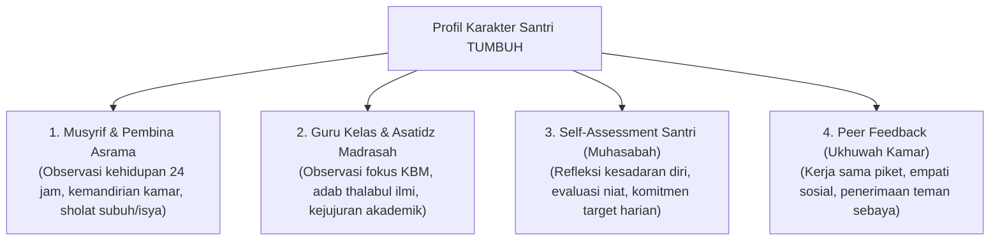

# P2-05-03-Prinsip-Triangulasi-Data-Multi-Sumber

## Tujuan
Menetapkan metode **Triangulasi Data Multi-Sumber (*360-Degree Behavioral Triangulation*)** dalam asesmen karakter santri, menggabungkan penilaian dari 4 sudut pandang yang saling melengkapi untuk memastikan objektivitas, keadilan, dan keutuhan data.

---

## 1. 4 Sudut Pandang Triangulasi Karakter

---

## 2. Manfaat Metodologis Triangulasi

1. **Mendeteksi Perilaku 'Bunglon' (*Contextual Inconsistency*)**:
   - Mengetahui jika seorang santri sangat sopan di depan guru kelas, namun sering berbuat kasar atau menindas adik kelas di kamar asrama saat tidak ada guru.
2. **Memberdayakan Kesadaran Santri (*Empowering Self-Reflection*)**:
   - Membandingkan hasil penilaian mandiri santri (*Self-Assessment*) dengan penilaian musyrif membantu melatih *Self-Awareness* (CASEL SEL).
3. **Mencegah Fitnah & Laporan Palsu**:
   - Keputusan intervensi disiplin tidak pernah didasarkan pada satu laporan sepihak tanpa konfirmasi silang (*Tabayyun Syar'i*).

---

## 3. Status Dokumen
* **Status**: 🌟 **A+ (Tervalidasi & Siap Diimplementasikan)**
* **Level**: Project 2 - `02 Principles / 05 Assessment Principles`
* **Langkah Berikutnya**: **`P2-05-04-Prinsip-Portofolio-Pertumbuhan-Formatif.md`**.
