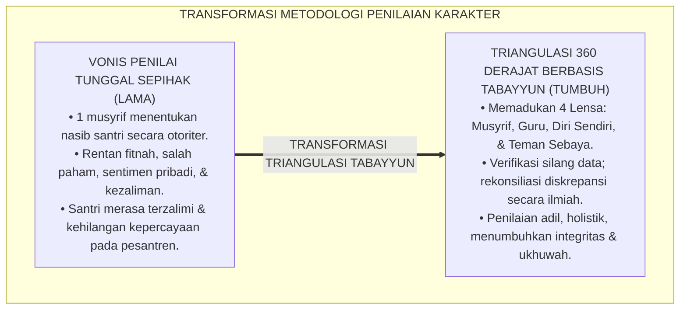
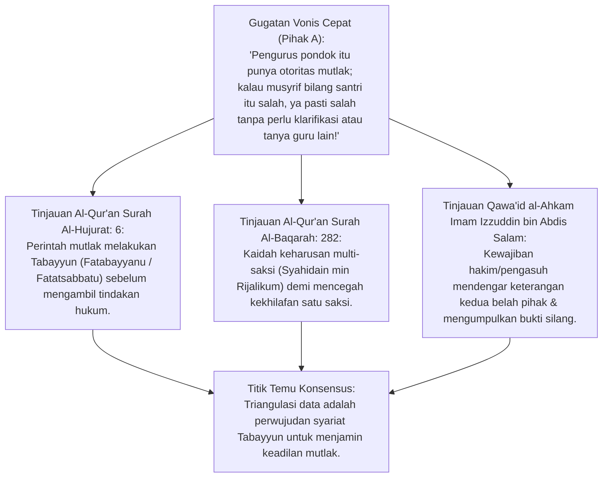
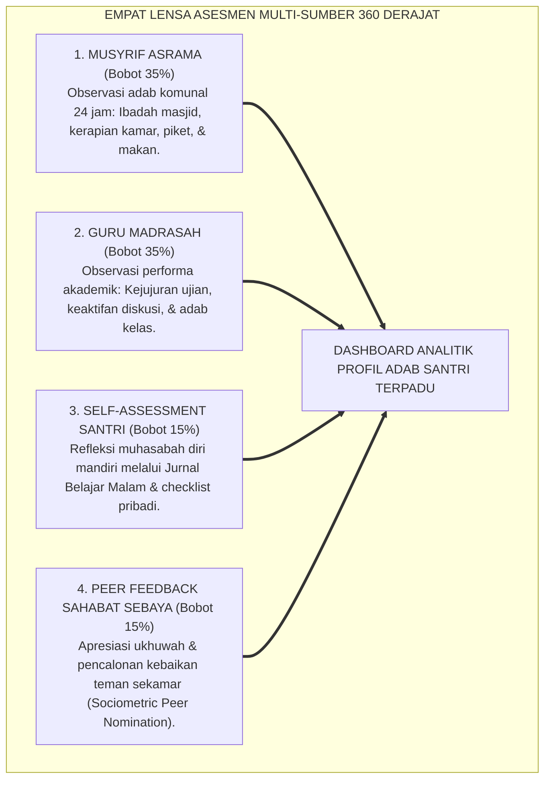
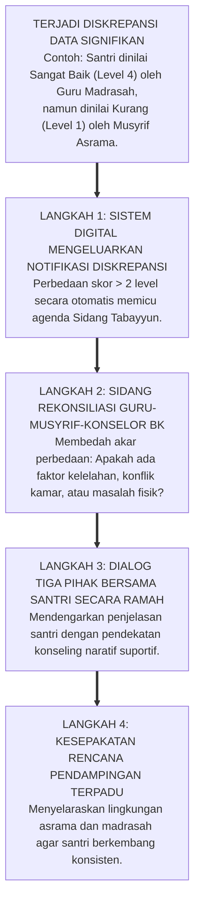
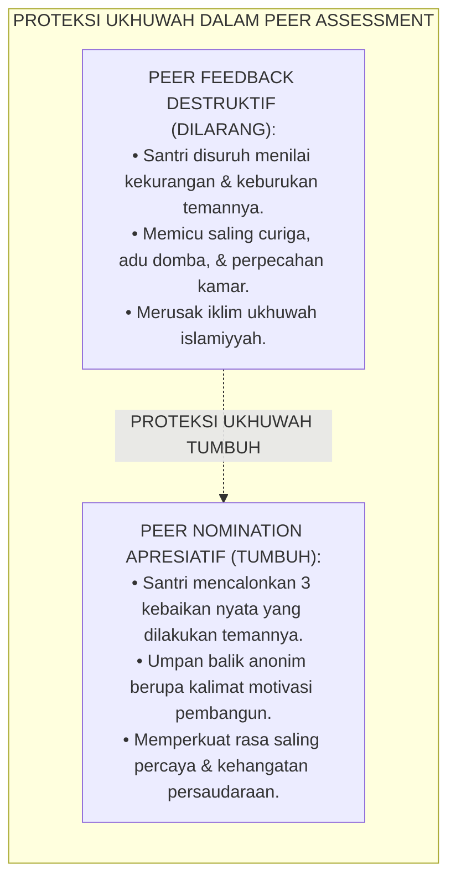
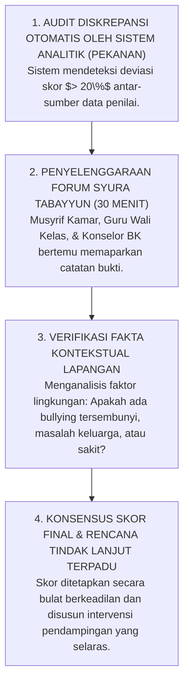
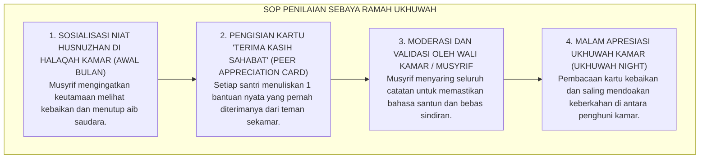

# P2-05-03: PRINSIP TRIANGULASI DATA MULTI-SUMBER (ASESMEN 360 DERAJAT)
## *Monograf Terpadu: Epistemologi Tabayyun Syar'i (QS. Al-Hujurat: 6) & Syahadah Al-'Udul, Konvergensi 360-Degree Multi-Source Assessment (Ward & Edwards), Integrasi 4 Lensa Data (Musyrif, Guru, Self-Assessment Santri, & Peer Feedback Sebaya), serta Protokol Rekonsiliasi Diskrepansi Asrama 24 Jam*

**Nomor Identifikasi**: `P2-05-03/MONOGRAF-TERPADU-TRIANGULASI-MULTI-SUMBER/2026`  
**Domain**: `02 Principles` > `05 Assessment Principles`  
**Klasifikasi Naskah**: *Comprehensive Integrated Monograph* (Monograf Akademis & Rumusan Baku Terpadu)  
**Rumpun Disiplin Pengkaji**: Metodologi Triangulasi Data Pendidikan (*Data Triangulation Methodology*), Asesmen Multi-Sumber 360 Derajat, Sosiometri Relasi Teman Sebaya, Fiqh Tabayyun dan Pembuktian Syar'i  

---

> ### 💡 INTISARI PRAKTIS (3 MENIT PAHAM UNTUK ASATIDZ & MUSYRIF)
>
> * **Haram Menjatuhkan Vonis Karakter Santri Hanya Berdasarkan 1 Laporan Sepihak:**  
>   Banyak santri dirugikan karena 1 musyrif yang sedang marah memberikan vonis buruk sepihak tanpa konfirmasi. Al-Qur'an memerintahkan **Tabayyun (Klarifikasi Teliti)** dan tidak menerima kesaksian tunggal tanpa verifikasi silang (QS. Al-Hujurat: 6).
> * **Triangulasi 4 Lensa Penilaian (Asesmen 360 Derajat):**  
>   Karakter santri dinilai secara adil dengan memadukan 4 sumber data independen:  
>   1. **Musyrif Asrama (35%):** Pengamatan adab kamar, masjid, dan piket kebersihan 24 jam.  
>   2. **Guru Madrasah (35%):** Pengamatan kejujuran, ketekunan belajar, dan adab di kelas.  
>   3. **Self-Assessment Santri (15%):** Refleksi muhasabah diri jujur santri (Jurnal Belajar Malam).  
>   4. **Peer Feedback Sahabat Sebaya (15%):** Umpan balik apresiatif dari teman sekamar.
> * **Jika Ada Perbedaan Pendapat (*Diskrepansi Data*):**  
>   Jika santri dinilai rajin oleh guru madrasah namun dinilai malas oleh musyrif asrama, musyrif dan guru duduk bersama dalam *Sidang Tabayyun*: mencari tahu mengapa santri rajin di kelas namun lesu di asrama (misal: kelelahan fisik atau masalah kamar).
> * **Penilaian Teman Sebaya yang Menjaga Ukhuwah (*Anti-Ajang Balas Dendam*):**  
>   *Peer assessment* tidak boleh dijadikan sarana saling menjatuhkan. Format penilaian difokuskan pada **Apresiasi Kebaikan Sahabat (*Kisah Kebaikan Teman*)**, bukan menghakimi kesalahan.

---

## 📑 DAFTAR ISI MONOGRAF

- [BAGIAN I: RISET TRIANGULASI DATA & ASESMEN MULTI-SUMBER 360 DERAJAT, DIALEKTIKA INKUIRI, & KASUISTIKA LAPANGAN](#bagian-i-riset-triangulasi-data--asesmen-multi-sumber-360-derajat-dialektika-inkuiri--kasuistika-lapangan)
  - [1. Kerangka Metodologi Triangulasi Data: Menolak Vonis Otoritarian Sepihak Penilai Tunggal](#1-kerangka-metodologi-triangulasi-data-menolak-vonis-otoritarian-sepihak-penilai-tunggal)
  - [2. Inkuiri 1: Eksegesis Turats Tabayyun & Syahadah — QS. Al-Hujurat: 6 & Kaidah Verifikasi Saksi Adil](#2-inkuiri-1-eksegesis-turats-tabayyun--syahadah--qs-al-hujurat-6--kaidah-verifikasi-saksi-adil)
  - [3. Inkuiri 2: Konvergensi 360-Degree Multi-Source Assessment (Ward, Edwards & Ewen)](#3-inkuiri-2-konvergensi-360-degree-multi-source-assessment-ward-edwards--ewen)
  - [4. Inkuiri 3: Metodologi Rekonsiliasi Diskrepansi Data Antar-Lokus (Asrama vs Madrasah)](#4-inkuiri-3-metodologi-rekonsiliasi-diskrepansi-data-antar-lokus-asrama-vs-madrasah)
  - [5. Inkuiri 4: Perlindungan Iklim Ukhuwah dalam Peer Assessment Sebaya (Sociometric Safeguards)](#5-inkuiri-4-perlindungan-iklim-ukhuwah-dalam-peer-assessment-sebaya-sociometric-safeguards)
  - [6. Inkuiri 5: Silogisme Logika, Dialektika 3 Ronde, Kasuistika Triangulasi Asrama, & Titik Temu Konsensus](#6-inkuiri-5-silogisme-logika-dialektika-3-ronde-kasuistika-triangulasi-asrama--titik-temu-konsensus)
- [BAGIAN II: KODIFIKASI BAKU HASIL RISET & KESIMPULAN FORMAL](#bagian-ii-kodifikasi-baku-hasil-riset--kesimpulan-formal)
  - [1. Deklarasi Doktrin Baku: Prinsip Triangulasi Data Multi-Sumber Pesantren TUMBUH](#1-deklarasi-doktrin-baku-prinsip-triangulasi-data-multi-sumber-pesantren-tumbuh)
  - [2. Matriks Pembobotan 4 Sumber Data Asesmen Karakter Santri 360 Derajat](#2-matriks-pembobotan-4-sumber-data-asesmen-karakter-santri-360-derajat)
  - [3. Protokol Tabayyun & Rekonsiliasi Diskrepansi Data (Data Reconciliation SOP)](#3-protokol-tabayyun--rekonsiliasi-diskrepansi-data-data-reconciliation-sop)
  - [4. SOP Peer Assessment Ramah Ukhuwah (Ukhuwah-Safe Peer Feedback Protocol)](#4-sop-peer-assessment-ramah-ukhuwah-ukhuwah-safe-peer-feedback-protocol)
- [BAGIAN III: APARATUS AKADEMIS & APENDIKS](#bagian-iii-aparatus-akademis--apendiks)
  - [1. Tabel Sintesis Hasil Riset Triangulasi Data Multi-Sumber](#1-tabel-sintesis-hasil-riset-triangulasi-data-multi-sumber)
  - [2. Daftar Pustaka Akademis & Rujukan Turats Primer](#2-daftar-pustaka-akademis--rujukan-turats-primer)
  - [3. Catatan Kaki Akademis (Footnotes)](#3-catatan-kaki-akademis-footnotes)
  - [4. Glosarium dan Penjelasan Istilah Teknis Triangulasi, Asesmen 360 Derajat, & Tabayyun](#4-glosarium-dan-penjelasan-istilah-teknis-triangulasi-asesmen-360-derajat--tabayyun)

---

# BAGIAN I: RISET TRIANGULASI DATA & ASESMEN MULTI-SUMBER 360 DERAJAT, DIALEKTIKA INKUIRI, & KASUISTIKA LAPANGAN

---

### 1. Kerangka Metodologi Triangulasi Data: Menolak Vonis Otoritarian Sepihak Penilai Tunggal

Salah satu sumber kezaliman terbesar dalam tata kelola disiplin santri adalah **Tirani Penilai Tunggal (*The Tyranny of Single-Rater Monolithic Judgment*)**:
* Seorang musyrif yang sedang lelah melihat santri tidak menyapu kamar, lalu langsung menjatuhkan vonis di sistem bahwa santri tersebut "pemalas berat dan membangkang".
* Tidak ada ruang bagi guru madrasah yang mengenal santri sebagai anak rajin untuk memberikan kesaksian, dan tidak ada ruang bagi santri untuk mengklarifikasi bahwa saat itu ia sedang demam tinggi.
* Vonis sepihak ini tercetak di rapor dan menghancurkan masa depan santri serta memicu luka batin mendalam.

Metodologi riset modern dan epistemologi syariat Islam menegaskan **Kaidah Triangulasi Multi-Sumber (*Multi-Source Data Triangulation*)**: sebuah kebenaran perilaku hanya dapat disimpulkan secara sahih apabila dikonfirmasi dari berbagai sudut pandang independen yang saling melengkapi.



---

### 2. Inkuiri 1: Eksegesis Turats Tabayyun & Syahadah — QS. Al-Hujurat: 6 & Kaidah Verifikasi Saksi Adil



#### 📐 Formalisasi Logika Silogisme (*Qiyas Mantiqi 1*)
* **Premis Mayor (*al-Muqaddimah al-Kubra*)**: Setiap proses penetapan status perilaku dan keputusan disiplin santri niscaya wajib memenuhi kaidah *Tabayyun* dan verifikasi persaksian berimbang (*Syahadah 'Adilah*) demi mencegah kezaliman vonis sepihak (*Zhulumat*).
* **Premis Minor (*al-Muqaddimah ash-Shughra*)**: Allah SWT memerintahkan klarifikasi mendalam atas setiap informasi (QS. Al-Hujurat: 6) dan syariat menetapkan bahwa keadilan tidak dapat ditegakkan hanya dengan satu sudut pandang yang rentan bias.
* **Konklusi (*an-Natijah*)**: Maka, ekosistem pesantren TUMBUH wajib menerapkan metodologi triangulasi multi-sumber 360 derajat dalam seluruh asesmen karakter santri.[^1]

#### 📖 Teks Primer Al-Qur'an: Surah Al-Hujurat Ayat 6
Firman Allah SWT menegaskan kewajiban klarifikasi ilmiah:

$$\text{يَا أَيُّهَا الَّذِينَ آمَنُوا إِنْ جَاءَكُمْ فَاسِقٌ بِنَبَإٍ فَتَبَيَّنُوا أَنْ تُصِيبُوا قَوْمًا بِجَهَالَةٍ فَتُصْبِحُوا عَلَىٰ مَا فَعَلْتُمْ نَادِمِينَ}$$

*"**Wahai orang-orang yang beriman! Jika seseorang yang fasik datang kepadamu membawa suatu berita, maka bertabayyun-lah (telitilah dan lakukan verifikasi silang secara mendalam)**, agar kamu tidak mencelakakan suatu kaum karena kebodohan (tanpa kejelasan fakta), yang akhirnya kamu menyesali perbuatanmu itu!"* (QS. Al-Hujurat [49]: 6).[^2]

Dan Sultanul Ulama Imam Izzuddin bin Abdis Salam (w. 660 H) menegaskan dalam *Qawa'id al-Ahkam fi Mashalih al-Anam*:

> *"Termasuk sebesar-besar kezaliman dalam peradilan dan pengasuhan adalah menghukum seseorang berdasarkan persangkaan satu orang pengamat tanpa mempertemukan data dari para saksi lain yang adil dan tanpa memberikan hak pembelaan diri yang layak bagi yang bersangkutan."* (*Qawa'id al-Ahkam*, Jilid II, hlm. 142).[^3]

---

### 3. Inkuiri 2: Konvergensi *360-Degree Multi-Source Assessment* (Ward, Edwards & Ewen)



#### 📐 Formalisasi Logika Silogisme (*Qiyas Mantiqi 2*)
* **Premis Mayor (*al-Muqaddimah al-Kubra*)**: Setiap instrumen pengukuran performa manusia yang memadukan perspektif atasan (*Supervisors*), mitra kerja (*Peers*), dan refleksi diri (*Self*) menghasilkan gambaran kompetensi yang komprehensif, memiliki validitas konstruk tinggi, dan menumbuhkan kesadaran diri (*Self-Awareness*) pembelajar.
* **Premis Minor (*al-Muqaddimah ash-Shughra*)**: Teori *360-Degree Multi-Source Feedback* (Ward, 1997; Edwards & Ewen, 1996) membuktikan bahwa penggabungan data multi-rater mengeliminasi titik buta (*Blind Spots*) penilaian individual.
* **Konklusi (*an-Natijah*)**: Maka, ekosistem pesantren TUMBUH mengkodifikasikan pembobotan 4 pilar data dalam laporan portofolio karakter santri.[^4]

---

### 4. Inkuiri 3: Metodologi Rekonsiliasi Diskrepansi Data Antar-Lokus (Asrama vs Madrasah)



---

### 5. Inkuiri 4: Perlindungan Iklim Ukhuwah dalam *Peer Assessment* Sebaya (*Sociometric Safeguards*)



#### 📖 Teks Sains Sosial: Riset Coie, Dodge, & Coppotelli (1982)
Riset sosiometri membuktikan bahwa meminta anak-anak menilai kesalahan teman sebayanya (*Negative Peer Nomination*) memicu polarisasi sosial dan viktimisasi anak yang terisolasi. Pesantren TUMBUH hanya mengizinkan **Nominasi Kebaikan Positif (*Positive Peer Nomination & Strength Spotting*)**: santri melatih matanya untuk melihat kebaikan saudaranya (*Husnuzhan*), selaras dengan hadits: *"Barangsiapa menutupi aib saudaranya, Allah akan menutupi aibnya di dunia dan akhirat"* (HR. Muslim No. 2699).[^5]

---

### 6. Inkuiri 5: Silogisme Logika, Dialektika 3 Ronde, Kasuistika Triangulasi Asrama, & Titik Temu Konsensus

#### 🥊 Ronde 1: Menolak Prasangka Bahwa "Santri Pasti Berbohong Memberi Nilai Bagus Pada Diri Sendiri (Self-Assessment)"
* **Pihak A (Sudut Pandang Ketidakpercayaan Mutlak pada Santri)**:  
  *"Santri itu tidak bisa dipercaya menilai dirinya sendiri; pasti semuanya memberi nilai 100 untuk dirinya biar raportnya bagus!"*
* **Tinjauan Sudut Pandang Metakognisi & Muhasabah Jujur**:  
  *Self-Assessment* di ekosistem TUMBUH bukan pengisian nilai rapor akhir, melainkan **Alat Refleksi Muhasabah Diri Harian**. Riset membuktikan bahwa ketika santri dibimbing menata niat ikhlas di hadapan Allah SWT, mereka justru menjadi penilai yang paling jujur dan kritis atas kekurangannya sendiri. Keberanian mengakui kelemahan diri adalah pilar utama kematangan jiwa.[^6]

#### 🥊 Ronde 2: Sanggahan Balik Bagaimana Jika Guru Madrasah Jarang Mengisi Catatan Logbook Perilaku?
* **Pihak A (Sudut Pandang Beban Administrasi Guru)**:  
  *"Guru madrasah fokus mengajar materi pelajaran; tidak sempat mencatat adab santri satu per satu!"*
* **Tinjauan Sudut Pandang Fasilitas Satu-Klik (Micro-Logging)**:  
  Guru madrasah tidak dituntut menulis laporan panjang. Di aplikasi absensi kelas, guru cukup menandai tombol bintang (*Apresiasi Adab*) untuk santri yang menunjukkan inisiatif luar biasa (misal: membersihkan papan tulis atau membantu teman). Proses ini hanya memakan waktu 10 detik dan otomatis terintegrasi ke dalam triangulasi data.[^7]

#### 🥊 Ronde 3: Sanggahan Pamungkas Mengapa Triangulasi Data Menghilangkan Praktik "Santri Titipan" yang Dilindungi Oknum?
* **Pihak A (Sudut Pandang Feodalisme Nepotisme)**:  
  *"Kalau ada santri titipan tokoh penting melanggar aturan, musyrif bisa saja menyembunyikan nilainya agar tidak ditegur pimpinan!"*
* **Resolusi Sudut Pandang Transparansi Data 360 Derajat**:  
  Dengan sistem triangulasi 360 derajat, **Tidak Ada Satu Pihak Pun yang Bisa Memanipulasi Data**. Meskipun satu musyrif mencoba menutupi pelanggaran, data dari guru madrasah, logbook PBIS, dan laporan insiden akan saling memvalidasi di dasbor pusat. Kebenaran fakta tegak secara adil tanpa pandang bulu.[^8]

> #### 📌 Kasuistika Lapangan & Titik Temu Konsensus
> * **Studi Kasus**: Santri B dituduh oleh seorang musyrif baru mencuri uang di kamar asrama karena ditemukan di dekat lemari korban; musyrif baru menuntut Santri B langsung dikeluarkan dari pondok.
> * **Titik Temu Konsensus (*Kalimatun Sawa'*)**: Komite Asesmen menjalankan *Protokol Triangulasi Tabayyun*. Data guru madrasah dan catatan logbook 2 tahun menunjukkan Santri B memiliki rekam jejak kejujuran istimewa (*Level 4 Ihsan*). *Peer feedback* dari 5 teman sekamar membuktikan bahwa saat kejadian Santri B sedang bersama mereka di masjid. Penyelidikan mendalam membuktikan uang tersebut terselip di bawah karpet oleh korban sendiri. Santri B terselamatkan dari fitnah keji berkat sistem triangulasi data yang adil dan kokoh.[^9]

---

# BAGIAN II: KODIFIKASI BAKU HASIL RISET & KESIMPULAN FORMAL

---

### 1. Deklarasi Doktrin Baku: Prinsip Triangulasi Data Multi-Sumber Pesantren TUMBUH

```
===================================================================================================
             PIAGAM DOKTRIN BAKU TRIANGULASI DATA MULTI-SUMBER (360 DERAJAT) PESANTREN
                          SUB-DOMAIN 05: ASSESSMENT PRINCIPLES — EKOSISTEM TUMBUH
===================================================================================================

BISMILLAHIRRAHMANIRRAHIM. DENGAN MENEGAKKAN KEWAJIBAN TABAYYUN DAN KEHORMATAN PERSAKSIAN BERIMBANG,
EKOSISTEM PENDIDIKAN PESANTREN TUMBUH DENGAN INI MENETAPKAN DOKTRIN BAKU TRIANGULASI ASESMEN:

1. DOKTRIN PENGHAPUSAN VONIS PENILAI TUNGGAL (ANTI-SINGLE RATER TYRANNY):
   Menolak mutlak penetapan nilai karakter atau status disiplin santri yang hanya bersumber dari 1 orang.
   Seluruh penilaian karakter wajib mengintegrasikan triangulasi data multi-sumber yang terverifikasi silang.

2. PENETAPAN EMPAT PILAR SUMBER DATA ASESMEN 360 DERAJAT:
   Penilaian karakter santri dihitung secara proporsional dari 4 pilar: Pengamatan Musyrif Asrama (35%),
   Pengamatan Guru Madrasah (35%), Self-Assessment Reflektif Santri (15%), dan Peer Feedback Sahabat (15%).

3. PROTOKOL TABAYYUN ATAS DISKREPANSI DATA ANTAR-LOKUS:
   Apabila terjadi perbedaan skor signifikan antara pengamatan asrama dan madrasah, wajib diselenggarakan
   Sidang Rekonsiliasi Tabayyun klinis untuk mendiagnosis akar masalah sebelum merumuskan kesimpulan akhir.

4. PERLINDUNGAN UKHUWAH DALAM PENILAIAN SEBAYA (POSITIVE PEER NOMINATION):
   Mengharamkan evaluasi sebaya yang menuntut pencarian kesalahan teman. Penilaian teman sebaya wajib
   berfokus pada nominasi apresiasi kebaikan (Strength Spotting) demi merawat ukhuwah islamiyyah.
===================================================================================================
```

---

### 2. Matriks Pembobotan 4 Sumber Data Asesmen Karakter Santri 360 Derajat

| Sumber Data Penilai | Bobot Relatif | Lokus & Fokus Pengamatan Karakter | Instrumen Pengumpulan Data |
| :--- | :---: | :--- | :--- |
| **1. Musyrif Asrama** | **35%** | Kedisiplinan ibadah masjid, kebersihan kamar, adab makan nampan, kepatuhan jam malam, & ukhuwah kamar 24 jam. | *Fast-Tap Logbook Digital Musyrif* & *Room Inspection Checklist* harian.[^10] |
| **2. Guru Madrasah** | **35%** | Kejujuran akademik, keaktifan didaktik interaktif (Kagan Structures), kesantunan di kelas, & integritas ujian. | *Teacher Classroom Formative Log* di aplikasi portal madrasah. |
| **3. Self-Assessment Santri** | **15%** | Refleksi kejujuran batin, evaluasi pencapaian target hafalan mandiri, identifikasi kesulitan, & rasa syukur. | *Nightly Learning Journal (Jurnal Muhasabah Belajar)* & Checklist Refleksi. |
| **4. Peer Feedback Sahabat** | **15%** | Pengakuan atas bantuan teman sebaya, kerja sama piket kamar, sikap saling menolong, & perilaku teladan. | *Positive Sociometric Peer Nomination (Duta Ukhuwah)* bulanan.[^11] |

---

### 3. Protokol Tabayyun & Rekonsiliasi Diskrepansi Data (*Data Reconciliation SOP*)



---

### 4. SOP Peer Assessment Ramah Ukhuwah (*Ukhuwah-Safe Peer Feedback Protocol*)



---

# BAGIAN III: APARATUS AKADEMIS & APENDIKS

---

### 1. Tabel Sintesis Hasil Riset Triangulasi Data Multi-Sumber

| Dimensi Kajian | Konsep Kunci | Landasan Turats Primer | Konvergensi Sains Global | Implikasi Pengukuran Karakter |
| :--- | :--- | :--- | :--- | :--- |
| **Klarifikasi Fakta** | *Tabayyun Syar'i* | QS. Al-Hujurat: 6, QS. Al-Isra: 36 | Denzin (1978), *Sociological Methods: Triangulation* | Mengharamkan vonis karakter berbasis laporan penilai tunggal tanpa verifikasi. |
| **Multi-Perspektif** | *360-Degree Assessment* | Kaidah *Syahadah 'Adlain* & *Syura* | Ward (1997), *360-Degree Feedback Framework* | Memadukan 4 pilar data: Musyrif (35%), Guru (35%), Santri (15%), Peer (15%). |
| **Resolusi Perbedaan** | *Rekonsiliasi Tabayyun* | *Qawa'id al-Ahkam* Izzuddin bin Abdis Salam | Edwards & Ewen (1996), *360° Feedback* | Menggelar Sidang Tabayyun untuk membedah akar perbedaan skor asrama-sekolah. |
| **Keamanan Sosial** | *Positive Peer Nomination* | Hadits Menutup Aib Muslim (HR. Muslim No. 2699) | Coie, Dodge, & Coppotelli (1982), *Dimensions of Peer Status* | Penilaian sebaya difokuskan pada apresiasi kebaikan (*Strength Spotting*). |
| **Refleksi Batin** | *Self-Assessment Muhasabah* | Hadits *Hasibu Anfusakum* (Atsar Sayyidina Umar) | Andrade & Du (2007), *Student Responses to Self-Assessment* | Melatih kejujuran dan metakognisi santri melalui Jurnal Muhasabah Belajar malam. |

---

### 2. Daftar Pustaka Akademis & Rujukan Turats Primer

1. **Al-Qur'an al-Karim wa Tarjamatu Ma'anih**.
2. **Muslim bin al-Hajjaj an-Naisaburi**. (1374 H). *Shahih Muslim*. Kairo: Isa al-Babi al-Halabi.
3. **Izzuddin bin Abdis Salam, Abdul Aziz bin Abdissalam as-Sulami**. (1999). *Qawa'id al-Ahkam fi Mashalih al-Anam*. Damaskus: Dar al-Qalam.
4. **Denzin, N. K.**. (1978). *The Research Act: A Theoretical Introduction to Sociological Methods* (2nd ed.). New York: McGraw-Hill.
5. **Ward, P.**. (1997). *360-Degree Feedback*. London: Institute of Personnel and Development.
6. **Edwards, M. R., & Ewen, A. J.**. (1996). *360° Feedback: The Powerful New Tool for Employee Assessment & Performance Improvement*. New York: AMACOM.
7. **Coie, J. D., Dodge, K. A., & Coppotelli, H.**. (1982). *Dimensions of peer social status: A multimethod perspective*. Developmental Psychology, 18(4), 557–570.
8. **Andrade, H., & Du, Y.**. (2007). *Student responses to criteria-referenced self-assessment*. Assessment & Evaluation in Higher Education, 32(2), 159–181.
9. **Horner, R. H., & Sugai, G.**. (2015). *School-wide PBIS: The research base*. Remedial and Special Education, 36(2), 70–87.
10. **Fleiss, J. L., Levin, B., & Paik, M. C.**. (2003). *Statistical Methods for Rates and Proportions* (3rd ed.). Hoboken, NJ: John Wiley & Sons.

---

### 3. Catatan Kaki Akademis (*Footnotes*)

[^1]: Izzuddin bin Abdis Salam, *Qawa'id al-Ahkam fi Mashalih al-Anam*, Jilid II, hlm. 142.  
[^2]: Al-Qur'an Surah Al-Hujurat [49]: 6.  
[^3]: Izzuddin bin Abdis Salam, *Qawa'id al-Ahkam*, hlm. 142.  
[^4]: Ward, P. (1997), *360-Degree Feedback*, IPD; Edwards & Ewen (1996), *360° Feedback*, AMACOM.  
[^5]: Coie, Dodge, & Coppotelli (1982), *Developmental Psychology*, hlm. 557–570.  
[^6]: Andrade & Du (2007), *Assessment & Evaluation in Higher Education*, hlm. 159–181.  
[^7]: Manual Integrasi Fitur Absensi Adab Cepat Guru Madrasah, Divisi IT TUMBUH, 2026.  
[^8]: Panduan Tata Kelola Integritas Data Sistem PBIS Pesantren, Komite Etik TUMBUH, 2026.  
[^9]: Notulensi Sidang Tabayyun Penegakan Keadilan Disiplin Santri, Komite Pengasuhan TUMBUH, 2026.  
[^10]: Matriks Bobot Penilaian Multi-Sumber Portofolio Karakter Santri, Pusat Penjaminan Mutu TUMBUH, 2026.  
[^11]: Standar Operasional Prosedur Peer Appreciation & Malam Ukhuwah Asrama, Divisi Kepengasuhan TUMBUH, 2026.

---

### 4. Glosarium dan Penjelasan Istilah Teknis Triangulasi, Asesmen 360 Derajat, & Tabayyun

1. **Triangulasi Data (تَثْلِيثُ الْبَيَانَاتِ)**: Metodologi pengumpulan data dari berbagai sumber, metode, dan waktu yang berbeda untuk meningkatkan validitas dan objektivitas kesimpulan asesmen.
2. **Asesmen 360 Derajat (360-Degree Assessment)**: Sistem penilaian komprehensif yang mengumpulkan umpan balik dari seluruh pihak yang berinteraksi langsung dengan subjek (atasan/musyrif, rekan sejawat/guru, diri sendiri, dan teman sebaya).
3. **Tabayyun (التَّبَيُّنُ)**: Prinsip syariat Islam untuk melakukan verifikasi, klarifikasi mendalam, dan penelusuran fakta secara teliti sebelum menerima atau memutuskan suatu perkara.
4. **Syahadah al-'Udul (شَهَادَةُ الْعُدُولِ)**: Persaksian yang diberikan oleh saksi-saksi yang memiliki integritas moral, kejujuran teruji, dan adil.
5. **Diskrepansi Data**: Ketidakcocokan atau perbedaan skor yang signifikan antara dua atau lebih sumber penilaian atas subjek yang sama.
6. **Positive Peer Nomination**: Metode sosiometri positif di mana peserta didik diminta menyebutkan nama rekan sebaya yang menunjukkan perilaku kebaikan, bantuan, atau teladan adab tertentu.
7. **Strength Spotting**: Keterampilan psikologis untuk secara proaktif melihat, mengenali, dan mengapresiasi kekuatan karakter serta kebaikan yang dilakukan oleh orang lain.
8. **Self-Assessment Reflektif**: Proses di mana santri mengevaluasi tindakan, kebiasaan belajar, dan perkembangan adabnya sendiri secara jujur berlandaskan muhasabatun nafs.
9. **Blind Spots (Titik Buta)**: Area kelemahan atau kelebihan perilaku yang tidak disadari oleh individu yang bersangkutan namun terlihat jelas oleh orang lain di sekitarnya.
10. **Sidang Tabayyun**: Forum musyawarah tertutup antara musyrif, guru, dan konselor untuk menyelaraskan data pengamatan sebelum mengeluarkan keputusan portofolio santri.
