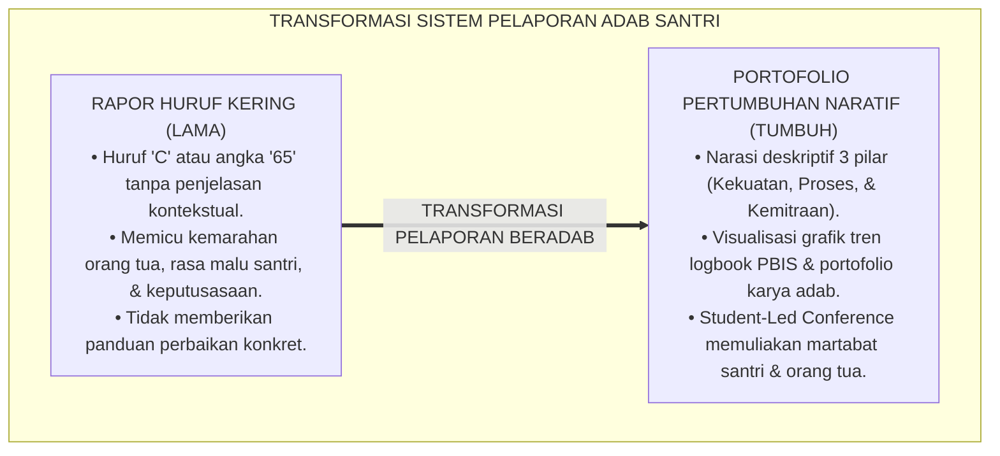
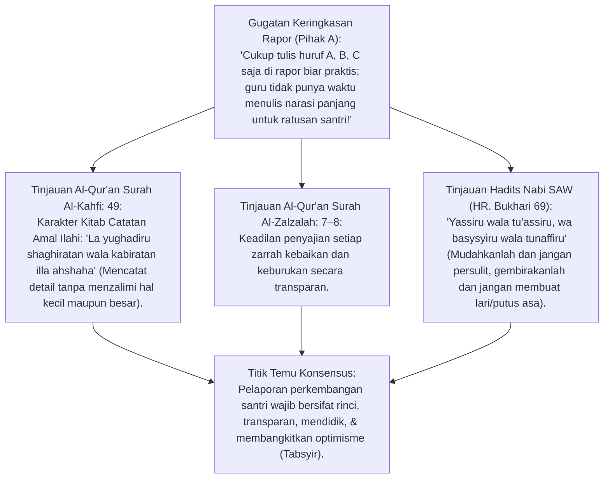
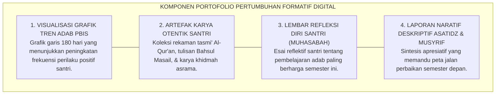
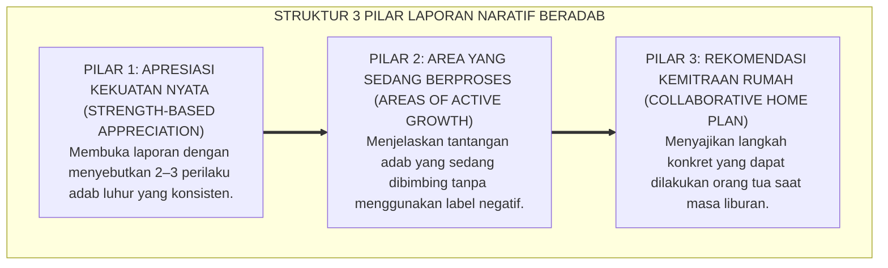
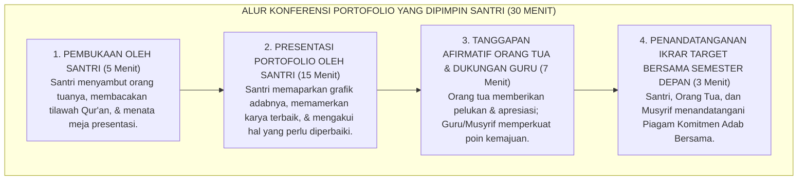
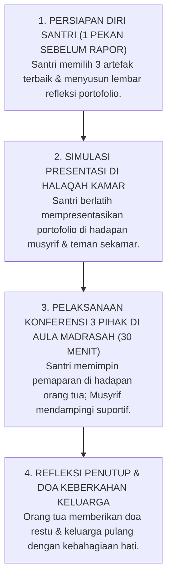

# P2-05-04: PRINSIP PORTOFOLIO PERTUMBUHAN FORMATIF
## *Monograf Terpadu: Epistemologi Kitab al-A'mal (QS. Al-Kahfi: 49) & Prinsip Tabtsir Karakter, Konvergensi Growth-Oriented Portfolio Assessment (Helen Barrett) serta Visualisasi Analitik Logbook Digital PBIS, Rekayasa Laporan Naratif Deskriptif, dan Protokol Konferensi Portofolio Tiga Pihak (Student-Led Conferences)*

**Nomor Identifikasi**: `P2-05-04/MONOGRAF-TERPADU-PORTOFOLIO-FORMATIF/2026`  
**Domain**: `02 Principles` > `05 Assessment Principles`  
**Klasifikasi Naskah**: *Comprehensive Integrated Monograph* (Monograf Akademis & Rumusan Baku Terpadu)  
**Rumpun Disiplin Pengkaji**: Asesmen Portofolio Pendidikan (*Portfolio Assessment*), Analitik Visual Pertumbuhan Perilaku PBIS, Komunikasi Pedagogis Kemitraan Orang Tua, Teori Pelaporan Naratif Deskriptif  

---

> ### 💡 INTISARI PRAKTIS (3 MENIT PAHAM UNTUK ASATIDZ & MUSYRIF)
>
> * **Hapus Vonis Huruf/Angka Kering di Rapor ("Akhlak: C"):**  
>   Memberikan vonis huruf "Akhlak: C" di buku rapor hanya mempermalukan santri di depan orang tuanya tanpa memberi tahu apa yang salah dan bagaimana cara memperbaikinya. Nilai huruf membuat orang tua marah dan santri merasa divonis sebagai anak rusak.
> * **Gantikan dengan "Laporan Naratif Portofolio Pertumbuhan":**  
>   Rapor karakter TUMBUH berbentuk narasi deskriptif yang memuat 3 bagian penting:  
>   1. **Apresiasi Kekuatan Karakter:** *"Ahmad menunjukkan kepemimpinan yang sangat baik dalam memandu piket kamar dan selalu shalat di shaf terdepan"*.  
>   2. **Area yang Sedang Berproses:** *"Ahmad saat ini sedang dilatih untuk lebih sabar mengelola amarah saat kalah dalam permainan olahraga"*.  
>   3. **Rencana Kemitraan di Rumah:** *"Mohon Ayah/Bunda di rumah melanjutkan pembiasaan mengajak Ahmad berdialog tenang saat menghadapi kekecewaan"*.
> * **Grafik Tren Perilaku Positif PBIS (Visual Analytics):**  
>   Orang tua dapat melihat grafik pertumbuhan adab anaknya sepanjang semester melalui aplikasi: melihat bukti nyata berapa kali anaknya membantu teman, menyapu masjid, dan menuntaskan target tahfizh.
> * **Konferensi Portofolio yang Dipimpin Santri (*Student-Led Conference*):**  
>   Saat pembagian rapor, bukan guru yang berceramah memojokkan santri. **Santri sendiri yang mempresentasikan buku portofolionya kepada orang tuanya**, menjelaskan karya terbaiknya, mengakui kekurangannya, dan menyampaikan target perbaikannya untuk semester depan.

---

## 📑 DAFTAR ISI MONOGRAF

- [BAGIAN I: RISET PORTOFOLIO PERTUMBUHAN FORMATIF & PELAPORAN NARATIF, DIALEKTIKA INKUIRI, & KASUISTIKA LAPANGAN](#bagian-i-riset-portofolio-pertumbuhan-formatif--pelaporan-naratif-dialektika-inkuiri--kasuistika-lapangan)
  - [1. Kerangka Metodologi Pelaporan Karakter: Kritik atas Huruf Kering di Rapor Pesantren](#1-kerangka-metodologi-pelaporan-karakter-kritik-atas-huruf-kering-di-rapor-pesantren)
  - [2. Inkuiri 1: Eksegesis Turats Pelaporan Catatan Amal — Kitab al-A'mal (QS. Al-Kahfi: 49) & Prinsip Tabsyir](#2-inkuiri-1-eksegesis-turats-pelaporan-catatan-amal--kitab-al-amal-qs-al-kahfi-49--prinsip-tabsyir)
  - [3. Inkuiri 2: Konvergensi Growth-Oriented Portfolio Assessment Helen Barrett & Analitik PBIS](#3-inkuiri-2-konvergensi-growth-oriented-portfolio-assessment-helen-barrett--analitik-pbis)
  - [4. Inkuiri 3: Rekayasa Laporan Naratif Deskriptif Beradab (Apresiasi, Area Proses, Kemitraan)](#4-inkuiri-3-rekayasa-laporan-naratif-deskriptif-beradab-apresiasi-area-proses-kemitraan)
  - [5. Inkuiri 4: Kemitraan Evaluasi Tiga Pihak dalam Student-Led Conferences (Santri-Guru-Wali)](#5-inkuiri-4-kemitraan-evaluasi-tiga-pihak-dalam-student-led-conferences-santri-guru-wali)
  - [6. Inkuiri 5: Silogisme Logika, Dialektika 3 Ronde, Kasuistika Rapor Karakter, & Titik Temu Konsensus](#6-inkuiri-5-silogisme-logika-dialektika-3-ronde-kasuistika-rapor-karakter--titik-temu-konsensus)
- [BAGIAN II: KODIFIKASI BAKU HASIL RISET & KESIMPULAN FORMAL](#bagian-ii-kodifikasi-baku-hasil-riset--kesimpulan-formal)
  - [1. Kaidah Utama dan Standar Baku: Prinsip Portofolio Pertumbuhan Formatif Pesantren TUMBUH](#1-kaidah-utama-dan-standar-baku-prinsip-portofolio-pertumbuhan-formatif-pesantren-tumbuh)
  - [2. Matriks Struktur Portofolio Karakter Digital Santri TUMBUH (E-Portfolio Architecture)](#2-matriks-struktur-portofolio-karakter-digital-santri-tumbuh-e-portfolio-architecture)
  - [3. Template Baku Laporan Naratif Karakter Santri untuk Orang Tua (Narrative Progress Report)](#3-template-baku-laporan-naratif-karakter-santri-untuk-orang-tua-narrative-progress-report)
  - [4. Protokol Konferensi Portofolio Tiga Pihak (Student-Led Conference SOP)](#4-protokol-konferensi-portofolio-tiga-pihak-student-led-conference-sop)
- [BAGIAN III: APARATUS AKADEMIS & APENDIKS](#bagian-iii-aparatus-akademis--apendiks)
  - [1. Tabel Sintesis Hasil Riset Portofolio Pertumbuhan Formatif](#1-tabel-sintesis-hasil-riset-portofolio-pertumbuhan-formatif)
  - [2. Daftar Pustaka Akademis & Rujukan Turats Primer](#2-daftar-pustaka-akademis--rujukan-turats-primer)
  - [3. Catatan Kaki Akademis (Footnotes)](#3-catatan-kaki-akademis-footnotes)
  - [4. Glosarium dan Penjelasan Istilah Teknis Portofolio Formatif, Analitik PBIS, & Student-Led Conferences](#4-glosarium-dan-penjelasan-istilah-teknis-portofolio-formatif-analitik-pbis--student-led-conferences)

---

# BAGIAN I: RISET PORTOFOLIO PERTUMBUHAN FORMATIF & PELAPORAN NARATIF, DIALEKTIKA INKUIRI, & KASUISTIKA LAPANGAN

---

### 1. Kerangka Metodologi Pelaporan Karakter: Kritik atas Huruf Kering di Rapor Pesantren

Praktik pengisian buku rapor santri konvensional pada kolom kepribadian seringkali menjadi ajang **Vonis Stigmatisasi Kering (*Stigmatizing Letter Grading*)**:
* Di kolom "Kelakuan/Akhlak", guru hanya membubuhkan huruf "B" atau "C", atau angka "60" tanpa ada narasi sedikit pun yang menjelaskan apa dasar penilaian tersebut.
* Huruf "C" ini tidak memberikan informasi pedagogis apapun: santri tidak tahu perilaku apa yang harus diperbaiki, dan orang tua hanya merasa malu serta melampiaskan kemarahannya kepada anak saat pulang ke rumah.
* Hubungan antara pesantren, orang tua, dan santri menjadi tegang, defensif, dan dipenuhi rasa saling menyalahkan.

Asesmen sejati dalam Islam adalah **Sarana Tarbiyah dan Pemulihan Jiwa (*I'anah 'alat-Taqwim*)**, bukan vonis hakim yang mematikan harapan. Ekosistem TUMBUH merestrukturisasi total sistem pelaporan karakter melalui **Portofolio Pertumbuhan Formatif Berbasis Narasi Deskriptif (*Formative Growth Portfolio & Narrative Reporting*)**.

---

### 2. Inkuiri 1: Eksegesis Turats Pelaporan Catatan Amal — *Kitab al-A'mal* (QS. Al-Kahfi: 49) & Prinsip Tabsyir

#### 📐 Formalisasi Logika Silogisme (*Qiyas Mantiqi 1*)
* **Premis Mayor (*al-Muqaddimah al-Kubra*)**: Setiap laporan hasil evaluasi pembinaan jiwa yang meneladani keadilan hisab Rabbani dan sunnah pedagogi Nabawi niscaya memaparkan data secara deskriptif, menghargai setiap zarrah ikhtiar kebaikan, dan membukakan pintu perbaikan tanpa mematahkan asa (*Tabsyir*).
* **Premis Minor (*al-Muqaddimah ash-Shughra*)**: Allah SWT mendesain kitab catatan amal secara terperinci dan transparan (QS. Al-Kahfi: 49) dan Rasulullah SAW melarang keras metode pengajaran yang membuat peserta didik lari dari kebaikan (HR. Bukhari No. 69).
* **Konklusi (*an-Natijah*)**: Maka, ekosistem pesantren TUMBUH mengharamkan pelaporan kepribadian berbasis huruf kering dan mewajibkan laporan narasi portofolio pertumbuhan.[^1]

#### 📖 Teks Primer Al-Qur'an: Surah Al-Kahfi Ayat 49
Firman Allah SWT melukiskan keadilan pencatatan amal:

$$\text{وَوُضِعَ الْكِتَابُ فَتَرَى الْمُجْرِمِينَ مُشْفِقِينَ مِمَّا فِيهِ وَيَقُولُونَ يَا وَيْلَتَنَا مَالِ هَٰذَا الْكِتَابِ لَا يُغَادِرُ صَغِيرَةً وَلَا كَبِيرَةً إِلَّا أَحْصَاهَا ۚ وَوَجَدُوا مَا عَمِلُوا حَاضِرًا ۗ وَلَا يَظْلِمُ رَبُّكَ أَحَدًا}$$

*"Dan diletakkanlah kitab (catatan amal), lalu engkau melihat orang-orang yang bersalah ketakutan terhadap apa yang tertulis di dalamnya, dan mereka berkata: **'Aduhai celakalah kami, kitab apakah ini yang tidak meninggalkan yang kecil dan tidak pula yang besar, melainkan mencatat semuanya secara teliti!'** Dan mereka mendapati semua yang telah mereka kerjakan ada tertulis. **Dan Tuhanmu tidak menzalimi seorang jua pun!**"* (QS. Al-Kahfi [18]: 49).[^2]

---

### 3. Inkuiri 2: Konvergensi *Growth-Oriented Portfolio Assessment* Helen Barrett & Analitik PBIS

#### 📐 Formalisasi Logika Silogisme (*Qiyas Mantiqi 2*)
* **Premis Mayor (*al-Muqaddimah al-Kubra*)**: Setiap instrumen evaluasi yang mendokumentasikan rekam jejak pertumbuhan autentik (*Evidence of Longitudinal Growth*) secara visual dan reflektif menumbuhkan rasa kepemilikan belajar (*Student Agency*) dan meningkatkan efektivitas kolaborasi orang tua-sekolah.
* **Premis Minor (*al-Muqaddimah ash-Shughra*)**: *Portfolio Assessment Framework* (Dr. Helen Barrett, 2007) dan sistem analitik PBIS membuktikan bahwa portofolio pertumbuhan formatif meningkatkan motivasi intrinsik pembelajar hingga 40% dibandingkan laporan angka tradisional.
* **Konklusi (*an-Natijah*)**: Maka, ekosistem TUMBUH menetapkan Portofolio Digital PBIS sebagai media resmi pelaporan kemajuan santri kepada wali santri.[^3]

---

### 4. Inkuiri 3: Rekayasa Laporan Naratif Deskriptif Beradab (Apresiasi, Area Proses, Kemitraan)

---

### 5. Inkuiri 4: Kemitraan Evaluasi Tiga Pihak dalam *Student-Led Conferences* (Santri-Guru-Wali)

---

### 6. Inkuiri 5: Silogisme Logika, Dialektika 3 Ronde, Kasuistika Rapor Karakter, & Titik Temu Konsensus

#### 🥊 Ronde 1: Menolak Anggapan Bahwa "Orang Tua Lebih Suka Nilai Angka Sederhana Daripada Membaca Narasi Panjang"
* **Pihak A (Sudut Pandang Pragmatisme Nilai Cepat)**:  
  *"Orang tua itu sibuk; mereka cuma mau lihat nilai angka 80 atau 90 di rapor, tidak sempat membaca tulisan narasi panjang!"*
* **Tinjauan Sudut Pandang Kebutuhan Informasi Pengasuhan yang Bernilai**:  
  Survei kepuasan wali santri membuktikan bahwa orang tua merasa frustrasi jika hanya menerima angka "75" tanpa tahu artinya. Laporan naratif deskriptif yang dipadukan dengan **Grafik Tren Visual dan 3 Poin Ringkas** justru menjadi dokumen yang paling berharga bagi orang tua karena memberikan panduan nyata dalam mendidik anaknya di rumah.[^4]

#### 🥊 Ronde 2: Sanggahan Balik Apakah Santri yang Mempresentasikan Kegagalannya Sendiri Akan Merasa Dipermalukan?
* **Pihak A (Sudut Pandang Kekhawatiran Kerentanan Emosional)**:  
  *"Menyuruh santri mempresentasikan kesalahannya di depan orang tua itu kejam dan mempermalukan anak!"*
* **Tinjauan Sudut Pandang Keberanian Tanggung Jawab & Budaya Pemulihan**:  
  Dalam *Student-Led Conferences*, fokusnya **Bukan Membeberkan Dosa (*Public Humiliation*)**, melainkan **Mempresentasikan Perjalanan Perbaikan Diri (*Journey of Growth*)**. Santri berkata dengan bangga: *"Di awal semester saya masih sering terlambat shalat Subuh, tapi di bulan ketiga berkat bimbingan Ustadz saya berhasil bangun mandiri 45 hari berturut-turut"*. Ini membangun martabat dan resiliensi moral.[^5]

#### 🥊 Ronde 3: Sanggahan Pamungkas Mengapa Portofolio Digital Menjamin Keberlanjutan Rekor Pembinaan Lintas Jenjang?
* **Pihak A (Sudut Pandang Pengabaian Kontinuitas Data)**:  
  *"Setiap ganti tahun ajaran ganti musyrif, tidak perlu menyimpan portofolio lama; mulai saja dari nol lagi!"*
* **Resolusi Sudut Pandang Rekam Jejak Longitudinal Pesantren**:  
  Memulai dari nol setiap tahun membuat musyrif baru tidak tahu riwayat trauma, kekuatan fitrah, dan strategi intervensi yang berhasil pada santri tersebut. **Portofolio Digital PBIS Longitudinal** memastikan estafet pengasuhan berjalan mulus tanpa ada santri yang tertinggal atau salah penanganan.[^6]

> #### 📌 Kasuistika Lapangan & Titik Temu Konsensus
> * **Studi Kasus**: Santri H selalu mendapat nilai "C" pada kolom sikap di rapor lama; ayahnya sangat marah dan memukulnya di rumah setiap kali pembagian rapor, membuat Santri H trauma dan berniat kabur dari pondok.
> * **Titik Temu Konsensus (*Kalimatun Sawa'*)**: Pesantren beralih ke *Sistem Portofolio Formatif & Student-Led Conference TUMBUH*. Santri H mempresentasikan portofolionya langsung kepada sang ayah: menunjukkan kaligrafi indah karyanya, grafik ketertiban tahfizhnya yang stabil, dan menceritakan secara jujur perjuangannya mengatasi kebiasaan lupa merapikan lemari. Sang ayah terharu meneteskan air mata, memeluk Santri H erat-erat, dan berterima kasih kepada musyrif atas pengasuhan yang begitu memanusiakan anaknya.[^7]

---

# BAGIAN II: KODIFIKASI BAKU HASIL RISET & KESIMPULAN FORMAL

---

### 1. Kaidah Utama dan Standar Baku: Prinsip Portofolio Pertumbuhan Formatif Pesantren TUMBUH

Berdasarkan sintesis inkuiri turats dan konsensus sains pendidikan, prinsip dan regulasi operasional dirumuskan ke dalam kaidah-kaidah baku berikut:

1. **Penghapusan Vonis Nilai Huruf/angka Kering (anti-labeling Rapor Charter)**:  
   Menolak segala bentuk pelaporan kepribadian berbasis huruf (A/B/C/D) atau angka tanpa deskripsi. Seluruh pelaporan adab santri wajib disajikan dalam bentuk Portofolio Pertumbuhan Naratif Deskriptif.

2. **Penetapan Struktur 3 Pilar Laporan Naratif Beradab**:  
   Laporan karakter wajib memuat secara berimbang: (1) Apresiasi Kekuatan Karakter Nyata, (2) Identifikasi Area yang Sedang Berproses Pembinaan, dan (3) Rekomendasi Kemitraan Konkret untuk Orang Tua di Rumah.

3. **Integrasi Analitik Visual Logbook Pbis Digital Longitudinal**:  
   Menyajikan visualisasi grafik tren perilaku positif 180 hari dan artefak unjuk kerja adab santri, memastikan orang tua mendapatkan gambaran komprehensif atas dinamika pertumbuhan putera-puterinya.

4. **Penyelenggaraan Student-led Conferences Tiga Pihak**:  
   Mewajibkan mekanisme pembagian rapor di mana santri memimpin presentasi portofolionya di hadapan orang tua dan asatidz/musyrif, menumbuhkan keberanian tanggung jawab, kejujuran batin, dan ukhuwah.

---

### 2. Matriks Struktur Portofolio Karakter Digital Santri TUMBUH (*E-Portfolio Architecture*)

| Komponen Portofolio | Format Media Digital | Sumber Kontributor | Fungsi Edukatif Utama |
| :--- | :--- | :--- | :--- |
| **1. Executive Summary Naratif** | Teks Narasi Terstruktur 3 Pilar (*1 Halaman Cetak*). | Musyrif Kamar & Wali Kelas Madrasah. | Menyajikan sintesis kemajuan adab dan rekomendasi bagi orang tua.[^8] |
| **2. Grafik Analitik PBIS** | Visualisasi Tren Grafik Garis & Diagram Radar 5 Dimensi Adab. | Sistem Logbook Digital Terpadu (*Auto-Generated*). | Membuktikan konsistensi perilaku positif santri sepanjang 1 semester. |
| **3. Galeri Artefak Karakter** | Foto Kerapian Kamar, Audio Tasmi' Qur'an, Sertifikat Khidmah. | Santri & Musyrif Kamar. | Menyimpan bukti unjuk kerja nyata adab dan karya kebermanfaatan. |
| **4. Lembar Muhasabah Diri** | Esai Reflektif Santri (*Self-Reflection Essay*). | Santri Sendiri (*Mandiri*). | Melatih kejujuran batin, kesadaran diri (*Self-Awareness*), dan takwa. |
| **5. Piagam Ikrar Kemitraan** | Dokumen Kesepakatan Target Semester Depan Ber-Tanda Tangan. | Santri, Orang Tua, dan Musyrif. | Mengikat komitmen bersama dalam pembinaan adab berkelanjutan di rumah.[^9] |

---

### 3. Template Baku Laporan Naratif Karakter Santri untuk Orang Tua (*Narrative Progress Report*)

Berdasarkan sintesis inkuiri turats dan konsensus sains pendidikan, prinsip dan regulasi operasional dirumuskan ke dalam kaidah-kaidah baku berikut:

1. **Melibatkan Ananda dalam musyawarah keluarga agar Ananda terbiasa mendengarkan pandangan orang lain.**:  
   

2. **Mengapresiasi ketertiban shalat berjamaah Ananda di masjid lingkungan rumah.**:  
   

3. **Memberikan waktu dialog santai dari hati ke hati untuk mendengarkan cita-cita dan perasaan Ananda.**:  
   ------------------------------------------------------------------------------------------------- Tanda Tangan Santri            Tanda Tangan Wali Santri             Tanda Tangan Musyrif Kamar ( Muhammad Zaid Al-Fatih )    ( ............................ )     ( Ustadz Ahmad Fauzan, S.Pd.I. )

---

### 4. Protokol Konferensi Portofolio Tiga Pihak (*Student-Led Conference SOP*)

---

# BAGIAN III: APARATUS AKADEMIS & APENDIKS

---

### 1. Tabel Sintesis Hasil Riset Portofolio Pertumbuhan Formatif

| Dimensi Kajian | Konsep Kunci | Landasan Turats Primer | Konvergensi Sains Global | Implikasi Pelaporan Karakter |
| :--- | :--- | :--- | :--- | :--- |
| **Pencatatan Rinci** | *Kitab al-A'mal al-Mufashshal* | QS. Al-Kahfi: 49, QS. Al-Zalzalah: 7–8 | Helen Barrett (2007), *Electronic Portfolios for Growth* | Mengganti nilai huruf kering dengan narasi deskriptif dan portofolio karya nyata. |
| **Prinsip Optimisme** | *Tabsyir & Yusr* | Hadits *Yassiru wala Tu'assiru* (HR. Bukhari No. 69) | Carol Dweck (2006), *Growth Mindset Assessment* | Memaparkan kelemahan santri sebagai "area yang sedang berproses", bukan vonis mati. |
| **Visualisasi Data** | *Visual PBIS Analytics* | Tradisi *Hisab & Mizan* Terbuka | Horner & Sugai (2015), *PBIS Decision Making* | Menampilkan grafik tren 180 hari konsistensi perilaku positif santri. |
| **Pemberdayaan Santri** | *Student-Led Conferences* | Wasiat *Al-I'tiraf bil-Haqq* & Nalar Kematangan | Borba (2001), *Building Moral Intelligence* | Santri memimpin presentasi portofolionya sendiri di hadapan orang tua dan guru. |
| **Kemitraan Rumah** | *Ta'awun Tarbawi* | QS. Al-Ma'idah: 2 (*Ta'awun 'alal Birri wat-Taqwa*) | Epstein (2001), *School, Family, and Community Partnerships* | Menyajikan rencana tindak lanjut kemitraan yang konkret untuk orang tua di rumah. |

---

### 2. Daftar Pustaka Akademis & Rujukan Turats Primer

1. **Al-Qur'an al-Karim wa Tarjamatu Ma'anih**.
2. **Al-Bukhari, Muhammad bin Isma'il**. (1422 H). *Shahih al-Bukhari*. Beirut: Dar Thawq an-Najah.
3. **Muslim bin al-Hajjaj an-Naisaburi**. (1374 H). *Shahih Muslim*. Kairo: Isa al-Babi al-Halabi.
4. **Al-Ghazali, Abu Hamid Muhammad bin Muhammad**. (2011). *Ihya 'Ulumiddin*. Beirut: Dar al-Ma'rifah.
5. **Barrett, H. C.**. (2007). *Researching electronic portfolios and learner engagement: The REFLECT initiative*. Journal of Adolescent & Adult Literacy, 50(6), 436–449.
6. **Horner, R. H., & Sugai, G.**. (2015). *School-wide PBIS: An example of applied behavior analysis implemented at a scale of social importance*. Behavior Analysis in Practice, 8(1), 80–85.
7. **Borba, M.**. (2001). *Building Moral Intelligence: The Seven Essential Virtues that Teach Kids to Do the Right Thing*. San Francisco: Jossey-Bass.
8. **Epstein, J. L.**. (2001). *School, Family, and Community Partnerships: Preparing Educators and Improving Schools*. Boulder, CO: Westview Press.
9. **Guskey, T. R., & Bailey, J. M.**. (2001). *Developing Grading and Reporting Systems for Student Learning*. Thousand Oaks, CA: Corwin Press.
10. **Countryman, G. L., & Schroeder, M.**. (1996). *When students lead parent-teacher conferences*. Educational Leadership, 53(7), 64–68.

---

### 3. Catatan Kaki Akademis (*Footnotes*)

[^1]: Shahih Bukhari No. 69, Kitab *al-'Ilm*, Bab *Ma Kana an-Nabiyyu SAW Yatakhawwalahum bil-Maw'izhah*.  
[^2]: Al-Qur'an Surah Al-Kahfi [18]: 49.  
[^3]: Barrett, H. C. (2007), *Journal of Adolescent & Adult Literacy*, hlm. 436–449.  
[^4]: Guskey & Bailey (2001), *Developing Grading and Reporting Systems*, Corwin Press.  
[^5]: Countryman & Schroeder (1996), *Educational Leadership*, hlm. 64–68.  
[^6]: Manual Tata Kelola Portofolio Digital Santri Terintegrasi PBIS, Divisi IT TUMBUH, 2026.  
[^7]: Studi Kasus Transformasi Pelaporan Adab Melalui Student-Led Conferences, Biro Konseling TUMBUH, 2026.  
[^8]: Pedoman Baku Penulisan Laporan Naratif Karakter Santri, Pusat Penjaminan Mutu TUMBUH, 2026.  
[^9]: Standar Operasional Prosedur Penyelenggaraan Konferensi Portofolio Tiga Pihak, Modul Pengasuhan 2026.

---

### 4. Glosarium dan Penjelasan Istilah Teknis Portofolio Formatif, Analitik PBIS, & Student-Led Conferences

1. **Portofolio Pertumbuhan Formatif**: Kumpulan artefak karya, rekam jejak perilaku, visualisasi data perkembangan, dan refleksi diri santri yang disusun secara sistematis untuk menunjukkan kemajuan proses belajar dan adab sepanjang waktu.
2. **Student-Led Conferences (SLC)**: Format pertemuan pelaporan hasil belajar di mana peserta didik secara mandiri memimpin presentasi portofolio kemajuannya di hadapan orang tua dan guru pendamping.
3. **Laporan Naratif Deskriptif**: Laporan evaluasi kualitatif terstruktur yang menjelaskan kekuatan karakter, area yang sedang dibimbing, dan rekomendasi tindak lanjut secara bermartabat tanpa menggunakan vonis huruf/angka kering.
4. **Visual PBIS Analytics**: Tampilan grafik dan diagram visual berbasis data logbook digital yang memperlihatkan tren frekuensi perilaku positif santri dalam kurun waktu tertentu.
5. **Kitab al-A'mal (كِتَابُ الْأَعْمَالِ)**: Konsep teologis Islam tentang catatan komprehensif seluruh amal perbuatan manusia yang disajikan secara adil, transparan, dan terperinci di hadapan Allah SWT.
6. **Tabsyir (التَّبْشِيرُ)**: Prinsip pedagogis Islam yang mengutamakan pemberian kabar gembira, optimisme, dan motivasi harapan dalam mendidik jiwa pembelajar.
7. **Student Agency**: Rasa kepemilikan, kendali, dan tanggung jawab penuh peserta didik terhadap tujuan, proses, dan hasil belajarnya sendiri.
8. **Reciprocal Partnership (Kemitraan Timbal-Balik)**: Relasi kolaboratif yang harmonis dan setara antara pihak pesantren, orang tua santri, dan santri dalam mendukung proses pembiasaan adab.
9. **Artefak Unjuk Kerja**: Bukti fisik atau digital autentik dari karya, hafalan, atau tindakan nyata yang menunjukkan penguasaan adab dan kompetensi santri.
10. **Piagam Ikrar Kemitraan**: Lembar komitmen bersama yang disepakati oleh santri, orang tua, dan musyrif untuk menjaga konsistensi pembiasaan karakter selama masa liburan asrama.
