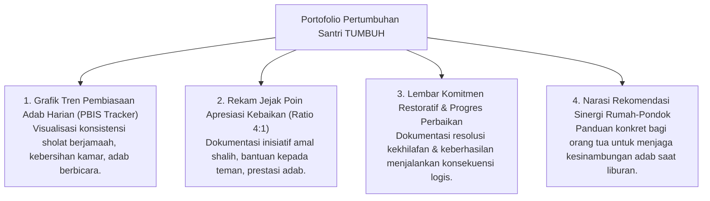

# P2-05-04-Prinsip-Portofolio-Pertumbuhan-Formatif

## Tujuan
Menetapkan prinsip penyusunan **Portofolio Pertumbuhan Formatif (*Growth-Oriented Formative Portfolio*)** dan Rapor Adab Naratif, menyajikan visualisasi data perkembangan karakter santri secara berkala bagi santri, asatidz, dan orang tua.

---

## 1. Komponen Portofolio Karakter Santri

---

## 2. Karakteristik Rapor Karakter Naratif TUMBUH

1. **Berfokus pada Pertumbuhan (*Growth-Mindset Focused*)**:
   - Menghargai sejauh mana santri telah berproses dari titik awal masuk pondok, bukan membandingkan peringkat antar santri (*No Norm-Referenced Ranking on Character*).
2. **Deskriptif & Kualitatif Mendalam**:
   - Menjelaskan kekuatan adab yang telah menjadi *Malakah* dan aspek yang sedang dalam proses pembimbingan (*Work in Progress*).
3. **Membangun Kemitraan dengan Orang Tua**:
   - Rapor bukan surat vonis pemanggilan masalah, melainkan jembatan komunikasi penuh empati antara musyrif dan wali santri.

---

## 3. Status Dokumen
* **Status**: 🌟 **A+ (Tervalidasi & Siap Diimplementasikan)**
* **Level**: Project 2 - `02 Principles / 05 Assessment Principles`
* **Langkah Berikutnya**: **`P2-05-05-Sintesis-Assessment-Principles-TUMBUH.md`**.
