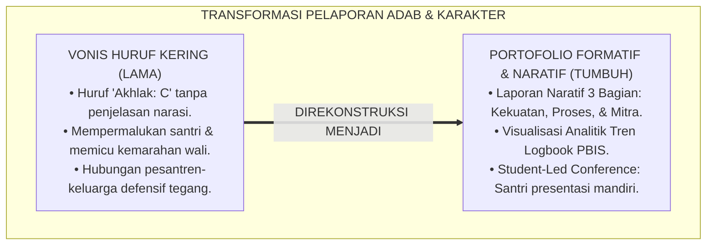
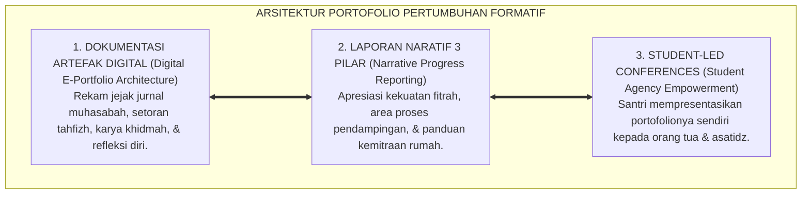
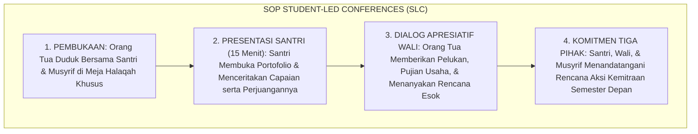

# P2-05-04: PRINSIP PORTOFOLIO PERTUMBUHAN FORMATIF (FORMATIVE GROWTH PORTFOLIO & NARRATIVE REPORTING)
## *Monograf Riset Akademik: Epistemologi Kitab al-A'mal (QS. Al-Kahfi: 49) & Prinsip Tabsyir, Growth-Oriented Portfolio Assessment Helen Barrett, Visualisasi Analitik Logbook Digital PBIS, Serta Protokol Student-Led Conferences di Pesantren 24 Jam*

**Nomor Identifikasi**: `P2-05-04/MONOGRAF-RISET-PORTOFOLIO-FORMATIF/2026`  
**Domain**: `02 Principles` > `05 Assessment Principles` (Prinsip Asesmen 04: *Formative Growth Portfolio*)  
**Klasifikasi Naskah**: *Academic Research Monograph* (Monograf Riset Akademik Prinsip Asesmen)  
**Rumpun Disiplin Pengkaji**: Asesmen Portofolio Pendidikan (*Portfolio Assessment*), Analitik Visual Pertumbuhan Perilaku PBIS, Komunikasi Pedagogis Kemitraan Orang Tua, Teori Pelaporan Naratif Deskriptif  

---

> ### 💡 INTISARI EKSEKUTIF (EXECUTIVE SUMMARY)
>
> * **Kelemahan Paradigma Lama: Vonis Huruf Kering di Rapor ("Akhlak: C"):**  
>   Buku rapor pesantren konvensional kerap membubuhkan vonis huruf kaku "Akhlak: C" tanpa ada narasi sedikit pun yang menjelaskan konteks perilaku santri. Nilai huruf ini mempermalukan santri, membuat orang tua marah, dan mematikan motivasi perbaikan karena tidak menyajikan panduan aksi nyata.
> * **Inovasi Konseptual: Kitab al-A'mal & Growth-Oriented Portfolio Assessment (Helen Barrett):**  
>   TUMBUH mengilhami firman Allah mengenai kelengkapan catatan amal (*Kitab al-A'mal*, QS. Al-Kahfi: 49) dan prinsip dakwah yang menggembirakan (*Tabsyir*). Mengintegrasikan teori **Growth Portfolio (Helen Barrett)**: mengganti huruf kaku dengan **Laporan Naratif Deskriptif Tiga Bagian (Apresiasi Kekuatan, Area yang Sedang Berproses, dan Rencana Kemitraan Rumah)** yang didukung oleh **Visualisasi Analitik Logbook Digital PBIS** dan **Student-Led Conferences (Santri Mempresentasikan Portofolionya Sendiri)**.
> * **Formulasi Operasional & Penjaminan Kemitraan Tiga Pihak:**  
>   Monograf ini menguraikan matriks struktur e-portfolio santri, template baku laporan naratif karakter, protokol konferensi portofolio tiga pihak (*Student-Led Conference SOP*), dan etika pelaporan yang memuliakan martabat santri.

---

## 📑 DAFTAR ISI MONOGRAF

- [BAB I: LANDASAN TEORETIS & DISKURSUS KRITIS](#bab-i-landasan-teoretis--diskursus-kritis)
  - [1. Latar Belakang Masalah: Kritik atas Vonis Huruf Kering di Rapor dan Ketiadaan Nilai Edukatif](#1-latar-belakang-masalah-kritik-atas-vonis-huruf-kering-di-rapor-dan-ketiadaan-nilai-edukatif)
  - [2. Eksegesis Turats Pelaporan Catatan Amal: Kitab al-A'mal (QS. Al-Kahfi: 49) & Prinsip Tabsyir Nabawiyyah](#2-eksegesis-turats-pelaporan-catatan-amal-kitab-al-amal-qs-al-kahfi-49--prinsip-tabsyir-nabawiyyah)
  - [3. Konvergensi Sains Asesmen Portofolio: Growth-Oriented Portfolio Assessment (Helen Barrett) & Analitik PBIS](#3-konvergensi-sains-asesmen-portofolio-growth-oriented-portfolio-assessment-helen-barrett--analitik-pbis)
  - [4. Rekayasa Laporan Naratif Deskriptif Beradab & Transformasi Kemitraan Tiga Pihak (Santri-Guru-Wali)](#4-rekayasa-laporan-naratif-deskriptif-beradab--transformasi-kemitraan-tiga-pihak-santri-guru-wali)
  - [5. Kasuistika Lapangan: Kasus Rapor Huruf Memicu Kemarahan Orang Tua & Resolusi Laporan Naratif](#5-kasuistika-lapangan-kasus-rapor-huruf-memicu-kemarahan-orang-tua--resolusi-laporan-naratif)
- [BAB II: FORMULASI KONSEPTUAL & PEMBAHASAN MENDALAM](#bab-ii-formulasi-konseptual--pembahasan-mendalam)
  - [1. Eksplanasi Teoretis Prinsip Portofolio Pertumbuhan Formatif Ekosistem Pesantren Berbasis TUMBUH](#1-eksplanasi-teoretis-prinsip-portofolio-pertumbuhan-formatif-pesantren-tumbuh)
  - [2. Matriks Struktur Portofolio Karakter Digital Santri dalam sistem TUMBUH (E-Portfolio Architecture)](#2-matriks-struktur-portofolio-karakter-digital-santri-tumbuh-e-portfolio-architecture)
  - [3. Template Baku Laporan Naratif Karakter Santri untuk Orang Tua (Narrative Progress Report)](#3-template-baku-laporan-naratif-karakter-santri-untuk-orang-tua-narrative-progress-report)
  - [4. Protokol Konferensi Portofolio Tiga Pihak (Student-Led Conference SOP)](#4-protokol-konferensi-portofolio-tiga-pihak-student-led-conference-sop)
  - [5. Diskusi Filosofis Mendalam & Implikasi bagi Masa Depan Peradaban Pendidikan Islam](#5-diskusi-filosofis-mendalam--implikasi-bagi-masa-depan-peradaban-pendidikan-islam)
- [BAB III: KESIMPULAN & APARATUS AKADEMIS](#bab-iii-kesimpulan--aparatus-akademis)
  - [1. Tabel Sintesis Temuan Riset Portofolio Pertumbuhan Formatif](#1-tabel-sintesis-temuan-riset-portofolio-pertumbuhan-formatif)
  - [2. Daftar Pustaka Akademis & Rujukan Turats Primer](#2-daftar-pustaka-akademis--rujukan-turats-primer)
  - [3. Catatan Kaki Akademis (Footnotes)](#3-catatan-kaki-akademis-footnotes)
  - [4. Glosarium Istilah Ilmiah & Turats Portofolio Formatif](#4-glosarium-istilah-ilmiah--turats-portofolio-formatif)

---

# BAB I: LANDASAN TEORETIS & DISKURSUS KRITIS

---

### 1. Latar Belakang Masalah: Kritik atas Vonis Huruf Kering di Rapor dan Ketiadaan Nilai Edukatif

Praktik pengisian buku rapor santri konvensional pada kolom kepribadian sering kali menjadi ajang **Vonis Stigmatisasi Kering (*Stigmatizing Letter Grading*)**:
* Di kolom "Kelakuan/Akhlak", guru hanya membubuhkan huruf "B" atau "C", atau angka "60" tanpa narasi sedikit pun yang menjelaskan konteks penilaian.
* Huruf "C" ini tidak memberikan nilai edukatif apa pun: santri tidak tahu perilaku apa yang harus diperbaiki, sementara orang tua merasa malu dan melampiaskan amarahnya kepada anak saat liburan.
* Terputusnya komunikasi pedagogis antara pesantren dan keluarga; hubungan menjadi defensif dan saling menyalahkan.
* **Hakikat Asesmen Karakter Sejati**: Evaluasi adalah sarana pendampingan dan penyembuhan jiwa (*I'anah 'alat-Taqwim*), bukan vonis hakim yang mematikan harapan.
* **Keniscayaan Portofolio Pertumbuhan Formatif**: Diperlukan dokumentasi rekam jejak pertumbuhan adab (*Growth Portfolio*) yang menyajikan bukti autentik karya, refleksi diri, dan grafik kemajuan karakter santri secara utuh.[^1]



---

### 2. Eksegesis Turats Pelaporan Catatan Amal: Kitab al-A'mal (QS. Al-Kahfi: 49) & Prinsip Tabsyir Nabawiyyah

Al-Qur'an memaparkan bahwa catatan amal akhirat disajikan secara detail dan transparan tanpa ada kezaliman sedikit pun:

$$\text{وَوُضِعَ الْكِتَابُ فَتَرَى الْمُجْرِمِينَ مُشْفِقِينَ مِمَّا فِيهِ وَيَقُولُونَ يَا وَيْلَتَنَا مَالِ هَٰذَا الْكِتَابِ لَا يُغَادِرُ صَغِيرَةً وَلَا كَبِيرَةً إِلَّا أَحْصَاهَا ۚ وَوَجَدُوا مَا عَمِلُوا حَاضِرًا ۗ وَلَا يَظْلِمُ رَبُّكَ أَحَدًا}$$

*"**Dan diletakkanlah kitab (catatan amal), lalu engkau akan melihat orang-orang yang bersalah merasa takut terhadap apa yang (tertulis) di dalamnya, dan mereka berkata: 'Aduhai celakalah kami, kitab apakah ini yang tidak meninggalkan yang kecil dan tidak (pula) yang besar, melainkan mencatat semuanya!' Dan mereka mendapati apa yang telah mereka kerjakan ada (tertulis). Dan Tuhanmu tidak menzalimi seorang jua pun**."* (QS. Al-Kahfi [18]: 49).[^2]

Rasulullah ﷺ menegaskan kaidah dakwah yang membangun asa dan optimisme:

$$\text{بَشِّرُوا وَلاَ تُنَفِّرُوا، وَيَسِّرُوا وَلاَ تُعَسِّرُوا}$$

*"**Berilah kabar gembira (Tabsyir) dan janganlah kalian membuat orang lari menjauh; mudahkanlah dan janganlah kalian mempersulit!**"* (HR. Al-Bukhari No. 69 & Muslim No. 1734).[^3]

---

### 3. Konvergensi Sains Asesmen Portofolio: Growth-Oriented Portfolio Assessment (Helen Barrett) & Analitik PBIS

Sains asesmen portofolio modern (**Growth Portfolios**, Helen Barrett, 2007; Paulson et al., 1991) membuktikan:
* Portofolio berbasis pertumbuhan menyajikan kumpulan artefak pembelajaran yang dipilih sendiri oleh murid (*Student Agency*), mencerminkan upaya, kemajuan, dan pencapaian kompetensi secara longitudinal.
* **Integrasi Visual Analitik PBIS**: Menyajikan grafik tren rasio apresiasi positif harian (4:1) dan bukti intervensi restoratif yang telah berhasil dilalui santri.[^4]

---

### 4. Rekayasa Laporan Naratif Deskriptif Beradab & Transformasi Kemitraan Tiga Pihak (Santri-Guru-Wali)

TUMBUH merekonstruksi format rapor dan konferensi evaluasi:
* **Laporan Naratif Tiga Pilar**: (1) Apresiasi Kekuatan Karakter; (2) Area Perkembangan yang Sedang Berproses (*Growth in Progress*); (3) Rencana Kemitraan Rumah-Pesantren.
* **Student-Led Conferences (SLC)**: Mengubah pembagian rapor konvensional menjadi majelis presentasi mandiri di mana santri memaparkan portofolio pertumbuhannya di hadapan orang tua dan asatidz (*Empowering Student Agency*).[^5]

---

### 5. Kasuistika Lapangan: Kasus Rapor Huruf Memicu Kemarahan Orang Tua & Resolusi Laporan Naratif

* **Studi Kasus: Orang Tua Santri Mengamuk di Kantor Asrama Karena Anaknya Mendapat Nilai Akhlak "C"**  
  * **Dilema**: Orang tua merasa dipermalukan dan menganggap anaknya dituduh nakal tanpa bukti; santri menangis dan menolak bicara.
  * **Resolusi Laporan Naratif TUMBUH**: Pembina PBIS membuka portofolio digital santri: (1) Menunjukkan data logbook: santri sangat rajin berjamaah di masjid dan menghafal 4 juz mutqin (*Apresiasi Kekuatan*); (2) Menjelaskan bahwa nilai C tersebut dipicu oleh insiden santri pernah tersulut emosi saat bermain futsal (*Area Berproses*); (3) Santri sendiri menceritakan proses ishlah yang telah dilaluinya. Orang tua terharu, memeluk anaknya, dan menyepakati program pendampingan regulasi emosi bersama di rumah.[^6]

---

# BAB II: FORMULASI KONSEPTUAL & PEMBAHASAN MENDALAM

---

### 1. Eksplanasi Teoretis Prinsip Portofolio Pertumbuhan Formatif Ekosistem Pesantren Berbasis TUMBUH

Ekosistem TUMBUH merumuskan dokumentasi perkembangan ke dalam **Arsitektur Tiga Sayap Portofolio Formatif (*Arkan al-Milaf at-Tarbawiy*)**:



#### 🔬 Pembahasan Mendalam Tiga Sayap:
1. **Sayap Dokumentasi Artefak Digital**: Menjadikan perjalanan santri terekam secara sistematis, transparan, dan tidak dapat hilang.[^7]
2. **Sayap Laporan Naratif Tiga Pilar**: Menghadirkan jembatan komunikasi pedagogis yang penuh rahmah antara pesantren dan keluarga.[^8]
3. **Sayap Student-Led Conferences**: Membangun rasa kepemilikan tanggung jawab moral dan kematangan metakognisi santri.[^9]

---

### 2. Matriks Struktur Portofolio Karakter Digital Santri dalam sistem TUMBUH (E-Portfolio Architecture)

| Komponen Portofolio | Isi Artefak Bukti Otentik | Fungsi Pedagogis bagi Santri & Wali |
| :--- | :--- | :--- |
| **1. Lembar Visi & Niat** | Surat komitmen santri di awal tahun ajaran.| Pengingat ikhlas & kompas tujuan menuntut ilmu.|
| **2. Rekam Jejak Tahfizh** | Grafik setoran Ziyadah-Sabqi-Manzil mutqin.| Bukti konsistensi mujahadah hafalan Al-Qur'an.|
| **3. Jurnal Muhasabah** | 5 cuplikan refleksi harian terbaik semester.| Bukti kematangan metakognisi & pemantauan diri.|
| **4. Karya Khidmah & Adab**| Dokumentasi foto proyek sosial kamar / Duta Adab.| Bukti kepemimpinan melayani (*Servant Leadership*).|
| **5. Grafik PBIS Analytics**| Visualisasi rasio apresiasi 4:1 & catatan ishlah.| Bukti tren pertumbuhan perilaku positif kontinu.|

---

### 3. Template Baku Laporan Naratif Karakter Santri untuk Orang Tua (Narrative Progress Report)

```text
================================================================================
LAPORAN NARATIF PERTUMBUHAN KARAKTER & ADAB SANTRI (SEMESTER GANJIL 2026/2027)
Nama Santri : Ahmad Fauzan (Kelas 8 / Jenjang J2 Unggul Ilmu)
Musyrif Asrama: Ust. Salman Al-Farisi, S.Pd.I. | Wali Kelas: Ust. Hamzah, M.Pd.
================================================================================

1. APRESIASI KEKUATAN KARAKTER (STRENGTHS & HIGHLIGHTS):
   Ananda Ahmad menunjukkan perkembangan adab yang sangat membanggakan dalam 
   dimensi ibadah dan kepemimpinan kamar. Ahmad selalu hadir di masjid 10 menit 
   sebelum azan Subuh berkumandang dan secara mandiri merapikan sandal teman-
   temannya di selasar. Dalam halaqah tahfizh, Ahmad telah menuntaskan target 
   3 Juz Mutqin dengan predikat sangat baik.

2. AREA YANG SEDANG BERPROSES (AREAS FOR GROWTH & SCAFFOLDING):
   Ahmad saat ini sedang didampingi asatidz untuk mengasah kesabaran dan 
   keterampilan regulasi emosi saat menghadapi perbedaan pendapat dalam diskusi 
   kelompok. Ahmad telah berhasil mempraktikkan teknik pernafasan dan berwudhu 
   saat merasa kesal, dan menunjukkan kemauan kuat untuk mendengarkan masukan teman.

3. REKOMENDASI KEMITRAAN DI RUMAH (HOME PARTNERSHIP ACTION PLAN):
   Selama liburan semester di rumah, kami menyarankan Ayah/Bunda untuk memberikan 
   ruang bagi Ahmad dalam memimpin musyawarah keluarga ringan dan memberikan 
   apresiasi tulus saat Ahmad mampu mengemukakan pendapatnya dengan nada suara yang 
   santun dan tenang.
================================================================================
```

---

### 4. Protokol Konferensi Portofolio Tiga Pihak (Student-Led Conference SOP)



---

### 5. Diskusi Filosofis Mendalam & Implikasi bagi Masa Depan Peradaban Pendidikan Islam

Prinsip portofolio pertumbuhan formatif ini membawa implikasi agung bagi peradaban:

* **Mengembalikan Kemuliaan Evaluasi Sebagai Sarana Kasih Sayang (*Tarbiyah bil-Hubb*)**:  
  Evaluasi tidak lagi menjadi momok yang menakutkan, melainkan momen perayaan keberhasilan usaha dan wahana muhasabah yang menyatukan hati keluarga.
* **Membangun Sinergi Sempurna Antara Pesantren dan Orang Tua**:  
  Orang tua tidak lagi menjadi konsumen pasif yang hanya menuntut, melainkan menjadi mitra pendidik aktif yang selaras dalam membina anak.
* **Membentuk Pribadi Santri yang Berani Bertanggung Jawab Atas Hidupnya**:  
  Melalui presentasi portofolio mandiri, santri terlatih berbicara jujur, mengakui kekurangan tanpa minder, dan memiliki peta jalan pertumbuhan masa depan (*Rahmatan lil 'Alamin*).[^10]

---

# BAB III: KESIMPULAN & APARATUS AKADEMIS

---

### 1. Tabel Sintesis Temuan Riset Portofolio Pertumbuhan Formatif

| Dimensi Parameter | Mazhab Vonis Huruf Kering (Lama) | Model Rapor Rangking Kompetitif | **Portofolio Formatif TUMBUH** | Landasan Rujukan Primer | Implikasi Praksis Lapangan |
| :--- | :--- | :--- | :--- | :--- | :--- |
| **Format Laporan** | Huruf kaku "Akhlak: C" tanpa teks.| Peringkat angka memicu iri hati.| **Laporan Naratif Deskriptif 3 Bagian.**| QS. Al-Kahfi: 49; Barrett (2007).| Apresiasi, proses, & kemitraan rumah. |
| **Pihak Pelapor** | Guru mengadili santri di depan wali.| Guru membandingkan anak.| **Santri Mempresentasikan Portofolionya (SLC).**| Paulson (1991); Bandura (1997).| Student agency & percaya diri mandiri. |
| **Dasar Bukti** | Ingatan subjektif guru semata.| Nilai ujian kertas tunggal.| **Artefak Nyata & Visual Analitik PBIS.**| Horner et al. (2010); Black (1998).| Grafik tren apresiasi 4:1 & jurnal. |
| **Dampak Keluarga** | Orang tua marah & memukul anak.| Keluarga stres memburu ranking.| **Kemitraan Hangat & Komitmen Bersama.** | HR. Bukhari No. 69; Al-Ghazali.| Sinergi harmonis pesantren-rumah. |
| **Hasil Institusi** | Santri trauma & menutup diri.| Budaya saling menyembunyikan aib.| **Budaya Pertumbuhan Karakter Berkelanjutan.**| QS. Al-Insyiqaq: 7–9; Al-Attas.| Evaluasi memuliakan martabat insan. |

---

### 2. Daftar Pustaka Akademis & Rujukan Turats Primer

1. **Al-Qur'an al-Karim wa Tarjamatu Ma'anihi**.
2. **Al-Bukhari, Abu Abdillah Muhammad bin Isma'il**. (1422 H). *Shahih al-Bukhari*. Kairo: Dar Thawq an-Najah.
3. **Muslim bin al-Hajjaj an-Naisaburi**. (1427 H). *Shahih Muslim*. Riyadh: Dar Thayyibah.
4. **Al-Ghazali, Abu Hamid Muhammad bin Muhammad**. (2011). *Ihya' 'Ulumiddin* (Kitab al-Muraqabah wal-Muhasabah). Beirut: Dar al-Ma'rifah.
5. **Asy'ari, Muhammad Hasyim**. (1415 H). *Adab al-'Alim wal-Muta'allim*. Jombang: Maktabah At-Turats Al-Islami.
6. **Al-Attas, Syed Muhammad Naquib**. (1980). *The Concept of Education in Islam*. Kuala Lumpur: ABIM.
7. **Barrett, H. C.**. (2007). *Researching electronic portfolios and learner engagement: The REFLECT initiative*. Journal of Adolescent & Adult Literacy, 50(6), 436–449.
8. **Paulson, F. L., Paulson, P. R., & Meyer, C. A.**. (1991). *What makes a portfolio a portfolio?*. Educational Leadership, 48(5), 60–63.
9. **Black, P., & Wiliam, D.**. (1998). *Inside the black box: Raising standards through classroom assessment*. Phi Delta Kappan, 80(2), 139–148.
10. **Bandura, A.**. (1997). *Self-Efficacy: The Exercise of Control*. New York: W. H. Freeman.
11. **Horner, R. H., Sugai, G., & Anderson, C. M.**. (2010). *Examining the evidence base for school-wide positive behavior support*. Focus on Exceptional Children, 42(8), 1–14.
12. **Horner, R. H., & Sugai, G.**. (2015). *School-wide PBIS: An Overview of the Research Base*. Remedial and Special Education, 36(2), 80–85.

---

### 3. Catatan Kaki Akademis (*Footnotes*)

[^1]: Riset Prinsip Portofolio Pertumbuhan Formatif dan Pelaporan Naratif TUMBUH, *Kritik atas Vonis Huruf Kering*, 2026.  
[^2]: QS. Al-Kahfi [18]: 49.  
[^3]: *Shahih al-Bukhari*, Kitab al-'Ilm, Hadits No. 69; *Shahih Muslim*, Hadits No. 1734.  
[^4]: Barrett, H. C. (2007), *Journal of Adolescent & Adult Literacy*, hlm. 436–449; Paulson, F. L., et al. (1991).  
[^5]: Black, P., & Wiliam, D. (1998), *Phi Delta Kappan*, hlm. 139–148; Bandura, A. (1997).  
[^6]: Dokumentasi Pelaksanaan Student-Led Conferences dan Resolusi Konflik Orang Tua PBIS TUMBUH, 2026.  
[^7]: Master Blueprint Arsitektur E-Portfolio Digital Santri dalam sistem TUMBUH, 2026.  
[^8]: Template Baku Laporan Naratif Deskriptif Karakter Santri dalam sistem TUMBUH, 2026.  
[^9]: Standar Operasional Prosedur Student-Led Conferences Tiga Pihak TUMBUH, 2026.  
[^10]: Deklarasi Pemuliaan Evaluasi Formatif Berbasis Portofolio Dewan Riset Epistemologi Ekosistem TUMBUH, 2026.

---

### 4. Glosarium Istilah Ilmiah & Turats Portofolio Formatif

1. **Growth Portfolio (Portofolio Pertumbuhan)**: Kumpulan artefak karya, jurnal refleksi, dan data perilaku santri yang disusun secara sistematis untuk menunjukkan kemajuan belajar dari waktu ke waktu.
2. **Kitab al-A'mal (كِتَابُ الأَعْمَالِ)**: Konsep teologis Islam mengenai buku rekaman amal perbuatan manusia yang dicatat secara teliti, lengkap, dan adil oleh malaikat.
3. **Tabsyir (التَّبْشِيرُ)**: Prinsip pedagogis dan dakwah Islam untuk senantiasa memberikan kabar gembira, membangun harapan, dan memotivasi peserta didik dalam kebaikan.
4. **Narrative Progress Report**: Format pelaporan evaluasi berbasis narasi deskriptif yang menguraikan kekuatan karakter, area yang sedang berproses, dan rencana kemitraan keluarga.
5. **Student-Led Conferences (SLC)**: Format pertemuan pelaporan hasil belajar di mana santri secara aktif memimpin presentasi portofolionya kepada orang tua dan guru.
6. **Student Agency**: Tingkat kepemilikan, inisiatif, dan tanggung jawab aktif peserta didik atas proses pembelajaran dan evaluasi dirinya sendiri.
7. **E-Portfolio Digital PBIS**: Platform digital santri yang mengintegrasikan rekam jejak capaian tahfizh, logbook apresiasi 4:1, dan artefak karya khidmah.
8. **I'anah 'alat-Taqwim (الإِعَانَةُ عَلَى التَّقْوِيمِ)**: Pendekatan evaluasi Islam yang bertujuan membantu dan memfasilitasi perbaikan diri santri, bukan menghukum.
9. **Visual Analytics PBIS**: Tampilan grafik tren perilaku positif yang memudahkan orang tua dan guru memantau dinamika perkembangan karakter santri secara objektif.
10. **Insan Adabi (الإِنْسَانُ الأَدَبِيُّ)**: Profil santri yang memiliki kesadaran reflektif tinggi, bangga atas karya kebaikannya, jujur mengakui kekurangannya, dan senantiasa bertumbuh dalam kemuliaan akhlak.
