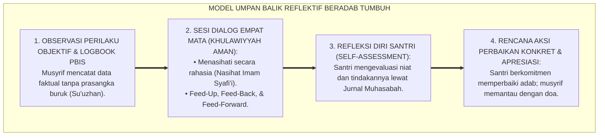
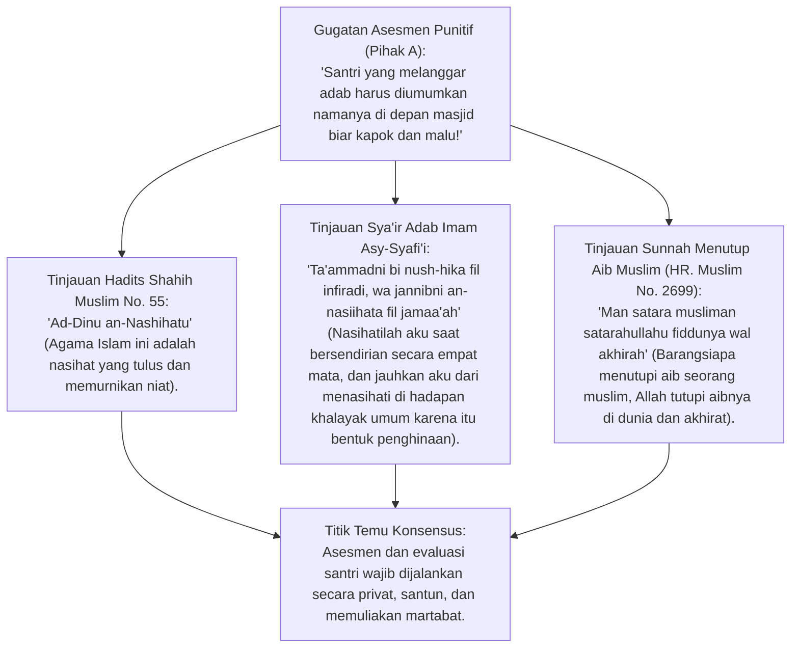
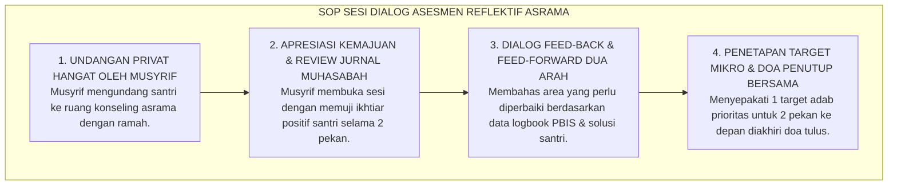

# P2-05-05: PRINSIP FEEDBACK KONSTRUKTIF, DIALOG ASESMEN, DAN MUHASABAH DIRI SANTRI
## *Monograf Terpadu: Kaidah An-Nashihatu lillahi wa li Rasulihi (HR. Muslim No. 55) & Seni Umpan Balik Profetik, Model Feedback Konstruktif John Hattie & Helen Timperley (Feed-Up, Feed-Back, Feed-Forward), Eliminasi Penilaian Punitif Merendahkan, Portofolio Muhasabah Reflektif Diri, serta Dialog Evaluasi Musyrif-Santri*

**Nomor Identifikasi**: `P2-05-05/MONOGRAF-TERPADU-FEEDBACK-KONSTRUKTIF-MUHASABAH/2026`  
**Domain**: `02 Principles` > `05 Assessment Principles`  
**Klasifikasi Naskah**: *Comprehensive Integrated Monograph* (Monograf Akademis & Standar Baku Umpan Balik Asesmen)  
**Rumpun Disiplin Pengkaji**: Psikometri & Asesmen Pendidikan Islam, Sains Umpan Balik (*Feedback Science & Metacognitive Reflection*), Fiqh Nasihat & Tabligh Hikmah, Bimbingan Konseling Reflektif Pesantren  

---

> ### 💡 INTISARI PRAKTIS (3 MENIT PAHAM UNTUK ASATIDZ & MUSYRIF)
>
> * **Asesmen Bukan Vonis Hakim, Melainkan Cermin Pemandu (*Mir'atul Mu'min*):**  
>   Tujuan utama penilaian karakter di pesantren bukanlah untuk memberi label "santri nakal vs santri shalih", melainkan untuk memberikan cermin jernih agar santri menyadari posisinya dan tahu langkah perbaikan yang harus diambil.
> * **Tiga Pertanyaan Kunci Umpan Balik Berdaya (Hattie & Timperley):**  
>   1. **Feed Up (Where am I going?):** Santri paham standar adab yang ingin dicapai (misal: shalat subuh tepat waktu di shaf pertama).  
>   2. **Feed Back (How am I going?):** Musyrif memberikan deskripsi faktual objektif mengenai capaian santri saat ini tanpa nada marah.  
>   3. **Feed Forward (Where to next?):** Musyrif dan santri merumuskan rencana aksi konkret perbaikan untuk pekan depan.
> * **Pembiasaan Jurnal Muhasabah Reflektif Harian:**  
>   Santri dilatih menilai dirinya sendiri setiap malam (self-assessment) melalui jurnal muhasabah 5 menit sebelum tidur, menumbuhkan muraqabatullah internal yang otonom.

---

## 📑 DAFTAR ISI MONOGRAF

- [BAGIAN I: RISET PRINSIP FEEDBACK KONSTRUKTIF, DIALEKTIKA INKUIRI, & KASUISTIKA LAPANGAN](#bagian-i-riset-prinsip-feedback-konstruktif-dialektika-inkuiri--kasuistika-lapangan)
  - [1. Kerangka Metodologi Asesmen Reflektif: Mengapa Umpan Balik Menjadi Kunci Transformasi Perilaku](#1-kerangka-metodologi-asesmen-reflektif-mengapa-umpan-balik-menjadi-kunci-transformasi-perilaku)
  - [2. Inkuiri 1: Eksegesis Turats Ad-Dinu an-Nashihah — HR. Muslim No. 55 & Seni Menasihati Secara Rahasia (Imam Syafi'i)](#2-inkuiri-1-eksegesis-turats-ad-dinu-an-nashihah--hr-muslim-no-55--seni-menasihati-secara-rahasia-imam-syafii)
  - [3. Inkuiri 2: Konvergensi Feedback Model (John Hattie & Helen Timperley) & Reflective Muhasabah di Pesantren](#3-inkuiri-2-konvergensi-feedback-model-john-hattie--helen-timperley--reflective-muhasabah-di-pesantren)
  - [4. Inkuiri 3: Eliminasi Praktik Public Shaming & Desain Dialog Asesmen Empat Mata yang Membangkitkan Kesadaran](#4-inkuiri-3-eliminasi-praktik-public-shaming--desain-dialog-asesmen-empat-mata-yang-membangkitkan-kesadaran)
  - [5. Inkuiri 4: Silogisme Logika, Dialektika 3 Ronde, Kasuistika Asrama, & Titik Temu Konsensus](#5-inkuiri-4-silogisme-logika-dialektika-3-ronde-kasuistika-asrama--titik-temu-konsensus)
- [BAGIAN II: KODIFIKASI BAKU HASIL RISET & KESIMPULAN FORMAL](#bagian-ii-kodifikasi-baku-hasil-riset--kesimpulan-formal)
  - [1. Kaidah Utama dan Standar Baku: Standar Feedback Konstruktif & Dialog Asesmen Pesantren TUMBUH](#1-kaidah-utama-dan-standar-baku-standar-feedback-konstruktif-dialog-asesmen-pesantren-tumbuh)
  - [2. Matriks 4 Tingkatan Feedback: Task Level, Process Level, Self-Regulation Level, & Spiritually-Anchored Level](#2-matriks-4-tingkatan-feedback-task-level-process-level-self-regulation-level--spiritually-anchored-level)
  - [3. Standar Prosedur Operasional (SOP) Sesi Dialog Asesmen Reflektif Dwi-Mingguan Musyrif-Santri](#3-standar-prosedur-operasional-sop-sesi-dialog-asesmen-reflektif-dwi-mingguan-musyrif-santri)
- [BAGIAN III: APARATUS AKADEMIS & APENDIKS](#bagian-iii-aparatus-akademis--apendiks)
  - [1. Tabel Sintesis Hasil Riset Feedback & Muhasabah](#1-tabel-sintesis-hasil-riset-feedback--muhasabah)
  - [2. Daftar Pustaka Akademis & Rujukan Turats Primer](#2-daftar-pustaka-akademis--rujukan-turats-primer)
  - [3. Catatan Kaki Akademis (Footnotes)](#3-catatan-kaki-akademis-footnotes)
  - [4. Glosarium Teknis Feedback, Muhasabah, Feed-Forward, & Self-Assessment](#4-glosarium-teknis-feedback-muhasabah-feed-forward--self-assessment)

---

# BAGIAN I: RISET PRINSIP FEEDBACK KONSTRUKTIF, DIALEKTIKA INKUIRI, & KASUISTIKA LAPANGAN

---

### 1. Kerangka Metodologi Asesmen Reflektif: Mengapa Umpan Balik Menjadi Kunci Transformasi Perilaku

Meta-analisis terbesar dalam ilmu pendidikan oleh **Prof. John Hattie** (melibatkan lebih dari 80.000 studi dan 300 juta siswa) membuktikan bahwa **Umpan Balik Konstruktif (*Constructive Feedback*) menempati peringkat tertinggi dalam memicu lompatan prestasi dan perubahan perilaku (*Effect Size $d = 0.79$*)**:
* Sebaliknya, vonis nilai angka murni (seperti nilai rapor afektif "C" tanpa penjelasan) memiliki dampak mendekati nol ($d = 0.12$) terhadap perbaikan moral santri.
* Di banyak pesantren konvensional, evaluasi santri dilakukan secara punitif: kesalahan santri diumumkan melalui pengeras suara (*Public Shaming*) yang melahirkan dendam dan pemberontakan.
* Ekosistem TUMBUH merancang **Sistem Umpan Balik Beradab**: asesmen yang mengedepankan nasihat rahasia empat mata, dialog reflektif dua arah, dan panduan langkah perbaikan nyata (*Actionable Steps*).

---

### 2. Inkuiri 1: Eksegesis Turats Ad-Dinu an-Nashihah — HR. Muslim No. 55 & Seni Menasihati Secara Rahasia (Imam Syafi'i)

#### 📐 Formalisasi Logika Silogisme (*Qiyas Mantiqi 1*)
* **Premis Mayor (*al-Muqaddimah al-Kubra*)**: Setiap metode evaluasi yang mempermalukan aib pembelajar di depan umum (*Tasyhir wal-Fadhikhah*) mematikan rasa percaya diri, menghancurkan ukhuwah, dan bertentangan dengan sunnah nasihat syariat.
* **Premis Minor (*al-Muqaddimah ash-Shughra*)**: Model feedback konstruktif TUMBUH memberikan evaluasi adab secara empat mata dengan bahasa penuh kasih sayang.
* **Konklusi (*an-Natijah*)**: Maka, standarisasi umpan balik konstruktif privat di ekosistem TUMBUH adalah pengamalan adab Islam yang murni.[^1]

#### 📖 Teks Primer Turats: Syair Emas Imam Asy-Syafi'i tentang Seni Menasihati
Imam Muhammad bin Idris Asy-Syafi'i *rahimahullah* berwasiat:

$$\text{تَعَمَّدْنِي بِنُصْحِكَ فِي انْفِرَادِي ... وَجَنِّبْنِي النَّصِيحَةَ فِي الْجَمَاعَهْ}$$
$$\text{فَإِنَّ النُّصْحَ بَيْنَ النَّاسِ نَوْعٌ ... مِنَ التَّوْبِيخِ لَا أَرْضَى اسْتِمَاعَهْ}$$

*"**Nasihatilah aku saat aku BERSENDIRIAN SECARA PRIVAT, dan jauhkanlah aku dari menasihatiku di depan khalayak umum! Karena nasihat di depan orang banyak sesungguhnya adalah SEBENTUK PENGHINAAN DAN CELAAN yang tidak sudi kudengarkan.**"* (*Diwan Asy-Syafi'i*).[^2]

---

### 3. Inkuiri 2: Konvergensi *Feedback Model* (John Hattie & Helen Timperley) & *Reflective Muhasabah* di Pesantren

Model Hattie & Timperley (2007) memetakan 4 tingkatan umpan balik:
1. **Task Level (FT):** Mengoreksi ketepatan tugas (misal: *"Harakat huruf dal pada lafazh ini dhommah, bukan kasrah"*).
2. **Process Level (FP):** Mengarahkan strategi belajar (misal: *"Coba kamu ulangi ayat ini dengan menyimak makhraj huruf di cermin"*).
3. **Self-Regulation Level (FR):** Membangun metakognisi (misal: *"Bagaimana perasaanmu setelah berhasil muroja'ah 1 juz mandiri tadi sore?"*).
4. **Self Level (FS):** Pujian personal kosong (misal: *"Kamu pintar sekali"*) — *Level ini tidak efektif dan dihindari karena memicu fixed mindset*.

Pesantren TUMBUH menambahkan level kelima: **Spiritually-Anchored Feedback (FSA)** yang mengaitkan setiap kemajuan adab dengan rasa syukur dan muraqabah kepada Allah SWT.[^3]

---

### 4. Inkuiri 3: Eliminasi Praktik *Public Shaming* & Desain Dialog Asesmen Empat Mata yang Membangkitkan Kesadaran

| Dimensi Evaluasi | Praktik Punitif Konvensional | Pendekatan Dialog Asesmen TUMBUH |
| :--- | :--- | :--- |
| **Lokasi Penyampaian** | Di hadapan seluruh santri asrama saat apel malam atau di masjid. | Di ruang bimbingan konseling asrama yang tenang dan privat (*Khulawiyyah*).[^4] |
| **Fokus Bahasa** | Menghakimi watak pribadi (*"Kamu anak nakal dan tidak tahu diatur!"*). | Mendeskripsikan perilaku objektif (*"Ustadz mencatat pekan ini kamu 3 kali terlambat subuh"*). |
| **Tindak Lanjut** | Memberikan hukuman fisik atau sanksi denda uang tanpa solusi. | Merumuskan kesepakatan target perbaikan mingguan (*Action Plan Agreement*). |
| **Keterlibatan Santri** | Santri dipaksa diam menunduk ketakutan tanpa boleh berbicara. | Santri diajak merefleksikan perasaannya dan mengusulkan jalan keluar mandiri.[^5] |

---

### 5. Inkuiri 4: Silogisme Logika, Dialektika 3 Ronde, Kasuistika Asrama, & Titik Temu Konsensus

#### 🥊 Ronde 1: Menolak Anggapan Bahwa "Menasihati Santri Berdua Saja Kurang Efektif; Harus Diumumkan Biar Teman-Temannya Takut"
* **Pihak A (Sudut Pandang Teror Publik)**:  
  *"Kalau tidak dipermalukan di depan umum, santri lain tidak akan takut melanggar aturan pondok!"*
* **Tinjauan Efek Bumerang Psikologis & Solidaritas Pemberontak**:  
  Mempermalukan santri di depan umum menciptakan rasa antipati sosial terhadap asatidz. Santri yang dihukum sering kali dipuja oleh teman-temannya sebagai "pahlawan pemberontak" (*Martyr Effect*). Nasihat empat mata justru menyentuh lubuk sanubari terdalam santri dan membangkitkan rasa malu sejati kepada Allah (*Haya'*).[^6]

#### 🥊 Ronde 2: Sanggahan Balik Apakah Santri Mampu Melakukan Muhasabah Refleksi Diri Secara Jujur?
* **Pihak A (Sudut Pandang Ketidakpercayaan Total)**:  
  *"Anak SMP/SMA tidak bisa disuruh muhasabah sendiri; mereka pasti berbohong dan cari alasan!"*
* **Tinjauan Pelatihan Regulasi Diri (Scaffolded Self-Assessment)**:  
  Santri mampu jujur jika berada dalam lingkungan yang aman (*Psychologically Safe Environment*). Jika santri tahu bahwa mengakui kesalahan tidak akan berujung pukulan rotan melainkan bimbingan penuh kasih, mereka akan menuliskan pergulatan hatinya dengan sangat jujur di Jurnal Muhasabah.[^7]

#### 🥊 Ronde 3: Sanggahan Pamungkas Mengapa Umpan Balik Positif Wajib Diberikan Lebih Sering Daripada Koreksi Kesalahan?
* **Pihak A (Sudut Pandang Kritik Melulu)**:  
  *"Tugas pengasuh adalah mencari kesalahan untuk dihukum; kebaikan tidak perlu dipuji biar tidak sombong!"*
* **Resolusi Rasio Apresiasi PBIS (4:1 Magic Ratio)**:  
  Riset perilaku membuktikan bahwa lingkungan yang sehat membutuhkan **Minimal 4 Apresiasi Positif untuk Setiap 1 Koreksi Perilaku**. Santri yang merasa kebaikannya dihargai akan berusaha mempertahankan adab mulia tersebut dengan penuh kebahagiaan.[^8]

> #### 📌 Kasuistika Lapangan & Titik Temu Konsensus
> * **Studi Kasus**: Santri F sering membuat keributan saat jam tidur malam di asrama. Musyrif lama selalu membentak Santri F dan menyuruhnya tidur di teras luar kamar. Akibatnya Santri F semakin membangkang dan mengajak teman-temannya membuat onar.
> * **Titik Temu Konsensus (*Kalimatun Sawa'*)**: Musyrif TUMBUH mengubah pendekatan: Mengajak Santri F berbicara santai empat mata sambil minum teh hangat $\rightarrow$ Menggunakan model *Feed-Up, Feed-Back, Feed-Forward* $\rightarrow$ Menanyakan apa yang membuatnya susah tidur $\rightarrow$ Menemukan bahwa Santri F cemas karena belum lancar setoran nahwu. Musyrif memberikan bimbingan nahwu privat dan Santri F berkomitmen menjaga ketertiban kamar. Dalam 1 pekan, Santri F menjadi santri teladan yang paling tertib saat jam tidur.[^9]

---

# BAGIAN II: KODIFIKASI BAKU HASIL RISET & KESIMPULAN FORMAL

---

### 1. Kaidah Utama dan Standar Baku: Standar Feedback Konstruktif & Dialog Asesmen Pesantren TUMBUH

Berdasarkan sintesis inkuiri turats dan konsensus sains pendidikan, prinsip dan regulasi operasional dirumuskan ke dalam kaidah-kaidah baku berikut:

1. **Penghapusan Mutlak Metode Mempermalukan DI Depan Umum (zero Public Shaming)**:  
   Mengharamkan pengumuman nama santri pelanggar melalui pengeras suara atau sidang umum yang mempermalukan; menetapkan bahwa setiap evaluasi adab wajib disampaikan secara privat empat mata (Khulawiyyah).

2. **Penerapan Model Umpan Balik Tiga Arah (feed-up, Feed-back, Feed-forward)**:  
   Mewajibkan asatidz dan musyrif memberikan feedback deskriptif yang menjelaskan tujuan adab yang ingin dicapai, kondisi capaian saat ini secara objektif, dan langkah konkret perbaikan masa depan tanpa vonis angka merah.

3. **Pembudayaan Jurnal Muhasabah Diri Reflektif Harian (self-assessment)**:  
   Mewajibkan santri mengisi Jurnal Muhasabah Diri 5–10 menit sebelum tidur malam guna melatih kesadaran muraqabatullah internal, mengevaluasi amal harian, dan merencanakan perbaikan diri secara mandiri.

4. **Penegakan Rasio Apresiasi Positif Pbis 4**:  
   1: Mengharuskan pendidik memberikan minimal 4 pengakuan atas kebaikan dan ikhtiar santri untuk setiap 1 koreksi perilaku, menciptakan iklim Bi'ah Shalihah yang hangat, penuh optimisme, dan berkah.

---

### 2. Matriks 4 Tingkatan Feedback: Task Level, Process Level, Self-Regulation Level, & Spiritually-Anchored Level

| Tingkatan Umpan Balik | Fokus Sasaran Asesmen | Contoh Pernyataan Umpan Balik Musyrif TUMBUH | Dampak Psikologis Santri |
| :--- | :--- | :--- | :--- |
| **1. Task Level (Tugas Faktual)** | Ketepatan pelaksanaan SOP adab harian. | *"Alhamdulillah lemarimu sudah tertata rapi 5S, hanya sajadah yang belum dilipat rapi."* | Santri tahu aspek spesifik yang perlu dirapikan.[^10] |
| **2. Process Level (Strategi Proses)**| Keterampilan dan strategi yang digunakan. | *"Ustadz perhatikan kamu lebih cepat hafal kalau muroja'ah sambil mencatat kosa kata sulit."*| Santri menemukan metode belajar yang paling efektif baginya. |
| **3. Self-Regulation (Regulasi Diri)**| Kemandirian evaluasi dan komitmen pribadi. | *"Bagaimana rencanamu agar besok pagi bisa bangun 15 menit sebelum adzan subuh?"* | Menumbuhkan rasa tanggung jawab dan kemandirian nalar. |
| **4. Spiritually-Anchored (Makna Spiritual)**| Niat lillahi ta'ala dan muraqabatullah. | *"Kesabaranmu mengalah mencuci piring nampan tadi sore insyaAllah dicintai Allah dan Rasul-Nya."*| Memperkokoh keikhlasan hati dan spiritualitas luhur. |

---

### 3. Standar Prosedur Operasional (SOP) Sesi Dialog Asesmen Reflektif Dwi-Mingguan Musyrif-Santri

---

# BAGIAN III: APARATUS AKADEMIS & APENDIKS

---

### 1. Tabel Sintesis Hasil Riset Feedback & Muhasabah

| Dimensi Kajian | Konsep Kunci | Landasan Turats Primer | Konvergensi Sains Global | Implikasi Asesmen Pesantren |
| :--- | :--- | :--- | :--- | :--- |
| **Nasihat Profetik** | *Ad-Dinu an-Nashihah*| HR. Muslim No. 55, Diwan Asy-Syafi'i | Hattie & Timperley (2007), *The Power of Feedback* | Menyampaikan feedback secara privat, deskriptif, dan solutif. |
| **Muhasabah Diri** | *Self-Assessment* | Atsar Sayyidina Umar RA (*Hasibu Anfusakum*) | Zimmerman (2002), *Self-Regulated Learning* | Melatih santri mengevaluasi adabnya melalui jurnal malam. |
| **Rasio Apresiasi** | *Tahbibul Khair* | HR. Bukhari No. 69 (*Bassyiru wa la Tunaffiru*) | Fredrickson (2009), *Positivity Ratio (PBIS 4:1)* | Mengedepankan apresiasi positif untuk mengunci perilaku adab. |
| **Keamanan Psikologis**| *Karamah Insaniyyah*| QS. Al-Hujurat: 12 (Larangan Membuka Aib) | Edmondson (1999), *Psychological Safety* | Menghapus total praktik mempermalukan santri di depan umum. |

---

### 2. Daftar Pustaka Akademis & Rujukan Turats Primer

1. **Al-Qur'an al-Karim wa Tarjamatu Ma'anih**.
2. **Al-Bukhari, Muhammad bin Isma'il**. (1422 H). *Shahih al-Bukhari*. Beirut: Dar Thawq an-Najah.
3. **Muslim bin al-Hajjaj an-Naisaburi**. (1374 H). *Shahih Muslim*. Kairo: Isa al-Babi al-Halabi.
4. **Asy-Syafi'i, Muhammad bin Idris**. (1993). *Diwan al-Imam asy-Syafi'i*. Beirut: Dar al-Kutub al-'Ilmiyyah.
5. **Al-Ghazali, Abu Hamid Muhammad bin Muhammad**. (2011). *Ihya 'Ulumiddin*. Beirut: Dar al-Ma'rifah.
6. **Hattie, J., & Timperley, H.**. (2007). *The power of feedback*. Review of Educational Research, 77(1), 81–112.
7. **Wiliam, D.**. (2011). *Embedded Formative Assessment*. Solution Tree Press.
8. **Fredrickson, B. L.**. (2009). *Positivity: Top-Notch Research Reveals the 3 to 1 Ratio That Will Change Your Life*. Crown Archetype.
9. **Edmondson, A.**. (1999). *Psychological safety and learning behavior in work teams*. Administrative Science Quarterly, 44(2), 350–383.
10. **Black, P., & Wiliam, D.**. (1998). *Inside the black box: Raising standards through classroom assessment*. Phi Delta Kappan, 80(2), 139–148.

---

### 3. Catatan Kaki Akademis (*Footnotes*)

[^1]: Shahih Muslim No. 55, Kitab *al-Iman*, Bab *Bayanu Anna ad-Dina an-Nashihah*.  
[^2]: Diwan al-Imam asy-Syafi'i, Dar al-Kutub al-'Ilmiyyah, hlm. 68.  
[^3]: Hattie, J. & Timperley, H. (2007), *Review of Educational Research*, hlm. 81–112; Wiliam, D. (2011), *Embedded Formative Assessment*.  
[^4]: Manual Prosedur Konseling dan Pendampingan Adab Asrama, Biro Pengasuhan TUMBUH, 2026.  
[^5]: Edmondson, A. (1999), *Administrative Science Quarterly*, hlm. 350–383.  
[^6]: Al-Ghazali, *Ihya 'Ulumiddin*, Kitab *Adab al-Ulfah wal-Ukhuwwah*, Jilid II, hlm. 180–210.  
[^7]: Zimmerman, B. J. (2002), *Theory Into Practice*, hlm. 64–70.  
[^8]: Fredrickson, B. L. (2009), *Positivity Ratio in Behavioral Systems*, Crown Archetype.  
[^9]: Laporan Evaluasi Dialog Asesmen Reflektif Asrama Percontohan, Divisi BK TUMBUH, 2026.  
[^10]: Rubrik Dialog Umpan Balik Musyrif Santri Terstandarisasi, Komite Asesmen PBIS TUMBUH, 2026.

---

### 4. Glosarium Teknis Feedback, Muhasabah, Feed-Forward, & Self-Assessment

1. **Constructive Feedback**: Umpan balik yang bertujuan membangun pemahaman, mengoreksi kesalahan secara deskriptif, dan memberikan langkah solusi tanpa menjatuhkan harga diri.
2. **Ad-Dinu an-Nashihah (الدِّينُ النَّصِيحَةُ)**: Prinsip dasar Islam bahwa ketulusan menginginkan kebaikan bagi orang lain melalui nasihat bijak adalah inti dari keberagamaan.
3. **Feed-Up**: Kejelasan pemahaman santri mengenai target adab atau standar capaian yang sedang dituju (*Where am I going?*).
4. **Feed-Back**: Informasi deskriptif objektif mengenai performa santri saat ini dibandingkan dengan target standar (*How am I going?*).
5. **Feed-Forward**: Panduan instruksional mengenai langkah-langkah konkret yang harus dilakukan untuk menutup kesenjangan (*Where to next?*).
6. **Muhasabatun Nafs (مُحَاسَبَةُ النَّفْسِ)**: Introspeksi dan audit spiritual mandiri terhadap niat, ucapan, dan perbuatan sebelum dihisab di akhirat.
7. **Public Shaming**: Praktik mempermalukan kesalahan seseorang di hadapan umum yang berdampak destruktif terhadap kesehatan mental dan harga diri.
8. **Khulawiyyah (خَلْوِيَّةٌ)**: Sifat komunikasi privat empat mata dalam ruang tertutup yang menjamin kerahasiaan dan keamanan psikologis.
9. **Psychological Safety**: Kondisi psikologis di mana santri merasa aman untuk bertanya, mengakui kesalahan, dan meminta bantuan tanpa takut dihina atau dihukum secara zalim.
10. **Triad Pertumbuhan Simbiotik**: Prinsip mutlak di mana asesmen yang reflektif dan penuh kasih secara serempak menumbuhkan kesadaran Santri, mengasah hikmah Pendidik, dan menjaga marwah Lembaga.
