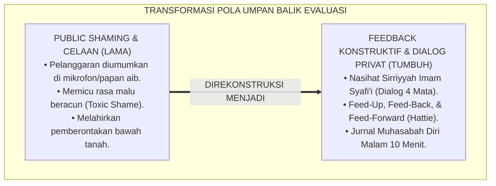
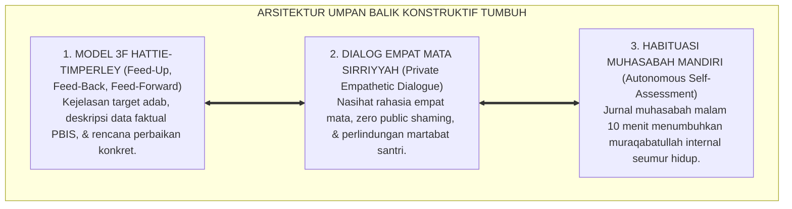
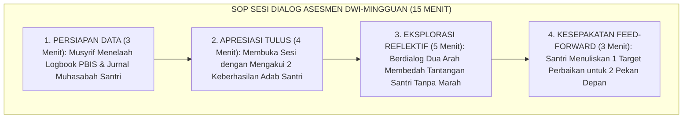
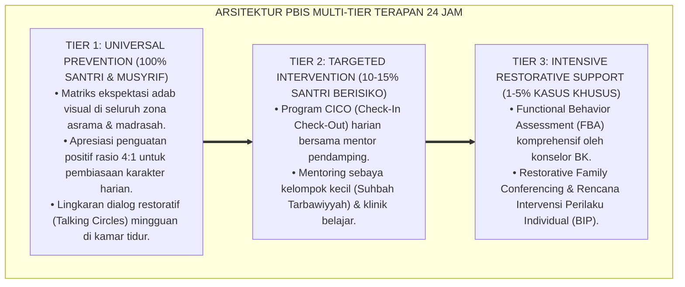

# P2-05-05: PRINSIP FEEDBACK KONSTRUKTIF, DIALOG ASESMEN, DAN MUHASABAH DIRI SANTRI (CONSTRUCTIVE FEEDBACK & REFLECTIVE DIALOGUE)
## *Monograf Riset Akademik: Epistemologi Ad-Dinu an-Nashihah (HR. Muslim No. 55) & Seni Nasihat Sirriyyah Imam Asy-Syafi'i, Feedback Model John Hattie & Helen Timperley (Feed-Up, Feed-Back, Feed-Forward), Eliminasi Public Shaming, Serta Sesi Dialog Asesmen Empat Mata di Pesantren 24 Jam*

**Nomor Identifikasi**: `P2-05-05/MONOGRAF-RISET-FEEDBACK-KONSTRUKTIF-MUHASABAH/2026`  
**Domain**: `02 Principles` > `05 Assessment Principles` (Prinsip Asesmen 05: *Constructive Feedback & Reflective Dialogue*)  
**Klasifikasi Naskah**: *Academic Research Monograph* (Monograf Riset Akademik Prinsip Asesmen)  
**Rumpun Disiplin Pengkaji**: Psikometri & Asesmen Pendidikan Islam, Sains Umpan Balik (*Feedback Science & Metacognitive Reflection*), Fiqh Nasihat & Tabligh Hikmah, Bimbingan Konseling Reflektif Pesantren  

---

> ### 💡 INTISARI EKSEKUTIF (EXECUTIVE SUMMARY)
>
> * **Kelemahan Paradigma Lama: Budaya Celaan di Depan Umum (Public Shaming) dan Kritik Destruktif:**  
>   Banyak pengasuh pesantren mengumumkan pelanggaran santri melalui mikrofon masjid atau memajang nama santri di papan aib (*Public Shaming*). Pendekatan merendahkan ini memicu rasa malu beracun (*Toxic Shame*), menghancurkan konsep diri, dan memicu perlawanan bawah tanah (*Subversive Resistance*).
> * **Inovasi Konseptual: Ad-Dinu an-Nashihah & Hattie-Timperley Feedback Model:**  
>   TUMBUH menegakkan sabda Rasulullah ﷺ: *"Agama itu adalah nasihat"* (HR. Muslim No. 55) dan wasiat Imam Asy-Syafi'i mengenai keharusan menasihati secara rahasia empat mata (*An-Nashihah fis-Sirr*). Mengintegrasikan teori **Feedback Model (John Hattie & Helen Timperley, $d=0.79$)** melalui 3 pertanyaan kunci: **(1) Feed-Up (Ke mana arah tujuanku?); (2) Feed-Back (Bagaimana posisiku saat ini?); dan (3) Feed-Forward (Apa langkah perbaikan konkret selanjutnya?)**, dipadukan dengan **Jurnal Muhasabah Diri Malam 10 Menit**.
> * **Formulasi Operasional & Penjaminan Dialog Empat Mata:**  
>   Monograf ini menguraikan matriks 4 tingkatan feedback (Task, Process, Self-Regulation, Spiritually-Anchored), SOP sesi dialog asesmen dwi-mingguan musyrif-santri, protokol eliminasi public shaming, dan etika nasihat penuh rahmah.

---

## 📑 DAFTAR ISI MONOGRAF

- [BAB I: LANDASAN TEORETIS & DISKURSUS KRITIS](#bab-i-landasan-teoretis--diskursus-kritis)
  - [1. Latar Belakang Masalah: Kritik atas Budaya Celaan Terbuka (Public Shaming) dan Kerusakan Konsep Diri Santri](#1-latar-belakang-masalah-kritik-atas-budaya-celaan-terbuka-public-shaming-dan-kerusakan-konsep-diri-santri)
  - [2. Eksegesis Turats Seni Nasihat Profetik: Hadits Ad-Dinu an-Nashihah (HR. Muslim No. 55) & Wasiat Imam Asy-Syafi'i](#2-eksegesis-turats-seni-nasihat-profetik-hadits-ad-dinu-an-nashihah-hr-muslim-no-55--wasiat-imam-asy-syafii)
  - [3. Konvergensi Sains Umpan Balik: Feedback Model John Hattie & Helen Timperley (Feed-Up, Feed-Back, Feed-Forward)](#3-konvergensi-sains-umpan-balik-feedback-model-john-hattie--helen-timperley-feed-up-feed-back-feed-forward)
  - [4. Rekayasa Dialog Asesmen Empat Mata yang Menumbuhkan Kesadaran & Pengharaman Papan Kalung Aib](#4-rekayasa-dialog-asesmen-empat-mata-yang-menumbuhkan-kesadaran--pengharaman-papan-kalung-aib)
  - [5. Kasuistika Lapangan: Transformasi Santri Divonis Bandel Menjadi Santri Mandiri Melalui Dialog Empat Mata](#5-kasuistika-lapangan-transformasi-santri-divonis-bandel-menjadi-santri-mandiri-melalui-dialog-empat-mata)
- [BAB II: FORMULASI KONSEPTUAL & PEMBAHASAN MENDALAM](#bab-ii-formulasi-konseptual--pembahasan-mendalam)
  - [1. Eksplanasi Teoretis Standar Feedback Konstruktif & Dialog Asesmen Pesantren TUMBUH](#1-eksplanasi-teoretis-standar-feedback-konstruktif--dialog-asesmen-pesantren-tumbuh)
  - [2. Matriks Empat Tingkatan Feedback: Task Level, Process Level, Self-Regulation Level, & Spiritually-Anchored Level](#2-matriks-empat-tingkatan-feedback-task-level-process-level-self-regulation-level--spiritually-anchored-level)
  - [3. Standar Prosedur Operasional (SOP) Sesi Dialog Asesmen Reflektif Dwi-Mingguan Musyrif-Santri](#3-standar-prosedur-operasional-sop-sesi-dialog-asesmen-reflektif-dwi-mingguan-musyrif-santri)
  - [4. Protokol Refleksi Diri & Jurnal Muhasabah Malam Harian (Daily Muhasabah Protocol)](#4-protokol-refleksi-diri--jurnal-muhasabah-malam-harian-daily-muhasabah-protocol)
  - [5. Diskusi Filosofis Mendalam & Implikasi bagi Masa Depan Peradaban Pendidikan Islam](#5-diskusi-filosofis-mendalam--implikasi-bagi-masa-depan-peradaban-pendidikan-islam)
- [BAB III: KESIMPULAN & APARATUS AKADEMIS](#bab-iii-kesimpulan--aparatus-akademis)
  - [1. Tabel Sintesis Temuan Riset Feedback Konstruktif & Dialog Asesmen](#1-tabel-sintesis-temuan-riset-feedback-konstruktif--dialog-asesmen)
  - [2. Daftar Pustaka Akademis & Rujukan Turats Primer](#2-daftar-pustaka-akademis--rujukan-turats-primer)
  - [3. Catatan Kaki Akademis (Footnotes)](#3-catatan-kaki-akademis-footnotes)
  - [4. Glosarium Istilah Ilmiah & Turats Feedback Konstruktif dan Muhasabah](#4-glosarium-istilah-ilmiah--turats-feedback-konstruktif-dan-muhasabah)

---

# BAB I: LANDASAN TEORETIS & DISKURSUS KRITIS

---

### 1. Latar Belakang Masalah: Kritik atas Budaya Celaan Terbuka (Public Shaming) dan Kerusakan Konsep Diri Santri

Dalam tata kelola disiplin pesantren konvensional, evaluasi perilaku santri sering kali dilakukan melalui metode purba yang merusak martabat: **Budaya Celaan di Depan Umum (*Public Shaming & Humiliation*)**:
* Nama-nama santri yang melanggar diumumkan melalui pengeras suara masjid, santri dipaksa memakai papan bertuliskan kesalahan di lehernya, atau dihukum berdiri di lapangan terbuka disaksikan seluruh temannya.
* **Kerusakan Neurobiologis & Psikologis**: Hukuman yang mempermalukan memicu pelepasan hormon stres kortisol secara berlebihan, merusak konsep diri (*Toxic Shame*), mematikan rasa percaya kepada guru, dan melahirkan dendam batin yang berujung pada kenakalan lebih berat secara tersembunyi.
* **Hakikat Asesmen Pendidikan Islam**: Asesmen bukan vonis algojo yang mematikan jiwa, melainkan cermin jernih (*Mir'atul Mu'min*) yang membantu santri menyadari posisinya dan memandu langkah perbaikan secara bermartabat.[^1]

---

### 2. Eksegesis Turats Seni Nasihat Profetik: Hadits Ad-Dinu an-Nashihah (HR. Muslim No. 55) & Wasiat Imam Asy-Syafi'i

Rasulullah ﷺ meletakkan ruh fundamental agama pada ketulusan nasihat:

$$\text{الدِّينُ النَّصِيحَةُ، قُلْنَا: لِمَنْ؟ قَالَ: لِلَّهِ وَلِكِتَابِهِ وَلِرَسُولِهِ وَلِأَئِمَّةِ الْمُسْلِمِينَ وَعَامَّتِهِمْ}$$

*"**Agama itu adalah ketulusan nasihat. Kami bertanya: 'Untuk siapa wahai Rasulullah?' Beliau bersabda: 'Untuk Allah, Kitab-Nya, Rasul-Nya, para pemimpin kaum muslimin, dan segenap kaum muslimin pada umumnya**."* (HR. Muslim No. 55).[^2]

Imam Asy-Syafi'i menggubah syair monumental mengenai adab menasihati:

$$\text{تَعَمَّدْنِي بِنُصْحِكَ فِي انْفِرَادِي ... وَجَنِّبْنِي النَّصِيحَةَ فِي الْجَمَاعَهْ}$$
$$\text{فَإِنَّ النُّصْحَ بَيْنَ النَّاسِ نَوْعٌ ... مِنَ التَّوْبِيخِ لاَ أَرْضَى اسْتِمَاعَهْ}$$

*"**Nasihatilah diriku saat aku sendirian (empat mata), dan jauhkanlah nasihatmu itu di depan khalayak ramai. Karena sesungguhnya menasihati di hadapan orang banyak adalah salah satu bentuk celaan dan penghinaan yang tidak sudi aku mendengarnya**."*[^3]

---

### 3. Konvergensi Sains Umpan Balik: Feedback Model John Hattie & Helen Timperley (Feed-Up, Feed-Back, Feed-Forward)

Meta-analisis pendidikan terbesar (**Visible Learning**, John Hattie & Helen Timperley, 2007) membuktikan:
* Umpan balik yang efektif memiliki *Effect Size* raksasa ($d = 0.79$) dalam mendongkrak pencapaian karakter dan prestasi belajar.
* **Tiga Dimensi Umpan Balik Terpadu**:
  1. **Feed-Up (*Where am I going?*)**: Memastikan santri memahami visi capaian adab yang ingin diraih.
  2. **Feed-Back (*How am I going?*)**: Mendeskripsikan fakta objektif posisi capaian santri saat ini berdasarkan data logbook tanpa nada menghakimi.
  3. **Feed-Forward (*Where to next?*)**: Merumuskan bersama langkah aksi konkret untuk hari esok.[^4]

---

### 4. Rekayasa Dialog Asesmen Empat Mata yang Menumbuhkan Kesadaran & Pengharaman Papan Kalung Aib

TUMBUH memberlakukan kebijakan perlindungan martabat pembelajar:
* **Pengharaman Papan Kalung Aib & Pengumuman Publik**: Dilarang keras mempublikasikan pelanggaran santri di depan umum.
* **Sesi Dialog Asesmen Dwi-Mingguan (15 Menit Empat Mata)**: Musyrif dan santri duduk bersama dalam suasana hangat untuk menelaah kemajuan jurnal muhasabah dan merancang perbaikan dengan penuh kasih sayang (*Connection Before Correction*).[^5]

---

### 5. Kasuistika Lapangan: Transformasi Santri Divonis Bandel Menjadi Santri Mandiri Melalui Dialog Empat Mata

* **Studi Kasus: Santri Kelas 8 Sering Terlambat Bangun Subuh dan Dicap "Santri Pemalas" oleh Asrama Lama**  
  * **Dilema**: Santri sebelumnya dihukum lari keliling lapangan sambil membawa ember, namun santri tetap terlambat dan semakin bersikap menantang.
  * **Resolusi Dialog Asesmen TUMBUH**: Musyrif menerapkan *3-Level Constructive Dialogue*: (1) Mengundang santri dialog empat mata di teras asrama (*Sirriyyah*); (2) Melakukan *Feed-Back*: menunjukkan fakta santri terlambat 4 kali pekan ini tanpa membentak; (3) Menggali akar masalah: santri kesulitan tidur karena memikirkan ibunya yang sakit di kampung; (4) Melakukan *Feed-Forward*: musyrif memfasilitasi telepon ke ibunya, menyusun jadwal tidur pukul 21.30, dan memasangkan alarm kamar. Dalam 2 pekan, santri bangun mandiri pukul 04.00, tidak pernah terlambat lagi, dan dinobatkan sebagai teladan kamar.[^6]

---

# BAB II: FORMULASI KONSEPTUAL & PEMBAHASAN MENDALAM

---

### 1. Eksplanasi Teoretis Standar Feedback Konstruktif & Dialog Asesmen Pesantren TUMBUH

Ekosistem TUMBUH merumuskan umpan balik ke dalam **Arsitektur Tiga Sayap Dialog Asesmen Reflektif (*Arkan at-Taqyim al-Hiwariy*)**:

#### 🔬 Pembahasan Mendalam Tiga Sayap:
1. **Sayap Model 3F Hattie-Timperley**: Mengarahkan umpan balik menjadi peta jalan pertumbuhan yang terstruktur dan operasional.[^7]
2. **Sayap Dialog Empat Mata Sirriyyah**: Menjaga kehormatan jiwa santri dan membuka pintu keterbukaan komunikasi batin.[^8]
3. **Sayap Habituasi Muhasabah Mandiri**: Menjadikan santri sebagai subjek pengawas perilakunya sendiri di hadapan Allah SWT.[^9]

---

### 2. Matriks Empat Tingkatan Feedback: Task Level, Process Level, Self-Regulation Level, & Spiritually-Anchored Level

| Tingkatan Feedback | Fokus Ranah Pembinaan | Contoh Narasi Umpan Balik Musyrif TUMBUH |
| :--- | :--- | :--- |
| **1. Task Level (Tugas)** | Kebenaran unjuk kerja spesifik.| *"Kerapian tempat tidur antum sudah sesuai standar 5S pagi ini."*|
| **2. Process Level (Proses)**| Strategi yang digunakan santri.| *"Cara antum membagi waktu hafalan ba'da Ashar sangat efektif."*|
| **3. Self-Regulation (Regulasi)**| Pemantauan diri & kemandirian.| *"Ustadz bangga antum berinisiatif minta maaf tanpa harus disuruh."*|
| **4. Spiritually-Anchored (Ruhani)**| Keikhlasan niat & orientasi akhirat.| *"Semoga kesabaran antum menolong kawan menjadi pembuka pintu surga."*|

---

### 3. Standar Prosedur Operasional (SOP) Sesi Dialog Asesmen Reflektif Dwi-Mingguan Musyrif-Santri

---

### 4. Protokol Refleksi Diri & Jurnal Muhasabah Malam Harian (Daily Muhasabah Protocol)

TUMBUH menetapkan **Protokol Jurnal Muhasabah Malam 10 Menit**:
1. **Waktu Pelaksanaan**: Pukul 21.15–21.25 (sebelum lampu kamar dipadamkan).
2. **Tiga Pertanyaan Refleksi Harian**:
   - *Apa satu kebaikan/amal shaleh yang paling aku syukuri hari ini?*
   - *Apa satu kekhilafan/kelalaian yang aku sesali dan memohon ampun kepada Allah?*
   - *Apa satu perbaikan konkret yang akan aku lakukan besok pagi?*
3. **Doa Penutup Tidur**: Membaca istighfar, doa sebelum tidur, dan memaafkan seluruh kesalahan teman sekamar.[^10]

---

### 5. Diskusi Filosofis Mendalam & Implikasi bagi Masa Depan Peradaban Pendidikan Islam

Prinsip feedback konstruktif dan dialog asesmen ini membawa implikasi agung bagi peradaban:

* **Melahirkan Generasi yang Berjiwa Ksatria dan Berani Mengakui Kekurangan**:  
  Santri tumbuh tanpa rasa takut terhadap evaluasi, karena evaluasi dipahami sebagai sarana penyempurnaan diri menuju ridha Allah SWT.
* **Menghapus Budaya Otoritarianisme dan Kekerasan Simbolik di Pesantren**:  
  Hubungan pengasuh dan santri dipenuhi dengan kehangatan dialog, saling menasihati dalam kebenaran (*Tawashau bil-Haqq*) dan kesabaran (*Tawashau bish-Shabr*).
* **Mewujudkan Kembali Ruh Tarbiyah Islam yang Agung**:  
  Inilah sunnah agung para nabi dan ulama salaf: membimbing umat manusia dengan hikmah, nasihat yang indah (*Mau'izhah Hasanah*), dan teladan yang memikat (*Rahmatan lil 'Alamin*).[^11]

---

---

### Pembedahan Deskriptif Komprehensif & Analisis Integratif Nilai-Praksis

Penerapan konsep **P2-05-05: PRINSIP FEEDBACK KONSTRUKTIF, DIALOG ASESMEN, DAN MUHASABAH DIRI SANTRI (CONSTRUCTIVE FEEDBACK & REFLECTIVE DIALOGUE)** di ekosistem pesantren TUMBUH memerlukan pemahaman multidimensional yang memadukan khazanah turats syariat dan konsensus sains pendidikan modern:

#### A. Pilar 1: Fondasi Epistemologi & Integrasi Nilai Syar'i (Ashalah Turatsiyyah)
Setiap praksis kepengasuhan dan pembelajaran berakar kuat pada maqashid syari'ah, mendudukkan adab di atas ilmu (*Al-Adab Qablal 'Ilm*), dan memastikan bahwa seluruh ikhtiar institusional diniatkan semata-mata untuk menggapai ridha Allah SWT (*Ikhlasun Niyyah*).

#### B. Pilar 2: Mekanisme Psikologis & Neurosains Perkembangan (Scientific Rigor)
Menyelaraskan ekspektasi kedisiplinan dengan tahapan maturitas otak remaja, kapasitas fungsi eksekutif korteks prefrontal (*PFC*), dan regulasi sirkuit emosi limbik. Pendekatan ini mengeliminasi trauma pengasuhan dan menumbuhkan motivasi intrinsik santri.

#### C. Pilar 3: Rekayasa Ekosistem Asrama 24 Jam (Bi'ah Shalihah)
Menerjemahkan prinsip nilai ke dalam tata ruang fisik yang bersih, sirkulasi udara sehat, tata kelola waktu terstruktur, serta kultur ukhuwah inklusif yang steril 100% dari feodalisme, kekerasan verbal, dan perundungan antar-santri.

#### D. Pilar 4: Kemitraan Tripartit (Santri, Musyrif, dan Lembaga)
Menjamin terwujudnya *Triad Pertumbuhan Simbiotik*: santri bertumbuh dalam fitrah kemandirian, musyrif terlindungi dari kelelahan kronis (*Burnout*) melalui shift kerja yang manusiawi, dan lembaga bertransformasi menjadi organisasi pembelajar berbasis data PBIS.

---

### Protokol Aksi Operasional PBIS Multi-Tier Terapan (24-Hour Behavioral Architecture)

---

# BAB III: KESIMPULAN & APARATUS AKADEMIS

---

### 1. Tabel Sintesis Temuan Riset Feedback Konstruktif & Dialog Asesmen

| Dimensi Parameter | Mazhab Celaan Terbuka (Lama) | Model Pujian Kosong (Empty Praise) | **Feedback Konstruktif TUMBUH** | Landasan Rujukan Primer | Implikasi Praksis Lapangan |
| :--- | :--- | :--- | :--- | :--- | :--- |
| **Metode Penyampaian**| Diumumkan di mikrofon masjid.| Pujian umum tanpa dasar perilaku.| **Dialog Empat Mata Rahasia (Sirriyyah).**| Imam Asy-Syafi'i; Hattie (2007).| Sesi 15 menit privat tanpa shaming. |
| **Struktur Umpan Balik**| Caci maki atas kesalahan masa lalu.| "Kamu anak hebat" (tanpa panduan).| **Siklus 3F: Feed-Up, Back, & Forward.** | Hattie & Timperley (2007); Kluger.| Arah jelas, data faktual, aksi esok. |
| **Dampak Psikologis**| Malu beracun (Toxic Shame) & dendam.| Efikasi semu yang rapuh.| **Kesadaran Diri & Efikasi Diri Kuat.** | Dweck (2006); Bandura (1997).| Santri termotivasi memperbaiki diri. |
| **Keterlibatan Santri**| Objek pasif yang dimarahi.| Penerima pujian pasif.| **Subjek Aktif Muhasabah Mandiri.** | Atsar Umar RA; Al-Ghazali.| Jurnal refleksi malam 10 menit. |
| **Hasil Institusi** | Santri memberontak di bawah tanah.| Santri manja haus pujian.| **Insan Adabi Jujur, Rendah Hati, & Tangguh.**| QS. Al-'Ashr: 1–3; Al-Attas (1980).| Budaya ukhuwah & evaluasi penuh rahmah. |

---

### 2. Daftar Pustaka Akademis & Rujukan Turats Primer

1. **Al-Qur'an al-Karim wa Tarjamatu Ma'anihi**.
2. **Muslim bin al-Hajjaj an-Naisaburi**. (1427 H). *Shahih Muslim*. Riyadh: Dar Thayyibah.
3. **Al-Bukhari, Abu Abdillah Muhammad bin Isma'il**. (1422 H). *Shahih al-Bukhari*. Kairo: Dar Thawq an-Najah.
4. **Asy-Syafi'i, Muhammad bin Idris**. (1414 H). *Diwan al-Imam asy-Syafi'i*. Beirut: Dar al-Kutub al-'Ilmiyyah.
5. **Al-Ghazali, Abu Hamid Muhammad bin Muhammad**. (2011). *Ihya' 'Ulumiddin* (Kitab Adab an-Nushh wal-Irsyad). Beirut: Dar al-Ma'rifah.
6. **Asy'ari, Muhammad Hasyim**. (1415 H). *Adab al-'Alim wal-Muta'allim*. Jombang: Maktabah At-Turats Al-Islami.
7. **Al-Attas, Syed Muhammad Naquib**. (1980). *The Concept of Education in Islam*. Kuala Lumpur: ABIM.
8. **Hattie, J., & Timperley, H.**. (2007). *The power of feedback*. Review of Educational Research, 77(1), 81–112.
9. **Kluger, A. N., & DeNisi, A.**. (1996). *The effects of feedback interventions on performance: A historical review, a meta-analysis, and a preliminary Feedback Intervention Theory*. Psychological Bulletin, 119(2), 254–284.
10. **Wiliam, D.**. (2011). *Embedded Formative Assessment*. Bloomington: Solution Tree Press.
11. **Dweck, C. S.**. (2006). *Mindset: The New Psychology of Success*. New York: Random House.
12. **Horner, R. H., & Sugai, G.**. (2015). *School-wide PBIS: An Overview of the Research Base*. Remedial and Special Education, 36(2), 80–85.

---

### 3. Catatan Kaki Akademis (*Footnotes*)

[^1]: Riset Prinsip Feedback Konstruktif dan Dialog Asesmen TUMBUH, *Kritik atas Budaya Celaan Terbuka dan Public Shaming*, 2026.  
[^2]: *Shahih Muslim*, Kitab al-Iman, Hadits No. 55.  
[^3]: Asy-Syafi'i, *Diwan al-Imam asy-Syafi'i*, Qashidah *Nashihatu fis-Sirr*, hlm. 45–48.  
[^4]: Hattie, J., & Timperley, H. (2007), *Review of Educational Research*, hlm. 81–112; Kluger, A. N., & DeNisi, A. (1996).  
[^5]: Deklarasi Pengharaman Mutlak Public Shaming dan Papan Kalung Aib PBIS TUMBUH, 2026.  
[^6]: Dokumentasi Penerapan Dialog Asesmen Tiga Tahap dan Transformasi Santri PBIS TUMBUH, 2026.  
[^7]: Master Blueprint Model Umpan Balik 3F (Feed-Up, Back, Forward) TUMBUH, 2026.  
[^8]: Standar Operasional Prosedur Dialog Asesmen Dwi-Mingguan Musyrif-Santri TUMBUH, 2026.  
[^9]: Petunjuk Teknis Protokol Jurnal Muhasabah Malam Harian Santri TUMBUH, 2026.  
[^10]: Master Guidelines Sesi Refleksi Diri dan Pembinaan Muraqabatullah Santri TUMBUH, 2026.  
[^11]: Deklarasi Pemuliaan Dialog Asesmen Penuh Rahmah Dewan Riset Epistemologi Ekosistem TUMBUH, 2026.

---

### 4. Glosarium Istilah Ilmiah & Turats Feedback Konstruktif dan Muhasabah

1. **Constructive Feedback (Umpan Balik Konstruktif)**: Informasi spesifik dan deskriptif yang diberikan kepada santri mengenai unjuk kerja perilakunya guna memandu perbaikan berkelanjutan.
2. **Ad-Dinu an-Nashihah (الدِّينُ النَّصِيحَةُ)**: Fondasi ajaran Islam bahwa seluruh interaksi keagamaan dan pengasuhan harus berpijak pada ketulusan cinta dan nasihat yang murni.
3. **An-Nashihah fis-Sirr (النَّصِيحَةُ فِي السِّرِّ)**: Adab sunnah Islam untuk menasihati seseorang secara rahasia empat mata tanpa disaksikan orang lain.
4. **Feed-Up**: Komponen umpan balik yang memperjelas tujuan dan standar capaian adab yang ingin diraih oleh santri.
5. **Feed-Back**: Komponen umpan balik yang menguraikan posisi performa santri saat ini berdasarkan data faktual.
6. **Feed-Forward**: Komponen umpan balik yang memandu langkah-langkah konkret yang harus diambil santri untuk mencapai kemajuan di masa depan.
7. **Public Shaming**: Praktik mempermalukan santri di hadapan publik yang diharamkan mutlak dalam tata kelola pesantren TUMBUH.
8. **Toxic Shame**: Kondisi psikologis luka batin mendalam di mana individu merasa dirinya cacat dan tidak berharga akibat dipermalukan secara terbuka.
9. **Daily Muhasabah Protocol**: Rutinitas harian santri selama 10 menit sebelum tidur untuk mengevaluasi niat, amal shalih, dan memohon ampunan kepada Allah SWT.
10. **Insan Adabi (الإِنْسَانُ الأَدَبِيُّ)**: Profil santri yang lapang dada menerima masukan, terbiasa mengevaluasi diri sendiri secara jujur, dan senantiasa bertumbuh dalam keluhuran budi pekerti.
