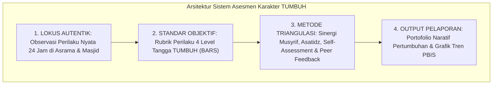

# P2-05-05-Sintesis-Assessment-Principles-TUMBUH

## Tujuan
Menyintesiskan seluruh prinsip asesmen karakter santri (*Assessment Principles*)—mencakup Asesmen Autentik, Rubrik Perilaku Objektif, Triangulasi 360 Derajat, dan Portofolio Formatif—ke dalam satu sistem evaluasi karakter yang adil, valid, dan memuliakan santri.

---

## 1. Arsitektur Sintesis Asesmen Karakter TUMBUH

---

## 2. Matriks Uji Validitas & Keadilan Asesmen

| Prinsip Asesmen | Bentuk Cacat Lama di Pesantren | Standar Solusi Mutlak TUMBUH |
| :--- | :--- | :--- |
| **Autentisitas** | Tes tertulis adab di atas kertas yang tidak mencerminkan perilaku asli. | Observasi langsung di kehidupan asrama dan interaksi komunal 24 jam. |
| **Objektivitas** | Nilai rapor adab berbasis prasangka subjektif (*Like/Dislike*). | Rubrik terukur berbasis indikator tindakan nyata (*Behaviorally Anchored*). |
| **Triangulasi** | Vonis hukuman sepihak dari satu laporan tanpa tabayyun. | Konfirmasi silang data dari 4 sudut pandang (Musyrif, Guru, Diri, Teman). |
| **Formatif** | Rapor hanya berupa angka akhir semester tanpa solusi perbaikan. | Portofolio naratif berkala yang menjadi panduan tumbuh bersama orang tua. |

---

## 3. Status Dokumen
* **Status**: ✅ **SELESAI (Status Mutu: A+)**
* **Level**: Subproject Induk
* **Project**: `02 Principles`
* **Subproject**: `05 Assessment Principles`
* **Langkah Berikutnya**: Melanjutkan ke sub-domain berikutnya: **`06 Intervention Principles`**.
