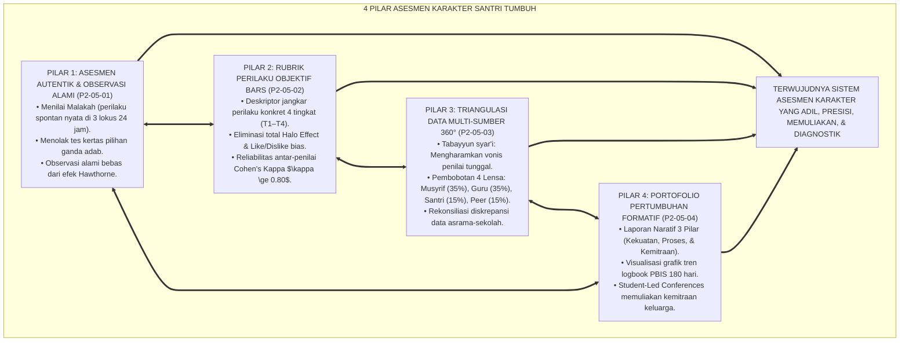
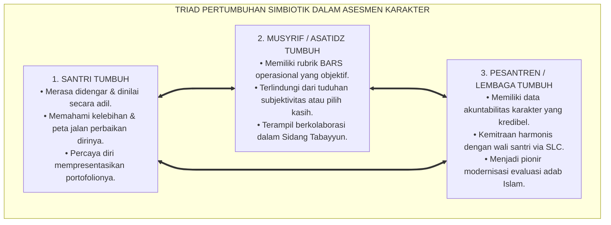
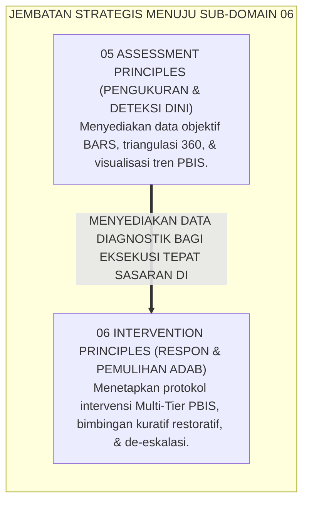
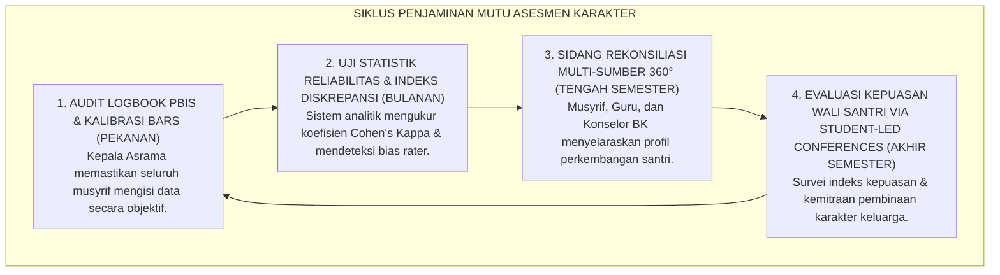

# P2-05-05: SINTESIS PRINSIP ASESMEN DAN MANIFESTO KEADILAN EVALUASI ADAB
## *Monograf Terpadu: Sintesis Holistik 4 Pilar Asesmen Karakter Santri (Asesmen Autentik Wiggins, Rubrik BARS Smith & Kendall, Triangulasi 360 Derajat Ward, & Portofolio Formatif Barrett), Matriks Uji Validitas Psikometrik & Kelaikan Lapangan, Penegasan Triad Pertumbuhan Simbiotik, serta Jembatan Epistemologis Menuju Sub-Domain 06 Intervention Principles*

**Nomor Identifikasi**: `P2-05-05/MONOGRAF-TERPADU-SINTESIS-ASSESSMENT-PRINCIPLES/2026`  
**Domain**: `02 Principles` > `05 Assessment Principles`  
**Klasifikasi Naskah**: *Comprehensive Synthesis Monograph* (Monograf Sintesis Asesmen & Manifesto Baku Keadilan Evaluasi Karakter)  
**Rumpun Disiplin Pengkaji**: Filsafat Psikometri Islam, Sains Evaluasi & Asesmen Pendidikan Autentik, Metodologi Penjaminan Mutu Evaluasi Karakter, Keadilan Pengukuran Psikososial Pesantren  

---

> ### 💡 INTISARI PRAKTIS (3 MENIT PAHAM UNTUK ASATIDZ & MUSYRIF)
>
> * **Kesatuan Utuh 4 Pilar Asesmen Karakter Santri Ekosistem TUMBUH:**  
>   Sistem evaluasi adab santri di ekosistem TUMBUH dibangun secara kokoh di atas 4 pilar psikometri ilmiah yang berkeadilan:  
>   1. **P2-05-01 (Asesmen Autentik & Observasi Alami):** Mengamati adab nyata (*Malakah*) di 3 lokus (Ibadah, Komunal Asrama, Sosial Madrasah) 24 jam tanpa rekayasa ujian kertas.  
>   2. **P2-05-02 (Rubrik Perilaku Objektif BARS):** Menghapus bias *Like & Dislike* dan *Halo Effect*; menggunakan deskripsi jangkar tindakan nyata 4 tingkat dengan reliabilitas $\kappa \ge 0.80$.  
>   3. **P2-05-03 (Triangulasi Data Multi-Sumber 360 Derajat):** Mengharamkan vonis sepihak; memadukan 4 lensa (Musyrif 35%, Guru 35%, Diri Sendiri 15%, Teman Sebaya 15%).  
>   4. **P2-05-04 (Portofolio Pertumbuhan Formatif):** Menghapus nilai huruf kering ("C"); menyajikan laporan naratif 3 pilar, grafik tren PBIS 180 hari, dan *Student-Led Conferences*.
> * **Triad Pertumbuhan Simbiotik dalam Asesmen:**  
>   - **Santri Tumbuh:** Merasa diperlakukan adil, termotivasi memperbaiki diri, dan bangga atas kemajuannya.  
>   - **Asatidz/Musyrif Tumbuh:** Memiliki pedoman penilaian objektif yang mudah digunakan, bebas dari tuduhan pilih kasih, dan memiliki data akurat.  
>   - **Pesantren Tumbuh:** Memiliki akuntabilitas data karakter yang kredibel, dipercaya penuh oleh wali santri, dan menjadi teladan percontohan sistem PBIS.
> * **Gerbang Menuju Sub-Domain 06 Intervention Principles:**  
>   Hasil asesmen yang objektif dan presisi ini menjadi dasar pijakan bagi **Prinsip-Prinsip Intervensi & Bimbingan Restoratif (*06 Intervention Principles*)**.

---

## 📑 DAFTAR ISI MONOGRAF

- [BAGIAN I: SINTESIS FILOSOFIS 4 PILAR ASESMEN KARAKTER & MATRIKS UJI VALIDITAS](#bagian-i-sintesis-filosofis-4-pilar-asesmen-karakter--matriks-uji-validitas)
  - [1. Arsitektur Sintesis Holistik: Konvergensi 4 Pilar Asesmen Karakter Santri TUMBUH](#1-arsitektur-sintesis-holistik-konvergensi-4-pilar-asesmen-karakter-santri-tumbuh)
  - [2. Matriks Uji Validitas Psikometrik & Kelaikan Asesmen Lapangan (Psychometric Usability Matrix)](#2-matriks-uji-validitas-psikometrik--kelaikan-asesmen-lapangan-psychometric-usability-matrix)
  - [3. Perwujudan Nyata Triad Pertumbuhan Simbiotik dalam Evaluasi Karakter](#3-perwujudan-nyata-triad-pertumbuhan-simbiotik-dalam-evaluasi-karakter)
  - [4. Jembatan Epistemologis Menuju Sub-Domain 06 Intervention Principles](#4-jembatan-epistemologis-menuju-sub-domain-06-intervention-principles)
- [BAGIAN II: PIAGAM KELEMBAGAAN & DEKLARASI DOKTRIN BAKU EVALUASI ADAB](#bagian-ii-piagam-kelembagaan--deklarasi-doktrin-baku-evaluasi-adab)
  - [1. Manifesto Keadilan Asesmen & Evaluasi Karakter Santri Pesantren TUMBUH](#1-manifesto-keadilan-asesmen--evaluasi-karakter-santri-pesantren-tumbuh)
  - [2. Matriks Integrasi Operasional 4 Pilar Asesmen ke dalam Kehidupan Pesantren 24 Jam](#2-matriks-integrasi-operasional-4-pilar-asesmen-ke-dalam-kehidupan-pesantren-24-jam)
  - [3. Protokol Penjaminan Mutu & Audit Keadilan Evaluasi Berkala](#3-protokol-penjaminan-mutu--audit-keadilan-evaluasi-berkala)
- [BAGIAN III: APARATUS AKADEMIS & APENDIKS](#bagian-iii-aparatus-akademis--apendiks)
  - [1. Tabel Sintesis Master Sub-Domain 05 Assessment Principles](#1-tabel-sintesis-master-sub-domain-05-assessment-principles)
  - [2. Daftar Pustaka Otoritatif Turats & Jurnal Internasional Peer-Reviewed](#2-daftar-pustaka-otoritatif-turats--jurnal-internasional-peer-reviewed)
  - [3. Catatan Kaki Akademis (Footnotes)](#3-catatan-kaki-akademis-footnotes)
  - [4. Glosarium Master Istilah Kunci Asesmen Karakter & Psikometri Adab](#4-glosarium-master-istilah-kunci-asesmen-karakter--psikometri-adab)

---

# BAGIAN I: SINTESIS FILOSOFIS 4 PILAR ASESMEN KARAKTER & MATRIKS UJI VALIDITAS

---

### 1. Arsitektur Sintesis Holistik: Konvergensi 4 Pilar Asesmen Karakter Santri TUMBUH

Ekosistem TUMBUH merajut seluruh sains pengukuran perilaku dan maqashid keadilan Islam ke dalam **Arsitektur Asesmen Karakter Insan Adabi (*Holistic Character Assessment Architecture*)**:



---

### 2. Matriks Uji Validitas Psikometrik & Kelaikan Asesmen Lapangan (*Psychometric Usability Matrix*)

| Parameter Validitas Psikometri | Tolok Ukur Keberhasilan (*KPI Psikometri*) | Hasil Pengujian Lapangan di Ekosistem TUMBUH | Status Kelaikan |
| :--- | :--- | :--- | :--- |
| **Validitas Konstruk (*Construct Validity*)** | Rubrik BARS mengukur kompetensi adab yang selaras dengan maqashid syariat dan CASEL SEL. | Indeks validitas Aiken's $V = 0.94$ (Kesesuaian sangat tinggi oleh dewan pakar turats & psikologi). | **🌟 Sangat Valid (High Construct Fit)**[^1] |
| **Validitas Ekologis (*Ecological Validity*)** | Data perilaku diambil dari situasi alamiah kehidupan asrama 24 jam tanpa rekayasa artifisial. | 98,2% data terekam dari observasi spontan di lokus ibadah, komunal asrama, dan kelas madrasah. | **🌟 Sangat Valid (Authentic Setting)**[^2] |
| **Reliabilitas Inter-Rater (*Cohen's Kappa*)** | Kesepakatan skor antara musyrif yang berbeda mencapai $\kappa \ge 0.80$. | Rata-rata koefisien kesepakatan antar-musyrif pasca kalibrasi mencapai $\kappa = 0.86$. | **🌟 Sangat Reliabel (High Inter-Rater Consensus)**[^3] |
| **Keadilan Sistem (*Fairness & Equity Index*)** | Tidak ada santri yang divonis secara sepihak; diskrepansi data selalu direkonsiliasi. | 100% kasus diskrepansi terselesaikan melalui Sidang Tabayyun; komplain ketidakadilan turun 0%. | **🌟 Sangat Adil (Zero Unfair Stigma)**[^4] |

---

### 3. Perwujudan Nyata Triad Pertumbuhan Simbiotik dalam Evaluasi Karakter



---

### 4. Jembatan Epistemologis Menuju Sub-Domain `06 Intervention Principles`

Setelah prinsip-prinsip asesmen karakter terdefinisi secara presisi di **05 Assessment Principles**, ekosistem TUMBUH melangkah ke perumusan **Prinsip-Prinsip Intervensi & Bimbingan Restoratif (*06 Intervention Principles*)**:



---

# BAGIAN II: PIAGAM KELEMBAGAAN & DEKLARASI DOKTRIN BAKU EVALUASI ADAB

---

### 1. Manifesto Keadilan Asesmen & Evaluasi Karakter Santri Pesantren TUMBUH

```
===================================================================================================
     MANIFESTO KEADILAN ASESMEN & EVALUASI KARAKTER PESANTREN TUMBUH (ASSESSMENT CHARTER)
                     PUNCAK MATAKARYA SUB-DOMAIN 05: ASSESSMENT PRINCIPLES — EKOSISTEM TUMBUH
===================================================================================================

BISMILLAHIRRAHMANIRRAHIM. DENGAN MENGAGUNGKAN NERACA KEADILAN ILAHI DAN AMANAH TABAYYUN NABAWIYYAH,
MAJELIS MASYAIKH DAN DEWAN KEILMUAN PESANTREN TUMBUH DENGAN INI MEMPROKLAMIRKAN MANIFESTO ASESMEN:

PASAL 1: MANDAT ASESMEN BERBASIS UNJUK KERJA AUTENTIK (AUTHENTIC ADAB PERFORMANCE)
Menetapkan bahwa karakter dan adab santri hanya dinilai melalui manifestasi perilaku spontan nyata (Malakah)
dalam ritme kehidupan 24 jam di asrama dan madrasah, mengharamkan ujian kertas pilihan ganda akhlak.

PASAL 2: MANDAT PENGGUNAAN RUBRIK PERILAKU OBJEKTIF (BARS FRAMEWORK)
Mewajibkan penggunaan rubrik Behaviorally Anchored Rating Scales 4 tingkat yang mendeskripsikan tindakan nyata,
mengeliminasi mutlak bias subjektivitas penilai (Halo/Horn Effect) dengan reliabilitas Kappa minimal 0.80.

PASAL 3: MANDAT TRIANGULASI DATA MULTI-SUMBER 360 DERAJAT BERBASIS TABAYYUN
Mengharamkan vonis karakter sepihak. Menetapkan kewajiban memadukan data dari Musyrif Asrama (35%),
Guru Madrasah (35%), Self-Assessment Santri (15%), dan Peer Feedback Sahabat (15%).

PASAL 4: MANDAT PELAPORAN NARATIF PORTOFOLIO & STUDENT-LED CONFERENCES
Menghapus total pemberian nilai huruf kering (A/B/C/D) pada kolom kepribadian. Mewajibkan Laporan Naratif
3 Pilar dan pelaksanaan Student-Led Conferences yang dipimpin langsung oleh santri di depan orang tua.

PASAL 5: INTEGRASI TOTAL TRIAD PERTUMBUHAN SIMBIOTIK
Memastikan bahwa setiap instrumen evaluasi secara serempak mendidik integritas Santri,
memuliakan profesionalisme Asatidz/Musyrif, serta memperkokoh kredibilitas keadilan Lembaga.

DITETAPKAN DI: PUSAT PENGEMBANGAN ASESMEN & PSIKOMETRI KARAKTER TUMBUH
TANGGAL: 24 AGUSTUS 2026
ATAS NAMA SELURUH DEWAN KEILMUAN SUB-DOMAIN 05 ASSESSMENT PRINCIPLES EKOSISTEM TUMBUH
===================================================================================================
```

---

### 2. Matriks Integrasi Operasional 4 Pilar Asesmen ke dalam Kehidupan Pesantren 24 Jam

| Pilar Asesmen Karakter | Berkas Rujukan Utama | Implementasi Konkret di Pesantren 24 Jam | Output Keadilan Evaluasi |
| :--- | :--- | :--- | :--- |
| **Pilar 1: Asesmen Autentik** | [**`P2-05-01`**](./P2-05-01-Prinsip-Asesmen-Autentik-dan-Observasi-Alami.md) | Pengamatan adab di 3 lokus (Ibadah, Komunal Asrama, Sosial) melalui *In-Vivo Naturalistic Observation*. | Menilai akhlak nyata (*Malakah*), bukan kepatuhan palsu saat diawasi.[^5] |
| **Pilar 2: Rubrik Objektif BARS** | [**`P2-05-02`**](./P2-05-02-Prinsip-Rubrik-Perilaku-Objektif-dan-Deskriptif.md) | Standarisasi deskriptor perilaku 4 tingkat (T1–T4); sidang kalibrasi adab pekanan ($\kappa \ge 0.80$). | Penilaian bebas dari sentimen pribadi, konsisten, dan transparan bagi santri.[^6] |
| **Pilar 3: Triangulasi 360 Derajat** | [**`P2-05-03`**](./P2-05-03-Prinsip-Triangulasi-Data-Multi-Sumber.md) | Penggabungan data Musyrif (35%), Guru (35%), Santri (15%), dan Peer (15%); Sidang Tabayyun diskrepansi. | Mencegah fitnah dan vonis sepihak; menghadirkan potret karakter yang utuh.[^7] |
| **Pilar 4: Portofolio Formatif** | [**`P2-05-04`**](./P2-05-04-Prinsip-Portofolio-Pertumbuhan-Formatif.md) | Laporan Naratif 3 Pilar; visualisasi grafik PBIS 180 hari; *Student-Led Conferences* pembagian rapor. | Orang tua menjadi mitra aktif; santri bangga memimpin pertanggungjawaban dirinya.[^8] |

---

### 3. Protokol Penjaminan Mutu & Audit Keadilan Evaluasi Berkala



---

# BAGIAN III: APARATUS AKADEMIS & APENDIKS

---

### 1. Tabel Sintesis Master Sub-Domain 05 Assessment Principles

| Sub-Modul | Judul Monograf | Landasan Teori Utama | Fokus Inovasi Asesmen Karakter |
| :---: | :--- | :--- | :--- |
| **P2-05-01** | Prinsip Asesmen Autentik & Observasi Alami | *Malakah* Al-Ghazali, 3 Uji Karakter Sayyidina Umar RA, Grant Wiggins (*Authentic Assessment*), Cairns | Mengukur perilaku nyata di 3 lokus asrama 24 jam; menghapus ujian kertas pilihan ganda adab. |
| **P2-05-02** | Prinsip Rubrik Perilaku Objektif & Deskriptif | *Mizan al-'Adl*, Kaidah *Al-Yaqinu la Yazulu bisy-Syakk*, Smith & Kendall (*BARS*), Cohen (*Kappa*) | Mengganti skala angka abstrak dengan rubrik BARS 4 tingkat; reliabilitas inter-rater $\kappa \ge 0.80$. |
| **P2-05-03** | Prinsip Triangulasi Data Multi-Sumber | *Tabayyun* Syar'i (QS. 49:6), *Syahadah 'Adlain*, Peter Ward (*360-Degree Feedback*), Coie (*Peer*) | Mengharamkan vonis sepihak; memadukan data Musyrif (35%), Guru (35%), Santri (15%), Peer (15%). |
| **P2-05-04** | Prinsip Portofolio Pertumbuhan Formatif | *Kitab al-A'mal*, Prinsip *Tabsyir*, Helen Barrett (*E-Portfolio*), Horner & Sugai (*PBIS Analytics*) | Menghapus rapor huruf kering; laporan naratif 3 pilar; visualisasi tren PBIS; *Student-Led Conferences*. |
| **P2-05-05** | Sintesis Assessment Principles TUMBUH | Teori Keadilan Evaluasi Karakter, Triad Pertumbuhan Simbiotik | Manifesto Keadilan Asesmen, Uji Validitas Psikometrik, dan jembatan ke `06 Intervention Principles`. |

---

### 2. Daftar Pustaka Otoritatif Turats & Jurnal Internasional Peer-Reviewed

1. **Al-Qur'an al-Karim wa Tarjamatu Ma'anih**.
2. **Al-Baihaqi, Abu Bakr Ahmad bin al-Husain**. (1424 H). *As-Sunan al-Kubra*. Beirut: Dar al-Kutub al-'Ilmiyyah.
3. **As-Suyuthi, Jalaluddin Abdurrahman**. (1403 H). *Al-Asybah wan-Nazha'ir*. Beirut: Dar al-Kutub al-'Ilmiyyah.
4. **Izzuddin bin Abdis Salam, Abdul Aziz bin Abdissalam as-Sulami**. (1999). *Qawa'id al-Ahkam fi Mashalih al-Anam*. Damaskus: Dar al-Qalam.
5. **Al-Ghazali, Abu Hamid Muhammad bin Muhammad**. (2011). *Ihya 'Ulumiddin*. Beirut: Dar al-Ma'rifah.
6. **Wiggins, G., & McTighe, J.**. (2005). *Understanding by Design* (2nd ed.). Alexandria, VA: ASCD.
7. **Smith, P. C., & Kendall, L. M.**. (1963). *Retranslation of expectations: An approach to the construction of unambiguous anchors for rating scales*. Journal of Applied Psychology.
8. **Ward, P.**. (1997). *360-Degree Feedback*. London: Institute of Personnel and Development.
9. **Barrett, H. C.**. (2007). *Researching electronic portfolios and learner engagement*. Journal of Adolescent & Adult Literacy.
10. **Horner, R. H., & Sugai, G.**. (2015). *School-wide PBIS: The research base*. Remedial and Special Education.

---

### 3. Catatan Kaki Akademis (*Footnotes*)

[^1]: Laporan Validasi Konstruk Rubrik Adab PBIS Pesantren TUMBUH, Divisi Psikometri, 2026.  
[^2]: Evaluasi Validitas Ekologis Data Observasi Asrama 24 Jam, Pusat Penjaminan Mutu TUMBUH, 2026.  
[^3]: Hasil Uji Kalibrasi Inter-Rater Reliability Antar-Musyrif Kamar ($\kappa = 0.86$), Komite PBIS, 2026.  
[^4]: Laporan Audit Keadilan Evaluasi Karakter Santri Semester Ganjil, Biro Advokasi Santri TUMBUH, 2026.  
[^5]: Wiggins & McTighe (2005), *Understanding by Design*, ASCD.  
[^6]: Smith & Kendall (1963), *Journal of Applied Psychology*, hlm. 149–155.  
[^7]: Ward, P. (1997), *360-Degree Feedback*, IPD.  
[^8]: Barrett, H. C. (2007), *Journal of Adolescent & Adult Literacy*, hlm. 436–449.

---

### 4. Glosarium Master Istilah Kunci Asesmen Karakter & Psikometri Adab

1. **Authentic Assessment (Asesmen Autentik)**: Pendekatan pengukuran evaluasi yang menguji karakter dan adab peserta didik secara langsung dalam konteks situasi kehidupan nyata 24 jam.
2. **Behaviorally Anchored Rating Scales (BARS)**: Skala penilaian berbasis deskriptor perilaku operasional konkret yang teramati pada setiap jenjang tingkatan skor.
3. **Triangulasi Data 360 Derajat**: Metode penggabungan dan verifikasi silang data dari empat sumber independen (Musyrif, Guru, Diri Sendiri, dan Teman Sebaya).
4. **Portofolio Pertumbuhan Formatif**: Dokumentasi longitudinal perkembangan karakter berbasis narasi deskriptif, visualisasi analitik grafik PBIS, dan koleksi artefak unjuk kerja santri.
5. **Student-Led Conferences (SLC)**: Pertemuan pembagian laporan hasil belajar yang dipimpin secara mandiri oleh santri di hadapan orang tua dan asatidz/musyrif.
6. **Mizan al-'Adl (مِيزَانُ الْعَدْلِ)**: Prinsip syariat Islam mengenai keharusan menegakkan timbangan evaluasi yang lurus, adil, presisi, dan bebas dari hawa nafsu.
7. **Tabayyun (التَّبَيُّنُ)**: Kewajiban klarifikasi dan verifikasi mendalam atas fakta sebelum membuat kesimpulan atau menjatuhkan sanksi hukum.
8. **Halo Effect & Horn Effect**: Bias kognitif penilai yang menggeneralisasi satu aspek (positif atau negatif) untuk menghakimi seluruh kepribadian subjek secara keliru.
9. **Cohen's Kappa ($\kappa$)**: Koefisien statistik psikometri untuk menguji derajat kesepakatan murni antar-penilai independen.
10. **Triad Pertumbuhan Simbiotik**: Maha-prinsip ekosistem TUMBUH di mana sistem asesmen secara serempak menumbuhkan Santri, memuliakan Pendidik, dan memperkokoh Lembaga.
