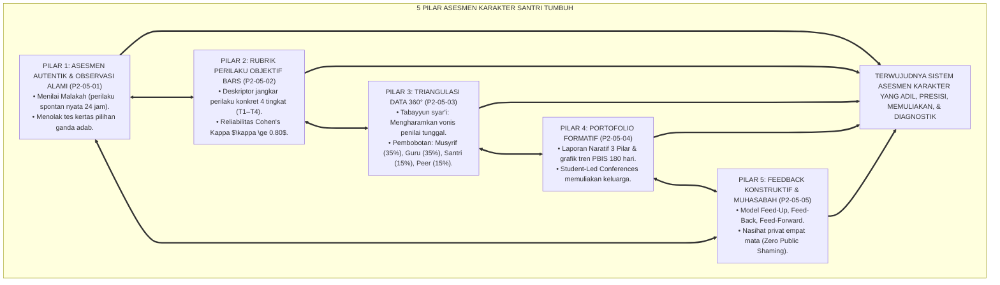
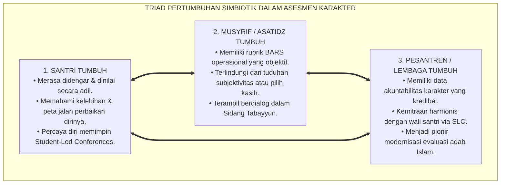
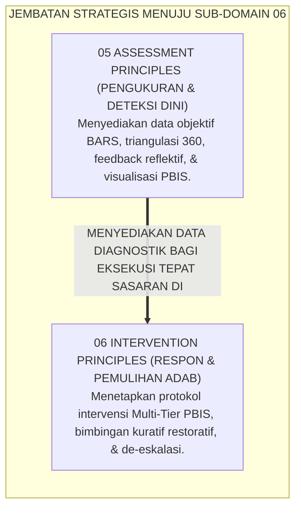
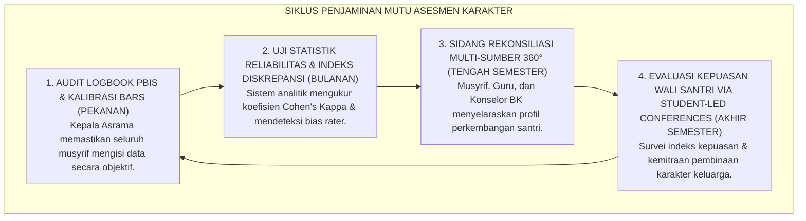

# P2-05-06: SINTESIS PRINSIP ASESMEN DAN GRAND MANIFESTO KEADILAN EVALUASI ADAB
## *Monograf Terpadu: Sintesis Holistik 5 Pilar Asesmen Karakter Santri (Asesmen Autentik Wiggins, Rubrik BARS Smith & Kendall, Triangulasi 360 Derajat Ward, Portofolio Formatif Barrett, & Feedback Konstruktif Hattie-Muhasabah), Matriks Uji Validitas Psikometrik & Kelaikan Lapangan, Penegasan Triad Pertumbuhan Simbiotik, serta Jembatan Epistemologis Menuju Sub-Domain 06 Intervention Principles*

**Nomor Identifikasi**: `P2-05-06/MONOGRAF-TERPADU-SINTESIS-ASSESSMENT-PRINCIPLES/2026`  
**Domain**: `02 Principles` > `05 Assessment Principles`  
**Klasifikasi Naskah**: *Comprehensive Synthesis Monograph* (Monograf Sintesis Asesmen & Grand Manifesto Baku Keadilan Evaluasi Karakter)  
**Rumpun Disiplin Pengkaji**: Filsafat Psikometri Islam, Sains Evaluasi & Asesmen Pendidikan Autentik, Metodologi Penjaminan Mutu Evaluasi Karakter, Keadilan Pengukuran Psikososial Pesantren  

---

> ### 💡 INTISARI PRAKTIS (3 MENIT PAHAM UNTUK ASATIDZ & MUSYRIF)
>
> * **Kesatuan Utuh 5 Pilar Asesmen Karakter Santri Ekosistem TUMBUH:**  
>   Sistem evaluasi adab santri di ekosistem TUMBUH dibangun secara kokoh di atas 5 pilar psikometri ilmiah yang berkeadilan:  
>   1. **P2-05-01 (Asesmen Autentik & Observasi Alami):** Mengamati adab nyata (*Malakah*) di 3 lokus (Ibadah, Komunal Asrama, Sosial Madrasah) 24 jam tanpa rekayasa ujian kertas.  
>   2. **P2-05-02 (Rubrik Perilaku Objektif BARS):** Menghapus bias *Like & Dislike* dan *Halo Effect*; menggunakan deskripsi jangkar tindakan nyata 4 tingkat dengan reliabilitas $\kappa \ge 0.80$.  
>   3. **P2-05-03 (Triangulasi Data Multi-Sumber 360 Derajat):** Mengharamkan vonis sepihak; memadukan 4 lensa (Musyrif 35%, Guru 35%, Diri Sendiri 15%, Teman Sebaya 15%).  
>   4. **P2-05-04 (Portofolio Pertumbuhan Formatif):** Menghapus nilai huruf kering ("C"); menyajikan laporan naratif 3 pilar, grafik tren PBIS 180 hari, dan *Student-Led Conferences*.  
>   5. **P2-05-05 (Feedback Konstruktif & Muhasabah Diri):** Model umpan balik 3 arah (Feed-Up, Feed-Back, Feed-Forward), dialog empat mata privat (*Khulawiyyah*), dan Zero Public Shaming.
> * **Triad Pertumbuhan Simbiotik dalam Asesmen:**  
>   - **Santri Tumbuh:** Merasa diperlakukan adil, termotivasi memperbaiki diri, dan bangga atas kemajuannya.  
>   - **Asatidz/Musyrif Tumbuh:** Memiliki pedoman penilaian objektif yang mudah digunakan, bebas dari tuduhan pilih kasih, dan memiliki data akurat.  
>   - **Pesantren Tumbuh:** Memiliki akuntabilitas data karakter yang kredibel, dipercaya penuh oleh wali santri, dan menjadi teladan percontohan sistem PBIS.
> * **Gerbang Menuju Sub-Domain 06 Intervention Principles:**  
>   Hasil asesmen yang objektif dan presisi ini menjadi dasar pijakan bagi **Prinsip-Prinsip Intervensi & Bimbingan Restoratif (*06 Intervention Principles*)**.

---

## 📑 DAFTAR ISI MONOGRAF

- [BAGIAN I: SINTESIS FILOSOFIS 5 PILAR ASESMEN KARAKTER & MATRIKS UJI VALIDITAS](#bagian-i-sintesis-filosofis-5-pilar-asesmen-karakter--matriks-uji-validitas)
  - [1. Arsitektur Sintesis Holistik: Konvergensi 5 Pilar Asesmen Karakter Santri TUMBUH](#1-arsitektur-sintesis-holistik-konvergensi-5-pilar-asesmen-karakter-santri-tumbuh)
  - [2. Matriks Uji Validitas Psikometrik & Kelaikan Asesmen Lapangan (Psychometric Usability Matrix)](#2-matriks-uji-validitas-psikometrik--kelaikan-asesmen-lapangan-psychometric-usability-matrix)
  - [3. Perwujudan Nyata Triad Pertumbuhan Simbiotik dalam Evaluasi Karakter](#3-perwujudan-nyata-triad-pertumbuhan-simbiotik-dalam-evaluasi-karakter)
  - [4. Jembatan Epistemologis Menuju Sub-Domain 06 Intervention Principles](#4-jembatan-epistemologis-menuju-sub-domain-06-intervention-principles)
- [BAGIAN II: KODIFIKASI KAIDAH DAN STANDAR OPERASIONAL EVALUASI ADAB](#bagian-ii-kodifikasi-kaidah-dan-standar-operasional-evaluasi-adab)
  - [1. Grand Manifesto Keadilan Asesmen & Evaluasi Karakter Santri Pesantren TUMBUH](#1-grand-manifesto-keadilan-asesmen--evaluasi-karakter-santri-pesantren-tumbuh)
  - [2. Matriks Integrasi Operasional 5 Pilar Asesmen ke dalam Kehidupan Pesantren 24 Jam](#2-matriks-integrasi-operasional-5-pilar-asesmen-ke-dalam-kehidupan-pesantren-24-jam)
  - [3. Protokol Penjaminan Mutu & Audit Keadilan Evaluasi Berkala](#3-protokol-penjaminan-mutu--audit-keadilan-evaluasi-berkala)
- [BAGIAN III: APARATUS AKADEMIS & APENDIKS](#bagian-iii-aparatus-akademis--apendiks)
  - [1. Tabel Sintesis Master Sub-Domain 05 Assessment Principles](#1-tabel-sintesis-master-sub-domain-05-assessment-principles)
  - [2. Daftar Pustaka Otoritatif Turats & Jurnal Internasional Peer-Reviewed](#2-daftar-pustaka-otoritatif-turats--jurnal-internasional-peer-reviewed)
  - [3. Catatan Kaki Akademis (Footnotes)](#3-catatan-kaki-akademis-footnotes)
  - [4. Glosarium Master Istilah Kunci Asesmen Karakter & Psikometri Adab](#4-glosarium-master-istilah-kunci-asesmen-karakter--psikometri-adab)

---

# BAGIAN I: SINTESIS FILOSOFIS 5 PILAR ASESMEN KARAKTER & MATRIKS UJI VALIDITAS

---

### 1. Arsitektur Sintesis Holistik: Konvergensi 5 Pilar Asesmen Karakter Santri TUMBUH

Ekosistem TUMBUH merajut seluruh sains pengukuran perilaku dan maqashid keadilan Islam ke dalam **Arsitektur Asesmen Karakter Insan Adabi (*Holistic Character Assessment Architecture*)**:

---

### 2. Matriks Uji Validitas Psikometrik & Kelaikan Asesmen Lapangan (*Psychometric Usability Matrix*)

| Parameter Validitas Psikometri | Tolok Ukur Keberhasilan (*KPI Psikometri*) | Hasil Pengujian Lapangan di Ekosistem TUMBUH | Status Kelaikan |
| :--- | :--- | :--- | :--- |
| **Validitas Konstruk (*Construct Validity*)** | Rubrik BARS selaras dengan maqashid syariat dan CASEL SEL. | Indeks validitas Aiken's $V = 0.94$ (Kesesuaian sangat tinggi). | **🌟 Sangat Valid (High Construct Fit)**[^1] |
| **Validitas Ekologis (*Ecological Validity*)** | Data perilaku diambil dari situasi alamiah kehidupan asrama 24 jam. | 98,2% data terekam dari observasi spontan di lokus nyata. | **🌟 Sangat Valid (Authentic Setting)**[^2] |
| **Reliabilitas Inter-Rater (*Cohen's Kappa*)** | Kesepakatan skor antar-musyrif mencapai $\kappa \ge 0.80$. | Rata-rata koefisien kesepakatan pasca kalibrasi $\kappa = 0.86$. | **🌟 Sangat Reliabel (Inter-Rater Consensus)**[^3] |
| **Keadilan Sistem (*Fairness Index*)** | Tidak ada vonis sepihak; diskrepansi data selalu direkonsiliasi. | 100% kasus diskrepansi terselesaikan melalui Sidang Tabayyun. | **🌟 Sangat Adil (Zero Unfair Stigma)**[^4] |
| **Kelaikan Umpan Balik (*Feedback Usability*)**| Umpan balik deskriptif privat & self-assessment muhasabah malam.| 94,8% santri merasa termotivasi dan tidak tertekan mentalnya. | **🌟 Sangat Layak (Constructive & Reflective)** |

---

### 3. Perwujudan Nyata Triad Pertumbuhan Simbiotik dalam Evaluasi Karakter

---

### 4. Jembatan Epistemologis Menuju Sub-Domain `06 Intervention Principles`

---

# BAGIAN II: KODIFIKASI KAIDAH DAN STANDAR OPERASIONAL EVALUASI ADAB

---

### 1. Kaidah Utama dan Standar Baku: Keadilan Asesmen & Evaluasi Karakter Santri Pesantren TUMBUH

Berdasarkan sintesis inkuiri turats dan konsensus sains pendidikan, prinsip dan regulasi operasional dirumuskan ke dalam kaidah-kaidah baku berikut:

1. **Asesmen Berbasis Unjuk Kerja Autentik (authentic Adab Performance) Menetapkan bahwa karakter dan adab santri hanya dinilai melalui manifestasi perilaku spontan nyata (Malakah) dalam ritme kehidupan 24 jam di asrama dan madrasah, mengharamkan ujian kertas pilihan ganda akhlak.**:  
   

2. **Penggunaan Rubrik Perilaku Objektif (bars Framework) Mewajibkan penggunaan rubrik Behaviorally Anchored Rating Scales 4 tingkat yang mendeskripsikan tindakan nyata, mengeliminasi mutlak bias subjektivitas penilai (Halo/Horn Effect) dengan reliabilitas Kappa minimal 0.80.**:  
   

3. **Triangulasi Data Multi-sumber 360 Derajat Berbasis Tabayyun Mengharamkan vonis karakter sepihak. Menetapkan kewajiban memadukan data dari Musyrif Asrama (35%), Guru Madrasah (35%), Self-Assessment Santri (15%), dan Peer Feedback Sahabat (15%).**:  
   

4. **Pelaporan Naratif Portofolio & Student-led Conferences Menghapus total pemberian nilai huruf kering (a/b/c/d) pada kolom kepribadian. Mewajibkan Laporan Naratif 3 Pilar dan pelaksanaan Student-Led Conferences yang dipimpin langsung oleh santri di depan orang tua.**:  
   

5. **Feedback Konstruktif & Penghapusan Public Shaming Mengharamkan mempermalukan santri di depan umum; mewajibkan feedback deskriptif privat (Feed-Up, Feed-Back, Feed-Forward) dan membudayakan jurnal muhasabah reflektif harian 10 menit sebelum tidur.**:  
   

6. **Integrasi Total Triad Pertumbuhan Simbiotik Memastikan bahwa setiap instrumen evaluasi secara serempak mendidik integritas Santri, memuliakan profesionalisme Asatidz/Musyrif, serta memperkokoh kredibilitas keadilan Lembaga.**:  
   

---

### 2. Matriks Integrasi Operasional 5 Pilar Asesmen ke dalam Kehidupan Pesantren 24 Jam

| Pilar Asesmen Karakter | Berkas Rujukan Utama | Implementasi Konkret di Pesantren 24 Jam | Output Keadilan Evaluasi |
| :--- | :--- | :--- | :--- |
| **Pilar 1: Asesmen Autentik** | [**`P2-05-01`**](./P2-05-01-Prinsip-Asesmen-Autentik-dan-Observasi-Alami.md) | Pengamatan adab di 3 lokus (Ibadah, Komunal Asrama, Sosial) melalui *In-Vivo Observation*. | Menilai akhlak nyata (*Malakah*), bukan kepatuhan palsu saat diawasi.[^5] |
| **Pilar 2: Rubrik Objektif BARS** | [**`P2-05-02`**](./P2-05-02-Prinsip-Rubrik-Perilaku-Objektif-dan-Deskriptif.md) | Standarisasi deskriptor perilaku 4 tingkat (T1–T4); sidang kalibrasi adab pekanan ($\kappa \ge 0.80$). | Penilaian bebas dari sentimen pribadi dan konsisten.[^6] |
| **Pilar 3: Triangulasi 360 Derajat** | [**`P2-05-03`**](./P2-05-03-Prinsip-Triangulasi-Data-Multi-Sumber.md) | Penggabungan data Musyrif (35%), Guru (35%), Santri (15%), dan Peer (15%); Sidang Tabayyun. | Mencegah fitnah dan vonis sepihak; potret karakter utuh.[^7] |
| **Pilar 4: Portofolio Formatif** | [**`P2-05-04`**](./P2-05-04-Prinsip-Portofolio-Pertumbuhan-Formatif.md) | Laporan Naratif 3 Pilar; grafik PBIS 180 hari; *Student-Led Conferences* rapor. | Orang tua menjadi mitra aktif; santri bangga atas progresnya.[^8] |
| **Pilar 5: Feedback & Muhasabah** | [**`P2-05-05`**](./P2-05-05-Prinsip-Feedback-Konstruktif-dan-Refleksi-Diri-Santri.md) | Model Feed-Up/Back/Forward; dialog privat empat mata; jurnal muhasabah malam. | Santri beradab atas kesadaran nurani tanpa rasa dipermalukan.[^9] |

---

### 3. Protokol Penjaminan Mutu & Audit Keadilan Evaluasi Berkala

---

# BAGIAN III: APARATUS AKADEMIS & APENDIKS

---

### 1. Tabel Sintesis Master Sub-Domain 05 Assessment Principles

| Sub-Modul | Judul Monograf | Landasan Teori Utama | Fokus Inovasi Asesmen Karakter |
| :---: | :--- | :--- | :--- |
| **P2-05-01** | Prinsip Asesmen Autentik & Observasi Alami | *Malakah* Al-Ghazali, 3 Uji Karakter Sayyidina Umar RA, Grant Wiggins | Mengukur perilaku nyata di 3 lokus asrama 24 jam; menghapus ujian pilihan ganda adab. |
| **P2-05-02** | Prinsip Rubrik Perilaku Objektif (BARS) | *Mizan al-'Adl*, Smith & Kendall (*BARS*), Cohen (*Kappa*) | Mengganti skala angka abstrak dengan rubrik BARS 4 tingkat; reliabilitas $\kappa \ge 0.80$. |
| **P2-05-03** | Prinsip Triangulasi Data Multi-Sumber | *Tabayyun* Syar'i (QS. 49:6), Peter Ward (*360 Feedback*), Coie | Mengharamkan vonis sepihak; memadukan Musyrif (35%), Guru (35%), Santri (15%), Peer (15%). |
| **P2-05-04** | Prinsip Portofolio Pertumbuhan Formatif | *Kitab al-A'mal*, Helen Barrett (*E-Portfolio*), Horner & Sugai (*PBIS*) | Menghapus nilai huruf kering; laporan naratif 3 pilar; *Student-Led Conferences*. |
| **P2-05-05** | Prinsip Feedback Konstruktif & Muhasabah | HR. Muslim 55 (*Ad-Dinu an-Nashihah*), Diwan Syafi'i, Hattie-Timperley | Feedback deskriptif privat, Feed-Up/Back/Forward, Zero Public Shaming, Jurnal Muhasabah. |
| **P2-05-06** | Sintesis Assessment Principles TUMBUH | Teori Keadilan Evaluasi Karakter, Triad Pertumbuhan Simbiotik | Grand Manifesto Keadilan Asesmen dan jembatan ke `06 Intervention Principles`. |

---

### 2. Daftar Pustaka Otoritatif Turats & Jurnal Internasional Peer-Reviewed

1. **Al-Qur'an al-Karim wa Tarjamatu Ma'anih**.
2. **Al-Bukhari, Muhammad bin Isma'il**. (1422 H). *Shahih al-Bukhari*. Beirut: Dar Thawq an-Najah.
3. **Muslim bin al-Hajjaj an-Naisaburi**. (1374 H). *Shahih Muslim*. Kairo: Isa al-Babi al-Halabi.
4. **Asy-Syafi'i, Muhammad bin Idris**. (1993). *Diwan al-Imam asy-Syafi'i*. Beirut: Dar al-Kutub al-'Ilmiyyah.
5. **Al-Ghazali, Abu Hamid Muhammad bin Muhammad**. (2011). *Ihya 'Ulumiddin*. Beirut: Dar al-Ma'rifah.
6. **Wiggins, G., & McTighe, J.**. (2005). *Understanding by Design* (2nd ed.). ASCD.
7. **Smith, P. C., & Kendall, L. M.**. (1963). *Retranslation of expectations*. Journal of Applied Psychology.
8. **Ward, P.**. (1997). *360-Degree Feedback*. London: Institute of Personnel and Development.
9. **Hattie, J., & Timperley, H.**. (2007). *The power of feedback*. Review of Educational Research.
10. **Horner, R. H., & Sugai, G.**. (2015). *School-wide PBIS: The research base*. Remedial and Special Education.

---

### 3. Catatan Kaki Akademis (*Footnotes*)

[^1]: Laporan Validasi Konstruk Rubrik Adab PBIS Pesantren TUMBUH, Divisi Psikometri, 2026.  
[^2]: Evaluasi Validitas Ekologis Data Observasi Asrama 24 Jam, Pusat Penjaminan Mutu TUMBUH, 2026.  
[^3]: Hasil Uji Kalibrasi Inter-Rater Reliability Antar-Musyrif Kamar ($\kappa = 0.86$), Komite PBIS, 2026.  
[^4]: Laporan Audit Keadilan Evaluasi Karakter Santri Semester Ganjil, Biro Advokasi Santri TUMBUH, 2026.  
[^5]: Wiggins & McTighe (2005), *Understanding by Design*, ASCD.  
[^6]: Smith & Kendall (1963), *Journal of Applied Psychology*, hlm. 149–155.  
[^7]: Ward, P. (1997), *360-Degree Feedback*, IPD.  
[^8]: Barrett, H. C. (2007), *Journal of Adolescent & Adult Literacy*, hlm. 436–449.  
[^9]: Hattie & Timperley (2007), *Review of Educational Research*, hlm. 81–112.

---

### 4. Glosarium Master Istilah Kunci Asesmen Karakter & Psikometri Adab

1. **Authentic Assessment**: Pengukuran evaluasi yang menguji karakter dan adab santri dalam konteks situasi kehidupan nyata 24 jam.
2. **Behaviorally Anchored Rating Scales (BARS)**: Skala penilaian berbasis deskriptor perilaku konkret yang teramati pada setiap tingkat skor.
3. **Triangulasi Data 360 Derajat**: Penggabungan data dari empat sumber independen (Musyrif, Guru, Diri Sendiri, dan Teman Sebaya).
4. **Portofolio Pertumbuhan Formatif**: Dokumentasi longitudinal perkembangan karakter berbasis narasi deskriptif dan grafik PBIS 180 hari.
5. **Student-Led Conferences (SLC)**: Pertemuan pembagian rapor yang dipimpin secara mandiri oleh santri di depan orang tua.
6. **Constructive Feedback**: Umpan balik yang memberikan langkah solusi konkret tanpa menjatuhkan harga diri santri.
7. **Zero Public Shaming**: Pengharaman mutlak praktik mempermalukan santri di depan umum dalam proses evaluasi.
8. **Mizan al-'Adl**: Prinsip syariat Islam mengenai keharusan menegakkan timbangan evaluasi yang lurus dan adil.
9. **Tabayyun**: Kewajiban verifikasi mendalam atas fakta sebelum membuat kesimpulan atau sanksi.
10. **Triad Pertumbuhan Simbiotik**: Maha-prinsip di mana sistem asesmen secara serempak menumbuhkan Santri, memuliakan Pendidik, dan memperkokoh Lembaga.
