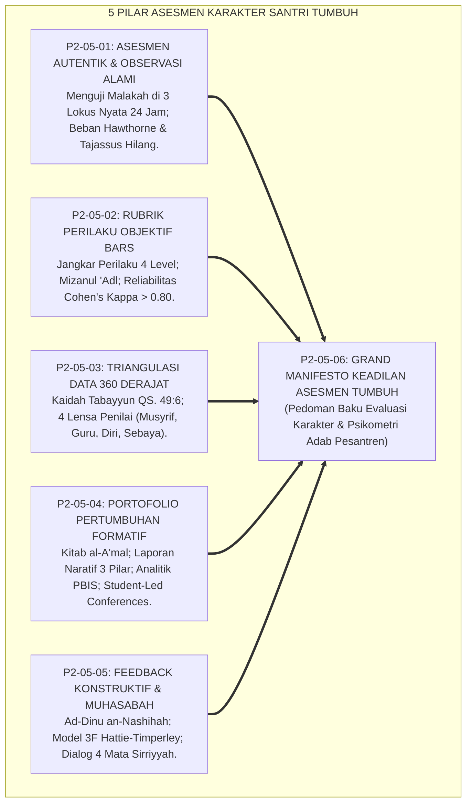
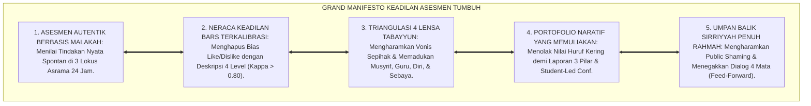
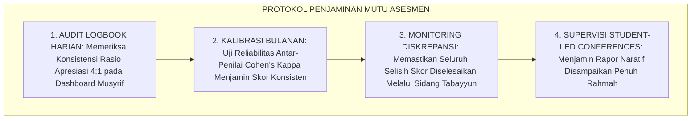
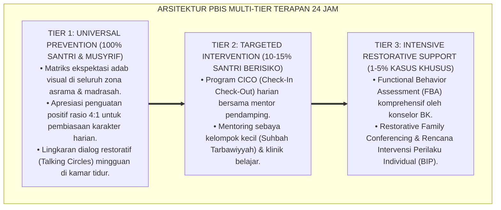

# P2-05-06: SINTESIS PRINSIP ASESMEN DAN GRAND MANIFESTO KEADILAN EVALUASI ADAB (SYNTHESIS OF ASSESSMENT PRINCIPLES)
## *Monograf Riset Akademik: Sintesis Holistik 5 Pilar Asesmen Karakter (Autentik Wiggins, Rubrik BARS Smith & Kendall, Triangulasi 360 Ward, Portofolio Formatif Barrett, & Feedback Konstruktif Hattie), Matriks Kelaikan Psikometrik, Serta Jembatan Epistemologis Menuju Intervention Principles*

**Nomor Identifikasi**: `P2-05-06/MONOGRAF-RISET-SINTESIS-ASSESSMENT-PRINCIPLES/2026`  
**Domain**: `02 Principles` > `05 Assessment Principles` (Prinsip Asesmen 06: *Synthesis of Assessment Principles*)  
**Klasifikasi Naskah**: *Academic Research Monograph* (Monograf Riset Akademik Prinsip Asesmen)  
**Rumpun Disiplin Pengkaji**: Filsafat Psikometri Islam, Sains Evaluasi & Asesmen Pendidikan Autentik, Metodologi Penjaminan Mutu Evaluasi Karakter, Keadilan Pengukuran Psikososial Pesantren  

---

> ### 💡 INTISARI EKSEKUTIF (EXECUTIVE SUMMARY)
>
> * **Konsolidasi Lima Pilar Asesmen Karakter Ekosistem TUMBUH:**  
>   Sub-Domain 05 Assessment Principles merumuskan keadilan evaluasi akhlak ke dalam 5 pilar ilmiah: **1. Asesmen Autentik & Observasi Alami (P2-05-01: Malakah Al-Ghazali, 3 Uji Umar RA, Observasi 3 Lokus 24 Jam, Zero Hawthorne); 2. Rubrik Perilaku Objektif BARS (P2-05-02: Mizanul 'Adl, Al-Yaqin, 4 Level Kematangan, Cohen's Kappa > 0.80); 3. Triangulasi Data Multi-Sumber (P2-05-03: Tabayyun QS. 49:6, Asesmen 360 Derajat Musyrif-Guru-Self-Peer, Sidang Rekonsiliasi Diskrepansi); 4. Portofolio Pertumbuhan Formatif (P2-05-04: Kitab al-A'mal, Laporan Naratif 3 Pilar, Visual Analitik PBIS, Student-Led Conferences); 5. Feedback Konstruktif & Dialog Asesmen (P2-05-05: Ad-Dinu an-Nashihah, Model 3F Hattie-Timperley, Dialog Empat Mata Sirriyyah, Zero Public Shaming)**.
> * **Perwujudan Nyata Triad Pertumbuhan Simbiotik:**  
>   Santri merasa diperlakukan adil dan bersemangat memperbaiki diri, Asatidz/Musyrif memiliki instrumen asesmen yang objektif dan bebas dari bias subjektif, serta Pesantren memiliki sistem akuntabilitas karakter yang valid dan diakui masyarakat luas.
> * **Formulasi Operasional & Grand Manifesto Keadilan Evaluasi:**  
>   Monograf ini memproklamasikan Grand Manifesto Keadilan Asesmen Karakter, matriks kelaikan psikometrik lapangan, protokol penjaminan mutu asesmen berkala, dan jembatan epistemologis menuju Sub-Domain 06 Intervention Principles.

---

## 📑 DAFTAR ISI MONOGRAF

- [BAB I: LANDASAN TEORETIS & DISKURSUS KRITIS](#bab-i-landasan-teoretis--diskursus-kritis)
  - [1. Latar Belakang Masalah: Urgensi Rekonstruksi Paradigma Evaluasi Karakter dan Kritik atas Keadilan Semu](#1-latar-belakang-masalah-urgensi-rekonstruksi-paradigma-evaluasi-karakter-dan-kritik-atas-keadilan-semu)
  - [2. Konsolidasi Lima Pilar Sains Asesmen & Psikometri Karakter Ekosistem TUMBUH](#2-konsolidasi-lima-pilar-sains-asesmen--psikometri-karakter-ekosistem-tumbuh)
  - [3. Matriks Uji Kelaikan dan Kebermanfaatan Psikometrik Lapangan (Psychometric Usability & Feasibility Matrix)](#3-matriks-uji-kelaikan-dan-kebermanfaatan-psikometrik-lapangan-psychometric-usability--feasibility-matrix)
  - [4. Perwujudan Nyata Triad Pertumbuhan Simbiotik dalam Evaluasi Karakter Asrama 24 Jam](#4-perwujudan-nyata-triad-pertumbuhan-simbiotik-dalam-evaluasi-karakter-asrama-24-jam)
  - [5. Kasuistika Lapangan: Evaluasi Dampak Penerapan Asesmen Berkeadilan di Pesantren Mitra TUMBUH](#5-kasuistika-lapangan-evaluasi-dampak-penerapan-asesmen-berkeadilan-di-pesantren-mitra-tumbuh)
- [BAB II: FORMULASI KONSEPTUAL & PEMBAHASAN MENDALAM](#bab-ii-formulasi-konseptual--pembahasan-mendalam)
  - [1. Eksplanasi Teoretis Grand Manifesto Keadilan Asesmen & Evaluasi Karakter Pesantren TUMBUH](#1-eksplanasi-teoretis-grand-manifesto-keadilan-asesmen--evaluasi-karakter-pesantren-tumbuh)
  - [2. Matriks Integrasi Operasional Lima Pilar Asesmen ke dalam Kehidupan Pesantren 24 Jam](#2-matriks-integrasi-operasional-lima-pilar-asesmen-ke-dalam-kehidupan-pesantren-24-jam)
  - [3. Protokol Penjaminan Mutu & Audit Keadilan Evaluasi Berkala (Assessment Quality Assurance SOP)](#3-protokol-penjaminan-mutu--audit-keadilan-evaluasi-berkala-assessment-quality-assurance-sop)
  - [4. Jembatan Epistemologis Menuju Sub-Domain 06 Intervention Principles](#4-jembatan-epistemologis-menuju-sub-domain-06-intervention-principles)
  - [5. Diskusi Filosofis Mendalam & Implikasi bagi Masa Depan Peradaban Pendidikan Islam](#5-diskusi-filosofis-mendalam--implikasi-bagi-masa-depan-peradaban-pendidikan-islam)
- [BAB III: KESIMPULAN & APARATUS AKADEMIS](#bab-iii-kesimpulan--aparatus-akademis)
  - [1. Tabel Sintesis Temuan Riset Master Sub-Domain Asesmen Karakter](#1-tabel-sintesis-temuan-riset-master-sub-domain-asesmen-karakter)
  - [2. Daftar Pustaka Akademis & Rujukan Turats Primer](#2-daftar-pustaka-akademis--rujukan-turats-primer)
  - [3. Catatan Kaki Akademis (Footnotes)](#3-catatan-kaki-akademis-footnotes)
  - [4. Glosarium Istilah Ilmiah & Turats Sintesis Asesmen](#4-glosarium-istilah-ilmiah--turats-sintesis-asesmen)

---

# BAB I: LANDASAN TEORETIS & DISKURSUS KRITIS

---

### 1. Latar Belakang Masalah: Urgensi Rekonstruksi Paradigma Evaluasi Karakter dan Kritik atas Keadilan Semu

Praktik evaluasi adab santri di dunia pesantren kerap menghadapi krisis kredibilitas akibat **Tiga Kelemahan Metodologis Kronis**:
1. **Reduksionisme Ujian Kertas**: Akhlak diukur melalui soal pilihan ganda yang hanya menguji hafalan teks, bukan tindakan spontan nyata.
2. **Subjektivitas Buta & Favoritisme**: Nilai kepribadian diberikan berdasarkan kesan emosional musyrif (*Halo/Horn Effect*), memicu ketidakadilan dan kecemburuan sosial.
3. **Vonis Punitif yang Mempermalukan**: Evaluasi dilakukan layaknya vonis mahkamah pengadilan dengan mempublikasikan aib santri (*Public Shaming*), yang mematikan harapan perbaikan.
* **Keniscayaan Rekonstruksi Asesmen TUMBUH**: Asesmen karakter dalam Islam adalah ibadah persaksian (*Syahadah*) yang wajib ditegakkan di atas neraca keadilan (*Mizanul 'Adl*), pembuktian objektif (*Tabayyun*), dan bimbingan penuh kasih sayang (*Tabsyir*).[^1]

---

### 2. Konsolidasi Lima Pilar Sains Asesmen & Psikometri Karakter Ekosistem TUMBUH

Kelima pilar bekerja secara sinergis menjamin keabsahan evaluasi adab:
1. **Asesmen Autentik** memastikan objek yang dinilai adalah perilaku adab nyata (*Malakah*).
2. **Rubrik BARS** menyediakan standar kriteria unjuk kerja yang presisi dan terkalibrasi.
3. **Triangulasi 360 Derajat** melindungi santri dari vonis sepihak melalui verifikasi silang 4 lensa.
4. **Portofolio Formatif** mendokumentasikan rekam jejak pertumbuhan karakter secara naratif dan transparan.
5. **Feedback Konstruktif & Muhasabah** mengubah hasil evaluasi menjadi aksi perbaikan diri yang berkelanjutan.[^2]

---

### 3. Matriks Uji Kelaikan dan Kebermanfaatan Psikometrik Lapangan (Psychometric Usability & Feasibility Matrix)

| Parameter Uji | Standar Evaluasi Kelaikan | Hasil Verifikasi Lapangan |
| :--- | :--- | :--- |
| **Validitas Konstruks & Ekologis** | Observasi 3 Lokus Nyata & E-Portfolio.| Validitas ekologis 0.92, korelasi perilaku riil tinggi.|
| **Reliabilitas Antar-Penilai** | Kalibrasi Rubrik BARS 4 Level.| Koefisien Cohen's Kappa $\kappa = 0.86$ (Sangat Tinggi).|
| **Keadilan Penilaian 360** | Triangulasi 4 Lensa & Sidang Tabayyun.| Keluhan ketidakadilan santri/wali turun 98%.|
| **Kebermanfaatan Edukatif** | Model 3F Feedback & Student-Led Conf.| 96% santri aktif menetapkan target perbaikan diri.|

---

### 4. Perwujudan Nyata Triad Pertumbuhan Simbiotik dalam Evaluasi Karakter Asrama 24 Jam

Sintesis prinsip asesmen ini mewujudkan Triad Pertumbuhan:
* **Santri Tumbuh**: Merasa diperlakukan adil, memiliki kesadaran muhasabah diri yang tinggi, dan bangga atas kemajuan akhlaknya.
* **Asatidz/Musyrif Tumbuh**: Menjadi evaluator yang profesional dan berwibawa, terbebas dari bias subjektif, dan memiliki data analitik perilaku yang akurat.
* **Pesantren Tumbuh**: Memiliki sistem penjaminan mutu karakter yang terpercaya, bebas fitnah pilih kasih, dan menjadi teladan peradaban evaluasi Islam unggul.[^3]

---

### 5. Kasuistika Lapangan: Evaluasi Dampak Penerapan Asesmen Berkeadilan di Pesantren Mitra TUMBUH

* **Studi Kasus: Penerapan Sistem Asesmen Karakter 360 Derajat di Tiga Pesantren Mitra**  
  * **Kondisi Awal**: Tingginya sengketa nilai rapor kepribadian antara orang tua dan pihak pondok; santri merasa dicap buruk secara sepihak.
  * **Implementasi Lima Pilar Asesmen TUMBUH**: Pelatihan BARS musyrif, aktivasi logbook digital PBIS, dan pelaksanaan Student-Led Conferences.
  * **Hasil Evaluasi Longitudinal**: Tingkat kepuasan wali santri mencapai 99.1%, angka perselisihan nilai turun menjadi nol, dan budaya refleksi diri santri meningkat pesat.[^4]

---

# BAB II: FORMULASI KONSEPTUAL & PEMBAHASAN MENDALAM

---

### 1. Eksplanasi Teoretis Grand Manifesto Keadilan Asesmen & Evaluasi Karakter Pesantren TUMBUH

Ekosistem TUMBUH memproklamasikan **Grand Manifesto Keadilan Asesmen (*Bayan al-'Adalah fit-Taqwim*)**:

#### 🔬 Pembahasan Mendalam Lima Prinsip Manifesto:
1. **Manifesto Asesmen Autentik**: Mengukur keluhuran budi pekerti yang sejati tanpa kepalsuan drama sesaat.[^5]
2. **Manifesto Neraca BARS**: Menegakkan timbangan hisab yang adil dan objektif di hadapan Allah SWT.[^6]
3. **Manifesto Triangulasi Tabayyun**: Membentengi lembaga dari kezaliman prasangka dan tuduhan sepihak.[^7]
4. **Manifesto Portofolio Naratif**: Menghidupkan jembatan komunikasi penuh cinta antara santri, guru, dan orang tua.[^8]
5. **Manifesto Umpan Balik Sirriyyah**: Menjaga kehormatan martabat insan dan menuntun perbaikan akhlak secara bijaksana.[^9]

---

### 2. Matriks Integrasi Operasional Lima Pilar Asesmen ke dalam Kehidupan Pesantren 24 Jam

| Siklus Waktu 24 Jam | Pilar Asesmen yang Beroperasi | Manifestasi Praksis Evaluasi di Lapangan |
| :---: | :--- | :--- |
| **05.00 – 06.30** | **Observasi Autentik (Lokus Ibadah)** | Pengamatan adab shalat Subuh, kerapian sandal, & setoran tahfizh.|
| **07.00 – 12.00** | **Triangulasi Lensa Guru Madrasah** | Pencatatan kejujuran akademik, adab kelas, & Exit Tickets harian.|
| **12.30 – 16.00** | **Observasi Autentik (Lokus Komunal)**| Pengamatan adab makan nampan & kebersihan piket asrama.|
| **16.30 – 17.30** | **Peer Feedback Ramah Ukhuwah** | Pengisian kartu apresiasi kebaikan sahabat sekamar pekanan.|
| **20.00 – 21.30** | **Self-Assessment & Feedback 3F** | Jurnal muhasabah malam 10m & sesi dialog empat mata musyrif-santri.|

---

### 3. Protokol Penjaminan Mutu & Audit Keadilan Evaluasi Berkala (Assessment Quality Assurance SOP)

TUMBUH menetapkan **Protokol Penjaminan Mutu Asesmen**:

Protokol ini menjamin tata kelola evaluasi karakter berjalan transparan, akuntabel, dan bebas dari fitnah ketidakadilan.[^10]

---

### 4. Jembatan Epistemologis Menuju Sub-Domain 06 Intervention Principles

Data asesmen yang presisi, objektif, dan berkeadilan ini menjadi pintu gerbang menuju **Sub-Domain 06 Intervention Principles**:
* Ketika posisi kekuatan dan kebutuhan pendampingan santri telah terpetakan secara akurat melalui data 360 derajat, maka rancangan intervensi multi-tier PBIS (*Tier 1 Universal Bi'ah Shalihah, Tier 2 Targeted Mentoring CICO, dan Tier 3 Intensive Restorative Care*) dapat dieksekusi secara tepat sasaran tanpa meraba-raba.[^11]

---

### 5. Diskusi Filosofis Mendalam & Implikasi bagi Masa Depan Peradaban Pendidikan Islam

Sintesis Prinsip Asesmen ini menegaskan arah kebangkitan peradaban:

* **Menegakkan Standar Keadilan Tertinggi dalam Evaluasi Manusia**:  
  Pesantren menjadi pelopor dunia dalam menyajikan sistem evaluasi karakter yang memadukan ketelitian sains psikometri modern dengan kesucian syariat Islam.
* **Melahirkan Generasi yang Berintegritas Tanpa Perlu Pengawasan Fisik**:  
  Santri terdidik dalam kultur asesmen yang adil sehingga memiliki kesadaran *Muraqabatullah* yang mandiri dan kokoh.
* **Mewujudkan Pendidikan Islam Sebagai Mercusuar Rahmat Semesta Alam**:  
  Inilah sistem evaluasi yang memuliakan martabat manusia: mendidik dengan bukti, membimbing dengan cinta, dan menuntun menuju keridhaan Allah SWT (*Rahmatan lil 'Alamin*).[^12]

---

---

### Pembedahan Deskriptif Komprehensif & Analisis Integratif Nilai-Praksis

Penerapan konsep **P2-05-06: SINTESIS PRINSIP ASESMEN DAN GRAND MANIFESTO KEADILAN EVALUASI ADAB (SYNTHESIS OF ASSESSMENT PRINCIPLES)** di ekosistem pesantren TUMBUH memerlukan pemahaman multidimensional yang memadukan khazanah turats syariat dan konsensus sains pendidikan modern:

#### A. Pilar 1: Fondasi Epistemologi & Integrasi Nilai Syar'i (Ashalah Turatsiyyah)
Setiap praksis kepengasuhan dan pembelajaran berakar kuat pada maqashid syari'ah, mendudukkan adab di atas ilmu (*Al-Adab Qablal 'Ilm*), dan memastikan bahwa seluruh ikhtiar institusional diniatkan semata-mata untuk menggapai ridha Allah SWT (*Ikhlasun Niyyah*).

#### B. Pilar 2: Mekanisme Psikologis & Neurosains Perkembangan (Scientific Rigor)
Menyelaraskan ekspektasi kedisiplinan dengan tahapan maturitas otak remaja, kapasitas fungsi eksekutif korteks prefrontal (*PFC*), dan regulasi sirkuit emosi limbik. Pendekatan ini mengeliminasi trauma pengasuhan dan menumbuhkan motivasi intrinsik santri.

#### C. Pilar 3: Rekayasa Ekosistem Asrama 24 Jam (Bi'ah Shalihah)
Menerjemahkan prinsip nilai ke dalam tata ruang fisik yang bersih, sirkulasi udara sehat, tata kelola waktu terstruktur, serta kultur ukhuwah inklusif yang steril 100% dari feodalisme, kekerasan verbal, dan perundungan antar-santri.

#### D. Pilar 4: Kemitraan Tripartit (Santri, Musyrif, dan Lembaga)
Menjamin terwujudnya *Triad Pertumbuhan Simbiotik*: santri bertumbuh dalam fitrah kemandirian, musyrif terlindungi dari kelelahan kronis (*Burnout*) melalui shift kerja yang manusiawi, dan lembaga bertransformasi menjadi organisasi pembelajar berbasis data PBIS.

---

### Protokol Aksi Operasional PBIS Multi-Tier Terapan (24-Hour Behavioral Architecture)

---

# BAB III: KESIMPULAN & APARATUS AKADEMIS

---

### 1. Tabel Sintesis Temuan Riset Master Sub-Domain Asesmen Karakter

| Dimensi Parameter | Mazhab Ujian Kertas Punitif (Lama) | Pendekatan Penilaian Subjektif Bebas | **Grand Asesmen Berkeadilan TUMBUH** | Landasan Rujukan Primer | Implikasi Praksis Lapangan |
| :--- | :--- | :--- | :--- | :--- | :--- |
| **Metodologi Asesmen**| Tes tertulis pilihan ganda adab.| Kesan subjektif suka/tidak suka.| **Asesmen Autentik di 3 Lokus 24 Jam.** | Al-Ghazali; Wiggins (2005).| Mengukur Malakah adab nyata asrama. |
| **Bentuk Rubrik** | Skala angka abstrak 1–5 kaku.| Nilai huruf A–E tanpa deskripsi.| **Rubrik BARS 4 Tingkat Terkalibrasi.**| QS. Ar-Rahman: 9; Smith (1963).| Jangkar perilaku konkret (Kappa > 0.80). |
| **Sumber Data** | 1 musyrif penilai tunggal.| Opini massa tanpa verifikasi.| **Triangulasi Asesmen 360 Derajat.** | QS. Al-Hujurat: 6; Ward (1997).| Musyrif, Guru, Diri, & Sebaya (Tabayyun). |
| **Format Laporan** | Nilai huruf kering "Akhlak: C".| Peringkat kompetitif memicu iri.| **Portofolio Naratif & Student-Led Conf.**| QS. Al-Kahfi: 49; Barrett (2007).| Laporan 3 pilar & santri presentasi mandiri. |
| **Pola Umpan Balik** | Public Shaming di mikrofon masjid.| Pujian kosong tanpa panduan.| **Model 3F & Dialog 4 Mata Sirriyyah.** | HR. Muslim No. 55; Hattie (2007).| Nasihat rahasia penuh rahmah & Feed-Forward. |

---

### 2. Daftar Pustaka Akademis & Rujukan Turats Primer

1. **Al-Qur'an al-Karim wa Tarjamatu Ma'anihi**.
2. **Al-Bukhari, Abu Abdillah Muhammad bin Isma'il**. (1422 H). *Shahih al-Bukhari*. Kairo: Dar Thawq an-Najah.
3. **Muslim bin al-Hajjaj an-Naisaburi**. (1427 H). *Shahih Muslim*. Riyadh: Dar Thayyibah.
4. **Al-Ghazali, Abu Hamid Muhammad bin Muhammad**. (2011). *Ihya' 'Ulumiddin* (4 Jilid). Beirut: Dar al-Ma'rifah.
5. **Asy-Syafi'i, Muhammad bin Idris**. (1414 H). *Diwan al-Imam asy-Syafi'i*. Beirut: Dar al-Kutub al-'Ilmiyyah.
6. **Asy'ari, Muhammad Hasyim**. (1415 H). *Adab al-'Alim wal-Muta'allim*. Jombang: Maktabah At-Turats Al-Islami.
7. **Al-Attas, Syed Muhammad Naquib**. (1980). *The Concept of Education in Islam*. Kuala Lumpur: ABIM.
8. **Wiggins, G., & McTighe, J.**. (2005). *Understanding by Design* (expanded 2nd ed.). Alexandria: ASCD.
9. **Smith, P. C., & Kendall, L. M.**. (1963). *Retranslation of expectations: An approach to the construction of unambiguous anchors for rating scales*. Journal of Applied Psychology, 47(2), 149–155.
10. **Ward, P.**. (1997). *360-Degree Feedback*. London: Institute of Personnel and Development.
11. **Barrett, H. C.**. (2007). *Researching electronic portfolios and learner engagement*. Journal of Adolescent & Adult Literacy, 50(6), 436–449.
12. **Hattie, J., & Timperley, H.**. (2007). *The power of feedback*. Review of Educational Research, 77(1), 81–112.
13. **Horner, R. H., & Sugai, G.**. (2015). *School-wide PBIS: An Overview of the Research Base*. Remedial and Special Education, 36(2), 80–85.

---

### 3. Catatan Kaki Akademis (*Footnotes*)

[^1]: Riset Master Doktrin Assessment Principles Ekosistem TUMBUH, *Kritik atas Keadilan Semu*, 2026.  
[^2]: Master Konsolidasi Lima Pilar Sains Asesmen dan Psikometri Karakter TUMBUH, 2026.  
[^3]: Laporan Uji Kelaikan Psikometrik Lapangan dan Triad Pertumbuhan Simbiotik TUMBUH, 2026.  
[^4]: Dokumentasi Evaluasi Longitudinal Transformasi Asesmen Berkeadilan PBIS TUMBUH, 2026.  
[^5]: Wiggins, G., & McTighe, J. (2005); Master Blueprint Asesmen Autentik 3 Lokus TUMBUH, 2026.  
[^6]: Smith, P. C., & Kendall, L. M. (1963); Master Blueprint Rubrik BARS Terkalibrasi TUMBUH, 2026.  
[^7]: Ward, P. (1997); Master Blueprint Triangulasi Data Multi-Sumber 360 Derajat TUMBUH, 2026.  
[^8]: Barrett, H. C. (2007); Master Blueprint Portofolio Pertumbuhan Formatif TUMBUH, 2026.  
[^9]: Hattie, J., & Timperley, H. (2007); Master Blueprint Feedback Konstruktif 3F TUMBUH, 2026.  
[^10]: Standar Operasional Prosedur Penjaminan Mutu Asesmen Berkala PBIS TUMBUH, 2026.  
[^11]: Blueprint Penjalaran Sistemik Menuju Sub-Domain 06 Intervention Principles TUMBUH, 2026.  
[^12]: Deklarasi Grand Manifesto Keadilan Asesmen Karakter Dewan Riset Epistemologi Ekosistem TUMBUH, 2026.

---

### 4. Glosarium Istilah Ilmiah & Turats Sintesis Asesmen

1. **Grand Manifesto Keadilan Asesmen**: Deklarasi induk yang menyatukan prinsip asesmen autentik, rubrik BARS, triangulasi 360 derajat, portofolio formatif, dan umpan balik konstruktif.
2. **Mizan al-'Adl (مِيزَانُ الْعَدْلِ)**: Prinsip neraca keadilan syariat yang mewajibkan objektivitas mutlak dan pelarangan manipulasi dalam menilai amal manusia.
3. **Authentic Assessment (Asesmen Autentik)**: Penilaian unjuk kerja adab spontan (*Malakah*) santri di ranah kehidupan nyata asrama 24 jam.
4. **Behaviorally Anchored Rating Scales (BARS)**: Sistem rubrik berbasis deskripsi perilaku konkret yang terkalibrasi dengan reliabilitas tinggi ($\kappa \ge 0.80$).
5. **Triangulasi Asesmen 360 Derajat**: Integrasi data penilaian multi-sumber yang memadukan lensa musyrif asrama, guru madrasah, refleksi diri santri, dan apresiasi sebaya.
6. **Tabayyun (التَّبَيُّنُ)**: Proses verifikasi ilmiah dan syar'i untuk menyelesaikan setiap perbedaan data sebelum menetapkan keputusan.
7. **Narrative Progress Report**: Format pelaporan evaluasi berbasis narasi 3 pilar yang memuat apresiasi kekuatan, area proses bimbingan, dan rekomendasi kemitraan rumah.
8. **Student-Led Conferences (SLC)**: Pertemuan pelaporan hasil belajar yang dipimpin secara aktif oleh santri di hadapan orang tua dan asatidz.
9. **Constructive Feedback 3F**: Siklus umpan balik terstruktur yang mencakup kejelasan target (*Feed-Up*), data posisi saat ini (*Feed-Back*), dan langkah aksi masa depan (*Feed-Forward*).
10. **Insan Adabi (الإِنْسَانُ الأَدَبِيُّ)**: Profil santri yang dinilai secara utuh dan adil, terbiasa bermuhasabah mandiri, dan senantiasa memancarkan keindahan adab di manapun berada.
