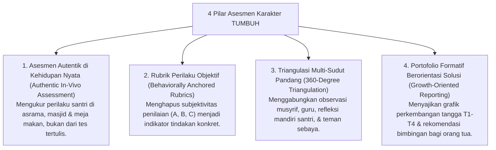

# P2-05-Prinsip-Asesmen-Karakter-TUMBUH (Assessment Principles Induk)

## Tujuan
Menetapkan prinsip-prinsip metodologis pengukuran karakter (*Character Assessment Principles*) yang adil, objektif, autentik, dan berorientasi pada pemulihan (*Growth-Oriented Assessment*), mengubah paradigma rapor pesantren dari sekadar penghakiman angka menjadi peta navigasi pertumbuhan santri.

---

## 1. 4 Pilar Prinsip Asesmen Karakter TUMBUH

---

## 2. Rincian 4 Pilar Asesmen

### 1. Asesmen Autentik di Kehidupan Nyata (*Authentic Assessment*)
* Adab santri tidak diuji melalui lembar soal pilihan ganda di atas kertas (*Pencil-and-Paper Test*).
* Asesmen dilakukan melalui pengamatan alami (*Naturalistic Observation*) atas bagaimana santri merespon instruksi, mengantre wudhu, merapikan kasur, dan menyelesaikan perselisihan dengan teman sekamarnya.

### 2. Rubrik Perilaku Objektif & Terdeskripsi (*Behaviorally Anchored*)
* Menghapus pemberian nilai adab yang kabur (*"Santri ini nilainya B karena sering membuat kesal"*).
* Nilai digantikan dengan level capaian deskriptif: *"Tingkat 2: Mampu merapikan tempat tidur secara mandiri, namun masih membutuhkan 1x pengingat untuk tiba tepat waktu di sholat maghrib."*

### 3. Triangulasi Multi-Sudut Pandang (*360-Degree Triangulation*)
* Menghindari bias persepsi satu orang pembina.
* Mengintegrasikan: (1) Catatan musyrif asrama, (2) Pengamatan guru kelas, (3) Lembar muhasabah diri santri (*Self-Assessment*), dan (4) Dinamika ukhuwah kamar (*Peer Observation*).

### 4. Pelaporan Portofolio Pertumbuhan (*Growth-Oriented Reporting*)
* Rapor karakter disajikan dalam bentuk narasi perkembangan dan grafik tren harian PBIS, memberikan apresiasi atas setiap kemajuan santri dan merumuskan rencana aksi bersama orang tua.

---

## 3. Status Dokumen
* **Status**: 🌟 **A+ (Dokumen Induk Assessment Principles)**
* **Level**: Project 2 - `02 Principles / 05 Assessment Principles`
* **Langkah Berikutnya**: **`P2-05-01-Prinsip-Asesmen-Autentik-dan-Observasi-Alami.md`**.
