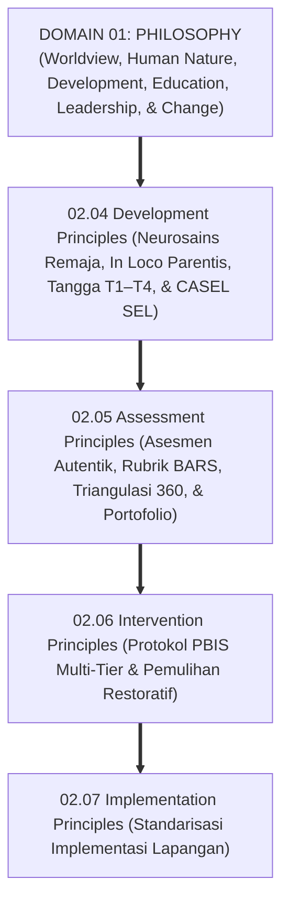
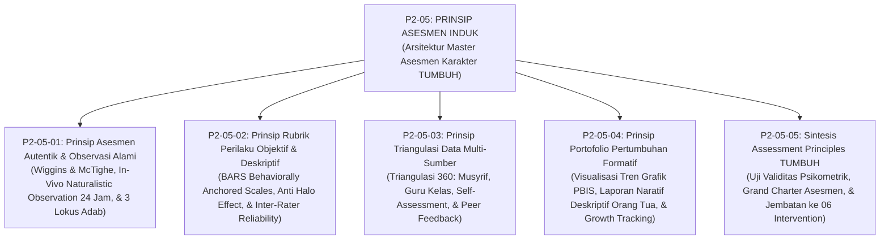
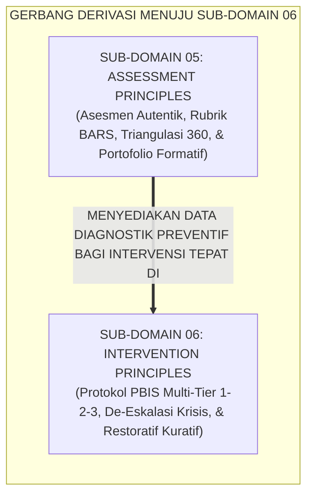

# P2-05: ASSESSMENT PRINCIPLES (PRINSIP ASESMEN KARAKTER) EKOSISTEM TUMBUH
## *Monograf Induk Sub-Domain 05: Arsitektur Master Asesmen Karakter & Psikometri Adab Santri 24 Jam, Rekapitulasi 4 Pilar Asesmen (Asesmen Autentik Wiggins, Rubrik BARS Smith & Kendall, Triangulasi 360 Derajat Ward, & Portofolio Formatif Barrett), serta Gerbang Derivasi Menuju Sub-Domain 06 Intervention Principles*

**Nomor Identifikasi**: `P2-05/MONOGRAF-INDUK-ASSESSMENT-PRINCIPLES/2026`  
**Domain**: `02 Principles` > `05 Assessment Principles`  
**Klasifikasi Naskah**: *Master Sub-Domain Monograph* (Monograf Induk Sub-Domain Prinsip Asesmen Karakter & Adab)  
**Rumpun Disiplin Pengkaji**: Psikometri Karakter Islam (*Al-Qiyas wa at-Taqwim al-Khuluqi*), Sains Asesmen Autentik Pendidikan, Metodologi Observasi Alami 24 Jam, Penjaminan Mutu Evaluasi Karakter Pesantren  

---

> ### 💡 INTISARI PRAKTIS (3 MENIT PAHAM UNTUK ASATIDZ & MUSYRIF)
>
> * **Posisi Sub-Domain 05 Assessment Principles:**  
>   Menjawab pertanyaan mendasar kelima dalam ekosistem pesantren: *"Bagaimanakah mengukur dan mengevaluasi pertumbuhan karakter adab santri secara objektif, adil, transparan, dan berlandaskan bukti nyata perilaku 24 jam (Mizan al-'Adl), tanpa terjebak pada formalisme ujian kertas, bias subjektivitas pengasuh, maupun vonis huruf kering di rapor?"*
> * **Empat Pilar Asesmen Karakter Ekosistem TUMBUH yang Terintegrasi:**  
>   1. **P2-05-01 (Asesmen Autentik & Observasi Alami):** Mengamati adab nyata (*Malakah*) di 3 lokus (Ibadah, Komunal Asrama, Sosial Madrasah) 24 jam bebas efek Hawthorne.  
>   2. **P2-05-02 (Rubrik Perilaku Objektif BARS):** Menggunakan deskripsi jangkar tindakan nyata 4 tingkat; menghapus bias *Halo/Horn Effect* dengan reliabilitas $\kappa \ge 0.80$.  
>   3. **P2-05-03 (Triangulasi Data Multi-Sumber 360 Derajat):** Mengharamkan vonis sepihak; memadukan 4 lensa (Musyrif 35%, Guru 35%, Diri Sendiri 15%, Teman Sebaya 15%).  
>   4. **P2-05-04 (Portofolio Pertumbuhan Formatif):** Menghapus nilai huruf kering; menyajikan laporan naratif 3 pilar, grafik tren PBIS 180 hari, dan *Student-Led Conferences*.
> * **Pijakan Diagnostik Bagi Bimbingan Restoratif (06 Intervention Principles):**  
>   Data asesmen yang akurat dan berkeadilan ini menjadi kompas navigasi bagi **Prinsip-Prinsip Intervensi & Bimbingan Restoratif (*06 Intervention Principles*)**.

---

## 📑 DAFTAR ISI MONOGRAF INDUK

- [BAGIAN I: ARSITEKTUR ONTOLOGIS & POHON HUBUNGAN SUB-DOMAIN 05](#bagian-i-arsitektur-ontologis--pohon-hubungan-sub-domain-05)
  - [1. Posisi Dokumen dalam Taksonomi 11 Domain TUMBUH](#1-posisi-dokumen-dalam-taksonomi-11-domain-tumbuh)
  - [2. Pohon Hubungan Antar-Monograf Sub-Domain 05 Assessment Principles](#2-pohon-hubungan-antar-monograf-sub-domain-05-assessment-principles)
  - [3. Rangkuman 4 Pilar Asesmen Karakter Santri](#3-rangkuman-4-pilar-asesmen-karakter-santri)
  - [4. Penegasan Triad Pertumbuhan Simbiotik dalam Asesmen](#4-penegasan-triad-pertumbuhan-simbiotik-dalam-asesmen)
- [BAGIAN II: KODIFIKASI MATRIKS RESMI & DIREKTORI MONOGRAF TERPADU](#bagian-ii-kodifikasi-matriks-resmi--direktori-monograf-terpadu)
  - [1. Matriks Rujukan Lengkap 5 Berkas Monograf Sub-Domain 05](#1-matriks-rujukan-lengkap-5-berkas-monograf-sub-domain-05)
  - [2. Gerbang Derivasi Menuju Sub-Domain 06 Intervention Principles](#2-gerbang-derivasi-menuju-sub-domain-06-intervention-principles)
- [BAGIAN III: APARATUS AKADEMIS & APENDIKS](#bagian-iii-aparatus-akademis--apendiks)
  - [1. Daftar Pustaka Otoritatif Turats & Sains Global](#1-daftar-pustaka-otoritatif-turats--sains-global)
  - [2. Catatan Kaki Akademis (Footnotes)](#2-catatan-kaki-akademis-footnotes)
  - [3. Glosarium Istilah Kunci Asesmen Karakter Induk](#3-glosarium-istilah-kunci-asesmen-karakter-induk)

---

# BAGIAN I: ARSITEKTUR ONTOLOGIS & POHON HUBUNGAN SUB-DOMAIN 05

---

### 1. Posisi Dokumen dalam Taksonomi 11 Domain TUMBUH

Jika **Sub-Domain 04 Development Principles** mendefinisikan profil maturasi fitrah santri, maka **Sub-Domain 05 Assessment Principles** menetapkan **Bagaimana Karakter Tersebut Diukur, Diverifikasi, dan Dilaporkan Secara Adil dan Ilmiah**:

---

### 2. Pohon Hubungan Antar-Monograf Sub-Domain 05 Assessment Principles

Sub-Domain `05 Assessment Principles` memuat 1 Monograf Induk dan 5 Monograf Riset Khusus yang saling menguatkan secara utuh:

---

### 3. Rangkuman 4 Pilar Asesmen Karakter Santri

1. **Pilar 1: Asesmen Autentik & Observasi Alami (P2-05-01)**:  
   Menilai *Malakah Khuluqiyyah* (kebiasaan adab spontan) dalam ekologi asrama 24 jam melintasi 3 lokus utama (Ibadah, Komunal Asrama, dan Sosial-Akademik). Mengeliminasi total ujian kertas pilihan ganda akhlak dan menghindari *Efek Hawthorne* melalui pengamatan partisipatoris beretika.
2. **Pilar 2: Rubrik Perilaku Objektif BARS (P2-05-02)**:  
   Menegakkan neraca keadilan hisab (*Mizan al-'Adl*) dan kaidah *Al-Yaqinu la Yazulu bisy-Syakk*. Mengganti skala angka abstrak (1–5) dengan *Behaviorally Anchored Rating Scales (BARS)* 4 tingkat (T1–T4), mengeliminasi bias kognitif (*Halo & Horn Effect*), dan mengunci reliabilitas inter-rater pada koefisien $\kappa \ge 0.80$.
3. **Pilar 3: Triangulasi Data Multi-Sumber 360 Derajat (P2-05-03)**:  
   Menegakkan doktrin syariah *Tabayyun* (QS. Al-Hujurat: 6) dan mengharamkan vonis penilai tunggal. Memadukan 4 pilar data: Musyrif Asrama (35%), Guru Madrasah (35%), *Self-Assessment* Reflektif Santri (15%), dan *Positive Peer Feedback* Sahabat (15%), serta menyediakan SOP rekonsiliasi diskrepansi data.
4. **Pilar 4: Portofolio Pertumbuhan Formatif (P2-05-04)**:  
   Menghapus pelaporan huruf kering ("C") di rapor. Menyajikan Laporan Naratif 3 Pilar (Apresiasi, Area Proses, Kemitraan Rumah), visualisasi grafik tren PBIS 180 hari, dan menyelenggarakan *Student-Led Conferences* di mana santri memimpin presentasi pertanggungjawaban dirinya di hadapan orang tua.[^1]

---

### 4. Penegasan Triad Pertumbuhan Simbiotik dalam Asesmen

* **Santri Tumbuh**: Merasa dimanusiakan dan dinilai secara adil, menyadari kekuatan dan peta jalan perbaikan dirinya, dan terbebas dari trauma stigma negatif.
* **Asatidz & Musyrif Tumbuh**: Memiliki panduan evaluasi perilaku yang objektif, transparan, dan mudah digunakan di gawai digital (*Fast-Tap UI*), serta terhindar dari perdebatan sentimen pribadi.
* **Pesantren Tumbuh**: Memiliki sistem penjaminan mutu karakter berbasis data faktual yang akuntabel, kemitraan yang sangat harmonis dengan wali santri, dan menjadi teladan percontohan sistem asesmen PBIS Islam.

---

# BAGIAN II: KODIFIKASI MATRIKS RESMI & DIREKTORI MONOGRAF TERPADU

---

### 1. Matriks Rujukan Lengkap 5 Berkas Monograf Sub-Domain 05

| Kode Berkas | Judul Naskah Monograf | Dewan Keilmuan Pengkaji | Tautan Berkas Markdown |
| :---: | :--- | :--- | :--- |
| **P2-05-01** | **Prinsip Asesmen Autentik dan Observasi Alami** | `pakar-psikometri-dan-validasi-instrumen` `pakar-pengasuhan-asrama` `pakar-metodologi-riset-tumbuh` | [**`Buka Naskah P2-05-01`**](./P2-05-01-Prinsip-Asesmen-Autentik-dan-Observasi-Alami.md) |
| **P2-05-02** | **Prinsip Rubrik Perilaku Objektif dan Deskriptif** | `pakar-psikometri-dan-validasi-instrumen` `pakar-pbis` `pakar-kritikus-dan-auditor-kualitas` | [**`Buka Naskah P2-05-02`**](./P2-05-02-Prinsip-Rubrik-Perilaku-Objektif-dan-Deskriptif.md) |
| **P2-05-03** | **Prinsip Triangulasi Data Multi-Sumber** | `pakar-epistemologi-turats` `pakar-psikologi-sosial-santri` `pakar-perlindungan-anak-dan-advokasi-santri` | [**`Buka Naskah P2-05-03`**](./P2-05-03-Prinsip-Triangulasi-Data-Multi-Sumber.md) |
| **P2-05-04** | **Prinsip Portofolio Pertumbuhan Formatif** | `pakar-arsitektur-digital-pesantren` `pakar-pedagogi-master-guru` `pakar-social-emotional-learning` | [**`Buka Naskah P2-05-04`**](./P2-05-04-Prinsip-Portofolio-Pertumbuhan-Formatif.md) |
| **P2-05-05** | **Sintesis Assessment Principles TUMBUH** | `pakar-filosofi-tumbuh` `pakar-kritikus-dan-auditor-kualitas` `pakar-psikometri-dan-validasi-instrumen` | [**`Buka Naskah P2-05-05`**](./P2-05-05-Sintesis-Assessment-Principles-TUMBUH.md) |

---

### 2. Gerbang Derivasi Menuju Sub-Domain 06 Intervention Principles

---

# BAGIAN III: APARATUS AKADEMIS & APENDIKS

---

### 1. Daftar Pustaka Otoritatif Turats & Sains Global

1. **Al-Qur'an al-Karim wa Tarjamatu Ma'anih**.
2. **Al-Baihaqi, Abu Bakr Ahmad bin al-Husain**. (1424 H). *As-Sunan al-Kubra*. Beirut: Dar al-Kutub al-'Ilmiyyah.
3. **As-Suyuthi, Jalaluddin Abdurrahman**. (1403 H). *Al-Asybah wan-Nazha'ir*. Beirut: Dar al-Kutub al-'Ilmiyyah.
4. **Izzuddin bin Abdis Salam, Abdul Aziz bin Abdissalam as-Sulami**. (1999). *Qawa'id al-Ahkam fi Mashalih al-Anam*. Damaskus: Dar al-Qalam.
5. **Al-Ghazali, Abu Hamid Muhammad bin Muhammad**. (2011). *Ihya 'Ulumiddin*. Beirut: Dar al-Ma'rifah.
6. **Wiggins, G., & McTighe, J.**. (2005). *Understanding by Design* (2nd ed.). ASCD.
7. **Smith, P. C., & Kendall, L. M.**. (1963). *Retranslation of expectations: BARS*. Journal of Applied Psychology.
8. **Ward, P.**. (1997). *360-Degree Feedback*. Institute of Personnel and Development.
9. **Barrett, H. C.**. (2007). *Researching electronic portfolios and learner engagement*. Journal of Adolescent & Adult Literacy.
10. **Horner, R. H., & Sugai, G.**. (2015). *School-wide PBIS: The research base*. Remedial and Special Education.

---

### 2. Catatan Kaki Akademis (*Footnotes*)

[^1]: Wiggins & McTighe (2005), *Understanding by Design*; Smith & Kendall (1963), *BARS*; Ward (1997), *360-Degree Feedback*; Barrett (2007), *Electronic Portfolios*.

---

### 3. Glosarium Istilah Kunci Asesmen Karakter Induk

1. **Asesmen Autentik**: Evaluasi unjuk kerja adab santri dalam situasi kehidupan nyata 24 jam di asrama dan madrasah.
2. **BARS Framework**: Skala penilaian berbasis deskriptor perilaku operasional konkret yang teramati pada setiap level.
3. **Triangulasi 360 Derajat**: Penggabungan data observasi dari empat sudut pandang (Musyrif, Guru, Santri, dan Teman Sebaya).
4. **Portofolio Formatif**: Dokumentasi rekam jejak pertumbuhan karakter berbasis narasi deskriptif dan grafik visual PBIS 180 hari.
5. **Student-Led Conferences**: Mekanisme pembagian rapor di mana santri memimpin presentasi portofolio kemajuannya di depan orang tua.
6. **Mizan al-'Adl**: Prinsip syariat mengenai keharusan menegakkan timbangan penilaian yang adil, presisi, dan objektif.
7. **Tabayyun**: Kewajiban klarifikasi dan verifikasi mendalam atas fakta sebelum membuat kesimpulan evaluasi.
8. **Inter-Rater Reliability**: Tingkat kesepakatan skor antara penilai yang berbeda (diukur dengan koefisien Cohen's Kappa $\kappa \ge 0.80$).
9. **Triad Pertumbuhan Simbiotik**: Prinsip mutlak di mana sistem asesmen secara serempak menumbuhkan Santri, memuliakan Pendidik, dan memperkokoh Lembaga.
