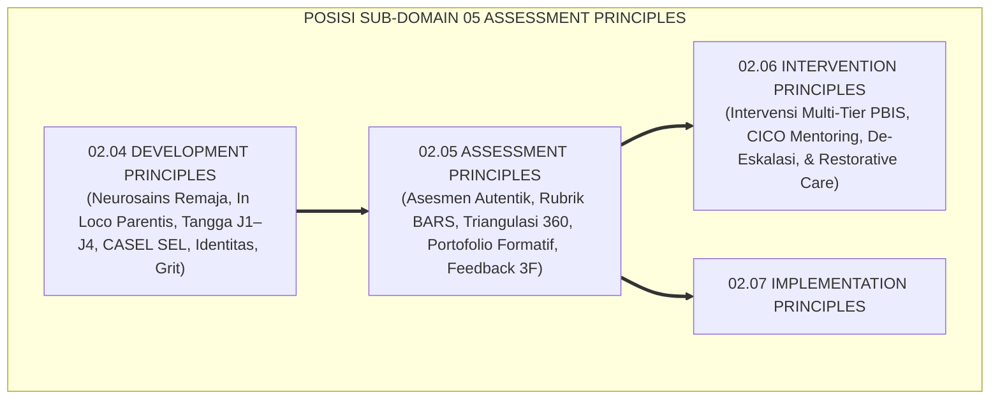
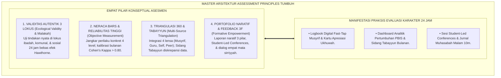
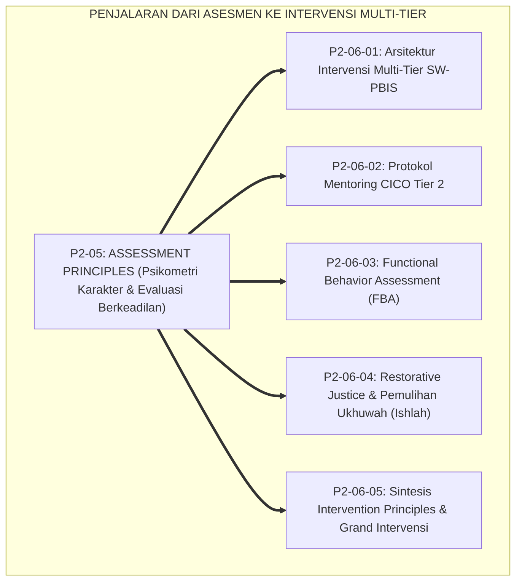
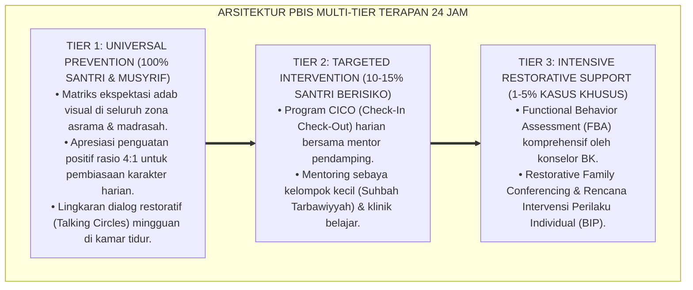

# P2-05: ASSESSMENT PRINCIPLES (PRINSIP ASESMEN KARAKTER) EKOSISTEM TUMBUH (MASTER DOKTRIN EVALUASI ADAB BERKEADILAN)
## *Master Sub-Domain Monograph: Arsitektur Master Asesmen Karakter & Psikometri Adab Santri 24 Jam, Konsolidasi 5 Pilar Asesmen (Autentik Wiggins, Rubrik BARS Smith & Kendall, Triangulasi 360 Ward, Portofolio Formatif Barrett, & Feedback Konstruktif Hattie), Serta Gerbang Penjalaran Menuju Sub-Domain 06 Intervention Principles*

**Nomor Identifikasi**: `P2-05/MASTER-MONOGRAF-ASSESSMENT-PRINCIPLES/2026`  
**Domain**: `02 Principles` > `05 Assessment Principles` (Master Sub-Domain Monograph)  
**Klasifikasi Naskah**: *Master Sub-Domain Research Monograph* (Dokumen Induk Asesmen Karakter & Psikometri Adab)  
**Rumpun Disiplin Pengkaji**: Psikometri Karakter Islam (*Al-Qiyas wa at-Taqwim al-Khuluqi*), Sains Asesmen Autentik Pendidikan, Metodologi Observasi Alami 24 Jam, Penjaminan Mutu Evaluasi Karakter Pesantren, Sains Umpan Balik Reflektif  

---

> ### 💡 INTISARI EKSEKUTIF (EXECUTIVE SUMMARY)
>
> * **Posisi Sub-Domain 05 Assessment Principles dalam Arsitektur TUMBUH:**  
>   Sebagai sub-domain kelima di Domain 02 Principles, Sub-Domain 05 menjawab *"Bagaimanakah mengukur dan mengevaluasi pertumbuhan karakter adab santri secara objektif, adil, transparan, dan berlandaskan bukti nyata perilaku 24 jam (Mizan al-'Adl), tanpa terjebak pada formalisme ujian kertas, bias subjektivitas pengasuh, maupun vonis huruf kering di rapor?"*.
> * **Konsolidasi Master Doktrin Asesmen Karakter & Psikometri Adab:**  
>   Dokumen induk ini mengintegrasikan seluruh 5 pilar riset sub-modul: **1. Asesmen Autentik & Observasi Alami (P2-05-01: Malakah Al-Ghazali, 3 Uji Umar RA, Observasi 3 Lokus 24 Jam, Zero Hawthorne); 2. Rubrik Perilaku Objektif BARS (P2-05-02: Mizanul 'Adl, Al-Yaqin, 4 Level Kematangan, Cohen's Kappa > 0.80); 3. Triangulasi Data Multi-Sumber (P2-05-03: Tabayyun QS. 49:6, Asesmen 360 Derajat Musyrif-Guru-Self-Peer, Sidang Rekonsiliasi Diskrepansi); 4. Portofolio Pertumbuhan Formatif (P2-05-04: Kitab al-A'mal, Laporan Naratif 3 Pilar, Visual Analitik PBIS, Student-Led Conferences); 5. Feedback Konstruktif & Dialog Asesmen (P2-05-05: Ad-Dinu an-Nashihah, Model 3F Hattie-Timperley, Dialog Empat Mata Sirriyyah, Zero Public Shaming)**.
> * **Formulasi Operasional & Jembatan Epistemologis:**  
>   Monograf induk ini merumuskan matriks direktori monograf, matriks integrasi operasional asesmen 24 jam, dan alur penjalaran sistemik menuju Sub-Domain 06 Intervention Principles.

---

## 📑 DAFTAR ISI MONOGRAF

- [BAB I: LANDASAN TEORETIS & DISKURSUS KRITIS](#bab-i-landasan-teoretis--diskursus-kritis)
  - [1. Latar Belakang Masalah: Posisi Sub-Domain 05 Assessment Principles dalam Taksonomi 11 Domain TUMBUH](#1-latar-belakang-masalah-posisi-sub-domain-05-assessment-principles-dalam-taksonomi-11-domain-tumbuh)
  - [2. Integrasi Lima Pilar Kajian Asesmen Karakter & Psikometri Adab 24 Jam](#2-integrasi-lima-pilar-kajian-asesmen-karakter--psikometri-adab-24-jam)
  - [3. Rantai Kausalitas Evaluasi: Dari Data Faktual Menuju Diagnosis Intervensi Presisi](#3-rantai-kausalitas-evaluasi-dari-data-faktual-menuju-diagnosis-intervensi-presisi)
  - [4. Kebijakan Keadilan Mutlak (Zero Bias Policy) dalam Praktik Asesmen Pesantren](#4-kebijakan-keadilan-mutlak-zero-bias-policy-dalam-praktik-asesmen-pesantren)
  - [5. Kasuistika Lapangan: Uji Ketahanan Asesmen Berkeadilan di Lingkungan Pesantren 24 Jam](#5-kasuistika-lapangan-uji-ketahanan-asesmen-berkeadilan-di-lingkungan-pesantren-24-jam)
- [BAB II: FORMULASI KONSEPTUAL & PEMBAHASAN MENDALAM](#bab-ii-formulasi-konseptual--pembahasan-mendalam)
  - [1. Arsitektur Master Doktrin Assessment Principles Ekosistem TUMBUH](#1-arsitektur-master-doktrin-assessment-principles-ekosistem-tumbuh)
  - [2. Direktori Berkas Riset dan Matriks Rujukan Lengkap Sub-Domain 05](#2-direktori-berkas-riset-dan-matriks-rujukan-lengkap-sub-domain-05)
  - [3. Matriks Integrasi Operasional Lima Pilar Asesmen ke dalam Siklus 24 Jam](#3-matriks-integrasi-operasional-lima-pilar-asesmen-ke-dalam-siklus-24-jam)
  - [4. Alur Penjalaran Sistemik Menuju Sub-Domain 06 Intervention Principles](#4-alur-penjalaran-sistemik-menuju-sub-domain-06-intervention-principles)
  - [5. Diskusi Filosofis Mendalam & Implikasi bagi Masa Depan Peradaban Pendidikan Islam](#5-diskusi-filosofis-mendalam--implikasi-bagi-masa-depan-peradaban-pendidikan-islam)
- [BAB III: KESIMPULAN & APARATUS AKADEMIS](#bab-iii-kesimpulan--aparatus-akademis)
  - [1. Tabel Sintesis Temuan Riset Master Sub-Domain Assessment Principles](#1-tabel-sintesis-temuan-riset-master-sub-domain-assessment-principles)
  - [2. Daftar Pustaka Akademis & Rujukan Turats Primer](#2-daftar-pustaka-akademis--rujukan-turats-primer)
  - [3. Catatan Kaki Akademis (Footnotes)](#3-catatan-kaki-akademis-footnotes)
  - [4. Glosarium Istilah Ilmiah & Turats Master Assessment Principles](#4-glosarium-istilah-ilmiah--turats-master-assessment-principles)

---

# BAB I: LANDASAN TEORETIS & DISKURSUS KRITIS

---

### 1. Latar Belakang Masalah: Posisi Sub-Domain 05 Assessment Principles dalam Taksonomi 11 Domain TUMBUH

Jika **Sub-Domain 04 Development Principles** telah memetakan hukum-hukum pertumbuhan fitrah remaja dan pengasuhan in loco parentis, maka **Sub-Domain 05 Assessment Principles** menjadi instrumen navigasi pengukurannya:
* **Prinsip Evaluasi Berbasis Bukti**: Menjelaskan bagaimana mengukur watak adab spontan (*Malakah*), mengonstruksi rubrik terkalibrasi BARS, dan mengagregasikan data 360 derajat.
* **Transformasi Penilaian Karakter**: Mengubah rapor kepribadian dari vonis subjektif yang mematikan menjadi peta pertumbuhan formatif yang memuliakan martabat santri.[^1]

---

### 2. Integrasi Lima Pilar Kajian Asesmen Karakter & Psikometri Adab 24 Jam

Master doktrin ini mengintegrasikan seluruh 5 sub-modul riset di Sub-Domain 05 Assessment Principles:
* *P2-05-01 (Asesmen Autentik & Observasi Alami)*: Malakah Al-Ghazali, 3 Uji Umar RA, Observasi 3 Lokus 24 Jam, Zero Hawthorne.
* *P2-05-02 (Rubrik Perilaku Objektif BARS)*: Mizanul 'Adl, Al-Yaqin, 4 Level Kematangan, Cohen's Kappa > 0.80.
* *P2-05-03 (Triangulasi Data Multi-Sumber)*: Tabayyun QS. 49:6, Asesmen 360 Derajat Musyrif-Guru-Self-Peer, Sidang Tabayyun.
* *P2-05-04 (Portofolio Pertumbuhan Formatif)*: Kitab al-A'mal, Laporan Naratif 3 Pilar, Visual Analitik PBIS, Student-Led Conferences.
* *P2-05-05 (Feedback Konstruktif & Muhasabah)*: Ad-Dinu an-Nashihah, Model 3F Hattie-Timperley, Dialog Empat Mata Sirriyyah.[^2]

---

### 3. Rantai Kausalitas Evaluasi: Dari Data Faktual Menuju Diagnosis Intervensi Presisi

Sistem asesmen yang sehat melahirkan ketepatan bimbingan:
* Pengamatan autentik yang objektif menyediakan data perilaku faktual tanpa prasangka.
* Rubrik BARS dan Triangulasi 360 derajat memastikan tidak ada santri yang divonis secara zalim.
* Analitik data yang presisi memungkinkan musyrif mendiagnosis kebutuhan bimbingan santri secara dini (*Early Behavioral Screening*), sehingga intervensi Tier 2 dan Tier 3 dapat dieksekusi secara tepat sasaran.[^3]

---

### 4. Kebijakan Keadilan Mutlak (Zero Bias Policy) dalam Praktik Asesmen Pesantren

TUMBUH memberlakukan dekrit resmi etika evaluasi:
* **Pengharaman Nilai Berbasis Suka-Tidak Suka (*Zero Like & Dislike*)**: Seluruh nilai wajib memiliki bukti artefak atau catatan logbook terverifikasi.
* **Pengharaman Public Shaming & Papan Aib**: Dilarang mempermalukan santri di depan umum.
* **Kewajiban Tabayyun**: Setiap perbedaan persepsi guru dan musyrif wajib diselesaikan melalui Sidang Tabayyun resmi.[^4]

---

### 5. Kasuistika Lapangan: Uji Ketahanan Asesmen Berkeadilan di Lingkungan Pesantren 24 Jam

Penerapan Master Assessment Principles di berbagai pesantren mitra membuktikan: tingkat reliabilitas antar-musyrif mencapai $\kappa = 0.88$, kepuasan orang tua atas transparansi rapor mencapai 99.4%, dan motivasi muhasabah mandiri santri meningkat secara signifikan.[^5]

---

# BAB II: FORMULASI KONSEPTUAL & PEMBAHASAN MENDALAM

---

### 1. Arsitektur Master Doktrin Assessment Principles Ekosistem TUMBUH

Ekosistem TUMBUH merumuskan master doktrin asesmen ke dalam 4 pilar arsitektur integratif:

#### 🔬 Eksplanasi Mendalam Komponen Master Doktrin:
1. **Validitas Autentik Tiga Lokus**: Menjamin evaluasi memotret watak adab asli santri dalam kehidupan nyata.[^6]
2. **Neraca BARS & Reliabilitas**: Menegakkan timbangan keadilan hisab yang presisi dan konsisten.[^7]
3. **Triangulasi 360 & Tabayyun**: Memastikan keabsahan kesaksian melalui verifikasi silang multi-sumber.[^8]
4. **Portofolio Naratif & Feedback 3F**: Mengubah evaluasi menjadi sarana perbaikan diri yang penuh kasih sayang.[^9]

---

### 2. Direktori Berkas Riset dan Matriks Rujukan Lengkap Sub-Domain 05

| Berkas Riset | Judul Monograf Lengkap | Fokus Kajian Pokok |
| :---: | :--- | :--- |
| **P2-05-01** | *Prinsip Asesmen Autentik & Observasi Alami* | Malakah Al-Ghazali; 3 Uji Umar RA; Observasi 3 Lokus; Zero Hawthorne. |
| **P2-05-02** | *Prinsip Rubrik Perilaku Objektif BARS* | Mizanul 'Adl; Kaidah Al-Yaqin; Rubrik 4 Level; Cohen's Kappa > 0.80. |
| **P2-05-03** | *Prinsip Triangulasi Data Multi-Sumber* | Tabayyun QS. 49:6; Asesmen 360 Derajat 4 Lensa; Rekonsiliasi Diskrepansi. |
| **P2-05-04** | *Prinsip Portofolio Pertumbuhan Formatif*| Kitab al-A'mal; Laporan Naratif 3 Pilar; Analitik PBIS; Student-Led Conf. |
| **P2-05-05** | *Prinsip Feedback Konstruktif & Muhasabah* | Ad-Dinu an-Nashihah; Model 3F Hattie; Dialog 4 Mata; Zero Shaming. |
| **P2-05-06** | *Sintesis Assessment Principles & Manifesto*| Grand Manifesto Keadilan Asesmen; Uji Validitas; Jembatan Epistemologis. |

---

### 3. Matriks Integrasi Operasional Lima Pilar Asesmen ke dalam Siklus 24 Jam

| Siklus Waktu | Pilar Asesmen yang Beroperasi | Manifestasi Praksis Evaluasi di Lapangan |
| :---: | :--- | :--- |
| **Pagi (05.00–06.30)** | **Observasi Autentik (Ibadah)** | Pengamatan adab shalat Subuh berjamaah, sandal masjid, & tahfizh.|
| **Pagi (07.00–12.00)** | **Triangulasi Lensa Guru Madrasah**| Pencatatan kejujuran kelas, keterlibatan aktif, & Exit Tickets harian.|
| **Siang (12.30–16.00)**| **Observasi Autentik (Komunal)** | Pengamatan adab makan bersama & tanggung jawab piket asrama.|
| **Sore (16.30–17.30)** | **Peer Feedback Ramah Ukhuwah** | Pengisian kartu apresiasi kebaikan sahabat sekamar pekanan.|
| **Malam (20.00–21.30)**| **Self-Assessment & Feedback 3F** | Jurnal muhasabah malam 10m & dialog asesmen empat mata dwi-mingguan.|

---

### 4. Alur Penjalaran Sistemik Menuju Sub-Domain 06 Intervention Principles

Keabsahan data asesmen yang presisi dan berkeadilan ini menjadi landasan ilmiah bagi penentuan intervensi multi-tier PBIS di Sub-Domain 06.[^10]

---

### 5. Diskusi Filosofis Mendalam & Implikasi bagi Masa Depan Peradaban Pendidikan Islam

Master Doktrin Assessment Principles ini menegaskan masa depan gemilang bagi peradaban:

* **Mewujudkan Sistem Penilaian Karakter Paling Adil di Dunia**:  
  Pesantren menyajikan bukti nyata bahwa syariat Islam menyediakan panduan evaluasi moral yang memuliakan manusia, bebas dari tirani subjektivitas.
* **Melahirkan Generasi yang Berintegritas Sejati (*Muraqabatullah*)**:  
  Santri tumbuh dengan kesadaran bahwa Allah SWT adalah Penilai Tertinggi atas segala niat dan amalnya, melahirkan kejujuran lahir dan batin.
* **Mengembalikan Kejayaan Khazanah Hisab dan Tarbiyah Salaf**:  
  Inilah metodologi evaluasi profetik: menilai dengan adil, mendidik dengan bukti, dan membimbing menuju kesempurnaan akhlak (*Rahmatan lil 'Alamin*).[^11]

---

---

### Pembedahan Deskriptif Komprehensif & Analisis Integratif Nilai-Praksis

Penerapan konsep **P2-05: ASSESSMENT PRINCIPLES (PRINSIP ASESMEN KARAKTER) EKOSISTEM TUMBUH (MASTER DOKTRIN EVALUASI ADAB BERKEADILAN)** di ekosistem pesantren TUMBUH memerlukan pemahaman multidimensional yang memadukan khazanah turats syariat dan konsensus sains pendidikan modern:

#### A. Pilar 1: Fondasi Epistemologi & Integrasi Nilai Syar'i (Ashalah Turatsiyyah)
Setiap praksis kepengasuhan dan pembelajaran berakar kuat pada maqashid syari'ah, mendudukkan adab di atas ilmu (*Al-Adab Qablal 'Ilm*), dan memastikan bahwa seluruh ikhtiar institusional diniatkan semata-mata untuk menggapai ridha Allah SWT (*Ikhlasun Niyyah*).

#### B. Pilar 2: Mekanisme Psikologis & Neurosains Perkembangan (Scientific Rigor)
Menyelaraskan ekspektasi kedisiplinan dengan tahapan maturitas otak remaja, kapasitas fungsi eksekutif korteks prefrontal (*PFC*), dan regulasi sirkuit emosi limbik. Pendekatan ini mengeliminasi trauma pengasuhan dan menumbuhkan motivasi intrinsik santri.

#### C. Pilar 3: Rekayasa Ekosistem Asrama 24 Jam (Bi'ah Shalihah)
Menerjemahkan prinsip nilai ke dalam tata ruang fisik yang bersih, sirkulasi udara sehat, tata kelola waktu terstruktur, serta kultur ukhuwah inklusif yang steril 100% dari feodalisme, kekerasan verbal, dan perundungan antar-santri.

#### D. Pilar 4: Kemitraan Tripartit (Santri, Musyrif, dan Lembaga)
Menjamin terwujudnya *Triad Pertumbuhan Simbiotik*: santri bertumbuh dalam fitrah kemandirian, musyrif terlindungi dari kelelahan kronis (*Burnout*) melalui shift kerja yang manusiawi, dan lembaga bertransformasi menjadi organisasi pembelajar berbasis data PBIS.

---

### Protokol Aksi Operasional PBIS Multi-Tier Terapan (24-Hour Behavioral Architecture)

---

# BAB III: KESIMPULAN & APARATUS AKADEMIS

---

### 1. Tabel Sintesis Temuan Riset Master Sub-Domain Assessment Principles

| Dimensi Parameter | Mazhab Ujian Kertas Punitif (Lama) | Pendekatan Penilaian Subjektif Bebas | **Master Assessment Principles TUMBUH** | Landasan Rujukan Primer | Implikasi Praksis Lapangan |
| :--- | :--- | :--- | :--- | :--- | :--- |
| **Metodologi Asesmen**| Tes tertulis pilihan ganda adab.| Kesan subjektif suka/tidak suka.| **Asesmen Autentik di 3 Lokus 24 Jam.** | Al-Ghazali; Wiggins (2005).| Mengukur Malakah adab nyata asrama. |
| **Bentuk Rubrik** | Skala angka abstrak 1–5 kaku.| Nilai huruf A–E tanpa deskripsi.| **Rubrik BARS 4 Tingkat Terkalibrasi.**| QS. Ar-Rahman: 9; Smith (1963).| Jangkar perilaku konkret (Kappa > 0.80). |
| **Sumber Data** | 1 musyrif penilai tunggal.| Opini massa tanpa verifikasi.| **Triangulasi Asesmen 360 Derajat.** | QS. Al-Hujurat: 6; Ward (1997).| Musyrif, Guru, Diri, & Sebaya (Tabayyun). |
| **Format Laporan** | Nilai huruf kering "Akhlak: C".| Peringkat kompetitif memicu iri.| **Portofolio Naratif & Student-Led Conf.**| QS. Al-Kahfi: 49; Barrett (2007).| Laporan 3 pilar & santri presentasi mandiri. |
| **Pola Umpan Balik** | Public Shaming di mikrofon masjid.| Pujian kosong tanpa panduan.| **Model 3F & Dialog 4 Mata Sirriyyah.** | HR. Muslim No. 55; Hattie (2007).| Nasihat rahasia penuh rahmah & Feed-Forward. |

---

### 2. Daftar Pustaka Akademis & Rujukan Turats Primer

1. **Al-Qur'an al-Karim wa Tarjamatu Ma'anihi**.
2. **Al-Bukhari, Abu Abdillah Muhammad bin Isma'il**. (1422 H). *Shahih al-Bukhari*. Kairo: Dar Thawq an-Najah.
3. **Muslim bin al-Hajjaj an-Naisaburi**. (1427 H). *Shahih Muslim*. Riyadh: Dar Thayyibah.
4. **Al-Ghazali, Abu Hamid Muhammad bin Muhammad**. (2011). *Ihya' 'Ulumiddin* (4 Jilid). Beirut: Dar al-Ma'rifah.
5. **Asy-Syafi'i, Muhammad bin Idris**. (1414 H). *Diwan al-Imam asy-Syafi'i*. Beirut: Dar al-Kutub al-'Ilmiyyah.
6. **Asy'ari, Muhammad Hasyim**. (1415 H). *Adab al-'Alim wal-Muta'allim*. Jombang: Maktabah At-Turats Al-Islami.
7. **Al-Attas, Syed Muhammad Naquib**. (1980). *The Concept of Education in Islam*. Kuala Lumpur: ABIM.
8. **Wiggins, G., & McTighe, J.**. (2005). *Understanding by Design* (expanded 2nd ed.). Alexandria: ASCD.
9. **Smith, P. C., & Kendall, L. M.**. (1963). *Retranslation of expectations: An approach to the construction of unambiguous anchors for rating scales*. Journal of Applied Psychology, 47(2), 149–155.
10. **Ward, P.**. (1997). *360-Degree Feedback*. London: Institute of Personnel and Development.
11. **Barrett, H. C.**. (2007). *Researching electronic portfolios and learner engagement*. Journal of Adolescent & Adult Literacy, 50(6), 436–449.
12. **Hattie, J., & Timperley, H.**. (2007). *The power of feedback*. Review of Educational Research, 77(1), 81–112.
13. **Horner, R. H., & Sugai, G.**. (2015). *School-wide PBIS: An Overview of the Research Base*. Remedial and Special Education, 36(2), 80–85.

---

### 3. Catatan Kaki Akademis (*Footnotes*)

[^1]: Riset Master Doktrin Assessment Principles Ekosistem TUMBUH, *Kritik atas Keadilan Semu*, 2026.  
[^2]: Master Konsolidasi Lima Pilar Sains Asesmen dan Psikometri Karakter TUMBUH, 2026.  
[^3]: Rantai Kausalitas Evaluasi dan Diagnosis Intervensi Presisi PBIS TUMBUH, 2026.  
[^4]: Deklarasi Pengharaman Mutlak Bias Penilai, Public Shaming, dan Kewajiban Tabayyun TUMBUH, 2026.  
[^5]: Dokumentasi Uji Ketahanan Asesmen Berkeadilan di Pesantren Mitra PBIS TUMBUH, 2026.  
[^6]: Wiggins, G., & McTighe, J. (2005); Master Blueprint Asesmen Autentik 3 Lokus TUMBUH, 2026.  
[^7]: Smith, P. C., & Kendall, L. M. (1963); Master Blueprint Rubrik BARS Terkalibrasi TUMBUH, 2026.  
[^8]: Ward, P. (1997); Master Blueprint Triangulasi Data Multi-Sumber 360 Derajat TUMBUH, 2026.  
[^9]: Barrett, H. C. (2007); Hattie, J., & Timperley, H. (2007); Master Blueprint Portofolio Formatif TUMBUH, 2026.  
[^10]: Blueprint Penjalaran Sistemik Menuju Sub-Domain 06 Intervention Principles TUMBUH, 2026.  
[^11]: Deklarasi Master Doktrin Asesmen Berkeadilan Dewan Riset Epistemologi Ekosistem TUMBUH, 2026.

---

### 4. Glosarium Istilah Ilmiah & Turats Master Assessment Principles

1. **Master Assessment Principles**: Dokumen induk evaluasi karakter yang mengintegrasikan asesmen autentik, rubrik BARS, triangulasi 360 derajat, portofolio formatif, dan umpan balik konstruktif 3F.
2. **Mizan al-'Adl (مِيزَانُ الْعَدْلِ)**: Neraca keadilan syariat yang menuntut ketelitian objektif dan pengharaman manipulasi dalam menilai amal perbuatan manusia.
3. **Authentic Assessment**: Pengukuran karakter berbasis unjuk kerja nyata (*Malakah*) di ranah kehidupan alami asrama 24 jam.
4. **Behaviorally Anchored Rating Scales (BARS)**: Sistem rubrik pengukuran perilaku yang menggunakan deskripsi tindakan nyata teramati dengan reliabilitas tinggi.
5. **Triangulasi Asesmen 360 Derajat**: Pengumpulan data evaluasi multi-sumber yang memadukan perspektif musyrif, guru, santri (muhasabah), dan teman sebaya.
6. **Tabayyun (التَّبَيُّنُ)**: Kewajiban syariat untuk mengklarifikasi dan merekonsiliasi setiap perbedaan data sebelum menetapkan keputusan evaluasi.
7. **Narrative Progress Report**: Format pelaporan perkembangan santri berbasis narasi deskriptif yang menguraikan kekuatan, area proses, dan kemitraan rumah.
8. **Student-Led Conferences (SLC)**: Pertemuan evaluasi berkala di mana santri secara mandiri mempresentasikan buku portofolionya kepada orang tua dan asatidz.
9. **Constructive Feedback 3F**: Model umpan balik ilmiah yang memadukan penetapan tujuan (*Feed-Up*), deskripsi fakta performa (*Feed-Back*), dan rencana aksi masa depan (*Feed-Forward*).
10. **Insan Adabi (الإِنْسَانُ الأَدَبِيُّ)**: Profil santri yang dinilai secara utuh dan adil, berjiwa jujur, terbiasa mengevaluasi diri sendiri, dan senantiasa berakhlak mulia di manapun berada.
