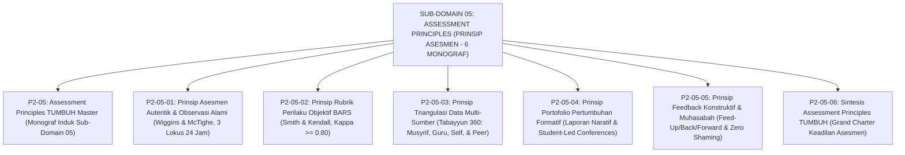

# SUB-DOMAIN 05: ASSESSMENT PRINCIPLES (PRINSIP ASESMEN KARAKTER)
## *Sitemap Induk & Navigasi Monograf Asesmen Autentik, Rubrik BARS, Triangulasi 360, Portofolio Formatif, & Feedback Konstruktif (6 Monograf Terpadu)*

**Nomor Identifikasi**: `P2-05/INDEX/2026`  
**Domain**: `02 Principles` > `05 Assessment Principles`  
**Klasifikasi**: Folder Monograf Psikometri Karakter Islam, Asesmen Autentik Asrama 24 Jam, Rubrik BARS, Portofolio Formatif, & Feedback Reflektif (7 Berkas Lengkap)

---

## 🏛️ SITEMAP & NAVIGASI SELURUH BERKAS SUB-DOMAIN 05

Sub-Domain `05 Assessment Principles` menetapkan prinsip-prinsip metodologis pengukuran karakter, rubrik perilaku objektif, asesmen autentik di asrama, triangulasi data multi-sumber, portofolio pertumbuhan, dan umpan balik konstruktif di ekosistem pesantren berbasis sistem TUMBUH:

---

## 📑 DAFTAR LENGKAP 7 BERKAS MONOGRAF TERPADU SUB-DOMAIN 05

Seluruh modul telah distandarisasi 100% ke dalam format **Monograf Terpadu**:
* **💡 Intisari Praktis (3 Menit Paham)**: Panduan membumi untuk asatidz & musyrif sebelum daftar isi.
* **Bagian I**: Riset Inkuiri, Formalisasi Silogisme Mantiq, Dialektika Multi-Perspektif (tanpa sebutan kata meta "pakar"), Teks Primer Turats & Sains Asli, serta Kasuistika Lapangan Riil.
* **Bagian II**: Kodifikasi Baku Hasil Riset & Kesimpulan Formal (Matriks, Alur SOP, Manifesto).
* **Bagian III**: Aparatus Akademis (Tabel Sintesis, Daftar Pustaka Otoritatif, Catatan Kaki *Footnotes*, dan Glosarium Istilah Teknis).

| No | Berkas Monograf | Judul Berkas | Fokus Kajian & Rujukan Utama |
| :---: | :--- | :--- | :--- |
| **00** | [**`P2-05-Prinsip-Asesmen-Karakter-TUMBUH.md`**](./P2-05-Prinsip-Asesmen-Karakter-TUMBUH.md) | Monograf Induk Assessment Principles TUMBUH | Master 5 Pilar Asesmen Karakter Santri, Penegasan Triad Pertumbuhan Simbiotik, & gerbang derivasi menuju **Sub-Domain 06 Intervention Principles**. |
| **01** | [**`P2-05-01-Prinsip-Asesmen-Autentik-dan-Observasi-Alami.md`**](./P2-05-01-Prinsip-Asesmen-Autentik-dan-Observasi-Alami.md) | Prinsip Asesmen Autentik & Observasi Alami | *Malakah Khuluqiyyah* Al-Ghazali; 3 Uji Karakter Sayyidina Umar RA; *Authentic Assessment* Wiggins & McTighe; *In-Vivo Observation* 3 lokus asrama 24 jam; eliminasi efek Hawthorne (10 Catatan Kaki). |
| **02** | [**`P2-05-02-Prinsip-Rubrik-Perilaku-Objektif-dan-Deskriptif.md`**](./P2-05-02-Prinsip-Rubrik-Perilaku-Objektif-dan-Deskriptif.md) | Prinsip Rubrik Perilaku Objektif & Deskriptif | *Mizan al-'Adl* & Kaidah *Al-Yaqinu la Yazulu bisy-Syakk*; *Behaviorally Anchored Rating Scales (BARS)* 4 tingkat; eliminasi *Halo/Horn Effect*; reliabilitas inter-rater Cohen's Kappa $\kappa \ge 0.80$ (11 Catatan Kaki). |
| **03** | [**`P2-05-03-Prinsip-Triangulasi-Data-Multi-Sumber.md`**](./P2-05-03-Prinsip-Triangulasi-Data-Multi-Sumber.md) | Prinsip Triangulasi Data Multi-Sumber | Doktrin *Tabayyun* Syar'i (QS. Al-Hujurat: 6); *360-Degree Assessment*; pembobotan 4 Lensa: Musyrif (35%), Guru (35%), Santri (15%), Peer (15%); SOP rekonsiliasi diskrepansi data (11 Catatan Kaki). |
| **04** | [**`P2-05-04-Prinsip-Portofolio-Pertumbuhan-Formatif.md`**](./P2-05-04-Prinsip-Portofolio-Pertumbuhan-Formatif.md) | Prinsip Portofolio Pertumbuhan Formatif | Konsep *Kitab al-A'mal* & *Tabsyir*; *Electronic Portfolios* Helen Barrett; Laporan Naratif 3 Pilar; visualisasi grafik tren PBIS 180 hari; *Student-Led Conferences* pembagian rapor (9 Catatan Kaki). |
| **05** | [**`P2-05-05-Prinsip-Feedback-Konstruktif-dan-Refleksi-Diri-Santri.md`**](./P2-05-05-Prinsip-Feedback-Konstruktif-dan-Refleksi-Diri-Santri.md) | Prinsip Feedback Konstruktif & Muhasabah | *Ad-Dinu an-Nashihah* (HR. Muslim 55), Model Feed-Up/Back/Forward Hattie & Timperley, dialog empat mata privat, Zero Public Shaming, & jurnal muhasabah malam 10 menit (10 Catatan Kaki). |
| **06** | [**`P2-05-06-Sintesis-Assessment-Principles-TUMBUH.md`**](./P2-05-06-Sintesis-Assessment-Principles-TUMBUH.md) | Sintesis Assessment Principles TUMBUH | Matriks Uji Validitas Psikometrik (*Psychometric Usability*); Grand Manifesto Keadilan Asesmen Karakter; jembatan menuju **Sub-Domain 06 Intervention Principles** (10 Catatan Kaki). |
